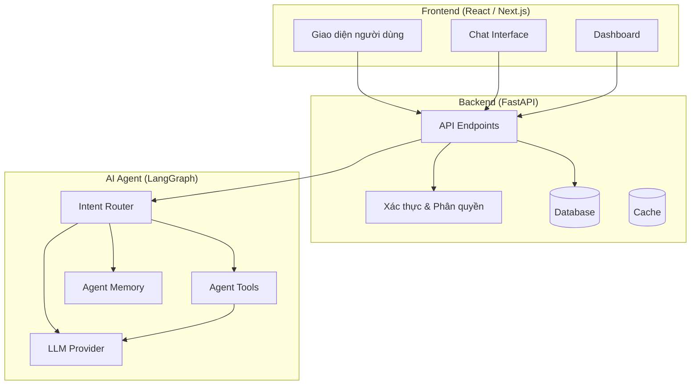
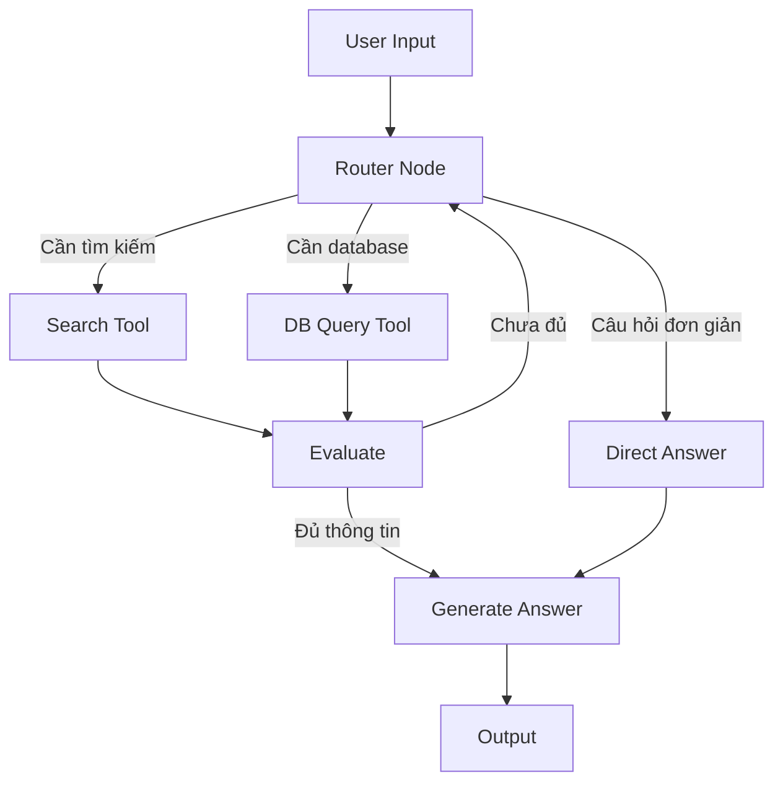
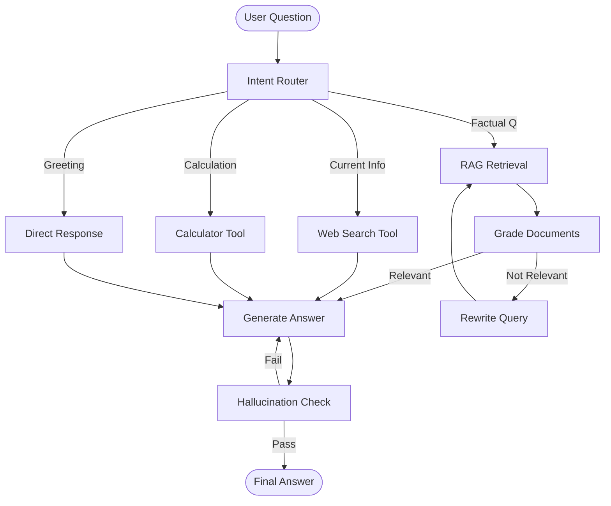
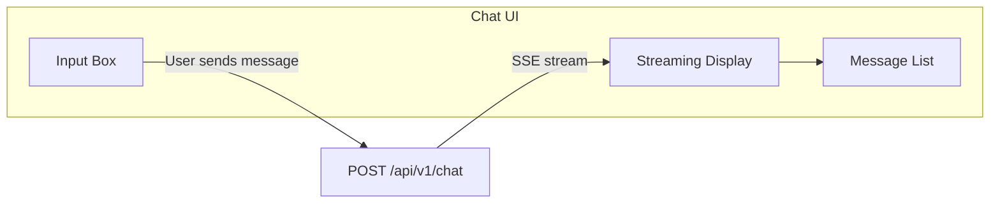
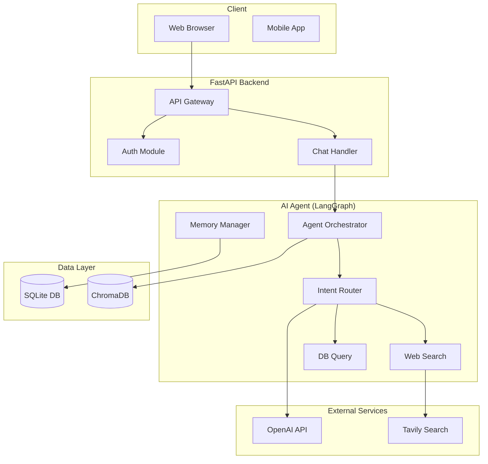
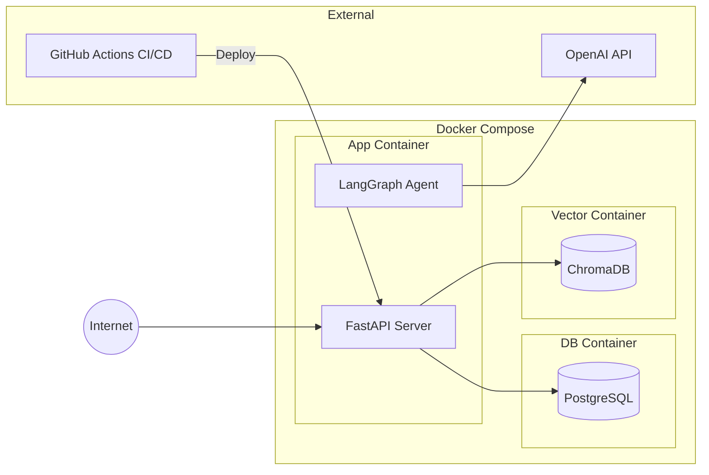

# AI Agent Architecture Design

Skill này đóng gói 9 kỹ năng thiết kế kiến trúc dành cho hệ thống **AI Agent** (agent chatbot, RAG assistant, multi-tool agent...) xây dựng trên nền **React/Next.js (frontend) + FastAPI (backend) + LangGraph (AI Agent layer)**. Dùng skill này để: (1) thiết kế mới một hệ thống agent từ đầu, (2) review/refactor một hệ thống agent đã có, hoặc (3) tạo tài liệu kỹ thuật (diagram, ADR) cho một quyết định kiến trúc.

## Cách áp dụng skill này

1. Xác định người dùng đang cần gì: thiết kế toàn bộ hệ thống, hay chỉ một mảnh (router, state, streaming, DB, diagram, ADR...).
2. Đi vào đúng mục Skill 01–09 tương ứng bên dưới, áp dụng nguyên tắc + code mẫu + checklist.
3. Nếu là thiết kế mới toàn bộ hệ thống: luôn bắt đầu từ **Skill 01 (3 tầng)** → **Skill 02/03 (state machine + state schema)** → **Skill 04 (router)** → **Skill 05 (tools)** → **Skill 06 (streaming)** → **Skill 07 (database)**, sau đó dùng **Skill 08** để vẽ diagram tổng thể và **Skill 09** để chốt lại các quyết định quan trọng bằng ADR.
4. Luôn ưu tiên **YAGNI** — không thêm state machine, router phức tạp, hay database nếu bài toán chưa cần đến (xem cảnh báo ở Skill 07).
5. Khi tạo Mermaid diagram hoặc code, đặt tên rõ ràng (không "Service A", "Module 1") và luôn output thành block code/mermaid để người dùng copy dùng ngay.

---

## Skill 01 — Thiết kế kiến trúc 3 tầng

| Tầng | Công nghệ | Trách nhiệm |
|------|-----------|-------------|
| **Frontend** | React / Next.js | UI, chat interface, streaming display |
| **Backend** | FastAPI | Business logic, auth, session, rate limiting, logging |
| **AI Agent** | LangGraph | Reasoning, tool calling, memory, state machine |



**Nguyên tắc:**
- **Separation of Concerns** — mỗi tầng chỉ lo một việc; Agent không giao tiếp trực tiếp với Frontend.
- **Scalability** — scale từng tầng độc lập; Agent thường là bottleneck nên cho chạy nhiều instance riêng.
- **Technology Flexibility** — đổi Frontend hay LLM provider không ảnh hưởng lẫn nhau.

> 🔑 **Quy tắc vàng:** AI Agent không bao giờ giao tiếp trực tiếp với người dùng — mọi giao tiếp đều qua Backend.

---

## Skill 02 — Xây dựng State Machine với LangGraph

| | Chain (LangChain LCEL) | State Machine (LangGraph) |
|---|---|---|
| Luồng xử lý | Tuyến tính: A → B → C | Có điều kiện, có loop |
| Rẽ nhánh | ❌ | ✅ |
| Vòng lặp (retry) | ❌ | ✅ |
| Phù hợp cho | Task đơn giản (dịch, tóm tắt) | Agent thực thụ, multi-step reasoning |

Agent lặp lại **Suy nghĩ → Hành động → Quan sát** cho đến khi có câu trả lời thỏa đáng:



```python
from langgraph.graph import StateGraph, END
from typing import TypedDict, Annotated
import operator

class AgentState(TypedDict):
    messages: Annotated[list, operator.add]
    question: str
    context: list[str]
    tool_calls: int
    needs_search: bool
    answer: str

graph = StateGraph(AgentState)
graph.add_node("router", router_node)
graph.add_node("search", search_node)
graph.add_node("generate", generate_node)

graph.set_entry_point("router")
graph.add_conditional_edges(
    "router",
    lambda state: "search" if state["needs_search"] else "generate",
    {"search": "search", "generate": "generate"}
)
graph.add_edge("search", "generate")
graph.add_edge("generate", END)

agent = graph.compile()
```

> 🔑 Mỗi node là một hàm nhận `state`, xử lý, và trả về `state` mới. Graph tự quản lý thứ tự thực thi.

---

## Skill 03 — Thiết kế Agent State Schema

`AgentState` là "túi dữ liệu" truyền giữa tất cả node trong graph.

```python
class AgentState(TypedDict):
    """State schema — dữ liệu truyền giữa các node."""
    messages: Annotated[list, operator.add]  # Lịch sử tin nhắn (auto-append)
    question: str          # Câu hỏi gốc của user
    context: list[str]     # Context đã thu thập từ tools
    tool_calls: int         # Số lần gọi tools (giới hạn infinite loop)
    needs_search: bool      # Flag điều hướng conditional edges
    answer: str             # Câu trả lời cuối cùng
```

**Checklist thiết kế State:**
- [ ] `messages` dùng `Annotated[list, operator.add]` để auto-append, không ghi đè.
- [ ] `tool_calls` đếm số lần gọi tools để tránh infinite loop.
- [ ] Có các flag boolean để điều hướng trong `conditional_edges`.
- [ ] Có context accumulator để tích lũy thông tin từ tools.
- [ ] Có field `answer` riêng, tách biệt intermediate state khỏi final answer.

---

## Skill 04 — Thiết kế Router Node (Intent Routing)

Router Node là **cửa ngõ** của Agent: phân loại intent và quyết định luồng xử lý tiếp theo.

```python
def router_node(state: AgentState) -> AgentState:
    """Phân loại câu hỏi và quyết định luồng xử lý."""
    question = state["question"]
    classification = llm.invoke(
        f"Phân loại câu hỏi sau: '{question}'\n"
        f"Trả lời một trong: simple, search, database"
    )
    needs_search = "search" in classification.lower()
    return {"needs_search": needs_search}
```

| Intent | Mô tả | Node xử lý |
|--------|-------|------------|
| `greeting` | Chào hỏi, xã giao | Direct Response |
| `factual_qa` | Câu hỏi dữ liệu tĩnh | RAG Retrieval |
| `current_info` | Thông tin thời sự | Web Search Tool |
| `calculation` | Tính toán, số liệu | Calculator Tool |
| `internal_data` | Dữ liệu nội bộ | DB Query Tool |



---

## Skill 05 — Tích hợp Tools vào Agent

**Search Tool** — tìm kiếm web:
```python
def search_node(state: AgentState) -> AgentState:
    results = search_tool.invoke(state["question"])
    return {"context": [results], "tool_calls": state["tool_calls"] + 1}
```

**DB Query Tool** — truy vấn dữ liệu nội bộ:
```python
def db_query_node(state: AgentState) -> AgentState:
    results = db_tool.invoke(state["question"])
    return {"context": state["context"] + [results], "tool_calls": state["tool_calls"] + 1}
```

**Lựa chọn Search API:**

| API | Free Tier | Ưu điểm | Nhược điểm |
|-----|-----------|---------|------------|
| **Tavily** | 1,000 req/tháng | Tối ưu cho AI, kết quả clean, tích hợp LangChain sẵn | Cộng đồng nhỏ hơn |
| **Serper.dev** | 2,500 req/tháng | Wrapper Google, kết quả chi tiết | Cần parse thủ công |
| **Google Custom Search** | 100 req/ngày | Chính thức từ Google | Setup phức tạp, giới hạn thấp |

> 💡 Khuyến nghị: **Tavily** — thiết kế cho AI Agent, tích hợp sẵn LangGraph.

**Giới hạn tool calls để tránh infinite loop:**
```python
def should_continue(state: AgentState) -> str:
    if state["tool_calls"] >= 3:
        return "generate"  # Bắt buộc generate dù chưa đủ thông tin
    return "router"
```

---

## Skill 06 — Thiết kế Streaming Response

Streaming hiển thị từng token ngay khi có (thay vì đợi 10–15s) — tạo trải nghiệm "typing effect" giống ChatGPT.

**Backend (FastAPI SSE):**
```python
from fastapi import FastAPI
from fastapi.responses import StreamingResponse
from typing import AsyncGenerator

@app.post("/api/v1/chat/stream")
async def chat_stream(request: ChatRequest) -> StreamingResponse:
    async def generate() -> AsyncGenerator[str, None]:
        async for chunk in agent.astream(request.message):
            yield f"data: {chunk}\n\n"
    return StreamingResponse(generate(), media_type="text/event-stream")
```



**Checklist Chat Interface "đủ tốt":**
- [ ] Nhập câu hỏi, nhận câu trả lời.
- [ ] Streaming hiển thị đúng từng token.
- [ ] Error message thân thiện (không lộ stack trace).
- [ ] Responsive (mobile & desktop).
- [ ] Loading indicator khi Agent đang xử lý.
- [ ] Auto-scroll xuống tin nhắn mới nhất.
- [ ] Hỗ trợ Markdown rendering (code block, table, bold/italic).

---

## Skill 07 — Chọn Database phù hợp cho Agent

| Nhu cầu | Cần DB? | Loại DB |
|---------|---------|---------|
| Lưu lịch sử chat | ✅ | SQL (SQLite / PostgreSQL) |
| Memory ngắn hạn (trong session) | ❌ | LangGraph built-in memory |
| Memory dài hạn (cross-session) | ✅ | SQL |
| RAG với tài liệu | ✅ | Vector Database |
| Analytics & monitoring | ✅ | SQL |

**Chiến lược: SQLite cho Dev, PostgreSQL cho Prod**
```python
import os
from sqlalchemy import create_engine

DATABASE_URL = os.getenv("DATABASE_URL", "sqlite:///./data/app.db")
engine = create_engine(DATABASE_URL)
```

**Vector Store cho RAG:**

| Vector Store | Loại | Phù hợp |
|-------------|------|---------|
| **ChromaDB** | Local / self-hosted | Development, small-scale |
| **Pinecone** | Cloud-managed | Production, cần scale |
| **pgvector** | PostgreSQL extension | Khi đã dùng PostgreSQL |
| **Weaviate** | Self-hosted / Cloud | Tính năng phong phú |

```python
from langchain_community.vectorstores import Chroma
from langchain_openai import OpenAIEmbeddings

vectorstore = Chroma(
    collection_name="documents",
    embedding_function=OpenAIEmbeddings(),
    persist_directory="./data/chroma"
)
results = vectorstore.similarity_search("chính sách hoàn tiền", k=3)
```

> 💡 **YAGNI:** đừng setup database nếu chưa thực sự cần — nhiều team lãng phí thời gian setup PostgreSQL khi SQLite (hoặc không DB) đã đủ.

---

## Skill 08 — Vẽ Architecture Diagram bằng Mermaid

**Vì sao dùng Mermaid:** version-control friendly (text file, diff/merge dễ), tự render trên GitHub, dễ cập nhật.

**3 loại diagram bắt buộc cho mọi hệ thống agent:**

**1. System Overview** — toàn cảnh hệ thống, mọi component & connection:


**2. Agent Flow Diagram** — chi tiết agentic loop bên trong Agent (xem diagram ở Skill 04).

**3. Deployment Diagram** — container, networking, external dependencies:


**Quy tắc vẽ diagram tốt:**
1. Đặt tên rõ ràng — tránh "Service A", "Module 1".
2. Nhóm bằng `subgraph` (Frontend, Backend, Agent, External).
3. Mũi tên rõ hướng dữ liệu, thêm label khi cần.
4. Đánh số thứ tự (1)(2)(3) cho edge tuần tự nếu cần.
5. Mỗi diagram một ý chính — tách nhiều diagram thay vì nhồi tất cả vào một.

> ⚠️ Diagram phải luôn cập nhật theo kiến trúc thực tế. Diagram lỗi thời còn nguy hiểm hơn không có diagram.

---

## Skill 09 — Viết Architecture Decision Record (ADR)

ADR ghi lại **quyết định kiến trúc quan trọng**: Bối cảnh, Lựa chọn, Quyết định, Lý do, Hệ quả.

**Template chuẩn:**
```markdown
# ADR-001: [Tiêu đề quyết định]

**Ngày:** YYYY-MM-DD
**Trạng thái:** Accepted / Deprecated / Superseded by ADR-XXX

## Bối cảnh (Context)
Mô tả vấn đề buộc phải ra quyết định.

## Các lựa chọn (Alternatives)
### Lựa chọn 1: [Tên]
- Ưu điểm: ...
- Nhược điểm: ...
### Lựa chọn 2: [Tên]
- Ưu điểm: ...
- Nhược điểm: ...

## Quyết định (Decision)
Chọn **Lựa chọn X** vì ...

## Lý do (Rationale)
1. ...

## Hệ quả (Consequences)
- ...
```

**Ví dụ thực tế** (mẫu để tham chiếu văn phong khi viết ADR mới):
```markdown
# ADR-001: Chọn LangGraph thay vì LangChain Chain

**Ngày:** 2024-11-15
**Trạng thái:** Accepted

## Bối cảnh
Agent cần xử lý câu hỏi phức tạp, yêu cầu rẽ nhánh theo intent và retry khi thông tin chưa đủ.

## Các lựa chọn
### Lựa chọn 1: LangChain LCEL (Chain)
- Ưu điểm: Đơn giản, ít boilerplate.
- Nhược điểm: Chỉ hỗ trợ luồng tuyến tính, không có loop/rẽ nhánh.
### Lựa chọn 2: LangGraph (State Machine)
- Ưu điểm: Hỗ trợ conditional edges, loops, agentic behavior đầy đủ.
- Nhược điểm: Phức tạp hơn, cần học thêm khái niệm graph.

## Quyết định
Chọn **LangGraph**.

## Lý do
1. Agent cần rẽ nhánh theo intent — không thể dùng chain tuyến tính.
2. Cần retry khi thông tin chưa đủ — chỉ state machine mới hỗ trợ loop.
3. LangGraph là tiêu chuẩn ngành cho production-grade agents.

## Hệ quả
- Team cần học LangGraph API (1–2 ngày).
- Kiến trúc graph rõ ràng, dễ debug và mở rộng về sau.
```

**Khi nào cần viết ADR:**

| Cần ADR ✅ | Không cần ADR ❌ |
|-----------|----------------|
| Lựa chọn framework (LangGraph vs LangChain) | Indentation 2 hay 4 spaces |
| Lựa chọn LLM provider (OpenAI vs Anthropic) | Đặt tên biến |
| Lựa chọn database (SQLite vs PostgreSQL) | Format code style |
| Lựa chọn vector store (ChromaDB vs Pinecone) | Minor UI changes |
| Streaming vs non-streaming | |
| Deployment strategy | |

**Quy tắc viết ADR:** chỉ ghi quyết định quan trọng • thể hiện rõ trade-off (không có giải pháp hoàn hảo) • cập nhật trạng thái ("Superseded by ADR-XXX") khi thay đổi • giữ ngắn gọn (đọc trong 3–5 phút).

---

## Tóm tắt nhanh

| Skill | Công cụ | Mục đích |
|-------|---------|---------|
| 01. Kiến trúc 3 tầng | Mermaid diagram | Tách biệt trách nhiệm, dễ scale |
| 02. State Machine | LangGraph | Agentic loop: rẽ nhánh + vòng lặp |
| 03. State Schema | TypedDict | Dữ liệu truyền giữa các node |
| 04. Intent Router | LLM classification | Điều hướng câu hỏi đến đúng tool |
| 05. Tool Integration | LangGraph nodes | Tìm kiếm, query DB, tính toán |
| 06. Streaming | FastAPI SSE | UX tốt hơn, giống ChatGPT |
| 07. Database selection | SQLite/PostgreSQL/Vector | Đúng nhu cầu, không over-engineer |
| 08. Architecture Diagram | Mermaid (3 loại) | Giao tiếp kỹ thuật, tài liệu sống |
| 09. ADR | Markdown template | Ghi lại lý do quyết định |