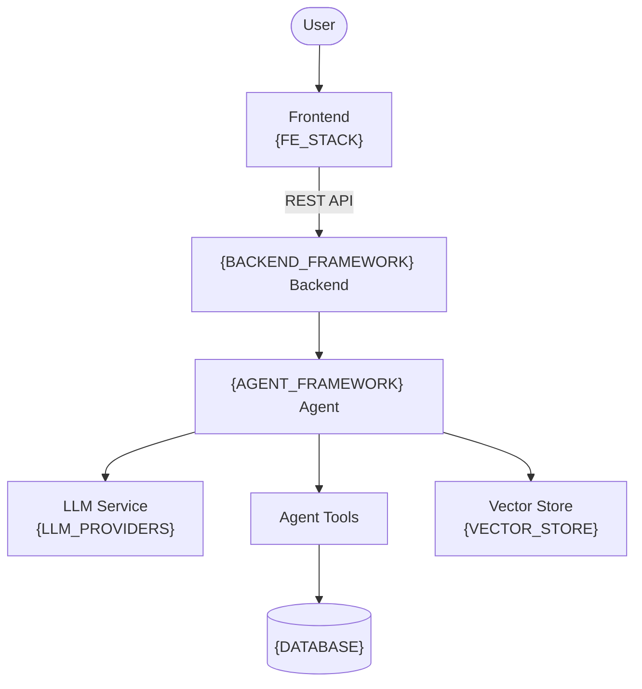
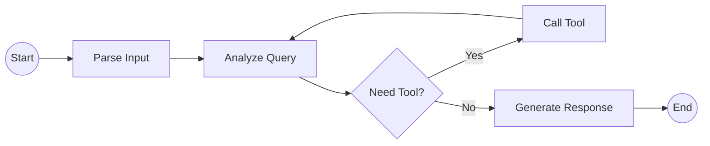

# Quy tắc chuẩn: Vẽ Architecture Diagram cho dự án AI Agent

Skill này rút ra từ convention đã có sẵn trong dự án (`architecture_diagram.md`, `_index.md`, `system-design.md`). Mục tiêu: mọi lần vẽ/viết kiến trúc mới — dù cho dự án AI Agent nào — đều theo đúng khuôn này, chỉ thay tên component/tech stack cho phù hợp.

## Hai định dạng output

- **Format A — Trang docs-site đầy đủ**: dùng khi tài liệu là 1 section trong docs site (có `_index.md` liệt kê + trang nội dung riêng, ví dụ `system-design.md`). Gồm đủ: diagram + Components chi tiết + Data Flow + Design Decisions.
- **Format B — Diagram tham khảo nhanh**: dùng khi chỉ cần sơ đồ + bảng component gọn (ví dụ chèn vào báo cáo, README, slide). Chỉ cần: 2 sơ đồ Mermaid + bảng Component, bỏ qua phần prose dài.

Nếu user không nói rõ, mặc định chọn Format A khi đang xây một docs site/report học thuật, chọn Format B khi chỉ xin "vẽ sơ đồ".

## 1. Front matter (chỉ dùng cho Format A, file trong docs site)

```yaml
---
title: "..."
description: "..."
weight: N
---
```

`_index.md` của mục cha thêm 1 đoạn prose ngắn (2–4 câu tiếng Việt) giải thích người đọc sẽ hiểu được gì, rồi liệt kê trang con dạng `- [Tên trang](file.md) — mô tả ngắn`.

## 2. Diagram 1 — System Overview (bắt buộc, `graph TB`)

Giữ nguyên khung này, chỉ thay nội dung trong `{...}` theo tech stack thật của dự án:



Nếu dự án không có Vector Store / Tools (ví dụ agent đơn giản không RAG), có thể bỏ nhánh đó — nhưng thứ tự `User → Frontend → Backend → Agent → (LLM / Tools / Vector Store)` là cố định, không đảo ngược.

## 3. Diagram 2 — Agent Flow (bắt buộc, `graph LR`)

Đây là vòng lặp kiểu ReAct chuẩn, gần như giữ nguyên cho mọi dự án:



Nếu agent theo kiến trúc Plan-and-Execute thay vì ReAct, đổi tên node (`Plan`, `Execute Step`, `Check Done?`...) nhưng vẫn giữ cấu trúc: 1 entry point tròn, 1 decision hình thoi có loop-back, 1 exit point tròn.

## 4. Quy ước ký hiệu Mermaid (áp dụng cho cả 2 sơ đồ)

| Ký hiệu | Hình dạng | Dùng cho |
|---|---|---|
| `([Label])` | Stadium/oval | Actor bên ngoài hệ thống (User) |
| `((Label))` | Circle | Điểm Start/End của một flow |
| `[Label]` | Rectangle | Component hoặc process step |
| `{Label}` | Diamond | Decision point (rẽ nhánh) |
| `[(Label)]` | Cylinder | Datastore (Database) |
| `-->` | Edge thường | Luồng mặc định |
| `--&#124;Label&#124;` | Edge có nhãn | Khi cần chú thích loại giao tiếp (REST API, Yes/No) |
| `<br/>` trong label | Xuống dòng | Dòng 1 = tên component, dòng 2 = tech stack cụ thể |

## 5. Bảng Component (bắt buộc, cả 2 Format)

```markdown
| Component | Technology | Purpose |
|-----------|-----------|---------|
| Frontend | ... | ... |
| Backend | ... | ... |
| Agent | ... | ... |
| Database | ... | ... |
| Vector Store | ... | ... |
```

Thứ tự dòng trong bảng phải khớp thứ tự xuất hiện trong Diagram 1 (top-to-bottom theo flow).

## 6. Components chi tiết (chỉ Format A)

Mỗi component là 1 heading `###`, theo sau là bullet list bắt đầu bằng khoá phù hợp với loại component (không phải component nào cũng dùng đúng key giống nhau — theo đúng convention gốc):

- **Frontend / Backend**: bắt đầu bằng `**Purpose:**`, sau đó 1–2 bullet kỹ thuật (Key Features, State Management / API Design, Auth).
- **Agent**: bắt đầu bằng `**Agent Type:**` (ReAct / Plan-and-Execute / Custom), sau đó State, Nodes, Tools.
- **Database**: bắt đầu bằng `**Type:**`, sau đó ORM, Migrations (ghi "nếu cần" nếu optional).
- **Vector Store**: bắt đầu bằng `**Type:**`, sau đó Embeddings, rồi `**Purpose:**` ở cuối.

Ví dụ:

```markdown
### 3. AI Agent (LangGraph)

- **Agent Type:** ReAct / Plan-and-Execute / Custom
- **State:** TypedDict schema
- **Nodes:** Xử lý từng bước trong pipeline
- **Tools:** Search, calculate, API calls
```

## 7. Data Flow (chỉ Format A)

Danh sách đánh số, mỗi bước tương ứng **đúng 1 cạnh** trong Diagram 1, theo thứ tự cạnh đó xuất hiện (không thêm bước không có trong sơ đồ):

```markdown
## Data Flow

1. User gửi request từ Frontend
2. API route nhận và validate input (Pydantic)
3. Agent xử lý qua {AGENT_FRAMEWORK} pipeline
4. LLM generate response
5. Tools thực thi actions (nếu cần)
6. Response trả về Frontend qua API
```

## 8. Design Decisions (chỉ Format A)

```markdown
| Decision | Choice | Reason |
|----------|--------|--------|
| Framework | ... | ... |
```

Mỗi dòng là 1 quyết định kiến trúc thật sự có đánh đổi (không liệt kê những lựa chọn hiển nhiên không cần giải thích).

## 9. Văn phong

- Prose bằng tiếng Việt; **giữ nguyên tiếng Anh** cho tên framework, thuật ngữ ML/kỹ thuật (FastAPI, LangGraph, ReAct, Pydantic, JWT, ChromaDB, SQLAlchemy, Alembic, RAG...) — không dịch.
- Câu ngắn, ưu tiên bullet hơn đoạn văn dài trong phần Components.
- Tên component trong diagram và trong bảng/heading phải viết giống hệt nhau (tránh "Vector Store" ở diagram nhưng "Vectorstore" ở bảng).

## 10. Checklist trước khi giao tài liệu

- [ ] Cả 2 sơ đồ Mermaid render được (kiểm tra ngoặc `[]`, `{}`, `()` đóng-mở đúng cặp)
- [ ] Thứ tự component trong bảng khớp thứ tự trong Diagram 1
- [ ] Data Flow có đúng số bước = số cạnh chính trong Diagram 1
- [ ] Front matter đầy đủ 3 field (title, description, weight) nếu là trang docs-site
- [ ] Thuật ngữ kỹ thuật giữ tiếng Anh, không bị dịch lẫn lộn
- [ ] Nếu dự án dùng stack khác (vd. CrewAI thay LangGraph, Milvus/FAISS thay ChromaDB, Celery+Redis cho async task) — cấu trúc flow và shape node vẫn giữ nguyên, chỉ đổi label