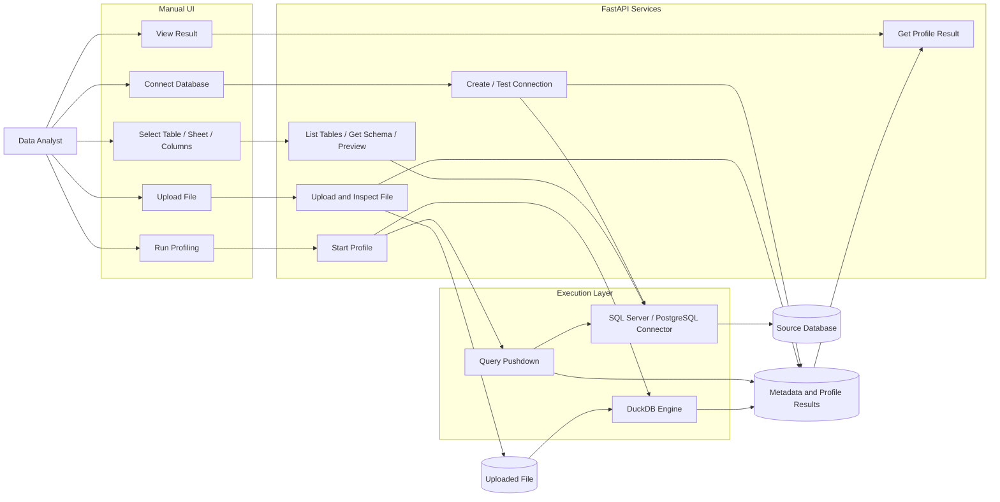

# MVP Data Profiling Architecture

## Overview

Thiết kế MVP tập trung vào một role duy nhất là **Data Analyst**. Người dùng thao tác thủ công qua giao diện để:

- Kết nối database.
- Upload file.
- Chọn bảng, sheet hoặc cột.
- Chạy profiling.
- Xem kết quả.

Database nguồn được profiling bằng **query pushdown**, trong khi file upload được xử lý bằng **DuckDB**.

## Architecture Diagram



## Main Flows

### Database Flow

```text
Data Analyst
→ Connect Database
→ FastAPI Connection Service
→ SQL Server / PostgreSQL Connector
→ Source Database
```

Khi chạy profiling:

```text
Data Analyst
→ Start Profile
→ Query Pushdown
→ Database nguồn tính toán thống kê
→ Lưu kết quả profiling
→ Hiển thị báo cáo
```

### File Upload Flow

```text
Data Analyst
→ Upload File
→ FastAPI Upload Service
→ Lưu file
→ DuckDB đọc và profiling
→ Lưu kết quả
→ Hiển thị báo cáo
```

## Component Responsibilities

### Manual UI

- Kết nối database.
- Upload file.
- Chọn table, sheet hoặc column.
- Khởi chạy profiling.
- Hiển thị kết quả.

### FastAPI Services

- Tạo và kiểm tra connection.
- Đọc table, schema và preview.
- Upload và kiểm tra file.
- Khởi chạy profiling.
- Trả kết quả profiling.

### Execution Layer

- **Database Connector:** giao tiếp với SQL Server hoặc PostgreSQL.
- **Query Pushdown:** gửi các truy vấn thống kê xuống database nguồn.
- **DuckDB:** xử lý CSV, Excel sau khi chuẩn hóa và Parquet.

### Storage

Lưu:

- Thông tin metadata của nguồn dữ liệu.
- Thông tin connection.
- File đã upload.
- Kết quả profiling.
