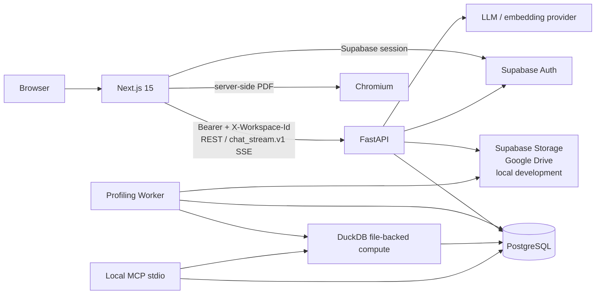

# Kiến trúc VDaAgent (P-170)

Tài liệu này mô tả các ranh giới kiến trúc ổn định của hệ thống hiện tại. Hợp đồng chi tiết theo từng chức năng nằm trong [docs/](docs/README.md); route, model, migration, test và workflow triển khai vẫn là nguồn sự thật cuối cùng.

## Topology



Production chạy ba container độc lập: Next.js frontend, FastAPI API và Profiling Worker. PostgreSQL là dependency bắt buộc cho metadata, queue, evidence, report, audit, retrieval và LangGraph checkpoint. Raw object nằm ở storage provider; file remote chỉ được stream xuống file tạm có byte limit, sau đó được xóa.

Browser chỉ dùng Supabase cho Auth và public/publishable configuration. Các bảng ứng dụng trong schema `public` không phải browser API: migration bật RLS, không tạo policy, thu hồi quyền của `anon`/`authenticated` và thu hồi default privilege cho bảng/sequence tương lai. Mọi domain read/write đi qua FastAPI.

## Các ranh giới bắt buộc

| Ranh giới | Quy tắc hiện tại |
| --- | --- |
| Identity | Production chỉ nhận Supabase JWT bất đối xứng; `dual` và guest là compatibility path được cấu hình cho development/test hoặc trial. |
| Tenant | API resolve `X-Workspace-Id` từ membership active, sau đó kiểm tra capability và lặp lại workspace predicate ở repository. |
| System Admin | Admin dùng system context riêng và không phải workspace superuser. |
| Compute | DuckDB đọc source file-backed; QuerySpec và tool catalog là allow-list. Browser/model không có arbitrary SQL/Python. |
| Storage | Supabase Storage sở hữu canonical artifact trong production; local là adapter development/test; Drive và database connector chỉ ingest vào artifact nội bộ. |
| Async | HTTP chỉ enqueue Profile Run. Worker claim lease, heartbeat, retry và recover stale job với ngữ nghĩa at-least-once. |
| Evidence | Claim định lượng phải gắn với profile artifact, tool result hoặc Official execution đã xác minh; thiếu evidence thì QA abstain. |
| Chat | `chat_stream.v1` và REST giữ answer/provenance immutable. Hội thoại, message, feedback và cache luôn có workspace predicate; cache hit phải tính lại aggregate và qua validator trước khi trả về. |
| Verification | Verifier rủi ro cao hiện là shadow ledger: ghi kết quả hash-bound nhưng không ghi đè answer đã qua validator. `enforce` không phải behavior mặc định. |
| Privacy | PII pending cũng bị coi là sensitive. Raw row, credential, prompt đầy đủ và đường dẫn tạm không đi vào answer/trace/telemetry. |
| Report | Draft mutable tách khỏi snapshot đã hash; chart/answer phải giữ provenance. Note thủ công không trở thành quantitative evidence. |
| Production schema | Alembic sở hữu schema. Runtime production không gọi `create_all()` hoặc tự alter table. |

## Luồng dữ liệu chính

### Dataset và profiling

```text
Upload/connector
  → dataset metadata + stable source_ref
  → durable Profile Run (queued)
  → worker materialize source có giới hạn
  → DuckDB sample/full profiling
  → metadata proposals + HITL review
  → resume job nếu cần
  → completed Profile Run + retrieval document
```

Profiling chính tính aggregate trực tiếp trong DuckDB mà không tạo full pandas DataFrame. Pandas chỉ được nạp lại với projection cột cụ thể cho statistical test. Sample run luôn giữ provenance và `is_approximate`.

### Command Center và Chat Agent

```text
Completed Profile Run
  → Analysis Session + semantic context
  → chart plan đã sanitize
  → Preview (approximate, có expiry)
  → approve context + quality gate
  → Official execution (hash + limitations)
  → QA insight / Report Draft
```

Chart planner có deterministic fast path cho intent an toàn và model path cho intent còn mơ hồ, nhưng cả hai đều bị normalize qua cùng allow-list. Chat Agent tách guardrail, clarification, fast path, structured tool và retrieval; validator cuối cùng kiểm tra run/workspace binding, artifact, citation và numeric value trước khi gắn `verified`.

```text
Chat page / widget
  → immutable request context + idempotent agent run
  → deterministic fast path hoặc bounded graph/tool/retrieval
  → fail-closed evidence validation
  → eligible revalidated cache / shadow verification
  → AnswerEnvelopeV2 + durable workspace conversation
```

Lịch sử chỉ được đưa lên server khi người dùng gửi lượt mới; browser history cũ không được bulk-upload. Answer đã hoàn tất không nhận context mới. Gợi ý câu hỏi chỉ sinh deterministic từ aggregate an toàn của Profile Run hoàn tất; feedback chỉ lưu projection/analytics an toàn và candidate đánh giá cần được con người review.

### Report

```text
Verified profile/tool/Official evidence
  → mutable Report Draft
  → immutable snapshot + SHA-256
  → lifecycle endpoint
  → PII-safe export source
  → Next.js server render PDF
```

## Miền dữ liệu PostgreSQL

```text
Identity:      user_profiles, workspaces, memberships, invitations
Profiling:     datasets, profile_runs, column_stats, proposals, tests, drift
Analysis:      sessions, context versions, quality gates/issues, executions
Reporting:     reports, versions, draft items, sections, charts, reviews
Agent:         runs, plans, steps, invocations, evidence, trace, verification
Chat:          conversations, conversation_messages, feedback, evaluation_candidates, answer cache
Integration:   datasource/Drive connections, idempotency, audit, retrieval
Storage:       dataset_artifacts, dataset_ingestions, immutable Profile Run artifact binding
Runtime:       LangGraph checkpoint tables
```

Inventory truy cập bảng được khai báo trong [`database_access_policy.py`](backend/src/services/database_access_policy.py) và được CI so sánh với SQLAlchemy metadata để bắt buộc mọi bảng mới có quyết định Data API rõ ràng.

## Bản đồ implementation

| Mối quan tâm | Source sở hữu |
| --- | --- |
| App, middleware, CORS, error/health | [`backend/src/main.py`](backend/src/main.py) |
| REST/SSE contract | [`backend/src/api/`](backend/src/api/) và [`backend/src/models/`](backend/src/models/) |
| Auth, workspace, capability | [`backend/src/services/auth.py`](backend/src/services/auth.py), [`dependencies.py`](backend/src/api/dependencies.py), [`permissions.py`](backend/src/services/permissions.py) |
| Profiling/analysis/QA/report | [`backend/src/services/`](backend/src/services/) và [`backend/src/agents/`](backend/src/agents/) |
| Chat answer, cache, suggestions, verifier | [`chat_answer.py`](backend/src/services/chat_answer.py), [`chat_cache.py`](backend/src/services/chat_cache.py), [`chat_suggestions.py`](backend/src/services/chat_suggestions.py), [`chat_verifier.py`](backend/src/services/chat_verifier.py) |
| Worker | [`backend/src/workers/profiling_worker.py`](backend/src/workers/profiling_worker.py) |
| PostgreSQL schema | [`backend/src/services/repository.py`](backend/src/services/repository.py) và [`backend/migrations/`](backend/migrations/) |
| Local MCP server | [`backend/src/mcp_server.py`](backend/src/mcp_server.py) |
| Browser/PDF | [`frontend/src/app/`](frontend/src/app/), [`frontend/src/components/`](frontend/src/components/), [`frontend/src/lib/`](frontend/src/lib/) |
| Cấu hình/release | [`config.yaml`](config.yaml), [`backend/src/config.py`](backend/src/config.py), [workflow Azure](.github/workflows/azure-container-deploy.yml) |

## Tài liệu thiết kế chi tiết

- [Tổng quan hệ thống](docs/architecture/system-overview.md)
- [Profiling Job bất đồng bộ](docs/architecture/async-profiling-jobs.md)
- [Phân tích có giới hạn](docs/architecture/bounded-execution.md)
- [Agent, QA, retrieval và evidence](docs/architecture/agent-system.md)
- [Chat Agent P0](docs/features/chat-agent-p0-implementation.md), [P1](docs/features/chat-agent-p1-implementation.md) và [P2](docs/features/chat-agent-p2-implementation.md)
- [Report Draft và snapshot](docs/architecture/report-draft-snapshots.md)
- [Authentication/authorization](docs/security/authentication-and-authorization.md)
- [Cô lập workspace và privacy](docs/security/workspace-isolation-and-privacy.md)
- [Connector và canonical storage](docs/features/connectors-and-storage.md)

## Kỷ luật thay đổi

Thay đổi API phải cập nhật Pydantic/type client và test; thay đổi schema phải có Alembic migration; thay đổi quyền phải đi qua capability registry và cross-workspace tests; thay đổi evidence phải giữ source binding, approximation và limitation. Đổi Chat Agent còn phải giữ stream compatibility, idempotency, immutable provenance, workspace binding và cache/verifier revalidation. Các behavior còn bất nhất nhưng chưa được sửa được ghi tại [docs/summary.md](docs/summary.md), không được mô tả như guarantee.
