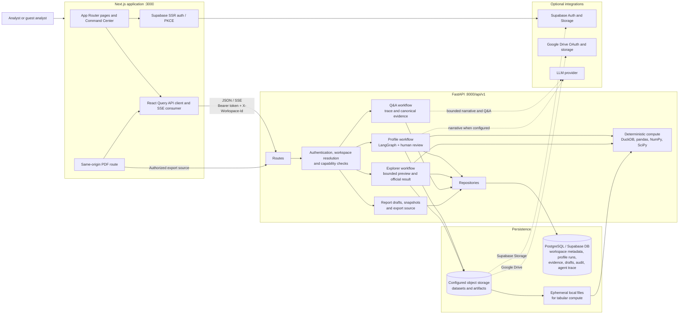
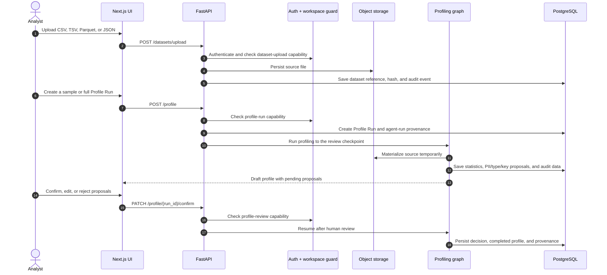

# VDaAgent Architecture

VDaAgent is an evidence-first data-profiling workspace. Its primary unit of
work is a **Profile Run** in a workspace—not a standalone analysis or
notebook.

```text
Dataset upload → Profile Run → review and confirmation → Command Center
                                                    ├─ Explorer: preview → official evidence
                                                    ├─ Agent: answer with provenance
                                                    └─ Report Draft → immutable snapshot → PDF
```

`/analyses` and `/notebooks` are no longer product routes or public workflows.
Explorer sessions are internal, profile-scoped implementation details.

## Runtime architecture



The frontend is deployed separately from FastAPI and normally calls it through
`NEXT_PUBLIC_API_URL`. Its PDF route is the exception: the Next.js server
fetches an authorized export source from FastAPI, then renders the PDF.

## Data ownership

| Data | System of record | Notes |
| --- | --- | --- |
| Identity and browser session | Supabase Auth | The browser uses Supabase SSR/PKCE; the backend validates bearer credentials. |
| Workspace, membership, permissions | PostgreSQL | Every protected operation is resolved in the active workspace. |
| Dataset binary | Supabase Storage, Google Drive, or local development storage | PostgreSQL stores the reference and metadata, not a duplicate blob. |
| Profile Run, column statistics, review decisions | PostgreSQL | Each run belongs to one dataset and workspace. |
| Explorer contexts, previews, official results, evidence hashes | PostgreSQL | Only official results are durable report evidence. |
| Agent runs, trace summaries, canonical evidence | PostgreSQL | `shadow` trace mode records redacted provenance without blocking UI. |
| Report drafts and immutable snapshots | PostgreSQL | Export reads the newest snapshot, never the mutable draft. |

For remote storage, the backend materializes a dataset into a temporary local
file only for the DuckDB/pandas operation, then removes it. Production requires
PostgreSQL and configured remote storage; local files are for development/test.

## Main flows

### Profile Run and human review



The profiling graph may generate a narrative with an LLM when configured, but
metrics and proposals come from deterministic tools. Profiling still works when
no LLM key is available.

### Command Center, evidence, and export

```mermaid
sequenceDiagram
    autonumber
    actor A as Analyst
    participant UI as Command Center
    participant API as FastAPI
    participant E as Explorer / compute
    participant DB as PostgreSQL
    participant PDF as Next.js PDF route

    A->>UI: Open confirmed Profile Run
    UI->>API: POST /profile/{run_id}/explorer/session
    API->>DB: Get or create profile-scoped Explorer context

    A->>UI: Run an aggregate preview
    UI->>API: POST /profile/{run_id}/explorer/previews
    API->>E: Execute within preview row, result, and time budgets
    E->>DB: Save preview and context version
    E-->>UI: Bounded, possibly approximate result

    A->>UI: Promote preview
    UI->>API: POST .../previews/{preview_id}/promote
    API->>E: Revalidate context and run official result
    E->>DB: Save official result, quality outcome, evidence hash, provenance
    E-->>UI: Official evidence eligible for report pinning

    A->>UI: Ask Agent or pin content to Report Draft
    UI->>API: POST /qa or /qa/stream; POST /reports/{id}/items
    API->>DB: Read authorized evidence; persist agent run/draft item
    API-->>UI: JSON or SSE answer with evidence status

    A->>UI: Create snapshot and download PDF
    UI->>API: POST /reports/{id}/snapshots
    API->>DB: Freeze draft version and snapshot hash
    UI->>PDF: GET /api/reports/profile/{runId}?reportId={id}
    PDF->>API: GET /reports/{id}/export-source
    API->>DB: Return the authorized immutable snapshot
    PDF-->>A: Rendered PDF
```

Explorer accepts structured aggregate specifications, never raw SQL supplied by
the browser or Agent. Preview timeouts and stale contexts are intentional
business outcomes. An official result is created from the current
profile-scoped context and receives an evidence/result hash; previews are not
report evidence.

## Security invariants

- FastAPI authenticates the bearer token, resolves the workspace from
  `X-Workspace-Id` (or the only eligible membership), and checks the required
  capability for every protected route. Resource lookups stay workspace-scoped.
- The client receives only public Supabase configuration. Database URLs,
  Supabase secret keys, storage credentials, and LLM keys remain backend-only.
- UI, Agent, reports, snapshots, and traces must not expose raw rows or raw
  PII. Output guardrails and PII masking apply before data leaves the service.
- Explorer and Agent open only after Profile Run confirmation. Agent answers
  without durable evidence must be shown as limited and cannot be pinned as
  verified conclusions.
- Report drafts are editable; snapshots are immutable. PDF/JSON exports derive
  from a snapshot and include only authorized, redacted content.
- Audit records capture state-changing or sensitive operations. Agent trace
  storage records provenance rather than chain-of-thought.

## API surface by domain

All FastAPI endpoints use the `/api/v1` prefix.

| Domain | Representative endpoints |
| --- | --- |
| Datasets and profiling | `POST /datasets/upload`, `GET /datasets`, `POST /profile`, `GET /profile/{run_id}`, `PATCH /profile/{run_id}/confirm` |
| Command Center Explorer | `POST /profile/{run_id}/explorer/session`, `POST /profile/{run_id}/explorer/previews`, `POST /profile/{run_id}/explorer/previews/{preview_id}/promote` |
| Agent and evidence | `POST /qa`, `POST /qa/stream`, `GET /agent-runs/{run_id}/evidence`, `GET /agent-runs/{run_id}/trace-summary` |
| Reports | `GET/POST /profile/{run_id}/report-draft`, `POST /reports/{report_id}/items`, `POST /reports/{report_id}/snapshots`, `GET /reports/{report_id}/export-source` |
| Workspace and auth | `GET /session`, `GET/POST /workspaces`, membership and invitation endpoints |
| Supporting capabilities | Profile test/drift, activity/audit, Google Drive connection, agent-skill inspection |

The frontend enables Command Center at `/profiles/{runId}` with
`NEXT_PUBLIC_UX_COMMAND_CENTER_ENABLED=true`; the backend contract is enabled
with `UX_COMMAND_CENTER_ENABLED=true`.

## Deliberate limits

- No raw SQL, raw-row exploration, source cleaning, or multi-table joins are
  exposed through Explorer or Agent.
- Preview is bounded and may be approximate; it cannot replace official
  evidence.
- Planner autonomy, verifier enforcement, background jobs, and long-term
  workspace/personal agent memory are feature-gated, not released workflow.
- Guest workspaces are for trial use, with a separate storage/retention policy;
  they are not durable storage.