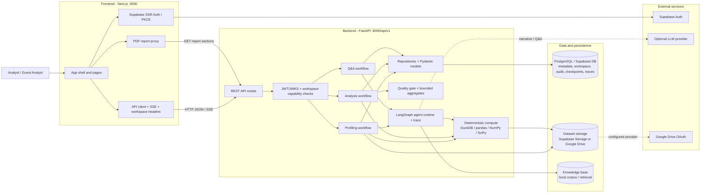
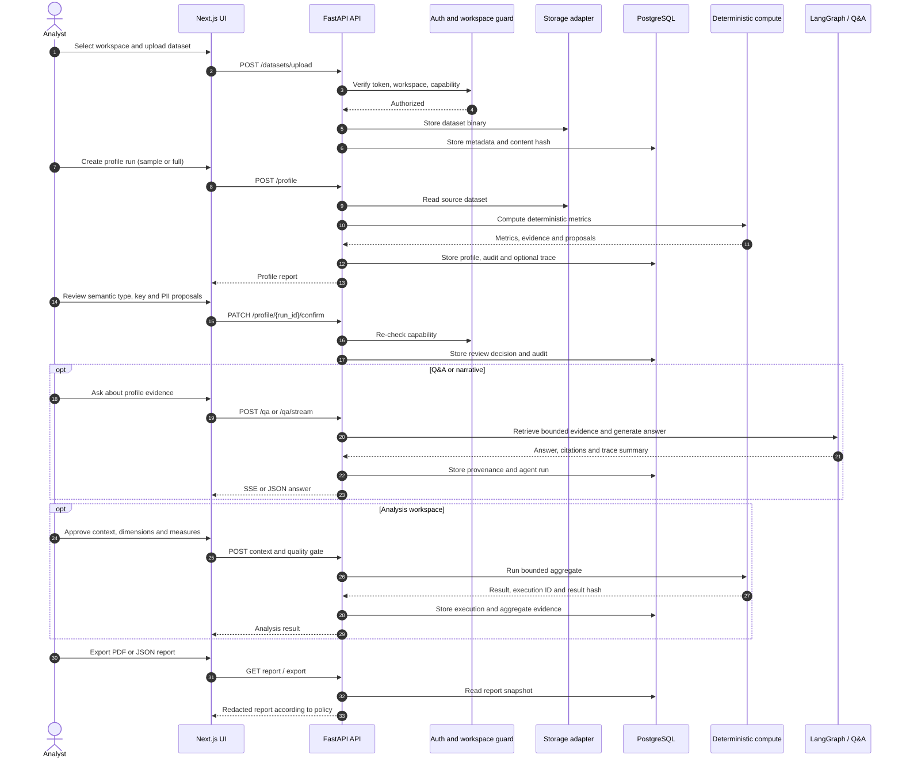

# Architecture

## Component architecture

## Data flow

## Security and data handling

- Frontend never sends raw SQL; Analysis only runs bounded aggregates from approved context.
- Backend checks JWT, workspace membership and capability before every resource operation.
- The compute engine produces deterministic metrics; the LLM is limited to narrative, retrieval and Q&A.
- Raw datasets stay in the configured storage provider; PostgreSQL stores metadata, provenance, audit and results.
- Reports and traces are redacted and do not store raw rows, secrets, chain-of-thought or unnecessary PII.
