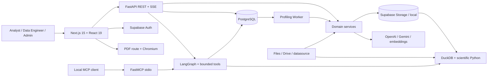
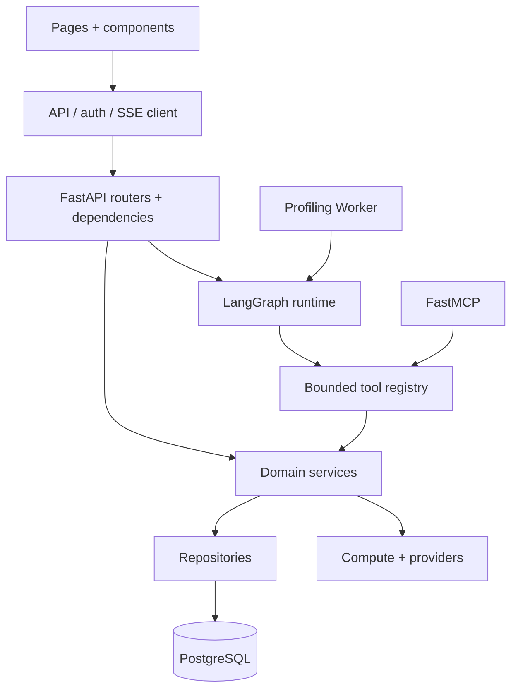
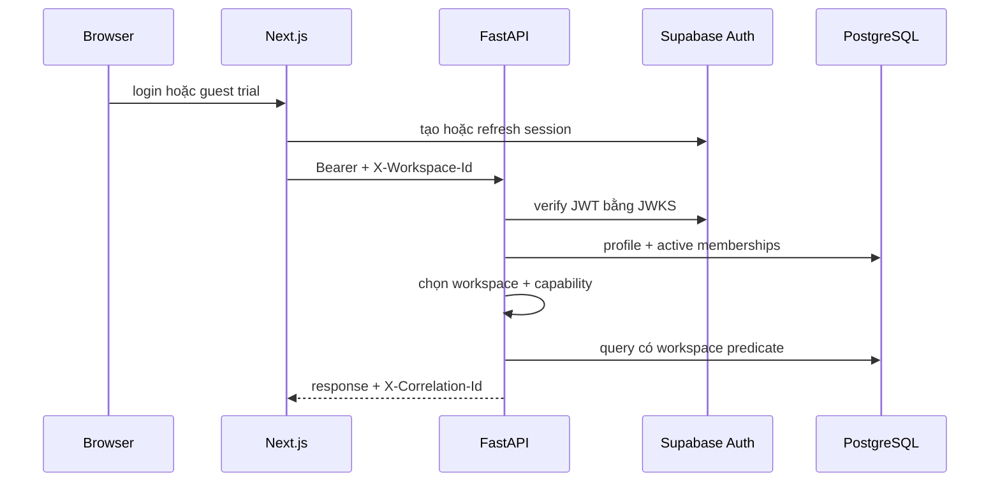
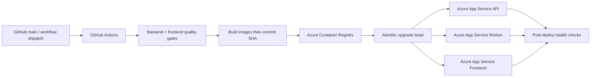

# Kiến trúc VDaAgent (P-170)

> Snapshot kiến trúc được đối chiếu với source, migration, test và tài liệu kỹ thuật ngày 2026-09-06.

Tài liệu này mô tả kiến trúc tổng thể, các process runtime, luồng dữ liệu, trust boundary và công nghệ chính của VDaAgent. Contract chi tiết nằm trong [docs/](docs/README.md); source, Pydantic/OpenAPI, Alembic migration và test vẫn là nguồn sự thật cuối cùng.

> [!IMPORTANT]
> Source hiện nằm trong `src/backend` và `src/frontend`, nhưng Makefile, Alembic, một số script/test, Docker và CI chưa chuyển hết khỏi layout cũ. Topology dưới đây là kiến trúc của source hiện tại; khả năng build/deploy từ clean checkout vẫn bị chặn cho đến khi hoàn tất migration đường dẫn. Xem [giới hạn hiện tại](docs/architecture/known-limitations.md).

## 1. Mục tiêu kiến trúc

VDaAgent đưa Analyst từ nguồn dữ liệu dạng bảng đến profile, phân tích, câu trả lời và báo cáo có thể kiểm chứng. Hệ thống được xây quanh năm nguyên tắc:

1. **Evidence-first:** số liệu phải đến từ compute, tool, retrieval hoặc Official execution đã lưu.
2. **Bounded execution:** row, column, filter, result, timeout, tool call, context và output đều có giới hạn.
3. **Workspace isolation:** identity, membership, capability và resource predicate được kiểm tra trước khi truy cập dữ liệu.
4. **Durable workflow:** profiling và resume là job PostgreSQL, không phụ thuộc vòng đời HTTP request.
5. **Human-in-the-loop:** PII, candidate key và metadata rủi ro cần được review theo policy; AI không tự trở thành nguồn sự thật.

## 2. System context và runtime topology



Production được thiết kế với ba container/process độc lập: **Next.js frontend**, **FastAPI API** và **Profiling Worker**. API và worker dùng cùng backend image/revision. MCP là tiến trình local qua stdio, không phải HTTP service công khai.

Browser chỉ dùng Supabase cho authentication/session và direct object upload khi feature flag cho phép. Browser không đọc/ghi trực tiếp bảng domain PostgreSQL qua Supabase Data API.

### Thành phần runtime

| Thành phần | Entrypoint | Trách nhiệm |
| --- | --- | --- |
| Frontend | `src/frontend/src/app/` | UX, auth session, workspace, REST/SSE client, profile, chart, chat, report và PDF |
| FastAPI | `src/backend/src/main.py` | middleware, REST/SSE, auth/workspace boundary, validation, error mapping và health |
| Profiling Worker | `src/backend/src/workers/profiling_worker.py` | claim job, heartbeat/lease, profiling graph, retry/recovery và resume HITL |
| Local MCP | `src/backend/src/mcp_server.py` | profile tools và bounded Preview/Official qua FastMCP stdio |
| PostgreSQL | server-managed | metadata, tenant state, queue, evidence, report, audit, retrieval và checkpoint |
| Object storage | Supabase/local adapter | object dataset canonical; Drive và datasource là nguồn ingest |
| Compute | DuckDB + scientific Python | file-backed aggregate, statistical test, drift và forecast |
| AI providers | OpenAI/Gemini + embeddings | structured planning, reasoning và retrieval; không bypass validator |

## 3. Phân lớp implementation



| Lớp | Thành phần chính | Quy tắc ownership |
| --- | --- | --- |
| Presentation | Next.js App Router, React components, TanStack Query | render và giữ UI state; không quyết định authorization |
| Delivery | FastAPI routers, Pydantic models, middleware | transport, schema, dependency và HTTP/SSE contract |
| Application | services và LangGraph orchestration | điều phối use case, policy, quality gate và evidence |
| Domain/compute | profiling, statistics, drift, QuerySpec | deterministic/bounded computation, không nhận arbitrary SQL/Python |
| Persistence | repository, SQLAlchemy, Alembic | transaction, workspace predicate, schema và durable state |
| Integration | Supabase, Drive, datasource, LLM, embedding, LangSmith | adapter có timeout, giới hạn và secret boundary |

### Ranh giới bắt buộc

| Ranh giới | Quy tắc |
| --- | --- |
| Identity | Production nhận Supabase JWT ES256/RS256; `dual` và guest chỉ dành cho local/test/trial |
| Tenant | Resolve membership active từ `X-Workspace-Id`, kiểm capability và lặp lại `workspace_id` ở repository |
| System Admin | Dùng system context riêng, không mặc nhiên là workspace superuser |
| Compute | QuerySpec và tool catalog là allow-list; browser/model không có raw SQL hoặc Python tùy ý |
| Storage | Supabase Storage là canonical production; local chỉ dành cho development/test |
| Async | HTTP enqueue, worker xử lý at-least-once với lease, heartbeat, retry và stale recovery |
| Evidence | Claim định lượng phải gắn artifact/tool/Official execution hợp lệ; thiếu bằng chứng thì abstain |
| Privacy | Không đưa bearer, credential, raw row, prompt đầy đủ hoặc temporary path vào answer/trace/log |
| Schema | Alembic sở hữu production schema; production không dùng runtime `create_all` |

## 4. Luồng end-to-end

### 4.1 Authentication và workspace request



Frontend guard chỉ phục vụ UX. FastAPI dependency và repository predicate mới là authorization boundary. Token sai claim, thuật toán hoặc scope phải fail closed; resource ngoài workspace có thể trả 404 để tránh lộ tồn tại.

### 4.2 Ingestion và profiling bất đồng bộ

```text
Upload / Google Drive / datasource
  → dataset + ingestion metadata
  → canonical immutable artifact + SHA-256
  → POST profile với Idempotency-Key
  → Profile Run queued trong PostgreSQL
  → worker claim lease và materialize file có byte limit
  → DuckDB profiling + deterministic aggregate
  → LangGraph đề xuất metadata
  → HITL review hoặc optional deep statistical test
  → worker resume cùng checkpoint
  → completed Profile Run + retrieval document + evidence
```

API trả HTTP 202, không chạy profiling trong request. Client nhận tiến trình bằng SSE hoặc polling trên cùng job. Job dùng ngữ nghĩa at-least-once; Profile Run luôn bind tới đúng `artifact_id`, không tự chuyển sang phiên bản dataset mới hơn.

### 4.3 Command Center, QA và report

```mermaid
flowchart LR
  PROFILE[Completed Profile Run] --> SESSION[Analysis Session]
  SESSION --> PLAN[Sanitized chart plan]
  PLAN --> PREVIEW[Preview approximate + expiry]
  PREVIEW --> GATE[Context approval + quality gate]
  GATE --> OFFICIAL[Official full-source execution]
  PROFILE --> QA[QA router]
  OFFICIAL --> QA
  QA --> VERIFY[Evidence validator]
  VERIFY --> ANSWER[AnswerEnvelopeV2]
  PROFILE --> DRAFT[Mutable Report Draft]
  OFFICIAL --> DRAFT
  ANSWER --> DRAFT
  DRAFT --> SNAPSHOT[Immutable snapshot + SHA-256]
  SNAPSHOT --> EXPORT[PII-safe export source]
  EXPORT --> PDF[Next.js + Chromium PDF]
```



Preview chỉ dùng để khám phá và không tự trở thành Official. Official chạy lại trên nguồn đầy đủ trong giới hạn, giữ canonical query, context version, quality-gate reference, result hash và limitation.

QA tách input guardrail, clarification, deterministic fast path, structured tool và scoped retrieval. Terminal answer chỉ được đánh dấu `verified` sau khi kiểm tra run/workspace binding, artifact, source status, citation và numeric grounding. Partial SSE token không phải bằng chứng canonical.

Report Draft có optimistic version và idempotent pin/reorder. Snapshot đã hash là bất biến; chỉnh sửa tiếp theo tạo draft version mới. Note thủ công được phép nhưng không trở thành quantitative evidence.

## 5. Kiến trúc Agent

### Profiling graph

```text
ingest → compute_stats → propose_metadata → hitl_review
  ├─ reject/edit → propose_metadata
  ├─ request_test → deep_analysis → hitl_review
  └─ confirm → summarize → optional QA → finalize
```

### QA graph

```text
question → input guardrail → router
  ├─ blocked → deterministic refusal
  ├─ ambiguous → clarification
  ├─ quantitative → structured bounded tools
  └─ qualitative/chart insight → scoped hybrid retrieval
→ evidence validation → output guardrail → answer
```

Native skill catalog gồm `profile-dataset`, `diagnose-data-quality`, `compare-profile-drift`, `answer-business-question` và `generate-report`. Skill file là playbook; enforcement thực nằm ở capability dependency, execution context, tool schema, dispatcher, validator và repository predicate.

Tool registry chỉ nhận input có schema/limit và được server inject `profile_run_id` cùng workspace context. Model không được tự chọn tenant, sửa scope, đọc raw PII hoặc thực thi arbitrary SQL/Python.

Retrieval dùng hybrid sparse/dense search trên `retrieval_documents`. Profile/report document luôn scope theo workspace/Profile Run; external knowledge chỉ được dùng khi cấu hình bật. Embedding có thể dùng local, OpenAI, Voyage hoặc none; sparse fallback vẫn hoạt động khi embedding lỗi.

Agent runtime lưu run, plan, step, invocation, evidence và trace đã sanitize. LangSmith là projection best-effort metadata-only, không phải source of truth. Semantic cache chỉ được trả sau khi chạy lại aggregate/tool cần thiết và vượt qua cùng evidence validator. Verifier rủi ro cao hiện chạy shadow, không ghi đè answer canonical.

## 6. Kiến trúc dữ liệu và provenance

VDaAgent tách ba lớp dữ liệu:

1. **PostgreSQL:** identity projection, workspace, durable workflow, derived evidence, report, audit, retrieval và checkpoint.
2. **Object storage:** bytes canonical của dataset; Supabase Storage ở production và local adapter ở development/test.
3. **Ephemeral compute files:** file tạm materialize từ storage/Drive/datasource cho DuckDB, có byte limit và được cleanup.

| Miền | Dữ liệu chính |
| --- | --- |
| Identity/workspace | user profile, workspace, membership, invitation, configuration version |
| Ingestion/storage | dataset, immutable artifact, ingestion attempt, connector và OAuth state |
| Profiling | Profile Run, column stats, proposal, statistical test và drift |
| Analysis | session, semantic context version, quality gate, query execution |
| Agent/chat | run, plan, invocation, evidence, trace, conversation, feedback và cache |
| Report | report, version, section, item, chart, review và snapshot |
| Runtime | LangGraph checkpoint tables |

```text
workspace_id
  → dataset_id
  → artifact_id + content SHA-256
  → profile_run_id + scan/sample metadata
  → tool/query execution + result hash + limitation
  → answer/report citation
  → immutable report snapshot hash
```

Sample result phải giữ `is_approximate`, strategy, size/seed và limitation. Temporary path không được persist. Tất cả domain table là backend-only; RLS được bật nhưng browser role không có policy/quyền truy cập trực tiếp.

## 7. Interface và contract

| Interface | Contract |
| --- | --- |
| REST | FastAPI + Pydantic dưới `/api/v1`; health ở `/health` |
| Profiling SSE | projection `queued/profiling/resuming/review_required/ready/failed`; reconnect theo cùng job |
| Chat SSE | `chat_stream.v1`; progress/partial tách khỏi terminal Answer Envelope V2 |
| Authentication | `Authorization: Bearer`; tenant preference bằng `X-Workspace-Id` |
| Retry-safe mutation | `Idempotency-Key` được scope theo actor/workspace/request hash |
| Correlation | client có thể gửi, server luôn trả `X-Correlation-Id` |
| Local MCP | FastMCP stdio, explicit Profile Run/workspace/actor; không public HTTP |
| PDF | Next.js server route lấy export source đã authorize rồi render bằng Chromium |

Mã lỗi chính: 400 cho input/compute, 401 cho identity, 403 cho capability, scoped 404 để tránh lộ tenant, 409 cho state/version/idempotency conflict, 422 cho schema/QuerySpec, 503 cho dependency tạm lỗi và safe 500 kèm correlation ID.

## 8. Security, reliability và observability

| Mối quan tâm | Cơ chế |
| --- | --- |
| Authentication | Supabase JWT/JWKS, kiểm signature, issuer, audience, expiry và email policy |
| Authorization | active membership, capability registry, immutable request context và repository predicate |
| PII | heuristic + review state; pending/confirmed PII bị loại khỏi QuerySpec và output không an toàn |
| Secret | database URL, Supabase secret, encryption key, Drive secret và LLM key chỉ ở server |
| Upload | stream theo chunk, filename sanitize, byte limit, SHA-256 và canonical artifact |
| Concurrency | transaction, optimistic version, idempotency và worker lease |
| Backpressure | bounded queue concurrency, query timeout, result cap, SSE adaptive polling |
| Failure recovery | retry có giới hạn, stale lease recovery, graceful shutdown và safe error |
| Audit | action metadata theo workspace; không lưu bearer/raw row |
| Telemetry | correlation ID, route template, query/latency ledger và token count nếu provider trả usage |
| Trace | mode off/shadow/required, size/depth cap và redact secret, prompt, raw payload, local path |

Worker có mặc định concurrency 1, poll 1 giây, lease 300 giây và tối đa 3 attempt. Delivery là at-least-once, vì vậy side effect phải idempotent hoặc có reconciliation; không tuyên bố exactly-once.

## 9. Deployment topology



Azure release dùng OIDC, ACR và image tag bất biến theo commit SHA. Thứ tự mục tiêu là quality gate → build/push → migration → deploy API/worker/frontend → health check. API và worker phải dùng cùng backend SHA. Rollback chọn lại image SHA tương thích; schema cần migration/restore plan riêng.

Hiện workflow và Docker context vẫn còn đường dẫn `backend/` và `frontend/`, nên topology này là thiết kế release nhưng chưa chạy được từ clean checkout sau relocation vào `src/`.

## 10. Technology matrix

| Nhóm | Công nghệ |
| --- | --- |
| Frontend | Next.js 15, React 19, TypeScript strict, TanStack Query, Zod |
| UI test | Vitest, Testing Library, Playwright |
| API | FastAPI, Python 3.11, Pydantic |
| Agent | LangGraph, native skills, bounded tool registry, FastMCP |
| Data access | SQLAlchemy, Alembic, psycopg |
| Database | PostgreSQL 16-compatible |
| Compute | DuckDB, pandas, NumPy, SciPy, statsmodels, scikit-learn |
| AI | OpenAI/Gemini-compatible LLM; local/OpenAI/Voyage embedding |
| Auth/storage | Supabase Auth, Supabase Storage, local storage adapter |
| Connector | Google Drive OAuth, MySQL, MongoDB, DuckDB datasource |
| Streaming | Server-Sent Events cho profiling và chat |
| Report | pdf-lib, Playwright Core/Chromium, SHA-256 snapshot |
| Observability | structured logs, correlation ID, latency ledger, LangSmith metadata-only |
| Quality | pytest, Ruff, typecheck, ESLint, build, E2E và evaluation harness |
| Delivery | Docker, GitHub Actions, Azure App Service, Azure Container Registry, OIDC |

## 11. Bản đồ implementation

| Mối quan tâm | Source sở hữu |
| --- | --- |
| App, middleware, CORS, error/health | [`src/backend/src/main.py`](src/backend/src/main.py) |
| REST/SSE contract | [`src/backend/src/api/`](src/backend/src/api/) và [`models/`](src/backend/src/models/) |
| Auth, workspace, capability | [`auth.py`](src/backend/src/services/auth.py), [`dependencies.py`](src/backend/src/api/dependencies.py), [`permissions.py`](src/backend/src/services/permissions.py) |
| Profiling, analysis, QA, report | [`services/`](src/backend/src/services/) và [`agents/`](src/backend/src/agents/) |
| Worker | [`profiling_worker.py`](src/backend/src/workers/profiling_worker.py) |
| PostgreSQL schema | [`repository.py`](src/backend/src/services/repository.py) và [migrations](src/backend/migrations/) |
| Data API inventory | [`database_access_policy.py`](src/backend/src/services/database_access_policy.py) |
| Local MCP | [`mcp_server.py`](src/backend/src/mcp_server.py) |
| Frontend/PDF | [`app/`](src/frontend/src/app/), [`components/`](src/frontend/src/components/), [`lib/`](src/frontend/src/lib/) |
| Cấu hình/release | [`config.yaml`](config.yaml), [`config.py`](src/backend/src/config.py), [workflow Azure](.github/workflows/azure-container-deploy.yml) |

## 12. Giới hạn hiện tại

- relocation vào `src/` chưa được đồng bộ hết với Makefile, Alembic, test/script, Docker và CI;
- report submit hiện có thể publish trực tiếp, chưa enforce reviewer độc lập;
- drift chưa bắt buộc hai Profile Run thuộc cùng dataset;
- Preview promotion và generic execution chưa dùng cùng context approval policy;
- `HITL_LOW_RISK_TYPES` chưa phải typed allow-list;
- verifier mặc định ở shadow và retention purge chưa có scheduler production;
- config có default ở nhiều lớp và root discovery hiện còn lệch sau relocation;
- artifact evaluation local/offline không phải production SLA.

Danh sách điều kiện đóng từng gap nằm trong [known limitations](docs/architecture/known-limitations.md). Không mô tả các mục trên như guarantee đã hoàn thành.

## 13. Tài liệu chi tiết

- [Cổng tài liệu kỹ thuật](docs/README.md)
- [Tổng quan hệ thống](docs/architecture/system-overview.md)
- [Backend](docs/architecture/backend.md) và [frontend](docs/architecture/frontend.md)
- [API và event contract](docs/architecture/api-and-events.md)
- [Profiling Job bất đồng bộ](docs/architecture/async-profiling-jobs.md)
- [Phân tích bounded Preview/Official](docs/architecture/bounded-execution.md)
- [Agent, QA, retrieval và evidence](docs/architecture/agent-system.md)
- [Data và storage](docs/architecture/data-and-storage.md)
- [Report Draft và snapshot](docs/architecture/report-draft-snapshots.md)
- [Authentication và authorization](docs/security/authentication-and-authorization.md)
- [Workspace isolation và privacy](docs/security/workspace-isolation-and-privacy.md)
- [Deployment Azure](docs/operations/deployment.md)
- [Prompt dựng master architecture diagram](prompt.txt)

## 14. Kỷ luật thay đổi

Đổi API phải cập nhật Pydantic, TypeScript client/OpenAPI và contract test. Đổi schema phải có Alembic migration và Data API inventory. Đổi quyền phải đi qua capability registry cùng cross-workspace test. Đổi evidence phải giữ workspace, artifact, approximation, limitation và citation binding. Đổi topology hoặc layout phải cập nhật local command, Docker, CI và tài liệu trong cùng logical change.
