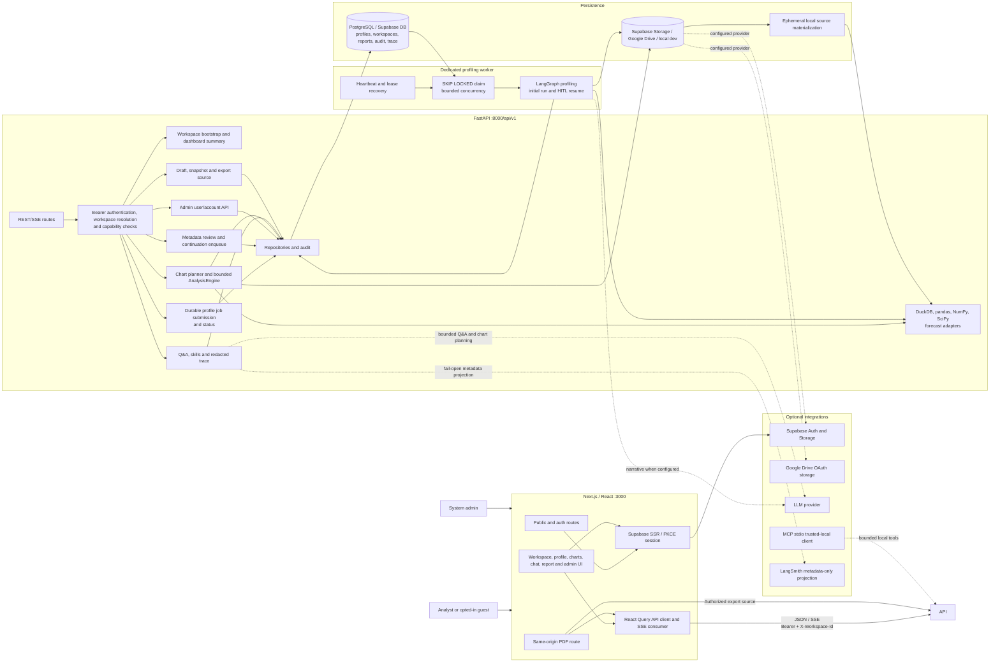
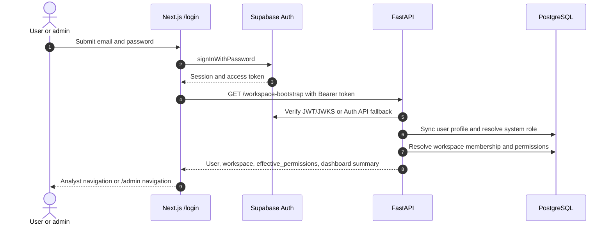
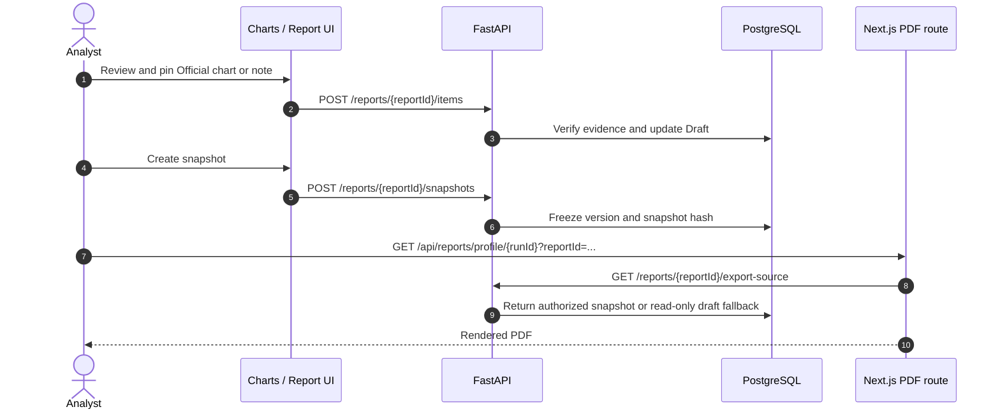

# VDaAgent Architecture

VDaAgent is an evidence-first data-profiling and visual-analytics workspace.
Its durable unit of work is a **Profile Run** inside a **workspace**. A chart,
Agent answer, report item, snapshot, audit record and execution evidence must
resolve to that Profile Run and workspace.

```text
Login / guest trial → workspace → dataset upload → queued Profile Run
  → profiling worker → metadata/PII review → completed profile
       ├─ Charts: plan → bounded Preview → Official evidence
       ├─ Agent Q&A: evidence-scoped answer
       ├─ Compare: drift between completed runs
       └─ Report Draft → immutable snapshot → PDF/JSON
```

## Product surface and roles

The public frontend introduces the product through `/`, `/about`, `/guide`,
`/docs` and `/contact`. Authentication routes are `/login`, `/signup`,
`/forgot-password`, `/auth/callback` and `/account/update-password`.

The analyst workspace includes `/dashboard`, `/workspaces`, `/datasets`,
`/profiles/{runId}`, `/profiles/{runId}/review`, `/charts`, `/chat`, `/compare`,
`/reports`, `/activity`, `/settings` and `/account`.

There is one shared login UI at `/login`; `/admin/login` does not exist. A
system admin uses the same Supabase email/password login and receives the
admin navigation at `/admin` when `user.accounts.read` is present. The admin
surface reads and manages system user profiles; workspace invitations continue
to create Analyst memberships and do not grant system admin.

Authorization has two layers:

- `user_profiles.role` is the system role: `analyst` or `admin`.
- `workspace_memberships.role` is the workspace role and is currently
  normalized to `analyst`.

The backend overlays system `admin` into the effective request role and returns
the resulting `effective_permissions` from `/workspace-bootstrap`. Admin has
all Analyst capabilities plus `user.accounts.read`, `user.account.manage` and
`system.admin`.

## Design boundaries

1. **Deterministic compute owns numbers.** DuckDB, pandas, NumPy, SciPy and the
   forecasting adapters produce profile statistics and aggregate results. An
   LLM may plan or explain, but is never the authority for a metric.
2. **Evidence is explicit.** A Preview is bounded and disposable. Promotion
   creates an Official execution with result hash, limits, provenance and
   current context binding. Only Official evidence can enter a report.
3. **All data access is workspace-scoped.** FastAPI resolves identity,
   workspace membership and capability before reading or writing a resource.
   Frontend checks are UX only; API guards are the security boundary.
4. **No unbounded execution or raw-row path.** Browser, Agent and MCP tools use
   structured allow-listed operations. They cannot submit raw SQL, Python,
   shell commands, arbitrary source paths or PII values.
5. **Export is snapshot-based.** A mutable Report Draft is snapshotted before a
   report is considered official. PDF/JSON export uses the authorized snapshot
   rather than live browser state.
6. **System and workspace roles are separate.** Workspace Analyst membership
   controls normal collaboration; system Admin controls user-account/system
   management and is not granted by an invitation.

## Runtime architecture



Profile submission returns `202 Accepted`; the client polls
`GET /profiling-jobs/{jobId}` for `queued`, `running`, `succeeded` or `failed`.
That queue state is separate from Profile Run state: a succeeded job can leave
the run `pending_review`, and only the continuation after review makes it
`completed`. No HTTP request runs the profiling graph directly.

The PDF route is server-side by design: it requests an authorized export source
from FastAPI and renders text/SVG with Playwright Core and Chromium. The
frontend is otherwise a browser client of FastAPI and does not receive server
secrets.

## Deployment and integration boundaries

Production runs three independent Azure App Service processes:

1. **Frontend:** Next.js standalone image, exposed on port 8080. Public
   `NEXT_PUBLIC_*` values are embedded at image build time.
2. **API:** FastAPI backend image, exposed on port 8000. It owns auth
   verification, workspace/capability checks, business workflows, audit and
   storage access.
3. **Profiling worker:** the same backend image with a different startup
   command. It claims durable jobs and exposes a small worker health endpoint.

The GitHub Actions workflow runs quality checks on pull requests and before a
`main` deployment: Ruff, pytest against PostgreSQL, offline AI evaluation,
Vitest, typecheck, lint, Playwright E2E and frontend build. A deploy then:

- builds and pushes immutable backend/frontend images to Azure Container
  Registry;
- runs Alembic migrations;
- updates API, worker and frontend App Service settings;
- restarts all three processes; and
- checks backend `/health`, worker `/health` and frontend `/health`.

Secrets stay in GitHub Actions secrets or Azure App Settings. `NEXT_PUBLIC_*`
may be public browser configuration, but database URLs, Supabase secret/service
keys, OAuth credentials, storage credentials and LLM keys remain server-side.

Supabase is the identity provider. Google Drive is a separate OAuth storage
integration with callback `/api/v1/google-drive/callback`. The selected
`STORAGE_PROVIDER` is deployment configuration; local storage is for
development/test only. LangSmith is optional and fail-open; PostgreSQL remains
the authoritative trace store and the projection is metadata-only.

Profiling cancellation is intentionally not exposed. Existing pandas/DuckDB/
LangGraph computation has no cooperative safe boundary; forcefully terminating
a thread could make results or checkpoints inconsistent.

## Implemented components

| Component | Responsibility |
| --- | --- |
| Next.js / React | Browser UI, Supabase session transport, workspace navigation, charts, chat, reports, admin UI and PDF route |
| Auth provider | Supabase email/password session, signup confirmation, refresh and workspace bootstrap transport |
| FastAPI | REST/SSE API, CORS, auth, workspace/capability enforcement, audit and business workflows |
| Permissions service | Canonical `analyst`/`admin` roles and capability sets; legacy owner/viewer values normalize to Analyst |
| Admin API | System user listing, status lock/unlock, role update and permanent account deletion with audit |
| Profiling worker | Atomically claims durable Profile Runs/HITL continuations, renews lease and invokes LangGraph |
| LangGraph + native skills | Profiling/Q&A orchestration, bounded tool registry and optional redacted trace |
| `AnalysisEngine` | Validates `QuerySpec`, runs bounded aggregate/profile analysis and forecast |
| Chart planner | Converts approved-profile questions into a structured ChartPlan; deterministic fallback when LLM planning fails |
| Forecast registry | Catalogs 28 model adapters and runs only models whose dependency/data contract is available |
| PostgreSQL repositories | User profiles, workspace state, profile metadata, analysis sessions/executions, reports, audit and trace |
| Storage adapters | Dataset binary persistence and temporary materialization for tabular compute |
| Calendar integration | Google Calendar OAuth per workspace/user; Analyst UI/API and MCP tools for list/create/delete events |
| `mcp_server.py` | FastMCP stdio adapter for bounded profile/chart tools in trusted local processes |

The supported compute source is the uploaded file materialized by the selected
storage adapter. BigQuery, Snowflake and a standalone vector database are not
runtime compute backends. Knowledge-base retrieval is an optional in-app
capability, not a substitute for the Profile Run evidence boundary.

## Data ownership

| Data | System of record | Notes |
| --- | --- | --- |
| Identity and browser session | Supabase Auth | Browser uses SSR/PKCE; backend validates bearer credentials. |
| User profile and system role | PostgreSQL `user_profiles` | Stores email projection, `analyst`/`admin` role, status and lock metadata. |
| Workspace and membership | PostgreSQL | Protected lookups are workspace-scoped; membership role currently normalizes to Analyst. |
| Dataset binary | Supabase Storage, Google Drive or local dev storage | PostgreSQL keeps source reference, hash and metadata, not the blob. |
| Profile Run and column statistics | PostgreSQL | Statistics, review decisions, quality information and provenance bind to dataset/workspace. |
| Explorer session/execution | PostgreSQL | Preview/Official records bind query, context version, result hash and limitation. |
| Agent run and trace | PostgreSQL | Authoritative redacted provenance; never chain-of-thought or raw messages. |
| LangSmith projection | LangSmith, optional | Fail-open metadata-only copy; not a system of record. |
| Report Draft and snapshot | PostgreSQL | Draft is editable; snapshot is immutable and is the export source. |

Remote sources are copied to a temporary local file only while DuckDB/pandas
needs them, then removed. Production requires PostgreSQL and a configured
remote storage provider.

## Main flows

### Sign-in and admin authorization



`GLOBAL_ADMIN_EMAILS` can seed the system admin role during profile sync. The
admin API still enforces `user.accounts.read`/`user.account.manage` on every
request and records account-management audit events.

### Profile Run

```mermaid
sequenceDiagram
    autonumber
    actor A as Analyst
    participant UI as Next.js
    participant API as FastAPI
    participant Guard as Auth/workspace guard
    participant Store as Configured storage
    participant Worker as Profiling worker
    participant Graph as Profiling graph
    participant DB as PostgreSQL

    A->>UI: Upload CSV, TSV, Parquet or JSON
    UI->>API: POST /datasets/upload
    API->>Guard: Authenticate and check dataset-upload capability
    API->>Store: Persist dataset binary
    API->>DB: Save source reference, hash, metadata and audit
    A->>UI: Choose sample or full Profile Run
    UI->>API: POST /profile + Idempotency-Key
    API->>Guard: Check profile-run capability
    API->>DB: Persist queued Profile Run/job
    API-->>UI: 202 Accepted + job_id
    loop Until terminal or review required
        UI->>API: GET /profiling-jobs/{jobId}
        API->>DB: Read workspace-scoped job status
        API-->>UI: queued/running/succeeded/failed
    end
    Worker->>DB: Claim queued job with SKIP LOCKED and renew lease
    Worker->>Graph: Profile source with deterministic tools
    Graph->>DB: Save statistics, proposals and provenance
    Worker->>DB: Mark job succeeded; run may await review
    A->>UI: Confirm, edit or reject proposals
    UI->>API: PATCH /profile/{runId}/confirm
    API->>DB: Persist decisions and enqueue continuation
    Worker->>DB: Claim continuation and renew lease
    Worker->>Graph: Resume checkpoint and persist completed profile
```

### Charts and Official evidence

```mermaid
sequenceDiagram
    autonumber
    actor A as Analyst
    participant UI as /charts
    participant API as FastAPI
    participant Plan as Chart planner
    participant Engine as AnalysisEngine
    participant DB as PostgreSQL

    A->>UI: Select a completed Profile Run and ask a question
    UI->>API: POST /profile/{runId}/explorer/session
    API->>DB: Get or create profile-scoped Explorer context
    UI->>API: POST /profile/{runId}/charts/auto-plan
    API->>Plan: Use approved dimensions, measures and safe metadata
    Plan-->>UI: Validated ChartPlan or deterministic fallback
    UI->>API: POST /profile/{runId}/explorer/previews
    API->>Engine: Validate and run bounded Preview
    Engine->>DB: Save temporary execution and limits
    Engine-->>UI: Preview result
    A->>UI: Promote selected Preview
    UI->>API: POST .../previews/{previewId}/promote
    API->>Engine: Check context and quality gate; rerun Official
    Engine->>DB: Save Official result, hash and provenance
    Engine-->>UI: Evidence eligible for reporting
```

The browser never decides that an LLM plan is executable. FastAPI validates
columns, analysis kind, aggregation, dimensions, filters, time grain, forecast
algorithm, budgets and idempotency. Preview timeout, stale context and quality
gate block are intentional business outcomes.

The planner has 11 problem families and the compute layer exposes aggregate,
histogram, scatter, box, heatmap, forecast, missing-value, correlation,
cardinality, violin, donut and outlier analysis. The UI/backend release 15
native chart renderers; `map` remains a planner/schema vocabulary value without
a corresponding native renderer in the current report contract.

### Report and export



Before the first snapshot, the detail page may display a read-only draft with
`snapshot_hash: draft`; it is not an official report for sharing. After a
snapshot, submit/review/publish/archive lifecycle endpoints operate on the
workspace report. System admin is a separate user-account capability, not a
required report-approval role.

## API surface

All FastAPI endpoints use the `/api/v1` prefix.

| Domain | Representative endpoints |
| --- | --- |
| Auth/workspace | `GET /session`, `GET /me`, `GET /workspace-bootstrap`, `GET/POST /workspaces`, membership, invitation, configuration and guest endpoints |
| Dataset/profile | `POST /datasets/upload`, `GET /datasets`, `POST /profile` (`202`), `GET /profiling-jobs/{jobId}`, `GET /profile/{runId}`, `PATCH /profile/{runId}/confirm` |
| Quality/drift | `POST /profile/{runId}/test`, `POST /profile/{runId}/drift` |
| Charts/Explorer | `POST /profile/{runId}/charts/auto-plan`, `POST /profile/{runId}/charts/auto-profile-pack`, `GET /profile/{runId}/charts/algorithms`, session, previews and promote |
| Analysis sessions | `/analysis-sessions` list/create/get, context version, quality gate and execution endpoints |
| Agent/evidence | `POST /qa`, `POST /qa/stream`, `GET /agent-runs/{runId}`, `/trace`, `/trace-summary`, `/plan`, `/evidence` |
| Reports | `GET/POST /profile/{runId}/report-draft`, report items/snapshots, export source, submit, review, publish and archive |
| Admin | `GET /admin/users`, `POST /admin/users/{userId}/status`, `POST /admin/users/{userId}/role`, `DELETE /admin/users/{userId}` |
| Google Drive | `GET /google-drive/status`, `GET /google-drive/connect`, callback and `DELETE /google-drive/connection` |
| Agent skills | `GET /agent-skills`, `GET /agent-skills/{skillName}`, inspect endpoint |

## Security and operational invariants

- FastAPI authenticates Bearer access tokens and resolves `X-Workspace-Id` (or
  an eligible default) before every protected operation. A cross-workspace
  identifier is not enough to access a resource.
- System admin endpoints use `user.accounts.read` for listing and
  `user.account.manage` for status/role/delete operations. Self-lock and
  self-delete are rejected, and account changes create audit events.
- Only public Supabase/browser configuration belongs in `NEXT_PUBLIC_*`.
  Database URLs, service keys, storage credentials, OAuth secrets and LLM keys
  remain server-side.
- Output guardrails and PII masking apply before content reaches UI, Agent,
  report, snapshot or MCP caller.
- `AGENT_TRACE_MODE=shadow` records redacted provenance without becoming the
  source of profile/Q&A results. `required` should only be enabled after trace
  persistence has monitoring and incident handling.
- Q&A has bounded short-term conversation memory: the client sends recent
  history, the API caps it, and the Agent uses only the latest eight messages
  with per-message truncation. This context is request-scoped and is not a
  long-term workspace/personal memory store.
- `LANGSMITH_TRACING` is opt-in and requires a server-side API key. A LangSmith
  outage cannot fail a user request or replace PostgreSQL trace.
- `UX_COMMAND_CENTER_ENABLED` enables backend contracts; its `NEXT_PUBLIC_`
  counterpart is a frontend build-time flag and requires a new build/deploy.
- Guest storage/retention is bounded and isolated from durable production
  workspace storage.

## Deliberate limits

- No arbitrary SQL, raw-row analysis, data-cleaning recipe, multi-table join or
  general code execution is exposed through UI, Agent or MCP.
- Preview is bounded and may be approximate; it is never durable report
  evidence until the Official promote path succeeds.
- Forecast values are model estimates with limitations, not facts. A model is
  hidden/disabled when its package or required data contract is unavailable.
- Planner autonomy, verifier enforcement, circuit breaking and long-term
  workspace/personal memory are feature-gated rather than released workflows.
- Profile jobs are durable and asynchronous, but cancellation is not exposed:
  forcefully stopping pandas/DuckDB/LangGraph could leave computation or
  checkpoint persistence inconsistent.
- Guest workspaces are trial sessions with separate retention/storage policy;
  they are not durable production storage.
