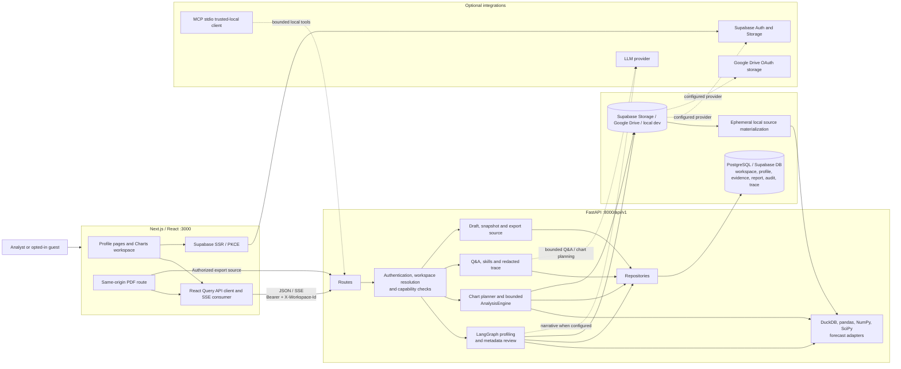
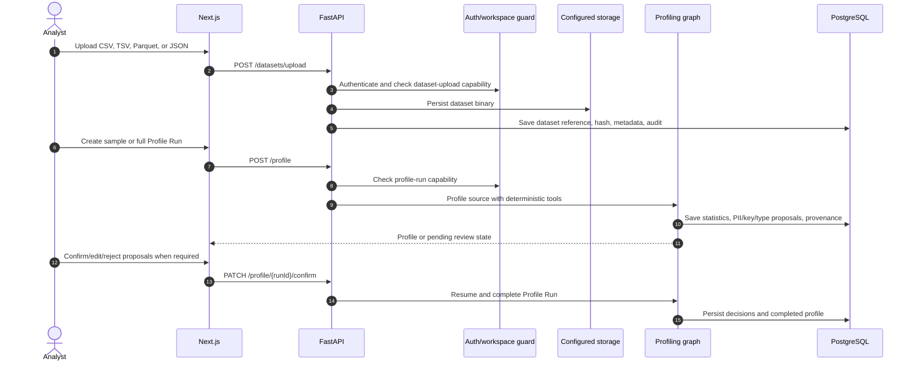
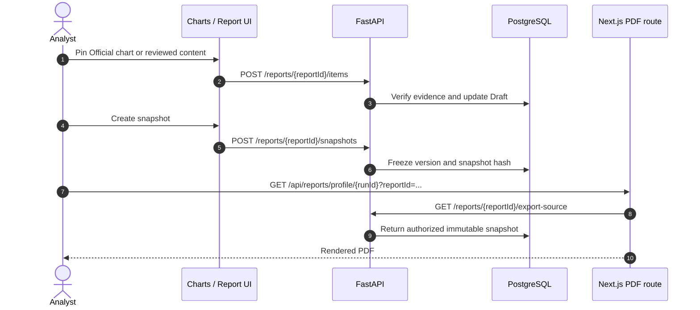

# VDaAgent Architecture

VDaAgent is an evidence-first data-profiling and visual-analytics workspace.
Its durable unit of work is a **Profile Run** within a workspace. A chart,
agent answer, report item, snapshot, audit record, and execution evidence must
all resolve back to that Profile Run and its workspace.

```text
Dataset upload → Profile Run → metadata/PII review when needed → completed profile
                                                ├─ Charts workspace
                                                │   plan → Preview → Official evidence
                                                ├─ Agent Q&A
                                                └─ Report Draft → snapshot → PDF/JSON
```

The current product surface has two related workspaces:

- `/profiles/{runId}` is the Profile Run Command Center: Overview, Ask Agent,
  and Report.
- `/charts` selects a completed Profile Run and creates evidence-backed charts
  with the same Explorer context and Report Draft.

`/analyses` and `/notebooks` remain compatibility routes. They are not the
primary navigation or the main data model for new work.

## Design boundaries

1. **Deterministic compute owns numbers.** DuckDB/pandas/NumPy/SciPy and the
   forecasting adapters produce profile statistics and aggregate results. An
   LLM may plan or explain, but is never the authority for a metric.
2. **Evidence is explicit.** A Preview is limited and expendable. Promotion
   produces an Official execution with a result hash, limits, provenance, and
   current context binding; only that result can enter a report as evidence.
3. **All data access is workspace-scoped.** FastAPI resolves identity,
   workspace membership, and capability before it reads or writes a resource.
4. **No unbounded execution or raw-row path.** Browser, Agent, and MCP tools
   use structured, allow-listed operations. They cannot submit raw SQL, Python,
   shell commands, arbitrary source paths, or PII values.
5. **Export is immutable.** A mutable Report Draft must be snapshotted before
   PDF/JSON export; the export source is the authorized snapshot, not the live
   browser state.

## Runtime architecture



The frontend is deployed separately and calls FastAPI through
`NEXT_PUBLIC_API_URL`. The PDF route is server-side by design: it requests an
authorized export source from FastAPI before rendering the document.

## Implemented components

| Component | Responsibility |
| --- | --- |
| Next.js / React | Browser UI, Supabase session transport, Charts workspace, report UI and PDF route |
| FastAPI | REST/SSE API, CORS, auth, workspace/capability enforcement, audit and business workflows |
| LangGraph + native skills | Profiling/Q&A orchestration; bounded tool registry and optional redacted trace |
| `AnalysisEngine` | Validates `QuerySpec`, runs bounded aggregates, profile-derived analysis and forecasts |
| Chart planner | Turns an approved-profile question into a structured ChartPlan; uses a rule fallback if LLM planning fails |
| Forecasting registry | Describes 30 model capabilities and runs only models whose dependency/contract is available |
| PostgreSQL repositories | Workspace state, profile metadata, analysis sessions/executions, reports, audit and trace |
| Storage adapters | Dataset binary persistence and temporary materialization for tabular compute |
| `mcp_server.py` | FastMCP stdio adapter for bounded profile/chart tools in trusted local processes |

The supported data compute source is the uploaded file materialized by the
configured storage adapter. BigQuery, Snowflake, and a standalone vector
database are not implemented as runtime compute backends. Knowledge-base
retrieval is an optional in-application capability, not a substitute for the
Profile Run evidence boundary.

## Data ownership

| Data | System of record | Notes |
| --- | --- | --- |
| Identity and browser session | Supabase Auth | Browser uses Supabase SSR/PKCE; backend validates bearer credentials. |
| Workspace, membership, permissions | PostgreSQL | Every protected resource lookup is workspace-scoped. |
| Dataset binary | Supabase Storage, Google Drive, or local dev storage | PostgreSQL records source reference, hash, and metadata; it does not duplicate the blob. |
| Profile Run and column statistics | PostgreSQL | Statistics, review decisions, quality information and provenance are tied to one dataset/workspace. |
| Explorer session/execution | PostgreSQL | Preview and Official execution records bind query, context version, result hash and limitation. |
| Agent run and trace | PostgreSQL | Trace records redacted operational provenance, never chain-of-thought or raw messages. |
| Report Draft and snapshot | PostgreSQL | Draft is editable; snapshot is immutable and is the export source. |

Remote sources are copied to a temporary local file only while DuckDB/pandas
needs them. The materialization is then removed. Production requires PostgreSQL
and a configured remote storage provider; local storage is development/test
only.

## Main flows

### Profile Run



Profiling may create a narrative through an LLM provider, but the statistics and
proposal evidence come from deterministic tools. The core profile remains
usable if an LLM is unavailable.

### Charts and Official evidence

```mermaid
sequenceDiagram
    autonumber
    actor A as Analyst
    participant UI as /charts
    participant API as FastAPI
    participant Plan as Chart planner
    participant Engine as AnalysisEngine
    participant DB as PostgreSQL

    A->>UI: Select a completed Profile Run and ask a question
    UI->>API: POST /profile/{runId}/explorer/session
    API->>DB: Get/create profile-scoped Explorer context
    UI->>API: POST /profile/{runId}/charts/auto-plan
    API->>Plan: Use approved dimensions, measures and safe metadata
    Plan-->>UI: Validated ChartPlan or deterministic fallback plan
    UI->>API: POST /profile/{runId}/explorer/previews
    API->>Engine: Run bounded Preview
    Engine->>DB: Save temporary/approximate execution
    Engine-->>UI: Preview result and limits
    A->>UI: Promote selected Preview
    UI->>API: POST .../previews/{previewId}/promote
    API->>Engine: Check context and quality gate; rerun Official
    Engine->>DB: Save Official result, hash and provenance
    Engine-->>UI: Evidence eligible for reporting
```

The browser never decides that an LLM plan is valid. The backend validates the
selected columns, analysis kind, aggregation, dimensions, filters, time grain,
forecast algorithm, budgets and idempotency key. Preview timeouts, stale
contexts and quality-gate blocks are intentional business outcomes.

### Report and export



## API surface

All FastAPI endpoints use the `/api/v1` prefix.

| Domain | Representative endpoints |
| --- | --- |
| Dataset/profile | `POST /datasets/upload`, `GET /datasets`, `POST /profile`, `GET /profile/{runId}`, `PATCH /profile/{runId}/confirm` |
| Charts | `POST /profile/{runId}/charts/auto-plan`, `POST /profile/{runId}/charts/auto-profile-pack`, `GET /profile/{runId}/charts/algorithms` |
| Explorer | `POST /profile/{runId}/explorer/session`, `POST /profile/{runId}/explorer/previews`, `POST /profile/{runId}/explorer/previews/{previewId}/promote` |
| Agent/evidence | `POST /qa`, `POST /qa/stream`, `GET /agent-runs/{runId}`, `GET /agent-runs/{runId}/evidence` |
| Reports | `GET/POST /profile/{runId}/report-draft`, `POST /reports/{reportId}/items`, `POST /reports/{reportId}/snapshots`, `GET /reports/{reportId}/export-source` |
| Workspace/auth | `GET /session`, `GET/POST /workspaces`, membership, invitation, configuration and guest endpoints |

## Security and operational invariants

- FastAPI resolves `X-Workspace-Id` (or an eligible default) and checks the
  capability on every protected endpoint. A missing or cross-workspace resource
  is not treated as accessible merely because its identifier is known.
- Only public Supabase/browser configuration belongs in `NEXT_PUBLIC_*`.
  Database URLs, service keys, storage credentials, OAuth secrets and LLM keys
  remain server-side.
- Output guardrails and PII masking apply before content reaches UI, Agent,
  report, snapshot, or MCP caller.
- `AGENT_TRACE_MODE=shadow` records redacted provenance without making it the
  source of profile/Q&A results. `required` should be enabled only after trace
  persistence has monitoring and incident handling.
- `UX_COMMAND_CENTER_ENABLED` enables backend contracts; its
  `NEXT_PUBLIC_` counterpart is a frontend build-time flag and requires a new
  frontend build/deploy after it changes.

## Deliberate limits

- No arbitrary SQL, raw-row analysis, data-cleaning recipe, multi-table join or
  general code execution is exposed through UI, Agent, or MCP.
- Preview is bounded and may be approximate; it is never durable report
  evidence.
- Forecast values are model estimates with limitations, not facts. A model is
  hidden/disabled when its package or required future exogenous input is absent.
- Planner autonomy, verifier enforcement, durable jobs, circuit breaking and
  long-term workspace/personal memory are feature-gated rather than released
  workflows.
- Guest workspaces have a separate retention/storage policy and are not durable
  production storage.
