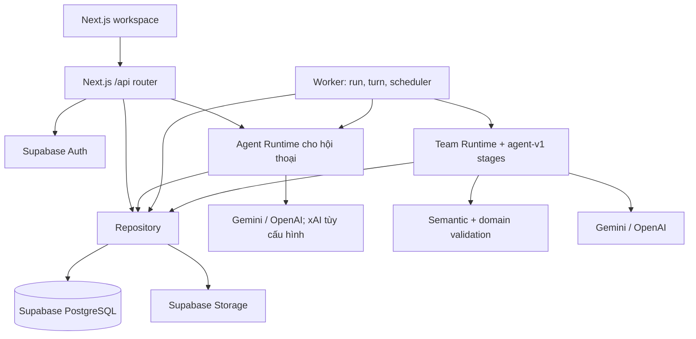

# Kiến trúc VDaAgent

VDaAgent là một ứng dụng Next.js đi cùng worker và PostgreSQL/Supabase. Đây là bản đồ đọc nhanh; các ranh giới và quy trình chi tiết nằm trong [docs/architecture](docs/architecture/overview.md).

```mermaid
flowchart TB
  UI[Next.js workspace] --> API[Next.js /api router]
  API --> AUTH[Supabase Auth]
  API --> REPO[Repository]
  REPO --> PG[(Supabase PostgreSQL)]
  REPO --> STORAGE[Supabase Storage]
  API --> CHAT[Agent Runtime cho hội thoại]
  CHAT --> REPO
  CHAT --> CHATLLM[Gemini / OpenAI; xAI tùy cấu hình]
  WORKER[Worker: run, turn, scheduler] --> REPO
  WORKER --> CHAT
  WORKER --> TEAM[Team Runtime + agent-v1 stages]
  TEAM --> SEM[Semantic + domain validation]
  TEAM --> LLM[Gemini / OpenAI]
  TEAM --> REPO
```

## Các ranh giới chính

| Khối                     | Sở hữu việc gì                                                                                | Điểm bắt đầu đọc code                                                  |
| ------------------------ | --------------------------------------------------------------------------------------------- | ---------------------------------------------------------------------- |
| Next.js UI + API         | Workspace, session, HTTP route, response/stream; không giữ queue lâu dài                      | `src/frontend/features/workspace`, `src/frontend/server/api/router.ts` |
| Repository + contracts   | Kiểm quyền theo organization, transaction, snapshot/lineage, lease và schema request/response | `src/backend/database`, `src/contracts`                                |
| Worker                   | Tick lịch, claim turn job/run, heartbeat và dispatch theo workflow version                    | `src/backend/worker/main.ts`, `src/backend/worker/run-loop.ts`         |
| Agents + semantic/domain | Chat planning/capability; stage phân tích, số liệu xác định và kiểm chứng report              | `src/backend/agents`, `src/backend/semantic`, `src/backend/domain`     |

Ứng dụng không có một backend HTTP service riêng: route `/api/[...path]` nằm trong Next.js. Worker là process Node độc lập, dùng cùng repository. `organizations` và membership tạo biên dữ liệu; “workspace” là bề mặt UI, không phải bảng workspace riêng.

## Các luồng chính

1. UI gọi `/api`; router xác thực người dùng, kiểm tra nguồn request và chuyển tới repository. Repository áp dụng phân quyền tổ chức và giao dịch dữ liệu.
2. Một câu hỏi hội thoại tạo message và, nếu đủ điều kiện, `agent_turn_job` bền vững. Worker nhận job; một số câu trả lời đọc ngắn chạy qua Agent Runtime ngay trong API khi không dùng durable admission. Lựa chọn phụ thuộc request và feature flags.
3. Phân tích mới tạo `run` `agent-v1` cùng tập snapshot cố định. Worker claim run bằng lease/fencing token. Coordinator gọi Data, các nhánh Comparison/Chart/Analyst, Insight, Report và Reviewer. Stage publication chỉ ghi báo cáo khi review đạt `PASS`.
4. UI lấy lại trạng thái qua REST, polling hoặc SSE có cursor. Refresh/disconnect không xóa run đã lưu. API đọc từ PostgreSQL thay vì giữ tiến độ chỉ trong bộ nhớ web.

Chat và analysis là hai đơn vị thực thi khác nhau. Một chat turn đọc dữ liệu đã có có thể trả lời mà không tạo run; turn được nhận vào durable queue có `agent_turn_job`, invocation và event riêng. Một câu hỏi cần phân tích tạo `run`, chốt snapshot ở lúc enqueue; full run mới qua Coordinator và Reviewer, còn specialist run có thể dừng ở artifact. `task` là checkpoint của stage trong run, `invocation` là lần gọi agent, nên không nên dùng hai từ này thay nhau.

## Dữ liệu và độ tin cậy

PostgreSQL lưu tổ chức, import/snapshot, conversation/message, run/task, artifact/validation, agent job/invocation/event, memory, report/version và schedule. Supabase Storage giữ CSV nguồn và file export trong bucket riêng tư. Các artifact mang hash và tham chiếu nguồn; validation kiểm tra scope, lineage và bằng chứng trước publication. Worker heartbeat để gia hạn lease; write được chặn khi mất lease, run được thử lại tối đa theo chính sách hiện có. Run mới và worker claim dùng `agent-v1`; reader vẫn hiểu dữ liệu lịch sử `legacy-v1` nhưng không thực thi phiên bản đó.

Run mới có tối đa ba lần claim khi worker mất lease, dùng fencing token để ngăn owner cũ ghi. Lỗi workflow được ghi terminal; Reviewer có tối đa một vòng yêu cầu sửa draft. Publication kiểm lại persisted checkpoint và toàn bộ artifact trong transaction trước khi tạo report. Report version là các report record mới có lineage, khác với revision của draft trong một run. Streaming durable đọc event đã lưu; connection SSE bị đóng không hủy công việc.

## Ranh giới triển khai

Workspace hiện tập trung vào tồn kho bất động sản, chưa phải nền tảng phân tích dữ liệu tùy ý. MCP có gateway trong code nhưng workflow chính chưa đăng ký server. Không có registry/loader skill riêng. “Publish” ở đây là tạo report record nội bộ; repo không triển khai gửi báo cáo ra ngoài hay deployment từ UI.

Supabase Auth xác thực người dùng; repository và RLS kiểm quyền `owner`/`analyst`/`viewer` theo tổ chức. PostgreSQL và Storage là phụ thuộc bắt buộc; Gemini là provider chính, OpenAI là fallback theo cấu hình, xAI là adapter chat tùy chọn. Tài liệu [integrations](docs/architecture/integrations.md) ghi chiều dữ liệu và cách lỗi được xử lý.

Đọc tiếp: [system flow](docs/architecture/system-flow.md), [execution model](docs/architecture/execution-model.md), [data model](docs/architecture/data-model.md), [security](docs/architecture/security.md).
