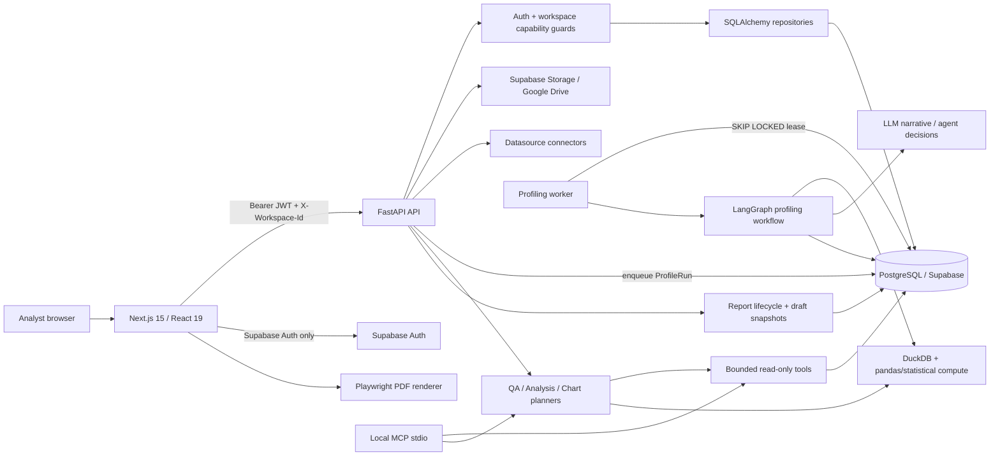

# PROJECT AUDIT REPORT

**Project:** P-170 / VDaAgent Data Profiling  
**Audit date:** 2026-08-31  
**Audit mode:** Read-only review; no product code was changed  
**Primary sources:** Current implementation, current working-tree documentation, tests, migrations, Docker and GitHub Actions configuration  
**Reviewer perspective:** Principal Software Engineer, Software Architect, Security Reviewer, Performance Engineer

> This report evaluates the repository as it exists in the current working tree. Existing uncommitted user changes were preserved. Where runtime configuration or a live Supabase privilege state could not be proved from the repository, the report says so explicitly.

## 1. Executive Summary

P-170 has a stronger product and engineering foundation than a typical prototype: the critical analytical numbers are deterministic rather than delegated to an LLM; workspace authorization is explicit; PII is masked fail-closed; profiling is a durable asynchronous workflow; evidence and report snapshots are first-class concepts; and the documentation is unusually candid about current behavior.

It is **not production-ready in its current snapshot**. The most serious release blocker is that the Alembic chain cannot bootstrap a fresh database even though production deliberately disables `metadata.create_all()`. High-priority risks also exist in Supabase Data API defense-in-depth, report approval governance, official-analysis quality-gate binding, connector SSRF, worker lease fencing, large-file memory behavior, destructive cleanup, reproducible Python builds, and CI/CD gates. The latest checked-in staging evaluation also explicitly fails its release gate.

### Scores

| Area | Score | Rationale |
| --- | ---: | --- |
| Architecture | 7.0/10 | Sound modular-monolith direction and clear product flows, weakened by very large persistence/router/UI modules and duplicated schema lifecycle paths. |
| Code Quality | 6.5/10 | Strong domain comments and many explicit contracts; several god files, broad exception handling, and hidden cross-service side effects remain. |
| Maintainability | 5.8/10 | Good tests/docs, but 5,726-line repository, 2,050-line route module, 4,181-line CSS, and manual contract generation increase change risk. |
| Performance | 5.5/10 | DuckDB and bounded previews are appropriate; sync DB/auth in async paths, full in-memory downloads, full pandas materialization, SSE polling, and unbounded lists limit scale. |
| Security | 5.6/10 | JWT and application authorization are thoughtful; incomplete RLS/grant migrations, connector SSRF, permissive CSP, and an unauthenticated MCP identity boundary are material gaps. |
| Reliability | 4.8/10 | Durable queue/idempotency are good foundations, but fresh migration failure, unfenced lease loss, cross-system deletion, weak readiness, and non-atomic audit writes are production risks. |
| Testing | 6.2/10 | Broad backend/frontend coverage and real E2E tests exist; the current backend run is not green or isolated, one E2E test is stale, and migration/RLS/security failure paths are missing. |
| Documentation | 8.0/10 | Current docs explain flows and known gaps well; one deployment reference is stale and backup/DR/runbook coverage is missing. |
| Developer Experience | 6.2/10 | Clear local guidance and type generation artifacts exist; Python builds are unlocked, OpenAPI generation is manual, and tests depend on a shared database. |
| Production Readiness | 4.8/10 | Containers and Azure deployment exist, but migration, release gates, readiness, recovery, dependency scanning, and current AI quality gates are not acceptable for an enterprise release. |

### Overall Score: **6.0/10**

The system is a credible, well-conceived pre-production product, not a disposable prototype. It should be stabilized incrementally; a rewrite or premature microservice split would destroy more value than it creates.

### Release recommendation

**NO-GO for a new production environment or enterprise handoff** until P0-01 is fixed and the P1 security/governance/reliability gates are resolved or explicitly risk-accepted. A controlled demo using an already-provisioned environment is possible after the one-day checklist near the end of this report.

## 2. Audit Scope and Evidence

### Repository surveyed

- 348 files were enumerated in the repository snapshot.
- Primary implementation size is approximately 59,820 lines across Python, TypeScript/TSX, CSS, migrations, tests, and operational configuration.
- Main areas: `backend/src`, `backend/migrations`, `frontend/src`, `frontend/tests`, `tests`, `docs`, `evaluations`, `.github/workflows`, Dockerfiles and configuration.
- Current working tree already contained modified/deleted/untracked user documentation, evaluation, workflow and worklog files. None were reverted or included in a commit.

### Validation performed

| Check | Result |
| --- | --- |
| `ruff check backend/src tests` | **PASS** |
| Backend `pytest -q` | **FAIL:** 219 passed, 17 failed, 33 errors, 1 skipped, 3 warnings; 510.31s |
| Frontend Vitest | **PASS:** 67 passed, 1 skipped |
| Frontend TypeScript | **PASS** |
| Frontend ESLint | **PASS**, with warning that the Next.js ESLint plugin was not detected |
| Frontend production build | **PASS**; 30 static/dynamic routes generated |
| Frontend Playwright | **FAIL:** 18 passed, 1 failed; single-test rerun failed consistently |
| `pnpm audit --prod --json` | **PASS:** 0 known production dependency vulnerabilities at audit time |
| Tracked-file secret signature scan | No matching AWS/private-key/known token signatures found |
| Python vulnerability scan | **Not run:** `pip-audit` is not installed and the project has no resolved lock/constraints file |
| Gitleaks | **Not run:** tool is not installed |
| Migration smoke test on empty PostgreSQL | No repository test exists; static migration trace proves the bootstrap defect in P0-01 |

The backend failure cluster is not presented as 50 independent product regressions. The configured test database retained hundreds of historical jobs, and read-only inspection after the run showed three external worker identities consuming newly submitted local test jobs and marking them `invalid_dataset`. That is strong evidence of an **environment isolation defect**. It does not prove the same assertions fail on CI's ephemeral PostgreSQL service.

### Explicit evidence limitations

- **Insufficient evidence:** The repository does not prove the current live Supabase `anon`/`authenticated` grants, exposed-schema setting or dashboard-created policies. It proves that migrations do not enforce the intended invariant; live exploitability must be verified in the environment.
- **Insufficient evidence:** No Azure subscription, App Service, network security group, Key Vault, alerting or backup configuration was inspected. Repository absence means the controls are not reproducible here, not necessarily that an operator never configured them manually.
- **Insufficient evidence:** Python dependency vulnerability status cannot be established without a resolved lock and vulnerability scan. Broad version ranges also mean the current virtual environment is not a reliable statement about the next production build.
- **Insufficient evidence:** This audit did not run a controlled load test, memory profiler or database `EXPLAIN ANALYZE` on production-sized data. Performance severity is based on confirmed allocation/I/O/query patterns and existing staging latency artifacts, not invented throughput numbers.
- **Insufficient evidence:** The tracked working tree was signature-scanned, but full Git history and external secret stores were not scanned because Gitleaks or an equivalent tool is not installed.

## 3. Project Architecture

### Current architecture from implementation



### Subsystems and entry points

| Subsystem | Entry point | Responsibility |
| --- | --- | --- |
| Frontend | `frontend/src/app/layout.tsx`, App Router pages | Authenticated/public UI, React Query client state, uploads, review, analysis, report and PDF UX |
| API | `backend/src/main.py` | FastAPI lifespan, middleware, error handlers, routers, health |
| Core API routes | `backend/src/api/routes.py` | Profile, jobs, QA, upload, datasource and dataset endpoints |
| Auth/workspace/report API | `backend/src/api/authz_routes.py` | Session, workspace membership/lifecycle and report lifecycle |
| Analysis API | `backend/src/api/analysis_routes.py` | Preview, quality gate, official execution and promotion |
| Profiling worker | `backend/src/workers/profiling_worker.py` | Durable claim, heartbeat, retry/recovery and profiling execution |
| Agent graph | `backend/src/agents/graph.py`, `backend/src/agents/nodes/*` | Profiling/QA orchestration, HITL and evidence-aware narrative generation |
| Deterministic compute | `backend/src/services/compute.py`, `analysis_engine.py` | Profile statistics, PII signals and allow-listed analytical queries |
| Persistence | `backend/src/services/repository.py`, specialized repositories | SQLAlchemy Core metadata and transactional persistence |
| Migrations | `backend/migrations/versions/*` | Production schema evolution |
| Local MCP | `backend/src/mcp_server.py` | Local stdio profile/evidence/chart tools |
| Deployment | `.github/workflows/azure-container-deploy.yml` | Build, migration, Azure App Service container deployment and health probes |

### Architectural assessment

The best description is a **modular monolith with an independently deployed worker**. This is the right deployment topology for the present team and domain. The primary architectural problem is not the absence of microservices; it is that the internal modules have become uneven: a few central files own too many tables, operations and UI concerns.

The system can plausibly grow 5x with focused changes: fix database and job correctness first, split the repository/router/UI by domain behind existing interfaces, introduce shared rate limiting/metrics and stream large files. At 10x, SSE polling, sync request-path SQL, per-request Auth fallback, unbounded lists and the single queue table will need measured redesign. None of this requires a rewrite.

## 4. Critical Flow Traces

### 4.1 Authentication and workspace authorization

```text
Browser Supabase session
→ Authorization: Bearer JWT
→ SupabaseJWTVerifier (alg/kid/issuer/audience/exp/sub/role)
→ active user profile check
→ X-Workspace-Id resolution
→ active membership + canonical role
→ capability guard
→ repository query with workspace predicate
```

**Boundary assessment:** Application authorization is strong and deliberately does not trust `user_metadata`. System Admin is separated from Analyst workspace authority. The weak point is database defense-in-depth: many public-schema tables are not covered by migrations that enable RLS/revoke Data API grants.

### 4.2 Upload and profiling

```text
Upload or existing Dataset
→ streamed file validation / durable source reference
→ POST profile with Idempotency-Key
→ ProfileRun queued in PostgreSQL
→ worker SELECT ... FOR UPDATE SKIP LOCKED
→ lease + heartbeat
→ materialize source
→ deterministic DuckDB/pandas compute
→ agent proposals/narrative
→ pending_review HITL
→ durable resume
→ completed profile + evidence
```

**Boundary assessment:** The durable contract, idempotency and persisted projection are excellent foundations. Lease loss is not fenced from downstream mutations, and full scans can materialize the whole source twice in memory. The queue tests are currently vulnerable to unrelated workers sharing the test database.

### 4.3 Command Center analysis

```text
Profile summary
→ analysis session and source
→ semantic context version
→ bounded Preview QuerySpec
→ deterministic quality gate
→ promote or generic Official execution
→ immutable result hash/evidence
→ optional report pin
```

**Boundary assessment:** QuerySpec allow-listing and bound filter parameters are good. The generic Official endpoint can bind the newest approved context to the newest gate even when they belong to different versions; the promotion path correctly detects this mismatch, but the generic path does not.

### 4.4 QA / Agent

```text
Question
→ prompt-injection / privacy guard
→ deterministic router
→ quantitative read-only tool OR qualitative retrieval
→ structured response validation
→ evidence / verification trace
→ SSE or JSON response
```

**Boundary assessment:** The design correctly keeps arithmetic and raw-row access out of the LLM. Current staging evaluations nevertheless fail evidence binding, abstention and one planner PII allow-list case; the architecture is good, but the present model/tool policy has not met its own release gate.

### 4.5 Reports

```text
Completed profile / official evidence
→ mutable report draft
→ snapshot
→ submit
→ review
→ publish
→ export source
→ Next.js/Playwright PDF
```

**Boundary assessment:** Draft/snapshot separation is appropriate. The public submit implementation skips review and publishes immediately, every Analyst holds submit/review/publish capabilities, and “published” read/export endpoints can return drafts.

### 4.6 External connectors

```text
Analyst connector form
→ normalize config
→ backend network/file probe
→ encrypted credential persistence
→ Dataset datasource:// reference
→ materialize up to bounded rows as Parquet
→ standard profiling pipeline
```

**Boundary assessment:** Credentials are encrypted and not returned. Network destination policy and DuckDB local-file/query policy are insufficient for an enterprise backend.

## 5. What Is Already Good — KEEP AS IS

1. **Deterministic numbers, LLM for interpretation.** `backend/src/services/compute.py:1-8` and `backend/src/agents/prompts.py:17-32` establish the right evidence boundary. Do not move statistical computation into prompts.
2. **Fail-closed PII masking.** `backend/src/services/repository.py:1145-1150` masks `pending` as well as confirmed PII. This is safer than waiting for human review.
3. **No raw-SQL public analysis endpoint.** `analysis_engine.py` validates analysis kinds/columns and uses bound parameters for filter values. Keep QuerySpec as the public contract.
4. **Workspace-scoped application authorization.** `backend/src/api/dependencies.py:119-176` resolves active membership and hides cross-tenant existence with 404 behavior.
5. **JWT validation strategy.** Asymmetric algorithms, `kid`, issuer, audience, expiry, subject UUID and authenticated role are validated in `backend/src/services/auth.py:119-186`.
6. **Durable profiling queue foundation.** PostgreSQL `SKIP LOCKED`, idempotency, lease, retry and persisted state are much better than FastAPI background tasks.
7. **Upload handling.** The upload path streams chunks, bounds size, sanitizes filenames and cleans temporary failures; do not replace it with a full-buffer upload.
8. **Evidence-first report model.** Immutable execution hashes, report snapshots, approximation flags and source metadata are the right product primitives.
9. **Agent trace failure isolation.** Shadow observability failures are generally prevented from breaking the primary workflow. Broad exceptions are justified at this boundary when they remain observable.
10. **Container baseline.** Backend and frontend production images run as non-root users and have explicit health probes.
11. **Frontend server/client state.** React Query, centralized auth transport, optimistic rollback and explicit loading/error/empty states are appropriate; no Redux-style global store is needed now.
12. **Frontend production dependency state.** A pnpm lockfile exists, and the current production audit reported zero known vulnerabilities.
13. **Documentation honesty.** Current docs describe known report-governance and deployment gaps rather than claiming controls that do not exist.
14. **Modular-monolith deployment.** Keep one API plus one worker until measured scaling evidence justifies another service boundary.

## 6. Critical Findings — P0

### P0-01 — Alembic cannot bootstrap a fresh production database

- **Issue:** The migration chain assumes core tables already exist, but production explicitly does not create them.
- **Severity:** P0 — Critical
- **File / module:** `backend/migrations/versions/20260812_0001_workspace_authz.py`, `backend/src/services/repository.py`, deployment workflow
- **Evidence:**
  - `backend/migrations/versions/20260812_0001_workspace_authz.py:3-8` says the first migration targets databases previously bootstrapped by `create_all`.
  - `backend/migrations/versions/20260812_0001_workspace_authz.py:173-181` calls `_ensure_column()` for `datasets`, `profile_runs`, `analysis_sessions`, `retrieval_documents` and `audit_events` without creating those tables.
  - `_has_column()` calls SQLAlchemy inspection directly at `backend/migrations/versions/20260812_0001_workspace_authz.py:34-35`; an empty database has no such table.
  - `backend/src/services/repository.py:1167-1187` runs `metadata.create_all()` and compatibility migrations only outside production.
  - `.github/workflows/azure-container-deploy.yml:305-320` runs `alembic upgrade head`; no empty-database migration test exists.
- **Current implementation:** Legacy databases are expected to predate Alembic. New production databases are expected to use Alembic, but the baseline does not represent the full metadata schema.
- **Why this is a problem:** The two schema creation paths are mutually dependent. A clean deploy, disaster recovery into an empty database, review environment or new tenant environment can fail before the API starts.
- **Real-world impact:** Production outage during environment provisioning or recovery; inability to prove schema reproducibility; high-risk manual database intervention.
- **Recommended solution:**
  1. Generate and review a true baseline migration for the complete current schema.
  2. Preserve a separate legacy adoption procedure that stamps an already-bootstrapped database only after schema verification.
  3. Add CI that creates empty PostgreSQL, runs `alembic upgrade head`, imports app metadata, and verifies expected tables/constraints/indexes.
  4. Remove local compatibility migrations only after the baseline and local workflow have converged.
- **Example refactor:** `baseline_current_schema` → `legacy_schema_verifier/stamp` → all future revisions are strictly incremental; CI runs both “fresh” and a sanitized “legacy upgrade” fixture.
- **Effort:** Large
- **Priority:** Fix before the next production/environment deployment.

## 7. High Priority Findings — P1

### P1-01 — Public-schema RLS and grants are incomplete

- **Issue:** Many tenant/sensitive tables created by migrations never receive RLS, and no migration revokes or explicitly grants `anon`/`authenticated` privileges.
- **Severity:** P1 — High; elevate to P0 if live privilege verification shows client roles currently have grants on these tables.
- **File / module:** `backend/migrations/versions/*`, `backend/src/services/repository.py`
- **Evidence:**
  - The first RLS list covers only 14 tables at `20260812_0001_workspace_authz.py:209-216`.
  - Agent tables are covered separately at `20260813_0004_agent_runtime.py:517-531`.
  - Later sensitive public tables are created without RLS: Google refresh-token/OAuth state tables at `20260812_0003_google_drive_storage.py:15-40`, context/theme/report-item tables at `20260819_0012_ux_command_center.py:49-148`, datasource credential metadata at `20260825_0017_external_datasources.py:15-27`, and connector idempotency at `20260827_0019_connector_identity.py:31-40`.
  - Core child tables such as `column_stats`, proposal tables, quality gates/issues and query executions are also absent from the initial RLS list.
  - Repository-wide migration search found no `CREATE POLICY`, `REVOKE` or `GRANT` statements.
- **Current implementation:** FastAPI enforces capability and workspace predicates. Comments assume the browser has no database grants, but migrations do not make that an invariant.
- **Why this is a problem:** Supabase's Data API exposes configured schemas independently of whether the frontend application calls `.from()`. Current Supabase guidance requires grants and RLS for every exposed object; older/existing projects may grant CRUD to `anon` and `authenticated` by default.
- **Real-world impact:** A publishable key plus a user JWT may allow direct REST access outside FastAPI if live grants exist. Tables include encrypted connector/OAuth material and cross-tenant analytical evidence.
- **Recommended solution:** Inventory `pg_class`, `pg_policies`, `information_schema.role_table_grants` and exposed schemas in each environment; disable the Data API if it is not needed, or move internal tables to a non-exposed schema; otherwise enable/force RLS, revoke defaults, grant least privilege, and add pgTAP allow/deny tests for every table.
- **Example refactor:** A migration should pair `ALTER TABLE ... ENABLE ROW LEVEL SECURITY`, `REVOKE ALL ... FROM anon, authenticated`, explicit required grants and tests. Do not rely on comments or dashboard-only configuration.
- **Effort:** Medium to Large
- **Priority:** Immediate security verification and remediation.
- **External basis:** [Supabase RLS](https://supabase.com/docs/guides/database/postgres/row-level-security), [Securing the Data API](https://supabase.com/docs/guides/api/securing-your-api).

### P1-02 — Report separation-of-duties is bypassed

- **Issue:** Submit publishes immediately; every Analyst can submit, review and publish; “published” reads can return drafts.
- **Severity:** P1 — High
- **File / module:** report service, permissions and authz routes
- **Evidence:**
  - `_ANALYST` includes draft write, submit, review and publish at `backend/src/services/permissions.py:51-80`.
  - `ReportService.submit_report()` calls `repo.publish_report()` directly at `backend/src/services/report_service.py:114-130`.
  - The public submit endpoint uses that service at `backend/src/api/authz_routes.py:847-856`.
  - A correct repository transition to `in_review` exists but is bypassed at `backend/src/services/repository.py:5460-5504`.
  - Routes named published use `published_only=False` at `backend/src/api/authz_routes.py:576-596` and `602-614`.
  - Export falls back to a mutable draft with `snapshot_hash: "draft"` at `backend/src/api/authz_routes.py:631-645`.
- **Current implementation:** One Analyst persona owns all workspace/report lifecycle capabilities, and submit is effectively publish.
- **Why this is a problem:** UI labels, API names, audit events and stored state communicate a governance model the implementation does not enforce. A mutable draft can be exported as if it were approved evidence.
- **Real-world impact:** Unreviewed or self-reviewed reports can be distributed; audit/compliance claims become unreliable; clients can display drafts as published.
- **Recommended solution:** Define explicit Author/Reviewer/Publisher capabilities or at minimum enforce `creator != reviewer`; make submit call the repository's `submit_report`; require approved version for publish; make published reads strictly snapshot-based; put current relaxed behavior behind a clearly named demo-only flag.
- **Example refactor:** A small state machine (`draft → in_review → approved → published`, with `changes_requested/rejected`) validated in one domain service and one DB transaction.
- **Effort:** Medium
- **Priority:** Before enterprise use or any claim of reviewed/published output.

### P1-03 — Generic Official execution can reuse a stale quality gate

- **Issue:** The latest semantic context and latest quality gate are loaded independently; the Official endpoint does not verify that they match.
- **Severity:** P1 — High
- **File / module:** `analysis_routes.py`, `analysis_repository.py`
- **Evidence:**
  - `AnalysisRepository.get_session()` selects the newest context by version and newest gate by timestamp independently at `backend/src/services/analysis_repository.py:109-139`.
  - The generic Official endpoint checks context approval/expected ID and only checks gate existence/decision at `backend/src/api/analysis_routes.py:782-808`.
  - It saves the current context ID with the stale gate ID at `backend/src/api/analysis_routes.py:824-835`.
  - The promotion path contains the missing correct check and recomputes when IDs differ at `backend/src/api/analysis_routes.py:551-559`.
- **Current implementation:** A newly approved context can pass Official execution using an older context's passing gate.
- **Why this is a problem:** Quality checks are meaningful only for the exact context/source version they evaluated.
- **Real-world impact:** Official evidence can be generated from a context that would have been blocked, producing an incorrect or non-compliant business result.
- **Recommended solution:** Require `gate.context_version_id == semantic_context.id`; query the gate by both session and context; recompute or reject stale gates; add a uniqueness/currentness invariant and regression test.
- **Example refactor:** Centralize `resolve_official_execution_prerequisites(session_id, expected_context_id)` and use it in HTTP, MCP and promotion paths.
- **Effort:** Small
- **Priority:** Immediate quick win.

### P1-04 — Datasource probing enables SSRF and overly broad DuckDB reads

- **Issue:** An Analyst can make the backend connect to arbitrary MySQL/MongoDB destinations and can select an arbitrary existing server-side DuckDB path.
- **Severity:** P1 — High
- **File / module:** `backend/src/services/datasource.py`, datasource API routes
- **Evidence:**
  - MySQL accepts arbitrary host/port at `backend/src/services/datasource.py:93-105`.
  - MongoDB accepts arbitrary `mongodb://`/`mongodb+srv://` URI at `backend/src/services/datasource.py:108-129`.
  - DuckDB accepts any server-local file that exists at `backend/src/services/datasource.py:132-144`.
  - Read-only validation is a starts-with/forbidden-keyword regex at `backend/src/services/datasource.py:84-90`; DuckDB SELECT supports table functions that can read files and remote sources.
  - The backend executes probes from user requests at `backend/src/api/routes.py:1483-1527`.
  - Existing tests only reject a `DROP` example and explicitly allow Mongo localhost at `tests/test_services/test_datasource.py:30-50`.
- **Current implementation:** Encryption protects stored credentials, but destination and server resource authorization are not enforced.
- **Why this is a problem:** “Read-only SQL” is not equivalent to “cannot access local/network resources.” Port/DNS validation alone also does not prevent DNS rebinding.
- **Real-world impact:** Internal network discovery, access attempts to private services/cloud metadata, resource exhaustion, or reading data beyond the intended connector file.
- **Recommended solution:** Add production connector policy with allow-listed domains/CIDRs/ports, deny loopback/private/link-local/reserved addresses after DNS resolution and on reconnect, enforce outbound firewall/NSG rules, use read-only DB principals and statement timeouts, and disable server-path DuckDB outside a trusted admin workflow. Prefer uploaded/storage-owned DuckDB artifacts.
- **Example refactor:** `ConnectorDestinationPolicy.authorize(kind, resolved_addresses, port)` plus network egress rules; parse SQL with a real AST or expose table selection rather than arbitrary queries.
- **Effort:** Medium
- **Priority:** Before exposing connectors to untrusted tenant users.
- **External basis:** [DuckDB FROM/table functions](https://duckdb.org/docs/current/sql/query_syntax/from).

### P1-05 — Current AI/evidence release gate is failing

- **Issue:** The latest checked-in authenticated staging evaluation does not meet its own release criteria.
- **Severity:** P1 — High
- **File / module:** `evaluations/results/*`, QA/planner implementation
- **Evidence:**
  - `evaluations/results/repeats/account-20260829/run_1/latest_scorecard.md:46-60` records hard-gate 82.35%, evidence binding/source/status 50%, insufficient-evidence 0%, forecast calibration 0%, planner allow-list 75%, p95 50.15s and eight critical failures.
  - `evaluations/results/ai_evaluation_report.md:25` explicitly says the release gate failed on candidate-key evidence, quality evidence and a PII planner case.
  - Three repeated runs have the same deterministic failure set at `evaluations/results/repeats/account-20260829/summary.md:12-30`.
  - Privacy canary and safety outcome passed; there is no evidence in these artifacts of an observed raw PII leak.
- **Current implementation:** The architecture has good guardrails, but factual evidence binding/abstention/planner policy is below the repository's release threshold.
- **Why this is a problem:** A system marketed as evidence-first cannot release when evidence binding and source policy are only 50% and missing-evidence abstention is 0%.
- **Real-world impact:** Unsupported claims, wrong provenance, invalid chart plans, excessive latency and loss of user trust.
- **Recommended solution:** Block release on the current scorecard; debug the three deterministic cases at tool/evidence assembly boundaries; enforce planner allow-list after model output; make abstention deterministic when evidence requirements are unmet; expose provider token/cost metrics; rerun the three authenticated repetitions.
- **Example refactor:** Treat model output as a proposal, then run a deterministic `validate_evidence_contract()`/`validate_chart_plan()` that can reject or repair only from approved metadata.
- **Effort:** Medium
- **Priority:** Before labeling AI workflows production-ready.

### P1-06 — Production push deploys while quality jobs are skipped

- **Issue:** The main push path skips backend/frontend quality jobs; deployment allows skipped needs and can also skip migrations.
- **Severity:** P1 — High
- **File / module:** `.github/workflows/azure-container-deploy.yml`
- **Evidence:**
  - Backend and frontend quality run only when event is not `push` at lines 37-40 and 95-98.
  - Build/deploy intentionally allows skipped needs at lines 157-163.
  - Manual dispatch exposes `skip_quality` at lines 10-15.
  - Migration step exits successfully when both migration URLs are absent at lines 305-320.
  - No migration smoke, Python dependency audit, SAST, secret scan, container scan or evaluation release gate is present.
- **Current implementation:** A merge/push to `main` can build and deploy even if the exact commit has not run tests and even if migrations are not configured.
- **Why this is a problem:** PR results can become stale after merge; self-hosted runner state differs from hosted deploy state; missing secrets silently convert required release work into a no-op.
- **Real-world impact:** Known-bad code, incompatible schema or failed AI quality can reach production.
- **Recommended solution:** Make quality jobs mandatory on the deployed SHA, fail closed when migration configuration is absent, add fresh migration smoke and artifact/image scanning, and require environment approval for production. `skip_quality` should be a protected break-glass path with an audit reason, not a normal boolean.
- **Example refactor:** Build one immutable image after gates, scan it, migrate with a dedicated least-privilege migration role, deploy by digest, run readiness/smoke, and retain the previous digest for rollback.
- **Effort:** Medium
- **Priority:** Before next automated production deployment.

### P1-07 — Lost worker leases do not fence the old execution

- **Issue:** Heartbeat loss logs and stops heartbeating, but the profiling execution continues writing.
- **Severity:** P1 — High
- **File / module:** `backend/src/workers/profiling_worker.py`, repository mutation paths
- **Evidence:**
  - `_heartbeat()` returns after a failed renewal at `backend/src/workers/profiling_worker.py:169-181`.
  - `_execute_claimed()` continues awaiting `execute_profile_job()` independently at lines 183-205.
  - Completion/failure validates the claim token, but intermediate graph/profile writes are not consistently fenced by the claim token.
- **Current implementation:** After lease expiry/recovery, a replacement worker can process the same job while the old worker still performs compute, LLM calls and persistence.
- **Why this is a problem:** At-least-once queues require every side effect to be idempotent or fenced, not only the final status update.
- **Real-world impact:** Duplicate provider cost, racing proposals/evidence, stale writes overwriting newer state and confusing audit trails.
- **Recommended solution:** Make heartbeat loss signal cancellation; pass a monotonically increasing claim/fencing token through every stage; condition intermediate mutations on the active token/version; make stage outputs idempotent by `(run_id, stage, attempt)`.
- **Example refactor:** `ExecutionLease` owns a cancellation event and `assert_current(conn)`; every stage transaction verifies it before writing.
- **Effort:** Medium to Large
- **Priority:** Before increasing worker concurrency or replica count.

### P1-08 — Large sources are downloaded and materialized in memory

- **Issue:** Supabase download returns full bytes, then full scans load the entire dataset into pandas; request timeout does not guarantee thread termination.
- **Severity:** P1 — High
- **File / module:** `storage.py`, `compute.py`, `analysis_routes.py`
- **Evidence:**
  - Storage `download()` returns `bytes` at `backend/src/services/storage.py:258-259`.
  - `materialize_source()` stores that full payload and writes it at `backend/src/services/storage.py:326-335`.
  - `load_dataset(scan_mode="full")` executes `SELECT *` then `.df()` at `backend/src/services/compute.py:119-164`.
  - Default maximum upload is 500 MB at `backend/src/config.py:255` and `config.yaml:69`.
  - Bounded analysis uses `asyncio.to_thread`; after timeout it waits only one second before returning 408 at `backend/src/api/analysis_routes.py:112-153`.
- **Current implementation:** One full scan may retain source bytes, temporary file, DuckDB buffers and a pandas DataFrame. A timed-out non-cooperative thread may continue consuming resources.
- **Why this is a problem:** Request timeout is a latency bound, not a resource bound. Multiple concurrent 500 MB operations can exhaust container RAM/disk/threads.
- **Real-world impact:** OOM restart, degraded neighboring requests, duplicated expensive work after client retries.
- **Recommended solution:** Stream Storage downloads to disk with a byte limit, profile aggregates in DuckDB without converting the full table to pandas, chunk computations that truly need pandas, add per-workspace/global concurrency budgets, and move Official/large analysis to durable jobs with cooperative cancellation.
- **Example refactor:** `download_to_file(destination, max_bytes)` plus SQL aggregate queries per statistic family; reserve pandas only for bounded samples.
- **Effort:** Large
- **Priority:** Before accepting large production datasets or scaling API replicas.

### P1-09 — Destructive cleanup crosses database/storage without a recoverable workflow

- **Issue:** Workspace purge deletes storage inside a DB transaction and swallows failures; dataset deletion commits metadata first and best-effort deletes storage afterward.
- **Severity:** P1 — High
- **File / module:** `repository.py`, dataset routes
- **Evidence:**
  - Workspace purge removes Supabase/Drive/local objects before metadata deletion at `backend/src/services/repository.py:2453-2527`, then deletes DB rows at `2574-2588`.
  - Any storage exception is swallowed at lines 2524-2527.
  - Dataset deletion commits metadata at `backend/src/api/routes.py:1877-1896` and only afterward attempts storage removal at lines 1917-1952.
- **Current implementation:** External object deletion cannot participate in the DB rollback. Either metadata can survive after its source is destroyed, or metadata can disappear while source objects remain orphaned.
- **Why this is a problem:** Permanent deletion needs a durable, auditable state machine. Best-effort synchronous cleanup is not enough for privacy retention or recovery guarantees.
- **Real-world impact:** Irrecoverable source loss on a later DB error, orphaned customer data after a Storage outage, inconsistent deletion audit and compliance exposure.
- **Recommended solution:** Mark resources `deletion_pending` in a transaction, write an outbox/cleanup task, remove external objects idempotently, record per-object outcome/retry, then tombstone/purge metadata according to a documented retention policy. Provide reconciliation for orphan objects.
- **Example refactor:** `deletion_requests` + worker with states `pending → storage_deleted → metadata_purged` and a manual recovery view.
- **Effort:** Medium to Large
- **Priority:** Before enterprise data-retention commitments.

### P1-10 — Audit writes are not atomic with business mutations

- **Issue:** Business mutation commits, then a second database transaction writes the audit event; an audit failure can return an error after the action succeeded.
- **Severity:** P1 — High for audited lifecycle operations
- **File / module:** `security.py`, `report_service.py`, route `_audit` calls
- **Evidence:**
  - `DatabaseAudit.log()` calls a separate repository transaction at `backend/src/services/security.py:96-111`.
  - Report creation commits via repository, then audits at `backend/src/services/report_service.py:28-38`; update follows the same pattern at lines 40-60.
  - Report pin mutates first and audits later at `backend/src/api/authz_routes.py:668-702`.
- **Current implementation:** There is no outbox and no explicit policy for audit-store unavailability.
- **Why this is a problem:** A 500 response may cause a client to retry a mutation that already committed. Conversely, making audit best-effort would create silent gaps.
- **Real-world impact:** Duplicate side effects, misleading client state, incomplete compliance history.
- **Recommended solution:** For mandatory audit events, write business state and an audit/outbox row in the same transaction. For operational telemetry, fail open but emit a metric/alert. Define which category each event belongs to.
- **Example refactor:** Repository methods accept an `AuditEvent` and insert it on the same connection; an outbox ships copies to external logging asynchronously.
- **Effort:** Medium
- **Priority:** Before relying on audit history for compliance.

### P1-11 — Python production builds are not reproducible

- **Issue:** Production requirements use broad lower bounds without a lock, hashes or constraints.
- **Severity:** P1 — High
- **File / module:** `requirements.azure.txt`, `requirements.txt`, Docker build
- **Evidence:** `requirements.azure.txt:4-42` and `requirements.txt:8-67` mostly use `>=`; no `uv.lock`, `poetry.lock`, pip-tools constraints or hashes exist. The Azure file calls itself deterministic at lines 1-3 despite unresolved ranges.
- **Current implementation:** Rebuilding the same Git SHA later can install different FastAPI, LangChain, LangGraph, DuckDB, pandas, cryptography or Supabase versions.
- **Why this is a problem:** This stack contains rapidly evolving AI/data packages and native binaries; transitive changes can alter behavior or break builds without a code change.
- **Real-world impact:** Non-reproducible incidents, rollback images that cannot be rebuilt, supply-chain exposure and CI/production drift.
- **Recommended solution:** Generate a reviewed, platform-appropriate lock/constraints file for Python 3.11; update via controlled dependency PRs; add `pip-audit`/OS image scanning and an SBOM; keep optional forecast extras separate.
- **Example refactor:** `pyproject.toml` direct dependencies + `uv.lock` or pip-tools compiled `requirements.lock` consumed by CI and Docker.
- **Effort:** Medium
- **Priority:** Before the next dependency rebuild/release.

### P1-12 — Sync authentication and database I/O block async request handlers

- **Issue:** Async FastAPI dependencies/routes perform synchronous HTTP and SQLAlchemy calls on the event-loop thread.
- **Severity:** P1 — High at 5x–10x concurrency
- **File / module:** `services/auth.py`, `api/dependencies.py`, async routes
- **Evidence:**
  - Missing email confirmation in a JWT triggers synchronous `httpx.get()` at `backend/src/services/auth.py:87-117`, called during verification at lines 174-181.
  - `get_active_user()` synchronously syncs/reads the user profile at `backend/src/api/dependencies.py:78-87`.
  - Workspace resolution performs several synchronous repository reads at `backend/src/api/dependencies.py:119-176`.
  - Profiling runtime logs from this audit showed one local profile submission taking ~5.4–5.9s with 10–11 DB queries against the shared remote test database.
- **Current implementation:** Local JWT verification is fast only when the confirmation claim is present; otherwise Auth availability/latency is added to each request. Sync DB calls serialize event-loop progress under latency.
- **Why this is a problem:** An async handler only scales when blocking work is off the loop. A transient Supabase Auth issue can also fail all requests that use the fallback.
- **Real-world impact:** High tail latency, low per-instance throughput and cascading auth failure.
- **Recommended solution:** Cache authoritative confirmation/status for a bounded period or rely on a documented token claim/event projection; use `httpx.AsyncClient`; either migrate request-path repositories to async SQLAlchemy or make DB-heavy endpoints synchronous/threadpooled consistently; collapse repeated auth/workspace queries into one projection.
- **Example refactor:** One `RequestPrincipalRepository.resolve(user_id, workspace_id)` query returning profile, membership, lock and permissions.
- **Effort:** Large
- **Priority:** Stabilize before horizontal traffic growth; measure after the quick query-collapse win.

### P1-13 — No complete backup/disaster-recovery plan is represented

- **Issue:** Deployment docs discuss image rollback, but not database/storage backup, restore tests, RPO/RTO or key recovery.
- **Severity:** P1 — High for enterprise readiness
- **File / module:** `docs/operations/deployment.md`, storage/deployment configuration
- **Evidence:** Repository search finds rollback guidance only at `docs/operations/deployment.md:30-32`; there is no backup/restore runbook or automated restore test. Supabase database backups do not include Storage objects.
- **Current implementation:** Source data lives in Supabase Storage/Google Drive while metadata/evidence lives in PostgreSQL; connector and OAuth credentials depend on encryption keys.
- **Why this is a problem:** Recovering only PostgreSQL can restore references to missing objects, and losing encryption keys makes surviving ciphertext unusable.
- **Real-world impact:** Permanent customer data loss or prolonged outage after deletion, provider failure, account compromise or operator error.
- **Recommended solution:** Define RPO/RTO, database PITR tier, Storage backup/versioning/replication, Google Drive ownership expectations, encryption-key backup/rotation, quarterly restore drills and an evidence reconciliation procedure.
- **Example refactor:** Operations runbook plus scheduled restore into an isolated environment that runs schema and referential/source checks.
- **Effort:** Medium operational work
- **Priority:** Before enterprise production sign-off.
- **External basis:** [Supabase database overview/backups](https://supabase.com/docs/guides/database/overview).

## 8. Medium Priority Findings — P2

### P2-01 — MCP trusts caller-supplied identity

- **Issue:** Local MCP read tools do not require workspace authorization; execution tools accept `workspace_id` and `actor_user_id` as truth.
- **Severity:** P2 today because transport is local stdio; P1 if exposed/shared.
- **Evidence:** `_call()` dispatches read tools with only `profile_run_id` at `backend/src/mcp_server.py:76-86`; execution scope checks membership for the supplied actor at lines 470-504; preview and promotion accept identity parameters at lines 658-667 and 732-741; promotion can approve context at lines 818-835; server runs stdio at lines 886-888.
- **Impact:** Any process allowed to call the MCP can impersonate a known workspace member and perform write-like Official promotion.
- **Recommendation:** Keep MCP local and disabled in production; derive principal from authenticated transport/session, require workspace on all reads, split read-only and mutating servers/tools, and require explicit human approval for promotion.
- **Effort:** Medium.

### P2-02 — Health endpoints are liveness-only and deployment treats them as readiness

- **Issue:** API and worker report healthy without testing critical dependencies.
- **Evidence:** API `/health` returns configuration flags only at `backend/src/main.py:394-403`; worker health checks only `_stop` at `backend/src/workers/profiling_worker.py:308-330`; deploy accepts those endpoints at `.github/workflows/azure-container-deploy.yml:485-522`.
- **Impact:** Deployment can pass while PostgreSQL, checkpointer, Storage, queue polling or providers are unavailable.
- **Recommendation:** Keep cheap liveness, add separate readiness with bounded DB/checkpointer checks and worker last-successful-poll/heartbeat; expose dependency state without secrets.
- **Effort:** Small to Medium.

### P2-03 — Rate limiting is process-local, incomplete and unpruned

- **Issue:** A global in-memory `dict[str, deque]` is used manually by routes.
- **Evidence:** `backend/src/services/security.py:119-167` creates process-local buckets; empty user keys are never removed. Several report lifecycle routes do not apply the limiter.
- **Impact:** Limits multiply with replicas/restarts, are bypassable by route omissions and can retain one key per historical user; expensive PDF/analysis operations lack cost-aware quotas.
- **Recommendation:** Put coarse IP/user limits at edge/API gateway and shared Redis/Postgres quotas for expensive operations; apply via dependency/middleware; prune keys and return `Retry-After`.
- **Effort:** Medium.

### P2-04 — Persistence and route modules have become god modules

- **Issue:** Central modules own too many domains and change for unrelated features.
- **Evidence:** Current counts: `repository.py` 5,726 lines/141 definitions; `api/routes.py` 2,050 lines; `api/authz_routes.py` 902; `analysis_routes.py` 863. Repository metadata declares identity, workspaces, datasets, jobs, analysis, agent trace and reports in one file.
- **Impact:** Merge conflicts, slow review, hidden coupling, difficult focused tests and accidental cross-domain behavior.
- **Recommendation:** Incrementally extract domain repositories and routers behind the existing service APIs: identity/workspace, dataset/profile-job, analysis/evidence, agent trace, report. Keep one shared metadata registry/transaction factory initially.
- **Effort:** Large, phased.

### P2-05 — Frontend feature modules and global CSS are oversized

- **Issue:** Several UI files combine data orchestration, domain transformations and rendering.
- **Evidence:** `admin/page.tsx` 1,263 lines, `charts-tab.tsx` 1,088, `draggable-chat-widget.tsx` 1,020, `lib/api.ts` 1,051/88 functions, report detail 878, and `globals.css` 4,181.
- **Impact:** High regression surface and slow ownership/review; CSS collisions become more likely.
- **Recommendation:** Split by feature state machine/view and API domain; extract pure chart/report transformations first; move feature styles to CSS modules or bounded layers. Do not create a generic component framework.
- **Effort:** Medium to Large.

### P2-06 — Schema invariants and FK indexes are incomplete

- **Issue:** Legacy tenant columns remain nullable; many status fields are free strings; high-use foreign-key columns lack explicit indexes.
- **Evidence:** `datasets.workspace_id` and `profile_runs.workspace_id` are nullable at `backend/src/services/repository.py:238-305`; `analysis_sessions.workspace_id` is nullable at lines 490-509. `column_stats.profile_run_id` and proposal/test FKs have no index at lines 374-469. Static metadata inspection found additional unindexed FKs including `profile_runs.dataset_id`, drift run IDs, quality gate context, evidence and report version context/theme IDs.
- **Impact:** Orphan tenant rows, application-only status integrity, slower profile reads/deletes and FK validation/cascades at scale.
- **Recommendation:** Backfill and validate tenant ownership, add `NOT NULL`/CHECK/FK constraints with staged `NOT VALID` where appropriate, and add indexes only for observed query/FK paths—starting with profile child tables keyed by `profile_run_id` and `profile_runs.dataset_id`.
- **Effort:** Medium.

### P2-07 — List APIs and SSE polling will not scale linearly

- **Issue:** Dataset/report/analysis lists are unbounded; every profiling SSE client polls PostgreSQL every two seconds.
- **Evidence:** `list_datasets()` has no limit at `repository.py:3630-3637`; `list_reports()` at `5095-5123`; analysis sessions at `analysis_repository.py:142-159`. SSE query loop is `routes.py:521-545`.
- **Impact:** Growing tenants produce larger serialization/query costs; hundreds of viewers create a steady DB query storm.
- **Recommendation:** Add cursor pagination and response metadata; use exponential/backoff polling first, then a shared notifier/listen-notify or managed pub/sub if measurements justify it.
- **Effort:** Medium.

### P2-08 — Correlation IDs diverge on exception responses

- **Issue:** Middleware stores a generated ID, but exception handlers generate another when no inbound header exists.
- **Evidence:** Middleware sets `request.state.correlation_id` at `backend/src/main.py:248-255`; DB/global handlers call `_request_correlation_id(request)` again at lines 326-363.
- **Impact:** JSON `request_id`, handler logs and final response header can refer to different events, harming 2 a.m. incident debugging.
- **Recommendation:** One helper should return `request.state.correlation_id` first and generate only if absent; add tests for success, validation, DB and unhandled exceptions.
- **Effort:** Small.

### P2-09 — Error contracts and information exposure are inconsistent

- **Issue:** Error `detail` may be string, list or object; a global `ValueError` handler returns raw exception text.
- **Evidence:** `frontend/src/lib/api.ts:67-79` must stringify arbitrary detail; `backend/src/main.py:307-323`, `348-391` return different shapes and raw `str(exc)` for all ValueErrors. Storage/connector/provider exceptions are translated inconsistently.
- **Impact:** Fragile client UX and possible leakage of internal paths/provider messages when an unexpected ValueError crosses the boundary.
- **Recommendation:** Define `{code,message,request_id,fields?}`; map known domain exceptions explicitly; log internal cause server-side; never expose generic `str(exc)`.
- **Effort:** Medium.

### P2-10 — CSP is present but materially permissive

- **Issue:** Production allows inline scripts and any HTTPS connection target.
- **Evidence:** `frontend/next.config.ts:45-55` includes `script-src 'unsafe-inline'`, `style-src 'unsafe-inline'` and `connect-src ... https:`. Inline theme script exists at `frontend/src/app/layout.tsx:32`.
- **Impact:** CSP provides less protection against an injection bug and would allow data exfiltration to arbitrary HTTPS origins.
- **Recommendation:** Introduce nonce/hash for the theme script, restrict `connect-src` to actual API/Supabase/provider origins, and report-only test before enforcement. Keep the existing frame/object protections.
- **Effort:** Medium.

### P2-11 — OpenAPI/type generation is not automated

- **Issue:** Generated `openapi.json`/`schema.d.ts` exist but package/CI scripts do not regenerate or diff them.
- **Evidence:** `frontend/package.json:6-15` has no schema generation/check script; `openapi-typescript` is only a dev dependency at line 43; `frontend/src/lib/types.ts` depends on the generated schema while also overriding several contracts manually.
- **Impact:** Backend/frontend contract drift can compile locally until runtime.
- **Recommendation:** Add deterministic backend OpenAPI export and `openapi-typescript` generation; CI fails on diff; migrate manual DTOs only when the generated schema is insufficient.
- **Effort:** Small.

### P2-12 — Test infrastructure is not isolated and one E2E contract is stale

- **Issue:** Backend tests share a persistent queue database, and a Playwright test does not mock all requests made by the current UI.
- **Evidence:** `tests/conftest.py:47-99` accepts one externally supplied PostgreSQL test database and does not create a per-run schema/database; worker fixture asserts it owns the next queued job at lines 152-167. Runtime inspection showed three external workers consuming audit jobs. `frontend/tests/report-markdown.spec.ts:4-39` mocks only `/profile/run-ux-test`, while `CommandCenterShell` also calls `/profile/{id}/summary` at `frontend/src/components/command-center/command-center-shell.tsx:31-34`. The E2E test failed twice consistently.
- **Impact:** False failures, destructive cross-run interference and low confidence in red/green status.
- **Recommendation:** CI/local tests should create a unique ephemeral database or schema and unique worker namespace, then drop it; E2E should mock the summary endpoint or use a shared API fixture that rejects every unexpected request with a clear error.
- **Effort:** Small to Medium.

### P2-13 — Observability has traces/log timing but no operational metrics/alerts

- **Issue:** Request timing and LangSmith trace fields exist, but no Prometheus/OpenTelemetry/Sentry-style metrics, alert rules or error aggregation are represented.
- **Evidence:** Repository search found no system metrics endpoint/exporter or alert configuration; `perf_telemetry.py` logs per-request measurements, and agent tracing is optional.
- **Impact:** At 2 a.m., logs help investigate a known request ID, but operators cannot reliably answer queue depth, oldest job age, error rate, DB saturation, provider latency/cost, Storage failures or deletion backlog.
- **Recommendation:** Export a small RED/USE metric set, queue/worker gauges and provider token/cost/latency; create alerts and dashboards tied to SLOs. Do not log high-cardinality raw IDs as metric labels.
- **Effort:** Medium.

## 9. Low Priority — P3/P4

| ID | Severity | Finding | Evidence | Recommendation |
| --- | --- | --- | --- | --- |
| P3-01 | P3 | Deployment error text references a deleted doc | `.github/workflows/azure-container-deploy.yml:222`; current replacement is `docs/operations/deployment.md` | Update the path. |
| P3-02 | P3 | Next ESLint plugin is installed but not detected | Build/lint warning; `frontend/package.json:31` | Use the supported Next flat-config integration and make warning-free lint part of CI. |
| P3-03 | P3 | GitHub Actions are referenced by mutable major tags | `actions/checkout@v7`, setup/upload actions in workflow | Pin third-party actions to reviewed commit SHAs, preferably with Dependabot updates. |
| P3-04 | P3 | `frontend/tmp_ui_check.mjs` is tracked as an ad-hoc script | `git ls-files` output; no package script/reference | Move to `scripts/` with purpose/docs or remove in a dedicated cleanup change. |
| P3-05 | P3 | Repository source docstring points to a missing architecture path | `backend/src/services/repository.py:3` references `docs/architecture/agent_architecture.md` | Point to current docs or remove stale reference. |
| P3-06 | P3 | Public pages have 235–242 kB first-load JS | Next production build output | Add bundle analysis before optimizing; avoid blind dependency removal. |
| P4-01 | P4 | Some very dense one-line TSX/CSS reduces review readability | charts/report/workspace UI and `globals.css` | Apply formatter/mechanical wrapping only in isolated commits, not mixed with behavior. |
| P4-02 | P4 | Generated schema/build cache emits large-string warnings | Next build warned about 107/258 kB strings | Measure build-cache impact; no runtime refactor unless CI time is material. |

## 10. Security Audit

### Security control matrix

| Control | Status | Assessment |
| --- | --- | --- |
| Secrets in tracked source | ✅ Good | `.env` is ignored; placeholder example only; signature scan found no tracked key pattern. Dedicated secret scanning is still missing. |
| Authentication | ✅ Good with perf caveat | Strong local JWT verification; email-confirmation fallback creates availability/latency coupling. |
| Application authorization | ✅ Good | Workspace membership/capability boundary is explicit and generally scoped. |
| Database tenant isolation | ❌ Missing invariant | RLS/grants incomplete across public tables; live grants need immediate verification. |
| IDOR | ✅ Mostly good | Public repository reads usually include workspace; MCP reads are an exception. |
| SQL injection | ✅ Good for public analysis | QuerySpec allow-list, identifier quoting and bound filter parameters; connector arbitrary SELECT remains broader. |
| SSRF | ❌ Missing | Connector destinations have no private-network/egress policy. |
| File upload/path traversal | ✅ Good | Streamed/bounded upload and controlled filename/path checks. Server-path DuckDB is the exception. |
| XSS | ⚠️ Needs improvement | React/Markdown defaults are safe; CSP is permissive and inline script/style exist. No `rehypeRaw` was found. |
| CSRF | ✅ Reasonable | Backend authorization depends on bearer header/workspace, not ambient auth cookie alone. |
| Rate limiting | ⚠️ Needs improvement | Manual, in-memory, replica-local and not cost-aware. |
| Sensitive logging | ⚠️ Needs improvement | Bearer tokens are deliberately not logged; generic provider/path errors and source refs can still enter audit/log records. |
| Dependency security | ⚠️ Needs improvement | Frontend current audit clean; Python unpinned and unscanned; no image/SBOM scan. |
| LLM prompt injection | ✅ Good foundation | Untrusted-data framing, guardrails, deterministic tools and no raw-row tool are appropriate. |
| LLM/tool abuse | ⚠️ Needs improvement | Staging planner gate fails; MCP trusts caller identity; connector/tool egress needs enforcement. |
| Human approval | ⚠️ Needs improvement | Profiling HITL is good; report submit/publish and MCP promotion weaken approval guarantees. |

### Security conclusion

The code shows serious security intent, not checkbox security. The largest gap is that the strongest controls live in FastAPI while the database and connector network boundaries are not equivalently enforced. Verify the live Supabase surface before making any assertion that a breach is currently possible; the repository alone proves the missing invariant, not the current grants.

## 11. Performance Audit

### Confirmed bottlenecks

| Bottleneck | Evidence | Scale effect | Action |
| --- | --- | --- | --- |
| Sync DB/auth in async path | P1-12 | Event-loop stalls and high p95 | Collapse queries, async/threadpool consistency, cache authoritative auth state |
| Full Storage bytes + pandas full scan | P1-08 | OOM/disk/thread exhaustion | Stream to disk and aggregate in DuckDB |
| Timed-out thread may continue | `analysis_routes.py:112-153` | Resource leak after 408/retry | Durable job/cooperative cancellation/concurrency budget |
| SSE polls every two seconds per client | `routes.py:521-545` | DB QPS proportional to open tabs | Backoff/shared notification |
| Unbounded tenant lists | P2-07 | Payload/query growth | Cursor pagination |
| Per-request auth/workspace query count | Runtime logs showed 7–11 queries | Latency amplified on remote pooler | One principal projection and request-local reuse |
| Missing high-use FK indexes | P2-06 | Slow joins/deletes and locks | Add measured profile-child indexes |
| AI p95 over 30s gate | evaluation artifacts | Poor UX/provider saturation | Deterministic routing, token/cost telemetry, targeted caching/fallback |

### Optimizations not justified yet

- Do not introduce Redis caching for all repository reads before query counts and invalidation needs are measured.
- Do not replace DuckDB; it is well matched to bounded analytical SQL.
- Do not virtualize every frontend table until tenant pagination and actual row counts justify it.
- Do not optimize the 102 kB shared Next bundle blindly; run a bundle analyzer first.
- Do not parallelize every profile statistic. Memory and provider budgets matter more than maximum CPU utilization.

## 12. Clean Code / Maintainability Audit

### Highest-value refactor seams

1. **Repository by domain:** Keep SQLAlchemy Core and a shared transaction factory; extract cohesive repository classes without changing tables or deployment topology.
2. **Routers by use case:** Separate profile jobs, QA, datasets/uploads and connectors from `routes.py`; transport handlers should translate DTOs/errors, not own rollback/audit orchestration.
3. **One report lifecycle service:** Eliminate the split between correct repository transitions, bypassing service transitions and draft snapshot repository semantics.
4. **One Official execution prerequisite service:** Reuse across generic HTTP, promotion and MCP to remove security/correctness divergence.
5. **Frontend API domains:** Split `lib/api.ts` into auth/workspace, dataset/profile, analysis, report, admin clients behind the same transport.
6. **Chart workbench:** Extract pure chart/query conversion, validation and insight functions from `charts-tab.tsx`; keep the visual component focused on orchestration/rendering.
7. **Feature-scoped CSS:** Migrate touched areas gradually; avoid a full visual rewrite.

### SOLID/design-principle assessment

- **SRP/SoC:** Violated mainly by repository/router/large UI files. Specialized analysis/report-draft repositories show the direction to continue.
- **OCP:** Query/Chart kind conditionals are intentionally explicit and safer than a plugin framework today. KEEP AS IS until third-party extensions are required.
- **LSP/ISP:** No material inheritance/interface abuse was found. Do not add interfaces to every class.
- **DIP:** Services such as `ReportService` accept an audit protocol, which is good; global singleton access in routes/services weakens testability but a full DI container is unnecessary.
- **DRY:** Important duplication exists in Official prerequisites and schema lifecycle, not in every small mapping. Fix behavioral duplication first.
- **KISS/YAGNI:** The modular monolith, SQLAlchemy Core and native chart renderers are appropriately simple. Keep them.

## 13. Architecture Audit

### Target incremental architecture

```text
backend/src/
  domains/
    identity_workspace/
      api.py  service.py  repository.py  schemas.py
    datasets_profiles/
      api.py  service.py  repository.py  jobs.py
    analysis_evidence/
      api.py  service.py  repository.py  engine.py
    reports/
      api.py  lifecycle.py  repository.py  drafts.py
    agent_runtime/
      ...existing agent modules...
  infrastructure/
    db.py  storage.py  auth.py  audit_outbox.py  connectors.py
  main.py
```

This is a packaging direction, not a rewrite proposal. Move one coherent feature at a time with contract tests. Keep one PostgreSQL database, one API image and one worker image.

### Dependency direction to enforce

```text
API DTO/transport
→ application use case
→ domain policy
→ repository/storage/agent ports
→ infrastructure adapters
```

Current violations to remove first are route-level cross-system rollback, service methods that bypass domain state transitions, and MCP/HTTP prerequisite duplication.

## 14. API, Frontend, Backend and AI/Agent Audit

### API design

- **Good:** `/api/v1` versioning, Pydantic request/response models, HTTP 202 for queued profiling, required idempotency on high-risk submissions/pins, SSE reconnection from persisted state, and workspace-scoped 404 behavior are sensible contracts.
- **Needs improvement:** Error bodies are not uniform; dataset/report/analysis lists lack cursor pagination; generic Official execution lacks idempotency; route-level rate limiting is inconsistent; “published” endpoint names do not match behavior; generated OpenAPI is not checked in CI.
- **Backward compatibility:** The repository retains legacy auth/profile/review paths intentionally. Add deprecation telemetry and dates before removal; do not silently break existing scripts.
- **Recommended API rule:** Every mutating endpoint should declare its idempotency/retry semantics, every list its cursor/limit contract, and every error a stable machine code.

### Frontend

- **Good:** React Query separates server state from local UI state; optimistic mutations roll back; auth/workspace headers are centralized; high-risk actions use confirmation; major views expose loading/error/empty states; generated API schema types are used for core profiling DTOs.
- **Needs improvement:** Large pages/components/API/CSS described in P2-05, permissive CSP, manual schema generation and the stale Command Center E2E fixture. The PDF renderer is an expensive server-side browser operation and should receive an explicit concurrency/rate budget.
- **Accessibility:** Dialogs, alerts, labels and several charts contain useful ARIA semantics. **Insufficient evidence:** no automated axe/WCAG audit, keyboard-only sweep or screen-reader validation was found, so enterprise accessibility conformance cannot be claimed.
- **State management conclusion:** Keep React Query/local state. Split feature state machines before considering another global store.

### Backend

- **Good:** Explicit DTOs, domain-specific services, deterministic engines, repository transactions, durable worker, fail-closed data masking and specialized repositories provide a solid base.
- **Needs improvement:** Business policy is split across routes/services/repositories; synchronous I/O blocks async handlers; global singleton factories complicate isolation; audit/deletion rollback crosses transaction boundaries; health is not readiness.
- **Layering priority:** Move policy into application services first (report lifecycle, Official prerequisites, deletion orchestration). Router file splitting alone would improve navigation but would not correct the architecture.

### AI / Agent / LLM

- **AI is justified for:** natural-language intent interpretation, semantic-type proposals, narrative synthesis and qualitative explanation—provided every factual claim is bound to deterministic evidence.
- **Keep deterministic:** profile statistics, PII masking, quality gates, QuerySpec validation/execution, chart allow-lists, evidence contract checks, report state transitions and destructive authorization.
- **Good:** Prompts explicitly deny the LLM authority to invent metrics; tool registry is aggregate/read-only; raw PII rows are withheld; untrusted context is framed; structured outputs, traces and offline/authenticated evaluations exist.
- **Needs improvement:** Current evaluation release gate fails; deterministic post-model evidence/planner validation is incomplete; MCP identity/approval is weak; provider token/cost is unavailable; staging p95 is over target. `config.yaml:59` enables external knowledge, so answers must continue distinguishing profile evidence from external sources and abstain when provenance is insufficient.
- **Model strategy:** Keep the existing provider abstraction. Add measured timeout/retry/circuit-breaker and a quality-tested fallback only where semantic degradation is acceptable; do not silently switch models for Official evidence.

## 15. Testing Gaps

### Current testing assessment

- Backend has broad integration and domain coverage; 219 tests passed even in the contaminated run.
- Frontend unit coverage exercises optimistic rollback, report mutations, review decisions, chat streaming and workspace flows.
- Playwright covers 19 high-value workflows, but one test fixture is stale.
- Evaluation artifacts are unusually valuable because they test authenticated staging and repeatability.
- There is no evidence of a coverage-percentage gate; that is acceptable. Risk coverage matters more.

### Tests to add first by business risk

1. **Fresh migration smoke:** empty PostgreSQL → `alembic upgrade head` → expected schema/RLS/indexes.
2. **Legacy migration fixture:** sanitized pre-Alembic schema → upgrade → data/invariants preserved.
3. **RLS/grant tests:** for every public table, assert deny/allow as `anon`, `authenticated`, service and migration roles.
4. **Official gate mismatch:** create context v2 with gate v1; both HTTP and MCP must reject/recompute.
5. **Connector SSRF:** loopback, RFC1918, link-local, IPv6 local, DNS rebinding and redirect cases.
6. **Worker fencing:** lose lease mid-stage, replacement claims, old attempt cannot persist any further state.
7. **Large-source resource test:** streamed 500 MB-like source with bounded memory; timeout leaves no running task.
8. **Deletion recovery:** Storage fails before/after delete; durable cleanup retries and audit state are correct.
9. **Report state machine:** author cannot self-review; submit does not publish; published reads never return draft.
10. **Auth outage:** missing email claim plus Supabase Auth timeout; verify bounded failure/cached policy.
11. **Readiness:** DB/checkpointer/worker poll failure changes readiness without failing liveness.
12. **Error correlation:** request body/header/log ID are identical for validation, DB and unhandled failures.
13. **OpenAPI drift:** generated TypeScript must be clean after backend schema changes.
14. **AI deterministic regressions:** the three repeated staging failures become local contract fixtures where possible.

### Test infrastructure changes

- Create a unique database/schema per run and never point local tests at a database consumed by deployed workers.
- Add an explicit test-only queue namespace or database role as an additional guard.
- Make Playwright fixtures register all expected API endpoints and fail loudly on unexpected requests.
- Run backend/frontend gates on the exact deployed SHA.
- Keep provider-dependent evaluations separate from deterministic unit/integration gates, but require the approved scorecard for a production promotion.

## 16. Documentation Gaps

### Good/current

- Architecture, bounded execution, agent runtime, workspace/report behavior, local development, configuration and deployment are described with useful source maps.
- Docs openly describe the current report governance gap and push-time quality behavior.

### Missing or stale

| Gap | Priority | Required content |
| --- | --- | --- |
| Backup/DR runbook | P1 | RPO/RTO, DB PITR, Storage backup/versioning, key recovery, restore drill |
| Supabase security inventory | P1 | Exposed schemas, live grants, RLS policies, role ownership, Data API decision |
| Migration bootstrap/adoption guide | P0 | Fresh baseline and legacy stamp/verification procedure |
| Incident response/runbook | P2 | Correlation lookup, queue recovery, provider outage, deletion backlog, escalation |
| SLO/observability guide | P2 | Availability/latency/queue targets, dashboards and alerts |
| Data retention/deletion policy | P1 | Tombstone, retry, evidence/audit retention and customer guarantees |
| API error/idempotency contract | P2 | Standard error shape, required keys and retry semantics |
| Connector network policy | P1 | Allowed destinations, read-only accounts, timeouts, egress controls |
| Model/evaluation release process | P1 | Approved baseline, blocking gates, model/prompt/version rollback |
| Stale deployment link | P3 | Workflow line 222 should reference `docs/operations/deployment.md` |

## 17. Production Readiness Checklist

| Item | Status | Notes |
| --- | --- | --- |
| Product/domain architecture | ✅ Ready | Coherent modular-monolith/worker model |
| Deterministic analytical core | ✅ Ready | LLM is not the source of metrics |
| Application authentication/authorization | ✅ Mostly ready | Strong JWT/workspace capability model |
| Fresh database provisioning | ❌ Missing | P0-01 |
| Database RLS/least privilege | ❌ Missing invariant | P1-01; live audit required |
| Schema constraints/indexes | ⚠️ Needs improvement | Nullable tenancy/status/FK indexes |
| Durable background processing | ⚠️ Needs improvement | Good queue, missing fencing |
| Idempotency | ⚠️ Needs improvement | Strong profiling/pinning; generic Official/audit retry gaps |
| Large-file resource safety | ❌ Missing | Full buffer + full pandas scan |
| Connector network safety | ❌ Missing | SSRF/egress policy |
| Report governance | ❌ Missing | Submit/publish/read semantics inconsistent |
| AI evaluation gate | ❌ Failing | Current staging scorecard is no-go |
| Unit/integration tests | ⚠️ Needs improvement | Broad but current backend environment not isolated/green |
| E2E tests | ⚠️ Needs improvement | 18/19 pass; one stale fixture |
| Lint/type/build | ✅ Ready | Current checks pass |
| Dependency reproducibility | ❌ Missing | Python lock absent |
| Dependency/image scanning | ❌ Missing | Frontend ad-hoc audit only |
| Secrets management | ⚠️ Needs improvement | No tracked secret found; automated scan absent |
| Non-root containers | ✅ Ready | Backend/frontend images use non-root |
| CI release gating | ❌ Missing | Push skips quality; migrations can no-op |
| Liveness | ✅ Ready | Cheap probes exist |
| Readiness | ❌ Missing | Dependency/worker state not checked |
| Metrics/alerts | ❌ Missing | Logs/traces exist, operational metrics do not |
| Audit trail | ⚠️ Needs improvement | Database-backed, but not atomic with actions |
| Backup/restore | ❌ Missing | No complete plan/test |
| Rollback | ⚠️ Needs improvement | Image rollback documented, schema/data compatibility manual |
| Documentation | ✅ Mostly ready | Strong current set with listed gaps |

## 18. Technical Debt Register

| Debt | Cause | Consequence | Severity | Cost | Fix trigger |
| --- | --- | --- | --- | --- | --- |
| Pre-Alembic schema compatibility | Historical `create_all` bootstrap | Fresh deploy/recovery impossible | P0 | Large | Now |
| App-only tenant isolation assumption | FastAPI-first architecture | Direct Data API exposure risk | P1 | Med/Large | Now |
| Single Analyst persona | MVP role simplification | No separation of duties | P1 | Medium | Before enterprise reports |
| Unfenced durable worker | Queue evolved from single worker | Duplicate/racing side effects | P1 | Med/Large | Before scaling workers |
| Full DataFrame profiling | Simple compute implementation | OOM at configured upload limit | P1 | Large | Before large datasets |
| Best-effort cross-system delete | No outbox/cleanup worker | Orphan/lost data | P1 | Med/Large | Before retention SLA |
| Broad Python version ranges | Fast-moving prototype dependencies | Non-reproducible releases | P1 | Medium | Next release |
| God repository/routes | Additive feature growth | Slow, risky changes | P2 | Large phased | After stabilization |
| Global UI/CSS growth | Fast feature delivery | Regression/ownership friction | P2 | Large phased | Touch-by-feature |
| Manual OpenAPI artifacts | No generation gate | Contract drift | P2 | Small | Now/quick win |
| Shared test database | Convenience | Cross-worker/flaky failures | P2 | Small/Med | Now/quick win |
| Log-only performance telemetry | Early observability stage | Weak alerts/capacity planning | P2 | Medium | Before production SLO |

## 19. TOP 20 IMPROVEMENTS

| Rank | Improvement | Priority | Impact | Effort | Primary files |
| ---: | --- | --- | --- | --- | --- |
| 1 | Create a complete Alembic baseline and fresh/legacy migration CI | P0 | Prevents deployment/recovery outage | Large | migrations, repository, workflow |
| 2 | Audit live Supabase grants; enforce RLS/revoke or disable Data API | P1 | Prevents cross-tenant/direct API exposure | Med/Large | migrations, Supabase config/tests |
| 3 | Bind Official execution gate to exact context version | P1 | Prevents unvalidated official evidence | Small | analysis routes/repository/tests |
| 4 | Restore report submit/review/publish state machine and published-only reads | P1 | Restores governance and output integrity | Medium | permissions, report service/repositories/routes |
| 5 | Make deployed SHA pass mandatory quality/migration/evaluation gates | P1 | Stops bad releases | Medium | GitHub Actions |
| 6 | Fix the three deterministic AI evaluation failures and reapprove baseline | P1 | Evidence-first product correctness | Medium | QA/evidence/planner/evaluations |
| 7 | Add connector destination/egress policy and disable arbitrary server DuckDB paths | P1 | Blocks SSRF/resource access | Medium | datasource service/routes/infra |
| 8 | Fence all worker writes and cancel on lease loss | P1 | Prevents duplicate/racing results | Med/Large | worker, profile service/repository |
| 9 | Stream Storage downloads and eliminate full pandas full-scan materialization | P1 | Prevents OOM and raises capacity | Large | storage, compute, analysis engine |
| 10 | Replace best-effort deletion with durable deletion outbox/state machine | P1 | Prevents loss/orphaned customer data | Med/Large | repository, routes, worker/migration |
| 11 | Lock Python dependencies and add audit/SBOM/container scan | P1 | Reproducible and safer releases | Medium | requirements/pyproject, Docker, workflow |
| 12 | Define and test database/Storage/key backup and recovery | P1 | Limits catastrophic data loss | Medium | operations docs/cloud config |
| 13 | Make audit events transactional/outboxed with business changes | P1 | Reliable audit and retry semantics | Medium | services/repositories |
| 14 | Collapse auth/workspace queries and remove sync Auth HTTP from event loop | P1 | Improves p95 and availability | Med/Large | auth, dependencies, repository |
| 15 | Isolate backend tests per run and repair the stale E2E fixture | P2 | Restores trustworthy CI | Small/Med | conftest, Playwright fixtures |
| 16 | Add readiness, queue/provider metrics and alerts | P2 | Makes production operable | Medium | main, worker, telemetry, deploy |
| 17 | Add constraints and measured FK/profile-child indexes | P2 | Data integrity and scale | Medium | migrations/metadata |
| 18 | Add cursor pagination and back off SSE polling | P2 | Controls DB/payload growth | Medium | repository/routes/frontend API |
| 19 | Automate OpenAPI → TypeScript generation/diff | P2 | Prevents client contract drift | Small | package scripts/workflow |
| 20 | Extract repository/routes/UI by domain incrementally | P2 | Developer throughput and lower regression risk | Large phased | backend/frontend large modules |

## 20. Implementation Roadmap

### Phase 1 — Fix immediately

1. Stop production promotion on the current AI scorecard.
2. Fix P0 migration baseline and add an empty-DB smoke test.
3. Audit live Supabase grants/RLS and close any exposed tables.
4. Add exact context/gate check to all Official paths.
5. Make push/deployed SHA run mandatory quality gates; fail closed on missing migration configuration.
6. Repair report submit/publish/read semantics.
7. Add connector private-network denial or temporarily disable external connectors for untrusted users.

### Phase 2 — Stabilize

1. Isolate test databases and restore green backend/E2E runs.
2. Add worker cancellation/fencing and concurrency tests.
3. Introduce deletion and audit outboxes.
4. Add readiness and core operational metrics/alerts.
5. Lock and scan Python/container dependencies.
6. Write/test backup and restore runbook.
7. Standardize API error/idempotency contracts.

### Phase 3 — Refactor

1. Extract domain repositories and routers one vertical feature at a time.
2. Consolidate report lifecycle and Official prerequisite policy.
3. Split frontend API client by domain.
4. Extract chart/report pure transformations and feature views.
5. Migrate touched CSS into feature scopes.

### Phase 4 — Optimize

1. Stream source downloads and compute aggregates in DuckDB.
2. Collapse auth/workspace query projection; evaluate async DB migration with measurements.
3. Add cursor pagination and shared/backoff job notifications.
4. Add workload concurrency budgets and provider cost/token telemetry.
5. Measure indexes with `pg_stat_statements`/`EXPLAIN` before adding secondary optimizations.

### Phase 5 — Polish

1. Automate OpenAPI type generation.
2. Fix stale docs/lint/action pins and repository hygiene.
3. Add bundle analysis and address only measured frontend hot spots.
4. Expand accessibility automation and operational documentation.

## 21. IF I ONLY HAD ONE DAY

For a demo, review or handoff tomorrow, do at most these high-ROI items:

1. **Fix the exact Official gate/context comparison** and add one regression test. It is small and protects official evidence.
2. **Disable or restrict connectors** unless destination egress policy is already enforced outside the repo. This removes a high-risk demo surface.
3. **Make report submit enter review instead of publish** and ensure published routes use `published_only=True` or clearly hide publishing in the demo.
4. **Make the deployment gate fail closed** on skipped tests/missing migration URL. Do not deploy the audit snapshot automatically.
5. **Run a live Supabase grant/RLS inventory**; disable Data API if unused. This determines whether P1-01 is an active critical exposure.
6. **Repair the Playwright summary mock** and use a unique test database so the test signal is credible.
7. **Pin the demo to a known existing database/environment** and document that fresh provisioning is blocked by P0-01; do not pretend the migration path is safe.
8. **Present the AI evaluation honestly:** privacy/safety passed, evidence/planner release gate did not. Disable failed planner paths or label them preview-only.
9. **Add one dependency-aware readiness smoke script** for DB/profile/report before the demo, even if full readiness endpoints come later.

These changes reduce incorrect evidence, security exposure and embarrassing release/test failures without starting a large refactor.

## 22. IF I HAD ONE WEEK

### Day 1 — Release containment

- Freeze production promotion.
- Fix context/gate binding, report submit/published reads and CI fail-closed behavior.
- Audit Supabase grants/RLS and connector egress.

### Day 2 — Database correctness

- Build the full baseline migration.
- Add empty and legacy-upgrade migration tests.
- Inventory constraints/indexes and prepare non-destructive backfill plan.

### Day 3 — Reliable testing and supply chain

- Provision per-run test DB/schema and fix E2E fixture.
- Produce green deterministic test results.
- Add Python lock, vulnerability audit, secret scan and image scan.

### Day 4 — Queue and deletion safety

- Implement lease cancellation/fencing for the most important writes.
- Design/implement deletion request + retry skeleton.
- Make mandatory audit events share transaction/outbox.

### Day 5 — Operability

- Add readiness endpoints, queue age/depth, worker poll and error-rate metrics.
- Create minimal dashboard/alerts and correlation-ID fix.
- Draft backup/restore and incident runbooks.

### Day 6 — AI quality

- Reproduce and fix the three deterministic evaluation failures.
- Add deterministic post-model validators and cost/token telemetry.
- Rerun authenticated repetition set.

### Day 7 — Verification and handoff

- Full gates on the release SHA.
- Restore drill/migration rehearsal in isolated environment.
- Security checklist and residual-risk sign-off.
- Publish updated architecture/operations docs and next-phase refactor tickets.

## 23. QUICK WINS

| Quick win | Effort | Impact |
| --- | --- | --- |
| Check `gate.context_version_id == context.id` in generic Official execution | Hours | Prevents invalid official evidence |
| Use `request.state.correlation_id` in exception handlers | Hours | Reliable production debugging |
| Update stale deployment doc path | Minutes | Correct operator guidance |
| Add OpenAPI generation/check scripts | Hours | Prevents contract drift |
| Mock `/profile/{id}/summary` in report-markdown E2E | Minutes | Restores E2E signal |
| Generate unique test schema/database per run | <1 day | Eliminates cross-worker contamination |
| Fail deployment when migration URL is missing | Hours | Prevents silent incompatible deploy |
| Change push jobs to run quality gates | Hours | Tests exact deployed SHA |
| Restrict `connect-src` to known production origins | Hours after inventory | Reduces exfiltration surface |
| Add `Retry-After` and centralized limiter dependency | Hours | Better client behavior/coverage |
| Add explicit profile-child FK indexes after `EXPLAIN` | <1 day | Faster common profile reads/deletes |
| Add `/ready` DB/checkpointer check and worker last-poll timestamp | <1 day | Meaningful deploy verification |

## 24. DO NOT REFACTOR YET

1. **Do not rewrite as microservices.** The correctness and operational gaps would become distributed-system gaps.
2. **Do not replace SQLAlchemy Core with another ORM.** The problem is module ownership/schema lifecycle, not the SQL toolkit.
3. **Do not replace DuckDB/pandas wholesale.** Keep DuckDB; change full-data materialization and use pandas only on bounded data.
4. **Do not add a generic DI framework.** Constructor injection at service seams and explicit FastAPI dependencies are enough.
5. **Do not introduce Redux or another global state library.** React Query plus local component state fits current needs.
6. **Do not build a chart plugin framework.** Explicit allow-listed chart kinds are safer while the set is owned internally.
7. **Do not chase 100% test coverage.** Add migration, RLS, fencing, deletion and governance tests first.
8. **Do not replace native chart rendering merely for aesthetics.** Current bounded/no-raw-row rendering is a security and bundle advantage.
9. **Do not optimize every broad exception.** Trace/observability fallback boundaries intentionally fail open; distinguish them from swallowed deletion/audit failures.
10. **Do not perform a full CSS/design-system rewrite.** Migrate feature styles as those features change.
11. **Do not add Redis before measuring.** Edge/shared rate limits and notification needs may justify it later; generic caching does not yet.
12. **Do not update every dependency because a newer version exists.** Lock the known-good graph, scan it, then update deliberately.

## 25. Final Assessment

P-170's strongest differentiator is that it treats data evidence, uncertainty, PII and human review as architecture rather than prompt wording. Preserve that. The immediate work is to make operational reality match those concepts: a reproducible database, database-enforced tenant boundaries, exact approval/gate binding, reliable worker/deletion semantics and release gates that actually block.

The correct strategy is **stabilize, prove, then modularize**. After P0/P1 closure, the codebase is a good candidate for incremental domain extraction and measured performance scaling. Before that closure, large aesthetic refactors would consume the team's risk budget without making the product safer.
