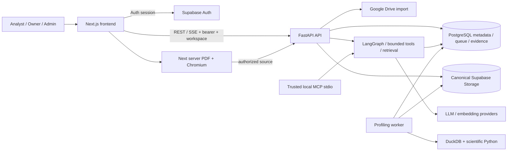

# VDaAgent — hồ sơ dự án để tổng hợp cho team và dùng cho Deep Research

## 1. Cách đọc và phạm vi bằng chứng

VDaAgent giải quyết luồng của Analyst/Data Engineer: nhận dữ liệu dạng bảng → tạo artifact và Profile Run có provenance → tính metrics có giới hạn → review metadata rủi ro → khám phá biểu đồ/Official execution → hỏi đáp hoặc so sánh dựa trên evidence → biên tập và phát hành báo cáo qua review. Hai workspace role trong app là `owner` và `analyst`; System Admin là system role riêng. Đây **không** phải phân chia 5 nhóm kỹ thuật của team.

Mục tiêu team 28 người, 5 nhóm là xây một **platform dữ liệu–AI dài hạn**, thay vì một bot đơn lẻ: nhiều use case chia sẻ tenant boundary, artifact lineage, compute/tool API, review gate, trace/audit và evaluation contract. Tên “Grok Bot” trong định hướng của team được hiểu là tham chiếu về tham vọng sản phẩm; repository không chứng minh VDaAgent đã có kiến trúc, quy mô hoặc năng lực tương đương sản phẩm đó. Hiện tại đã có nhiều platform primitives, nhưng multi-agent handoff, long-term memory và policy/governance ở mọi đường execution **chưa** phải capability hoàn chỉnh.

## 2. Kết luận điều hành về trạng thái hiện tại

| Mảng | Đã xác nhận trong working tree | Không nên khẳng định |
| --- | --- | --- |
| Nền dữ liệu | Workspace, membership/capability, PostgreSQL, upload CSV/TSV/Parquet/JSON, Google Drive import, canonical artifact/version và worker profiling | MySQL/MongoDB/DuckDB là connector đang hỗ trợ; Google Drive là canonical storage |
| Compute & phân tích | DuckDB file-backed profiling, statistical test, QuerySpec bounded, chart planner, Preview và Official chạy riêng | Preview là evidence Official; mọi forecast adapter trong catalog đều có trên Azure image |
| Agent & chat | Profiling LangGraph/HITL, QA LangGraph/tool/retrieval, durable conversation, evidence validator, cache có revalidation, trace và shadow verifier | Autonomous planner/jobs, long-term workspace/personal memory, mọi qualitative claim được xác minh ngữ nghĩa |
| Báo cáo | Draft/item/snapshot nội bộ, author submit, Owner khác submitter review, Owner publish; published read dùng đúng version pointer; server PDF | Submit hoặc snapshot tự publish; profile-scoped PDF là published report |
| Delivery & đánh giá | Workflow ba container, migration trước app swap, PR quality jobs, evaluation harness và benchmark synthetic | Azure live đang healthy; push trực tiếp `main` đã chạy quality jobs; benchmark local là release approval |

## 3. Kiến trúc, process và repository



Workflow Azure **định nghĩa** ba App Service container: FastAPI `vdaagent-api` port 8000, Profiling Worker từ biến `AZURE_PROFILING_WORKER_APP` dùng cùng backend image/SHA và health port 8000, Next.js `vdaagent` port 8080. PostgreSQL không phải “cache phụ” mà giữ domain metadata, queue, evidence, chat/report, audit, retrieval và LangGraph checkpoint. Supabase Storage là canonical object store production; local adapter chỉ dành cho development/test. Google Drive là import source. DuckDB là compute engine trên file đã materialize, **không** là database connector do người dùng mở trên server. MCP là tiến trình stdio local riêng; workflow không chạy MCP như HTTP service.

| Lớp/process | Source chính | Trách nhiệm thực tế |
| --- | --- | --- |
| Frontend | `src/frontend/src/app/`, `components/`, `lib/api.ts` | App Router, auth/workspace UX, REST/SSE transport, profile/chart/chat/report và PDF server route |
| API | `src/backend/src/main.py`, `src/backend/src/api/`, `models/` | Chín router dưới `/api/v1`, dependency xác thực/capability, Pydantic, correlation, HTTP/SSE và safe error mapping |
| Domain/compute | `src/backend/src/services/` | Ingestion, repository, permissions, profiling, analysis, chart planning, forecasting, QA validation, retrieval, report lifecycle |
| Agent/runtime | `src/backend/src/agents/` | Profiling/QA graph, bounded tool registry, native skill catalog, checkpoint, trace projection |
| Worker | `src/backend/src/workers/profiling_worker.py` | Durable claim/lease/heartbeat/retry/stale recovery và resume HITL |
| Persistence | `src/backend/src/services/repository.py`, `src/backend/migrations/` | SQLAlchemy domain tables, workspace predicates và Alembic production schema |
| Integrations | `storage.py`, `google_drive.py`, `auth.py`, `retrieval.py`, `langsmith_observability.py` | Supabase Auth/Storage, Drive, LLM/embedding và tracing đã sanitize |

Repository đặt backend ở `src/backend`, frontend ở `src/frontend`, test backend/integration/agent ở `tests/`, benchmark/evaluation ở `tests/benchmark` và `tests/evaluations`, artifact lịch sử ở `evaluations/`, công cụ vận hành ở `scripts/`. `config.yaml`, `.env.example`, `alembic.ini`, `Dockerfile.backend.azure`, `Dockerfile.frontend.azure` và `.github/workflows/azure-container-deploy.yml` là manifest quan trọng. Không có Docker Compose manifest. `scripts/check_repository_layout.py` bảo vệ path contract; `scripts/setup.sh` còn chứa path/nhãn cũ, không nên dùng làm hướng dẫn khởi động chuẩn.

## 4. Luồng sản phẩm và data lineage

### 4.1 Workspace, identity và phiên người dùng

Production buộc `AUTH_MODE=supabase` cho **Supabase user path**; backend kiểm token, app profile, membership active, workspace status và capability trước khi xử lý domain. Browser dùng publishable key cho Supabase Auth; domain table không được truy cập trực tiếp qua browser Data API. Backend local JWT/JWKS fast path chấp nhận ES256/RS256, có cache/refresh key; token không xác minh được cục bộ có thể đi qua Supabase Auth API fallback, và remote từ chối thì request fail closed. Vì vậy “mọi token được chấp nhận đều ES256/RS256” là claim quá rộng. `AUTH_MODE=dual` là local/test compatibility path. Guest trial là flag riêng: code có thể cho guest trong production **nếu** `AUTH_ALLOW_GUEST=true` và guest canonical storage là Supabase với server credential; không mặc định bật và guest không phải workspace Owner. Guest bearer `guest.<UUID>.analyst` được browser tự tạo, backend chỉ kiểm format/UUID rồi derive guest user ID và áp guest limits; đó **không** phải Supabase-signed identity hay attestation cryptographic, cần threat-model riêng nếu mở public trial.

`X-Workspace-Id` là lựa chọn ngữ cảnh, không chứng minh quyền. HTTP backend resolve active membership và scope lookup của resource cha theo `workspace_id`; nhiều repository operation cũng lặp predicate này, nhưng một số child operation dùng `run_id` sau khi cha đã được scope, **không** phải mọi query đều tự mang tenant predicate. Scoped not-found thường trả 404 để không lộ tenant khác; đây là defense-in-depth nuance, không phải bằng chứng đã khai thác được HTTP IDOR. Owner quản membership/cấu hình, audit/lifecycle và review/publish report; Analyst làm dữ liệu/phân tích và submit draft. System Admin không tự là Owner của mọi workspace. Default admin email allowlist trong config là deployment-sensitive: production `_sync_user_profile` dùng như seed lúc tạo profile mới, giữ role hiện có; local/test compatibility bootstrap lại có thể set lại role `admin` cho profile email khớp khi repository khởi tạo. Không suy role từ frontend hoặc coi allowlist là cơ chế nhất quán ở mọi môi trường.

### 4.2 Upload/import → artifact → Profile Run

Pilot nhận CSV, TSV, Parquet, JSON upload hoặc Google Drive OAuth + chọn file + import một lần vào canonical storage. Upload qua backend có thể stream/compute SHA-256; direct signed-upload session được finalize sau khi server kiểm object tồn tại và đối chiếu size với reservation, đồng thời ghi nhận content type/etag từ object stat. `content_sha256=None` trên đường này, **không** phải kiểm tra hash nội dung cryptographic ở finalize; content type/etag cũng không được đối chiếu với giá trị dự kiến như size. Ingestion tạo logical `datasets`, `dataset_ingestions` và `dataset_artifacts`; một dataset có thể có nhiều artifact/run. Profile Run của **ready canonical artifact** bind `artifact_id` lúc enqueue nên retry/resume không tự đổi sang artifact mới; legacy Drive chưa có artifact được canonicalize/bind trước khi worker profiling, còn một số local compatibility path có thể không có artifact binding. Stable source reference (`supabase://...`, local test, Drive legacy) giữ provenance; temporary materialization path không được persist.

MySQL, MongoDB và DuckDB database connector bị chặn fail-closed trước DNS/socket/decrypt/open file, kể cả legacy `datasource://` trong worker. Legacy routes ẩn khỏi OpenAPI nhưng trả lỗi `database_connectors_disabled` có audit; connection cũ list dạng metadata redacted/disabled để Owner xóa. Dataset đã ingest thành canonical artifact không bị tự xóa vì connector nghỉ hưu. `DATABASE_CONNECTORS_ENABLED=true` bị Settings từ chối startup; muốn tái mở cần security design mới, không phải bật flag.

### 4.3 Profiling, metadata và HITL

`POST /api/v1/profile`, `POST /api/v1/datasets/{id}/profile` và batch `POST /api/v1/datasets/profile` validate/idempotency rồi trả HTTP 202. Worker claim job PostgreSQL theo lease, heartbeat, retry tối đa ba attempt và stale recovery; mặc định concurrency 1, poll 1 giây, lease 300 giây, shutdown grace 30 giây. Delivery là **at-least-once**. LangGraph workflow đi `ingest → compute_stats → propose_metadata → hitl_review → optional deep_analysis → summarize/finalize` và có PostgreSQL checkpoint/resume. Job `succeeded` có thể vẫn tương ứng profile `pending_review`; UI cần đọc domain status/`next_action`, không chỉ job status.

DuckDB đọc source file-backed, bounded projection/sample, tính schema, missingness, cardinality, uniqueness, duplicate, distribution, correlation, outlier và candidate-key signals; statistical test chỉ load các cột cần thiết sang scientific Python. Semantic type có rule và LLM tinh chỉnh khi chưa chắc; PII có heuristic tên cột/regex trên sample. Proposal PII/candidate key chờ review; default chỉ auto-confirm semantic type low-risk confidence ≥ 0,95, nhưng `HITL_LOW_RISK_TYPES` chưa là typed allow-list chống misconfiguration. PII `pending`, `confirmed`, `edited`, `auto_confirmed` bị loại khỏi analysis/model context; chỉ `rejected` được coi là không PII theo policy hiện tại.

### 4.4 Analysis Session, Chart Builder, Preview và Official

Backend giữ `analysis_sessions`, version semantic context, deterministic quality gate và bounded `QuerySpec`. Chart planner có fast path deterministic và structured model path; cả hai phải qua column/algorithm allow-list. Auto-profile pack tối đa 12 biểu đồ. Preview chạy trên sample, `is_approximate=true`, hết hạn; Official là execution **mới** trên full source trong giới hạn, giữ context/gate, canonical query, result hash, limitation và attribution. Preview không trở thành evidence chỉ vì được promote. Generic execution đòi context đã approved; route promote Preview hiện **tự approve** context draft bằng actor trước gate, nên không thể gọi đây là reviewer độc lập thống nhất. Gate `blocked` chặn; `warning` có thể vẫn execute theo code, cần Product/Core thống nhất policy acknowledgment.

`QuerySpec` cho aggregate, histogram, scatter, box, heatmap, forecast/forecast_ranking, missing/correlation/cardinality/violin/donut/outlier; giới hạn cột, dimension, filter, bins, horizon, timeout/result. Forecast catalog có 28 thuật toán **được liệt kê**, nhưng availability phụ thuộc dependency/input; Azure `requirements.azure.txt` bỏ một số adapter nặng như XGBoost, LightGBM, CatBoost, Prophet, NeuralProphet. `GET /api/v1/profile/{run_id}/charts/algorithms` phản ánh image thực tế. Không cho model/browser gửi raw SQL/Python tùy ý.

### 4.5 QA/insight, comparison và report

`POST /api/v1/qa` và `POST /api/v1/qa/stream` chạy guardrail → intent router → deterministic tool hoặc scoped retrieval/model → evidence validator → output. Tool nhận Profile Run do server bind, giới hạn input/call và không cấp raw row/PII. Hybrid sparse/dense retrieval có workspace/run scope; external knowledge chỉ khi effective config bật. Answer Envelope V2 giữ finding, citation, limitation, provenance, `evidence_status`. Validator xác minh run/workspace/source/status/artifact/citation và grounding số; nó **không** chứng minh ngữ nghĩa của từng qualitative claim. Thiếu evidence cho claim dữ liệu/nguồn thì abstain hoặc hỏi rõ; greeting, name recall và chart recommendation không đưa claim dữ liệu vẫn có thể trả lời với `no_evidence`. SSE `token` là chunk trả lời đã qua validation, không phải raw provider token. Backend có durable conversation, feedback, suggestion và semantic cache; cache hit phải chạy lại aggregate/binding/validator. Frontend chat còn compatibility history: guest thread lưu `sessionStorage`, legacy browser thread có thể ở `localStorage` và chỉ được promote khi gửi turn mới, nên không khẳng định mọi lịch sử cũ đã chuyển lên server.

Drift `POST /api/v1/profile/{current_run_id}/drift` so hai completed Profile Run trong cùng workspace bằng metrics đã lưu, không đọc lại raw source. Backend **không** buộc cùng `dataset_id`, nên cross-dataset result không chứng minh hai nguồn comparable. Nhóm Insight/Comparison và Data & AI Evaluation cần giữ provenance/điều kiện so sánh trong nhận định.

Report có profile-scoped sections và mutable draft items. Command Center pin hỗ trợ chart Official và agent answer với source/evidence binding, cùng manual `note` là nội dung biên tập **không** tự là quantitative evidence; profile sections được tạo qua path riêng. Capture `snapshot` SHA-256 là bản nội bộ terminal, không tự publish. Author (Analyst hoặc Owner) submit version → `in_review`; Owner **khác submitter** review để `approved` (hoặc `changes_requested`/`rejected`); Owner publish riêng → `published`, sau đó có thể archive. Workspace chỉ có một Owner vẫn có thể hoàn tất khi Analyst submit; Owner tự submit sẽ cần Owner thứ hai để review. Published list/detail/export hydrate `current_published_version_id` trỏ đúng version `published` cùng report; dashboard chỉ lọc/count report có pointer hợp lệ, không hydrate version. Draft mới không thay bản phát hành cũ. Đây là application/query invariant và migration preflight, **không** phải DB constraint mới tuyệt đối. Next server PDF có `reportId` lấy published export source; không có `reportId` là profile-scoped PDF, không chứng minh report đã publish.

Lineage tối thiểu cho quyết định có thể kiểm chứng:

```text
workspace + actor/capability
  → dataset + ingestion
  → canonical artifact/version (hash nếu đường ingest tính được)
  → Profile Run + canonical artifact binding (nếu source đã/được canonicalize) + scan/sample/approximation
  → reviewed proposal / Official query execution + context/gate/result hash
  → QA evidence/citation hoặc drift baseline-current
  → report version + snapshot/published pointer + audit
```

## 5. API, agent state và security boundaries

Các nhóm API dùng prefix `/api/v1`, trừ `/health`. Request nghiệp vụ có bearer và, nếu cần, `X-Workspace-Id`; retry-safe mutation giữ `Idempotency-Key` cho cùng một logical request.

| API group | Contract tiêu biểu | Source |
| --- | --- | --- |
| `/session`, `/workspace-bootstrap`, `/workspaces/*` | Identity, tenant selection, member/config | `api/authz_routes.py` |
| `/datasets/*`, `/google-drive/*`, `/connectors/*` | Upload/import, artifact, connector legacy redacted | `api/routes.py`, `google_drive_routes.py`, `connector_routes.py` |
| `/profile`, `/datasets/{id}/profile`, `/profiling-jobs/{id}` | HTTP 202/idempotency, worker status/SSE, HITL resume | `api/routes.py` và worker |
| `/analysis-sessions/*`, `/profile/{run_id}/explorer/*`, `/profile/{run_id}/charts/*` | Context/gate, Preview/Official, chart/forecast | `api/analysis_routes.py` |
| `/qa`, `/qa/stream`, `/conversations/*`, `/agent-runs/*` | QA, durable chat, evidence/trace read | `api/routes.py`, `agent_routes.py` |
| `/profile/{run_id}/drift`, `/profile/{run_id}/test` | Comparison/statistical result | `api/routes.py` |
| `/profile/{run_id}/report-draft`, `/reports/*` | Author draft/submit, Owner review/publish, published reads | `api/authz_routes.py` |
| `/agent-skills/*`, `/admin/users/*` | Skill catalog và system administration | `api/skill_routes.py`, `admin_routes.py` |

Profiling progress dùng SSE event state, polling fallback trên **cùng job**; chat stream tách progress khỏi terminal answer. Lỗi điển hình: 401 identity, 403 capability/policy, scoped 404 để không lộ tenant khác, 409 state/version/idempotency, 422 schema/QuerySpec, 503 database/provider tạm lỗi. `X-Correlation-Id` hỗ trợ điều tra; response không trả stack, secret hoặc raw row.

Hiện code có **hai workflow Agent chính**, không phải năm process Agent của năm nhóm: profiling graph đề xuất metadata/HITL và QA graph trả lời bằng tool/retrieval/evidence validation. Chart planning ở `services/chart_planner.py`, comparison ở `services/drift.py`, report composition/lifecycle ở report service/repository. “Metadata Curator”, “Chart Builder” và “Insight, Comparison & Report” trong `8` là **team ownership**, không tự chứng minh ba autonomous agent services độc lập đã ship. Native skills `profile-dataset`, `diagnose-data-quality`, `compare-profile-drift`, `answer-business-question`, `generate-report` là playbook/catalog; backend policy/tool schema mới là enforcement.

Context hiện có durable conversation, bounded request history và LangGraph checkpoint. `AGENT_PLANNER_ENABLED`, durable agent jobs, long-term workspace/personal memory và verifier `enforce` bị Settings từ chối khi bật; `agent_plans` có schema/read API nhưng chưa có writer cho persisted plan hoạt động. Short-term name recall trong QA history không phải long-term memory service. High-risk verifier hiện `shadow`, không thay answer canonical.

Security gồm Supabase public browser Auth, backend membership/capability và workspace predicate, private canonical object store, PII guard/redaction và audit. Migration `20260831_0022` **khai báo** RLS cho app tables, không tạo policy cho browser role và revoke privilege `anon`/`authenticated`; `scripts/assert_database_security.py` là kiểm tra runtime trên **database đích**, chưa có bằng chứng chạy nó trên production trong hồ sơ này. `NEXT_PUBLIC_*` đi vào browser bundle; Supabase secret/service key, DB URL, Drive/LLM secret và `DATASOURCE_ENCRYPTION_KEY` chỉ server-side.

Local MCP stdio là **trusted-local integration**, chưa nên quảng bá như API multi-tenant tương đương FastAPI: chart execution kiểm workspace/run và membership của `actor_user_id` **do caller khai báo**, nhưng stdio không xác thực actor đó bằng bearer/session. Read-only MCP tools `_call` chỉ nhận caller-supplied `profile_run_id`; common tool helper gọi `get_profile_run(run_id)` không có workspace predicate. Output metadata được clean/mask không thay thế tenant authorization. Cần đóng identity/read-scope này trước khi mở MCP cho nhiều user/tenant. Docstring `mcp_server.py` còn quảng bá “cloud warehouse/vector DB/30+ forecasting models” không khớp implementation PostgreSQL hybrid retrieval và catalog 28 items.

## 6. Configuration, deployment, observability và recovery

Settings hiệu lực theo environment/`.env` ở repo root → `config.yaml` → Python default. `.env.example` chứa placeholder và không liệt kê hết production secret/frontend variables, không chạy nguyên trạng. `DATABASE_URL` PostgreSQL bắt buộc; SQLite không là runtime được hỗ trợ. Production buộc `APP_ENV=production`, `AUTH_MODE=supabase`, email confirmed, `CANONICAL_STORAGE_PROVIDER=supabase`, Supabase URL và publishable/backend keys. Auth issuer có thể suy từ URL; audience, bucket và CORS có default nên cần **review effective settings**, không gọi mọi giá trị đó là biến bắt buộc phải set riêng. `DATASOURCE_ENCRYPTION_KEY` **vẫn** bị `Settings.missing_required()` và workflow yêu cầu sau khi purge legacy credential. Provider/retrieval default khác nhau giữa YAML/Python, nên phải kiểm effective settings. Frontend Supabase/API/site public values được đưa vào build; Next server PDF ưu tiên `INTERNAL_API_URL` và cần Chromium.

Local theo README: Python 3.11, Node 22, pnpm 11.0.8, PostgreSQL; tạo `.venv`, cài `requirements.txt`, cài frontend lockfile/Chromium, sửa `.env` cho development/dual Auth/canonical và guest storage local/DSN PostgreSQL; tạo DB `p170`, chạy Alembic rồi chạy FastAPI, Profiling Worker và `pnpm dev` trong ba terminal. Worker là bắt buộc cho async profiling. Không có Compose startup; Dockerfile Azure phục vụ release. Không in `.env` thật trong team report.

Workflow `azure-container-deploy.yml`: PR quality jobs chạy Ruff, migration smoke, pytest, evaluation `--dry-run`/`--offline`; frontend chạy Vitest, typecheck, lint, build, Playwright. Manual dispatch chạy các job này **mặc định**, nhưng input `skip_quality=true` có thể bỏ qua cả hai. **Push trực tiếp `main` cũng bỏ qua hai quality jobs** rồi deploy nếu path filter cho là deploy-relevant; cần branch protection/PR gate trước release. Build/push image theo SHA, chạy Alembic bằng backend image cùng SHA **trước app swap**, deploy API/worker/frontend rồi gọi process health. `/health` không tự chứng minh database, storage, auth, queue consumer, Data API policy hay QA nghiệp vụ. Workflow không theo dõi docs hoặc `scripts/retire_database_connectors.py`; credential retirement CLI là release step riêng.

Production schema do Alembic sở hữu; local/test `create_all`/compatibility bootstrap không phải deploy strategy. Working tree có chuỗi `20260812_0000 → ... → 20260901_0026 → 20260915_0027 → 0028 → 0029`. `0027` preflight Owner/active workspace; `0028` cho legacy encrypted config nullable để CLI explicit purge; `0029` chỉ sửa published pointer khi tìm được published version và chặn row còn sai. `0028`/`0029` chưa commit; không suy live DB đã ở head này. CLI `scripts/retire_database_connectors.py` mặc định dry-run, muốn purge phải dùng `--execute --purge-credentials --yes` sau inventory/backup; schema downgrade `0028` từ chối vì purge bất khả nghịch. Release cần backup, preflight data, assertion trên target DB và image-SHA rollback tương thích.

Observability có request/correlation log dạng text/key=value (không phải JSON log schema), route-template performance telemetry, query/AI latency ledger, audit events, sanitized agent trace và optional LangSmith **metadata-only** projection. Worker có lease/heartbeat/retry/stale recovery, delivery at-least-once cần idempotency/reconcile. `scripts/reconcile_storage.py` read-only; Drive→Supabase migration và benchmark utility là bước riêng, không là scheduler tự dọn. Cấu hình giữ **conversation đã soft-delete** thêm 30 ngày trước khi đủ điều kiện purge; primitive guest workspace chọn những workspace tạo quá 24 giờ, không phải TTL được scheduler thực thi tự động. Cả hai mới là **config/maintenance primitives**, chưa có production scheduler gọi purge. Incident playbook trong `docs/operations/observability-and-failure-recovery.md` tách queue/pending review/SSE/OOM/QA no-evidence/deploy unhealthy.

## 7. Test architecture và trạng thái evaluation

Backend `tests/` bao gồm API, service, agent, auth/permission/workspace, migration/storage/report lifecycle tests; quality job chạy `python scripts/migration_smoke.py` và `python -m pytest -q` trên PostgreSQL test service. `scripts/assert_database_security.py` cần database để kiểm browser roles bị từ chối và backend vẫn CRUD. Frontend `pnpm test`, `typecheck`, `lint`, `build`, `test:e2e` gồm Vitest/Testing Library và Playwright. UI ẩn nút không thay backend authorization test. `scripts/check_repository_layout.py` bắt path cũ.

Hai evaluation track **khác nhau**:

- `tests/evaluations/run_evaluation.py` là harness v2, current fixture có 17 case synthetic; `--dry-run` chỉ validate fixture, `--offline` kiểm evaluator wiring/mock. Để dùng authenticated staging làm release evidence, cần workspace/Profile Run synthetic và **nên** dùng output directory có timestamp; runner mặc định ghi đè `latest_scorecard.*`. `evaluations/results/` chỉ là thư mục output mặc định **sau khi chạy**, không có artifact đó trong checkout.
- `tests/benchmark/` là benchmark vi-VN 83 case/125 request trong `evaluations/runs/<run_id>/`, alias `evaluations/report.md`. Run alias hiện tại `run-20260905T001300-full-openai-final-r3` là synthetic **LOCAL**, trước các thay đổi working tree 2026-09-15. Deterministic hard gates trong artifact đạt, nhưng `evaluations/scores/release_gate_results.json` ghi `all_gates_pass=false`, `release_approval=NOT_APPROVED`, `DRAFT_NOT_APPROVED`; forecast calibration/planner metrics có `not_available`. Focused RAG acceptance `FAIL` vì cận dưới Wilson 95% Context Recall ≈ 0,7704 dưới gate 0,80. Không được gọi đây là production AI release evidence/SLO.

Nhóm Data & AI Evaluation nên giữ reference/ground truth độc lập với Agent/Core output, bao phủ synthetic bình thường, lỗi, PII/quasi-identifier, drift pair, abstention, chart/insight/report và cross-workspace safety. Semantic judge chỉ bổ trợ; privacy/schema/evidence/numeric hard gates cần deterministic checks và review đúng SHA/provider/model/dataset version/môi trường. CI dry-run/offline xanh không chứng minh chất lượng model live.

## 8. Tổ chức 28 người, 5 nhóm — ranh giới để team thảo luận

Team có **28 người tổng cộng**, nhưng chưa cung cấp roster, headcount từng nhóm, title cá nhân, timeline hoặc người phê duyệt; file này không tự phân bổ. “Team ownership” dưới đây là cách chia hợp lý theo định hướng bạn đưa ra, **không** phải RACI/governance đã được code enforce. Nhóm 3 được xác định từ tiêu đề “Insight, Comparison & Report” và tách khỏi Nhóm 2 theo artifact/output.

| Nhóm | Phạm vi team nêu và ranh giới được chọn | Artifact/interface nên sở hữu | Không nên nhận thay nhóm khác |
| --- | --- | --- | --- |
| **1 — Core Platform & Profiling Engine** | Workspace, upload/connector, data version, deterministic metrics engine, compute/tool/chart APIs, runtime/chat/handoff primitives, trace/audit, quyền/cổng duyệt | Tenant/auth/capability contract, canonical `artifact_id`/Profile Run, trusted aggregate/tool DTO, QuerySpec/Official gate, event/audit/trace contract và reliability | Không lấy prompt/semantic judgment làm nguồn authoritative cho metrics; không giao tenant authorization cho Agent tự quyết |
| **2 — Agent A: Metadata & Visualization** | Metadata Curator Agent và Chart Builder Agent; tiêu thụ Core metrics, đề xuất metadata/semantic type, nhận chỉnh sửa DA/DE, lập kế hoạch biểu đồ có căn cứ; tự phát triển prompt/tool integration/agent tests | Proposal + confidence/evidence/limitation, reviewed semantic context, chart plan/ChartSpec có nguồn, prompt/version và agent tests | Không xây lại Core ingestion/profiling engine; không publish insight/report; không bypass PII/HITL/Official gate |
| **3 — Agent B: Insight, Comparison & Report** | Output **sau** metadata/chart: QA/insight explanation, drift/comparison narration, report composition hỗ trợ DA/DE và provenance | Answer Envelope/citation/limitation, comparison với baseline/current source IDs, report draft/item narrative và agent tests; dùng Core Official/tool output + artifact reviewed của Nhóm 2 | Không tự tính raw metrics, tự xác nhận proposal, tự review/publish report hoặc dùng Preview như evidence |
| **4 — Data & AI Evaluation** | Synthetic profiling data, dữ liệu lỗi/nhạy cảm giả lập, cặp comparison; metrics/semantic type cùng Product; ground truth độc lập, eval insight/chart/report | Versioned dataset/reference result, oracle/rubric, hard gate/regression scorecard và independent review | Không thay Core xây engine, không nhận toàn bộ QC/production operations; không dùng chính output Agent làm ground truth |
| **5 — Product & Delivery** | PM/PO, BA, UX, UAT; nhu cầu DA/DE, phạm vi nguồn, ba quyết định HITL; trải nghiệm upload→profiling→chat→report; tiêu chí nghiệp vụ và tổng hợp đánh giá team | User journey, approval policy/role, acceptance criteria, UAT scenario, release decision và cross-group priority | Không gọi thiết kế tương lai là đã ship; không chỉ dựa vào UI guard/benchmark local để duyệt privacy/release |

Ranh giới giữa hai nhóm Agent theo **artifact họ tạo và thời điểm evidence đủ điều kiện**: Nhóm 2 tạo proposal/plan trước review hoặc trước Official; Nhóm 3 tạo diễn giải/so sánh/report sau khi có reviewed metadata, completed Profile Run và/hoặc Official execution. Core sở hữu tenant/compute/publication/audit policy; Agent teams sở hữu orchestration/prompt/output nhưng không bypass gate. Nhóm 4 kiểm chứng độc lập Core và cả hai Agent teams; Nhóm 5 quyết định ý nghĩa nghiệp vụ, UX/UAT và tiêu chí chấp nhận. “Handoff” nên truyền artifact ID, state, actor, limitation và evidence binding, không chỉ một đoạn văn LLM không có nguồn.

Ba điểm HITL để Product cùng Core/Agent teams chuẩn hóa là **mapping đề xuất từ code**, không phải ba điểm đã được team phê duyệt chính thức:

1. **Metadata/profiling:** Analyst/DA/DE confirm/reject/edit semantic type và PII; candidate key chỉ confirm/reject, không cho edit. Interrupt/resume đã có, nhưng low-risk typed allow-list còn gap.
2. **Official insight/chart:** context review/approval, warning acknowledgment và quality gate trước khi dùng result như evidence; generic path có approval, Preview promotion lại auto-approve, nên policy chưa thống nhất.
3. **Report publication:** author submit, Owner khác submitter review/approve và Owner publish; code đã tách, nhưng ownership nội dung/UAT và workflow khi workspace chỉ có một Owner cần Product diễn đạt rõ.

Interface liên nhóm cần version hóa `workspace_id`, `dataset_id`/`artifact_id`, `profile_run_id`, proposal status, `context_version_id`, `query_execution_id`/result hash/`is_approximate`, evidence/citation và `report_version_id`. Đổi schema/tool/permission phải đi cùng backend/frontend contract tests, synthetic oracle và docs.

## 9. Các điểm cần quyết định hoặc kiểm chứng thêm

| Vấn đề đã thấy trong source/artifact | Hệ quả cho platform/team | Đầu mối thảo luận đề xuất, chưa phải việc đã hoàn thành |
| --- | --- | --- |
| MCP read tools dùng `profile_run_id` không có tenant predicate; chart execution kiểm membership của actor ID do caller khai báo nhưng không xác thực danh tính | Local stdio chưa an toàn như multi-tenant HTTP | Nhóm 1 định nghĩa authenticated caller/scope và cross-workspace regression trước khi mở rộng |
| Preview promotion auto-approve context; generic path đòi approved; `warning` gate có thể execute | Governance insight/chart không đồng nhất | Nhóm 1/2/5 chốt reviewer/acknowledgment policy và test hai đường |
| Drift không bắt cùng dataset | Cross-dataset result dễ bị diễn giải sai | Nhóm 1/3/4/5 chọn invariant hoặc explicit comparison mode + provenance |
| `HITL_LOW_RISK_TYPES` chưa typed allow-list | Misconfiguration có thể nới auto-confirm metadata rủi ro | Nhóm 1/2/4 thêm startup guard và negative PII/key tests |
| Signed-upload finalize có `content_sha256=None` | Một số artifact không có hash nội dung ở finalize | Nhóm 1/4 phân biệt assurance theo ingestion path, review hash/verify strategy |
| `DATASOURCE_ENCRYPTION_KEY` còn bắt buộc sau purge; CLI retire không vào workflow path filter | Vận hành key/rollout dễ lệch với “connector đã nghỉ hưu” | Nhóm 1/5 inventory/backup/release plan; chỉ gỡ key bằng change riêng |
| Push `main` skip quality jobs; `/health` chỉ process status | Deploy green không chứng minh DB/security/AI ready | Nhóm 1/4/5 chốt PR protection, synthetic post-deploy, release evidence |
| Retention có purge primitive nhưng không có scheduler; verifier `shadow` | Chưa có deletion-time/verifier-enforced guarantee | Nhóm 1/5 định nghĩa scheduler/alert/dry-run/recovery, không viết SLA trước khi đo |
| Forecast catalog 28 nhưng Azure thiếu optional packages; planner/forecast eval `not_available` | Coverage thực tế thấp hơn catalog/expectation | Nhóm 1/2/4 đo availability trên image/SHA, chốt supported set |
| Local JWT fast path asymmetric-only nhưng Auth API fallback có thể nhận signing config khác; production guest là flag riêng | Security policy dễ sai nếu gom mọi auth path | Nhóm 1/5 review token/guest threat model và effective settings |
| Report pointer kiểm ở query/preflight, migration `0029` chưa commit/deploy; UI reports copy còn gợi ý “publish ngay” | Code, DB rollout và UX chưa nhất quán | Nhóm 1/3/5 chạy preflight, sửa copy, UAT lifecycle |
| Agent planner/jobs/long-term memory startup guard tắt, `agent_plans` chưa có writer | “Platform multi-agent tự trị” mới là định hướng | Nhóm 1/2/3 định nghĩa orchestration/handoff contract trước khi bật |
| Benchmark hiện synthetic LOCAL, Focused RAG gate fail, chưa có authenticated staging release evidence | Không đủ căn cứ tuyên bố AI release-ready | Nhóm 4/5 chọn gate, rerun đúng SHA, review regression/privacy/latency |

Migration `0027`/`0029` có thể dừng release trên dữ liệu legacy không hợp lệ; backup/preflight và hướng phục hồi cần review trước app swap. Non-stream QA failure path có thể để durable assistant turn ở trạng thái `running`, trong khi SSE có cleanup failed/cancelled; đây là source-side reliability item cần test/fix trong scope riêng. File này không sửa application code.
