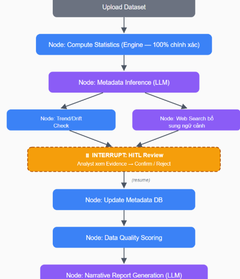
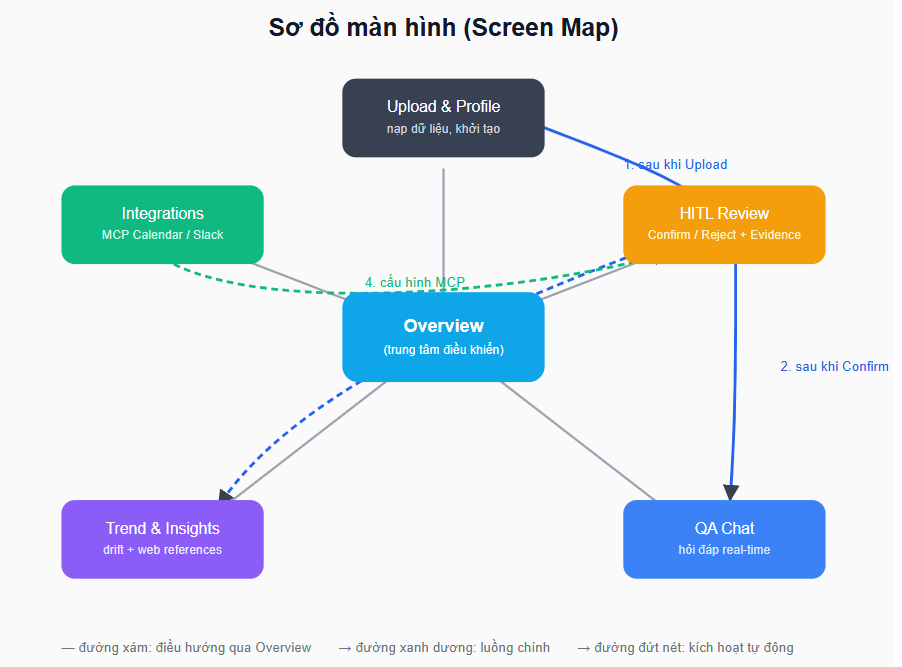
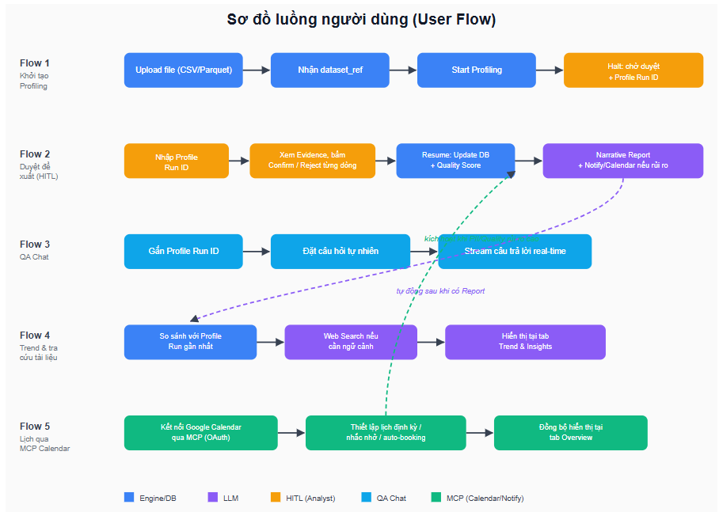
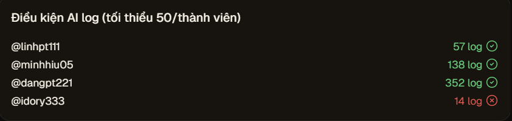

# 1. Product Brief 
Sản phẩm là một AI Agent chuyên biệt cho nhiệm vụ tự động hoá quy trình Data Profiling — bước đầu tiên và tốn nhiều công sức nhất khi tiếp cận một bộ dữ liệu mới. Agent kết hợp hai năng lực bổ trợ lẫn nhau:
- **Compute Engine** — đảm nhiệm toàn bộ phần tính toán, cho ra các chỉ số thống kê (min, max, mean, null count...) chính xác tuyệt đối.
- **LLM** — đảm nhiệm phần suy luận, phân tích ngữ nghĩa, biến các con số thống kê khô khan thành insight có ý nghĩa nghiệp vụ.

Điểm khác biệt cốt lõi của sản phẩm là cơ chế **Human-in-the-Loop**: Agent làm phần việc nặng nhọc (quét dữ liệu, tính toán, sinh đề xuất), nhưng Data Analyst luôn là người nắm quyền kiểm duyệt cuối cùng trước khi bất kỳ Metadata nào được ghi nhận chính thức. Nhờ vậy, sản phẩm giữ được tốc độ của tự động hoá mà không đánh đổi độ tin cậy — yêu cầu bắt buộc khi làm việc với dữ liệu doanh nghiệp.

Đối tượng sử dụng chính: Data Analyst / Data Engineer cần rút ngắn thời gian "làm quen" với dataset mới, đồng thời vẫn giữ quyền kiểm soát chất lượng Metadata.

# 2. Product Requirements Document 

## 2.1. Vấn đề cần giải quyết
- Data Analyst tốn quá nhiều thời gian viết code/script thủ công chỉ để hiểu hình thù dữ liệu (schema, phân phối, missing values).
- Nếu giao phó hoàn toàn cho LLM phân tích dữ liệu, LLM rất dễ hallucinate — tự sinh ra con số sai lệch nhưng trình bày với vẻ chắc chắn, dễ đánh lừa người dùng thiếu kinh nghiệm.
- Ngay cả khi đã có kết quả profiling, Analyst vẫn phải tự tra cứu thêm tài liệu bên ngoài (chuẩn ngành, quy định liên quan PII...) và tự nhắc bản thân/đội nhóm theo dõi định kỳ — các bước này rời rạc, chưa được gộp vào một luồng làm việc duy nhất.

## 2.2. Mục tiêu & Tiêu chí thành công 
- **Rút ngắn thời gian làm quen với 1 dataset mới:** từ hàng giờ viết script xuống còn vài phút, tính từ lúc Upload đến khi có Narrative Report đầu tiên.
- **Confirm Rate:** tỷ lệ đề xuất của LLM (Candidate Key, Semantic Type, PII) được Analyst Confirm — theo dõi theo thời gian để đánh giá độ tin cậy của Metadata Inference.
- **Zero-hallucination:** 100% chỉ số thống kê hiển thị khớp tuyệt đối với kết quả tính bằng thư viện chuẩn (vd pandas.describe()).
- **Risk Prevention:** Số lượng rủi ro (PII, schema drift) được phát hiện trước khi dữ liệu được đưa vào pipeline huấn luyện model.

## 2.3. Đối tượng người dùng 

| Persona | Vai trò | Nhu cầu chính |
|---|---|---|
| **Data Analyst** (chính) | Người dùng hàng ngày, thực hiện HITL Review | Hiểu nhanh dataset mới, tin tưởng đề xuất AI, tiết kiệm thời gian viết script |
| **Data Engineer** | Thiết lập nguồn dữ liệu, tích hợp hệ thống | Kết nối nhiều nguồn dữ liệu, pipeline ổn định |
| **Data Owner / Stakeholder** | Nhận báo cáo, ra quyết định nghiệp vụ | Nắm chất lượng dữ liệu qua Narrative Report, được cảnh báo kịp thời khi có rủi ro |

## 2.4 Phạm vi tính năng 

### Phase 1 — Core Features (MVP)
- **Engine-based Profiling:** Tính toán các chỉ số thống kê (min, max, mean, null count...) 100% bằng Compute Engine, đảm bảo độ chính xác tuyệt đối.
- **Metadata Inference:** LLM phân tích kết quả thống kê để suy luận và đề xuất:
  - Candidate Key — cột nào có khả năng làm khoá chính (Primary Key).
  - Semantic Type — ý nghĩa thực sự của cột (vd: dt là datetime, amt là currency).
  - PII Detection — phát hiện thông tin nhạy cảm (Email, Phone, SSN).
- **Human-in-the-loop Workflow:** Dùng LangGraph để interrupt quy trình tự động; trạng thái dừng chờ Analyst xác nhận (Confirm/Reject) từng đề xuất.
- **Narrative Reporting:** LLM dựa trên dữ liệu thống kê và quyết định của Analyst để tóm tắt chất lượng dữ liệu thành văn bản.
- **Interactive QA Chat:** Giao diện hỏi đáp thời gian thực, cho phép người dùng chat trực tiếp với bộ dữ liệu đã được review.

### Phase 2 — Mở rộng theo yêu cầu
- **Trend & Drift Analysis + Web Research:**
  - So sánh Profile Run hiện tại với các lần chạy trước trên cùng dataset để phát hiện schema drift, lệch phân phối, hoặc biến động khối lượng dữ liệu bất thường.
  - Khi gặp cột có ngữ nghĩa chưa rõ ràng hoặc liên quan chuẩn/quy định ngành, Agent tự động web search tài liệu liên quan và đính kèm làm "External References" trong Narrative Report.
  - Áp dụng đúng nguyên tắc Zero-hallucination: kết quả tìm kiếm chỉ là ngữ cảnh tham khảo có trích dẫn nguồn, không được dùng để tự suy ra số liệu thay Engine.
- **Schedule & Automation qua MCP (Google Calendar):**
  - Agent kết nối Google Calendar thông qua MCP (Model Context Protocol).
  - Ba use case chính:
    1. Lên lịch Profiling định kỳ cho một dataset_ref (vd tự động chạy mỗi thứ Hai).
    2. Tự động tạo nhắc nhở khi có Profile Run ở trạng thái "chờ duyệt" quá lâu chưa xử lý.
    3. Tự động đề xuất đặt lịch họp với Data Owner khi phát hiện rủi ro PII nghiêm trọng hoặc Data Quality Score dưới ngưỡng.
  - Yêu cầu xác thực OAuth rõ ràng; Analyst toàn quyền cấp/thu hồi quyền truy cập.

### Phase 3 — Đề xuất bổ sung cho một Analyst chuyên nghiệp
- **Data Quality Scoring & Rule Engine:** Tính điểm chất lượng dữ liệu theo các chiều chuẩn (Completeness, Uniqueness, Validity, Consistency). LLM đề xuất Validation Rule (vd "cột age nên nằm trong khoảng 0–120"); sau khi Analyst duyệt, rule được lưu vào Rule Repository để tái sử dụng như một dạng regression test cho các lần chạy sau.
- **Audit Trail & Compliance Log:** Ghi lại toàn bộ lịch sử Confirm/Reject kèm người thực hiện và thời gian — phục vụ audit/compliance, đặc biệt quan trọng khi dữ liệu chứa PII.
- **Notification & Alerting:** Gửi cảnh báo qua Slack/Email (dùng chung hạ tầng MCP với Calendar) khi Profiling hoàn tất hoặc phát hiện vấn đề nghiêm trọng.
- *(Phase sau — ngoài MVP)* **Multi-source Connectors:** Ngoài upload CSV/Parquet, hỗ trợ kết nối trực tiếp Database (PostgreSQL, MySQL) hoặc Cloud Storage (S3, GCS).

## 2.5. Ràng buộc & Nguyên tắc thiết kế
- **Zero-hallucination metrics:** LLM KHÔNG được tự tính toán. LLM chỉ nhận số liệu từ Engine và diễn giải lại.
- **Data Privacy:** Raw Data không được gửi nguyên bản cho LLM; chỉ gửi Metadata/Schema, vừa bảo mật vừa tiết kiệm token.
- **Explainability:** Mọi đề xuất của LLM phải kèm "Evidence" — con số thống kê cụ thể dẫn tới đề xuất — để Analyst có cơ sở ra quyết định, không phải xác nhận mù quáng.
- **Least-privilege cho MCP:** Khi kết nối Calendar/Slack, Agent chỉ xin quyền tối thiểu cần thiết; Analyst xem và thu hồi quyền bất kỳ lúc nào.

## 2.6. Out of Scope
- Không thay thế Data Catalog / Data Governance platform đầy đủ (vd Collibra, Alation).
- Không phải công cụ BI/Visualization (không thay thế Tableau, Power BI).
- Không tự động sửa hay làm sạch dữ liệu — Agent chỉ dừng ở mức phát hiện và đề xuất.
- Không thay thế pipeline ETL/ELT hiện có của tổ chức.

## 2.7. Rủi ro & Giải pháp giảm thiểu

| Rủi ro | Giải pháp giảm thiểu |
|---|---|
| LLM diễn giải sai ngữ nghĩa dù số liệu đầu vào đúng | Bắt buộc HITL, không auto-apply; luôn hiển thị Evidence kèm đề xuất |
| Web Search trả về nguồn không đáng tin cậy/lỗi thời | Ưu tiên nguồn chính thống, luôn gắn trích dẫn để Analyst tự đánh giá |
| MCP (Calendar, Slack) yêu cầu quyền truy cập nhạy cảm | Least-privilege, cho phép xem & thu hồi quyền bất kỳ lúc nào |
| Chi phí token tăng do gọi LLM nhiều lượt | Cache theo dataset_ref, chỉ gửi Metadata/Schema thay vì Raw Data |
| Rò rỉ PII khi export/chia sẻ dữ liệu | PII Detection chạy sớm trong luồng, cảnh báo rõ trước mọi bước export |

# 3. Kiến trúc hệ thống
Kiến trúc tổng thể dựa trên SPA giao tiếp với REST API (FastAPI), với LangGraph đóng vai trò orchestration layer. Các node mới (Trend Check, Web Search, MCP Calendar, MCP Notification) được thêm vào graph như các bước xử lý bổ sung.

# 4. Wireframe/UI Flow

# 5. Setup AI Log

