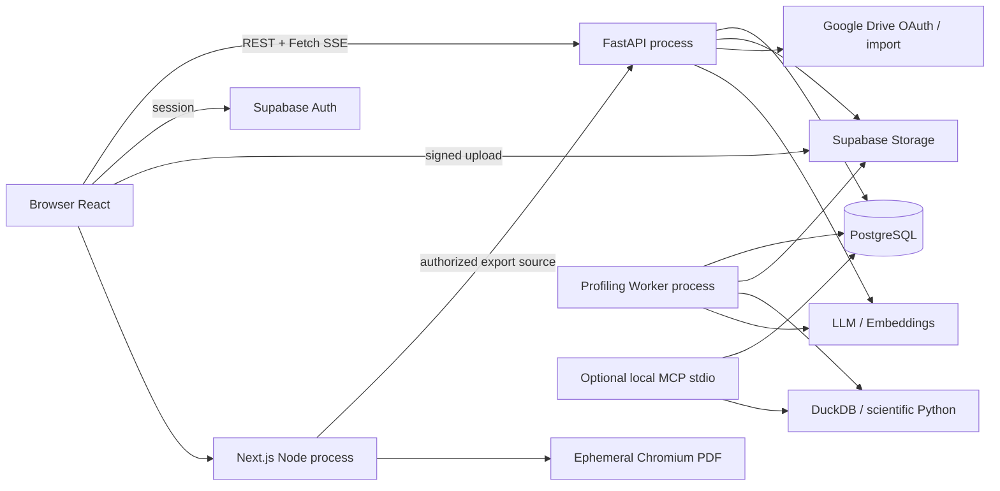
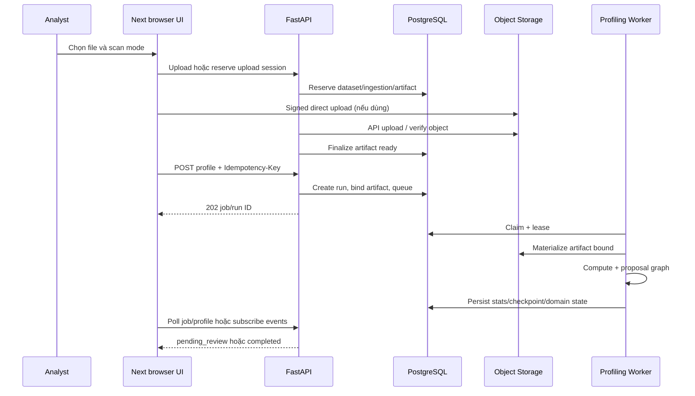
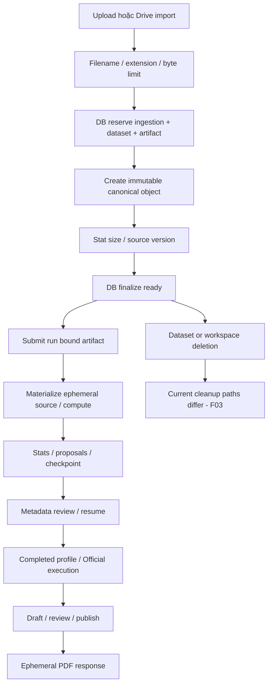
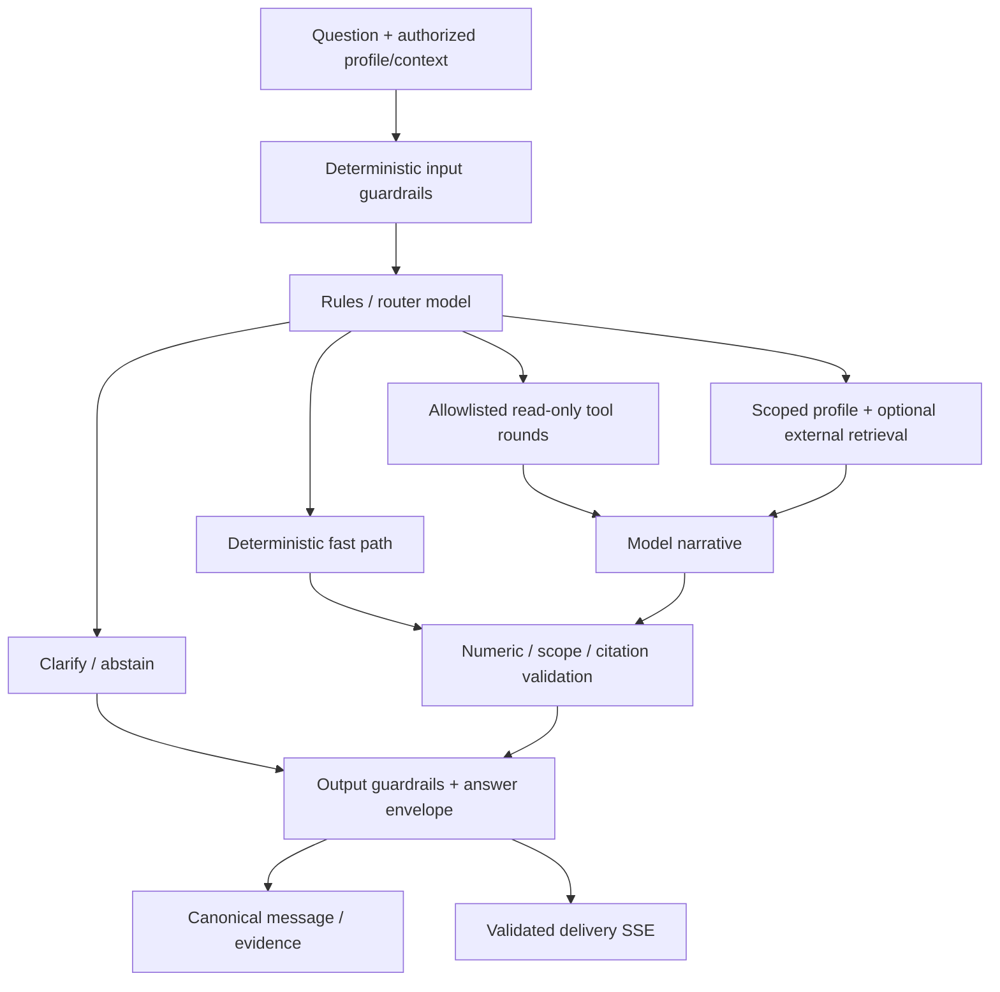
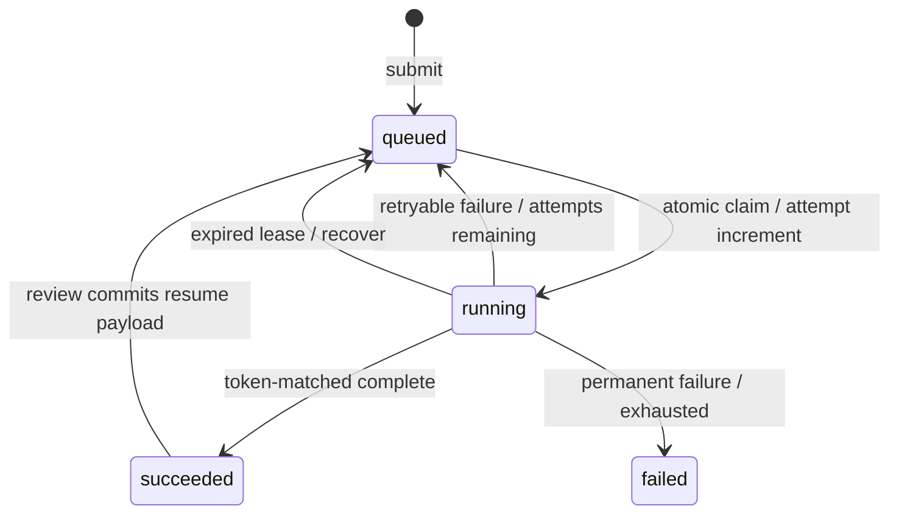
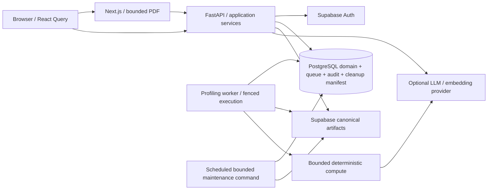

# Executive Summary

VDaAgent là sản phẩm phân tích dữ liệu dạng bảng theo workspace: **ingest artifact bất biến → profiling deterministic → review metadata → QA/chart có evidence → report được review/publish**. Stack thực tế là Next.js 15/React 19/TanStack Query, FastAPI/Pydantic, SQLAlchemy Core/PostgreSQL, DuckDB/scientific Python, LangGraph và Supabase Auth/Storage. Azure workflow triển khai frontend, API và profiling worker riêng; đây là modular monolith với worker, không phải hệ microservices.

**Current Production Readiness: LOW** cho production nhiều workspace với dữ liệu cần bảo toàn. Mức này là đánh giá rủi ro từ working tree, không phải kết luận hệ thống không có chức năng: core flows đã được implement, queue/retry/HITL/evidence/governance có nền tảng tốt. Tuy nhiên có lỗi identity/hash artifact, race corpus retrieval, thiếu fencing domain writes của worker, workspace purge có thể xóa nguồn Drive, và snapshot làm mất published visibility. Release workflow cũng cho phép push main deploy khi quality jobs bị skip.

**Ưu tiên sửa:** bảo vệ dữ liệu và tenant trước (F01–F05), giữ đúng published report/thứ tự item (F07–F08) và rollback toàn bộ review khi conflict (F20); F19 phải xử lý trước DB tests và F10 trước release tiếp theo. Sau đó củng cố deadline/readiness/resource limits (F06, F09, F11–F12). Không cần thêm Redis/message broker để giải quyết các vấn đề này.

**Target:** giữ ba process hiện có, PostgreSQL giữ state/queue/idempotency, Supabase Storage giữ artifact canonical. Bổ sung ownership-aware cleanup có manifest durable, claim-bound result writes, corpus snapshot bất biến, report policy chung và release checks có bằng chứng. Tách application services theo flow sau khi invariant được bảo vệ bằng test; không rewrite toàn bộ repository.

> **Ngày review:** 2026-09-16 (Asia/Bangkok). **Baseline Git:** `9e41209c20e660c72512d53cb3c637d75875a34d`, cộng toàn bộ thay đổi hiện có trong working tree. Đây là review implementation tại thời điểm đọc, không phải xác nhận phiên bản đang chạy trên Azure.
>
> **Phạm vi:** runtime backend/frontend, migrations, tests, configuration, Docker, CI/CD, scripts và tài liệu. Không thay đổi application code, chạy migration trên database thật, gọi LLM trả phí hoặc thực hiện thao tác production. Các hạn chế validation được ghi trong Testing và checklist cuối tài liệu.

## Cách đọc

- Engineer mới: đọc Core Product Capabilities → Core User Flows → Request Lifecycle → Developer Implementation Guide.
- Implement feature: xem capability liên quan, owner của dữ liệu, API contract và transaction trước khi sửa code.
- Chuẩn bị release: xem Implementation Issues → Production Runtime → Testing → checklist ở cuối tài liệu.
- Điều tra incident: xem Reliability, Background Jobs, Transaction Strategy và Observability.
- **CURRENT / Observed** nghĩa là có bằng chứng từ source/test; **Risk** là hậu quả suy ra với điều kiện được nêu; **RECOMMENDED / Recommendation / Target** là việc chưa được implement. **PLANNED** chỉ dùng khi có kế hoạch được chấp thuận; roadmap dưới đây là đề xuất, chưa phải cam kết delivery của đội dự án. Test hiện hữu không mặc nhiên chứng minh production đã an toàn.

Đường dẫn trong tài liệu tính từ repository root khi nằm trong inline code; các link tương đối tính từ `docs/`. Symbol được ghi cùng file để tìm bằng `rg -n`. Số dòng ở phần findings chỉ là mốc của working tree này.

## Mục lục

1. [Executive Summary](#executive-summary)
2. [Core Product Capabilities](#core-product-capabilities)
3. [Current Architecture](#current-architecture)
4. [Codebase Structure](#codebase-structure)
5. [Runtime Architecture](#runtime-architecture)
6. [Core User Flows](#core-user-flows)
7. [Data Architecture](#data-architecture)
8. [Backend Architecture](#backend-architecture)
9. [Frontend Architecture](#frontend-architecture)
10. [Processing Architecture](#processing-architecture)
11. [Agent / AI Architecture](#agent--ai-architecture)
12. [Storage Architecture](#storage-architecture)
13. [Database Architecture](#database-architecture)
14. [Background Jobs](#background-jobs)
15. [API Design](#api-design)
16. [State Management](#state-management)
17. [Authentication & Authorization](#authentication--authorization)
18. [Error Handling](#error-handling)
19. [Reliability](#reliability)
20. [Security](#security)
21. [Performance](#performance)
22. [Observability](#observability)
23. [Testing](#testing)
24. [Configuration](#configuration)
25. [Local Development](#local-development)
26. [Production Runtime](#production-runtime)
27. [Implementation Issues](#implementation-issues)
28. [Technical Debt](#technical-debt)
29. [KEEP / REFACTOR / MERGE / REMOVE](#keep--refactor--merge--remove)
30. [Recommended Production Architecture](#recommended-production-architecture)
31. [Developer Implementation Guide](#developer-implementation-guide)
32. [Production Coding Conventions](#production-coding-conventions)
33. [Anti-patterns](#anti-patterns)
34. [Migration Strategy](#migration-strategy)
35. [Prioritized Roadmap](#prioritized-roadmap)

Tra cứu nhanh: [Request Lifecycle](#request-lifecycle) · [Data Lifecycle](#data-lifecycle) · [Transaction Strategy](#transaction-strategy) · [Documentation Discrepancies](#documentation-discrepancies) · [Production Readiness Checklist](#production-readiness-checklist).

# Core Product Capabilities

## Bài toán sản phẩm

VDaAgent giúp Analyst biến dataset dạng bảng thành profile chất lượng dữ liệu, metadata đã review, câu trả lời có bằng chứng, biểu đồ và báo cáo được phê duyệt. Sản phẩm tách **tính toán số liệu** khỏi **diễn giải ngôn ngữ**: DuckDB/scientific Python tạo số; LLM chọn trong các khả năng giới hạn và diễn giải; backend kiểm tra evidence và quyền; con người quyết định metadata và report governance.

Đơn vị làm việc quan trọng là `workspace → dataset → artifact → profile_run`. Dataset là identity logic; artifact xác định bytes; profile run xác định lần tính toán và phạm vi lấy mẫu. QA, chart và report phải giữ binding này để câu trả lời không trộn hai lần chạy.

## Capability map và mức ưu tiên

| Capability | Xếp hạng | Trạng thái thực tế | Điểm vào chính |
| --- | --- | --- | --- |
| Ingest CSV/TSV/Parquet/JSON và canonical storage | CORE | Upload qua API hoặc signed direct upload; metadata finalize riêng | `/datasets/new`, `/chat`; `/datasets/upload`, `/datasets/upload-sessions` |
| Profiling và HITL metadata | CORE | Durable job trong PostgreSQL, worker riêng, checkpoint và resume | `/profiles/{runId}/review`; `/profile`, `/profile/{id}/confirm` |
| QA có evidence và hội thoại durable | CORE | Graph định tuyến, tool read-only, retrieval, validator, SSE | `/chat`, chat widget; `/qa`, `/qa/stream`, `/conversations` |
| Bounded analysis / Charts | CORE | Preview, quality gate, Official execution, chart planner và rendering | `/charts`; `/profile/{id}/explorer/*`, `/charts/*` |
| Report draft, snapshot, review, publish và PDF | CORE | Mutable draft, immutable capture, Owner governance, published pointer | `/reports`, report detail; `/reports/*`, Next PDF route |
| Auth, workspace và resource authorization | SUPPORTING, production-critical | Supabase JWT + DB identity/membership/capability; Owner/Analyst | `/login`, `/workspaces`; `/session`, `/workspace-bootstrap` |
| Drift và statistical tests | SUPPORTING | So sánh aggregate/profile và kiểm định deterministic | `/compare`; `/profile/{id}/drift`, `/test` |
| Google Drive import | SUPPORTING | OAuth theo workspace; import một lần vào canonical storage | `/connectors`, upload UI; `/google-drive/*` |
| Dataset collections, dashboard, activity | SUPPORTING | Navigation, grouping, summaries và audit projection | `/datasets`, `/dashboard`, `/activity` |
| System administration | SUPPORTING | Quản lý tài khoản, tách khỏi quyền workspace | `/admin`; `/admin/users/*` |
| Agent trace, skill catalog, eval tooling | SUPPORTING | Trace shadow mặc định; catalog/inspection và synthetic eval | `/agent-runs/*`, `/agent-skills/*`, `tests/evaluations` |
| Local MCP stdio | OPTIONAL | Tool surface cho môi trường local tin cậy | `src/backend/src/mcp_server.py` |
| Forecast adapter ML lớn | OPTIONAL | Có dependency local; Azure chỉ có tập nhẹ hơn | `forecasting.py`, endpoint algorithms |
| Database connectors MySQL/MongoDB/DuckDB | LEGACY | Guard fail-closed; chỉ còn metadata/tombstone/cleanup | `connector_routes.py`, `datasource.py`, migration `0028` |
| Generic planner/jobs/long-term memory | EXPERIMENTAL, chưa phát hành | Bật cờ bị Settings từ chối; schema không chứng minh feature chạy | `config.py`, `agents/runtime/` |
| Notebook/Google Calendar | LEGACY | Có lịch sử migrations remove, không là capability hiện hành | migrations `0013`, `0020` |

## Core Capability — Dataset Ingestion

### Purpose

Đưa file bảng vào object storage và tạo metadata đủ để worker đọc lại đúng bytes. Ingestion không tự chạy toàn bộ profiling; client tiếp tục submit profile sau khi dataset sẵn sàng.

### User flow

Chọn file/tên dataset → frontend upload → backend reserve ingestion/artifact → chuyển bytes → verify → finalize metadata → UI chọn dataset và tạo profile.

### Entry point

Frontend: [datasets/new/page.tsx](../src/frontend/src/app/datasets/new/page.tsx), [chat/page.tsx](../src/frontend/src/app/chat/page.tsx), [api.ts](../src/frontend/src/lib/api.ts). Backend: `upload_dataset`, `create_upload_session`, `finalize_upload_session` trong [routes.py](../src/backend/src/api/routes.py).

### Backend implementation

`safe_filename` giới hạn extension và làm sạch tên. Multipart được đọc theo chunk xuống file tạm, áp byte limit và từ chối file rỗng. `DatasetIngestionService.reserve` hash metadata của request và reserve DB record; `ingest_path` upload object bất biến, kiểm tra object tồn tại/size rồi gọi `finalize_dataset_ingestion`. Direct upload tạo signed upload token cho object đã reserve; finalize kiểm tra lại server-side. Adapter thực tế nằm trong [ingestion.py](../src/backend/src/services/ingestion.py) và [storage.py](../src/backend/src/services/storage.py).

### Frontend implementation

API module quản lý bearer/workspace cho JSON, XHR và upload session; `tus-js-client` phục vụ resumable upload. UI progress là trạng thái vận chuyển, không phải bằng chứng dataset đã ready. Upload hoàn tất chỉ sau bước finalize và response metadata.

### Data dependencies

Active principal, capability `dataset.upload`, workspace hợp lệ, canonical storage config. Direct upload yêu cầu authenticated workspace; guest đi qua flow API với giới hạn riêng.

### Storage

`datasets`, `dataset_ingestions`, `dataset_artifacts` trong PostgreSQL; bytes trong Supabase Storage ở production. Object key chứa workspace/dataset/artifact identity. `source_metadata` giữ provenance; source filename không quyết định đường dẫn storage tùy ý.

### Async processing

Có asynchronous HTTP/network và thread offload; ingestion API chưa phải durable worker queue như profiling. Browser direct upload tách đường data khỏi API, nhưng finalize vẫn là request riêng.

### Failure modes

File rỗng/extension sai, vượt byte limit, storage timeout, upload thành công nhưng DB finalize thất bại, client mất response rồi retry, object và hash không khớp trong race. Xem F01–F03 ở Implementation Issues.

### Current limitations

Request hash chưa chứa digest nội dung; size equality không chứng minh byte equality. Chưa có atomic transaction giữa DB và storage. `guest_storage_provider` chưa được truyền nhất quán đến canonical adapter. Retention config không tự tạo scheduler cleanup.

## Core Capability — Dataset Profiling và Metadata Review

### Purpose

Tính schema/statistics/quality, tìm candidate key, semantic type, PII và lưu quyết định review trước khi dùng profile cho analysis tiếp theo.

### User flow

Chọn dataset + full/sample → submit 202 → theo dõi job/profile → review proposal pending → confirm/edit/reject hoặc yêu cầu test → enqueue resume → profile completed → mở QA/chart/report.

### Entry point

[profile_service.py](../src/backend/src/services/profile_service.py): `submit_profile`, `execute_profile_job`, `confirm_proposals`; [profiling_worker.py](../src/backend/src/workers/profiling_worker.py); [profiling_nodes.py](../src/backend/src/agents/nodes/profiling_nodes.py). UI: [profile-review-panel.tsx](../src/frontend/src/components/profile-review-panel.tsx) và route `app/profiles/[runId]/review/page.tsx`.

### Backend implementation

API yêu cầu `Idempotency-Key`, tạo run/job bound artifact. Worker claim DB row rồi chạy LangGraph `ingest → compute_stats → propose_metadata → hitl_review → summarize/finalize`. `ingest` thực hiện compute file-backed; `compute_stats` persist projection đã tính. Sample mặc định 10.000 hàng, tối đa 200 cột. Candidate key deterministic; semantic proposal dùng rule và LLM khi phù hợp; PII dựa heuristic và sample giới hạn.

### Frontend implementation

Profile review dùng React Query theo workspace/run, polling khi domain còn chạy và mutation có update trạng thái lạc quan. Cần hiển thị `pending_review` khác `completed`. Endpoint summary/SSE có tồn tại; không được suy ra mọi page đang dùng nó: `CommandCenterShell` chưa có runtime consumer, review page hiện polling full profile.

### Data dependencies

Artifact ready và được bind tại enqueue; profile metadata; proposal pending status và review decisions; LangGraph thread `profile:{run_id}`; quyền `profile.run` hoặc `profile.review`. Review hiện kiểm pending state, không có expected-version field chung cho mọi proposal mutation.

### Storage

Queue fields nằm cùng `profile_runs`, không có Redis/Celery queue. Column statistics, proposal, test result lưu DB; checkpoint PostgreSQL lưu state giới hạn, không lưu DataFrame lớn làm source of truth.

### Async processing

Worker độc lập, concurrency mặc định 1; claim token, lease 300 giây, heartbeat, retry tối đa 3 attempt, stale recovery. `job_status=succeeded` có thể dừng ở profile `pending_review`: đó là lần chạy graph đã thành công đến điểm cần người quyết định.

### Failure modes

Missing artifact, malformed source, compute OOM, DB/checkpoint lỗi, lease mất giữa lần chạy, proposal stale, resume ghi một phần. Retry không được tự chuyển sang artifact mới nhất.

### Current limitations

Không có endpoint hủy profiling và không có `cancelled` trong job state machine. Lease token chưa fence tất cả domain writes. Không có deadline toàn graph có thể dừng cứng compute. Auto-confirm config cho phép low-risk type list tự do, chưa phải schema invariant chỉ-semantic.

## Core Capability — Evidence-first QA và Chat

### Purpose

Trả lời câu hỏi trong phạm vi profile hoặc Official execution, giữ source/citation/limitation để người dùng kiểm tra lại.

### User flow

Chọn completed profile → tạo/chọn conversation → hỏi → nhận status/source và answer đã validate → xem citation, retry/regenerate hoặc feedback → lưu hội thoại.

### Entry point

`ask_question`, `ask_question_stream` trong [routes.py](../src/backend/src/api/routes.py); [qa_nodes.py](../src/backend/src/agents/nodes/qa_nodes.py); [qa_validation.py](../src/backend/src/services/qa_validation.py); frontend [chat/page.tsx](../src/frontend/src/app/chat/page.tsx), [draggable-chat-widget.tsx](../src/frontend/src/components/draggable-chat-widget.tsx).

### Backend implementation

Input guardrail → router quantitative/qualitative/clarify/guardrail → deterministic fast path hoặc tool/retrieval → answer projection → numeric/citation/evidence validator → output guardrail. LLM không được tự phát hành `verified`. Chart insight phải bind execution hợp lệ; Preview không thay thế Official evidence.

### Frontend implementation

Fetch streaming và `parseSseChunk` xử lý frame bị chia qua nhiều chunk. UI tách progress, nguồn, answer và error; AbortController phục vụ stop/navigation. Token frame là **validated delivery** sau validation, không phải token LLM thô đang suy nghĩ.

### Data dependencies

Workspace/profile authorization, conversation context, execution binding nếu chart insight, aggregate/tool evidence và optional external knowledge. Request question tối đa 2.000 ký tự; history có trần và graph dùng suffix giới hạn.

### Storage

`conversations`, `conversation_messages`, `conversation_feedback`, `agent_runs`, evidence/trace, `qa_answer_cache`, `retrieval_documents`. Browser cache là projection; message canonical ở DB. Feedback có thể tạo evaluation candidate, không tự train model.

### Async processing

QA chạy trong vòng đời request/SSE, không dùng durable profiling worker. Có parallel retrieval/prefetch giới hạn, timeout budget và cancellation projection cho message. Hủy HTTP không chứng minh mọi Python thread hoặc external call đã dừng.

### Failure modes

Không đủ bằng chứng → abstain/clarify; provider lỗi → fallback nếu có evidence; DB persist fail → error/không có durable result đầy đủ; stream disconnect → terminal conversation state cần reconcile; retrieval concurrent workspace có race.

### Current limitations

Validation grounding không chứng minh mọi diễn giải nghiệp vụ/nhân quả đúng. Retrieval giữ corpus mutable trong singleton, chỉ khóa lúc load. Chat page và widget lặp phần orchestration/state; cache key frontend chưa đồng nhất workspace ở mọi feature.

## Core Capability — Analysis, Charts và Forecast

### Purpose

Khám phá aggregate có giới hạn, lưu truy vấn tái lập, kiểm soát bước đưa kết quả vào evidence/report.

### User flow

Chọn run → explorer session/context → query hoặc câu hỏi cho chart planner → Preview → kiểm tra quality issues/context → promote Official → render chart → hỏi insight hoặc pin vào report.

### Entry point

[analysis_routes.py](../src/backend/src/api/analysis_routes.py), [analysis_engine.py](../src/backend/src/services/analysis_engine.py), [chart_planner.py](../src/backend/src/services/chart_planner.py), [quality_gate.py](../src/backend/src/services/quality_gate.py), [charts-tab.tsx](../src/frontend/src/components/command-center/charts-tab.tsx), `/charts`.

### Backend implementation

`QuerySpec` giới hạn operation, columns, aggregate, dimensions, filters và output; compiler server tạo SQL với allowlist identifier và parameter values. `AnalysisRepository` lưu session, semantic context, quality gate và execution. `_execute_bounded` chạy engine trong thread và dùng `ExecutionControl` để interrupt DuckDB khi hết thời gian.

### Frontend implementation

Chart planner trả specification, UI render bằng SVG/CSS/HTML/KPI/grid; không thực thi JavaScript từ model. Charts giữ local draft/progress và query server cho session/catalog. Pin có optimistic update rồi reconcile report draft.

### Data dependencies

Completed profile, approved semantic context/gate theo route, PII restriction, QuerySpec hợp lệ và cùng workspace. Quality gate đánh dấu profile incomplete, proposal pending, source rỗng, sample, missing row grain/timezone và quality warning.

### Storage

`analysis_sessions`, `analysis_sources`, `semantic_context_versions`, `quality_gate_runs`, `quality_issues`, `query_executions`; execution lưu query spec, result, result hash, context/gate binding và approximation.

### Async processing

Request-bound offload, không là durable queue. HTTP bound mặc định 60 giây, Preview row budget 50.000, Preview result 50, Official result 500. Forecast chỉ dùng adapter có dependency khả dụng.

### Failure modes

Unknown column/unsafe operation → reject; PII/quality gate → blocked; deadline → 408; source unavailable → 503; duplicate promote → idempotency/constraint tùy path; model plan sai → validation/fallback.

### Current limitations

**Official không luôn là full rescan.** `missing_bar`, `correlation_heatmap`, `cardinality`, `outlier` có nhánh dùng aggregate profile đã lưu và giữ `run.is_approximate`. Cần đọc provenance từng execution. Budget không phải hard RAM cap; MCP gọi engine trực tiếp không tự nhận deadline HTTP. Không tự quảng bá mọi forecast trong catalog là installed ở Azure.

## Core Capability — Reports và Export

### Purpose

Biến kết quả phân tích thành tài liệu có version/provenance, phân biệt tài liệu đang biên soạn và bản đã publish.

### User flow

Tạo profile report draft → pin Official chart/agent answer/note → sửa thứ tự/title → snapshot nếu cần capture → submit draft → Owner khác submitter review → Owner publish → thư viện report và export published version.

### Entry point

[report_service.py](../src/backend/src/services/report_service.py), [report_lifecycle.py](../src/backend/src/services/report_lifecycle.py), [report_draft_repository.py](../src/backend/src/services/report_draft_repository.py), report routes trong [authz_routes.py](../src/backend/src/api/authz_routes.py). UI `/reports`, `/reports/[reportId]`; Node export route `app/api/reports/profile/[runId]/route.ts` và [pdf-report.ts](../src/frontend/src/lib/pdf-report.ts).

### Backend implementation

Canonical version transitions: `draft → in_review → approved → published → archived`; `changes_requested → draft` khi sửa; `rejected` terminal. `snapshot` là capture draft bất biến và tạo draft kế tiếp, không được publish thẳng. Published API resolve `current_published_version_id`; migration `0029` kiểm tra invariant pointer.

### Frontend implementation

Published library đọc `/reports`; detail hydrate đúng version được công bố. PDF Node route forward bearer/workspace đến backend export source với timeout 30 giây, dựng HTML an toàn và Chromium, ghép PDF bằng `pdf-lib`. Có giới hạn hai export đồng thời **mỗi process**, trả 429 khi đầy; đây không phải global quota.

### Data dependencies

Report/draft author, Owner governance, execution/context/theme version, freshness và stale reason, result hash. Actor server-resolved phải quyết định quyền, không tin trường submitter trong client payload.

### Storage

`reports`, `report_versions`, `report_items`, `report_sections`, `report_visualizations`, `report_reviews`. Snapshot SHA-256 dựa payload canonical. File PDF được tạo theo request; không thấy durable export-job/object cache là source of truth.

### Async processing

DB transition ngắn; PDF chạy trong Next Node process với browser riêng mỗi export. Không có worker PDF riêng hoặc overall export deadline được đặt rõ cho cả render/merge/font wait.

### Failure modes

Wrong role/self-review, invalid transition, stale item/context, draft conflict, published pointer invalid, Chromium thiếu hoặc render fail. Các phát hiện về snapshot reset container status và item position được nêu riêng, không xem lifecycle đã hoàn chỉnh chỉ vì có state module.

### Current limitations

Hai đường report service và draft repository chưa dùng toàn bộ policy thống nhất. Full PDF runtime cần Chromium/fonts khác với test TypeScript. Profile report export và published-report export là hai use case có authorization khác nhau; đừng gộp chúng thành một endpoint public.

## Important Capability — Workspace, Identity và Google Drive

| Khía cạnh | Workspace/Auth | Google Drive import |
| --- | --- | --- |
| Purpose/User flow | Đăng nhập → resolve identity → chọn workspace → capability-based navigation | Owner connect OAuth → browse file → Analyst import → dataset canonical |
| Entry point | `AuthProvider`, middleware, `authz_routes.py`, `dependencies.py`, `auth.py` | `connector-detail-dialog.tsx`, `google_drive_routes.py`, `google_drive.py` |
| Backend/Frontend | Supabase session ở browser; JWT/membership enforce ở backend; system admin tách riêng | Backend lưu state và mã hóa refresh token; browser chỉ nhận URL/result |
| Data dependencies | User active, membership active, workspace status; role Owner/Analyst | OAuth config/folder, workspace permission, one-time state, remote file metadata |
| Storage | `user_profiles`, workspaces/memberships/invitations, context/theme versions | `google_drive_connections`, OAuth state, ingestion/artifact provenance |
| Async | HTTP auth/bootstrap; không có email-delivery worker trong repo | OAuth exchange/download/upload thread offload, request-bound |
| Failure modes | Expired JWT, revoked member, no workspace, invitation không được giao | Denied OAuth, expired state, remote deletion, revoked token, partial import |
| Limitations | Workspace invite tạo opaque token nhưng route bỏ token và không nối sender | Callback chưa reauthorize actor sau round-trip; legacy purge có thể xóa source Drive |

## Important Capability — Drift và Statistical Tests

Purpose là phát hiện thay đổi giữa hai profile hoặc kiểm định giả thuyết trên projection được chọn. `/compare` dùng [compare-workspace.tsx](../src/frontend/src/components/compare-workspace.tsx); API `detect_drift`/`run_statistical_tests` gọi [drift.py](../src/backend/src/services/drift.py), [stats_tests.py](../src/backend/src/services/stats_tests.py), compute và repository.

Input gồm hai run cùng workspace cho drift, hoặc test spec/columns cho kiểm định. Output là metric/test result kèm provenance, sample/approximation và limitation; persistence là `drift_reports`/`statistical_test_results`. Không sửa bytes dataset. Statistical path có thể materialize pandas projection; không đồng nghĩa toàn pipeline dùng full DataFrame.

Happy path: chọn baseline/current hoặc test → authorization → kiểm tra schema/columns → tính deterministic → persist → UI severity/evidence. Alternate: khác schema/sample cho kết quả có hạn chế. Error: run không thuộc workspace, column không phù hợp, dữ liệu không đủ, source unavailable. Cancellation là request/browser-level; chưa có durable cancel/retry job riêng. Retry thủ công có thể tạo thêm result, không giả định toàn bộ endpoint này idempotent.

# Current Architecture

## Runtime topology thực tế



Azure workflow định nghĩa ba app/container: frontend, API và profiling worker; worker dùng cùng backend image SHA nhưng startup command khác và plan riêng. Không có Redis, Kafka, Celery, scheduler service, Kubernetes hoặc Compose manifest trong deployment hiện tại. PostgreSQL vừa là metadata store vừa là durable queue/checkpoint/evidence store. DuckDB là embedded engine trong process, không là shared database server.

## Các layer có thật

| Layer | Implementation | Nhận xét |
| --- | --- | --- |
| Presentation | Next App Router, client components, custom chart renderers | Có SSR/middleware nhưng phần nghiệp vụ chủ yếu client-side |
| HTTP/application | FastAPI routers + Depends + Pydantic | Nhiều orchestration còn trong routes.py/authz_routes.py |
| Services/domain | ProfileService, ReportService, lifecycle, quality gate, ingestion, analysis engine | Có boundary tốt ở một số use case, chưa đồng đều |
| Persistence | SQLAlchemy Core tables/query, Repository và repository theo feature | Không phải ORM entities + unit-of-work thống nhất toàn app |
| Processing | DuckDB, pandas/SciPy/forecasting, worker | Compute profile durable; analysis/QA request-bound |
| Agent | LangGraph workflow, tool registry, prompts, deterministic validator | Generic autonomous planner không bật |
| Infrastructure | settings/provider adapters, PostgreSQL pools, Supabase, Docker/Azure | Nhiều singleton process-local; phải phân biệt cache với durable state |

Đây là modular monolith với một worker tách process, không phải Clean Architecture hoàn chỉnh. Không nên viết thêm interface/repository cho mọi file chỉ để tạo layer; ưu tiên tách use case có transaction và trust boundary rõ.

# Codebase Structure

```text
VDaAgent/
├── src/backend/
│   ├── src/main.py, config.py
│   ├── src/api/                 # HTTP, dependencies, capability guards
│   ├── src/models/              # Pydantic API/analysis contracts
│   ├── src/services/            # use cases, policies, SQLAlchemy Core, adapters
│   ├── src/agents/              # graphs, nodes, prompts, tools, runtime trace
│   ├── src/workers/             # durable profiling consumer
│   └── migrations/              # Alembic history/env
├── src/frontend/
│   ├── src/app/                 # Next pages + server PDF route
│   ├── src/components/          # feature UI/auth/chat/charts
│   ├── src/lib/                 # transport, types, auth, SSE, PDF
│   └── tests/                   # Playwright workflows/fixtures
├── tests/                       # Python API/domain/agent + evaluation/benchmark
├── scripts/                     # migration, security, reconciliation, test tooling
├── .github/workflows/            # Azure build/migrate/deploy
├── docs/                        # architecture/features/operations/security
└── config.yaml, requirements*.txt, Dockerfile.*.azure, Makefile, alembic.ini
```

Các bảng sau đọc cùng phần capability tương ứng. Input/output là contract logic, không thay thế schema đầy đủ.

| Module / responsibility / core role | Components và entry points | Input → output / dependencies |
| --- | --- | --- |
| Ingestion — tạo canonical dataset | `DatasetIngestionService`, ObjectStorage; upload/import/finalize | file/session+workspace+key → ready dataset/artifact; DB + storage |
| Profile workflow — compute/review/resume | `ProfileService`, worker, graph, profiling nodes | artifact+scan spec/review → profile projection; DB/checkpointer/compute/LLM |
| QA — hỏi và phát hành evidence | routes QA, qa_nodes, guardrails, qa_validation, chat_answer | question+run/history → envelope/stream; aggregate/retrieval/LLM |
| Analysis — bounded query/chart | AnalysisRepository, AnalysisEngine, QuerySpec, quality_gate, chart_planner | context+spec → preview/official result/hash; source+DuckDB |
| Report — document governance | ReportService, report_lifecycle, ReportDraftRepository | items/version/action → draft/snapshot/published; execution/context/theme |
| Auth/workspace — request scope | JWTVerifier, dependencies, permissions, Repository | bearer/header → trusted RequestContext; Auth + DB |
| Storage/Drive — object I/O | SupabaseStorage, LocalObjectStorage, GoogleDriveOAuth/Storage | stable ref/token → stream/path/metadata; HTTP SDK/filesystem |
| Repository — persistence facade | Core metadata, feature SQL methods, build_engine | scoped queries/commands → dict/rows; PostgreSQL |
| Trace/retrieval — support evidence | agents/runtime, HybridIndex, ai_latency/perf_telemetry | bounded public projection → durable ledger/search hits/logs |

| Module | State ownership / persistence | Error / concurrency behavior | Strength, weakness và recommended change |
| --- | --- | --- | --- |
| Ingestion | DB attempt/artifact; temporary local file; object bytes | Typed IngestionError; DB uniqueness, immutable object create | KEEP artifact identity; REFACTOR digest/replay và actor-key scope |
| Profile | Run/job DB; checkpoint; worker tasks chỉ ephemeral | ProfileError; lease/heartbeat/recovery nhưng domain fencing thiếu | KEEP durable queue; thêm claim-bound writes, cancellation/deadline |
| QA | Conversation/agent DB; history UI derived | Stable ChatError/abstain; parallel threads/request cancellation | KEEP validator; extract orchestration khỏi router, fix retrieval snapshot |
| Analysis | Context/gate/execution DB | Query validation, DuckDB interrupt; no durable worker | KEEP allowlist compiler; thống nhất HTTP/MCP budget wrapper |
| Report | Version/item/snapshot/pointer DB | Lifecycle errors, author/Owner check; optimistic/version/row-lock tùy operation | KEEP lifecycle; merge draft/container transition policy và fix order |
| Auth/workspace | Auth identity external; account/membership DB | Fail-closed JWT/capability; browser sequence guards | KEEP server enforcement; hoàn thiện invitation delivery, callback reauth |
| Storage/Drive | Remote canonical vs provenance; temp materialization | Typed errors, streaming size guard; không atomic DB/object | KEEP adapter; ownership-aware cleanup tombstone/retry |
| Repository | Shared DB authoritative; singleton engine process-local | Transaction scope từng method; pool hữu hạn | REFACTOR theo aggregate/use case sau khi lock/error contract rõ |
| Trace/retrieval | DB documents/trace; mutable in-memory index | Trace mode shadow/required; index lock quá hẹp | KEEP sanitized ledger; immutable workspace corpus snapshot |

# Runtime Architecture

## Production Criticality Map

Criticality biểu thị tác động mất component; severity ở Implementation Issues biểu thị mức nghiêm trọng của lỗi. Một feature SUPPORTING như authorization vẫn là P0 cho an toàn của mọi core flow.

| Component | Criticality | Nếu unavailable/sai | Recovery ưu tiên |
| --- | --- | --- | --- |
| PostgreSQL metadata và authorization | P0 | Không resolve quyền, submit job, đọc evidence/published version | Khôi phục kết nối/schema; không fallback sang memory |
| Canonical artifact storage | P0 | Không thể tái tính profile/analysis; mất bytes không sửa bằng DB restore riêng | Restore đúng object version và kiểm hash |
| Profile compute + worker + checkpoint | P0 | Dataset mới không thành usable profile; review không resume | Recover lease/checkpoint, kiểm tra fencing trước retry |
| Ingestion identity/finalize | P0 | Bind nhầm bytes hoặc công bố dataset chưa ready | Reconcile ingestion/object, giữ identity khi retry |
| Auth/resource authorization | P0 | Người hợp lệ bị chặn hoặc dữ liệu vượt tenant boundary | Fail closed; khôi phục Auth/role DB, không bypass |
| Report lifecycle/published pointer | P0 cho đầu ra đã duyệt | Trả draft thay released version hoặc report biến mất | Giữ pointer và version; repair theo evidence |
| QA evidence validator/read-only tools | P0 cho QA | Con số không có grounding có thể thành câu trả lời | Abstain; không phát hành answer chưa validate |
| LLM narrative / embeddings | P1 | Mất diễn giải/chất lượng retrieval; nhiều deterministic paths vẫn chạy | Fallback deterministic/BM25 theo từng path |
| Next.js + API ingress | P0 cho UI | Người dùng không thao tác được | Health, rollback image, kiểm config cùng version |
| Google Drive connector | P1 với import Drive, P2 với upload | Không import mới; canonical dataset đã ingest còn hoạt động | Reconnect OAuth; không đổi nguồn run cũ |
| PDF Chromium | P2 | Không export PDF; report DB vẫn còn | Restart/retry có giới hạn, kiểm font/browser |
| LangSmith, dashboard, theme, local MCP | P2/P3 | Giảm quan sát/UX hoặc thiếu optional tooling | Không làm fail core flow khi projection optional lỗi |

## Process và resource lifetime

| Runtime | In-process | External/shared | State sống qua restart |
| --- | --- | --- | --- |
| Browser | React, QueryClient, auth transport, SSE decoder | Next, FastAPI, Supabase Auth/signed upload | SDK session và scoped local projection; không authoritative |
| Next Node | App Router, middleware, PDF route, active export counter | FastAPI; Chromium child process | Không có durable business state riêng |
| FastAPI/Uvicorn | Routes/services, synchronous DB pool, QA graph, analysis DuckDB threads, index singleton | PostgreSQL/Auth/Storage/Drive/LLM | Chỉ những gì commit DB/storage |
| Profiling worker | Poll loop, bounded active tasks, heartbeat coroutine, graph executor threads | PostgreSQL queue/checkpointer, Storage, model providers | Job/checkpoint/artifact/results |
| Optional MCP stdio | Trusted local tool dispatch/analysis | Cùng DB và storage cấu hình | DB results; không được expose thành public server |

Scheduler độc lập, distributed cache, broker và durable QA/PDF worker **không thấy trong runtime triển khai**. Maintenance scripts chạy thủ công; stale profiling recovery chạy trong worker. Graph/checkpointer khởi tạo lazy, nên `/health` xanh không chứng minh graph/checkpointer đã dùng được.

## Startup/shutdown thực tế

`main.py:lifespan` khởi tạo repository và kiểm cấu hình production/JWKS; production repository constructor không tự query toàn bộ dependencies. `build_engine` tạo engine lazy; chỉ tạo engine thành công không chứng minh DB reachable. Sau `yield`, API chỉ log shutdown, chưa thấy dispose metadata engine/close checkpointer pool tập trung.

Worker nhận SIGINT/SIGTERM nếu event loop hỗ trợ, ngừng claim và chờ jobs tối đa 30 giây mặc định. Hết grace, lease chờ recovery. `asyncio.to_thread(graph.invoke)` không có hard kill; quá trình đóng executor có thể tiếp tục chờ thread. Trên Windows, `add_signal_handler` không hỗ trợ bị suppress; cần kiểm thử stop command thực tế. Đây là hạn chế vận hành, không có bằng chứng crash nào đã xảy ra trên production.

# Core User Flows

## J1 — Upload đến profile có thể sử dụng



| Nhánh | Behavior và boundary |
| --- | --- |
| Happy | Ingest finalized trước khi enqueue; worker đọc artifact được bind; UI theo domain state |
| Alternate | Direct TUS thay multipart; sample thay full; không có LLM thì deterministic metrics vẫn hữu ích |
| Error | Object đã ghi/DB fail không rollback bytes; graph fail có job/domain error riêng |
| Cancellation | Abort upload không xóa reserve đã tạo; rời trang profile không hủy job |
| Retry | Giữ key và request logic; terminal ingestion có thể cần thao tác/key mới; worker chỉ retry trong attempt budget |
| Source of truth | Artifact metadata + canonical bytes; job/domain fields trong profile_runs |
| Transaction | Reserve/finalize/enqueue là transaction DB riêng; network không atomic với DB |
| Concurrency | Same-key upload race, cross-actor key constraint mismatch, lease-expiry overlap |

## J2 — Human-in-the-loop review và resume

1. Graph tạo proposal và persist checkpoint khi cần review.
2. UI đọc proposal hiện tại; Analyst confirm/edit/reject/request test theo contract.
3. Service/repository kiểm tra run/workspace, pending state và quyết định; ghi review, chuyển domain sang resuming và enqueue resume.
4. Worker dùng cùng checkpoint thread với `Command(resume=...)`; deep analysis có trần, hoặc summarize/finalize.
5. UI polling thấy completed rồi điều hướng tới next action.

Alternate path là auto-confirm semantic đủ confidence; reject/edit có thể quay lại proposal; request-test đi deep analysis. Error stale/double review phải được xử lý như conflict theo server state; hiện early return trong transaction có thể commit một phần decisions (F20). Không dùng lựa chọn cũ trong browser làm authoritative. Cancel browser không undo review đã commit. Happy path ghi decisions và enqueue cùng DB transaction; checkpoint continuation ở worker là transaction khác. Recovery orphaned resume cần test điểm chết sau commit domain/enqueue nhưng trước worker resume/checkpoint.

## J3 — Chat có bằng chứng

User question → local optimistic message → workspace/profile/conversation validation → durable request/message binding → guard/router → tool hoặc retrieval → validated answer envelope → SSE `status/meta/source/token/done` → durable agent message → UI source card/feedback.

Alternate path: clarify, refusal, deterministic fast path hoặc provider fallback. Error trước stream là HTTP error; sau khi stream mở là `error` frame, không thể đổi HTTP status đã gửi. Client stop/disconnect khác với lỗi provider; server ghi message cancelled khi nhánh cancellation được xử lý. Retry/regenerate cần request identity/provenance mới theo intent; replay cùng request không được append hai canonical answers. Không có distributed transaction cho DB + LLM. `agent_runs`/message projection là durable record; SSE là delivery, không là message store.

## J4 — Preview đến Official và insight

Create/ensure explorer session → semantic context → run Preview → inspect result/limitations → approve/quality gate/acknowledge theo flow → promote → execute hoặc reuse stored profile aggregate đúng branch → save Official execution → optional `chart_insight` QA bound execution → pin report item.

Alternate path: deterministic chart pack không cần LLM; unavailable forecast algorithm phải báo capability. Error: invalid QuerySpec, restricted PII column, blocked quality gate hoặc timeout. Browser abort không được biến Preview thành Official. Retry promotion phải lookup existing execution theo key trước khi tạo lại. Transaction result save tách khỏi compute: nếu compute xong nhưng DB save fail thì kết quả đó chưa là evidence canonical. Race đổi context/gate phải được kiểm tra bằng version/binding; không chỉ dựa UI disable button.

## J5 — Draft đến published report/PDF

Create draft → pin/reorder/edit → optional immutable snapshot + new draft → submit → reviewer Owner khác submitter → approve → publish pointer → published list/detail/export.

Alternate: changes_requested quay draft khi sửa; rejected terminal; archive bỏ published visibility. Error: invalid transition, stale context, self-review, wrong role, published pointer inconsistent. Cancel UI không rollback DB transition; retry phải refetch status/version trước khi submit lại. Report transition là DB transaction; audit call sau đó có thể tách transaction. PDF là read/render từ source đã authorized; retry export không publish report mới. Concurrency cần khóa/version của report aggregate, idempotent pin và ổn định thứ tự item. Snapshot không được làm biến mất released version; hiện có nhánh vi phạm ở F07.

## J6 — Owner kết nối Drive và import

Connect capability → server reserve one-time state → Google OAuth → callback consume state → exchange/encrypt token → save connector → browse authorized folder → import → download tạm → canonicalize → profile.

OAuth denied/expired state kết thúc bằng failure page. Retry connect tạo state mới; state consumed không dùng lại. Source Drive là external origin; canonical copy là bytes cho compute tiếp theo. Cần recheck Owner/active workspace tại callback vì quyền có thể đổi trong thời gian browser ở Google. Import không là two-phase commit với Drive/Storage/DB. Rời trang hoặc HTTP timeout có thể để ingestion pending. Không có sync hai chiều hoặc scheduler tự refresh dataset từ Drive trong capability pilot.

## J7 — Archive/delete workspace hoặc dataset

Owner → backend capability và target membership → enumerate owned resources → xóa/archive metadata và cleanup storage theo path → UI refresh list. Archive workspace là reversible status operation; permanent purge khác hẳn archive.

Dataset delete hiện metadata-first rồi best-effort cleanup. Workspace purge lại xóa source storage bên trong DB transaction và chưa dùng toàn bộ artifact inventory. Hai path không có cùng ownership policy: đây là lỗi phải sửa trước khi coi cleanup là đáng tin cậy. Nếu storage delete fail, DB rollback không phục hồi object; nếu DB delete fail sau remote removal, metadata còn nhưng bytes mất. Không retry purge mù quáng khi chưa kiểm tra artifact ownership, audit và published evidence references.

# Data Architecture

| Dữ liệu | Owner/source of truth | Persistent storage | Derived/cache | Temporary representation |
| --- | --- | --- | --- | --- |
| Authentication identity/session | Supabase Auth | External auth store | JWT, SDK session/JWKS cache | Request AuthContext |
| App role/status/membership | Backend identity/workspace domain | user_profiles/memberships | AuthProvider Me/capabilities | RequestContext |
| Dataset bytes | Ingestion/artifact domain | Canonical Supabase object; local only dev/test | Legacy dataset.source_ref | Downloaded source + optional UTF-8 copy |
| Artifact identity/hash/version | Dataset domain | dataset_artifacts | Dataset current pointer/source_ref | Worker materialization metadata |
| Original Drive file | External owner | Google Drive | source_metadata provenance | Import download |
| Upload attempt | Ingestion domain | dataset_ingestions | UI progress | XHR/TUS in-flight state |
| Job status/lease | Profiling domain | profile_runs job_* | SSE/job DTO | Worker tasks/heartbeat timer |
| Profile metrics/proposals | Profiling domain | profile_runs/column_stats/proposals | Retrieval text, UI cache, report item | DuckDB relation/sample |
| Workflow continuation | LangGraph | PostgreSQL checkpoint tables | Graph instance | Node call state |
| Query/Official evidence | Analysis domain | query_executions/context/gate | Chart rendering, answer citation | DuckDB result before save |
| Conversation/message | Chat domain | conversation tables | browser history, visible stream | Partial frame/tokens |
| Report draft/published version | Report domain | report/version/item + published pointer | PDF/HTML, list projection | Chromium/browser pages |
| Search corpus | Retrieval domain | retrieval_documents | HybridIndex docs/vectors/BM25 | Per-query candidate scores |
| Audit/trace | Domain audit + agent ledger | audit_events/agent tables | LangSmith metadata projection/log sink | ContextVar accumulator |

## Duplicate state cần kiểm soát

`datasets.source_ref` và artifact canonical ref có thể diverge; run phải dùng bound artifact. Job succeeded và profile completed không đồng nghĩa. Checkpoint và profile domain projection cần reconciliation. `reports.status` và published pointer phải có invariant chung. Browser cached chart/answer không phải authoritative execution. HybridIndex mutable state không được đổi tenant giữa lúc scoring. `qa_answer_cache` chỉ là optimization, hit phải revalidate.

## Persistence classification

- **Safe process-local:** compiled graph, Settings, HTTP client/pool, request ContextVar, worker active-task set, PDF active counter để bảo vệ riêng replica.
- **Must be persistent:** dataset/artifact metadata, run/job, decisions, canonical message, execution, report/published pointer, audit cần truy vết.
- **Must be shared:** queue claim/lease, role/membership, artifact storage, idempotency record; quota cũng cần shared nếu semantics là quota toàn user qua nhiều replicas.
- **Must be ephemeral:** downloaded source, encoded CSV copy, DuckDB temp/result trước persist, Chromium pages, stream remainder. Không lưu temp path vào checkpoint/evidence để resume sau restart.

## Data Lifecycle



| Stage | Input → output | Persistence và transaction | Failure / retry / idempotency |
| --- | --- | --- | --- |
| Validate/spool | Request bytes → temp file | Chưa có business commit; multipart chunked | Reject invalid/oversize; `finally` cleanup; restart có thể để temp orphan |
| Reserve | Stable request → ingestion/dataset/artifact IDs | Một `engine.begin()` cho metadata reservation | Unique workspace+actor+key; same hash replay; khác hash conflict; F02 scope mismatch |
| Upload | Temp/browser/Drive → immutable object | External storage write ngoài DB transaction | 409 create race được verify bằng size; timeout có thể object đã tồn tại; F01 hash thiếu |
| Finalize | Object stat → ready artifact/dataset | DB transaction khóa ingestion; set metadata/current | Object có nhưng commit fail: attempt còn recoverable; direct upload SHA-256 hiện null |
| Enqueue | Ready artifact + scan request → queued run | Run/job fields ghi cùng record | Required key; replay không sinh job khác; request correlation persist |
| Execute | Bound source → deterministic profile | Nhiều node transaction và checkpoint transaction độc lập | Crash giữa hai store cần resume/reconcile, không rollback cả graph |
| Review/resume | Decisions/pending state → proposals và job payload | `apply_review_and_start` dùng một transaction cho success path | Conflict sau partial writes có thể commit dù trả lỗi (F20); worker resume checkpoint riêng |
| Analysis | Context/gate/QuerySpec → execution | Compute ngoài DB; save result/hash riêng | Result chưa persist không dùng làm evidence; timeout interrupt có giới hạn |
| Report | Pinned immutable evidence → version/pointer | Report aggregate transaction và audit thường riêng | Publish phải require approved và đúng reviewer; snapshot F07 |
| Cleanup | Deleted logical owner → objects/checkpoints/index removed | Hiện không có một durable cleanup manifest chung | Remote failure có orphan; DB failure sau xóa object có missing bytes; F03 |

### Retention và consistency

| Loại dữ liệu | Owner / retention hiện có | Consistency / hành vi lỗi |
| --- | --- | --- |
| Metadata/raw canonical bytes | Dataset domain; tồn tại đến delete, chưa có lifecycle policy theo tuổi | Phải restore cùng nhau; DB backup không chứa bytes Supabase Storage |
| Derived profile/evidence | Profile/analysis domain; gắn run, report có thể giữ snapshot sau xóa run | Recompute chỉ từ đúng artifact+engine/spec; không mặc nhiên reproduces cùng sample sau đổi version |
| Temp download/encoding/PDF | Operation/process; context cleanup/ephemeral container | Có thể tạo lại; kill cần sweeper hoặc reset ephemeral volume |
| QA answer cache | Workspace; TTL mặc định 900 giây, cap 200 entries | Hit phải revalidate; stale cache không thay đổi source of truth |
| Conversation | Chat domain; soft-delete retention mặc định 30 ngày | Có purge method, chưa có deployment scheduler được chứng minh |
| Guest | Guest workspace; retention config 24 giờ | Không coi setting là guarantee xóa; cần task vận hành và kết quả purge |
| Audit/agent state/retrieval | Backend; chưa thấy policy retention thống nhất | Tăng storage theo run/tool count; phải phân biệt legal/business retention với cache expiry |
| User config/context/theme | Workspace domain, versioned DB | Report lưu binding version; sửa current config có thể làm draft stale |

## Transaction Strategy

### CURRENT

Repository dùng SQLAlchemy Core `engine.begin()` làm transaction boundary: commit khi return khỏi context thành công, rollback khi exception thoát. Không có shared request-wide unit of work. `engine.connect()` cho reads; không giữ connection mở xuyên LLM/stream theo một transaction chung.

| Boundary | Atomic hiện có | Không atomic / hậu quả |
| --- | --- | --- |
| Ingestion reservation | Attempt + dataset + artifact pending | Object upload/finalize là các bước sau |
| Ingestion finalize | Artifact ready/current + dataset ready + attempt finalized | Không chứng minh byte hash nếu chỉ stat size |
| Queue claim | Lock job SKIP LOCKED + allocate version + token/lease | Graph writes và checkpoint không ở claim transaction |
| Review | Success path: update proposals + persist resume payload | Conflict return có thể commit partial writes (F20); checkpoint resume ở worker sau commit |
| Profile node result | Stats/proposals/run projection từng method | Các method riêng không rollback cùng nhau; cần replay-safe writes |
| Report transition | Lock aggregate/version + mutate state/pointer trong lifecycle repository | Audit sau commit có thể fail; client có thể nhận lỗi dù transition thành công |
| Dataset delete | Metadata deletion/detachment | Index/storage cleanup sau commit; mất metadata ownership nếu cleanup fail |
| Workspace purge | Metadata transaction | Remote deletion trước commit; rollback DB không khôi phục object |

### RECOMMENDED

1. Transaction ngắn ở application use case; repository helpers nhận connection khi nhiều writes cần cùng commit. Chỉ thêm boundary này ở flow cần atomicity, không tạo framework unit-of-work toàn dự án.
2. Artifact ingestion là state machine có reconciliation, không giả lập distributed transaction DB–Storage. Commit reservation → immutable upload → verify digest → finalize; failures được lưu và replay cùng identity.
3. Delete commit trạng thái không còn visible và **manifest các object thuộc ứng dụng** trong cùng transaction; worker cleanup xóa idempotently rồi đánh dấu done. Manifest phải sống độc lập với FK cascade của dataset bị xóa. Origin Drive không nằm trong manifest.
4. Worker result write phải kiểm claim token/generation trong cùng transaction với write. Checkpoint namespace/ownership cũng phải ngăn stale executor ghi continuation; chỉ kiểm token lúc `complete_profile_job` là chưa đủ.
5. Transition governance và audit nghiệp vụ quan trọng cùng commit hoặc dùng outbox nhỏ trong PostgreSQL. Trace optional giữ fail-open; không cho lỗi trace làm lặp business mutation.
6. Retry transaction chỉ với transient error đã phân loại (ví dụ deadlock) và chỉ sau rollback toàn boundary; không chạy lại external side effect trong retry transaction.
7. Sau write đầu tiên, conflict phải làm rollback toàn use case trước khi trả domain error. `return {"ok": False}` bên trong `engine.begin()` vẫn là normal exit và commit; validate input trước write không loại bỏ concurrent state changes.

# Backend Architecture

Backend dùng FastAPI, Pydantic v2, synchronous SQLAlchemy Core và async orchestration. `async def` không tự làm SQL/SDK sync thành non-blocking; code đã offload nhiều đường qua `asyncio.to_thread`, nhưng vẫn có route/service gọi sync repository trực tiếp. Nên kiểm tra từng hot route bằng query/phase telemetry thay vì đổi toàn bộ DB stack sang async trong một lần.

- `api/routes.py`: đa capability, 3.250 dòng; ưu tiên tách chat orchestration/stream adapter, upload use case và profile read projection.
- `api/authz_routes.py`: workspace/auth bootstrap và report mutation cùng file; `admin_routes.py` đã tách system scope.
- `services/repository.py`: khoảng 7.773 dòng gồm table metadata, compatibility migrations, workspace lifecycle, ingestion, queue, chat, reports. Đây là coupling lớn nhất về change surface.
- `analysis_repository.py`, `report_draft_repository.py`, `workspace_configuration_repository.py` là feature-oriented persistence đã có; phát triển theo convention này nhưng thống nhất transaction boundary.
- Settings/repository/storage/index/graph là singleton/cache process-local. Lifetime của chúng không được xem là lifetime dữ liệu nghiệp vụ.

## Request Lifecycle

1. CORS outer ASGI wrapper xử lý browser policy; không thay thế auth.
2. Middleware tạo/validate `X-Correlation-Id`, khởi tạo telemetry theo route template.
3. FastAPI parse body/header/query và resolve dependencies. Thứ tự validation/auth chi tiết phụ thuộc dependency graph; không giả định body validation luôn xảy ra sau authorization.
4. `get_current_user` xác minh JWT hoặc legacy/guest theo effective config.
5. `get_request_context` resolve active identity, workspace/membership và capability set; system admin route dùng context khác.
6. `require_permission` chặn capability thiếu; route/service kiểm tra resource thuộc workspace.
7. Pydantic/domain validation → service/engine/repository/provider.
8. Repository `engine.begin()` tự commit khi scope kết thúc thành công, rollback khi exception thoát; `engine.connect()` dùng cho read. Không có transaction bao hết request theo dependency chung.
9. Response mapping trả DTO/dict/Pydantic; DB model là Core table và RowMapping, không có ORM session entity serialize ngầm, nhưng nhiều response dict vẫn bám sát persistence schema.
10. Exception handler map validation/DB/internal; stream mở rồi dùng error frame. Telemetry gửi header và log.

**Điểm cần cải thiện:** routes.py chứa upload, QA orchestration, stream framing, conversation persistence và export assembly; đó là application logic trong router. ReportService đã làm mẫu tách use case, nhưng draft paths vẫn gọi repository trực tiếp. Không gọi mọi direct repository use là bypass: nhiều route đang cố ý dùng repository làm application facade; vấn đề là transaction/quyền/error policy bị phân tán.

# Frontend Architecture

## Routing và feature surface

Next.js App Router nằm trong `src/frontend/src/app`; `layout.tsx`/`providers.tsx` lắp QueryClient, UI providers và AuthProvider. Public pages như `/about`, `/guide`, `/docs` là nội dung onboarding. AppShell/navigation và `Can`/`useCan` hỗ trợ UX theo permission; backend vẫn là enforcement.

| Route/area | Trách nhiệm | Data layer |
| --- | --- | --- |
| `/login`, `/signup`, `/auth/callback`, password reset | Supabase session/onboarding | `lib/auth/client.ts`, AuthProvider |
| `/dashboard`, `/workspaces`, `/workspaces/manage` | Context lựa chọn và membership/lifecycle | session/bootstrap + API wrappers |
| `/datasets`, `/datasets/new`, `/datasets/[id]/runs` | List/group/upload/profile history | React Query + upload transport |
| `/profiles/[runId]/review`, `/preview` | Review state và projection | `profile-query-keys.ts`, `profile-state.ts`, polling |
| `/chat` + draggable widget | Conversation/message orchestration và context | API/SSE + local state/history |
| `/charts` | ChartsTab, planner/preview/promote/pin | React Query session/catalog + local chart drafts |
| `/compare` | CompareWorkspace | Dataset list + per-dataset run queries + drift mutation |
| `/reports`, `/reports/[reportId]` | Published library, draft/review actions/detail | Report APIs + PDF download |
| `/api/reports/profile/[runId]` | Server PDF rendering | Forward auth to backend, no-store fetch, Chromium |

## State classification

| Loại | Ví dụ | Owner, persist và invalidation |
| --- | --- | --- |
| UI state | Open dialog, tab, drag position, filter, upload progress | Component; reset theo navigation/context |
| Form state | Question, scan mode, proposal selections, chart draft | Local useState/refs; validate server lại |
| Server state | Datasets, run, report, members, execution | PostgreSQL authoritative; TanStack Query là cache |
| Application/auth state | Me, workspaceId, ready/loading, guest mode | AuthProvider + Supabase SDK; backend re-resolve mỗi request |
| Persistent browser projection | Selected workspace, chat cache, chart drafts | Storage scope phải user/workspace/run; không cấp quyền từ đây |
| Derived state | canPublish, next action, evidence display, chart status | Derive từ canonical fields, tránh lưu bản sao độc lập |
| Streaming state | Partial frame remainder, current controller, progress | Request-local refs/state; completed message reconcile về DB |

Query defaults hiện tại: staleTime 15 giây, query retry 1, không refetch-on-focus; mutation retry 0. Query key profile đã bao gồm workspace/run, nhưng chat có `['chat-datasets']`, charts có `['command-center', runId, ...]`. AuthProvider clear/cancel cache khi đổi context là mitigation, không thay thế key scope nhất quán. Không kết luận có cross-tenant API leak chỉ từ query key thiếu workspace.

## API transport và authentication state

`setApiAuthTransport` cài callback lấy token/workspace/refresh vào module singleton trong browser. `apiFetch` thêm headers, credentials và local fallback; `readError` hiểu cả detail string và object. AuthProvider còn có đường bootstrap fetch riêng với candidate URLs, deadline 45 giây, sequence/in-flight refs để hạn chế race. Đây là duplication có lý do khởi tạo nhưng nên chia sẻ transport primitives.

Normal JSON `request<T>` chỉ cast `response.json()` sang TypeScript, không runtime-validate toàn bộ response. `schema.d.ts` generated/OpenAPI cùng `types.ts`, `analysis-types.ts` và DTO inline tạo nhiều nguồn contract. Có `zod` dependency không có nghĩa mọi request/response đều được Zod kiểm tra.

401 hiện refresh một lần. Nếu token mới vẫn bị 401, recursive call có `retried=true` bỏ `onUnauthorized`; user có thể kẹt ở auth state cũ. Fix nên luôn xử lý terminal 401, nhưng chỉ refresh tối đa một lần.

## Streaming và cancellation

SSE parser giữ remainder, hỗ trợ CRLF/LF, nhiều `data:` line và event id. Không dùng EventSource native cho QA POST vì phải gửi body/auth header. Consumer phải xử lý network EOF thiếu terminal, malformed JSON, repeated terminal, AbortError và error frame. Answer token được stream sau evidence validation, do đó TTFT ở UI không là thời điểm provider sinh token đầu tiên.

Profile summary SSE có backend implementation và frontend helper. `CommandCenterShell` chứa logic event/reconnect nhưng tìm consumer chỉ thấy declaration của chính nó; route review hiện polling full profile mỗi 2,5 giây khi cần. Chỉ gọi đây là dormant UI wrapper; ChartsTab đang được dùng và không phải dead code.

## Optimistic update và cache invalidation

Review mutation cancel query, giữ previous projection và reconcile response; chart pin có optimism và invalidate cả key report draft cũ/mới. Hướng đi đúng là dùng mutation response làm authoritative, rollback khi fail và refetch scope hẹp. Tránh thêm key alias thứ ba. Conversation local optimistic message cần durable message ID/request ID để tránh duplicate khi reconnect/retry.

## UI code quality và performance

`api.ts` khoảng 1.305 dòng, admin page 1.263, chat widget 1.227, ChartsTab 1.124 tại snapshot này. Kích thước không tự là bug, nhưng chat/page và widget cùng điều phối upload/profile/chat là nơi dễ lệch behavior. Nên chia sẻ controller/hook theo capability sau khi test cancellation/context-switch; không tạo một global context chứa toàn bộ server state.

Compare UI có list dataset rồi query run riêng cho mỗi dataset; đây là frontend fan-out N+1 request, khác với đã chứng minh N+1 SQL. Profile polling full object và duplicate DTO/manual invalidation là optimization có bằng chứng; chưa có số đo bundle hoặc browser p95 để kết luận CPU/render bottleneck.

# Processing Architecture

## Profiling deterministic

`profiling_nodes.ingest_node` materialize source rồi dùng `compute.profile_dataset_file_backed`; node `compute_stats` persist kết quả đã tính. DuckDB scan CSV/TSV/JSON/Parquet, projection tối đa 200 cột theo cấu hình, reservoir/system sampling, null/cardinality/numeric/distribution/correlation/candidate key/PII. Còn `profile_dataset`/`load_dataset` pandas cho callers/tests khác: không được mô tả mọi profiling path là full DataFrame, cũng không được coi đã hết pandas materialization.

Sample mặc định 10.000, seed 42; `is_approximate`, query/provenance, truncated columns và limitations phải đi tới QA/chart/report. `row_count` của sample không tự là population count. Candidate key trên sample là proposal; confidence interval/cardinality heuristic không là bảo đảm uniqueness toàn bộ dataset. PII heuristic dùng tối đa 500 non-null values/cột ở file-backed path; false negative vẫn có thể xảy ra.

CSV encoding adapter sniff bounded rồi streaming convert khi cần. File-backed full scan tránh full DataFrame nhưng vẫn có high-cardinality `DISTINCT`, grouping, pairwise correlations và output JSON lớn. Input 500 MB là **byte cap**, không phải RAM/CPU cap. DuckDB connections chưa đặt `memory_limit`/`threads`/spill budget rõ trong các core constructors; concurrency nhân peak memory.

## Analysis / Preview / Official

`AnalysisEngine` nhận validated QuerySpec và server-known columns; identifier được kiểm và quote, value filters bind parameter. Không có endpoint general SQL executor của model. Semantic context quyết định dimensions/measures/keys, PII bị hạn chế, quality gate quyết định có thể promote.

Preview dùng reservoir tối đa 50.000 hàng, result 50; Official result cap 500. Nhánh đọc source của Official tạo temporary DuckDB table toàn source trước aggregate, vì vậy `LIMIT 500` không giới hạn input scan/materialization. Nhánh profile-derived kinds dùng aggregate đã lưu: `official` biểu thị governance/execution category, **không biến sample thành exact**.

HTTP `_execute_bounded` wait tối đa 60 giây theo config, shield task, gọi `ExecutionControl.cancel()` và DuckDB interrupt; đợi thêm khoảng một giây để acknowledge. Download/provider/forecast ngoài DuckDB có thể chưa dừng. Cần cancellation cooperative ở materialize/forecast và per-operation resource envelope; cân nhắc subprocess worker có hard resource cap cho full scan khi load test cho thấy cần.

## Statistical tests, drift, forecasts

`stats_tests.py` thực hiện thống kê deterministic và multiple-testing correction theo alpha/FDR; `drift.py` so sánh profile evidence; `forecasting.py` chọn adapter theo installed dependencies. Kiểm tra column compatibility, sample/full mismatch, minimum history và algorithm availability trước gọi model. Không để LLM suy ra causal claim từ correlation hoặc hứa forecast chắc chắn.

**CURRENT drift contract:** `detect_drift` kiểm hai run khác nhau, completed và cùng workspace; chưa bắt buộc cùng dataset. Cross-dataset comparison được phép trong code, nên UI/report phải nêu nguồn và comparability limits. Việc bắt buộc cùng dataset là product decision, không tự gọi current behavior là security bug.

**CURRENT context approval:** `promote_preview` tự approve context draft bằng actor rồi chạy gate/Official; generic analysis execution path yêu cầu approved trước. Target cần một policy rõ: explicit approval action hoặc documented combined promote-and-approve, cùng audit và test. Không mô tả mọi Official flow đều có bước người dùng approve riêng.

**Khi thêm processing capability:** xác định input scope/byte–row–column–time limit, projection public, approximation và persistence trước viết algorithm. Cache theo artifact/version/spec nếu phép tính đắt và lặp đã được đo; không cache chỉ theo dataset name.

# Agent / AI Architecture



## Responsibilities và control plane

| Thành phần | CURRENT | Deterministic hay model | Quy tắc phát triển |
| --- | --- | --- | --- |
| Profiling graph | Ingest → stats → proposal → interrupt HITL → analysis/summary/finalize | Routing/state deterministic; semantic proposal/narrative có LLM | Không giao quyền/retry/job state cho prompt |
| QA graph | Quantitative, qualitative, clarify, guardrail | Rules + optional router LLM | Validate route output và giữ fallback |
| Tool catalog | `agents/tools/registry.py`, typed schemas, active run ContextVar | Backend thực thi read-only tool allowlist | Run ID do caller đã authorize inject; không tin model đổi scope |
| Retrieval | BM25 + optional dense cosine + RRF; optional rerank | Deterministic rank + embedding provider | Fix immutable corpus trước tăng concurrency (F04) |
| Prompt/skill registry | Versioned prompt specs và repo-local capability guidance | Hướng dẫn model | Skill text không phải authorization boundary |
| QA memory | Durable conversations + bounded history/current context | Deterministic selection; model đọc selected context | Không xem toàn lịch sử là evidence; revalidate referenced run |
| Generic planner/memory/jobs | Settings reject enabled flags | Chưa phát hành | Không advertise theo table/schema tồn tại |
| Independent verifier | Shadow projection với deadline | Không thay thế primary validator | Không đổi answer production theo một shadow score |
| Trace | Root run/version hashes, bounded redacted tool/model facts | Deterministic | `off/shadow/required` thay đổi failure semantics rõ ràng |

`get_llm` dùng native Gemini hoặc ChatOpenAI-compatible providers; provider/model lấy Settings. `get_profile_summary_llm` có override riêng (OpenAI path timeout 90 giây/max_retries 2). General `get_llm` chưa đặt application timeout/output token cap thống nhất; SDK defaults không phải production budget của app. Tên model trong config là **giá trị code**, không phải xác nhận provider hiện chấp nhận tên đó.

## LLM safety, bounds và fallback

- Tính số, chọn source/run, check quyền, lifecycle state, PII restriction, quality gate và evidence validation do code thực hiện.
- QA có budget categories 5/12/25 giây, router 3 giây, retrieval 8 giây; max tool rounds 6, max calls 10, context 24.000 chars và output 12.000 chars theo config. Chars không tương đương token/cost cap. Check elapsed giữa stages không cắt được một SDK call đang block.
- Tools trả `data/evidence/is_approximate/limitations/error_code`; unknown tool/scope reject. Agent không có shell/code/general SQL trong bound catalog hiện hành.
- Guardrails normalize Unicode/control chars, detect instruction override/secret/PII extraction, redact output. Regex là defense-in-depth; data cell/column name/external document vẫn là untrusted content khi đưa vào model.
- `qa_validation` đối chiếu số, denominator, scope và required artifacts. Fail validation → safe abstention, không stream câu trả lời chưa kiểm.
- Voyage có fallback local model rồi sparse; OpenAI embedding path không có cùng failover code. Reranker được khởi tạo trong mỗi `_rerank`, tốn load nếu bật. Stored vectors không có cùng nghĩa chỉ vì dimension khớp; target cần embedding provider/model/version metadata để reindex an toàn khi đổi provider.
- General LLM failure có thể fallback profile summary deterministic hoặc QA abstain; không hứa mọi tool flow hoạt động không key. Trace optional không được chặn result, required mode có chủ ý fail khi audit trace thiếu.

## Production acceptance cho Agent

Golden tests cần kiểm answer correctness theo evidence, false certainty, numeric rounding/percentage denominator, wrong-workspace/run, prompt injection trong dataset/corpus, malformed tool args, provider timeout/429 và tool budget exhaustion. Agent evaluation score chỉ có giá trị kèm fixture/version/trace coverage; không dùng số từ artifact evaluation đã bị xóa trong working tree. Token usage có instrumentation nhưng chưa thấy tenant cost quota cưỡng chế; target cap tokens per invocation, calls per request, concurrent model calls và spend theo workspace khi có yêu cầu vận hành đo được.

# Storage Architecture

1. Validate filename/extension/size theo authenticated hoặc guest limit.
2. Reserve logical dataset, ingestion identity và immutable artifact/object key trong DB.
3. API upload hoặc browser signed upload; Drive import download trước rồi canonical upload.
4. Verify object metadata và finalize artifact/dataset ready.
5. Submit profile bind `artifact_id`.
6. `materialize_source` stream remote bytes xuống file tạm có byte cap; local adapter kiểm tra path nằm trong object root; `datasource://` legacy bị reject.
7. CSV/TSV encoding sniff tối đa 256 KiB; UTF-16/legacy encoding được chuyển sang UTF-8 bằng streaming copy; binary source giữ nguyên.
8. DuckDB đọc file; aggregate/result được persist với provenance.
9. Context manager cleanup temp; crash/kill vẫn có thể để file sót ở ephemeral disk.
10. Dataset/workspace delete cần cleanup mọi artifact owned, không xóa origin Drive; implementation hai path hiện chưa thống nhất.

Upload cho phép `.csv`, `.tsv`, `.parquet`, `.json`; extension/MIME/size không phải malware scanner hoặc decompression/RAM quota. JSON/Parquet có thể có complexity lớn so với bytes; schema/parse validation xảy ra ở bước compute/materialization liên quan, không được nói uploaded-ready nghĩa là mọi query trên file đều hợp lệ.

`scripts/reconcile_storage.py` chỉ báo missing object, stale ingestion và optionally unreferenced candidates, không tự xóa/sửa. Basic artifact check giới hạn batch; full orphan scan mới paginate known artifact keys. Chạy một lần default không chứng minh đã quét toàn kho lớn. Không thấy scheduler triển khai cho reconciliation/guest/chat retention trong workflow. Retention setting và purge method tồn tại không có nghĩa cleanup đang chạy định kỳ.

# Database Architecture

## Engine, schema và migration authority

PostgreSQL là runtime bắt buộc ở development/test/production; Settings từ chối SQLite URL. SQLAlchemy Core dùng `Table`, `Column`, `select`, transaction contexts; không có ORM identity map/session unit-of-work chung.

Alembic chain trong working tree tới `20260915_0029`; `0028` và `0029` có thể chưa commit. Migration env dùng `DATABASE_MIGRATION_URL` trước `DATABASE_URL`, NullPool cho migration runner. Runtime repository production không `create_all`; development/test có compatibility bootstrap và `_migrate_*`, có thể che missing migration nếu chỉ test local.

Metadata engine **dùng pool_size=3, max_overflow=0, pool_timeout=30, pool_recycle=300, pre_ping=true**, cả local và Supabase pooler. URL Supabase 5432 tự đổi 6543; disable prepared statements ở metadata pooler. Checkpointer pool khác: 1 connection nếu Supabase pooler, 2 nếu PostgreSQL thường; `pool.wait(timeout=30)`, autocommit/dict_row và `saver.setup()`.

Không nhầm pool wait 30 giây với query timeout. Source không đặt explicit PostgreSQL `statement_timeout`, `lock_timeout` hay connect deadline trong engine builder; DSN/server có thể đặt ngoài repo, chưa được kiểm tra. Mỗi API/worker replica nhân số connection client. Comment trong graph còn nhắc metadata NullPool đã lệch code.

## Data model theo aggregate

| Aggregate | Tables chính | Constraint/query đáng chú ý |
| --- | --- | --- |
| Identity/workspace | user_profiles, workspaces, workspace_memberships, workspace_invitations | Role/status checks, membership lookup theo user/workspace; role Owner/Analyst tách system admin |
| Dataset | datasets, dataset_artifacts, dataset_ingestions | FK workspace/dataset; unique object; partial unique current artifact; ingestion idempotency theo workspace+actor+key |
| Profiling | profile_runs, column_stats, candidate/semantic/PII proposals, statistical_test_results, drift_reports | profile_runs chứa queue fields + unique workspace/actor/key; job claim/recovery index; child tables run-scoped |
| Analysis | analysis_sessions, analysis_sources, semantic_context_versions, quality_gate_runs, quality_issues, query_executions | Execution/session idempotency, context/gate/provenance; version approvals |
| Chat | conversations, conversation_messages, conversation_feedback, evaluation_candidates, qa_answer_cache | Index workspace/time; message pagination; unique feedback actor/message; cache workspace/key và expiry |
| Agent trace | agent_runs, agent_plans, agent_steps, agent_step_attempts, model_invocations, tool_invocations, evidence_items, verification_runs, approval_requests, agent_trace_events | Run/step/version/sequence uniqueness; additive ledger, một số generic runtime concepts chưa active |
| Report | reports, report_versions, report_sections, report_items, report_visualizations, report_reviews | Unique version/idempotency item; published pointer; optimistic draft revision và lifecycle locks |
| Retrieval/audit | retrieval_documents, audit_events | Scoped corpus + optional global knowledge; chronological activity |
| Connector/runtime | google_drive_connections, google_drive_oauth_states, datasource_connections, connector_idempotency, LangGraph checkpoint tables | State TTL/consume; encrypted refresh token; database connector tombstone; backend-only grants |

Đọc table definitions và migrations cùng nhau: một số index/check rollout-only được Alembic env loại khỏi diff khi reflected-only. Đây là allowlist tên cụ thể, không phải bỏ qua mọi schema drift. Không xóa old migration vì table đã remove; lịch sử cần cho upgrade từ revision cũ.

## Query patterns, integrity và performance

Database có nhiều FK/index/unique constraint thực tế; không có cơ sở để viết chung rằng “thiếu toàn bộ indexes”. Các rủi ro đã thấy cụ thể hơn:

- Artifact key uniqueness theo workspace, trong khi ingestion key theo workspace+actor: contract mismatch, xem F02.
- Repository methods có scope optional/child-only run ID; caller phải validate parent trước. Composite tenant FK không được dùng thống nhất cho mọi quan hệ; kiểm tra service predicate vẫn cần thiết.
- `HybridIndex._load` nạp corpus/vectors cho workspace/global mỗi search; không phải pgvector ANN SQL.
- Một số list trả collection đầy đủ; activity/conversation có pagination nhưng không có canonical pagination contract toàn API.
- Profile/answer/execution/report JSON lớn có thể tốn parse/serialization/network; đừng dùng `SELECT *` như lý do duy nhất, cần đo projected fields và payload.
- Workspace purge enumerate graph FK và thực hiện external I/O trong transaction; lock time tăng theo số resource và remote latency.
- Nhiều transaction nhỏ và audit ghi riêng tăng roundtrip. `perf_telemetry` có query count để đo, chưa có EXPLAIN/load evidence trong review này.

# Background Jobs

## Queue và state machine hiện có

Queue chính là `profile_runs.job_*`, không có bảng generic queue active. Job ID = profile run ID. Submission persist request hash/key/payload; worker claim bằng `FOR UPDATE SKIP LOCKED`, allocate dataset run version dưới dataset lock, sinh claim token và lease. Hai worker tranh cùng available job không được claim cùng row trong transaction hiện hành.



Sơ đồ là **job status**, không phải profile domain state. Profile có `queued/profiling/pending_review/resuming/completed/failed` theo projections; graph interrupt có thể để job `succeeded` nhưng profile `pending_review`. Review lại enqueue cùng run với payload; không tạo dataset/run mới. Không có profiling cancel endpoint/state `cancelled` hiện hành.

## Retry và ownership

- Lease mặc định 300 giây; heartbeat mỗi `max(10, lease/3)`, worker poll 1 giây, concurrency 1 (config tới 8), max attempts 3.
- `fail_profile_job` retry exponential `min(60, 2 ** attempt)` giây, hiện không jitter; non-retryable → failed. `recover_stale_profile_jobs` batch 100, giữ completed/pending-review domain state khi phù hợp.
- Attempt >1 có checkpoint còn next node thì invoke continuation thay initial state. `recover_orphaned_profile_resumes` xử lý dữ liệu từ pre-durable-review path.
- `complete/fail/heartbeat` check token; stats/proposals/checkpoint writes chưa fence theo token (F05). Mất lease chỉ dừng heartbeat, chưa cancel graph. Chưa đạt exactly-once effect dù single claim transaction đúng.
- Thiếu whole-job deadline nên healthy heartbeat có thể giữ một stuck graph mãi. Shutdown grace không phải compute cancellation (F06).

## Target job contract

Giữ PostgreSQL queue. Bổ sung cancellation/deadline nếu product cần, không giả định đã có. Mọi transition ghi expected state + token/generation, số rows affected, reason và timestamps. Worker recheck authorization/resource availability khi bắt đầu sensitive step; deletion phải phối hợp với active jobs. Kết quả được commit khi claim còn hợp lệ, record replay-safe theo run/stage/version. Chỉ thêm worker pool/process isolation khi profiling cần hard CPU/RAM timeout; broker riêng chưa có lý do.

Job mới cần định nghĩa request identity, input artifact/context versions, claim/heartbeat, max attempts, error taxonomy, timeout/cancel, persistence và recovery test. Đừng dùng FastAPI `BackgroundTasks` cho công việc phải sống qua restart.

# API Design

## Contract hiện hành

Backend prefix `/api/v1`; bảng bỏ prefix. HTTP contract authority là router + Pydantic, không phải `src/frontend/openapi.json` chưa regenerate. Các route tên singular/plural khác nhau được giữ vì backward compatibility.

| Nhóm | Route tiêu biểu | Input/output và status chính |
| --- | --- | --- |
| Session | `GET /session`, `GET /workspace-bootstrap` | Verified user → role/workspaces/capabilities và dashboard |
| Workspace | `/workspaces`, `/workspaces/current/*` | Membership/Owner operations; 403 thiếu quyền, 404 tenant không thấy |
| Upload | `POST /datasets/upload` | Multipart + key → UploadResponse, 201 |
| Direct upload | `POST /datasets/upload-sessions`, `POST /datasets/upload-sessions/{id}/finalize` | Reserve → signed capability; finalize → ready dataset |
| Profiling | `POST /profile`, `POST /datasets/{id}/profile`, `POST /datasets/profile` | Required Idempotency-Key → queued job, 202; batch có per-dataset identity |
| Status | `GET /profiling-jobs/{id}`, `/events`; `GET /profile/{id}`, `/summary` | Queue DTO khác full profile/summary; events là SSE projection |
| Review | `PATCH /profile/{id}/confirm` | Decisions + version → durable resume; stale conflict |
| Statistics/drift | `POST /profile/{id}/test`, `/drift` | Scoped test/baseline → deterministic result; cần completed/compatible profile |
| QA | `POST /qa`, `POST /qa/stream` | QARequest → answer envelope hoặc versioned SSE |
| Conversation | `/conversations`, `/{id}`, `/{id}/archive` | Create/list/detail/rename/soft delete; messages có cursor |
| Explorer/charts | `/profile/{id}/explorer/*`, `/charts/*`, analysis routes | Session/context/gate/QuerySpec → Preview/Official execution |
| Report | `/reports/*`, `/profile/{id}/report*` | Draft/pin/snapshot/submit/review/publish/archive, pointer-backed published read |
| Connector | `/google-drive/*`, legacy `/connectors/*` | Drive OAuth/import; database connector actions fail closed |
| System | `/admin/users/*` | Separate system permission; admin không là workspace superuser |

Không có convention pagination thống nhất: datasets/runs/sessions có list all; messages dùng cursor, một số audit/activity dùng limit. Filtering/sorting chủ yếu fixed per route. Thêm cursor vào hot collections theo `(created_at,id)` ổn định; thêm response wrapper/version tương thích trước khi thay `list[...]` contract. Không đổi tất cả route sang tên mới cho đẹp.

## Idempotency matrix

| Operation | CURRENT duplicate boundary | Có nên replay? / TARGET |
| --- | --- | --- |
| Multipart upload | Workspace+actor+key + request metadata hash | Có; cùng bytes/hash trả cùng artifact, khác payload 409; F01/F02 |
| Signed finalize | Locked ingestion; finalized replay | Có; verify server object metadata/digest; không tin client báo complete |
| Drive import | Ingestion identity bỏ volatile imported_at | Có cho cùng intent/source version; file Drive đổi phải thành artifact mới |
| Profile submission | Unique workspace+actor+job idempotency key/hash | Có; same key+different scan/context conflict |
| Job retry | Cùng run, attempt + claim token, checkpoint | Không tạo run mới; fence every effect |
| Review/resume | Version/decision checks + durable resume payload | Retry phải phân biệt replay với quyết định khác; test lost response |
| QA turn | Request identity/agent run/message binding | Same request replay canonical answer; regenerate là intent mới có provenance |
| Official execution | Session+idempotency key | Same spec replay; constraint race cần translate conflict/requery |
| Pin report item | Key hoặc existing execution lookup | Hiện replay có update content, không strict immutable replay; F08 |
| Snapshot/submit/publish | State/lock/version guards | Refetch sau unknown outcome; bổ sung action key nếu client cần transparent retry |
| PDF GET | Derived read/render | Có thể retry bounded; không tạo version hoặc publish |

Không có payment/webhook business flow để thêm recommendation giả định.

## Recommended API conventions

Giữ public routes. Pydantic schemas dùng explicit bounds, enum và `extra` policy theo threat model. Mutation phải nhận request key nếu retry có thể duplicate, actor/workspace từ dependency. Response trả stable domain IDs/status/version, không expose internal path/secret. Dùng 400/422 cho input, 401 authentication, 403 capability, 404 inaccessible resource, 409 stale/conflict, 429 quota, 503 dependency transient; profile accept 202. Existing analysis 408 giữ compatibility, map stable `code` để UI không parse prose.

Error envelope target: `detail: {code, message, retryable, correlation_id, recovery_actions}` với bounded validation details; không nhét raw exception/provider payload. OpenAPI và frontend generated types phải regenerate trong cùng PR khi contract đổi; runtime response validation chỉ thêm ở high-risk boundaries, tránh duplicate schema thủ công cho mọi DTO.

# State Management

Frontend state taxonomy nằm trong Frontend Architecture; phần này xác định **business authority**.

| State | Authority | Điều không được suy diễn |
| --- | --- | --- |
| Dataset ready | Artifact/dataset finalize DB | Upload progress 100% không có nghĩa finalize committed |
| Profile usable | Domain status + resolved proposals | Job succeeded không có nghĩa completed |
| Review decisions | Persisted proposal version/status | Checkbox/UI optimistic state không là approval |
| Official evidence | Persisted query execution + context/gate/hash | Chart preview trên browser không được pin như Official |
| Published document | `reports.status` + pointed published version | Latest version có thể là draft; không lấy max(version) thay pointer |
| Conversation answer | Canonical message/envelope/request identity | SSE token/EOF không chứng minh persist succeeded |
| Auth permission | Active profile/membership/capability từ backend | JWT user_metadata, UI Can và cached role không cấp quyền |
| Worker ownership | Current DB lease token/generation | Task vẫn chạy không có nghĩa còn quyền commit |

Global mutable state phải phân loại theo lifetime: rate limiter và PDF counter hiện process-local; không được mô tả là quota toàn cụm. Graph/client/pool singleton là optimization, không storage. HybridIndex mutable documents là lỗi concurrency cần sửa. Browser auth singleton thuộc một browser context, nhưng context switch phải abort streams/cancel scoped queries và bỏ late response của user/workspace trước.

# Authentication & Authorization

## CURRENT authentication

`services/auth.py:SupabaseJWTVerifier` dùng PyJWT/JWKS, algorithm allowlist ES256/RS256 mặc định, signature/issuer/audience và required exp/sub/role, bounded clock skew 30 giây. JWKS TTL 300 giây, fetch timeout 3 giây; local verification/remote fallback có phase telemetry riêng. Email confirmation được kiểm tra; local verify không phù hợp signing configuration có fallback Auth user endpoint, không decode-unverified rồi cấp quyền.

`AUTH_MODE=dual` phục vụ legacy bridge local/test; production Settings bắt buộc `supabase` và confirmed email. Guest token `guest.<uuid>.analyst` là synthetic bearer capability theo flag, không có signature/expiry riêng: UUID khó đoán nhưng không phải authenticated account. Guest disabled mặc định; production bật guest cần quota/retention enforce được, không chỉ kiểm size mỗi file.

Frontend dùng Supabase `createBrowserClient`, SDK session, refresh khi token gần hết hạn, và bearer headers đến FastAPI. Middleware dùng `getClaims` ở một số routes nhưng chủ động bỏ qua nhiều app paths; backend là security boundary. Không kết luận toàn app có HttpOnly server session: browser phải lấy access token để gọi API. Không có custom persist plain API secret trong browser; cleanup code có legacy localStorage auth artifacts. XSS có thể ảnh hưởng browser-held session nên cần safe rendering và CSP hợp lý, không gọi UI redirect là authorization.

## Authorization matrix

| Action | Analyst | Workspace Owner | System Admin |
| --- | --- | --- | --- |
| Upload/profile/review metadata/QA/analysis | Có trong workspace active | Có | Không có workspace superuser |
| Draft write/submit | Có, thêm author/resource guard | Có theo guard | Không |
| Review/publish/archive report | Không | Có; không self-review | Không |
| Delete dataset, manage members/settings/storage | Không | Có | Không |
| User account management | Không | Không tự có | Có system permission |

`dependencies.py` authenticate → sync identity projection → resolve authoritative account/membership → require capability. Locked/deleted account bị chặn dù JWT còn hạn. Header `X-Workspace-Id` chỉ chọn trong memberships active; nhiều workspace mà không chọn → 409, workspace ngoài scope → 404. System admin bị chặn khỏi Analyst resource route. Database role/status giữ authority; `GLOBAL_ADMIN_EMAILS` chỉ seed account mới, không liên tục re-promote user đã downgrade.

## Workspace isolation

Repository get/list có workspace predicate cho domain roots; một số child helper chỉ nhận run ID và một số repository API có `workspace_id=None`. Điều kiện an toàn hiện là caller resolve parent đúng tenant trước gọi child helper. Target làm workspace bắt buộc cho application-facing repository methods; giữ unscoped maintenance method với tên và caller riêng. Không tuyên bố đã có composite tenant FK cho tất cả quan hệ.

Canonical key `workspaces/{workspace}/datasets/{dataset}/source/{artifact}.{ext}`; ID/key do server sinh và validate. Private storage được backend secret client và signed capability truy cập. Database app tables là backend-only; Data API migration `0022`, `0026` và inventory `database_access_policy.py` là bằng chứng thiết kế, chưa chứng minh live grants/RLS đúng. Supabase phân biệt grants (đối tượng reachable) và RLS (rows accessible); backend workspace filters vẫn bắt buộc khi dùng privileged DB role. [Supabase API security](https://supabase.com/docs/guides/api/securing-your-api).

**Cần đóng gap:** retrieval shared-state race F04, Drive callback reauthorization F13, role/default bootstrap config F16 và những tests cross-workspace xuyên API/storage/tools/report. Local MCP nhận run ID từ trusted local caller, không có browser JWT boundary; không đưa stdio server thành service public.

# Error Handling

## Taxonomy và conversion

| Nhóm | CURRENT example | HTTP/UI | Retry policy |
| --- | --- | --- | --- |
| ValidationError | Pydantic bounds, QuerySpec, filename | 422 hoặc ValueError→400 | Không retry nguyên input |
| Business/Conflict | ReportLifecycleError, stale draft/proposal, idempotency mismatch | 409 hoặc domain mapping ở route | Refetch, giải quyết conflict trước |
| NotFound | Workspace-scoped root không tồn tại | 404, tránh lộ tenant existence | Không blind retry |
| AuthenticationError | JWT invalid/expired, Auth unavailable | 401; frontend refresh một lần | Refresh token; dependency outage phân biệt trên log |
| AuthorizationError | Capability/profile status/membership | 403; UI báo quyền | Không retry cho tới context đổi |
| InfrastructureError | SQLAlchemy OperationalError | Global 503 + Retry-After/correlation | Có nếu transaction replay-safe |
| ExternalServiceError | StorageDownloadError, GoogleDriveError, model failure | Stable error/fallback theo path | 429/5xx/network transient bounded |
| TimeoutError | Explorer deadline, QA stage budget | 408 hoặc chat error/abstain | Cùng immutable input; kiểm unknown outcome |
| ProcessingError | Malformed source, graph result error | ProfileError và persisted safe failed job | Input deterministic lỗi → không retry |

Internal exception → service domain error → route/exception handler → ApiError hoặc SSE error frame → loading/error/recovery UI. Current error shapes chưa đồng nhất: `detail` string, object và list validation. `main.py` bỏ validation `input/ctx` khỏi response; global ValueError trả `str(exc)` nên chỉ raise ValueError public-safe. SQL/SDK exception không được convert bằng `str` ra client một cách phổ quát.

Stream đã mở không đổi HTTP status được: emit `error` terminal và persist message failure/cancellation khi có thể. Không coi HTTP 200 của SSE là answer success. Backend mutation đã commit nhưng audit/response fail là **unknown outcome** với client: lookup bằng key/version trước khi retry.

## Retry strategy target

Giữ max attempts mặc định 3 cho profiling transient failure; bổ sung jitter để worker không retry đồng loạt. Với provider 429, tôn trọng Retry-After trong remaining deadline; authentication/validation/permission và deterministic parse error không retry. LLM malformed output chỉ repair bounded khi có schema rõ, không loop vô hạn. Một request có model SDK retries + outer retries phải tính cùng budget; không nhân cả hai không kiểm soát.

Phân biệt timeout khi chờ connection pool, query timeout, provider network timeout, application deadline và user cancellation. Frontend `apiFetch` cần xử lý terminal 401 cả sau refresh (F17). Đưa stable error codes vào tests, không test bằng toàn bộ prose lỗi tiếng Việt.

# Reliability

## Failure modes cho core flows

| Failure | Detection hiện có | Recovery hiện có / gap | User impact |
| --- | --- | --- | --- |
| DB down/pool exhausted | OperationalError, timing logs | API 503; worker catches recovery/claim OperationalError | Không submit/read/update; `/health` có thể vẫn xanh |
| Storage down lúc upload | Typed upload/stat error | Pending ingestion replay nếu retryable | Upload chưa ready; giữ cùng key |
| Storage succeeds, finalize DB fails | Pending row + object stat/reconcile script | Retry finalize; cần digest F01 | UI có thể báo lỗi dù bytes đã lưu |
| DB delete commit, storage fails | `deleted_file=false`/warning | Chưa có durable cleanup manifest | Object orphan, retention/privacy không được bảo đảm |
| Storage delete succeeds, DB rollback | Missing object lúc materialize | Restore bytes; F03 cần đổi ordering | Metadata nhìn hợp lệ nhưng dữ liệu không còn |
| Worker crash | Lease expires, recovery loop | Requeue/max attempts + checkpoint | Delay; stale live worker vẫn có race writes F05 |
| Worker thread stuck | Heartbeat có thể vẫn renew | Chưa có whole-job deadline/hard interrupt | Queue concurrency bị chiếm lâu |
| LLM timeout/rate limit | QA budgets/provider exception/usage logs | Deterministic summary/abstain tùy flow | Thiếu narrative, không bịa metrics |
| Retrieval concurrent tenant | Chưa có dedicated production signal | F04 cần code fix và isolation test | Wrong hits/exception; risk tenant content crossing |
| Browser loses SSE | Abort/disconnect handlers + durable messages | Reload canonical message; không durable worker cho QA | Partial display, phải phân biệt cancelled/failed |
| Review stale version | Conflict response/state guard | Refetch draft/proposals | Người dùng review lại delta |
| Report snapshot after publish | Published filter không thấy report | F07; giữ pointer/status qua capture | Report biến mất khỏi library dù version còn |
| Chromium missing/hangs | PDF error/429; route source timeout | Retry/restart; tổng deadline chưa đủ | Report DB vẫn dùng được, PDF unavailable |

## Health checks

CURRENT `/health` FastAPI phản ánh app/env/LLM configured/feature flag; không probe DB/storage/worker queue. Worker health server trả ok trừ stopping, không chứng minh recent successful claim/heartbeat. Next `/health` chứng minh process đáp ứng. Deployment polling cả ba URL có ích cho liveness nhưng chưa là readiness.

TARGET giữ `/health` tương thích và thêm lightweight readiness: metadata `SELECT 1` với short deadline, migration revision compatibility, cached last-success storage/checkpointer probe; worker kiểm loop lag/recent DB success. Không scan dataset/corpus/model inference mỗi probe. LLM outage có thể báo degraded capability, không bắt buộc chặn deterministic functions. Health response không lộ secret/DSN/provider payload.

## Graceful shutdown và recovery

API ngừng nhận traffic mới, drain request/SSE trong deadline, close owned clients/pools; worker ngừng claim, complete hoặc cooperative cancel job, ghi final state nếu còn token. Nếu hard process termination cần lease recovery, không tự mark success. Tạo subprocess worker chỉ khi cần kill compute thread thực sự; Python coroutine cancellation không chấm dứt thread đang chạy.

Giữ runbook: (1) xác định request/job/run và immutable artifact; (2) đọc state/attempt/lease/checkpoint; (3) kiểm dependency failure; (4) chỉ requeue khi biết duplicate effects bị chặn; (5) verify result/provenance và audit. Không reset toàn table job hoặc đổi completed domain status để làm dashboard xanh.

# Security

| Surface | Protection có thật | Residual risk / hành động |
| --- | --- | --- |
| Secrets | `.env` không tracked tại review; secret client backend; Docker copy theo allowlist | Không in Settings/DSN; defaults admin allowlist cần explicit deployment policy; không có full history secret scan trong review |
| Upload/path | Sanitized filename, extension allowlist, byte cap, canonical server IDs, local path containment | Parse complexity/RAM lớn dù file nhỏ; local exclusive create không atomic full-content publish; interrupted copy có partial object |
| Direct upload | Signed capability scoped object + server finalize stat | Finalize digest null; bucket policy/size cap live chưa kiểm; không log signed token |
| SQL | Metadata Core parameters; bounded analysis compiler/identifier validation | Không cho user SQL/identifier bypass schema; read-only tool không đồng nghĩa tenant authorization |
| SSRF | Canonical URI adapters, source validation, DB connectors disabled | Không mở arbitrary URL/local-path ingest cho untrusted user; MCP chỉ trusted local |
| Command execution | Agent catalog không có exec/shell | Không thêm code tool để giải quyết deterministic aggregation |
| XSS/PDF | ReactMarkdown không enable raw HTML mặc định; PDF dựng escaped text | Kiểm links/embedded resource policy; Chromium chạy `--no-sandbox` trong container non-root, cần hardening/resource deadline |
| CORS/CSRF | CORS explicit origins từ config; API bearer + workspace headers | CORS không authorization; nếu chuyển endpoint dùng cookie auth phải thiết kế CSRF riêng |
| PII | PII heuristic/masking, restricted columns, output guardrails, aggregate tools | False negatives trong sample và small-group reidentification; không claim zero leakage tuyệt đối |
| Prompt injection | Deterministic input checks + allowlist tools + validator | Untrusted corpus/metadata có thể ảnh hưởng prose; F04 có thể đưa sai corpus trước validation |
| Tenant isolation | RequestContext/capabilities, parent workspace predicates | Optional scope helpers/MCP boundary và concurrent retrieval cần tests |
| Logs/traces | Question hash mặc định; redacted bounded agent trace; timing không log SQL values | `logger.exception` và remote SDK strings cần sink scrub; normal log formatter không serialize mọi `extra` |
| OAuth | Random one-time DB state/TTL, encrypted refresh token, drive.file scope | Callback thiếu check quyền hiện tại (F13); scope không authorize xóa origin |

Supabase backend-only table classification, grants và RLS phải được kiểm trên **database release target** bằng `scripts/assert_database_security.py`; chưa thực hiện ở lần review này. Không mở browser table grants để chữa lỗi API authorization. Tham chiếu mô hình verify JWT: [Supabase JWT documentation](https://supabase.com/docs/guides/auth/jwts).

Production ưu tiên chặn data-loss/tenant-boundary bugs trước tăng guest traffic. Đây là risk từ code paths cụ thể, không phải kết quả pentest hoặc xác nhận đã bị khai thác.

# Performance

## Bottlenecks có bằng chứng code

| Path | Chi phí thực tế | Đo trước khi tối ưu | Thay đổi nhỏ có ích |
| --- | --- | --- | --- |
| Async routes → sync repository | Network DB blocking event loop; pool 3 connections/process | event-loop lag, db_ms, pool wait, route p95 | Offload cả use case với one transaction; không mở transaction trên event loop rồi dùng thread khác |
| Official source analysis | Temp table toàn dataset, aggregate sau đó mới LIMIT | peak RSS, spill bytes, rows/bytes scanned | Push projection/filter where valid; memory/thread budgets; hard worker isolation khi cần |
| Full profile | Nhiều per-column/group scans + pairwise correlations | CPU/RSS theo row count, column count, cardinality | Giữ file-backed path, cap high-cardinality work/columns; batch compatible aggregates |
| Retrieval | Load workspace/global corpus + vectors + rebuild BM25 mỗi search, cosine brute force | document count, corpus bytes, load/embed/rank latency | Immutable scoped snapshot first; bounded cache invalidation; DB/vector search chỉ khi kích thước chứng minh cần |
| Profile UI polling | Full profile/proposals/JSON mỗi 2,5 giây khi active | payload bytes, polls/job, serialization_ms | Dùng summary DTO/SSE đã tồn tại sau khi wire consumer |
| Compare UI | Runs request riêng cho mỗi dataset | HTTP request count vs datasets/page | Lazy selected datasets hoặc batch summary API |
| PDF | Browser mới mỗi export, multiple pages + merge | export p95/RSS/concurrency | Deadline, active bound, close browser/page; chỉ pool browser khi đo thấy startup là bottleneck |
| List endpoints | Một số collection không paginate | row count/result bytes/query time | Cursor/filter SQL, projection nhỏ |
| Trace/audit | Multiple writes/roundtrips | DB calls per business action, audit latency | Business audit cùng txn; trace optional batch nếu cần |

Không có EXPLAIN/production load/bundle-size measurements trong review này. Các mục trên là **candidate bottlenecks**, không gán con số tốc độ cải thiện. Pool wait 30 giây không phải statement timeout. Tổng connections = số process × metadata pool (3) + checkpointer pool (1 hoặc 2) + migration/admin/tool sessions; sizing phải theo quota DB thật.

## Cache và horizontal scaling

Đã có bounded QA cache DB; không cần Redis mặc định. Safe cache key cần workspace, profile/artifact/context version, prompt/tool version nếu ảnh hưởng result. Role/membership không cache lâu làm stale authorization. Retrieval cache phải immutable snapshot với tenant/version boundary.

API có durable domain state ngoài process nhưng **chưa hoàn toàn stateless**: rate quota/index/PDF counters là local. Scale API nhân quota và connection/LLM concurrency; scale worker chỉ sau F05 fencing và F06 resources. Sticky sessions không sửa tenant-race. Chỉ cân nhắc pgvector/search service khi corpus/load measurements yêu cầu, không chỉ vì đã có embeddings.

# Observability

## CURRENT

`main.py` chuẩn hóa route template, tạo/kiểm `X-Correlation-Id`, log timing; `perf_telemetry.py` dùng ContextVar đo auth-local/auth-remote/workspace/SQL/serialization/payload, SQL fingerprint không lưu params. `ai_latency.py` đo model/tool/retrieval/budgets/time-to-validated-output. Job lưu `job_correlation_id`; worker audit có job/run/attempt/queue-wait/execution time. Đây là instrumentation thực tế, không có bằng chứng dashboard/alert đã configured ngoài repository.

`DatabaseAudit` append events vào PostgreSQL; JSONL chỉ khi cấu hình path. Agent ledger lưu bounded redacted projections; LangSmith adapter metadata-only, sampling và flush timeout, default disabled. Không dùng `LANGCHAIN_TRACING_V2` raw provider traces tùy tiện vì có thể vượt data policy của adapter.

Current log formatter là text `asctime/level/name/message`; nhiều `logger.info(..., extra={...})` fields không hiện trên stdout mặc định. Timing log dạng key=value hữu ích nhưng không phải toàn bộ structured logging đã thống nhất. Target JSON formatter và context propagation giữ correlation/actor pseudonymous/workspace/job/run/attempt/duration/error_type; payload/raw dataset/token không log.

## Metrics và alerts đề xuất

| Signal | Labels bounded | Alert có ý nghĩa |
| --- | --- | --- |
| HTTP count/error/latency | service, method, route template, status class | Tăng 5xx/p95 trên upload/profile submit/read; không labels resource ID |
| Queue depth/oldest queued age | job type, environment | Oldest age vượt SLO cùng worker heartbeat lag |
| Job duration/failure/recovery | stage, error code, attempt bucket | Retry exhaustion, stale claims, repeated recovery |
| Storage verify/cleanup backlog | operation, provider, error code | Missing canonical object hoặc cleanup age tăng |
| DB pool wait/query latency | process role, SQL fingerprint | Pool exhaustion/event loop stall; đối chiếu connection cap |
| AI latency/calls/tokens | provider, model, operation, outcome | 429/timeout/cost spike, tool budget exhaustion |
| Evidence correctness | validator reason, answer status | Tăng invalid numeric/scope/abstention sau release |
| Report invariant failures | transition, error code | Published pointer invalid hoặc snapshot visibility regression |

Request trace phải liên kết HTTP correlation → persisted job/run → worker attempt → evidence/report. Correlation IDs ở log, không metrics labels. SLO số cụ thể chốt sau staging baseline; repo chưa có evidence để tuyên bố availability 99,9% hay p95 đạt một giá trị nào.

# Testing

## Test layers và authority

| Layer | Evidence trong repository | Phạm vi chứng minh |
| --- | --- | --- |
| Unit/compute | `tests/test_services/test_compute.py`, `test_stats_tests.py`, `test_forecasting.py`, guards/validators | Deterministic behavior trên fixture |
| API/auth | `tests/test_api/`, `test_auth.py`, `test_permissions.py`, `test_admin.py` | Request/response, capability, active account, hidden tenant resources |
| DB/jobs | `test_profile_jobs.py`, `test_report_lifecycle.py`, `test_dataset_delete.py`, engine/access-policy tests | PostgreSQL constraints/transactions khi chạy với test DB |
| Agent | `tests/test_agents/`, QA evidence/tools/trace tests | Tool allowlist, scope, graph/fast paths/redaction; không thay provider live eval |
| Frontend unit | `*.test.ts(x)` qua Vitest/jsdom | State/render/error/optimistic mutation/SSE UI |
| E2E | `src/frontend/tests/`, Playwright config + workspace fixture | Nhiều requests mocked; không coi là live Supabase–API–worker integration |
| Migrations | `scripts/migration_smoke.py`, Alembic + security assertion | Fresh upgrade/schema parity; cần thêm upgrade trên representative legacy snapshot |
| Evaluation/benchmark | `tests/evaluations/`, `tests/benchmark/`, release gate policy | Evidence/numeric/agent metrics; missing telemetry là not_available, không pass |
| Load | benchmark scripts cho submission/storage/AI | Chưa có load results mới trong review |

## Production-critical test matrix

`Có` = test source tương ứng đã thấy, **không có nghĩa đã chạy ở lượt này**. `Gap` = scenario cần bổ sung/verify trước release.

| Flow | Success | Invalid input | Dependency failure | Retry/concurrency | Authorization |
| --- | --- | --- | --- | --- | --- |
| Upload/finalize | Có `test_ingestion`/routes | Có empty/size/extension | Có retryable storage test | Gap equal-size different content, two actors same key | Có API permission; thêm signed capability live |
| Profile jobs | Có lifecycle tests | Có required key | Có worker safe failure | Có claim/stale/retry; gap stale executor writes | Có workspace-scoped status |
| HITL | Có graph/review tests | Có stale/decision tests | Gap crash giữa commit/checkpoint continuation | F20: partial batch conflict phải rollback; assert replay node effects | Có profile review capability |
| QA/SSE | Có stream/tool/numeric tests | Có guardrail/malformed tests | Có chat errors | Gap concurrent shared index; socket loss vs message commit | Có run scope; concurrency test mới cần tenant isolation |
| Analysis/chart | Có engine/gate/planner | Có column/QuerySpec/PII tests | Có bounded/source error paths | Gap peak RAM, kill during full scan | Có workspace gate checks |
| Report lifecycle | Có approve/publish/pointer tests | Có self-review/stale state | Gap audit failure sau commit | Gap published snapshot, pin order/replay updates | Có author/Owner checks |
| Delete/purge | Có dataset context detach | Có wrong resource | Gap storage fail + DB rollback combinations | Gap active worker vs purge | Có Owner; origin ownership bug F03 |
| PDF | Có route/payload tests | Có bad source/validation | Visual test conditional | Gap process resource/deadline/load | Forwarded backend authorization test |

## Validation thực sự chạy trong review này

- **PASS:** frontend `pnpm test`: 24 files passed, 87 tests passed, 1 file/test skipped (`pdf-report.visual.test.ts`). Không gọi đây là PDF visual QA thành công.
- **PASS:** frontend `pnpm typecheck` (`tsc --noEmit`).
- **PASS:** `python scripts/check_repository_layout.py`.
- **PASS:** parse AST và compile in-memory 239 Python files (119 backend, 94 tests, 26 scripts), không syntax error. Không import runtime hoặc gọi DB.
- **REPRODUCED:** actual `HybridIndex.search` với fake repository và thread barriers: request A đã chọn eligible profile A, request B reload corpus, request A nhận doc B. Đây là component concurrency reproduction, chưa phải HTTP exploit/end-to-end disclosure proof.
- **REPRODUCED:** actual `DatasetIngestionService.ingest_path` với fake storage/repository: object A cùng size với file B được reuse, DB finalize nhận SHA-256 của B. Không chạm remote storage.
- **REPRODUCED:** trích AST biểu thức tính `position` của `pin_item`, thay kết quả scalar MAX=0: next position vẫn 0. Đây là expression check, chưa là PostgreSQL integration test.
- **REPRODUCED:** actual `apply_review_and_start` với hai decisions hợp lệ, fake connection trả rowcount 1 rồi 0: method trả `concurrent_review` nhưng transaction context thoát bình thường sau một successful update. Fake transaction xác nhận commit branch; chưa chạy hai PostgreSQL connections để kiểm interleaving thực.
- **PASS:** kiểm cấu trúc handbook: đủ 35 mục chính, fences/tables nhất quán, các liên kết nội bộ và đường dẫn file được đối chiếu tồn tại. Sáu Mermaid blocks được kiểm tra source; chưa render bằng Mermaid runtime.
- **NOT RUN:** full backend pytest/migration integration. Python 3.11 hiện có thiếu `psycopg`, `langgraph`, `ruff`; Docker daemon không reachable. Không dùng production DSN làm test database, không tự chạy destructive fixture.
- **NOT RUN:** frontend production build/E2E mới, live LLM/Drive/Supabase/ Azure deployment, DB restore drill, load test và live grants verification. Không suy ra các mục này passed từ tests khác hoặc docs cũ.

## Validation cần cho bản sửa production

Ưu tiên integration tests bằng PostgreSQL riêng: DB commit–storage fault injection, double claimant và stale writer, published report + new snapshot, idempotency cùng/different payload, cross-workspace concurrent search, permissions revoked trong OAuth. Test state và authoritative persisted rows, không chỉ HTTP 200. Chạy fault cases sau khi process restart, không chỉ mock exception cùng process.

Load scenarios: simultaneous uploads sát byte cap; full/high-cardinality/wide profile; 2 workers và injected DB delay; nhiều read summary/SSE; Official scan và PDF concurrent. Đo peak memory/queue age/DB pool wait/correctness under load. Acceptance trước throughput: không cross-tenant output, không duplicate final effect, không accepted job mất vĩnh viễn, không artifact/hash mismatch.

## Phạm vi bằng chứng và giới hạn của review

Review đi từ entry points đang dùng tới services/repositories/adapters, schema/migrations, caller frontend, tests và deployment. Đã inventory cấu trúc repository và parse toàn bộ 239 Python files trong backend/tests/scripts; đọc sâu những implementation nằm trên core flows và failure boundaries. Không coi AST parse là behavioral review từng dòng, không coi fixture/evaluation artifact lịch sử là kết quả chạy mới.

Các component reproduction nêu trên là kiểm tra cô lập trong phiên review, chưa được thêm thành regression tests trong repository vì deliverable là tài liệu. Engineer sửa bug cần chuyển chúng thành tests duy trì lâu dài, thêm integration assertions và chạy với dependency set chuẩn. Không có số liệu production traffic/DB size/p95/RSS, log incident thật, cấu hình Azure live hay xác minh backup/restore; mọi sizing/SLO cần đo trước khi chốt.

Kết luận dựa **working tree hiện tại**, gồm cả file chưa commit có sẵn. File trên nhánh/commit khác hoặc deployment cũ có thể có hành vi khác. Các findings phân biệt bug tái hiện, control-flow gap đọc từ source, và rủi ro phụ thuộc cấu hình/concurrency; chưa có kết luận đã xảy ra mất dữ liệu hoặc lộ dữ liệu trên production.

# Configuration

## Sources và precedence

`config.py` tìm project root, load YAML/flatten, root `.env`, environment và Settings defaults; `get_settings` cached. Environment dùng để override deployment, YAML mô tả non-secret defaults. Alias như `SUPABASE_AUTH_ISSUER` và legacy storage input cần đọc validator, không đoán tên từ comment. Next `NEXT_PUBLIC_*` được embed lúc build; đổi runtime setting không tự đổi browser bundle.

| Nhóm | Ví dụ | Chính sách |
| --- | --- | --- |
| Application | scan mode/sample/columns, QA budgets, result limit | YAML non-secret; validate min/max; version behavioral changes |
| Infrastructure | DATABASE_URL, CHECKPOINTER_URL, MIGRATION_URL, storage provider/bucket | Runtime env riêng API/worker; không in URL credentials |
| Secrets | provider keys, Supabase secret/service role, OAuth client secret/Fernet key | Secret store/env server-only; không `NEXT_PUBLIC_*` |
| Browser config | API/site/Supabase URL, publishable key, UX flags | Public-safe build args; API phải enforce flags/permissions riêng |
| Feature flags | command center, guest, trace/verifier, database connectors | Disabled backend là authority; unsupported flags fail closed |
| Developer | APP_ENV, local canonical storage, test DB | Không deploy dev bridge/default credentials |

Defaults có ảnh hưởng: upload 500 MB, guest 25 MB; sample 10.000/200 cột; worker concurrency 1/lease 300/max attempts 3; QA context 24.000 chars; Preview 60 giây/50.000 rows/50 results; Official 500 results. Effective values có thể bị environment đổi; handbook không đọc secrets `.env` để khẳng định config live.

## Dependencies

Frontend có `pnpm-lock.yaml`, pnpm 11.0.8, Node 22 trong image/CI. Package ranges trong package.json không là resolved version; lockfile là install authority. Backend requirements chủ yếu `>=`, không có backend lockfile/constraints đầy đủ: rebuild cùng Git SHA có thể resolve khác dependency. Azure requirements subset không gồm heavy forecast backends và không có MCP package, trong khi local/CI full requirements có. Backend comment “deterministic installs” chưa được version pinning chứng minh.

Các HTTP client có role khác nhau: httpx cho Auth/Storage, Google SDK transport, provider SDKs. `httpx2` nằm requirements.txt nhưng không thấy direct runtime import trong search: ứng viên REMOVE sau dependency/import tests, không khẳng định toàn transitive graph unused. Heavy forecast dependencies nên là optional install group; không upgrade tất cả chỉ vì version mới.

Target lock/constraints Python theo runtime profile + test exact Azure dependency set. Giữ runtime/forecast/dev extras có lý do. Không đổi provider/model/embedding silently; compatibility smoke và reindex plan khi semantics đổi. `GLOBAL_ADMIN_EMAILS` cần explicit deployment seed, production nên không dựa built-in personal allowlist. Các secret fields không đều `repr=False`; không log full Settings.

# Local Development

## Setup đúng topology

Prerequisites: Python 3.11, Node 22, pnpm version theo packageManager, PostgreSQL riêng cho app/dev và một database riêng cho test. Root hiện không có `.venv` trong snapshot review; Makefile mặc định trỏ `.venv/Scripts/python.exe`, cần tạo trước.

PowerShell ở repository root, chỉ dùng DSN development đã cấu hình:

```powershell
python -m venv .venv
.\.venv\Scripts\python.exe -m pip install -r requirements.txt
# Tạo .env từ .env.example nếu chưa có; giữ .env hiện hữu.
# Điền DATABASE_URL development, DATABASE_MIGRATION_URL nếu khác.
.\.venv\Scripts\python.exe -m alembic upgrade head
```

Không chạy upgrade chỉ vì handbook có command; người thực hiện phải biết target database. Migration URL ưu tiên hơn runtime URL. PostgreSQL là requirement cả local/test; không thay SQLite để làm tests chạy.

Chạy ba terminal:

```powershell
# Terminal 1, repository root
.\.venv\Scripts\python.exe -m uvicorn src.main:app --app-dir src/backend --reload --port 8000
```

```powershell
# Terminal 2, repository root
$env:PYTHONPATH = (Join-Path (Get-Location) 'src/backend')
.\.venv\Scripts\python.exe -m src.workers.profiling_worker
```

```powershell
# Terminal 3
Set-Location src/frontend
pnpm install --frozen-lockfile
pnpm dev
```

Local no-LLM mode giữ key rỗng và tắt external knowledge/hosted embedding nếu cần offline; deterministic compute vẫn cần PostgreSQL. Local storage chỉ cho dev/test. Khi đổi root config phải restart Settings singleton; frontend public env thay đổi cần restart/rebuild tương ứng.

## Test commands

`tests/conftest.py` require `P170_TEST_DATABASE_URL`, override Auth/Storage/LLM/test paths trước import. Fixture có DB mutation; **không dùng application/production database**. `scripts/run_isolated_pytest.py` tạo DB `p170_test_*`, migrate, run rồi drop; account cần quyền create database. Trước dùng helper, kiểm `DATABASE_MIGRATION_URL` không còn trỏ môi trường khác: helper chỉ override DATABASE_URL/P170_TEST_DATABASE_URL, còn migration env ưu tiên MIGRATION_URL (F19).

```powershell
# Chỉ sau khi chọn dedicated local test server/credentials:
if (-not $env:P170_TEST_DATABASE_URL) { throw 'Set the dedicated test database URL first.' }
# Override cả giá trị inherited/root .env bằng dedicated test DSN.
$env:DATABASE_MIGRATION_URL = $env:P170_TEST_DATABASE_URL
# Xem F19: helper cần được sửa để migration DSN cũng trỏ DB disposable;
# trong khi chưa sửa, dùng test DB riêng đã xác minh và test/migrate trực tiếp.
.\.venv\Scripts\python.exe -m pytest -q
```

Command pytest ở trên chạy dedicated configured test DB, không được mô tả là disposable helper. Frontend: `pnpm test`, `pnpm typecheck`, `pnpm lint`, `pnpm build`; E2E `pnpm test:e2e` dùng Next dev port 3010 và fixtures, không tự chứng minh backend live.

# Production Runtime

## CURRENT delivery

`.github/workflows/azure-container-deploy.yml` dùng self-hosted runner, build backend/frontend image, chạy Alembic trong immutable backend image rồi cấu hình Azure API/worker/frontend, polling health URLs. API và worker cùng image/version nhưng startup khác; frontend standalone Node có Chromium/fonts. Backend multi-stage Python slim giữ compiler ở builder, runtime non-root; frontend Alpine runtime user node.

Main push **skip backend-quality/frontend-quality** theo `github.event_name != 'push'`; deploy condition chấp nhận skipped nếu không failure/cancelled. Pull-request quality có PostgreSQL service, lint/tests/migration/eval, frontend unit/typecheck/lint/build/E2E; chưa có bằng chứng branch protection ngoài repo bắt buộc đúng checks/merge SHA. `workflow_dispatch.skip_quality` cũng là explicit bypass. Do đó không thể viết “mọi production deploy đã pass quality gates”.

Migration trước rollout nghĩa old API/worker có thể hoạt động trên new schema. New migration phải expand-compatible; chưa thấy blue/green/slot swap hoặc rollback database automation trong flow. Tag image SHA giúp rollback app nhưng không tự rollback data migration. `0028` purge connector credentials không khôi phục bằng downgrade; `0029` repair/preflight published pointer, không tạo cross-table constraint đảm bảo mọi write về sau.

## Production release checklist có thể kiểm chứng

1. Artifact source commit/working tree clean và build dependency versions được ghi nhận; không deploy từ unpublished local changes.
2. Quality gates chạy trên revision thực sự deploy; manual bypass ghi reason/owner/audit, không default.
3. Dedicated migration connection được xác nhận; backup metadata + canonical object inventory/version và restore rehearsal đạt yêu cầu recovery của product.
4. Upgrade fresh DB và representative legacy DB; run `assert_database_security.py`, check head, check current code compatibility.
5. Canary bằng file synthetic: upload → claim → review/resume → QA/Official execution → report approve/publish/read/PDF; check non-owner và other workspace bị chặn.
6. Readiness cả API/worker/checkpointer/storage, queue lag và cleanup backlog; smoke HTTP 200 `/health` riêng chưa đủ.
7. Rollback app chỉ khi new schema backward compatible; destructive data repair cần reviewed restore/roll-forward, không tự downgrade blindly.

Các bước trên là target vận hành, **chưa được thực thi trên production** trong lần review này. Không đề xuất thêm Kubernetes/Redis/broker/worker PDF trước khi workload đòi hỏi.

# Implementation Issues

Severity đánh giá hậu quả theo điều kiện được nêu, không phải khẳng định đã có incident. **Confirmed code defect** = logic sai có thể chỉ ra/reproduce; **Architectural risk** = thiếu guarantee dưới fault/concurrency; **Missing capability** = flow chưa hoàn thiện. F01/F04/F08/F20 có isolated reproduction trong Testing; các mục khác dựa source và cần integration confirmation như ghi dưới đây.

## F01 — [HIGH] Ingestion có thể bind hash không thuộc canonical object

**Domain/type:** Data correctness, Storage; confirmed code defect.

- **Current:** `ingest_path` reuse object nếu stat size bằng file hiện tại, rồi finalize bằng `sha256_file(path)`. Request hash chỉ gồm metadata; finalized replay trả sớm không kiểm content mới. Signed finalize ghi `content_sha256=None`.
- **Evidence:** [ingestion.py](../src/backend/src/services/ingestion.py), `reserve`, `ingest_path`, `finalize_signed_upload` (khoảng dòng 61, 134, 317).
- **Why / Production impact:** request A đã tạo object, lost response hoặc race; B dùng cùng key/metadata/size nhưng bytes khác. Object A có thể được gắn digest B hoặc B được báo success cho artifact A. Audit/provenance/reproducibility sai, kiểm integrity về sau thất bại.
- **Recommended:** identity upload gồm content digest và scope; verify digest của **object thực sự tồn tại** trước reuse. Direct upload cần trusted verification hoặc ghi rõ integrity chưa verified; ETag không mặc nhiên SHA-256. Same key/different content → conflict.
- **Migration risk:** old artifacts thiếu digest; backfill bounded, giữ unknown thay fabricated hash. Không rewrite immutable bytes để khớp DB. Test race/lost-response/equal-size-different-content.

## F02 — [MEDIUM] Idempotency scope của ingestion và artifact không khớp

**Domain/type:** Database, Data correctness; confirmed schema/contract mismatch.

- **Current:** ingestion unique `(workspace_id, created_by_user_id, idempotency_key)`; artifact unique `(workspace_id, ingestion_key)`, với `ingestion_key=kind:key` không có actor.
- **Evidence:** [repository.py](../src/backend/src/services/repository.py), `dataset_artifacts`/`dataset_ingestions` constraints và `reserve_dataset_ingestion`; [ingestion.py](../src/backend/src/services/ingestion.py): `reserve`.
- **Why / Production impact:** hai actors trong một workspace dùng cùng key hợp lệ theo ingestion contract; actor thứ hai qua reservation conflict target rồi va artifact unique constraint. Random client UUID giảm xác suất nhưng không sửa contract.
- **Recommended:** chọn một scope thống nhất; ưu tiên actor-scoped request identity lan tới artifact ingestion key. Translate genuine mismatch thành 409, không generic 500.
- **Migration risk:** legacy key lookup/replay phải tương thích; migrate key namespace hoặc constraint có backfill/check collisions, không xóa artifact duplicates theo suy đoán.

## F03 — [CRITICAL] Workspace purge có thể xóa origin và để metadata thiếu bytes

**Domain/type:** Storage, Reliability, Data safety; confirmed unsafe lifecycle ordering.

- **Current:** `purge_workspace`/legacy guest purge gọi remote remove trong DB transaction, bắt exception rồi bỏ qua; enumerate `datasets.source_ref` thay toàn bộ canonical artifacts. Nhánh `gdrive://` gọi Google Drive delete. Dataset delete path mới commit metadata trước rồi xóa artifacts và giữ origin Drive.
- **Evidence:** [repository.py](../src/backend/src/services/repository.py): `purge_workspace`, `purge_guest_workspace`; [routes.py](../src/backend/src/api/routes.py): `delete_dataset`; [google_drive.py](../src/backend/src/services/google_drive.py): `remove`.
- **Why / Production impact:** với legacy Drive dataset và credential còn delete quyền, purge xóa file gốc bên ngoài ứng dụng. Nếu DB commit sau đó fail, metadata còn nhưng canonical bytes đã mất. Trường hợp remote fail bị swallow có orphan, và artifact không phải current có thể bị bỏ sót.
- **Recommended:** common deletion use case xác định ownership từ artifact, never delete import origin; transaction ghi tombstone/cleanup manifest rồi async idempotent cleanup. Phối hợp active job trước purge; không xóa mất manifest bằng cascade.
- **Migration risk:** cần inventory legacy refs, backup bytes+metadata, rollout giữ old reader và retention window. Không thử reproduction bằng xóa file thật. Test fault injection tất cả DB/storage ordering cases.

## F04 — [HIGH] Shared retrieval corpus bị thay giữa load và scoring

**Domain/type:** Security, Agent, Concurrency; confirmed component defect, end-to-end exposure chưa đo.

- **Current:** `HybridIndex.search` lock chỉ `_load(workspace_id)`; eligible indices, dense/sparse/rerank và dereference `self._docs[i]` chạy sau khi unlock. Singleton phục vụ concurrent QA threads/workspaces.
- **Evidence:** [retrieval.py](../src/backend/src/services/retrieval.py): `HybridIndex.search` dòng 378+, `get_index`; [qa_nodes.py](../src/backend/src/agents/nodes/qa_nodes.py): parallel retrieval.
- **Why / Production impact:** B reload corpus sau A chọn indices; A có thể đọc doc B hoặc index sai. Isolated barrier test nhận `A → B` dù A filter profile A. Downstream validation có thể chặn answer nhưng không làm retrieval boundary đúng hoặc chứng minh model chưa nhận wrong-tenant context.
- **Recommended:** query-local immutable snapshot chứa docs/vectors/BM25/vocab cùng workspace/version. Ngắn hạn lock cả read operation có thể giảm race nhưng giữ lock trong embedding network sẽ serialize requests; snapshot là boundary tốt hơn.
- **Migration risk:** không cần DB migration cho fix isolation; vector cache invalidation/version cần riêng. Test concurrent different tenants và same tenant corpus reload; không chỉ test single search filter.

## F05 — [HIGH] Lease chỉ fence job terminal state, chưa fence domain/checkpoint writes

**Domain/type:** Jobs, Data correctness; architectural race.

- **Current:** heartbeat/complete/fail check claim token; graph gọi `save_column_stats`, `save_proposals`, `update_profile_run` và checkpoint không nhận claim token. Heartbeat mất lease chỉ return.
- **Evidence:** [profiling_worker.py](../src/backend/src/workers/profiling_worker.py): `_heartbeat`, `_execute_claimed`; [profile_service.py](../src/backend/src/services/profile_service.py): `execute_profile_job`; [profiling_nodes.py](../src/backend/src/agents/nodes/profiling_nodes.py); [repository.py](../src/backend/src/services/repository.py): job/result methods.
- **Why / Production impact:** worker A chậm/mất DB lease, B reclaim; A sống lại vẫn ghi stats/proposals/checkpoint. Final token check không undo writes cũ, có thể overwrite review/result hoặc corrupt continuation.
- **Recommended:** propagated execution generation/token, check-and-write cùng transaction cho mỗi durable effect; worker stop cooperative khi lease lost; checkpoint ownership/generation được thiết kế cùng policy. Replayed node effects idempotent.
- **Migration risk:** old checkpoint payload không có generation; compatibility path/rollout cần drain hoặc explicit handling. Test expire A → claim B → A attempts writes → writes rejected, không chỉ “2 workers claim một lần”.

## F06 — [HIGH] Profiling thiếu whole-job deadline và hard resource stop

**Domain/type:** Processing, Reliability; missing execution guarantee.

- **Current:** `graph.invoke` trong thread, heartbeat độc lập; no whole-job timeout. General LLM constructor không explicit app timeout/token cap. Shutdown grace hết vẫn có thread chạy.
- **Evidence:** [profile_service.py](../src/backend/src/services/profile_service.py): `execute_profile_job`; [profiling_worker.py](../src/backend/src/workers/profiling_worker.py): `run_forever`; [llm.py](../src/backend/src/services/llm.py): `get_llm`.
- **Why / Production impact:** provider/compute stuck giữ slot và lease mãi; auto-recovery không kích hoạt vì heartbeat vẫn healthy. Container termination có thể bỏ dở writes.
- **Recommended:** stage deadline + overall deadline; provider connect/read/output token limits; cooperative cancel và fenced persist. Nếu phải bảo đảm hard CPU/RAM timeout, chạy compute subprocess với resource cap, không chỉ `wait_for(to_thread)`.
- **Migration risk:** deadline quá thấp làm legitimate large run fail; chọn theo measured dataset envelope, publish limits và retry classification. Không retry OOM vô hạn.

## F07 — [HIGH] Snapshot draft làm report đã publish biến khỏi library

**Domain/type:** Report correctness; confirmed code defect.

- **Current:** `ReportDraftRepository.snapshot` cập nhật container `status='draft'` vô điều kiện sau capture; policy `report_status_after_version_transition` yêu cầu giữ published khi có pointer. Published reads filter container status và pointed published version.
- **Evidence:** [report_draft_repository.py](../src/backend/src/services/report_draft_repository.py): `snapshot` dòng 802+; [report_lifecycle.py](../src/backend/src/services/report_lifecycle.py); [repository.py](../src/backend/src/services/repository.py): published read methods.
- **Why / Production impact:** snapshot draft mới của report đã publish giữ bytes/version/pointer nhưng container thành draft; released report không còn trong library. `0029` chỉ kiểm rows đang status published khi migration, không chữa mutation này.
- **Recommended:** dùng policy aggregate chung, giữ container published khi pointer hợp lệ; test publish v1 → edit/snapshot v2 → list/detail/export vẫn v1 cho đến publish v2.
- **Migration risk:** repair existing draft containers có pointer chỉ sau đối chiếu lifecycle history, không mass-publish drafts; kiểm archival intent trước sửa.

## F08 — [MEDIUM] Report item position và replay mutation thiếu nhất quán

**Domain/type:** Report, Backend; confirmed expression defect và contract gap.

- **Current:** `int(MAX(position) or -1)+1` biến max=0 thành next=0; repeated pins có thể cùng position. Existing key/execution pin branch cập nhật content/title mà không gọi `_advance_draft_version`.
- **Evidence:** [report_draft_repository.py](../src/backend/src/services/report_draft_repository.py): `pin_item` khoảng 602–660, `reorder`.
- **Why / Production impact:** thứ tự nhiều items không deterministic theo vị trí; expected draft version có thể không phát hiện concurrent replay update. Idempotency key đang có semantics upsert khó dự đoán.
- **Recommended:** distinguish `None` vs `0`, stable ordering tie-breaker; strict same-key/same-payload replay hoặc documented update endpoint với version increment. Mọi material draft mutation phải tăng revision.
- **Migration risk:** existing tied positions cần stable backfill theo created_at/id, giữ thứ tự người dùng đã reorder; unique position chỉ thêm sau xử lý reorder transaction tương thích.

## F09 — [HIGH] Health xanh không chứng minh core dependencies sẵn sàng

**Domain/type:** Reliability, Operability; readiness gap.

- **Current:** `/health` trả static app state, worker health chỉ `_stop`; API startup tạo lazy engine, checkpoint lazy. CI smoke chỉ poll health URLs.
- **Evidence:** [main.py](../src/backend/src/main.py): `lifespan`, `health`; [profiling_worker.py](../src/backend/src/workers/profiling_worker.py): `_serve_health`; [deployment workflow](../.github/workflows/azure-container-deploy.yml).
- **Why / Production impact:** DB/auth/storage/queue có thể lỗi sau startup mà load balancer vẫn gửi traffic; release được coi ready nhưng synthetic core flow không chạy.
- **Recommended:** liveness tách readiness/dependency degradation; bounded DB/migration check, recent worker loop/claim health, cached storage/checkpointer probe; core synthetic smoke sau rollout.
- **Migration risk:** dependency probe quá nặng hoặc LLM outage khiến toàn app unready không cần thiết; thiết kế capability degradation và short timeout.

## F10 — [HIGH] Push main deploy khi quality jobs skipped

**Domain/type:** Testing, Delivery; confirmed workflow behavior.

- **Current:** backend/frontend quality `if: event_name != 'push'`; build-and-deploy chỉ loại failure/cancelled, không đòi success của quality jobs.
- **Evidence:** [azure-container-deploy.yml](../.github/workflows/azure-container-deploy.yml): quality job conditions, `build-and-deploy.if` dòng 202.
- **Why / Production impact:** main push deploy không tự được test bởi workflow; PR checks có thể không tương ứng exact merge/deploy commit. External branch protection chưa inspected.
- **Recommended:** require quality success trên deploy revision hoặc immutable attestation đã kiểm cùng SHA/artifacts; emergency bypass explicit/auditable, không default push behavior.
- **Migration risk:** tăng CI duration/cost, self-hosted runner capacity; tách build/test artifact reuse theo SHA. Không chặn docs-only bằng full release pipeline khi change filter rõ.

## F11 — [MEDIUM] Synchronous DB calls trong async request path

**Domain/type:** Backend, Performance; code-backed scalability risk.

- **Current:** dependencies đã offload nhiều auth DB calls, nhưng `async def` handlers và `execute_profile_job` còn synchronous repository/SDK calls trực tiếp.
- **Evidence:** [routes.py](../src/backend/src/api/routes.py): `get_profile`, `delete_dataset`, conversation paths; [analysis_routes.py](../src/backend/src/api/analysis_routes.py); [profile_service.py](../src/backend/src/services/profile_service.py).
- **Why / Production impact:** remote DB delay block event loop, trì hoãn SSE/cancellation/heartbeat. Pool 3 connections giữ DB bounded nhưng không làm sync code non-blocking.
- **Recommended:** offload whole synchronous use case/transaction; hoặc def route cho sync-only paths. Đo lag/query timings, không migrate toàn stack sang async thiếu baseline.
- **Migration risk:** context propagation/thread safety và connection ownership; không chia một connection qua threads. Test concurrent slow DB + unrelated health/SSE.

## F12 — [HIGH] Bounded output chưa đủ giới hạn memory của Official analysis

**Domain/type:** Processing, Performance; resource safety gap.

- **Current:** Official source path `CREATE TEMP TABLE source AS SELECT *` đọc toàn file; LIMIT áp ở result. DuckDB constructors chưa explicit memory/thread/spill caps; profiling full có high-cardinality work.
- **Evidence:** [analysis_engine.py](../src/backend/src/services/analysis_engine.py): `execute` dòng 389+; [compute.py](../src/backend/src/services/compute.py): `profile_dataset_file_backed`.
- **Why / Production impact:** nhiều source rộng/high-cardinality hoặc compressed input có thể OOM API container; result cap 500 không bảo vệ input cost. Chưa có measured OOM incident trong review.
- **Recommended:** input envelope, DuckDB memory/threads/temp storage budget, projection, execution concurrency và interrupt; isolate heavy full scans khi cần. Measure peak RSS dưới load.
- **Migration risk:** caps có thể reject dataset hiện được chấp nhận; đưa stable error và user-visible limits, không silently sample Official full-source result.

## F13 — [HIGH] OAuth callback không recheck quyền sau round trip

**Domain/type:** Security, Connector; authorization race.

- **Current:** connect requires storage permission; callback consume TTL state rồi save credential theo stored user/workspace, không resolve lại active status/membership/Owner.
- **Evidence:** [google_drive_routes.py](../src/backend/src/api/google_drive_routes.py): `google_drive_connect`, `google_drive_callback` dòng 245+; [repository.py](../src/backend/src/services/repository.py): OAuth state consume/save.
- **Why / Production impact:** quyền bị revoke/account locked/workspace archived sau connect nhưng trước callback vẫn có thể ghi connector credential. One-time state chống replay không thay current authorization.
- **Recommended:** reauthorize stored actor và active workspace ngay trước credential persist, trong boundary hợp lý; denied callback không save token. TTL/state vẫn giữ.
- **Migration risk:** user sẽ cần restart OAuth nếu quyền đổi; error reason phải safe, không trả provider payload. Test revocation trong round trip.

## F14 — [MEDIUM] Retention và guest storage configuration chưa thành runtime guarantee

**Domain/type:** Configuration, Data lifecycle; missing operational wiring.

- **Current:** có guest/conversation retention và purge methods nhưng chưa thấy scheduler trong deployment. `get_object_storage` chọn canonical provider, ingestion không nhận guest provider context.
- **Evidence:** [config.py](../src/backend/src/config.py), [storage.py](../src/backend/src/services/storage.py): `get_object_storage`; [ingestion.py](../src/backend/src/services/ingestion.py); [reconcile_storage.py](../scripts/reconcile_storage.py).
- **Why / Production impact:** retention promise sai; unbounded stale guest data; config hai provider khác nhau không được route như mong muốn. Production defaults cả hai supabase nên khác biệt có điều kiện.
- **Recommended:** một clear storage selection policy; scheduled bounded maintenance có audit/checkpoints/backlog và dry-run; sửa F03 trước bật purge tự động.
- **Migration risk:** automatic cleanup có thể xóa data còn active nếu timestamps/policy sai; grace window, active-job check và explicit ownership.

## F15 — [MEDIUM] Business mutation/audit tách commit và log fields không xuất đầy đủ

**Domain/type:** Reliability, Observability; consistency/operability risk.

- **Current:** `ReportService` gọi mutation rồi audit sink; DatabaseAudit transaction riêng. Nhiều log dùng `extra` trong khi formatter chỉ render message.
- **Evidence:** [report_service.py](../src/backend/src/services/report_service.py): `_audit` và mutation methods; [security.py](../src/backend/src/services/security.py): `DatabaseAudit`; [main.py](../src/backend/src/main.py): `basicConfig`.
- **Why / Production impact:** audit fail sau success làm client thấy lỗi và thử lại, missing governance audit; incident thiếu fields tưởng đã log.
- **Recommended:** atomic business audit hoặc small outbox cùng DB; optional trace fail-open riêng; JSON log formatter với bounded redacted context.
- **Migration risk:** audit guarantee làm mutation fail closed có chủ ý; cần chọn rõ mandatory events, không tăng synchronous remote trace calls mọi node.

## F16 — [MEDIUM] Dependency/config defaults chưa đủ tái lập release

**Domain/type:** Configuration, Security, DX; technical debt/risk.

- **Current:** backend phần lớn ranges không lock; local/CI/Azure install sets khác; default admin emails có built-in values; secret fields repr policy không đồng nhất.
- **Evidence:** [requirements.txt](../requirements.txt), [requirements.azure.txt](../requirements.azure.txt), [config.py](../src/backend/src/config.py): `global_admin_emails`; [repository.py](../src/backend/src/services/repository.py): `_sync_user_profile`.
- **Why / Production impact:** cùng SHA khác packages/algorithm availability; fresh confirmed account khớp seed được system admin nếu deploy không override. Đây là bootstrap risk có điều kiện, không phải mọi login tự elevate.
- **Recommended:** lock/constraints theo runtime set, explicit admin bootstrap seed, startup config schema/version check và không log full Settings. Smoke exact Azure dependencies.
- **Migration risk:** lock có thể phát hiện conflicts hiện bị resolver lựa chọn ngẫu nhiên; không nâng mọi library trong cùng PR; giữ security identity migration riêng.

## F17 — [MEDIUM] Terminal 401 sau refresh không gọi unauthorized callback

**Domain/type:** Frontend, Error handling; confirmed control-flow gap.

- **Current:** `apiFetch` xử lý 401 trong nhánh `!retried`; recursive retry nhận 401 không qua `onUnauthorized`.
- **Evidence:** [api.ts](../src/frontend/src/lib/api.ts): `apiFetch` khoảng dòng 193+.
- **Why / Production impact:** refreshed token cũng invalid khiến UI tiếp tục giữ state authenticated cũ, lặp errors thay recovery hợp lý; backend vẫn chặn request.
- **Recommended:** refresh tối đa một lần nhưng terminal 401 luôn invalidate auth context; giữ AbortError semantics, không retry mutation mới key.
- **Migration risk:** race một tab sign-out với token refresh; test original 401 → new token → second 401 và parallel requests.

## F18 — [MEDIUM] Invitation tạo token nhưng không có delivery path trong code

**Domain/type:** Supporting functionality; missing capability.

- **Current:** `invite_member` nhận `(invitation, _token)` rồi bỏ token; comment giao gửi email cho Supabase nhưng không có call/queue/outbox nối token của domain invitation.
- **Evidence:** [authz_routes.py](../src/backend/src/api/authz_routes.py): `invite_member` dòng 501+; [repository.py](../src/backend/src/services/repository.py): `create_invitation`, `accept_invitation`.
- **Why / Production impact:** invite trả 201 nhưng người được mời không có token để accept qua workflow trong repo; external sender nếu có chưa có bằng chứng.
- **Recommended:** explicit invitation delivery service/outbox với retry và one-time expiry, hoặc Owner-only copy-link flow đã có product authorization. Không expose token trong list/logs.
- **Migration risk:** existing pending invitations phải reissue/revoke với audit; không gửi email hàng loạt trong migration. Integration test complete invite→accept.

## F19 — [HIGH] Isolated pytest helper chưa cô lập migration DSN

**Domain/type:** Testing, Data safety; confirmed environment propagation gap.

- **Current:** helper tạo disposable DATABASE_URL/P170_TEST_DATABASE_URL nhưng giữ inherited environment và không set DATABASE_MIGRATION_URL. Alembic `_url` ưu tiên MIGRATION_URL và load root `.env` fallback.
- **Evidence:** [run_isolated_pytest.py](../scripts/run_isolated_pytest.py): `main` environment/subprocess; [migrations/env.py](../src/backend/migrations/env.py): `_url`, `load_dotenv`.
- **Why / Production impact:** nếu shell hoặc `.env` có migration DSN của app/production, `alembic upgrade head` có thể chạy trên DB đó dù helper đã tạo disposable DB. Đây là điều kiện cấu hình, chưa chạy để kiểm trên DB thật.
- **Recommended:** helper set cả migration/runtime/checkpointer/test DSN tới cùng disposable database, validate resolved target trước subprocess; không để root dotenv fallback chuyển target. Log chỉ sanitized database name.
- **Migration risk:** không cần schema migration; test bằng mocked subprocess/env và local disposable DB. Kiểm script migration smoke/other wrappers cùng pattern trước đưa hướng dẫn chạy rộng rãi.

## F20 — [HIGH] HITL conflict có thể commit một phần quyết định review

**Domain/type:** Core correctness, Transactions, Concurrency; confirmed control-flow defect, PostgreSQL race chưa chạy.

- **Current:** `apply_review_and_start` đọc pending proposals, rồi update từng item trong `engine.begin()`. Nếu một update sau trả rowcount 0, hoặc final run-state update thất bại, method `return {"ok": False, "code": "concurrent_review"}` ngay trong transaction. Normal exit commit các updates trước đó; service chỉ raise lỗi sau khi repository đã return.
- **Evidence:** [repository.py](../src/backend/src/services/repository.py): `apply_review_and_start` dòng 6143+, conditional proposal updates và final run update; [profile_service.py](../src/backend/src/services/profile_service.py): `confirm_proposals`, `_raise_review_error`.
- **Why / Production impact:** hai reviewers đọc pending state; một reviewer thay proposal hoặc run trước người kia ghi xong. Request thua có thể nhận 409 nhưng vẫn persist một phần quyết định, không có enqueue tương ứng của chính request đó. Human review không còn all-or-nothing. Pydantic đã chặn malformed edit tại HTTP boundary; vấn đề concurrency này vẫn tồn tại với hai decisions hợp lệ.
- **Recommended:** serialize review trên scoped run row khi phù hợp, validate toàn batch trước writes, mọi conflict sau write phải rollback bằng typed exception được catch **bên ngoài** transaction hoặc explicit rollback boundary. Giữ decisions + resume payload cùng commit khi success; pending status predicate vẫn cần như defense.
- **Migration risk:** focused code change, không bắt buộc schema migration; row lock có thể tăng wait/deadlock nếu order khác nhau. Test two-connection overlap, final state conflict, no partial decision/audit/job writes, lost-response replay. Kiểm dữ liệu nghi ngờ read-only; không tự đảo quyết định Analyst đã có.

# Technical Debt

| Loại | Ví dụ của repo | Xử lý |
| --- | --- | --- |
| Bug | F01 hash/object, F07 snapshot visibility, F08 position, F17 auth recovery, F20 partial review commit | Fix focused + regression test; không chờ architectural refactor |
| Technical debt | routes.py/repository.py quá nhiều capabilities; duplicated DTO/chat controller; unlocked Python deps | Tách dần sau contract/invariants được test |
| Architectural risk | F03 multi-store deletion, F04 shared corpus, F05 unfenced effects, F06/F12 resources | Đổi boundary cụ thể; cần fault/concurrency validation |
| Missing capability | Invitation delivery, scheduled retention, effective readiness, profile cancellation | Chốt semantics rồi implement; không gắn nhãn feature đã có |
| Nice-to-have | Distributed cache, generic planner, microservices, browser pooling | Chưa ưu tiên nếu không có measured workload |

Documentation debt riêng: bản nháp trước có TOC tới roadmap nhưng dừng ở artifact lifecycle; nhiều link findings chưa có nội dung. Handbook này hoàn thiện dựa working tree hiện tại, không coi các tài liệu khác là runtime authority.

**Governance configuration gap:** `hitl_low_risk_types` là `list[str]` tự do; `hitl_review_node` xét cả candidate_key/semantic_type/pii rồi tin allowlist config. Default chỉ semantic_type nhưng comment “candidate key và PII luôn cần Analyst” không phải invariant enforced. Recommendation P1: typed allowlist theo policy, reject unsafe config tại startup, test PII/candidate-key không được auto-confirm khi môi trường cấu hình sai. Đây là risk có điều kiện config, không claim defaults hiện auto-approve PII.

## Documentation Discrepancies

| Tài liệu/comment | Implementation được đối chiếu | Cách hiểu đúng / cập nhật cần làm |
| --- | --- | --- |
| [ARCHITECTURE.md](../ARCHITECTURE.md) mô tả canonical artifact + SHA-256 như flow chung | `ingestion.py:ingest_path` có F01; direct upload finalize có digest null | Immutable identity là thiết kế hiện có, digest verification chưa là guarantee mọi path. Ghi rõ limitations và điều kiện ready |
| [graph.py](../src/backend/src/agents/graph.py) comment nói metadata repository dùng NullPool | `services/repository.py:build_engine` cấu hình QueuePool nhỏ | Tính connection budget theo pool thực tế; NullPool thuộc Alembic, không suy từ graph comment |
| [profiling_nodes.py](../src/backend/src/agents/nodes/profiling_nodes.py) docstring nói compile `interrupt_after` | Node gọi runtime `interrupt(...)`; graph compile không dùng interrupt_after như mô tả | Mô tả resume theo checkpoint/runtime interrupt; không copy hướng dẫn compile cũ |
| Cùng HITL docstring nói candidate key/PII luôn cần Analyst | Allowlist low-risk types lấy từ config tự do | Default an toàn hơn nhưng policy chưa enforce tuyệt đối; xem governance gap trên |
| `apply_review_and_start` / `confirm_proposals` mô tả atomic review | F20 return-error branch thoát transaction bình thường sau writes | Atomic success path chưa bảo đảm rollback cho business conflict; bổ sung invariant test trước giữ lời cam kết này |
| [routes.py](../src/backend/src/api/routes.py) module docstring nói mọi endpoint dùng `require_token` | Current HTTP routes dùng RequestContext/capability dependencies | Cập nhật mô tả authentication/authorization theo dependency hiện hành; không dựa helper legacy để audit |
| [requirements.azure.txt](../requirements.azure.txt) comment gọi install deterministic | Phần lớn dependencies dùng lower-bound ranges | Image tag xác định image đã build; cùng Git SHA rebuild chưa đảm bảo cùng resolved dependencies |
| [mcp_server.py](../src/backend/src/mcp_server.py) docstring khẳng định zero leakage/strict budgets | Trusted local stdio surface; HTTP auth/deadline wrapper không tự áp vào mọi direct tool call | Nêu threat boundary, per-tool bounds và validation thực tế; không quảng bá guarantee tuyệt đối |

Không đánh dấu toàn bộ docs là lỗi thời: `ARCHITECTURE.md` đã ghi đúng push-main skip quality, và đã nêu retention thiếu scheduler. Source code vẫn là authority khi lời mô tả và control flow khác nhau. Lượt này chỉ cập nhật handbook; bảng trên là backlog sửa docs/comments cùng logical implementation change.

# KEEP / REFACTOR / MERGE / REMOVE

| Component | Decision | Reason | Priority |
| --- | --- | --- | --- |
| Canonical artifact identity + immutable object keys | KEEP | Tái lập input và separate external origin | P0 |
| PostgreSQL profiling queue/lease/checkpoint | KEEP + REFACTOR fencing | Đã durable, broker riêng chưa cần | P0 |
| QuerySpec/allowlist compiler/quality gate/evidence validators | KEEP | Correctness và trust boundary deterministic | P0 |
| Report lifecycle module và published pointer | KEEP + MERGE caller policy | Có guard tốt, snapshot bypass cần sửa | P0 |
| Dataset/workspace/guest deletion orchestration | MERGE | Một ownership/cleanup transaction policy | P0 |
| HybridIndex shared mutable corpus | REFACTOR | Query-local snapshot, tenant safety | P0 |
| RequestContext/capability-based auth | KEEP | Account status và workspace authority server-side | P0 |
| QA orchestration trong routes.py | REFACTOR | Tách application flow và SSE adapter, giữ public DTO | P1 |
| Giant repository | REFACTOR incrementally | Feature repositories đã có precedent; đừng di chuyển toàn file trước tests | P1 |
| Chat page/widget controllers | MERGE shared hook/controller | Đồng nhất cancellation/context/durable message semantics | P1 |
| Duplicate API DTO/schema/manual query keys | MERGE source of truth | Generated contract + feature key helpers | P1 |
| Legacy DB connectors credential/use paths | REMOVE after migration | Hiện disabled; giữ tombstone/cleanup/read compat theo retention | P1 |
| `CommandCenterShell` dormant wrapper | REFACTOR/wire hoặc REMOVE | Không có consumer; summary/SSE transport có ích nếu wire đúng | P2 |
| `httpx2` direct dependency | REMOVE candidate | Không thấy runtime import; cần dependency tests trước removal | P2 |
| `require_token` old helper, outdated comments | REMOVE candidate / update | Routes hiện capability deps; inspect scripts/tests trước xóa symbol | P2 |
| Heavy forecast extras | KEEP OPTIONAL | User value có điều kiện; không buộc API core image phải cài hết | P2 |
| Historical Alembic revisions | KEEP | Upgrade chain kể cả feature đã retired | P0 |
| Generic planner/jobs/memory flags | KEEP fail-closed | Đừng bật theo schema/table existence | P2 |

# Recommended Production Architecture

## Production Runtime Architecture



**RECOMMENDED, chưa implement đầy đủ:** giữ frontend/API/worker; maintenance có thể là scheduled command dùng cùng image, không cần service/broker mới. Cleanup manifest là vài state/identity fields đủ recovery trong PostgreSQL, không event-sourcing framework. Heavy compute subprocess là lựa chọn khi cần hard resource limit, không tự tách mọi request thành job.

| Current → Target | Why | Incremental migration |
| --- | --- | --- |
| Route orchestration → application use-case functions/classes | Một chỗ quyền/state/transaction/error | Extract QA/deletion trước; route giữ schema/HTTP |
| Scattered deletion → ownership-aware manifest + executor | Tránh data loss/orphan/Drive deletion | Expand manifest, dual-observe, switch mutation, cleanup old pending |
| Token terminal-only → fenced effects/checkpoint ownership | Exactly-once visible effect trên at-least-once execution | Add generation, compatible worker rollout, stale writer tests |
| Shared index fields → immutable corpus snapshots | Tenant correctness | No public API change, concurrency tests |
| Two report mutation policies → one aggregate policy | Published content stable | Fix snapshot + versioned pin trước move files |
| Health-only → readiness + core-flow canary | Detect actual release failures | Add endpoints/checks backwards-compatible |
| Floating Python resolver → runtime constraints/lock | Reproducible build/test parity | Freeze tested set, CI smoke exact image |

## Dependency direction và abstraction tối thiểu

```text
HTTP/Pydantic adapter → application use case → domain policy + scoped repository
                                           → storage/provider port khi có external I/O
Worker adapter       → cùng application/processing service
Infrastructure       → PostgreSQL/ObjectStorage/LLM implementations
```

Không bắt buộc strict DDD/Clean Architecture packages. Domain policy đơn giản như `report_lifecycle.py` đã là mẫu phù hợp. SQLAlchemy Core tiếp tục được dùng; repository không import FastAPI response/HTTPException. Service trả typed result hoặc domain error; route translate HTTP. ObjectStorage Protocol hiện có đủ put/stat/download/delete/list: mở rộng digest/verification/ownership cần thiết, không thêm generic storage framework.

Target `services/` có thể giữ layout hiện tại khi extract: `ingestion.py`, `profile_service.py`, QA service, report service, deletion service; `api/` tách routers theo capability bằng compatibility import. Chỉ di chuyển table definitions sau tests Alembic imports/schema parity; đổi folder không tự sửa transaction.

# Developer Implementation Guide

## Add a backend feature

1. Chọn capability và core flow, định nghĩa preconditions/postconditions: ví dụ “Official execution chỉ từ completed profile cùng workspace”.
2. Thêm request/response schema có limits ở `models/schemas.py` hoặc `analysis_schemas.py`; tránh client-supplied actor/ownership.
3. Thêm application use case trong service phù hợp. Business state/authorization/resource scope kiểm trước side effect, deterministic policy ngoài prompt.
4. Repository method nhận workspace/root ID rõ; nhiều writes atomic dùng cùng `conn`. Compute/storage ngoài transaction, persist transition/outcome riêng.
5. Route inject `require_permission`, map error/status và correlation; không copy payload assembly lớn từ route khác.
6. Test success, invalid input, foreign-workspace, dependency failure và replay/race nếu mutation có concurrency. Thêm audit mandatory cùng boundary.
7. Update frontend contract/generated types, query keys, docs/config; run relevant backend/frontend checks.

**Ví dụ concrete:** thêm endpoint rename dataset: explicit name schema → scoped repository update → existing dataset.read/delete không tự suy ra rename permission, chọn capability phù hợp → stale/version behavior nếu multiple editors cần → return canonical DTO → invalidate scoped dataset lists. Không gọi LLM, không tạo worker/job cho rename.

## Add a database entity

Model table → ownership/FKs → unique/check/index theo query → Alembic revision → backend-only access inventory/policies → scoped repository → service → tests. UUID/IDs theo convention repo hiện tại, không đổi type toàn hệ thống trong feature nhỏ. Xác định nullability/delete behavior trước migration, đặc biệt report/evidence có thể outlive source.

Alembic là migration authority; không đặt production `create_all`/ALTER runtime để chữa lỗi thiếu column. Kiểm fresh + upgrade representative legacy data, schema parity và security inventory. Index theo concrete predicate/order, dùng EXPLAIN trước thêm index lớn; unique constraint là correctness requirement, không chỉ optimization. Migration destructive cần backfill/retention/rollback plan, không xóa history file.

## Add a background job

Viết contract input immutable IDs/spec/key; chọn queue hiện có nếu là profile stage. Định nghĩa legal transitions/terminal states, retry taxonomy, attempts/deadline/lease, claim token/generation và result transaction. Heartbeat không chứng minh executor ownership nếu result writes không fence. Test double claim, expired token, crash trước/sau commit, idempotent replay và shutdown.

Chỉ dùng generic job table mới nếu job có lifecycle thật khác và không thể biểu diễn trong aggregate hiện tại. Không bật `AGENT_JOBS_ENABLED` chưa có runtime chỉ vì cần background task.

## Add an Agent Tool

Typed args schema trong `agents/tools/schemas.py` hoặc feature schema → deterministic implementation → registration vào allowlist phù hợp → inject authorized active run → bounded result/evidence → timeout/resource policy → redacted trace. Không cho model chọn arbitrary DB/source paths. Test invalid tool/column, wrong run/workspace, PII, empty/large result, timeout, evidence provenance. Tool read-only vẫn có side effects trace/cache phải bounded.

Nếu tool thực hiện phép tính đã có trong compute, gọi helper deterministic và trả metrics; không prompt model tính lại. Cập nhật prompt/skill catalog có version và offline eval cases; thay prompt không là thay quyền.

## Add a frontend feature

Route/feature component → types từ API contract → wrapper trong `lib/api.ts` hoặc module feature giữ shared transport → query key gồm workspace/resource/version → mutation with canonical response → loading/empty/error/permission states. Server state dùng TanStack Query; UI/form state local. Dùng `Can` cho UX và vẫn cần backend permission.

Với optimistic update: cancel target query, snapshot previous, apply minimal projection, rollback only affected resource, reconcile server DTO. Với streaming: one active controller, discard late frames sau context switch, EOF without done là incomplete, reconcile durable message/request ID. Tests phải cover error/cancel/retry, không chỉ render success text.

## Sửa từng failure mà không làm hỏng core

- F01: implement digest identity/verification → fake storage race tests → local/Supabase staging integration → backfill unknown hashes bounded.
- F04: immutable index snapshot → deterministic barriers test two tenants → parallel QA test → compare old retrieval relevance fixture.
- F07/F08: fix policy/position và version semantics → publish/new draft/snapshot regression → inspect repair candidates read-only → explicit repair migration nếu cần.
- F05: introduce execution generation ở result/checkpoint boundary → expire/reclaim test → compatibility rollout/drain → scale worker sau cùng.
- F20: rollback-on-conflict boundary + scoped run serialization → two-reviewer integration test → verify no partial decisions khi response lỗi; không gộp với rewrite graph.

# Production Coding Conventions

| Concern | Convention của target codebase |
| --- | --- |
| Naming/modules | Đặt tên theo capability (`ProfileService`, `ReportDraftRepository`), không `common2/utils_new`; helper chỉ thuần hoặc concern nhỏ |
| Imports/dependency | HTTP adapter gọi service; domain không import API/frontend; lazy import chỉ giải dependency/lifetime rõ, không che architectural cycle |
| Schemas | Pydantic input/output explicit, typed QuerySpec/tool args; enum/status source chung, schema bounds khớp processing caps |
| Services | Một use case rõ side effects/transaction/error; không nuốt exception để báo success giả |
| Repositories | Workspace-scoped roots; maintenance unscoped method riêng; return bounded projection, pagination ở SQL |
| Transactions | Một short DB boundary cho invariant; external I/O ngoài lock; audit mandatory atomic/outbox |
| Transaction errors | Conflict sau writes phải rollback; catch typed exception ngoài `engine.begin()`, không return failure payload rồi vô tình commit |
| Async | Offload sync DB/compute có limit; cancellation/deadline không đánh đồng với thread kill; close resources bằng finally/context manager |
| Jobs | Durable input, scoped idempotency, expected-state/token writes, bounded retry; không memory-only durable state |
| API | Preserve routes/DTO compatible; stable codes/status/correlation; không raw SQL/SDK exceptions |
| Logging | Structured fields, bounded IDs, no secrets/raw rows/prompts; metrics labels không resource IDs |
| Frontend | Shared auth transport, scoped query keys, one canonical server state, late-response guard |
| Tests | Business invariant/failure/authorization first; không mirror implementation hoặc đòi 100% coverage |
| Dependencies | Tested locked set/runtime parity; upgrades theo concern, không blanket latest |
| Changes/commits | Mỗi PR/commit một logical capability; schema expand trước behavior switch, cleanup sau compatibility window |

## Techniques: khi nên và không nên dùng

Các kỹ thuật trong bảng đã có implementation, ngoại trừ **cleanup manifest** là RECOMMENDED. Các invariant bổ sung như digest verification mọi path, fenced effects và immutable retrieval snapshot cũng là target; không suy ra hoàn thiện từ tên kỹ thuật.

| Technique hiện có/target | Phục vụ gì | Nên dùng | Không nên dùng |
| --- | --- | --- | --- |
| SQLAlchemy Core | Explicit query/transaction control | Scoped metadata/query projection | Trả raw full rows mọi API hoặc giấu lifecycle policy trong generic utility |
| PostgreSQL SKIP LOCKED | Durable bounded claim | Current profile queue, recovery | Cho rằng claim bảo đảm exactly-once toàn graph |
| Optimistic version / expected state | Detect concurrent human edits | Report revision; proposal pending-state CAS có rollback toàn batch | Dùng UI state thay server compare-and-write hoặc bỏ qua partial write failure |
| Immutable artifact + digest | Reproducible input | Upload/import và run binding | Mutate object dưới cùng key hoặc tin size là equality |
| LangGraph checkpoint/HITL | Durable workflow continuation | Profile review/resume | Giao deterministic state/quyền cho free-form model |
| Bounded QuerySpec | Safe aggregate execution | Chart/analysis tools | Expose arbitrary SQL rồi kiểm bằng prompt |
| Hybrid retrieval | Combine semantic + exact terms | Profile text/external knowledge rõ scope | Mutable cross-tenant singleton hoặc external text thay numeric evidence |
| React Query | Server cache/invalidation | Datasets/runs/report/execution | Duplicate canonical server data vào giant global context |
| SSE | Delivery progress/answer | Request-bound QA và job projection | Durable queue/message store hoặc proof completion qua HTTP 200 |
| Cleanup manifest | Recover multi-store deletion | Canonical objects + metadata lifecycle | Event-sourcing mọi domain khi chỉ cần retry delete |

# Anti-patterns

## What Not To Do

- Không dùng filename/size hoặc dataset name làm immutable data identity.
- Không xóa nguồn Drive chỉ vì xóa metadata đã import; không remote delete trong transaction rồi kỳ vọng rollback khôi phục file.
- Không xem `job_status=succeeded` là profile `completed`; không phát hành evidence chưa persisted.
- Không xem token check cuối job là fencing mọi write; không giữ lease mãi khi operation đã quá deadline.
- Không return business error sau partial writes trong `engine.begin()` mà kỳ vọng tự rollback; exception ngoài repository sau commit là quá muộn.
- Không unlock corpus rồi đọc mutable indices của workspace khác.
- Không reset published container khi tạo new draft/snapshot; không dùng latest version thay published pointer.
- Không dùng `value or default` khi `0` là giá trị hợp lệ như item position.
- Không dùng model output để cấp quyền, chọn arbitrary source, tính metric, publish report hoặc quyết định PII được reveal.
- Không gọi `async def` là non-blocking khi vẫn sync network DB; không gọi result LIMIT là memory bound.
- Không retry validation/permission errors hoặc mutation unknown outcome bằng key mới.
- Không dùng cached browser role/query key hoặc CORS làm tenant isolation.
- Không log full Settings, access token, signed upload URL, raw dataset, prompt hoặc SDK error chứa credential.
- Không gọi health-only smoke, mocked E2E hoặc skipped test là production validation.
- Không chạy test helper bằng inherited migration DSN chưa verify.
- Không thêm Redis/microservices/general planner chỉ để architecture trông scalable.

# Migration Strategy

## Phân loại và thứ tự rollout

| Change | Class | Compatibility / rollback |
| --- | --- | --- |
| Retrieval snapshot, pin position, terminal 401, callback reauth | Safe incremental | Giữ API; regression tests trước deploy; rollback code được |
| Review rollback-on-conflict | Safe incremental | Giữ DTO/error codes; test transaction/lock ordering bằng PostgreSQL; inspect historic partial decisions riêng |
| Snapshot aggregate policy | Safe incremental + possible data repair | Fix writes trước; inventory affected records; repair theo lịch sử riêng |
| Digest/idempotency scope | Requires migration + backward compatibility | Add nullable/versioned identity, dual read legacy, backfill bounded, enforce sau |
| Claim generation/fenced writes | Requires migration + worker compatibility | Add fields, mixed-version policy hoặc drain workers; không để old worker bypass new invariant |
| Cleanup manifest/tombstone | Requires migration + new executor | Persist ownership trước switch delete; manifest tồn tại qua parent deletion; dry-run → canary |
| Pagination/DTO unification | Requires backward compatibility | Add query params/endpoint variant hoặc compatible wrapper; migrate callers rồi remove old shape |
| Deadline/memory limits | Behavioral compatibility | Publish limits, stable errors; canary workload representative |
| Lockfiles/release checks/readiness | Safe incremental infrastructure | Build/test exact image, rollout checks; no database data transform |
| Connector secret retirement | Irreversible data change | `0028` destructive credential purge: backup/rotation/reconnect plan; downgrade không restore secrets |

Không có đề xuất mặc định cần downtime. Worker drain có thể cần maintenance window ngắn cho rollout fencing nếu không hỗ trợ mixed versions. Large unique/index/backfill cần chọn online-safe method và đo lock trên staging; chưa có production DB size để hứa zero downtime.

## Expand → backfill → switch → contract

1. Add compatible schema/state fields và readers hiểu old/new data; migrations tránh long external I/O.
2. Read-only inventory/dry-run/backfill chunks; record progress và conflicts, không guess missing hash/published intent.
3. Deploy writers có invariant mới, canary success/failure/race scenarios; keep old response shapes.
4. Theo dõi backlog/missing artifacts/retry exhaustion/report visibility; đủ observation window theo workload.
5. Remove old behavior/dependencies sau khi không còn consumer và data đã verify; giữ migration history.

Rollback phải phân biệt code/schema/data: quay image trước không undo deleted external files, purged credentials hoặc changed semantic interpretation. F03 recovery cần backup bytes; F07 giữ version/pointer đủ inventory nhưng không tự mass-publish. Lưu migration acceptance checks trong PR cùng implementation.

# Prioritized Roadmap

## Priority matrix

Effort là ước lượng tương đối gồm test/rollout: S = thay đổi tập trung, M = nhiều modules, L = schema/state migration hoặc fault/concurrency work. Không là cam kết số ngày. Risk là rủi ro của **thay đổi**, severity của defect nằm trong findings.

| Item | Priority | Impact | Effort | Change risk | Affected modules |
| --- | --- | --- | --- | --- | --- |
| F03 ownership/cleanup | P0 | Tránh xóa origin/missing bytes | L | High: lifecycle + data | repository/routes/storage/worker |
| F04 retrieval snapshots | P0 | Tenant correctness | M | Medium: scoring parity | retrieval/qa_nodes |
| F01 digest verification | P0 | Canonical data correctness | M–L | High: legacy hash/replay | ingestion/storage/repository |
| F02 idempotency scope | P1, cùng F01 | Team upload correctness | M | Medium: key migration | ingestion/constraints |
| F05 fenced effects | P0 | Không stale write khi recovery | L | High: checkpoint compatibility | worker/profile/nodes/repository |
| F07 published snapshot | P0 | Giữ released output | S–M | Medium: existing repair | report draft/lifecycle/read |
| F08 ordering/replay revision | P1 | Stable report content/order | S–M | Medium: data backfill | report draft/reorder/tests |
| F19 test DSN isolation | P0 trước DB tests | Bảo vệ app database | S | Low: env wiring | test wrapper/Alembic |
| F20 atomic review conflict | P0 | Bảo toàn quyết định con người | M | Medium: locking/concurrency | repository/profile service/review tests |
| F06 job/model deadlines | P1 | Recover stuck work | M–L | Medium: legitimate long jobs | profile/worker/LLM |
| F09 readiness | P1 | Detect broken deploy/dependencies | M | Medium: probe false alarms | API/worker/CI |
| F10 release gates | P0 trước release | Chặn unverified artifact | S–M | Medium: pipeline availability | workflow/branch policy |
| F11 sync offload | P1 | Event-loop responsiveness | M | Medium: thread context | routes/services |
| F12 compute resource caps | P1 | Tránh OOM core API | M–L | Medium: workload limits | compute/analysis/container |
| F13 OAuth reauth | P1 | Current permission enforcement | S | Low: restart OAuth UX | Drive routes/repository |
| F14 retention/provider policy | P1 | Lifecycle/storage consistency | M | High nếu purge chưa an toàn | maintenance/config/storage |
| F15 audit/JSON logging | P1 | Traceability/unknown outcomes | M | Medium: atomic audit semantics | services/security/log setup |
| F16 dependency/admin config | P1 | Reproducible secure startup | M | Medium: resolver/bootstrap | requirements/config/CI |
| F17 terminal auth recovery | P2 | Correct expired-session UX | S | Low: refresh race | api.ts/AuthProvider |
| F18 invitation delivery | P2 | Complete collaboration flow | M | Medium: token/delivery retry | authz/invitations/frontend |
| Typed HITL policy | P1 | Prevent misconfigured approval | S | Low: reject invalid deploy config | config/profiling_nodes |
| Shared approval/comparability policy | P1 | Consistent Official/drift meaning | M | Medium: product behavior | analysis_routes/drift/UI |
| Extract services/chat/types | P2 | Maintainability/error consistency | M | Medium: contract preservation | routers/repositories/frontend |
| Pagination/summary/cache | P2 sau baseline | Payload/query latency | M | Medium: API compatibility | list endpoints/query keys |
| Extra broker/vector DB/worker services | P3, deferred | Chỉ khi measured scale cần | L | High: ops complexity | Infrastructure |

## Delivery phases

| Phase | Công việc cụ thể | Exit criteria / evidence | Dependencies |
| --- | --- | --- | --- |
| **0 — Protect core functionality** | F03 stop origin deletion và manifest design; F01/F02 content identity; F04 snapshot isolation; F05 fence result/checkpoint; F07/F08 report correctness; F19 test target safety; F20 review rollback; F10 required release gates | Fault/race tests chứng minh không wrong bytes/tenant/stale write/partial review/published disappearance; migration target test pass; deploy revision đã qua required checks | Làm trước scale/load thật; security-critical fixes không đợi Phase 3 |
| **1 — Simplify core architecture** | Extract deletion/QA use cases; merge report mutation policy; consolidate scoped query keys/chat controller; retire unreachable connector paths có evidence | Contract tests unchanged, duplicate orchestration giảm, no unrelated rewrite | Phase 0 invariants |
| **2 — Reliability** | F06 deadlines/cancel và F12 resource envelope, F09 readiness/drain; transient retry+jitter; scheduled reconciliation/retention sau safe cleanup; mở rộng release smoke/rollback checks | Kill/restart/timeout/lost-response recovery, core-flow canary, cleanup backlog bounded | F05/F03 và measured workloads; F10 đã chặn release không đủ checks từ Phase 0 |
| **3 — Security** | F13 OAuth reauth, F16 explicit admin bootstrap, per-target Data API/RLS assertions, guest policy, PII/export negative tests | Cross-workspace/tool/storage/report denial suite, callback revocation pass, no live browser grants outside inventory | Fix actual vulnerabilities sớm ở Phase 0 khi cần |
| **4 — Observability** | F15 business audit atomicity/JSON logs, metrics dashboards/alerts, request→job→evidence correlation | Một synthetic incident truy từ UI correlation tới worker/result; alert detects dependency failure | Stable state/error taxonomy |
| **5 — Performance** | F11 offload hot DB paths, F12 memory/materialization, summary polling, list pagination, retrieval snapshot cache | Baseline/load comparison về p95/RSS/query count với correctness intact; no unsupported speed claims | Phase 4 metrics và resource boundaries |
| **6 — Scale** | Tune API/worker replicas/pools; search index hoặc cache/broker chỉ khi measurement yêu cầu | Multi-replica tests: quota semantics, no duplicate effects, DB budget và cost ổn định | F05 fencing, shared durable state, observability |

Supporting completion: F18 invitation delivery và F17 auth recovery là focused PRs, có thể làm độc lập sau critical safety fixes. Không cần đợi một rewrite architecture.

## Definition of production-ready cho repository này

- Canonical object và metadata identity/digest phù hợp; destructive operations chỉ chạm dữ liệu app sở hữu, retry cleanup recoverable.
- Accepted profile job survives restart; chỉ current execution được ghi results/checkpoint; stuck work có deadline/resource limit; pending review hiển thị đúng, conflict không commit một phần batch decisions.
- QA/chart luôn giữ run/artifact/context/evidence scope, không lấy nhầm corpus tenant, safe failure khi bằng chứng/provider thiếu.
- Released report giữ đúng published snapshot qua edit/review/snapshot của draft mới; permissions và self-review constraints server-enforced.
- Live auth/Data API/storage boundary được verify trên deployment target; test/migration tooling không thể vô tình trỏ app DB.
- Exact release revision qua required checks, migration compatibility/restore drill, dependency-aware readiness và synthetic core-flow smoke.
- Logs/metrics/audit đủ debug incident; giới hạn workload/cost và retention được enforce; không chỉ tồn tại config/comment.

Các tiêu chí này là acceptance target; handbook **không chứng nhận production đã đạt chúng** và không thay đổi runtime code trong lượt review.

## Production Readiness Checklist

Đánh giá CURRENT theo source và các kiểm tra đã chạy: **READY** = có implementation và bằng chứng phù hợp cho tiêu chí nêu; **PARTIAL** = đã có nhưng còn gap hoặc chưa đủ validation; **MISSING** = chưa thấy cơ chế cần thiết; **NOT APPLICABLE** = không nằm trong topology/phạm vi hiện tại. Đây không phải chứng nhận deployment live.

| Tiêu chí | Status | Bằng chứng / điều kiện còn thiếu |
| --- | --- | --- |
| Core flows correct | PARTIAL | Flow đã nối UI–API–worker; F01/F04/F07/F08/F20 còn ảnh hưởng output |
| Transactions safe | PARTIAL | SQLAlchemy boundaries có; F03 external delete trước commit, F15 audit khác commit, F20 review lỗi vẫn commit |
| Data durable | PARTIAL | PostgreSQL + canonical storage + checkpoint; digest/cleanup/restore chưa đủ |
| Authorization enforced | PARTIAL | RequestContext/capabilities/scoped reads; F13 callback reauth và live grants chưa verify |
| Secrets externalized | PARTIAL | Env/server-side config và encryption; F16 bootstrap/repr, live secret config chưa verify |
| Error handling consistent | PARTIAL | Typed errors/some HTTP mapping; legacy routes/SSE/auth recovery khác nhau |
| Jobs recoverable | PARTIAL | Durable queue/lease/retry/checkpoint; F05 stale effects chưa fence |
| Retries bounded | PARTIAL | Profile max attempts/backoff có; SDK/provider và deadline chưa đồng nhất |
| Timeouts configured | PARTIAL | HTTP/analysis/QA budgets có; F06 whole-job/hard cancellation thiếu |
| Health checks available | PARTIAL | API/worker liveness có; F09 dependency-aware readiness thiếu |
| Graceful shutdown | PARTIAL | Worker stop-claim/grace; blocking thread và API pool close còn gap |
| Structured logging | PARTIAL | Một số events/context có fields; text formatter không bảo đảm xuất `extra` (F15) |
| Request/job correlation | PARTIAL | Persisted request/job identity và ContextVar có; mọi layer/log output chưa đồng nhất |
| Critical metrics | PARTIAL | Perf telemetry/evaluation có; chưa thấy đầy đủ runtime alerts/dashboard và live evidence |
| Core tests | PARTIAL | Frontend tests/typecheck pass; backend DB suite chưa chạy và race/fault cases còn thiếu |
| DB indexes reviewed | PARTIAL | Reviewed schema/query predicates; chưa có production EXPLAIN/cardinality/lock measurements |
| Large input bounded | PARTIAL | Upload/sample/result caps; F12 Official materialization/RAM chưa bound đầy đủ |
| LLM calls bounded | PARTIAL | Tool rounds/calls/char limits có; tổng deadline/provider output tokens chưa thống nhất |
| No durable process-local state | PARTIAL | Business state externalized; shared index race và per-process quota/counters cần phân biệt scope |
| Config validated on startup | PARTIAL | Pydantic/production checks/fail-closed flags; HITL allowlist, dependency reachability chưa đủ |
| Scheduled retention/reconciliation | MISSING | Có method/script, chưa thấy production schedule và execution evidence |
| Required quality gate cho mọi deploy | MISSING | F10 push-main skip checks, chưa có bằng chứng external gate bảo đảm exact revision |
| Frontend unit/typecheck baseline | READY | 87 tests pass, 1 visual test skipped; typecheck pass, không bao gồm build/live E2E |
| Repository layout/syntax baseline | READY | Layout check và 239 Python AST checks pass; không thay runtime validation |
| Separate message broker operations | NOT APPLICABLE | Queue hiện dùng PostgreSQL; không có Redis/Celery broker phải vận hành |

**Release decision đề xuất:** chưa mở rộng workload/tenant hoặc xem là production-ready cho dữ liệu quan trọng trước khi đóng P0, chạy integration/fault suite và xác minh deployment target. Sau mỗi phase, cập nhật status bằng kết quả kiểm chứng mới, không bằng việc ticket được đánh dấu done.
