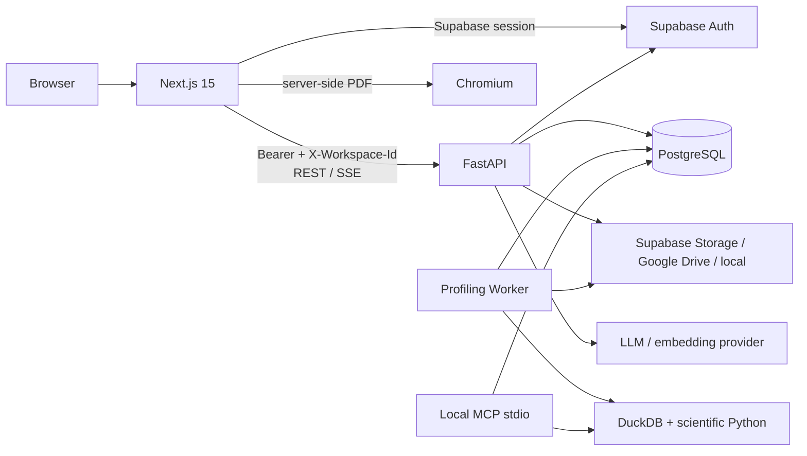

# Tài liệu kỹ thuật VDaAgent

> Cập nhật và đối chiếu với source, migration, test và workflow trong working tree ngày 2026-09-06. Code và migration vẫn là nguồn sự thật cuối cùng khi tài liệu có sai lệch.

Thư mục này mô tả kiến trúc và behavior đang có của VDaAgent, không phải roadmap hay cam kết SLA. Hệ thống biến nguồn dữ liệu dạng bảng thành profile, phân tích, câu trả lời có bằng chứng và report có provenance; các ranh giới xuyên suốt là workspace isolation, bounded execution, human-in-the-loop và fail-closed evidence validation.

## Đọc nhanh theo nhu cầu

| Nhu cầu | Tài liệu bắt đầu |
| --- | --- |
| Hiểu toàn hệ thống | [Tổng quan hệ thống](./architecture/system-overview.md) |
| Tìm module chịu trách nhiệm | [Cấu trúc codebase](./architecture/codebase-structure.md) |
| Hiểu FastAPI, service và worker | [Kiến trúc backend](./architecture/backend.md) |
| Hiểu Next.js, auth bootstrap và client state | [Kiến trúc frontend](./architecture/frontend.md) |
| Hiểu bảng, artifact và ownership dữ liệu | [Kiến trúc dữ liệu và lưu trữ](./architecture/data-and-storage.md) |
| Tích hợp REST, SSE và idempotency | [API và event contract](./architecture/api-and-events.md) |
| Hiểu queue profiling | [Profiling Job bất đồng bộ](./architecture/async-profiling-jobs.md) |
| Hiểu Preview → Official | [Phân tích có giới hạn](./architecture/bounded-execution.md) |
| Hiểu agent, tool, retrieval và trace | [Agent system](./architecture/agent-system.md) |
| Hiểu report snapshot | [Report Draft và snapshot](./architecture/report-draft-snapshots.md) |
| Xem phần chưa phải guarantee | [Giới hạn và sai lệch hiện tại](./architecture/known-limitations.md) |
| Chạy dự án local | [Phát triển và kiểm thử local](./development/local-development-and-testing.md) |
| Triển khai/vận hành | [Triển khai](./operations/deployment.md) và [quan sát](./operations/observability-and-failure-recovery.md) |

## Bản đồ tài liệu

### Kiến trúc

- [Tổng quan hệ thống](./architecture/system-overview.md) — context, container, trust boundary và data flow đầu-cuối.
- [Cấu trúc codebase](./architecture/codebase-structure.md) — layout `src/`, dependency direction và source of truth.
- [Kiến trúc backend](./architecture/backend.md) — API process, request lifecycle, service/repository và worker/MCP.
- [Kiến trúc frontend](./architecture/frontend.md) — App Router, provider tree, auth/workspace bootstrap, API client, SSE và PDF.
- [Kiến trúc dữ liệu và lưu trữ](./architecture/data-and-storage.md) — domain PostgreSQL, canonical artifact, retention và Data API boundary.
- [API và event contract](./architecture/api-and-events.md) — route group, header, lỗi, idempotency và hai stream SSE.
- [Profiling Job bất đồng bộ](./architecture/async-profiling-jobs.md) — enqueue, lease, retry, resume và state projection.
- [Phân tích có giới hạn](./architecture/bounded-execution.md) — QuerySpec, planner, Preview, Official và quality gate.
- [Agent system](./architecture/agent-system.md) — LangGraph, native skill, tool, retrieval, evidence và trace.
- [Report Draft và snapshot](./architecture/report-draft-snapshots.md) — optimistic edit, snapshot SHA-256 và PDF source.
- [Giới hạn và sai lệch hiện tại](./architecture/known-limitations.md) — behavior chưa được xem là guarantee và nợ tích hợp sau khi chuyển code vào `src/`.

### Chức năng

- [Dataset và profiling](./features/datasets-and-profiling.md)
- [Connector và storage](./features/connectors-and-storage.md)
- [Command Center](./features/command-center.md)
- [QA và evidence](./features/qa-and-evidence.md)
- [So sánh drift](./features/drift-comparison.md)
- [Report](./features/reports.md)
- [Workspace và quản trị](./features/workspaces-and-admin.md)

### Bảo mật

- [Authentication và authorization](./security/authentication-and-authorization.md)
- [Cô lập workspace, Data API và privacy](./security/workspace-isolation-and-privacy.md)

### Vận hành và phát triển

- [Cấu hình](./operations/configuration.md)
- [Database migrations](./operations/database-migrations.md)
- [Quan sát và phục hồi lỗi](./operations/observability-and-failure-recovery.md)
- [Triển khai Azure](./operations/deployment.md)
- [Trang tương thích CI/CD Azure](./operations/azure-deploy-cicd.md)
- [Phát triển và kiểm thử local](./development/local-development-and-testing.md)
- [Evaluation và release evidence](./development/evaluation.md)

## Kiến trúc trong một sơ đồ

Production được thiết kế với ba process/container độc lập: Next.js, FastAPI và Profiling Worker. PostgreSQL giữ metadata, durable job, evidence, report, audit, retrieval và checkpoint. Storage giữ raw object; DuckDB materialize và tính toán trên file có giới hạn. MCP là tiến trình stdio local, không phải endpoint HTTP công khai.

## Bề mặt runtime

Tất cả router nghiệp vụ được mount dưới `/api/v1`; health backend là `/health`, còn OpenAPI/Redoc bị tắt trong production.

| Nhóm | Module sở hữu | Bề mặt tiêu biểu |
| --- | --- | --- |
| Dataset, profile, QA, drift | `src/backend/src/api/routes.py` | `/datasets`, `/profile`, `/profiling-jobs`, `/qa`, `/profile/{run_id}/drift` |
| Command Center | `src/backend/src/api/analysis_routes.py` | `/analysis-sessions`, `/profile/{run_id}/explorer/*`, `/profile/{run_id}/charts/*` |
| Workspace, report | `src/backend/src/api/authz_routes.py` | `/session`, `/workspace-bootstrap`, `/workspaces`, `/reports`, `/dashboard` |
| Connector | `src/backend/src/api/connector_routes.py` | `/connectors` và lifecycle datasource |
| Google Drive | `src/backend/src/api/google_drive_routes.py` | status, files, import, OAuth callback và disconnect |
| Agent runtime | `src/backend/src/api/agent_routes.py` | run, trace, evidence, plan và trace summary |
| Native agent skills | `src/backend/src/api/skill_routes.py` | catalog, detail và inspect tool bundle |
| System Admin | `src/backend/src/api/admin_routes.py` | list/create/lock/role/delete user |
| Local MCP | `src/backend/src/mcp_server.py` | stdio tools cho profile, chart, Preview và Official |

Bảng này là bản đồ ownership, không thay thế OpenAPI/Pydantic contract.

## Nguồn sự thật và quy tắc bảo trì

| Mối quan tâm | Nguồn sự thật |
| --- | --- |
| REST/SSE và validation | `src/backend/src/api/`, `src/backend/src/models/` |
| Business rule và compute | `src/backend/src/services/`, `src/backend/src/agents/` |
| Persistence/schema | `src/backend/src/services/repository.py`, `src/backend/migrations/` |
| Frontend | `src/frontend/src/app/`, `src/frontend/src/components/`, `src/frontend/src/lib/` |
| Runtime/release | `config.yaml`, `.env.example`, Dockerfile và `.github/workflows/` |
| Evaluation | `tests/evaluations/` là harness; `evaluations/` là artifact đã sinh |

Khi thay đổi hệ thống:

1. đổi API thì cập nhật Pydantic, client type và contract test;
2. đổi schema thì thêm Alembic migration và kiểm tra Data API inventory;
3. đổi permission thì cập nhật capability registry và cross-workspace test;
4. đổi data/evidence flow thì giữ workspace binding, artifact provenance, approximation, limitation và PII masking;
5. đổi topology hoặc layout thì cập nhật tài liệu kiến trúc, lệnh local, Docker và CI trong cùng logical change.

[README gốc](../README.md) là trang giới thiệu dự án; bộ tài liệu trong thư mục này là cổng kỹ thuật chính.
