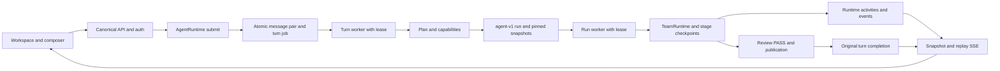
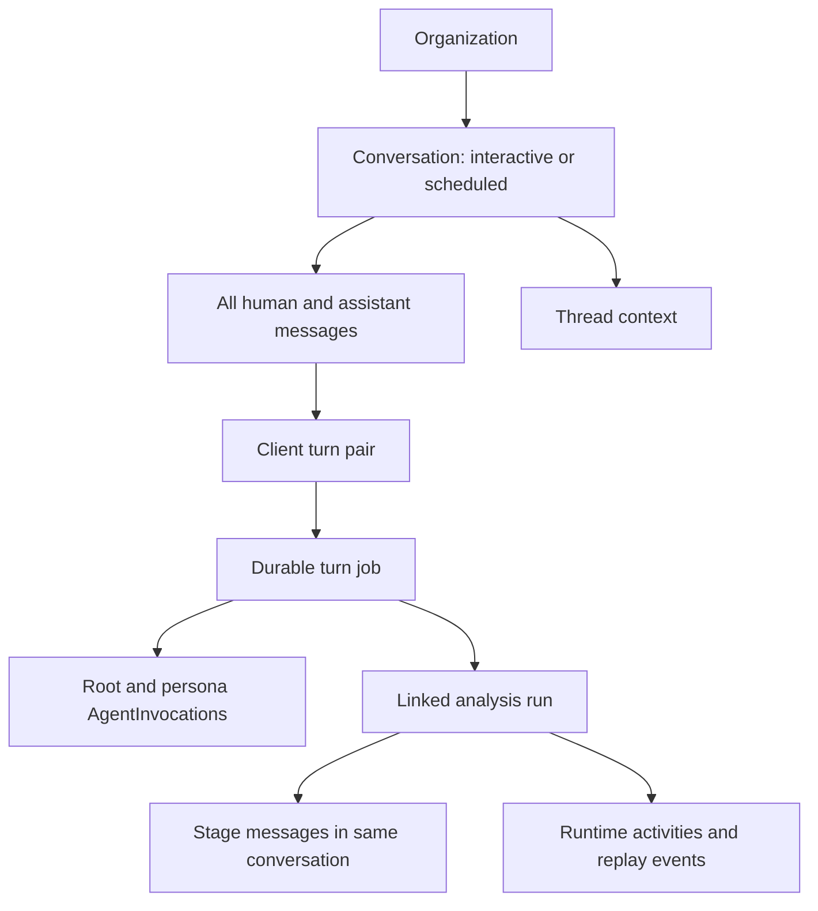
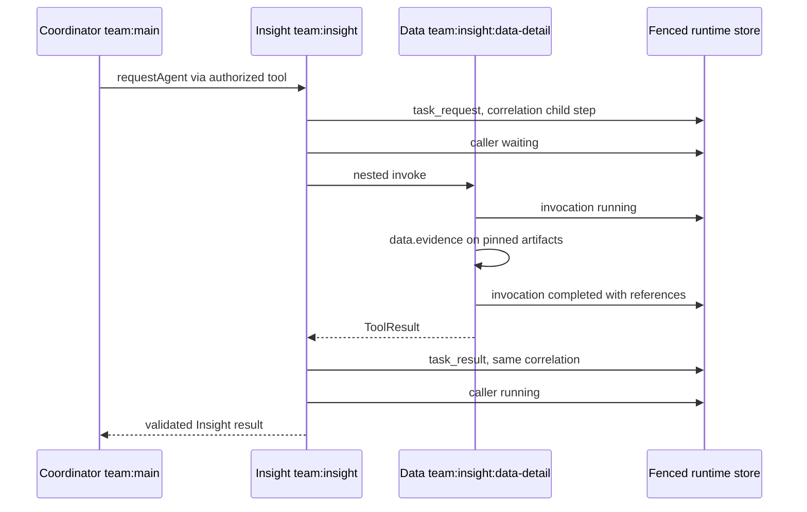
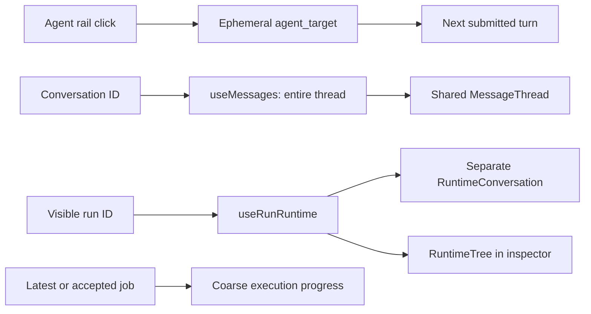
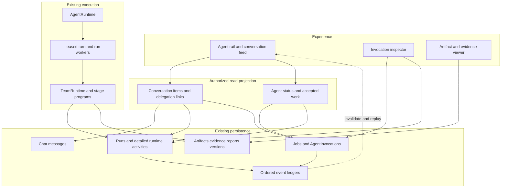
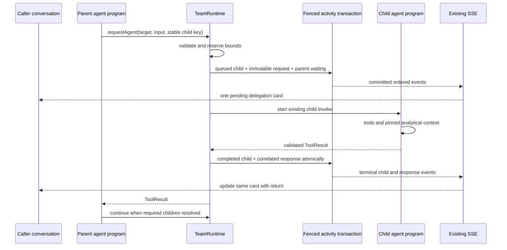
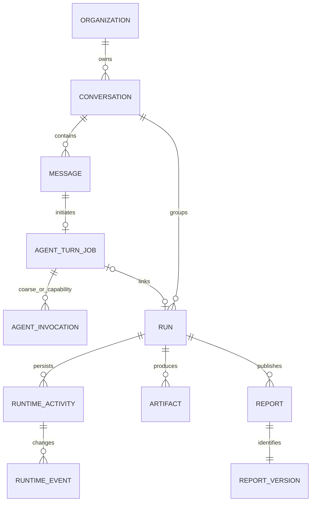
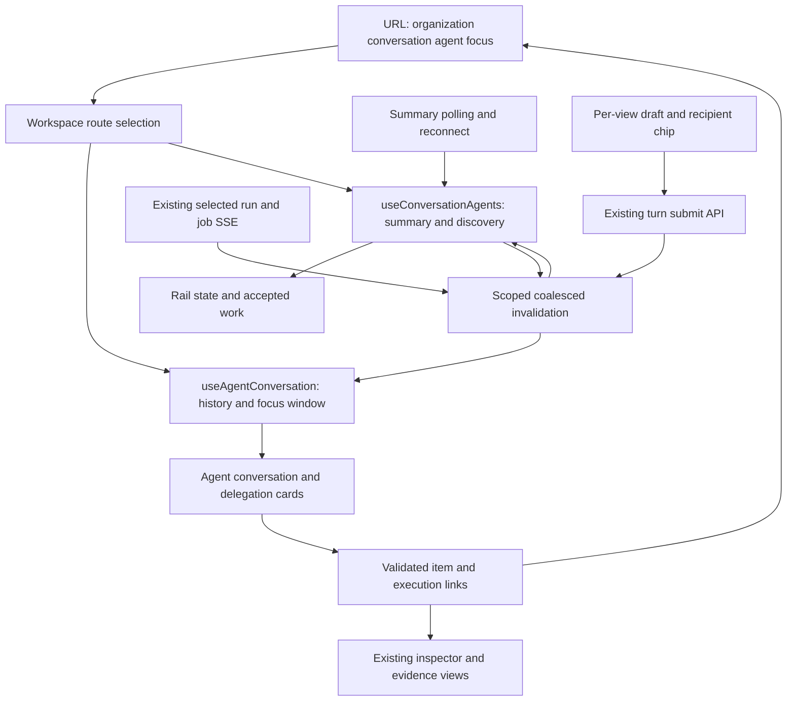

# VDaAgent Agent Experience Plan

Review date: 2026-09-29. Implementation handoff for Sol. **Design only; no production implementation is part of this review.**

Current-state evidence refers to local commit `4b03f4770ffc7a876ec0d86efbfb37752267d250`. Reference implementation: `mhiu05/vde-agent-demo` at `d727760460ca6a2d8780188b6f36ff282598eb94`. Paths without a reference-repository label are relative to VDaAgent. “Current evidence” describes inspected code; “Target decision” describes work to implement. Tests were inspected, not executed. Existing deletion of `docs/plan.md` is outside this task and must remain untouched.

## 1. Executive Summary

VDaAgent already persists real agent-to-agent requests, results, tool calls, and nested execution. The main product gap is how those records become a conversation: selecting an agent currently changes the next turn's recipient while leaving the same thread visible. Detailed runtime activity is shown separately for one selected run, and its links do not identify an exact caller card or callee conversation entry.

**Target decision: use virtual per-agent conversations within the existing organization and conversation.** Build a read projection over `messages` and `runtime_activities`; retain the existing durable job/run ownership, `AgentRuntime`, `TeamRuntime`, `agent-v1`, artifacts, evidence, and report publication. Do not introduce an `AgentChannel` table, copy runtime messages into chat storage, create a per-agent scheduler, or replace SSE.

There are two different persisted invocation models today. `agent_invocations` describes durable turn execution and coarse analysis personas; `runtime_activities(kind='invocation')` describes the actual nested TeamRuntime calls. Use a discriminated execution reference and show each at its real level of detail. In particular, never equate the coarse Data persona with every nested Data invocation.

Implement the read projection and precise links, harden delegation persistence and replay ordering, add agent-scoped history and navigation, then derive truthful status and pending work from existing durable records. Preserve the distinction between a completed agent response, a validated analytical artifact, and a published report.

## 2. Scope and Non-Goals

In scope: agent selection as navigation; separately addressed human turns; visible delegated requests and replies; caller/callee links; nested invocation inspection; pending, working, waiting, failed and cancelled states; refresh/reconnect/recovery; bounded context selection; compatibility with historical conversations and both scheduled and interactive analyses.

Both product flows remain intact. Scheduled analysis continues automatically and its scheduled conversation stays read-only. Interactive analysis still begins with business scope, date and question; users do not need to know about workers, snapshots, leases or schemas.

Out of scope: replacing runtimes or workers; generic workflow continuations; a new scheduler, queue broker, database, API framework, authentication system, WebSocket transport, memory/vector service, plugin marketplace, unrelated workspace redesign, new business analysis capabilities, or report-system rewrite. No package restructuring. No cross-conversation “global Data chat.” No model reasoning traces in the user conversation.

## 3. Current-State Evidence

### 3.1 Repository / canonical architecture

`ARCHITECTURE.md`, `docs/architecture/execution-model.md`, `docs/architecture/frontend.md`, and `docs/architecture/security.md` describe the canonical boundaries. Executable analysis is `agent-v1`; legacy runs remain historical data. `src/frontend/server/api/` serves canonical `/api/*` routes despite the server code living under `frontend`. `src/backend/worker/run-loop.ts` drives durable turn and analysis work.

The root `package.json` pins Node >=24, pnpm 11.0.8 and the workspace scripts. The frontend is Next.js/React. Existing frontend state uses dedicated React hooks and API clients; adopting the demo's React Query stack is unnecessary. The workspace is an organization-scoped UI, not a new persisted workspace entity. Organizations and membership establish authorization; conversations group shared organization history.

`src/backend/supabase/config.toml` declares `schemas/*.sql` and enables pgdelta. `005_agent_chat.sql`, `006_agent_workflow_persistence.sql`, `008_durable_agent_execution.sql` and `010_agent_workspace_runtime.sql` are the principal persistence sources for this task. `docs/outsources/agents-architecture.md` was empty at inspection and supplies no architectural evidence.

### 3.2 AgentRuntime

Current evidence: `src/backend/agents/runtime/agent-runtime.ts::AgentRuntime` parses and validates submission context, tries durable admission, and otherwise executes the bounded synchronous turn path. `src/backend/agents/runtime/admission.ts::enqueueEligibleDurableTurn` admits valid new turns when durable execution is enabled; this is not limited to the narrow deterministic inventory shortcut. `src/backend/config/index.ts` defaults durable execution and SSE on.

Durable replay returns the existing accepted turn. The turn worker calls `resumeDurableTurn`; approved deterministic analysis can bypass planning, while other turns enter `executeTurn`. The context builder, policy/provider plan, capability registry and grounded composition determine the response. A capability that starts analysis links an `agent-v1` run and returns pending; it does not keep a browser request alive. Non-analysis capability steps can have durable invocation records, but these are not a generic persisted program continuation.

`src/backend/agents/runtime/limits.ts` bounds the turn: three capability steps/calls, one newly created/mutating run, one planner and one composer, two provider attempts, a default 12-second provider timeout and 45-second turn budget. `runtime/providers/contracts.ts` and `runtime/capabilities/registry.ts` keep providers behind server-owned contracts and grounded results. Agent experience must not loosen those bounds or turn chat text into arbitrary tool execution.

Existing targets include coordinator, data, comparison, insight, chart, analyst, report and reviewer. Specialist analysis and full report generation have different policies. Unsupported causal requests must still return an honest limitation; a more expressive conversation does not add causal analytical capability.

### 3.3 Durable agent-v1 execution

Current evidence: `src/backend/database/repositories/agent-execution-repository.ts::AgentExecutionRepository` creates the user/assistant pair, durable job, root invocation and initial execution event atomically through the conversation transaction. Idempotency is tied to the original user turn. A root job invocation is currently `orchestrator` even when the requested recipient is a specialist.

Claiming uses `FOR UPDATE SKIP LOCKED`, leases and fencing tokens. Default leases are 30 seconds; worker heartbeat is 10 seconds; retry/reclaim budgets are bounded at three attempts. `startAnalysis` creates and links an idempotent run, records coarse persona slots and moves the job to waiting, releasing its lease. Run completion wakes/finalizes the original turn. The loop processes turn work and run work; it does not claim TeamRuntime children as separate jobs.

`src/backend/database/transactions/create-run.ts::buildRun` freezes `run_snapshots` when the run is inserted. This is later than initial turn admission when a queued turn has not yet created a run. `src/backend/database/workflow/lease-repository.ts::claimNextRun` and the run dispatcher protect execution and persistence after browser disconnect and worker failure. Recovery re-enters the fixed workflow and rehydrates completed stage checkpoints. It does not resume an arbitrary suspended JavaScript stack.

`src/backend/database/workflow/terminal-run.ts` terminalizes active tasks/runtime activities and synchronizes linked jobs/invocations/messages transactionally. Cancelling a linked run uses the existing run cancellation operation and fencing. Cancelling an unlinked job uses job cancellation. Completed published reports remain preserved.

### 3.4 Conversation/message model

Current evidence: `src/contracts/chat/conversation.ts` defines interactive and scheduled conversations. `src/contracts/chat/message.ts` defines organization/conversation IDs, optional run and client-turn IDs, user/assistant role, `sender_agent`, content, structured parts, context references, reply reference and report intent. There is no public message recipient field or agent channel ID.

`src/backend/database/repositories/conversation-repository.ts::listMessages` queries by organization and conversation, with `(created_at,id)` keyset pagination, default 30 and maximum 100. `startTurn` validates idempotent request hashes, creates one user/assistant pair and disallows interactive writes to scheduled conversations. Reply validation checks organization/conversation ownership, not agent affinity.

The private user-message payload already preserves `agent_turn.request.agent_target`, request identity and `thread_context_snapshot`. `src/backend/database/mapping/conversation.ts::normalizeMessage` deliberately excludes this internal envelope from the public DTO. A projection can read the original recipient without exposing the whole request, request hash or idempotency metadata.

`src/backend/database/workflow/checkpoint-repository.ts::upsertStageMessage` emits assistant stage messages with a stable per-run/per-agent ID, `sender_agent`, no client turn, and public artifact references. These are stage summaries, not individual delegation results. Revisions update that stage slot. They must not be matched to a child call merely because the agent name matches.

`src/backend/database/repositories/workspace-repository.ts` persists thread dataset and active run/artifact/report context and validates its references. Selected agent is not stored in that context.

### 3.5 AgentInvocation

Current evidence: `src/contracts/runtime/execution.ts::AgentInvocationSchema` and `008_durable_agent_execution.sql` provide invocation ID, organization/job, parent invocation, step key, agent key, depth, status, optional run and analysis-stage IDs, and timestamps. Parent references are constrained to the same organization/job; roots and step keys are unique. The repository enforces depth <=16, fewer than 100 invocations per job and ancestor-cycle restrictions when creating these records.

Missing from this model: a persisted call request/result pair, tool-call reference, duration, invocation-level error or attempt history, and exact runtime-message linkage. Root/caller are derivable from the parent chain, but no explicit root field exists. Job rows hold job attempts/errors.

Actual writers matter more than theoretical schema capacity. `startAnalysis` creates fixed depth-one persona children. `src/backend/database/workflow/agent-projection.ts::syncAgentInvocationsFromRun` synchronizes them from analysis task status. `AGENT_V1_PERSONA_STAGES` groups analyst+insight and chart+report+reviewer+publication under coarse personas. These are not the nested TeamRuntime execution tree.

The second store, `runtime_activities`, already has the actual invocation parent step, tool calls, agent-to-agent messages, summaries, references, duration and errors. Preserve both models and make their meaning explicit rather than migrating every runtime call into `agent_invocations` for presentation.

### 3.6 Agent-to-agent calls

Current evidence: `src/backend/agents/runtime/team/executor.ts` exposes `RegisteredAgent<I>` with definition, allowed delegates, input schema and `execute(input, InvocationContext): Promise<ToolResult>`. Context provides an abort signal, built context, `callTool` and `requestAgent`. Its `invocationId` is a stable **step key**, not the UUID of either invocation table.

`TeamRuntime.requestAgent` currently persists a request through `AgentMessageBus`, marks the caller waiting, wraps delegation as an authorized tool, invokes the child in-process, persists a result message on success, and resumes the caller when its in-memory pending-child count reaches zero. `ToolRegistry` validates and bounds inputs/results, handles timeouts and authorization, and compacts oversized results by references. A failed child records invocation/tool failure and throws; there is no successful `task_result` for that failure.

Exact message relationships: request step is `<child-step>:request`; reply step is `<child-step>:response`; both use `correlation_id=<child-step>`. Both messages' `parent_step_key` is the **caller**. Request sender/target are caller/callee; reply sender/target are callee/caller. `parent_message_id` exists in the contract but this bus does not populate it today. Do not interpret a reply's parent step as its sender's invocation.

`src/backend/agents/analysis/team-workflow.ts::executeTeam` runs coordinator `team:main`, delegates Data, then comparison/chart/analyst branches, then Insight, Report and Reviewer, with bounded report revision. Insight actually calls Data again at `team:insight:data-detail` for evidence. That operation loads pinned stage artifacts and binds validated claims; it is not just a UI animation. Specialist workflows have specialist roots and produce artifacts without automatically publishing a full report.

`recordRuntimeActivity` fences writes, validates same-run parents/references, preserves record UUIDs, makes messages immutable, rejects conflicting step identity and caps records at 500/run. Record and replay event are written in one transaction by `src/backend/database/workflow/runtime-activity-store.ts::writeRuntimeRecord`. However, the request, child state, child completion and response are separate transactions today. A process stop between them can leave incomplete visible relationships until recovery.

Concrete end-to-end trace, verified in the full workflow and its fixture in `tests/workers/turn-integration.test.ts` (inspection only): an accepted coordinator inventory-analysis turn creates one chat pair/job; the turn worker links a run with pinned snapshots; the run worker enters `executeTeam` at `team:main`; coordinator obtains Data and parallel analytical branches; coordinator delegates Insight; Insight's `team:insight:data-detail` call writes an Insight→Data request, invokes the Data evidence operation against that run's stored artifacts, receives validated references and writes Data→Insight result; Insight composes grounded claims and returns to coordinator; Report/Reviewer proceed through the existing publication gate. Runtime record/event writes feed run SSE, while original/stage chat rows feed the thread query. Today the resulting nested call is visible in the runtime tree and separate runtime-message block, but selecting Data still renders the shared chat thread. This trace is the primary vertical slice for the target experience.

### 3.7 SSE/replay

Current evidence: `src/frontend/server/durable-event-stream.ts` serves durable snapshot/event/terminal streams, drains ordered event pages before terminal, polls at 750 ms, sends 15-second heartbeat comments and rotates around 55 seconds. Disconnect ends subscription, not submitted work. Each load reauthorizes and redacts stream failures.

`src/frontend/server/api/routes/conversations.ts` exposes job snapshots, job SSE and cancellation; conversation job lookup returns the latest job. `runtime-workspace.ts` exposes run runtime snapshots and SSE; `Last-Event-ID` takes precedence over `after`. Runtime outer event type is `runtime`, with persisted `invocation`, `message` or `tool` records. Job outer event type is `execution`. Both stores have ordered persisted event IDs/sequences.

The POST stream in `src/frontend/server/api/streaming/agent-turn.ts` uses ephemeral `AgentActivityEventV1` for the non-durable path. Do not use this as the source of channel history. Analysis task logs are another execution view, not conversation messages.

Gap inferred from code, not a reproduced production incident: `WorkspaceRepository.getRunRuntime` loads current records, then at most 500 historical events in a default transaction, and returns the last delivered event sequence. `use-run-runtime.ts` can apply later historical pages over a newer record snapshot. Record snapshot consistency and replay-cursor progress need distinct watermarks. Concurrent commits between the two reads are a second consistency concern. Section 19 specifies the narrow fix without dropping event pages.

### 3.8 Frontend workspace

Current evidence: `src/frontend/features/workspace/workspace.tsx` mounts `AgentWorkspace`; `features/agent-workspace/components/agent-workspace.tsx` composes rail, conversation and inspector, with responsive dialogs/focus restoration. `workspace-conversation.tsx` renders the whole `MessageThread`, then `RuntimeConversation` for the visible run, progress and artifact/report/decision components.

`runtime-conversation.tsx` renders runtime messages with sender/target and request/result labels, but does not join the pair into a delegation or navigate to an exact execution. `runtime-tree.tsx` already renders the detailed runtime parent tree, timing, errors and context metrics. `workspace-inspector.tsx` also shows coarse job invocations. These useful components should evolve, not be rebuilt as a second workspace.

`features/agent-chat/hooks/use-agent-chat-controller.ts` combines messages, latest/accepted job, selected-run runtime and thread/workspace resources. `use-agent-execution.ts` consumes job SSE with polling fallback and monotonic snapshot handling. `use-run-runtime.ts` subscribes to one visible run. `agent-workspace-model.ts` builds an orphan/cycle-safe runtime tree and maps aliases `orchestrator/main` to `coordinator`, `compare` to `comparison`.

Current rail status is derived from one visible run or a matching coarse invocation, not all active work in the conversation. Agent rows expose status through accessibility text but do not provide explicit pending-work lists or durable unread semantics. `components/shell/routes.ts` and `features/workspace/routing/workspace-route.ts` have conversation/run/org routes, without agent/item/invocation deep links.

### 3.9 Agent selection / mention

Current evidence: rail selection calls `chat.setAgentTarget`; `use-agent-turn.ts` keeps that recipient in React state and captures it in the submitted request/retry identity. This does not change the message query. Refresh loses the selection; a new conversation resets it.

`features/agent-chat/composer.tsx::selectMention` inserts a display mention and separately calls `onAgentTarget`. The explicit structured `agent_target` routes the turn. Plain typed `@Data` text alone has no server parser; multiple textual mentions do not cause fan-out or delegation. Replying to a message preserves the reply reference but does not automatically select that message's sender as recipient.

## 4. Current Architecture Diagrams

Current architecture:



Current conversation model:



Current real nested call:



Current UI data flow:



## 5. Why Agents Do Not Yet Feel Independent

| Root cause supported by current code | Product consequence | Required change |
| --- | --- | --- |
| `setAgentTarget` changes submit state; `listMessages` has no agent scope | Clicking Data shows the same conversation | Agent-scoped projection and navigation state |
| Message DTO omits original recipient; sender alone cannot place human turns | Filtering only `sender_agent` would drop questions or misroute replies | Derive a pair's recipient from the private accepted request |
| Runtime messages and normal messages use separate UI blocks | Delegation feels like a log rather than a conversation | Unified semantic feed with stable source references |
| Runtime is loaded for one visible run | Switching inspector run changes apparent agent activity/history | Channel history across the conversation's runs; inspector selection is separate |
| Detailed runtime calls and coarse persona slots are both called invocations | Same-agent nested calls can be conflated | Typed execution references and explicit aggregate labels |
| Request/result correlation is persisted but not joined in UI | Caller cannot see an exact returned result or jump to callee | Server-built delegation DTO and item anchors |
| Rail status uses visible-run/latest-job data | Concurrent work can disappear from status | Conversation-wide summaries from existing durable records |
| Route lacks agent/item/execution identity | Refresh or tree clicks cannot restore a precise view | Validated URL state plus around-item pagination |
| Request/terminal/reply writes have transaction gaps | Recovery can leave a misleading pending card | Atomic accepted-delegation and terminal-result persistence |

This is primarily a projection and interaction gap with two targeted correctness prerequisites. A new channel table alone would solve none of the linkage, replay or execution-ownership problems.

## 6. vde-agent-demo Implementation Review

The review inspected the reference implementation, not just its design document. All links below are pinned to the reviewed commit.

### Engine

[`backend/vdagent_backend/engine/engine.py`](https://github.com/mhiu05/vde-agent-demo/blob/d727760460ca6a2d8780188b6f36ff282598eb94/backend/vdagent_backend/engine/engine.py) persists tasks/invocations but keeps live Run objects, futures and per-user/per-agent Stack queues in memory. Human submission creates a task and queued root invocation; `_pump` gives one invocation exclusive use of that agent stack. `_execute` appends inbound content, builds stack context, invokes the plugin and persists terminal output.

On restart, `recover` fails queued/running invocations and tasks and repairs unfinished tool exchanges. This is honest failure recovery, not VDaAgent's lease reclaim and stage checkpoint recovery. Pending UI entries come from live engine state, so persisting an invocation does not make the reference queue a durable scheduling system.

### send_to_agent

[`engine/context.py`](https://github.com/mhiu05/vde-agent-demo/blob/d727760460ca6a2d8780188b6f36ff282598eb94/backend/vdagent_backend/engine/context.py) supplies `TurnContext` tool/message/delegation methods. In [`agents/data/vdagent_data/agent.py`](https://github.com/mhiu05/vde-agent-demo/blob/d727760460ca6a2d8780188b6f36ff282598eb94/agents/data/vdagent_data/agent.py), the loop emits an assistant tool call, calls `ctx.call_agent(tool_call_id, agent, message)`, awaits the child, then emits the correlated tool result. Engine validation requires a declared `send_to_agent` tool call and prevents duplicate or unresolved exchanges.

`_on_call` checks target, depth, self/reachability, creates a child carrying parent ID, caller, callee, tool-call ID and inbound text, and queues it on the target stack. Child completion persists its result and resolves the parent's future by tool-call ID. Failures and cancellation patch outstanding tool exchanges. Rejections have explicit persisted rejected child records and error results. The useful lesson is the exact request/call/result relationship, not the string tool name or future implementation.

### Per-agent stack

[`db/schema.sql`](https://github.com/mhiu05/vde-agent-demo/blob/d727760460ca6a2d8780188b6f36ff282598eb94/backend/vdagent_backend/db/schema.sql) and [`db/repo.py`](https://github.com/mhiu05/vde-agent-demo/blob/d727760460ca6a2d8780188b6f36ff282598eb94/backend/vdagent_backend/db/repo.py) persist messages per `(user_id,agent)` with sequence, task/invocation and tool-call relationships. Human and agent-originated inbound messages share the target stack with explicit sender metadata. Replies live in the callee stack and return as tool results to the caller.

Old finished-task messages can be compacted: a stack summary is saved and originals marked compacted transactionally; originals remain available. REST pages by `before_seq` (default 50, maximum 200). A live pending entry precedes the eventual inbound message. VDaAgent should preserve the sender clarity and history browsing, but use conversation scope and existing immutable artifacts rather than global user-agent history.

### WaitGraph

[`engine/waitgraph.py`](https://github.com/mhiu05/vde-agent-demo/blob/d727760460ca6a2d8780188b6f36ff282598eb94/backend/vdagent_backend/engine/waitgraph.py) uses counted agent-level edges scoped to the user. Counts matter when parallel calls share an edge. The engine checks reachability and reserves an edge before asynchronous persistence, removes it on completion and unwinds it on failure. This fits its exclusive stack lock: a different invocation of an occupied agent can block a dependency chain. The graph is not durable and restart does not resume its waits.

### Plugins / Agent contract and memory

[`plugins.py`](https://github.com/mhiu05/vde-agent-demo/blob/d727760460ca6a2d8780188b6f36ff282598eb94/backend/vdagent_backend/plugins.py) builds an immutable registry through a buffered setup API; failed setup does not partially register a plugin. [`sdk/vdagent_sdk/__init__.py`](https://github.com/mhiu05/vde-agent-demo/blob/d727760460ca6a2d8780188b6f36ff282598eb94/sdk/vdagent_sdk/__init__.py) defines invoke/compact and context services. The engine owns lifecycle while each agent owns its program.

Data/compare/orchestrator use thin model tool loops. [`agents/insight/vdagent_insight/agent.py`](https://github.com/mhiu05/vde-agent-demo/blob/d727760460ca6a2d8780188b6f36ff282598eb94/agents/insight/vdagent_insight/agent.py) uses LangChain and memory middleware; [`memory.py`](https://github.com/mhiu05/vde-agent-demo/blob/d727760460ca6a2d8780188b6f36ff282598eb94/agents/insight/vdagent_insight/memory.py) retrieves limited relevant findings and deduplicates best-effort writes in per-user/per-agent memory. [`agents/report/vdagent_report/graph.py`](https://github.com/mhiu05/vde-agent-demo/blob/d727760460ca6a2d8780188b6f36ff282598eb94/agents/report/vdagent_report/graph.py) uses LangGraph for assess/revise/finalize. Its finalization after the revision limit can occur after an unsatisfactory verdict; it is not VDaAgent's mandatory PASS publication gate. Demo report rows also do not provide VDaAgent's immutable report-version lineage.

VDaAgent's `RegisteredAgent.execute` already supports different implementations behind a common contract. Reuse this concept without introducing those libraries or changing memory storage.

### AgentList, ChatPane, MessageItem and TaskTree

Reference frontend files under `frontend/src/` were inspected alongside the backend. AgentList selects the stack and displays busy/queue counts; ChatPane fetches selected-agent history, deduplicates by message ID, pages by sequence, preserves the older-page scroll anchor and shows pending sender/working state. MessageItem distinguishes human versus agent inbound, makes `send_to_agent` a visible call chip and pairs returned tool results. Some errors and artifact links are recognized from string patterns; VDaAgent should use typed errors and structured references instead.

TaskTree constructs a forest from persisted parent invocation IDs and shows caller, state, timing, request/result/error. Clicking selects the agent, but does not locate the exact message. VDaAgent should improve on this with item-level links and page hydration rather than stopping at channel selection.

### SSE/event reducer

[`events.py`](https://github.com/mhiu05/vde-agent-demo/blob/d727760460ca6a2d8780188b6f36ff282598eb94/backend/vdagent_backend/events.py) maintains in-memory per-user subscriber queues; overflow closes the stream. Events include `message.appended`, `invocation.updated`, `task.updated` and `agent.status`. The frontend reducer upserts cache records and adjusts pending work, while reconnect invalidates queries. There is no durable replay cursor equivalent to VDaAgent's run/job ledgers. Adopt idempotent cache updates and resync behavior, retain VDaAgent's stronger transport and authorization.

## 7. Current vs Reference vs Target Comparison

| Dimension | VDaAgent current | vde-agent-demo | VDaAgent target |
| --- | --- | --- | --- |
| Conversation scope | Organization + conversation | User + agent global stack | Organization + conversation + agent view |
| Per-agent chat | Selection changes recipient | Selected stack has own history | Virtual filtered semantic history |
| Message persistence | Chat rows + runtime message rows | Sequenced stack rows | Reuse both; no copied dialogue |
| Agent-to-agent calls | TeamRuntime authorized nested tool | `send_to_agent` and future | Existing requestAgent with atomic lifecycle |
| Caller/callee relation | Parent step + correlation | Parent invocation + tool-call ID | Validated typed exact links |
| Child invocation | Actual runtime row; separate coarse job slots | One invocation entity | Preserve distinction; runtime for actual child |
| Task/invocation tree | Detailed runtime plus coarse progress | Parent-ID task forest | Linked detailed tree, aggregate fallback |
| Durable execution | Leases, fencing, checkpoint recovery | Live engine; restart fails tasks | Preserve VDaAgent durability |
| Queue | Durable turn/run queues | In-memory exclusive agent deque | Project accepted work; no new scheduler |
| Busy status | Visible run/latest job approximation | Stack lock | Conversation-wide active execution counts |
| Waiting | Job wait releases worker; Team wait in process | Parent future retains stack | Explicit pending-child relationships |
| Cycle detection | Ancestor agents + bounds | Counted agent WaitGraph | Ancestor prevention; no cross-run waits |
| Max depth | Team 6; durable job records 16 | Engine call-depth bound | Keep separate existing bounds |
| Memory | Working/run, episodic/thread, workspace/org | Stack summary + scoped memory | Same memory; relevant bounded context |
| Agent contract | RegisteredAgent + ToolResult | Plugin invoke/compact | Existing heterogeneous program boundary |
| SSE/realtime | Durable GET SSE plus non-durable POST path | In-memory EventBus | Existing durable SSE and scoped invalidation |
| Replay | Ordered persisted job/run events | Query refetch on reconnect | Replay with coherent snapshot watermark |
| Artifacts | Validated typed immutable references | Dataset/chart/report outputs | Existing artifact identity and visibility |
| Evidence | Same-run checked structured references | Less stringent output conventions | Keep claim/metric/source drilldown |
| Reports | PASS-only publication | Graph finalize after bounded revision | Preserve PASS-only publication |
| Report versioning | Immutable lineage/version records | Simple report records | Preserve exact lineage and version |
| Frontend navigation | Conversation/run routes; target in state | Selected agent in UI context | URL agent + execution + exact item |
| Reconnect behavior | Replay + polling, selected run only | Invalidate caches | Replay, summary discovery, page reconciliation |
| Tenancy | Organization membership and RLS | User scoping | Existing membership and RLS on every read |
| Concurrent same target | Distinct invocations, no global agent lock | Serialized target stack | Distinct cards and IDs; retain concurrency |
| Historical compatibility | Legacy and agent-v1 data | One demo model | Honest partial detail; no fabricated children |

## 8. Reuse / Adapt / Reject Decisions

**Reuse conceptually:** agent selection reveals that agent's history; inbound sender identity; visible call/result pairing; pending work; caller/child navigation; agent-owned programs under runtime-owned lifecycle; compact relevant context; stable-ID cache upserts.

**Adapt:** scope stacks to an existing conversation, project both existing message sources, identify real runtime children, derive queues from durable work, retain current tool contracts and evidence references, make tree navigation exact, and use snapshots plus ordered replay. Keep existing display definitions; canonical IDs remain `coordinator` and `comparison`, not storage-wide renames to demo aliases.

**Reject:** global user-agent stacks, another message store, exclusive per-agent locks, in-memory scheduling/wait truth, restart-as-failure in place of checkpoint recovery, regex artifact/error semantics, replacing SSE, copying LangChain/LangGraph dependencies, soft publication gating, and a generic plugin system. Each would either weaken an existing guarantee or add work unnecessary for the requested experience.

## 9. Target Agent Experience Principles

1. A selected agent changes the visible conversation and default recipient, with an explicit recipient indicator in the composer.
2. Every visible delegation is a real accepted call with a stable request and execution identity. Pending intent is not a fabricated completed message.
3. One persisted request/result may be projected in both caller and callee views; it is not duplicated in storage.
4. History, live execution and published analytical outputs have separate models linked by IDs.
5. UI status comes from durable state; temporary connection loss is a connection notice, not agent failure.
6. All history and navigation are organization/conversation authorized. References never grant access.
7. Switching agents, tabs or inspector runs does not submit, cancel or restart work.
8. Evidence links retain the originating run even when the inspector currently shows another run.
9. Missing historical detail is labeled unavailable; it is never reconstructed as invented dialogue.
10. Context is explicitly selected and bounded. A visible channel is not permission to inject every displayed record into a model.

## 10. Target Architecture

### Conversation layer

Target decision: an agent conversation is an authorized view identified by `(org_id, conversation_id, canonical_agent_key)`. It spans that conversation's historical and active runs. It contains human turns addressed to this agent, their assistant responses, this agent's stage summaries, outgoing delegation cards, and inbound delegated requests/results. It does not own work execution or artifacts.

### Execution layer

Keep `AgentRuntime` for accepting/planning/composing turns, durable jobs for resumable turn phases, run workers for `agent-v1`, and TeamRuntime for bounded nested agent programs. Job `AgentInvocation` remains the turn/capability/aggregate execution record. Runtime invocation activities remain the detailed TeamRuntime call records. A projection links these by job/run membership without manufacturing a one-to-one relationship.

### Artifact/evidence layer

Keep existing artifacts, public-reference validation, run snapshots, decision intelligence, report drafts/review results, publication and version lineage. Conversation items carry authorized references; they never become the source of analytical truth. Published report links open the exact immutable version. Draft and review artifact payloads stay out of ordinary conversation/evidence views.

### Boundaries and links



UI contracts belong in `src/contracts` and read projections in the database/API layer. Runtime emits domain activity, not cards, URLs, unread state, sidebar order or UI labels.

## 11. Per-Agent Conversation / Channel Design

### Option analysis

| Option | Advantages | Costs and incompatibilities | Decision |
| --- | --- | --- | --- |
| A: persisted AgentChannel plus channel messages | Independent channel lifecycle/settings; direct foreign keys | Adds ownership/backfill rules; risks duplicating chat/runtime messages and creating a second history; channel identity does not solve invocation linkage | Reject for this scope |
| B: virtual projection over existing conversation/message/runtime records | Existing tenancy, durable history, IDs and replay survive; no duplicated dialogue; additive rollout | Needs explicit membership rules, joins, cursor and focus semantics | **Choose** |
| C: virtual history plus persisted per-agent channel settings/summary | Useful later for cross-device read markers or independently managed summaries | New lifecycle and stale-summary policy without a current product requirement | Defer; future metadata must not own messages or execution |

There is no stored `channel_id`. APIs accept the three natural identity components. Canonical keys are all eight existing definitions. Display aliases may change independently, but persisted `coordinator`, `comparison` and runtime steps do not get renamed.

### Chosen model and membership rules

1. For a human turn, derive `recipient_agent` from the accepted private `agent_turn.request.agent_target`; null means coordinator. Keep the human and its paired assistant in that recipient's view, even if the final response's actual `sender_agent` differs. Display the actual sender.
2. For a standalone stage assistant message, use its validated `sender_agent`. Do not identify a child invocation from agent name alone. Retain the exact run/artifact links.
3. For a runtime delegation request, join `(org,run,correlation_id)` to invocation `(org,run,kind='invocation',step_key)`. Validate caller parent and sender/target. Show one caller delegation card and one callee inbound item, both anchored by the same request activity UUID.
4. Pair a result by that same run/correlation and, for new writes, `parent_message_id=request.activity_id`. Do not pair by nearest timestamp, display name or content. In the caller view, return it inside the request card; in the callee view, show it as an output item linked back to the inbound request.
5. Raw tools, status transitions, retries and heartbeat events are execution detail. Do not append them all as chat messages. The card can show a compact expandable tool section.
6. Historical records with insufficient exact linkage remain visible as a stage summary or inspector activity with `linkage='historical_partial'`. Do not create a false delegation pair. A standalone historical assistant without recipient metadata falls back to its sender, then coordinator; label placement provenance in the DTO.
7. Do not duplicate the initiating human utterance into every callee channel. Provide an “Original question” link when known. A Data inbound request from Insight must say Insight, not Human or Orchestrator.

### Message taxonomy

| Semantic item | Persisted truth | Default display | Execution link |
| --- | --- | --- | --- |
| Human message | `messages`, user role | Human, addressed agent, text/context | Accepted job root if available |
| Assistant response | Original paired assistant message | Actual sender, grounded parts | Job and linked run |
| Stage summary | Stable stage assistant message | Agent summary and artifacts | Run/stage; exact child only if proven |
| Outgoing delegation | Immutable runtime request + child state + optional result | “Asked Data”, request, status, return | Exact runtime child |
| Inbound delegation | Same runtime request | “From Insight”, request and origin link | Same exact child |
| Delegated result | Immutable runtime response | Callee response with references | Same child and caller request |
| Pending accepted call | Queued child/runtime request or queued turn job | Pending row/card | Real accepted execution |
| Failed/cancelled call | Child/tool terminal record | Typed failure/cancel state attached to call | Exact execution, no fake successful reply |
| Artifact/report | Existing structured part/reference | Existing artifact/report component | Originating run and exact report version |
| Tool activity | Runtime tool activity | Collapsed execution detail | Owning invocation |
| Lifecycle event | Job/runtime event ledger | Updates existing state; no new chat bubble | Sequence-scoped execution |

Conversation items use immutable source identity: `message:<message_uuid>` or `activity:<activity_uuid>`. Caller delegation and callee inbound can share an item ID because their cache key includes agent. The caller's returned result is a companion, not a second caller timeline anchor; a direct result link normalizes to its parent card there.

### Context behavior

The feed is a presentation read model, not an LLM prompt. Start from the exact accepted turn context, pinned run data and explicit delegation input; add bounded relevant history/memory through existing builders. Section 23 specifies selection and restart behavior. Runtime rows initially offer navigation and “use artifact” actions, not an unvalidated raw-runtime-message reply input. Existing human/assistant reply references remain supported; do not add a second reply protocol to ship the core experience.

## 12. Agent-to-Agent Delegation Lifecycle

Target decision: keep `requestAgent` and in-process child execution. Add a bounded atomic persistence adapter around accepted delegation and terminal result, using existing activity/event tables and the current run lease. No child worker queue or persisted JavaScript continuation is introduced.

1. Before acceptance, authorize and validate target registration, delegate permission, child schema, unique step key, ancestor cycle, depth and all existing budgets. Reserve counters synchronously before any await so parallel calls cannot over-admit. Refactor invocation entry so a pre-reserved child is consumed once, not charged twice.
2. Persist queued child, immutable request, and caller waiting in one fenced transaction. Ensure caller already exists. The request records existing bounded summary, sender/target, correlation and safe public references. The queued state means “accepted, child entry not started,” not “independently claimable worker job.”
3. Start the existing delegation tool and child execution, moving the same child UUID to running. Tool records retain `<child-step>:delegate`; normal tools keep their existing step convention. Build context and execute the registered program.
4. On successful child completion, atomically persist completed child plus immutable response linked to the request. Return the same validated `ToolResult` to the caller. Persist only bounded public summary/references in the dialogue; `structured_data` remains internal, with stage checkpoints/artifacts supplying durable analytical reconstruction.
5. The outer tool completes and the caller continues. Only mark caller running when no accepted child remains active. The program keeps its local pending count; durable parent waiting state is reconciled with persisted child states so it can be explained after reconnect.
6. On child failure/cancellation, atomically terminalize child and dependent lifecycle state as appropriate. Do not create `task_result` containing an invented answer. The projection attaches the typed failure from execution records to the existing request. Existing whole-run cancellation handles all active descendants and increments the fence.
7. A pre-acceptance rejection produces the existing caller/tool failure code and a visible failed-call explanation in execution detail. It is not counted as a queued child or a request delivered to the callee. A new rejected status/table is unnecessary.

Suggested domain API: a required TeamRuntime `emitBatch` adapter alongside the existing single-activity emitter, returning persisted records. Repository `recordRuntimeActivities(lease, inputs)` validates and writes a small bounded batch in one transaction; internally reuse the single-record validation/writer. The begin operation writes the child before the request if required by validation; both become visible together. The terminal response uses the returned request UUID for `parent_message_id`. Single-record callers continue using the existing API. Names here are proposed, not existing symbols.

Do not allow production delegation to fall back to a sequence of non-atomic writes when the batch adapter is missing. Unit fixtures can implement an in-memory atomic test adapter. Roll back the whole batch on reference validation, lease or identity failure; generated event sequences remain ordered and invisible until commit.

Idempotency/recovery rules:

- Key uniqueness stays `(org,run,kind,step_key)`; repeated execution uses the same request, child, response and tool identities.
- An exact replay is a no-op with no extra message/event. Reject changed request semantics for the same accepted child. Never mutate historical immutable requests to add optional linkage fields.
- When a preexisting response lacks `parent_message_id`, return it unchanged after validating its existing correlation/sender/target; do not re-emit an enriched payload and trigger immutability failure. If a historical completed child has no response, only authentic checkpoint-backed workflow replay may produce the missing response from the real result.
- A completed child/result is not regressed by replayed queued/running input. Preserve its original response summary/refs/timing. Re-enter the stage adapter when needed to hydrate in-memory workflow outputs; persisted `summary` is not a substitute for `ToolResult.structured_data`.
- A reclaimed run may restart failed/cancelled intermediate activities under its new fence. The UI presents one logical call and its current attempt state; the event inspector can show transitions. This does not make a terminal user-cancelled run automatically retryable.
- A crash after terminal transaction but before parent continuation leaves a durable result. Recovery rehydrates checkpoints, replays the same call and continues without appending another card. A crash before acceptance leaves no delivered request. Historical partial relationships are repaired only by authentic workflow replay, not invented backfill.
- Lease loss must stop writes and abort execution. Non-cooperative program code cannot publish after losing the lease. Repeated external side effects still require existing stage/idempotency discipline; this plan does not claim universal exactly-once execution.



## 13. Data Model Changes

**Target decision: no new business table, required column, channel foreign key, or message backfill.** Existing payload fields are sufficient. Add typed read DTOs and populate existing optional `parent_message_id` for newly written runtime responses. No arbitrary result blob or duplicated message body is added to `agent_invocations`.

| Entity/relationship | Decision |
| --- | --- |
| Organization/conversation | Existing ownership and read/write policy remain |
| Human recipient | Read accepted private request; expose only canonical recipient + placement provenance in new DTO |
| Turn pair to job | Existing job user/assistant message IDs and client-turn identity |
| Job to run | Existing `run_id`; nullable until analysis is linked |
| Job invocation | Existing schema and parent FK unchanged; aggregate semantics labeled |
| Actual child invocation | Existing runtime kind invocation; UUID from persisted record |
| Child parent/root | Same-run `parent_step_key`; derive root with cycle/orphan-safe traversal |
| Caller/callee | Caller from request/parent invocation; callee from child and request target, checked for consistency |
| Delegation request | Existing immutable runtime message; correlation equals child step |
| Delegation response | Existing immutable message, same correlation; new writes populate request `parent_message_id` |
| Delegate tool | Existing `<child-step>:delegate` record; exact same-run association |
| Error/duration | Existing runtime fields; do not parse content or use job error for every child |
| Tool outputs | Existing stage artifacts/checkpoints; compact summary/ref dialogue |
| Replay | Existing event ledgers plus additive snapshot watermark DTO |
| Agent status/queue | Read projection, never writable UI state in SQL |
| Unread/last viewed | Local optional UI preference; no cross-device persistence in core scope |

Proposed execution reference contract:

```ts
type ExecutionRef =
  | { source: 'job'; job_id: UUID; invocation_id: UUID }
  | { source: 'runtime'; run_id: UUID; activity_id: UUID };
// A runtime activity referenced here must have kind === 'invocation'.
// Parent/root references, when returned, use the same discriminated type.
```

A delegation DTO contains `request_activity_id`, nullable `response_activity_id`, child/parent/root runtime execution refs, caller/callee canonical keys, run ID, request/result summaries, status, error code, duration, public artifact/evidence refs, delegate tool activity ID if available, initiating message ID if proven, and `linkage: exact | historical_partial`. Nullable fields must stay nullable where older data lacks evidence. A job-persona association is explicitly aggregate and can be one-to-many; it is never an exact `ExecutionRef` substitute.

Projection query design:

1. Authorize organization and conversation within the transaction. Validate canonical agent.
2. Build candidate anchors from addressed chat messages and relevant semantic runtime messages. Use `UNION ALL` with an explicit source rank; avoid OR joins that duplicate a row in the same agent view.
3. Use keyset ordering `(created_at, source_rank, id)` with fixed ranks message=0, activity=1. Preserve database timestamp precision in the cursor, rather than truncating it through JavaScript milliseconds. Fetch `limit+1` after scope filtering; default 30, max 100. Return ascending display order.
4. Load exact companion request/result/child/parent/tool records for that page in bounded batched queries. A result must still join when its request is on a different page. Do not separately limit each source before applying a correct combined keyset boundary.
5. Return `older_cursor`/`newer_cursor` and a scoped opaque cursor containing version, org, conversation, agent, direction and tuple. Reject malformed/scope-mismatched cursors; cursor contents are not authority.
6. `focus_item` uses the exact authorized anchor, loads a bounded window around it and reports which projected item to focus. If the focus is a caller-side result, normalize it to the request card. Do not scan page-by-page or silently substitute the newest item.

Start with existing `messages` conversation indexes, `runtime_activities_thread(org_id,conversation_id,created_at,id)` and the runtime `(org,run,kind,step)` uniqueness index. This release has **no mandatory SQL migration**. Benchmark the projected query with representative conversation history during implementation; if filtering is slow, add only measured expression indexes for sender/target or accepted recipient in declarative schema, followed by a generated additive migration. Do not speculatively add an index for every DTO field or create a materialized channel cache. Existing composite parent/run/org indexes and RLS remain unchanged.



The diagram represents logical relationships, not new foreign keys. Within `RUNTIME_ACTIVITY`, parent-step and correlation relations connect actual invocations, request/result messages and tools. No `AGENT_CHANNEL` entity is added.

## 14. Migration / Backfill / Compatibility

Deploy additive contracts/read APIs before enabling the new frontend. Existing message endpoints and event names keep their behavior. Existing clients must tolerate the optional new snapshot field; update the local frontend snapshot parser, which currently duplicates the contract, to use the shared definition. Do not add fields directly to strict `MessageSchema` responses just to serve the new feed; wrap the unchanged message in the new projection DTO.

| Existing data | Compatibility behavior |
| --- | --- |
| Human/coordinator pair with saved request | Exact recipient mapping; null target means coordinator |
| Direct specialist pair with saved request | Exact specialist channel even when sender differs |
| Old pair without accepted request | Resolve a known paired assistant sender if available, otherwise coordinator; mark historical/default placement |
| Existing stage assistant | Sender-agent view, existing run/parts; no synthetic invocation link |
| Runtime request/result with correlation | Exact same-run join without requiring new parent-message metadata |
| Child invocation without a request | Inspector record with unavailable message detail; no fabricated inbound chat |
| Request without child/result | Historical partial call; distinguish interrupted/unknown from genuinely live queued work using run state |
| Legacy run without runtime records | Existing stage/messages/artifacts and aggregate progress; detailed tree unavailable |
| Scheduled conversation | Read-only per-agent browsing; scheduler execution and publication unchanged |
| Run without conversation | Existing run view continues; do not assign it to a random conversation |

Backfill decision: none. Do not regenerate dialogue, IDs, timestamps, artifact hashes or report versions. New lifecycle writers apply only when work executes. Old immutable runtime messages are not enriched in place; projection fallbacks supply derived links.

If an index migration is justified by measured query cost, preserve existing policies and make it additive. Follow the repository's declarative schema/pgdelta workflow, inspect the pinned CLI's help, generate and review the diff before applying to an isolated database. Current [Supabase declarative schema guidance](https://supabase.com/docs/guides/local-development/declarative-database-schemas) must be reconciled with the repo-pinned CLI 2.117.0; do not blindly use a different version's command. No production database reset or destructive down migration is needed.

## 15. Backend Changes

Add a proposed `src/backend/database/repositories/agent-experience-repository.ts` for authorized read projection and a proposed `src/backend/database/mapping/agent-experience.ts` for pure mapping/cursor/link validation. Expose methods through `src/backend/database/types.ts` and `repository.ts`. Keep runtime writes in `WorkspaceRepository` and its existing workflow store; the new repository must not execute agents.

Implement three read capabilities: all agent summaries for a conversation, one agent's history/focus page, and one agent's accepted active work page. These are projections of the same persisted truth, not three new stores. Summaries must inspect all active jobs/runs in the conversation, not reuse the latest-job shortcut. Explicitly exclude planned persona slots from accepted-call counts and avoid counting a job plus its linked run as two independent root requests.

All lookups, batched companion queries and focus navigation include organization and conversation checks. Reuse `authorizeInTransaction` and existing reference validation. Read access follows existing membership; write access and scheduled read-only restrictions remain at current APIs. Queries cannot return private request envelopes, prompts, lease owner/token, draft/review payloads, cross-run refs or raw exception text.

Extend `WorkspaceRepository` with the atomic runtime batch adapter and a coherent snapshot read. Keep stage-message persistence, memory-on-tool-completion and event writes working when invoked through the batch path. Refactor validation only as much as needed to reuse it safely inside one transaction; do not fork a less strict writer.

Add an authorized accepted-context lookup to `ConversationRepository` for the exact initiating user message/request snapshot by job/run association. This internal result goes only to context builders. Do not expose it through the new feed API. Section 23 defines the legacy fallback.

## 16. AgentRuntime Changes

### Runtime semantics

Keep submission, idempotency, capability planning/composition, specialist routing, report intent, durable admission, leases and stage checkpoints. Direct human-to-Data turns still create a root turn job, and a Data-root specialist run when analysis is required. They do not become children of whichever invocation happens to be visible in the UI. Direct messages that only inspect existing evidence need no new analysis run.

Implement Section 12 in `runtime/team/executor.ts` and connect its batch persistence in `analysis/team-workflow.ts`. Strengthen atomic call acceptance/completion and bounds without moving UI concepts into either runtime. Preserve the default TeamRuntime bounds: depth 6, invocations 40, delegations 30, per-agent calls 6 and 600-second team deadline; tool registry remains separately bounded. Do not harmonize these blindly with the different job-invocation depth/count limits.

Agent programs remain heterogeneous. Deterministic data work, a provider-driven insight program, a comparison program, and report/review stages can all implement the existing `RegisteredAgent` contract. Runtime owns permission, IDs, budgets, cancellation and observation; a program owns its algorithm. No new plugin loader is required. A future program must checkpoint/idempotently reconstruct durable effects through the existing workflow layer; merely implementing `execute` does not make arbitrary internal state recoverable.

### Observability/projection

Use exact runtime activity UUIDs at API/UI boundaries. Preserve step keys as correlation keys and domain identities. Record bounded task/result summaries, durations and safe reference lists; do not serialize raw context or model hidden reasoning. Use actual child statuses to explain waiting and typed error codes to explain failure. Keep coarse job/persona events for compatibility and pre-run execution progress; do not emit duplicate “chat events” carrying the same messages.

## 17. Deadlock / Cycle / Max-Depth Design

Target decision: **no durable WaitGraph in this release.** TeamRuntime creates fresh child invocations in an ancestor-bounded call tree, permits simultaneous invocations of the same agent, and has no exclusive agent lock or cross-job await API. These semantics do not require the demo's agent-level resource wait graph. Parent waiting is a persisted observation of an existing tree edge, not a separately schedulable dependency.

| Case | Required behavior and protection |
| --- | --- |
| A calls A | Reject before accepted request/child persistence; existing cycle code |
| A → B → A | Reject ancestor reuse, even with different step keys |
| A → B → C → A | Same ancestor rule handles indirect cycle |
| A → B → C | Allowed within depth/budgets; exact parents preserved |
| Coordinator and Insight call Data concurrently | Two distinct children/step keys/UUIDs; no Data lock and no false cycle |
| One parent starts two Data calls | Distinct steps; both count toward bounds; parent remains waiting until required children resolve |
| Duplicate child step | Reject semantic reuse; replay across a recovered execution uses persisted identity intentionally |
| Queue-induced wait | Turn/run waits for worker; no hidden dependency on exclusive agent occupancy |
| Cancellation while waiting | Abort descendants; fenced terminalization; caller cannot publish a late result |
| Reclaim during child call | Old fence cannot write; new worker re-enters/checkpoints same logical steps |
| Child retry | Governed by existing run/worker recovery and program policy, not an automatic independent child scheduler |
| Worker restart with wait edge | Derive relation from persisted parent/request/child; rebuild program through existing workflow recovery |
| Maximum depth/call/time exhausted | Typed failure and bounded termination, no endlessly pending card |

Reserve local invocation/delegation counters before awaits and enforce persisted identity/record limits under the run lock. Clear/recompute waits on terminal transitions. The event history may record an interrupted attempt while current records show the reclaimed attempt.

A durable dependency/resource graph becomes necessary only if a later feature allows waiting on existing invocations across jobs/runs, exclusive shared-agent execution slots, or independently claimed child jobs. That feature must design ownership, counted dependencies, cycle detection under concurrent transactions, cancellation and recovery together. Do not prebuild it for this UI change.

## 18. API Contracts

Proposed schemas live in new `src/contracts/chat/agent-experience.ts`, exported by `src/contracts/index.ts`. Register relevant public schemas in `scripts/export-contracts.ts`. Use canonical `AgentKeySchema`, UUID schemas, public reference schemas and explicit enums; do not expose raw database payloads.

| Route | Target contract / responsibility |
| --- | --- |
| `GET /api/conversations/:id/agents?org_id=...` | All eight summaries: key, counts, display state, latest activity, opaque revision and bounded active previews; returns linked active job/run identities for discovery |
| `GET /api/conversations/:id/agents/:agent/messages?org_id=...&limit=30&cursor=...` | Scoped semantic page with immutable item IDs, unchanged nested Message DTOs, delegation DTOs, older/newer cursors and projection revision |
| Same messages route with `focus_item=activity:<uuid>` or `message:<uuid>` | Exact around-item window; mutually exclusive with cursor; returns normalized focus item and neighbors |
| `GET /api/conversations/:id/agents/:agent/work?org_id=...&limit=30&cursor=...` | Paginated accepted queued/running/waiting work, caller identity and exact links; separate from chronological chat pagination |
| Existing `POST /api/conversations/:id/messages` and new-conversation submit | Reuse unchanged `AgentTurnRequest.agent_target`, client turn ID, references and accepted response |
| Existing job snapshot/events/cancel and run runtime/events/cancel APIs | Keep ownership and execution semantics; runtime snapshot gains optional `snapshot_sequence` |
| Existing exact-message, artifact, evidence and report endpoints | Reuse for authorized navigation and inspection |

No create-channel, send-to-channel, duplicate invocation-list, or new conversation event-stream endpoint is needed. Use existing run runtime snapshot for the detailed tree and job snapshot for aggregate progress. Three new read routes are justified by distinct pagination: eight-agent summary, historical feed and accepted active work.

Example shape (illustrative IDs are placeholders, not UUID literals to copy into fixtures):

```ts
type AgentFeedPage = {
  conversation_id: UUID;
  agent_key: AgentKey;
  items: Array<
    | { item_id: `message:${string}`; kind: 'message'; message: Message;
        recipient_agent: AgentKey; placement: 'accepted_request' | 'sender' | 'historical_default';
        execution: ExecutionRef | null }
    | { item_id: `activity:${string}`; kind: 'delegation' | 'inbound_request' | 'delegated_result';
        delegation: DelegationView }
  >;
  older_cursor: string | null;
  newer_cursor: string | null;
  focus_item: string | null;
  revision: string;
};
```

The actual DTO also carries stable ordering timestamps and authorized origin/run references as specified in Sections 11–13. Work rows discriminate `turn` versus `runtime_child`, carry a stable source ID and typed execution ref, and expose `queued | running | waiting`, `caller` (human or agent), enqueue/start time where known, and `waiting_on` exact children. Count accepted work once; mark specialist/planned routing accurately.

Validation/errors: malformed IDs, unknown agent, invalid cursor or conflicting query modes yield validation errors; unauthorized organization is forbidden; missing or other-conversation focus/execution yields not found without leaking foreign identifiers. Do not resolve an invalid deep link to another conversation. `focus_item` resolves only an item belonging to the selected view; clients follow server-issued caller/callee links to change views correctly.

The summary `revision` is an opaque digest of relevant persisted summary values, not a new stored counter or client clock. Requests are single-flight per scope, and response-generation guards prevent older HTTP responses from replacing newer state. Scope every cache key and abort/ignore stale responses on organization/conversation/agent changes.

## 19. SSE / Event Contracts

Keep the existing outer events `snapshot`, `runtime` or `execution`, `terminal`, and `stream_error`, plus heartbeat comments. Keep runtime record types `invocation`, `message`, `tool`. Existing job types remain `turn_queued`, `turn_claimed`, `turn_waiting`, `turn_completed`, `turn_failed`, `turn_cancelled`, `run_linked` and the corresponding invocation queued/started/waiting/completed/failed/cancelled events. Do not add a second set of “delegation-created” chat events for facts already in the ledger.

The atomic lifecycle adapter writes ordinary record events in the same transaction. Consumers may receive those events one at a time, so their reducer tolerates a child before its request or a terminal child before its result; it never invents the missing companion. The server read projection becomes authoritative after coalesced refresh. Stable IDs make reconnect/replay idempotent.

### Snapshot watermark and replay cursor

Target contract adds `snapshot_sequence?: number` to `RunRuntimeSnapshotSchema`; new servers always provide it. This is the run's `runtime_sequence` in the **same database snapshot** as `records`. `last_sequence` keeps its current meaning: the final sequence actually included in this returned event page. Never advance the event cursor to the snapshot watermark and thereby skip undelivered event pages.

Implement the coherent read in `WorkspaceRepository.getRunRuntime`: set transaction isolation to repeatable read before authorization/reads, then load the run watermark, current records and the bounded events page from that transaction. Keep authorization membership locking; do not mark the transaction READ ONLY if the authorization helper uses `FOR SHARE`. This follows PostgreSQL's distinction between per-statement read-committed snapshots and a stable [repeatable-read snapshot](https://www.postgresql.org/docs/current/transaction-iso.html).

Client keeps separate per-run `snapshotSequence` and `deliveredSequence`. Install only a non-older record snapshot. An event at/below the installed snapshot watermark advances delivery/dedup bookkeeping but cannot regress records. An event above the watermark updates the identified record once, in sequence. On a newer snapshot, reconcile the full record map and retain any already-applied events newer than that snapshot. Do not compare a paginated event cursor as though it were snapshot freshness.

For an older server without the optional watermark, maintain the existing compatibility path: use the REST snapshot as authoritative and coalesce event-triggered refetches instead of applying historical record bodies over it. New server/new client is required for the full optimized replay path. Update the duplicate frontend runtime snapshot schema to consume the shared schema.

### Subscription ownership and feed reconciliation

Keep one selected/inspected run stream and the accepted/latest relevant turn-job stream through existing hooks. Do not open an unbounded EventSource per agent or historical run. A conversation-summary poll (1.5 seconds while visible, 5 seconds hidden, immediate on focus/reconnect) discovers other active work and changed agent summaries, including a new job created elsewhere after the previously selected job finished. Continue discovery while the workspace is open; do not stop it solely because the selected run is terminal.

Selected-run events invalidate the affected caller/callee pages and summaries with a short coalescing delay (reuse the existing approximately 80 ms invalidation pattern). Other-run changes are discovered through the summary revision and refresh the selected feed/work page. Reconcile loaded item IDs, refreshing their companions even if the request anchor is older than the newest page. Preserve the user's history cursor/scroll anchor; new items show a “new activity” affordance when scrolled up.

On reconnect, request replay after the per-run/job delivered cursor and refetch summary plus selected feed window. On terminal, drain event pages before final reconciliation. On auth failure, close subscriptions and clear scoped server data. Network failures retain last-known data with a reconnect notice. Duplicate, late and out-of-scope events must not append duplicate cards, revive terminal state, switch the selected agent or expose another organization's data.

## 20. Frontend Workspace Design

### Agent sidebar

Keep `WorkspaceRail` and existing agent definitions. Each row shows name, a visible state label/icon, active count and accepted pending count when nonzero. Selected state is separate from runtime state. Show all eight agents, including analyst/chart/reviewer; their current backend policies still determine what a direct request can do. Use canonical IDs internally and existing localized display metadata.

Clicking a row updates the URL agent, loads that agent's conversation and makes it the default composer recipient. It does not change organization, conversation, business scope/date, running work or the inspector's selected run by itself. Status comes from the conversation-wide summary rather than whichever run happens to be inspected.

### Agent conversation

Add proposed `agent-conversation-feed.tsx` within the existing agent-workspace component directory. Reuse `message-thread.tsx` message/part rendering, evidence actions and timeline behavior through focused extraction if necessary. Render semantic feed items from the server projection, with date/run separators when helpful. A run separator is context, not an independent conversation.

The header says which agent is selected. The composer says “Send to Data” (localized) and shows an explicit override chip when a selected autocomplete mention changes the recipient. A selected mention overrides the channel default for that draft; it does not change the visible history until the user navigates. Plain `@text` remains ordinary content. One turn has one recipient; selecting a second mention replaces the recipient chip rather than spawning multiple turns.

Keep draft text/reply/explicit recipient in local state keyed by organization, conversation and selected agent while the workspace remains mounted. Switching views does not silently move a draft to another agent. Submission captures the recipient and client-turn identity; retry uses that captured request even after navigation. After an explicitly addressed turn is accepted, expose a link to its recipient view rather than silently changing another view mid-request. Server-accepted messages survive refresh; unsent drafts are not promised durable storage in this scope.

Replies to existing chat messages keep `reply_to_message_id`; validate the same conversation as today. A reply does not silently redirect its recipient. Show the recipient chip so a user can deliberately ask Data about a coordinator message. Runtime call rows initially offer exact navigation and existing public artifact context actions; adding free-form replies to raw runtime activities is deferred.

### Delegation cards

Add proposed `delegation-card.tsx`. The caller card includes target, bounded request, queued/working/waiting/terminal state, returned summary when available, evidence/artifact chips and two clear actions: “Open Data conversation” and “View execution.” Key it by request activity UUID within the scoped feed, not agent name or index.

The callee view shows the identical request as “From Insight,” links to the exact caller card and displays its own result. If coordinator and Insight both call Data, render two independent items with distinct caller, run and execution identity. Collapsed tool details belong inside the card or inspector; do not fill ordinary chat with every tool start/finish.

Do not duplicate a stage summary as the delegation result. Both may legitimately exist: one summarizes an agent's stage artifact and another is the exact response to a caller. Their labels and IDs distinguish them; shared artifact chips can reuse the same viewer.

### Pending/failed states

Show accepted pending work before a result exists, based on durable job/child records. A failed delegation retains its request and displays a bounded friendly message plus typed error detail in the inspector. A cancelled call is distinct from a failed one. Connection loss adds a reconnect notice without changing durable execution status. Historical partial calls say detail unavailable/interrupted when the run is terminal, not “still waiting.”

Retry must use existing run/turn controls and idempotency policy. Do not add a “retry this child” button that implies independent child scheduling. While a result is loading after terminal state, use a brief “loading result” state; a persistent missing result is surfaced as incomplete historical detail and can be reconciled from the authoritative API.

### Inspector

Preserve existing context, run, files and evidence facilities and `ThreadContextControls`. Keep evidence actions rooted in the item's run, not a closure over `visibleRunId`. Opening an artifact can deliberately update the inspector run while leaving the agent feed unchanged. Report rows retain published version identity; drafts/reviews remain private.

Expose a detailed invocation tab/section using `RuntimeTree`. Before a run exists, show job root/capability progress. For historical/coarse-only data, show “stage overview” rather than inventing detailed descendants. Retain existing responsive dialog/focus handling and keyboard access.

### Invocation tree

Extend existing `runtime-tree.tsx` and `buildRuntimeTree`. Node identity is runtime activity UUID with same-run parent step linkage. Present agent/caller, request summary, status, duration, public outputs and errors. Tools remain collapsible children. If two Data calls exist, they appear under their actual separate parents. Show orphaned historical rows under a labeled incomplete branch; never attach by name.

Selecting an invocation changes inspector selection; a separate “Open conversation” action updates agent and exact item. This avoids surprising navigation during keyboard tree exploration. For child invocations, use the exact request anchor. For root human execution, use the original user/assistant anchor when proven. For records without a conversation anchor, retain inspector detail and disable the unavailable jump with an explanation.

### Server state versus UI state

| Server-owned | Local/URL-owned |
| --- | --- |
| Accepted messages, delegation pair and IDs | Selected agent, inspector tab and focused item |
| Job/run/child status, active counts and queue membership | Open/collapsed cards/tree branches |
| Artifacts, evidence, report versions and permissions | Scroll anchor, draft and explicit draft recipient |
| Thread business context and accepted execution context | Connection notice and request-in-flight indicator |
| Durable ordered event history | Last consumed sequence per subscription, reconstructible on reload |

Do not optimistically mark a child completed or create a durable chat row from the client. Existing accepted-turn rendering may show a local sending placeholder keyed by client turn ID, then replace it with the accepted server IDs. Clear all scoped caches on organization changes/auth loss.



## 21. Conversation ↔ Invocation Cross-Navigation

Use existing `/chat/:conversationId` routes and add search parameters rather than new pages:

```text
/chat/<conversation>?org_id=<org>&agent=data
/chat/<conversation>?org_id=<org>&agent=data&run=<run>&source=runtime&invocation=<activity-uuid>&item=activity:<request-uuid>
/chat/<conversation>?org_id=<org>&agent=coordinator&job=<job>&source=job&invocation=<invocation-uuid>&item=message:<message-uuid>
```

Percent-encode query values with the existing URL helpers. `source=runtime` requires run and a runtime invocation UUID; `source=job` requires job and a job invocation UUID. Optional inspector run, item and invocation must agree with the authorized conversation and each other. A query parameter is not authorization. Existing `/runs/:id` still works independently and can link into a conversation only when the run actually belongs to one.

| Starting point | Exact navigation |
| --- | --- |
| Coordinator outgoing Data card → Data | Same conversation, agent=data, same child execution, request activity as inbound focus |
| Coordinator card → tree | Select exact runtime child and its run; keep current channel unless user asks to open callee |
| Insight outgoing Data card → Data | Same rule with Insight as caller, preserving this distinct child |
| Data inbound → caller | Agent=actual caller; request activity as outgoing-card focus |
| Data result → caller | Resolve response to request companion; focus that card, expand returned result |
| Tree child → conversation | Callee channel plus exact request/result anchor; fetch around item if not loaded |
| Root job → human turn | Recipient channel plus exact accepted user/assistant message |
| Artifact/evidence → inspector | Exact originating run and reference, independent of selected channel |

Extend `components/shell/routes.ts` with builders/parsers for these typed parameters. In `features/workspace/routing/workspace-route.ts`, isolate organization/conversation change effects from agent/item changes. The current chat-route selection effect must not reset the active run every time a channel-only search parameter changes. Preserve back/forward history; agent clicks push navigation, automatic normalization of an already selected focus replaces it.

Focus hydration is server-assisted: use the messages endpoint `focus_item`, install its bounded window, wait for the row to mount, then scroll and focus its accessible anchor. Keep older/newer cursors so browsing continues in either direction. Focus an old card even if hundreds of newer items exist. Never locate by text or array index. Missing/unauthorized/deleted anchors show a non-leaking unavailable state and retain safe conversation navigation.

## 22. Agent Status / Queue / Activity Semantics

Derive summaries from all active accepted work in the conversation. Do not conflate agent availability with a global singleton lock. Each row can have several active invocations.

| Persisted condition | UI interpretation |
| --- | --- |
| Unlinked queued turn job addressed to agent | Pending request, waiting for worker |
| Running turn phase addressed to agent | Working on the request; capability/planning detail if actually available |
| Turn waiting on linked run | Request remains active; detailed run calls determine actual agent work |
| Runtime child queued with accepted request | Pending delegated request; not separately worker-claimable |
| Runtime invocation running | Working |
| Runtime invocation waiting with active children | Waiting on named children; expose exact links |
| Coarse persona queued before an actual call | Planned stage, excluded from accepted queue count |
| Completed invocation | Completed historical activity; agent can now be idle |
| Failed/cancelled invocation | Terminal history and optional recent-error/cancel indicator |
| Terminal run with partial request | Interrupted/unavailable detail, not live pending |

Display precedence for an agent with several work items: working if any actual work is running, otherwise waiting if any call is waiting, otherwise queued if accepted pending work exists, otherwise idle. Preserve counts for the other categories beside the main state. Failure is a separate recent/selected-work indicator and must not hide simultaneous active work. A distinct “planning” label is allowed only when supported by an actual persisted phase; do not guess from elapsed time.

Queue UI lists caller (Human/Coordinator/Insight), request preview, run/turn identity, accepted time, current state and exact execution link. Rows are ordered by accepted time and stable ID for presentation. **Do not promise a global queue position or FIFO completion order:** worker claiming, multiple workers, retries and parallel children make that misleading. No cross-organization or other-conversation queue counts.

The work endpoint paginates independently of history so a long queue cannot hide pending items behind chat pages. Summary previews are bounded (first 10 with total counts and “view all”). Show planned pipeline stages in execution progress, not in this queue. No persisted busy boolean or new queue table is needed.

The durable turn/run queues survive process restart. In-process child waiting survives as records, while executable control flow is reconstructed by the existing checkpointed workflow. State this distinction in developer documentation; ordinary users just see that work is continuing or recovering.

Unread is optional polish, not a correctness dependency. If implemented in Phase 7, use local last-seen item/order markers scoped by org/conversation/agent and establish a baseline on first load. Do not mark the entire historical backlog unread. It is a same-device activity indicator, not a guaranteed cross-device read receipt.

## 23. Context / Memory Implications

Current evidence: `runtime/context/team-context.ts::createTeamContextBuilder` caches a run's context in memory. It reads the current thread context and latest 12 chat messages, and searches that page for the initiating run message. It resolves explicit message context only when that found message has context refs. After more messages arrive or a worker restarts, the initiating message can fall outside that page and current thread defaults can differ. Analytical `run_snapshots` remain pinned; the gap concerns conversational context/reference selection, not replacing those analytical snapshots.

Target decision: load the exact accepted initiating user message and its saved request/thread snapshot through the authorized repository lookup, independent of the latest-page limit. For a job-linked run, job user-message ID is authoritative; for an interactive run without a job, use the existing run/message association and verify uniqueness. Scheduled runs use their own stored run request/scheduled inputs and no invented human context. Historical rows lacking a captured snapshot use explicit run request and public references, with a bounded documented fallback; never silently substitute a newer conflicting active report/dataset.

Construct invocation context in this order:

1. Trusted agent instructions, identity, allowed tools and the explicit current task.
2. Accepted business scope/date and the existing pinned run identity/data; never follow a newly selected UI run for an already accepted call.
3. Exact accepted context references, workspace/reply resolution and captured thread defaults using current validation precedence. Resolve reply references even when `context_refs` is empty.
4. For a child, the parent-authored request and explicit child input/public artifact refs; include relevant parent results when the program supplies them. Do not duplicate the whole parent prompt.
5. A bounded selection of recent relevant turns for this recipient and the initiating thread context, plus existing memory layers, within the current context budget. Use the same recipient resolver as the read projection, but a separate prompt-safe selector; never serialize the UI feed directly.

Fix the historical-message horizon at the accepted initiating message's database `(created_at,id)` boundary, so a restart does not inject later unrelated human turns. Current-run child/tool outputs enter through explicit program inputs and validated working-memory/artifact references, not by reopening the conversation-history cutoff. This preserves relevant progress while preventing later chat from changing an already accepted task. Revalidate every retrieved reference against the original run/scope and current authorization.

`runtime/context/resolver.ts` currently prioritizes explicit refs, workspace selection, reply artifact refs and thread defaults. Preserve its scope/run checks and report ambiguity failures. Existing `budget.ts` keeps high-priority task/identity/tools/references, with recent messages and memory below them. The team budget remains 6,000 tokens including instructions; provider projections remain bounded. Retrieved messages and memory remain untrusted data, never authority to override instructions or tool permissions.

`runtime/context/memory.ts::MemoryRetriever` already has run working memory, conversation episodic memory and organization workspace knowledge, with bounded retrieval and expiration. Keep that model. Do not introduce per-agent persistent summaries, compaction/backfill or vector memory just to make channel history independent. Same-agent concurrent invocations share only deliberately scoped durable data; mutable program-local state is invocation-local.

Regression conditions: changing the selected agent must not change an active run's context; changing thread defaults after acceptance must not retarget a recovered call; a direct Data message remains a root request; nested Insight→Data receives the explicit evidence task on the original run; evidence/report references retain ownership and version. Future user-initiated scope changes apply to a new accepted turn, not retroactively to in-flight work.

## 24. Detailed File/Module Touchpoints

All paths in this table exist unless explicitly marked **new**. Symbols named as “proposed” are implementation targets, not current code. This is the implementation map; no broad package move is required.

| Area | Exact files/modules | Focused responsibility |
| --- | --- | --- |
| Public projection contracts | **New** `src/contracts/chat/agent-experience.ts`; `src/contracts/index.ts`; `scripts/export-contracts.ts` | Discriminated execution/item refs, delegation/feed/summary/work schemas; export public contracts |
| Existing runtime contracts | `src/contracts/runtime/workspace.ts`; `src/contracts/runtime/execution.ts`; `src/contracts/chat/message.ts`; `src/contracts/common/primitives.ts` | Add snapshot watermark in workspace contract; reuse other schemas/IDs without redefining their meaning |
| Projection repository | **New** `src/backend/database/repositories/agent-experience-repository.ts`; **new** `src/backend/database/mapping/agent-experience.ts` | Agent membership, combined keyset pages, correlation joins, focus resolution, summary/work projection |
| Repository facade | `src/backend/database/types.ts`; `src/backend/database/repository.ts` | Expose projection, context-anchor and batch persistence methods |
| Existing chat | `src/backend/database/repositories/conversation-repository.ts`; `src/backend/database/mapping/conversation.ts` | Reuse accepted turn metadata and normalizeMessage; exact accepted-context lookup; preserve current listMessages |
| Runtime store | `src/backend/database/repositories/workspace-repository.ts`; `src/backend/database/workflow/runtime-activity-store.ts` | Reusable fenced validation, atomic bounded writes/events, coherent snapshot watermark |
| Durable compatibility | `src/backend/database/repositories/agent-execution-repository.ts`; `src/backend/database/workflow/agent-projection.ts`; `src/backend/database/workflow/terminal-run.ts` | Read job links/coarse meaning; verify cancellation/recovery covers batch-created queued children; change only if regression requires |
| Team lifecycle | `src/backend/agents/runtime/team/executor.ts`; `src/backend/agents/runtime/team/tools.ts`; `src/backend/agents/analysis/team-workflow.ts` | Validate/reserve child before persistence, atomic begin/terminal adapter, preserve tool/abort contracts and stage rehydration |
| Turn runtime/routing | `src/backend/agents/runtime/agent-runtime.ts`; `src/backend/agents/runtime/admission.ts`; `src/backend/agents/runtime/team/definitions.ts` | Preserve admission and specialist policy; consume accepted context where needed; no UI types or renamed canonical agents |
| Context | `src/backend/agents/runtime/context/team-context.ts`; `builder.ts`; `resolver.ts`; `provider-projection.ts`; `memory.ts` in the same directory | Exact initiating context, bounded relevant history, no raw UI/event serialization |
| Authorization | `src/backend/database/authorization/authorization-repository.ts`; `src/backend/database/authorization/context-references.ts` | Reuse membership locks/RLS and public same-run ref checks; no policy relaxation |
| API | `src/frontend/server/api/routes/runtime-workspace.ts`; `src/frontend/server/api/routes/conversations.ts` | Add read routes through existing router; unchanged submit/cancel APIs; shared validation |
| Stream | `src/frontend/server/durable-event-stream.ts` | Preserve drain/cursor/terminal ordering; consume new snapshot watermark without treating it as delivery cursor |
| Client API | `src/frontend/features/agent-chat/api/runtime.ts`; `api/conversations.ts` in that feature | New read clients, shared snapshot schema, existing submission identity |
| Data hooks | **New** `src/frontend/features/agent-chat/hooks/use-agent-conversation.ts`; **new** `use-conversation-agents.ts` in that directory | Scoped pages/focus/work query, summary discovery, stale-response guards and invalidation |
| Existing controller/hooks | `src/frontend/features/agent-chat/hooks/use-agent-chat-controller.ts`; `use-run-runtime.ts`; `use-agent-execution.ts`; `use-agent-turn.ts`; `use-messages.ts` in that directory | Integrate selected view separately from recipient and inspector; replay watermarks; reuse compatibility history |
| UI shell | `src/frontend/features/agent-workspace/components/agent-workspace.tsx`; `workspace-rail.tsx`; `workspace-conversation.tsx`; `workspace-inspector.tsx` in that directory | Keep layout/dialog behavior, bind new projection/status, preserve evidence/context actions |
| Conversation UI | **New** `src/frontend/features/agent-workspace/components/agent-conversation-feed.tsx`; **new** `delegation-card.tsx` in that directory; existing `runtime-conversation.tsx` | Semantic rendering and exact links; retain old runtime block only for compatibility, never double-render in new view |
| Shared presentation | `src/frontend/features/agent-chat/message-thread.tsx`; `composer.tsx`; `agent-workspace-model.ts` in that directory; `src/frontend/features/agent-workspace/hooks/use-timeline-scroll.ts` | Reuse message parts and scroll anchors; explicit recipient override; typed tree/status helpers |
| Tree and styles | `src/frontend/features/agent-workspace/components/runtime-tree.tsx`; `agent-workspace.module.css` in that directory | Exact node actions, accessible state/selection and small workspace-only styling |
| Routes | `src/frontend/components/shell/routes.ts`; `src/frontend/features/workspace/routing/workspace-route.ts` | Typed URL builders/parsers, scope-safe restoration, channel-only change does not reset run |
| Schema, only if measured indexing is needed | `src/backend/supabase/schemas/005_agent_chat.sql`; `010_agent_workspace_runtime.sql` in that directory; **new generated migration** under `src/backend/supabase/migrations/` | Add only justified indexes; no required business schema migration |
| Preserved publication | `src/backend/agents/analysis/workflow.ts`; `src/backend/database/transactions/publish-reviewed-draft.ts`; `src/backend/database/transactions/finish-agent-artifact-run.ts` | Regression coverage, no new publication shortcut |

Reference frontend evidence paths: [`frontend/src/components/AgentList.tsx`](https://github.com/mhiu05/vde-agent-demo/blob/d727760460ca6a2d8780188b6f36ff282598eb94/frontend/src/components/AgentList.tsx), [`components/chat/ChatPane.tsx`](https://github.com/mhiu05/vde-agent-demo/blob/d727760460ca6a2d8780188b6f36ff282598eb94/frontend/src/components/chat/ChatPane.tsx), [`components/chat/MessageItem.tsx`](https://github.com/mhiu05/vde-agent-demo/blob/d727760460ca6a2d8780188b6f36ff282598eb94/frontend/src/components/chat/MessageItem.tsx), [`components/inspector/TaskTree.tsx`](https://github.com/mhiu05/vde-agent-demo/blob/d727760460ca6a2d8780188b6f36ff282598eb94/frontend/src/components/inspector/TaskTree.tsx), [`events/applyEvent.ts`](https://github.com/mhiu05/vde-agent-demo/blob/d727760460ca6a2d8780188b6f36ff282598eb94/frontend/src/events/applyEvent.ts), [`events/useEventStream.ts`](https://github.com/mhiu05/vde-agent-demo/blob/d727760460ca6a2d8780188b6f36ff282598eb94/frontend/src/events/useEventStream.ts), [`ui/UiContext.tsx`](https://github.com/mhiu05/vde-agent-demo/blob/d727760460ca6a2d8780188b6f36ff282598eb94/frontend/src/ui/UiContext.tsx), and [`api/types.ts`](https://github.com/mhiu05/vde-agent-demo/blob/d727760460ca6a2d8780188b6f36ff282598eb94/frontend/src/api/types.ts).

## 25. Test Strategy

Extend existing behavioral suites and add focused projection fixtures. No test listed below was run as part of this design review. Passing historical baselines are not evidence that the proposed behavior exists.

| Level and exact existing test paths | Required scenarios/assertions |
| --- | --- |
| `tests/unit/agents/team.test.ts` | Accepted request/child atomic adapter; successful pair correlation; no false successful reply on error; two same-target children with distinct keys; caller remains waiting until required children finish; unknown/denied/invalid child rejected before delivery; direct/indirect/self cycle; depth/call/time bounds; cancellation |
| `tests/unit/agents/context-resolution.test.ts`; `context-budget.test.ts` in same directory | Exact initiating refs and empty-ref reply resolution; recipient-relevant history; token bounds; retrieved data cannot override instructions |
| `tests/unit/contracts/schema-export.test.ts` | New DTO exports, union discrimination, malformed UUID/agent/cursor/focus rejection; optional old-server watermark compatibility |
| **New** `tests/integration/database/agent-experience.test.ts` | Eight agent views; exact human recipient from saved request; paired assistant placement; stage-summary distinction; nested calls; page ties across sources; reply companion on another page; around-item old anchor; legacy partial rows; all active jobs rather than latest only; work pagination and no coarse-slot queue inflation |
| `tests/integration/database/workspace-runtime.test.ts` | Atomic batch rollback; immutable request/result; exact replay no duplicate events; unchanged completed record on recovery; same-run parent/ref validation; mixed public/private refs; snapshot watermark consistent with records and paged events |
| `tests/integration/database/agent-execution.test.ts` | Existing atomic admission/linking/fencing unchanged; specialist root mapping; concurrent jobs; cancellation before and after run linking; coarse invocation identity unchanged |
| `tests/integration/database/postgres-schema.test.ts`; `tests/db/tenant_rls.test.sql` | Existing RLS intact; new query paths cannot bypass scope; test any justified additive index migration on isolated schema |
| `tests/workers/turn-integration.test.ts` | Full coordinator flow and real Insight→Data evidence call, original request/result IDs in both views; direct Data/Insight specialist remains artifact-only; original assistant completed; report only after PASS |
| `tests/workers/claiming.test.ts`; `scheduling-dispatch.test.ts`; `wire-integration.test.ts` in same directory | Browser-independent work; expired-lease reclaim; stale writer rejected; scheduled execution preserved; restart acceptance/child/response boundaries |
| `tests/integration/agents/branch-recovery.test.ts`; `checkpoints.test.ts`; `runtime-context.test.ts`; `context-boundaries.test.ts` in same directory | Mid-workflow restart rehydrates successful stages; new thread defaults and >12 later messages do not replace accepted context; parallel siblings retain exact identity and original snapshot |
| `tests/integration/agents/publication.test.ts`; `drafts.test.ts`; `pipeline.test.ts` in same directory; `tests/integration/database/artifact-visibility.test.ts` | PASS gate, one bounded revision, draft/review privacy, artifact hashes/evidence IDs/report lineage unchanged |
| `tests/api/runtime-workspace.test.ts`; `authorization.test.ts`; `context-put.test.ts`; `full-api.test.ts` in same directory | New routes scope correctly; focused item belongs to view/thread; membership revoked; viewer cannot mutate; scheduled conversation read-only; old submit/message APIs unchanged |
| `tests/api/durable-stream.test.ts`; `request-stream.test.ts` in same directory | Ordered replay, terminal drain, Last-Event-ID precedence, rotated/reconnected streams, auth loss; durable path does not depend on ephemeral POST activity |
| `tests/frontend/agent-model.test.tsx`; `agent-workspace-status.test.tsx` in same directory | Actual nested tree versus coarse overview; canonical aliases; overlapping running/waiting/queued counts; failure does not hide other active work; terminal partial record not pending |
| `tests/frontend/runtime-subscription.test.tsx` | Snapshot newer than delivered event page; duplicate/out-of-order frames; old HTTP response generation; reconnect beyond 500 events; changing org/run cannot apply late old events |
| `tests/frontend/workspace-interactions.test.tsx`; `turn-submission.test.tsx`; `turn-delivery.test.tsx` in same directory | Click agent changes history/default recipient; mention override is explicit; typed mention alone does not reroute; switching while sending preserves retry identity and drafts |
| `tests/frontend/navigation.test.tsx`; `inspector.test.tsx`; `inspector-query.test.tsx`; `history-polling.test.tsx` in same directory | Tree→old-page exact card; card→callee and back; refresh/deep link/browser history; agent-only URL does not reset inspector run; summary discovers work outside selected run |
| `tests/frontend/artifact-visibility.test.tsx`; `evidence-paths.test.tsx`; `context-state.test.tsx` in same directory | Item-origin run used for evidence; scope controls and report versions intact; no draft or cross-tenant data leakage |
| `tests/e2e/mvp.spec.ts` | Extend the existing durable scenario through agent switching, real nested delegation, refresh/reconnect, exact tree navigation and evidence/report inspection |

Required recovery fault matrix: stop after accepted turn transaction; after run link; before delegation-begin commit; immediately after begin commit; during child stage; after terminal-result commit but before parent continuation; during final publication. Reclaim using existing lease mechanics and assert one logical request/card/result, stable run snapshots, no stale writer success, correct final parent state and no duplicate report version. Do not simulate recovery solely by remounting a React component.

Required replay regression: create more than 500 **events** (not more than the 500-record cap) through state changes on bounded records, ensure a current record is newer than the first delivered page, reconnect from an old cursor, drain all pages and verify the UI never regresses that record. Separately interleave a writer with snapshot loading to verify a coherent watermark. Test terminal pagination and no skipped event IDs.

Required concurrent-call fixture: use the real nested Insight→Data path for the standard workflow and a bounded TeamRuntime fixture where coordinator and Insight both request Data concurrently. The current standard stage ordering does not itself guarantee those two calls overlap; do not claim concurrency coverage from a sequential trace.

Implementation validation commands should match changes: targeted `pnpm exec vitest run --config tests/vitest.config.ts <changed-test-paths>`, then relevant `pnpm test:unit`, `pnpm test:integration`, `pnpm test:api`, `pnpm test:workers`, `pnpm test:frontend`, `pnpm test:db` where schema/RLS are touched, and `pnpm test:e2e:durable` for the complete flow. Regenerate schemas with `pnpm contracts:export` when contracts change. Run `pnpm typecheck`, `pnpm lint` and `pnpm build` for the completed implementation according to repository CI requirements. Use an isolated/local test database; do not reset a shared or production database. Do not rerun unrelated suites repeatedly without a new failure or change.

## 26. Implementation Phases

Phases are independently reviewable/testable functionality, not instructions to expose an incomplete experience in production. The new read APIs can deploy additively; retain the old workspace presentation until the core gates through Phase 6 pass. Do not turn off durable execution to stage the frontend. Each phase names exact touchpoints; the full responsibilities are in Section 24. No commit/push is implied by this plan.

### Phase 0 — Fix identity and projection contracts

| Required field | Implementation handoff |
| --- | --- |
| Goal | Establish one unambiguous representation of channel identity, item identity, execution source and delegation links |
| Why now | All later work depends on distinguishing coarse job invocations from actual runtime children |
| Exact files/modules | New `src/contracts/chat/agent-experience.ts`; `src/contracts/runtime/workspace.ts`; `src/contracts/index.ts`; `scripts/export-contracts.ts`; new `src/backend/database/mapping/agent-experience.ts` |
| Schema changes | DTOs only; optional snapshot watermark; no SQL |
| Backend changes | Pure canonical recipient/alias resolver, typed link validation and precision-preserving scoped cursor encoder/decoder |
| Runtime changes | None; document existing step-key versus UUID distinction in relevant types/comments |
| API changes | Define schemas but expose no incomplete routes |
| SSE changes | Define snapshot watermark separately from delivered cursor |
| Frontend changes | Reuse shared runtime snapshot schema in `src/frontend/features/agent-chat/api/runtime.ts`; no navigation change yet |
| Tests | Extend `tests/unit/contracts/schema-export.test.ts`; add pure mapper assertions with projection fixtures for aliases, sources, invalid linkage and cursor scope |
| Migration impact | All old data/clients remain valid; generated JSON schemas change additively |
| Acceptance criteria | Runtime and job UUIDs cannot be confused; historical null links parse; old snapshot response parses; private request envelope absent from public DTO |
| Dependencies | None beyond the inspected baseline; preserve unrelated work |
| Explicit non-goals | Channel table, new scheduler, broad contract rename, copying demo message roles |

### Phase 1 — Build authorized per-agent history and exact linkage

| Required field | Implementation handoff |
| --- | --- |
| Goal | Make existing persisted history queryable by conversation+agent with exact delegation companions and focus hydration |
| Why now | Proves the virtual model against real historical data before changing UI or runtime behavior |
| Exact files/modules | New `src/backend/database/repositories/agent-experience-repository.ts`; new mapper from Phase 0; `src/backend/database/types.ts`; `repository.ts` in that directory; `src/frontend/server/api/routes/runtime-workspace.ts`; `src/frontend/features/agent-chat/api/conversations.ts` |
| Schema changes | None required; measure queries using existing indexes; add declarative/generated index migration only if demonstrated necessary |
| Backend changes | Combined keyset feed, exact request/child/response joins, historical fallback, around-item query; reuse unchanged Message normalization |
| Runtime changes | None; tolerate existing transaction gaps honestly |
| API changes | Implement agent messages/focus route and client; keep existing thread messages endpoint intact |
| SSE changes | None; page revision comes from persisted read state |
| Frontend changes | API client only; fixtures can render the projected shape without switching live workspace |
| Tests | New `tests/integration/database/agent-experience.test.ts`; extend `tests/api/runtime-workspace.test.ts` and `tests/api/authorization.test.ts`; combined-source cursor ties and older-page companion fixtures |
| Migration impact | No backfill; historical stage-only and partial runtime cases must work before launch |
| Acceptance criteria | A stored real Insight→Data pair appears in both correct views with identical source IDs; focus retrieves an old request directly; other-tenant/thread IDs return no content |
| Dependencies | Phase 0 |
| Explicit non-goals | New message writes, new POST endpoint, raw prompt/result payload exposure, mutable historical dialogue |

### Phase 2 — Make lifecycle, context and replay safe for conversation use

| Required field | Implementation handoff |
| --- | --- |
| Goal | Ensure live/recovered calls and replay can support truthful persistent cards |
| Why now | The new UI must not amplify transaction gaps, context drift or old-event state regression |
| Exact files/modules | `src/backend/agents/runtime/team/executor.ts`; `src/backend/agents/analysis/team-workflow.ts`; `src/backend/database/repositories/workspace-repository.ts`; `conversation-repository.ts` in same directory; `src/backend/database/workflow/runtime-activity-store.ts`; facade/types; `src/backend/agents/runtime/context/team-context.ts`; `builder.ts` and `resolver.ts` in that directory; `src/frontend/features/agent-chat/hooks/use-run-runtime.ts`; `src/frontend/server/durable-event-stream.ts` |
| Schema changes | Use existing payload fields and optional response `parent_message_id`; no table/column migration |
| Backend changes | Atomic bounded batch writer reuses existing validation/memory/event behavior; repeatable-read snapshot watermark; exact accepted-context lookup |
| Runtime changes | Preflight/reserve once; atomic request+queued child+wait and child completion+response; preserve completed replay records; restore context from accepted message and rehydrate existing checkpoints |
| API changes | Existing runtime snapshot returns optional watermark; no submit behavior change |
| SSE changes | Separate snapshot freshness from delivered cursor; old-server refetch compatibility; preserve terminal page drain |
| Frontend changes | Harden existing runtime reducer/subscription, scoped generation guards; no additional event transport |
| Tests | `tests/unit/agents/team.test.ts`; `tests/integration/database/workspace-runtime.test.ts`; `tests/integration/agents/branch-recovery.test.ts`; `runtime-context.test.ts` in that directory; `tests/api/durable-stream.test.ts`; `tests/frontend/runtime-subscription.test.tsx`; worker restart boundary fixtures |
| Migration impact | New requests/results use existing schema; immutable older records keep their original shape; older clients ignore additive snapshot field |
| Acceptance criteria | Crash before/after begin/terminal transactions yields one logical pair after authentic recovery; stale fence cannot write; >500-event replay never regresses a current record; >12 later messages/thread changes do not replace accepted context |
| Dependencies | Phase 0 contracts; Phase 1 fixtures/read queries for verification |
| Explicit non-goals | Generic VM checkpointing, independent child retries, WaitGraph, new analytical snapshots or memory engine |

### Phase 3 — Make agent selection a conversation view

| Required field | Implementation handoff |
| --- | --- |
| Goal | Clicking Data/Insight/etc. changes history and the default recipient; show visible delegation lifecycle |
| Why now | Projection and persistence semantics are ready for user-facing use |
| Exact files/modules | New `src/frontend/features/agent-chat/hooks/use-agent-conversation.ts`; `use-agent-chat-controller.ts`; `use-agent-turn.ts` in same directory; `src/frontend/features/agent-chat/composer.tsx`; `message-thread.tsx` in that feature; new `src/frontend/features/agent-workspace/components/agent-conversation-feed.tsx`; new `delegation-card.tsx`; existing `agent-workspace.tsx`, `workspace-conversation.tsx`, `workspace-rail.tsx`, `runtime-conversation.tsx` and module CSS in that directory; `src/frontend/components/shell/routes.ts`; `src/frontend/features/workspace/routing/workspace-route.ts` for the selected-agent parameter |
| Schema changes | None |
| Backend changes | None beyond resolving projection defects found with real fixtures |
| Runtime changes | None |
| API changes | Consume new feed API and existing submit/reply APIs |
| SSE changes | Coalesce existing selected-run/job events into affected feed refresh; retain polling compatibility |
| Frontend changes | Selected-agent URL parameter with safe default; selected view versus draft recipient; scoped drafts; reuse message parts/evidence; outgoing/inbound/result cards; pending/failed/cancelled states; no duplicate old runtime block |
| Tests | `tests/frontend/workspace-interactions.test.tsx`; `turn-submission.test.tsx`; `turn-delivery.test.tsx`; `history-polling.test.tsx`; `artifact-visibility.test.tsx` in same directory |
| Migration impact | Presentation only; old message endpoints/components remain usable for compatibility |
| Acceptance criteria | Eight views differ according to recipient/sender rules; mention chip overrides only that draft; selection during submission/retry neither resubmits nor changes captured recipient; nested inbound says Insight |
| Dependencies | Phases 1–2; Phase 4 extends this phase's basic agent navigation with exact execution/item links |
| Explicit non-goals | New unrelated workspace shell, server parsing of plain mentions, multiple recipients per turn, runtime-row reply protocol |

### Phase 4 — Connect conversation, invocation tree and exact evidence

| Required field | Implementation handoff |
| --- | --- |
| Goal | Navigate bidirectionally to the exact call/card, including old unloaded history, and restore it on refresh |
| Why now | Stable rendered item anchors from Phase 3 can now be linked to the existing detailed tree |
| Exact files/modules | `src/frontend/components/shell/routes.ts`; `src/frontend/features/workspace/routing/workspace-route.ts`; `src/frontend/features/agent-chat/agent-workspace-model.ts`; controller and new feed hook; `src/frontend/features/agent-workspace/components/runtime-tree.tsx`; `workspace-inspector.tsx`; new delegation/feed components; `src/frontend/features/agent-workspace/hooks/use-timeline-scroll.ts` |
| Schema changes | None |
| Backend changes | Verify focus normalization and exact item/execution consistency in projection queries |
| Runtime changes | None |
| API changes | Fully exercise existing Phase 1 focus mode; no duplicate tree endpoint |
| SSE changes | Changing inspector run switches its subscription only; agent-only navigation does not reset/submit work |
| Frontend changes | Typed URL params, deep-link restore/back/forward, mounted-row focus, tree actions, aggregate fallback, item-origin evidence routing |
| Tests | `tests/frontend/navigation.test.tsx`; `inspector.test.tsx`; `inspector-query.test.tsx`; `evidence-paths.test.tsx`; `agent-model.test.tsx`; `tests/api/runtime-workspace.test.ts` |
| Migration impact | Old conversation/run URLs still parse; new links use existing persisted UUIDs |
| Acceptance criteria | Caller→callee→caller and tree→old card preserve the same request/child; two Data invocations never cross-highlight; refresh restores agent/item/run; foreign focus is rejected |
| Dependencies | Phases 1 and 3; typed contracts from Phase 0 |
| Explicit non-goals | Agent-name matching, text-search anchors, auto-selection of a different conversation on failure |

### Phase 5 — Show truthful accepted work, status and multi-run activity

| Required field | Implementation handoff |
| --- | --- |
| Goal | Rail status and pending lists reflect all relevant durable work, not the selected run alone |
| Why now | Exact execution links allow each work row to explain what is running or waiting |
| Exact files/modules | New projection repository/mapper; `src/frontend/server/api/routes/runtime-workspace.ts`; client API; new `src/frontend/features/agent-chat/hooks/use-conversation-agents.ts`; controller; `src/frontend/features/agent-workspace/components/workspace-rail.tsx`; `workspace-inspector.tsx`; `execution-progress.tsx` in that directory; `src/frontend/features/agent-chat/agent-workspace-model.ts` |
| Schema changes | None; no busy/queue table |
| Backend changes | Summary and paginated accepted-work queries; canonical recipient/root dedup; distinguish planned persona from accepted child; bounded previews and revisions |
| Runtime changes | No scheduling change; consume persisted parent/child wait relations from Phase 2 |
| API changes | Enable summaries and work routes from Section 18 |
| SSE changes | Conversation summary polling discovers other jobs/runs; coalesced invalidation; keep bounded subscription count |
| Frontend changes | Visible status/count badges, caller-aware pending rows, exact waiting links, reconnect notice; selected view remains stable during background changes |
| Tests | `tests/integration/database/agent-experience.test.ts`; `tests/frontend/agent-workspace-status.test.tsx`; `workspace-interactions.test.tsx`; `runtime-subscription.test.tsx` in same directory; worker concurrency fixtures |
| Migration impact | None; derives state from existing queues and runtime records |
| Acceptance criteria | Concurrent Data calls remain distinct; inactive selected run does not hide another active run; planned slots do not inflate queue; failed call does not hide a running sibling; no false FIFO position |
| Dependencies | Phases 1–4 |
| Explicit non-goals | Per-agent serialization, cross-tenant queue overview, unlimited EventSource connections, persisted unread |

### Phase 6 — Validate recovery, compatibility and release gates

| Required field | Implementation handoff |
| --- | --- |
| Goal | Demonstrate complete behavior under restart, cancellation, replay, historical data and publication constraints |
| Why now | The full path exists; release must preserve VDaAgent's stronger guarantees |
| Exact files/modules | `tests/workers/turn-integration.test.ts`; `claiming.test.ts`; `wire-integration.test.ts` in same directory; `tests/integration/agents/branch-recovery.test.ts`; `publication.test.ts`; `context-boundaries.test.ts` in same directory; `tests/api/durable-stream.test.ts`; `tests/e2e/mvp.spec.ts`; current docs `docs/architecture/frontend.md`, `docs/agents/context-memory.md` if behavior documentation needs updates |
| Schema changes | None beyond any already justified/index-tested migration |
| Backend changes | Only fixes required by recovery/authorization/compatibility failures; verify bounded queries with representative history |
| Runtime changes | Only missing invariant fixes; maintain ancestor checks and existing bounds; no durable WaitGraph |
| API changes | Confirm old and new DTO/client compatibility and scheduled read-only behavior |
| SSE changes | Fault-injection replay/drain/reconnect coverage; do not redesign transport |
| Frontend changes | Finish accessibility, loading/error/focus behavior needed for core flows; enable new presentation after gates pass |
| Tests | Full fault matrix and relevant suites from Section 25; durable E2E including close/reopen/refresh; evidence/publication/versioning regressions |
| Migration impact | Confirm historical/legacy conversations remain readable and rollback can use old UI against additive backend |
| Acceptance criteria | All core gates in Section 27 pass with recorded evidence; no browser dependency, duplicate accepted turn/report, stale writer success or cross-tenant disclosure |
| Dependencies | Phases 0–5 |
| Explicit non-goals | New analysis use cases, broad performance rewrite, generic workflow engine, unrelated cleanup |

### Phase 7 — Optional local activity polish

| Required field | Implementation handoff |
| --- | --- |
| Goal | Improve browsing comfort after correctness is established |
| Why now | Read markers and animation must not define execution truth |
| Exact files/modules | `src/frontend/features/agent-workspace/components/workspace-rail.tsx`; `agent-conversation-feed.tsx` and module CSS in that directory; `src/frontend/features/agent-workspace/hooks/use-timeline-scroll.ts`; relevant workspace/navigation tests |
| Schema changes | None |
| Backend changes | None |
| Runtime changes | None |
| API changes | None |
| SSE changes | None; use reconciled item state |
| Frontend changes | Optional local last-seen markers, recent activity text, reduced-motion-aware transitions, “new activity” navigation polish |
| Tests | First load not all unread; duplicate replay not extra unread; org/agent isolation; keyboard/focus and reduced motion |
| Migration impact | Local preference version/reset only; no history backfill |
| Acceptance criteria | Optional UI can be removed without affecting history, status, replay or execution; no claim of cross-device read receipts |
| Dependencies | Phase 6; this phase is not a core launch blocker |
| Explicit non-goals | Persistent channel settings, shared read receipts, new summary/memory system |

## 27. Phase-by-Phase Acceptance Criteria

These are observable gates, not “UI looks correct” judgments. Record the fixture/run IDs and relevant assertions during implementation; do not fabricate a passing baseline.

| Gate | Measurable acceptance |
| --- | --- |
| P0 identity | All eight canonical agents accepted; invalid aliases rejected at public APIs; runtime/job execution refs are discriminated; no private turn envelope in serialized output |
| P1 history | Each accepted human/assistant pair appears once in its addressed view; request appears once per caller/callee view with the same source UUID; all pages concatenate without gaps/duplicates at equal timestamps |
| P1 linkage | Real Insight→Data child resolves by same-run correlation; stage Data message is never mistaken for that return; old focus loads directly within one bounded page request |
| P2 atomicity | Fault before commit yields zero delivered request/child pair; fault after commit yields both; recovery yields one response and unchanged logical IDs; invalid ref aborts all batch writes |
| P2 replay | A >500-event replay drains every event page while displayed completed records do not regress; terminal is emitted after the final page; new snapshot watermark never substitutes for delivery cursor |
| P2 context | A recovered run after 13+ subsequent messages and changed thread defaults still uses its accepted context and original pinned analytical data |
| P3 independent views | Switching coordinator/data/insight changes feed membership and default recipient; running work continues; selected mention changes only captured draft recipient; retry uses original identity |
| P3 visible delegation | Pending request, running/waiting, returned result, failed and cancelled states are visible on the same stable card; callee sees correct sender and origin link |
| P4 navigation | Caller↔callee and tree→conversation reach the same exact child/card across refresh and unloaded pages; two Data invocations do not cross-link |
| P5 status/queue | All accepted concurrent work in the conversation contributes counts; planned persona slots contribute zero queue entries; linked root work is not double-counted; waiting lists real outstanding children |
| P5 discovery | With default polling, a new external turn becomes discoverable on the next successful visible summary poll; no reliance on the old selected stream remaining active |
| P6 durability | Accepted work completes or reaches an honest terminal failure after browser close and worker reclaim; old lease cannot write; no duplicated final assistant/report version |
| P6 product integrity | Interactive start/scope/evidence/status/result/report path works; scheduled analysis remains automatic/read-only in chat; private drafts/reviews excluded; published versions/hashes unchanged |
| P6 isolation | Every new read/focus/work route and late-event path rejects foreign organization/thread references; membership revocation closes live access |
| P6 boundedness | Feed/work page limits enforced; summaries return eight agents and at most ten previews per agent; no unbounded history loaded or EventSource per historical run; existing runtime budgets remain enforced |
| P7 optional polish | First hydration establishes local unread baseline; replay duplicates do not increment it; disabling local markers changes no execution behavior |

Query performance must be measured on representative data rather than assigned an invented production SLA. Capture plans/row counts/latencies for mixed-message history, multiple active runs and deep focus. If cost grows by scanning all history for every poll, optimize that query/index within the same model before release; do not hide the issue behind an unbounded frontend cache.

## 28. Risks and Rollback Strategy

| Risk | Mitigation / rollback |
| --- | --- |
| Coarse persona accidentally used as exact child | Discriminated refs, explicit aggregate labels, repeated-agent fixture; revert presentation to current overview if necessary |
| Historical ambiguity placed in wrong view | Accepted-recipient resolver first, provenance flags, honest fallback; no destructive backfill to undo |
| Batch refactor bypasses existing validation or memory writes | Reuse one internal writer, atomic rollback tests, same-run refs/fence checks; revert writer change while retaining read-only APIs |
| Completed replay rewrites a response/timing | Treat existing completion as canonical; rehydrate stage program without changing message; verify crash after terminal commit |
| Snapshot cursor change skips events | Keep delivered cursor separate, >500-event regression and terminal-drain test; compatibility refetch mode available |
| Context change makes hidden dependence visible | Exact accepted anchor plus legacy fallback, scope/version regression tests; never substitute current defaults for an active run |
| Multi-run polling causes heavy queries | Bounded previews/pages, coalescing, single-flight requests, measured indexes only; reduce UI polling without altering durable execution |
| New navigation resets selected run or changes pending recipient | Separate route scopes and captured submission identity; rollback frontend alone |
| UI exposes intermediate private output | Reuse public-ref filtering and artifact visibility checks; never return raw stored payloads |
| Users expect child-only retry or global agent queue | Labels/actions reflect existing run ownership; no unsupported retry/position controls |

Rollout: deploy shared/additive contracts and APIs, validate projections on historical and fresh test data, deploy compatible worker lifecycle changes using existing process/lease handoff, then enable the finished workspace presentation. A mixed worker rollout must still honor existing leases; do not allow old and new workers to own the same run or “fix” deployment by resetting active rows.

Rollback: restore the old workspace/client presentation first. Existing `/messages`, job and run APIs still work. Additive snapshot metadata and response linkage can remain stored; old readers ignore them. If runtime lifecycle changes must roll back, use the normal worker deployment/lease handoff and preserve current jobs/events. No data deletion, channel backfill reversal, report regeneration or history rewrite is required. Any added performance indexes can remain until separately reviewed; destructive down migrations are unnecessary.

Implementation verification still needed, without reopening the architecture: representative production-like query cardinality/latency, exact pgdelta command supported by the pinned CLI if indexes are needed, and behavior under the chosen fault-injection points. The current review did not connect to a live production database or execute the test suite.

## 29. Final Recommended Architecture

The minimum architecture change that produces the requested agent experience is a scoped semantic read projection, precise execution links and corresponding workspace interactions, backed by narrow lifecycle/replay/context hardening. The selected agent becomes an independent view inside the same business conversation; execution and analytical publication remain in their current systems.

Explicit answers to the twenty design questions:

1. **What is one agent conversation?** The history visible to one canonical agent inside one authorized organization/conversation, across that conversation's runs. It is not a global agent inbox or new execution session.
2. **Persisted AgentChannel, virtual or hybrid?** Virtual. Existing message/runtime persistence is sufficient; optional future view settings can be additive without owning history.
3. **Request source of truth?** Immutable runtime request activity, correlated to the exact child step in the same run. Human root requests remain chat messages linked to a turn job.
4. **Reply source of truth?** Immutable runtime response activity produced from the validated child result, with same correlation and optional exact request parent. Failure comes from execution status/error, not fabricated reply text.
5. **How does a visible item link to AgentInvocation?** Human root/capability items use a job ExecutionRef where proven. Real TeamRuntime items use a runtime ExecutionRef. Coarse persona association is labeled aggregate, never substituted for an exact child.
6. **How does the child link back to the caller card?** Resolve its same-run correlation to the immutable request UUID, then use that UUID as the caller card's item anchor and the actual caller agent as view scope.
7. **How are statuses derived?** From all active accepted job/run/runtime work in the conversation, with working/waiting/queued counts and terminal history; not from browser activity or one selected run.
8. **Is queue state already durable?** Turn/run queues are durable. Runtime children are persisted calls executed within the run worker; atomic queued acceptance improves observation but does not create a child scheduler. No new queue persistence is required.
9. **What if coordinator and Insight call Data concurrently?** Allow both within existing bounds. Each gets a distinct stable child step/UUID and caller; no exclusive Data lock.
10. **How does UI distinguish two Data invocations?** Typed execution ID, run, parent and request activity UUID; never agent name alone.
11. **How does nested Insight→Data appear in Data's channel?** An inbound request labeled “From Insight,” the exact Data result, and links to that Insight caller card and nested tree node.
12. **Does a direct human Data message create a root?** It creates a root turn job. If analysis is needed, existing policy starts a Data-root specialist run; if it is an inspection, the bounded turn can answer without a new run. It is not a child of the selected inspector invocation.
13. **How does mention interact with selected agent?** Selected agent is the default. Choosing autocomplete explicitly overrides the draft recipient chip; plain typed mentions do not reroute. One request has one captured recipient.
14. **Does every agent see the whole conversation?** No. It receives the accepted initiating context, explicit task/child input, pinned run data and bounded relevant history/memory through existing trust and token rules.
15. **What happens when switching agents during a run?** Only view/default draft context changes. Submitted identity, execution, status and result persistence continue; subscriptions and queries reconcile without submitting again.
16. **What survives refresh?** Accepted history, delegation state/results, job/run state, public outputs, report versions and thread context survive in persistence; URL restores selected agent/execution/item. Unsent drafts and optional local read markers are not server-durable promises.
17. **What survives worker/backend restart?** Jobs/runs, leases/fences, snapshots, checkpoints, activities/events, messages and artifacts. JavaScript stacks/futures do not survive; the worker reclaims and re-enters the checkpointed workflow under a new fence.
18. **Why not copy the demo architecture?** VDaAgent already has organization authorization/RLS, durable workers/replay, snapshot-consistent analytics, validated evidence and PASS-gated immutable report versions. The demo's in-memory queues and restart failures would weaken these guarantees.
19. **Is a durable WaitGraph needed?** No under current fresh-child tree semantics and no exclusive per-agent resource. Reassess only with cross-existing-invocation waits or separately scheduled/locked agent resources.
20. **What is the smallest sufficient change?** Project existing history per agent, atomically link real call lifecycle, fix replay/context anchoring, and add exact navigation/status UI. Preserve runtimes, workflow, queues, artifact/evidence and report systems.

## 30. Sol Handoff Checklist

- [x] Read this plan and current repository instructions; inspect current branch/status/diffs before edits. Preserve the unrelated `docs/plan.md` deletion and any newer concurrent work.
- [x] Confirm the baseline paths still exist; inspect changed code since the review commit rather than assuming line numbers or stale docs.
- [x] Keep the virtual `(org,conversation,agent)` decision and typed dual execution references; do not introduce a parallel channel store or runtime.
- [x] Implement Phase 0 contracts/resolvers, then Phase 1 authorized projection with historical and pagination fixtures.
- [x] Implement Phase 2 atomic lifecycle, exact accepted context and separate snapshot/replay watermarks before relying on live cards.
- [x] Reuse existing submission, tool, reference, cancellation and publication boundaries. Do not route execution through new read APIs.
- [x] Implement the selected-agent feed and explicit draft recipient, preserving client-turn retry identity and existing message/evidence components.
- [x] Complete exact URL/tree/card navigation and old-page focus before calling cross-navigation finished.
- [x] Derive accepted work/status across the conversation; exclude planned slots, avoid linked-root double counts and keep stream count bounded.
- [x] Exercise real nested Insight→Data plus a separate overlapping same-target fixture, fault injection, stale leases, replay over 500 events and context changes after acceptance.
- [x] Verify interactive and scheduled flows, evidence visibility, report PASS gating, immutable versions, tenant isolation and old data compatibility.
- [x] Record actual validation results and any remaining limitation. Do not claim the design review executed tests or implemented production behavior.
- [x] Keep any SQL change additive and justified by measured query cost; no history backfill or destructive reset.
- [x] Finish core release gates through Phase 6; Phase 7 is optional polish. No unrelated cleanup or dependency/framework replacement.
- [x] Commit or push only if subsequently requested, grouping changes by complete functionality under the repository rules.

## Implementation status (2026-09-29)

Phases 0–6 are implemented in the current working tree. Phase 7 remains deferred as optional local activity polish; it is not a core launch gate. This status records implementation results without changing the design decisions above.

| Phase | Status | Delivered |
| --- | --- | --- |
| 0 | Done | Typed agent feed, delegation and dual execution-reference contracts; compatible runtime snapshot metadata |
| 1 | Done | Authorized virtual per-agent projection, exact same-run linkage, history and focused keyset paging |
| 2 | Done | Fenced atomic delegation transitions, accepted-context anchoring and separate replay/snapshot watermarks |
| 3 | Done | URL-backed agent selection, distinct feeds and an explicit draft recipient with captured retry identity |
| 4 | Done | Exact card, invocation-tree and deep-link navigation across caller and callee views |
| 5 | Done | Persisted active-work counts and bounded previews across conversation runs |
| 6 | Done | Recovery, authorization, compatibility, frontend and durable browser regression coverage |
| 7 | Deferred | Optional same-device unread/activity polish |

Validation: 85 test files / 486 tests passed in the full suite; the final projection integration file passed 9 tests, including historical partial linkage. Standard browser E2E passed (4 tests, 1 durable-only test skipped); durable browser E2E passed (1 test, 4 standard-only tests skipped); frontend suite passed 109 tests. Lint, typecheck and production build passed. The isolated projection benchmark and query-plan results are recorded in `docs/agent-experience-benchmark.md`.

Implementation deviations: no SQL migration was added because bounded source queries used existing indexes in the representative local fixture; the existing SSE transport and canonical runtime remain in place. The benchmark is not a production latency guarantee. The pre-existing deletion of `docs/plan.md` was preserved.
