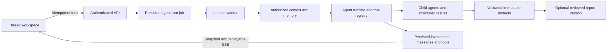

# Agent runtime and workspace upgrade

## Audit and implementation plan

The repository is a pnpm/TypeScript monorepo: Next.js App Router frontend/API,
Supabase PostgreSQL/Auth/Storage, and independently leased durable workers.
Existing conversations already contain multiple messages and analysis runs.
The agent-v1 DAG preserves deterministic data, comparison and chart computation,
grounded interpretation, immutable artifact checkpoints, reviewer gating, report
publication and PDF exports. Existing chat capabilities reauthorize references
before provider planning; no browser snapshot establishes access rights.

The previous workspace had a task rail, report dashboard and durable job polling.
Its synchronous chat SSE was request-bound and was not a replayable durable run
stream. Agent invocation records existed, but team communication, tools, durable
thread context and retrieval memory needed first-class integration.

Implementation sequence:

1. Extend existing contracts and persistence without duplicating conversations,
   runs or artifacts; preserve tenant checks and immutable report publication.
2. Add reusable agent definitions, controlled child invocations, message bus,
   validated tool execution and a centralized MCP adapter.
3. Add authorized thread/message context resolution, bounded three-layer memory
   retrieval and explicit instruction/data trust boundaries.
4. Add snapshot plus replayable GET SSE independent of browser lifetime.
5. Adapt the workspace around agents, conversation, active context and a compact
   Run/Evidence/Context inspector.
6. Test runtime integration, permissions, context, stream replay/cancellation and
   frontend behavior; run repository tests, typecheck and production build.

Existing uncommitted design, mascot, layout and workspace changes are preserved.
No deployment or Git commit is part of this task.

## Implemented architecture

The existing modular backend, PostgreSQL persistence and leased workers remain
the execution platform. No new queue, database, workflow service or provider SDK
was introduced. `conversations` are the thread entity; they continue to contain
multiple turns, runs and artifacts. Agent definitions are reusable workers and
do not own reports.

### Runtime, collaboration and tools

- `agents/src/runtime/team/definitions.ts` supplies the Main, Data, Compare,
  Insight, Chart, Report, Reviewer and existing Analyst definitions. The runtime
  registers definitions and permissions rather than assuming a fixed agent count.
- `TeamRuntime` validates invocation inputs, builds invocation context, enforces
  allowed delegates and invokes children through `ToolRegistry`. Parent step
  keys form the persisted execution hierarchy.
- `AgentMessageBus` stores task requests and results with sender, recipient,
  parent invocation, correlation ID and evidence/artifact references. These are
  actual execution records, not UI-authored simulated progress.
- The `analysis-v1` workflow retains its validated deterministic stages. Data
  executes before independent Compare, Chart and Analyst branches. Insight
  requests supporting metrics from a nested Data invocation and verifies the
  returned claims before continuing. Report drafting, Reviewer checks, bounded
  revision and immutable publication retain the existing evidence gates.
- `ToolRegistry` validates input/output schemas, applies agent allowlists and
  durable execution authorization, handles cancellation/timeouts, normalizes
  results and records tool lifecycle. Large results require an existing artifact
  or raw-result reference; structured payloads are removed from oversized
  context projections rather than truncating JSON.
- Default team limits are depth 6, 40 invocations, 30 delegations, 6 calls per
  agent, 80 tool calls and 10 minutes per execution. Existing chat planning stays
  bounded to 3 capability calls and one new analysis per turn. These limits are
  server-owned and cannot be raised by model output.
- Durable admission now covers general chat turns as well as inventory analysis.
  The worker resumes the accepted persisted request, avoiding a second admission
  or duplicate run on browser reconnect. General read turns use durable job
  invocation records; analysis work additionally has the detailed team tree.
- Data, Compare, Chart, Analyst and Insight can execute bounded specialist
  workflows that finish with their validated artifact. Only required dependency
  agents run; there is no report draft/reviewer/publication for these tasks.
  Completion verifies required stages, recursive artifact hashes and validations
  before terminalizing the run and resuming its durable chat job. The selected
  report stays available while the resulting artifact becomes active context.

### Durable snapshots and SSE

`src/frontend/src/server/durable-event-stream.ts` serves a read-only subscription
to persisted execution. A browser disconnect stops subscription polling, not
the worker. Refresh loads the saved snapshot and resumes observation.

| Endpoint beneath `/api/v1` | Purpose |
| --- | --- |
| `GET /agent-definitions?org_id=…` | Authorized public agent registry; instructions are redacted |
| `GET/PUT /conversations/:id/context?org_id=…` | Read/update validated thread context |
| `GET /conversations/:id/memory?org_id=…` | Bounded authorized memory summaries |
| `GET /runs/:id/runtime?org_id=…&after=…` | Current activity records and an ordered event page |
| `GET /runs/:id/events?org_id=…&after=…` | Snapshot, runtime events, heartbeat and terminal SSE |
| `GET /agent-turn-jobs/:id/events?org_id=…&after=…` | Snapshot and execution events for durable chat jobs |

Streams accept a numeric `Last-Event-ID` or `after` cursor. Database sequences
are allocated under the run lock, replay is ordered and duplicate sequences are
ignored. Terminal streams drain remaining event pages before closing. Every
poll reauthorizes access; failures expose a generic error without database or
worker internals. Defaults: 750 ms polling, 15 s heartbeats and 55 s reconnectable
HTTP lifetime. Browser hooks retain polling fallback and clean up subscriptions.

`GROK_SSE_ENABLED` now defaults to true. Existing durable admission stays enabled.
The old request-bound POST stream falls back to JSON admission for durable
turns; subsequent observation uses GET streams. Structured, evidence-validated
answers are delivered as completed records rather than unvalidated token text.

### Context, instruction hierarchy and memory

`ContextResolver` reauthorizes every reference in this precedence:

1. Explicit message references.
2. A selected report or artifact in the workspace snapshot.
3. An artifact in the message being replied to.
4. Persisted thread context.
5. Bounded relevant memory added by the context builder.

Thread context contains dataset IDs, active artifact/report IDs, the current run
and additional referenced artifact IDs. Message references support datasets,
reports, artifacts and existing imported files. Multiple message attachments
remain separate; the resolver does not invent a primary report. Explicit report
attachments can compare periods; stale default selections cannot bypass the
requested scope/date checks. An ambiguous report update requires a selection.

The existing public-artifact, exact-evidence-path and tenant checks remain the
authorization boundary. Selecting an authorized artifact from another thread
does not retrieve that other thread's working memory. Private drafts and review
artifacts are excluded from public context references.

`MemoryRetriever` uses three persisted layers:

- Working: compact completed tool results for the current run, with 24-hour expiry.
- Episodic: completed analysis/report summaries scoped to the current thread.
- Workspace: tenant-scoped reusable knowledge, written through the authorized
  repository API. Run creation seeds canonical snapshot-schema fields, semantic
  version and the organization's configured inventory threshold automatically.

Retrieval ranks bounded candidates by task terms, current work and recency. It
returns at most 8 items from 24 candidates, within a conservative token estimate.
Candidate retrieval and selection retain representation from all available
layers so recent tool calls cannot crowd out the schema or prior outcomes.
This is text/metadata retrieval; no vector database is needed or claimed.

The team context builder caches authorized run/thread/message reads within one
execution and retrieves fresh working memory for each invocation. It prioritizes
task, identity, allowed tools and explicit references before recent conversation
and older memory, with a 6,000-token estimated budget. It reports build duration
and estimated size in runtime records. The estimate is UTF-8 bytes divided by 3,
not an exact provider tokenizer measurement.

Insight narration receives this bounded context and a cancellation signal. Its
provider output still selects exact supplied claim IDs; context does not permit
invented measurements. Deterministic agents use their validated typed evidence
inputs directly rather than asking a model to recompute metrics.

Platform instructions precede workspace instructions, agent instructions and the
current task. Retrieved messages, files, memory and tool output are explicitly
untrusted data. Provider planning/composition retain the bounded capability and
grounding model. Hidden reasoning, system instructions and credentials are not
included in public activity output.

### MCP gateway

`agents/src/runtime/team/mcp-gateway.ts` owns configured servers, credential-store
references, connection reuse, tool discovery, health and cleanup. Allowed tools
are normalized into the same `ToolRegistry` using validated JSON schemas. Each
run registry receives its own tool registrations while the gateway can reuse a
session. Failed connections are invalidated, subsequent calls reconnect, and
late connections are closed after cancellation.

The gateway is an adapter interface tested with an in-process MCP session. No
external MCP server, transport implementation or credential is configured by
this change. Production integrations must supply `connect` and an authorized
raw-result storage/normalization adapter. Scope a gateway instance to the
workspace/server credential configuration; never share tenant credentials
through a process-global unscoped singleton.

### Artifacts and report versions

Reports remain immutable validated artifacts. `report_versions` adds a lineage
ID, integer version, parent report and originating thread. Updating a selected
report publishes the next version of that lineage; creating a separate report
starts a new lineage at version 1. Publication never edits the previous report.

The update target is pinned in the accepted user-message context, so changing
the sidebar while a run executes cannot redirect publication. Lineage locking
serializes version allocation. Explicit new/update intent is preserved on retries.
Successful publication updates the thread's active report/artifact and writes
its compact episodic summary.

The Compare specialist can compare exactly two explicitly attached authorized
reports. It matches available metrics by key, unit and currency, calculates
exact decimal absolute deltas and retains both reports' metric evidence paths.
The composer permits these explicitly selected runs while retaining its normal
single-run grounding checks for unrelated requests.

### Agent workspace

The workspace now gives agents a prominent rail above recent threads. Clicking
an agent or choosing an autocomplete mention changes the recipient in the same
thread. The composer supports multiple report/artifact/dataset references, reply context
and explicit new-report intent. The top area exposes scope/date, report/version,
no-report selection and run status. Dataset selection uses authorized import
manifests as thread/message context; project/date remain the analytics scope.

Meaningful persisted task requests/results appear as compact agent interactions
in the conversation. Tool lifecycle stays in the hierarchical Run inspector.
The inspector has Run, Evidence and Context tabs, supports desktop collapse and
responsive drawers, and shows actual execution status, duration, evidence and
memory metadata. Cancellation remains accessible on mobile.

Artifact-bearing messages have a Reply action with a removable composer chip.
Reply context overrides the outgoing selection without mutating thread defaults;
explicit attachments still take precedence. The Context inspector also allows a
validated artifact to become the active thread artifact.

The frontend preserves existing report/dashboard/export behavior, design-system
components and the user's pending visual changes. Controls were compacted after
browser screenshot review so they leave room for the conversation on mobile.

## Persistence and rollout

Migration: `src/backend/supabase/migrations/20260926082635_agent_workspace_runtime.sql`.
The matching declarative source is `schemas/010_agent_workspace_runtime.sql`.

The migration extends existing conversations/runs and adds `runtime_activities`,
`runtime_activity_events`, `agent_memory` and `report_versions`. Runtime records
have tenant/run keys; events and report versions are immutable. Tenant-scoped
foreign keys, indexes and RLS protect reads. Runtime writes use existing worker
leases and actor authorization; cancellation terminalizes active runtime records.
Memory writes remain restricted to owner/analyst repository operations.

Apply this migration through the repository's normal Supabase migration process
before deploying the matching API and worker. The durable schema readiness check
requires the new tables. This implementation has **not** applied a migration to
the linked remote project. Local Supabase/Docker integration checks cannot run
while the Docker Desktop engine is stopped; SQL behavior is tested with PGlite.

## Performance and reliability

- Independent analytics branches remain parallel; only dependency-bound stages
  wait for predecessors.
- Team context caches execution-local immutable reads and bounds memory/results.
- Runtime record transactions already validate tenant and lease ownership;
  redundant separate lease-check transactions were removed from that adapter.
- Public SSE subscriptions are bounded and reconnectable, with ordered replay and
  backpressure checks. They never create runs or invoke models.
- Retry/idempotency and worker fencing remain the side-effect boundary. Runtime
  events use stable step keys and cancellation wins over obsolete worker writes.

## Validation status

Validation on 2026-09-26:

- The complete repository suite ran 391 tests across 71 files: 387 passed and
  4 failed. After final source/schema corrections, all four affected files were
  rerun against current code: **22 tests passed**, including every failing case.
  The original nonzero result is retained rather than presented as a clean
  single full-suite run. No known test failures remain.
- The complete run includes the real database-backed team workflow, nested
  Insight → Data interaction, persisted tools/messages, evidence-grounded
  artifacts, reviewed publication, report lineage, cancellation and lease fencing.
  It also includes report-free Data and Insight worker scenarios that resume
  durable jobs without running report/reviewer stages.
- Provider context, memory diversity, explicit prior-period artifact context and
  generated schema compatibility are covered by the successful focused rerun.
- After the final runtime/provider changes, the worker integration file was run
  again: **5 of 5 passed** in 101 seconds, covering the two report-free specialist
  scenarios and three durable workflow scenarios. No code changed afterward.
- Repository typecheck passed across all 8 packages and the backend test project.
  Production build passed. Security/RLS/schema parity, architecture imports and
  documentation-link checks passed. Import cycles were removed by extracting
  shared options and neutral context-reference/runtime-event helpers.
- Browser fixture QA passed without page errors, unexpected API routes,
  horizontal overflow or overlapping timeline sections at 1600, 1024, 390 and
  320 px. Checks cover same-thread recipient selection, persisted no-report and
  imported dataset context, Reply/clear, desktop collapse and mobile drawer.
- Focused streaming checks cover replay, reconnect cleanup, rejected response
  cleanup and protection against delayed polling regressing newer terminal state.

Raw logs, exit codes, full-suite JSON, focused-rerun JSON, screenshots and the
reproducible browser script are saved under `artifacts/runtime-upgrade/`.
PGlite workflow suites should run sequentially; overlapping suites caused heavy
timeouts during an earlier attempt. No production latency benchmark is claimed.

Browser QA uses synthetic fixtures produced by the real database-backed workflow
and intercepted API routes. It validates rendered behavior but does not replace
a deployed authenticated browser/worker/Supabase integration check.

## Important implementation paths

- `src/backend/packages/contracts/src/runtime/workspace.ts`
- `src/backend/packages/agents/src/runtime/team/`
- `src/backend/packages/agents/src/runtime/context/`
- `src/backend/packages/agents/src/analysis-v1/team-workflow.ts`
- `src/backend/packages/db/src/repositories/workspace-repository.ts`
- `src/backend/packages/db/src/transactions/publish-reviewed-draft.ts`
- `src/backend/worker/src/agent-turn-dispatcher.ts`
- `src/frontend/src/server/api/routes/runtime-workspace.ts`
- `src/frontend/src/server/durable-event-stream.ts`
- `src/frontend/src/features/agent-chat/hooks/use-run-runtime.ts`
- `src/frontend/src/features/grok-workspace/components/runtime-tree.tsx`
- `src/frontend/src/features/grok-workspace/components/thread-context-controls.tsx`

## Current boundaries

The runtime is extensible, but the implemented business domain remains the
repository's inventory analytics and validated artifacts. Generic revenue data,
arbitrary file analysis and external MCP services require their own ingestion,
semantic/tool adapters and authorization. Imported file references identify
existing authorized import manifests; they do not grant arbitrary filesystem
access. Report updates rerun the validated report pipeline; natural-language
pixel-level edits to a specific chart are not a separate editing engine.

No commits, push or deployment are included in this development task.
