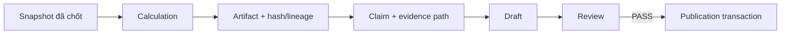

# Bằng chứng và validation

Chỉ số bắt đầu từ snapshot đã chọn cho run; `semantic` tính deterministic metric/comparison. Stage tạo artifact có `content_hash`, `input_refs`, `snapshot_refs`, `source_refs` và validation record. Claim phải trỏ đến giá trị cụ thể trong artifact; `bindClaims` kiểm metric key, evidence path và value. Insight narrative được phép diễn giải, nhưng không được đổi claim/bằng chứng đã kiểm.

Report Draft và Review Result được domain validator kiểm độc lập: schema, hash, tenant, lineage, metric/chart/scope, giới hạn và liên kết đúng revision. Reviewer chỉ có thể yêu cầu correction định trước, không tự cấp quyền publish. Transaction publication kiểm lại draft/review `PASS` và run fence trước khi ghi report. Nếu validation hỏng, stage/run thất bại, không có report thành công.

Điều này cần thiết vì câu chữ do provider sinh có thể hợp lý nhưng sai số, sai nguồn hoặc sai scope. Code mapping: `src/backend/packages/domain/src/analysis/claim-binding.ts`, `src/backend/packages/domain/src/artifacts/integrity.ts`, `src/backend/packages/domain/src/workflow-validation`, `src/backend/packages/agents/src/analysis-v1/stages/publication.ts`. Xem [artifacts](../platform/artifacts.md).
