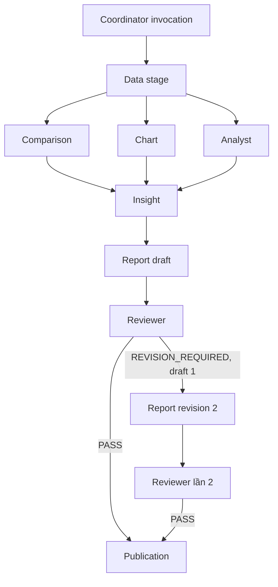

# Điều phối agent

`TeamRuntime` đăng ký agent từ `ANALYSIS_AGENT_DEFINITIONS`, kiểm input schema, giới hạn số invocation/delegation/độ sâu và cấm cycle. `requestAgent()` tạo child invocation, message request/result và tool call có correlation key. Coordinator là agent có quyền gọi các specialist trong full run. Insight có thể gọi Data để lấy evidence đã xác minh; các stage ghi checkpoint/artifact, không chỉ trả text.

Mỗi agent chỉ nhận operation phù hợp: Data nhận yêu cầu evidence, Report nhận yêu cầu sửa draft, các specialist khác nhận `execute`. Data truy vấn và dựng metric từ snapshot đã ghim; Comparison kiểm các chênh lệch; Insight tổng hợp evidence; Report dựng draft; Reviewer đưa ra quyết định có cấu trúc. Skill của use case được chọn trước khi dựng ngữ cảnh cho các agent.

`agent-v1` có DAG stage cố định. Sau Data, Comparison/Chart/Analyst được chạy song song và Insight chờ đủ kết quả. Reviewer có tối đa hai lần review gắn với draft revision 1/2. Nếu lần hai vẫn yêu cầu sửa, run thất bại với `REVIEW_REVISION_LIMIT`; publication chỉ chạy khi `PASS`. Câu hỏi chat ban đầu được Agent Runtime định tuyến theo policy/plan và có thể tạo run qua capability `create_analysis`.

Code mapping: `src/backend/agents/analysis/dag.ts`, `src/backend/agents/analysis/team-workflow.ts`, `src/backend/agents/runtime/team/executor.ts`, `src/backend/agents/analysis/workflow.ts`. Xem [analysis workflow](../workflows/analysis-workflow.md).
