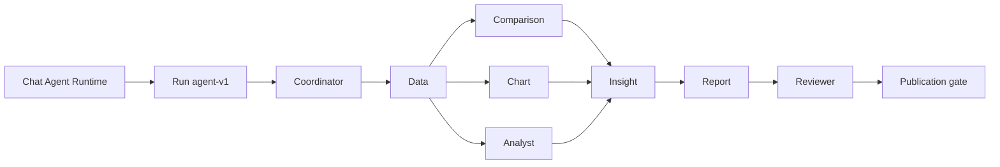

# Hệ thống agent

**Implemented.** Có hai lớp: Agent Runtime xử lý một lượt chat bằng plan/capability; Team Runtime thực hiện run `agent-v1` qua các agent có định nghĩa và tool được phép. Team không phải nhiều process riêng: các agent là invocation trong worker, dùng chung repository và checkpoint.

Coordinator điều phối full report run. Data cung cấp metric đã xác minh; Comparison, Chart và Analyst xử lý các nhánh có thể chạy song song; Insight tổng hợp claim có evidence; Report dựng draft; Reviewer kiểm tra trước publication. Specialist run có thể dừng ở artifact của Data/Comparison/Chart/Analyst/Insight mà không tạo report. Endpoint agent definitions còn đưa thông tin vai trò cho UI.

Code mapping: `src/backend/agents/runtime/team/definitions.ts`, `src/backend/agents/analysis/team-workflow.ts`, `src/backend/agents/runtime/agent-runtime.ts`. Xem [orchestration](orchestration.md), [Coordinator](roles/orchestrator.md), [Chart](roles/chart-agent.md) và [Analyst](roles/analyst-agent.md).
