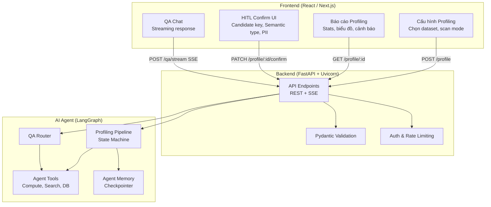
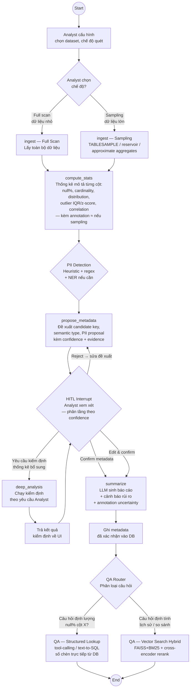
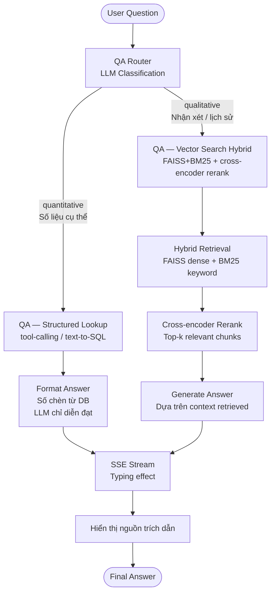
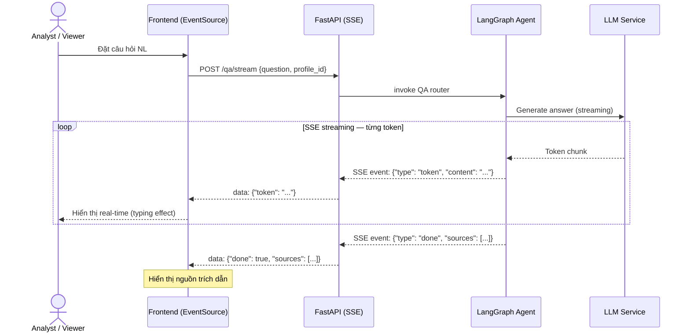
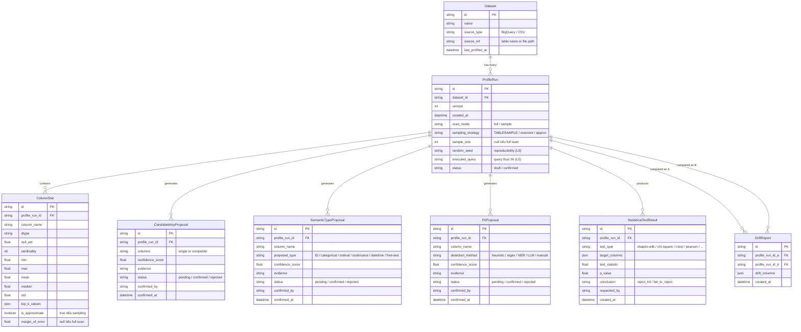
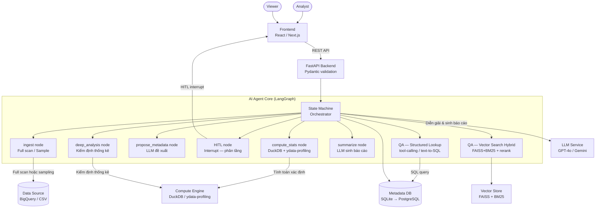
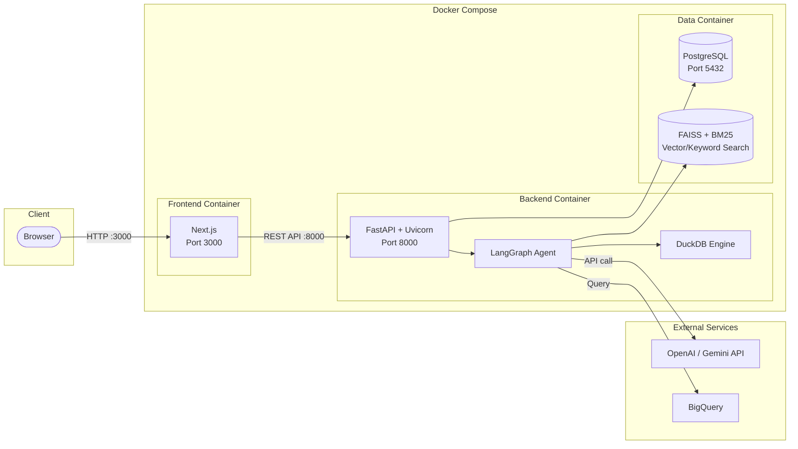

# Agent Architecture — AI Data Profiling Agent

Tài liệu kiến trúc kỹ thuật chi tiết cho hệ thống **AI Agent Data Profiling & Tự sinh hồ sơ dữ liệu**. Thiết kế dựa trên 9 sub-skill kiến trúc AI Agent, áp dụng cho bài toán: tự động profiling dataset, sinh báo cáo hồ sơ dữ liệu kèm nhận xét & cảnh báo rủi ro bằng ngôn ngữ tự nhiên, HITL xác nhận metadata, và trả lời câu hỏi NL về dữ liệu.

**Tham chiếu:**
- [project_context.md](./project_context.md) — Bối cảnh & yêu cầu dự án
- [ADR_v1.md](./ADR/ADR_v1.md) — Các quyết định kiến trúc (ADR-001 → ADR-010)

---

## Mục lục

1. [Kiến trúc 3 tầng (Skill 01)](#1-kiến-trúc-3-tầng)
2. [State Machine — LangGraph (Skill 02)](#2-state-machine--langgraph)
3. [Agent State Schema (Skill 03)](#3-agent-state-schema)
4. [Intent Router — QA Router Node (Skill 04)](#4-intent-router--qa-router-node)
5. [Tool Integration (Skill 05)](#5-tool-integration)
6. [Streaming Response — SSE (Skill 06)](#6-streaming-response--sse)
7. [Database & Vector Store (Skill 07)](#7-database--vector-store)
8. [Architecture Diagrams (Skill 08)](#8-architecture-diagrams)
9. [ADR References (Skill 09)](#9-adr-references)
10. [Checklist tổng hợp](#10-checklist-tổng-hợp)

---

## 1. Kiến trúc 3 tầng

> **Nguyên tắc vàng:** AI Agent không bao giờ giao tiếp trực tiếp với người dùng — mọi giao tiếp đều qua Backend.

| Tầng | Công nghệ | Trách nhiệm trong Data Profiling |
|------|-----------|----------------------------------|
| **Frontend** | React / Next.js | UI: cấu hình profiling, xem báo cáo, HITL confirm (candidate key, semantic type, PII), yêu cầu kiểm định bổ sung, QA chat (streaming), biểu đồ phân phối |
| **Backend** | FastAPI + Uvicorn | API server, Pydantic validation, điều phối agent, SSE streaming cho QA, xác thực request, rate limiting |
| **AI Agent** | LangGraph | State machine orchestrate pipeline profiling (8+ nodes): ingest → compute_stats → propose_metadata → HITL → deep_analysis → summarize → QA router (2 nhánh) |



**Nguyên tắc áp dụng:**
- **Separation of Concerns** — Frontend chỉ hiển thị & thu thập input; Backend validate và điều phối; Agent tập trung reasoning & compute.
- **Scalability** — Agent là bottleneck (LLM call + compute), có thể scale riêng bằng worker pool.
- **Technology Flexibility** — Đổi LLM provider (GPT-4o ↔ Gemini) không ảnh hưởng Frontend; đổi data source (BigQuery ↔ CSV) không ảnh hưởng Backend.

---

## 2. State Machine — LangGraph

### Tại sao State Machine, không phải Chain?

| | Chain (LangChain LCEL) | State Machine (LangGraph) |
|---|---|---|
| Luồng xử lý | Tuyến tính: A → B → C | Có điều kiện, có loop |
| HITL Interrupt | ❌ | ✅ native interrupt/resume |
| Vòng lặp (HITL ↔ deep_analysis) | ❌ | ✅ |
| Conditional routing (QA 2 nhánh) | ❌ | ✅ conditional edges |
| Phù hợp cho | Task đơn giản | Pipeline profiling multi-step |

> **Quyết định:** Chọn LangGraph — xem [ADR-001](./ADR/ADR_v1.md#adr-001-chọn-langgraph-làm-agent-orchestration-framework).

### Agent Flow — Profiling Pipeline

Agent lặp lại pattern **Suy nghĩ → Hành động → Quan sát** thông qua state machine:



### LangGraph Implementation Skeleton

```python
from langgraph.graph import StateGraph, END
from langgraph.checkpoint.postgres import PostgresSaver

# Graph definition
graph = StateGraph(ProfilingAgentState)

# Add nodes
graph.add_node("ingest", ingest_node)
graph.add_node("compute_stats", compute_stats_node)
graph.add_node("propose_metadata", propose_metadata_node)
graph.add_node("hitl_review", hitl_review_node)          # interrupt point
graph.add_node("deep_analysis", deep_analysis_node)
graph.add_node("summarize", summarize_node)
graph.add_node("qa_router", qa_router_node)
graph.add_node("qa_structured", qa_structured_node)
graph.add_node("qa_vector", qa_vector_node)

# Set entry point
graph.set_entry_point("ingest")

# Linear edges
graph.add_edge("ingest", "compute_stats")
graph.add_edge("compute_stats", "propose_metadata")
graph.add_edge("propose_metadata", "hitl_review")

# HITL conditional edges — phân nhánh theo phản hồi Analyst
graph.add_conditional_edges(
    "hitl_review",
    route_hitl_decision,
    {
        "confirm": "summarize",
        "reject": "propose_metadata",
        "request_test": "deep_analysis",
    }
)

# Deep analysis loop back to HITL
graph.add_edge("deep_analysis", "hitl_review")

# Post-summarize flow
graph.add_edge("summarize", "qa_router")

# QA routing — conditional edges
graph.add_conditional_edges(
    "qa_router",
    classify_question_type,
    {
        "quantitative": "qa_structured",
        "qualitative": "qa_vector",
    }
)

graph.add_edge("qa_structured", END)
graph.add_edge("qa_vector", END)

# Compile with PostgreSQL checkpointer for HITL persistence
checkpointer = PostgresSaver.from_conn_string(DATABASE_URL)
agent = graph.compile(checkpointer=checkpointer, interrupt_before=["hitl_review"])
```

> 🔑 Mỗi node là một hàm nhận `state`, xử lý, và trả về `state` mới. Graph tự quản lý thứ tự thực thi. Checkpointer gắn PostgreSQL để giữ state qua restart — quan trọng vì HITL có thể kéo dài vài ngày.

---

## 3. Agent State Schema

`ProfilingAgentState` là "túi dữ liệu" truyền giữa tất cả node trong graph. Thiết kế phản ánh đặc thù pipeline profiling + HITL + QA.

```python
from typing import TypedDict, Annotated, Literal
from dataclasses import dataclass
import operator


class ProfilingAgentState(TypedDict):
    """State schema cho Data Profiling Agent — dữ liệu truyền giữa các node."""

    # --- Session & Config ---
    messages: Annotated[list, operator.add]  # Lịch sử tin nhắn (auto-append)
    dataset_ref: str                          # Reference đến dataset (table name / file path)
    scan_mode: Literal["full", "sample"]      # Chế độ quét do Analyst chọn
    sampling_config: dict | None              # Strategy, sample_size, random_seed (null nếu full)

    # --- Ingest Output ---
    dataframe_ref: str                        # Reference/path tới dataframe đã load (DuckDB table)
    row_count: int                            # Số dòng thực tế (sau sampling nếu có)
    column_names: list[str]                   # Danh sách tên cột

    # --- Compute Stats Output ---
    stats_json: dict                          # Per-column stats: null%, cardinality, distribution, outlier...
    correlation_matrix: dict                  # Ma trận tương quan
    pii_flags: list[dict]                     # PII detection results (heuristic + regex)
    is_approximate: bool                      # True nếu chạy sampling — marker uncertainty

    # --- Proposals ---
    candidate_key_proposals: list[dict]       # Đề xuất candidate key kèm confidence + evidence
    semantic_type_proposals: list[dict]       # Đề xuất semantic type kèm confidence + evidence
    pii_proposals: list[dict]                 # Đề xuất PII kèm detection_method + confidence + evidence

    # --- HITL ---
    hitl_decision: Literal["confirm", "edit", "reject", "request_test"] | None
    confirmed_proposals: list[dict]           # Proposals đã được Analyst confirm/edit
    rejected_proposals: list[dict]            # Proposals bị reject

    # --- Deep Analysis ---
    test_requests: list[dict]                 # Yêu cầu kiểm định từ Analyst (test_type, columns, params)
    test_results: list[dict]                  # Kết quả kiểm định (statistic, p_value, conclusion)
    deep_analysis_count: int                  # Số lần chạy deep analysis (giới hạn infinite loop)

    # --- Summarize Output ---
    narrative_report: str                     # Báo cáo NL đã sinh
    risk_warnings: list[str]                  # Cảnh báo rủi ro chất lượng dữ liệu

    # --- QA ---
    question: str                             # Câu hỏi NL từ user
    question_type: Literal["quantitative", "qualitative"] | None
    qa_context: list[str]                     # Context retrieved cho QA
    answer: str                               # Câu trả lời cuối cùng
    answer_sources: list[dict]                # Nguồn trích dẫn (column, metric, profile_run)

    # --- Control ---
    tool_calls: int                           # Số lần gọi tools (giới hạn infinite loop)
    error: str | None                         # Error message nếu có
```

### Checklist thiết kế State

- [x] `messages` dùng `Annotated[list, operator.add]` để auto-append, không ghi đè.
- [x] `tool_calls` và `deep_analysis_count` đếm số lần gọi tools/kiểm định để tránh infinite loop.
- [x] Có flag/field để điều hướng trong `conditional_edges`: `hitl_decision`, `question_type`, `scan_mode`.
- [x] Có context accumulator (`qa_context`, `test_results`) để tích lũy thông tin từ tools.
- [x] Có field `answer` và `narrative_report` riêng, tách biệt intermediate state khỏi final output.
- [x] `is_approximate` marker cho uncertainty annotation — truyền xuyên suốt từ `compute_stats` đến `summarize`.
- [x] `sampling_config` lưu random_seed để hỗ trợ reproducibility (Known Limitation L5).

---

## 4. Intent Router — QA Router Node

QA Router là **cửa ngõ** của module hỏi-đáp: phân loại câu hỏi NL và điều hướng sang nhánh xử lý phù hợp.

> **Quyết định:** Tách QA thành 2 nhánh — xem [ADR-002](./ADR/ADR_v1.md#adr-002-tách-qa-thành-2-nhánh--structured-lookup-và-vector-search-hybrid).

### Bảng phân loại Intent

| Intent | Mô tả | Ví dụ câu hỏi | Node xử lý |
|--------|-------|----------------|-------------|
| `quantitative` | Hỏi số liệu cụ thể từ profiling | "null % cột X là bao nhiêu?", "cardinality cột Y?" | QA — Structured Lookup |
| `qualitative` | Hỏi nhận xét, so sánh, lịch sử | "Dataset này đổi gì so với tháng trước?", "Nhận xét chất lượng?" | QA — Vector Search Hybrid |

### Implementation

```python
def qa_router_node(state: ProfilingAgentState) -> ProfilingAgentState:
    """Phân loại câu hỏi NL và quyết định luồng xử lý QA."""
    question = state["question"]

    classification = llm.invoke(
        f"Phân loại câu hỏi sau về dataset profiling:\n"
        f"'{question}'\n\n"
        f"Nếu câu hỏi hỏi về MỘT SỐ LIỆU CỤ THỂ (null%, cardinality, min, max, "
        f"mean, outlier count, correlation coefficient...) → trả lời 'quantitative'.\n"
        f"Nếu câu hỏi hỏi nhận xét, so sánh, lịch sử, xu hướng, chất lượng tổng thể "
        f"→ trả lời 'qualitative'.\n\n"
        f"Chỉ trả lời 1 từ: quantitative hoặc qualitative."
    )

    question_type = "quantitative" if "quantitative" in classification.lower() else "qualitative"
    return {"question_type": question_type}


def classify_question_type(state: ProfilingAgentState) -> str:
    """Conditional edge function cho QA routing."""
    return state["question_type"]
```

### QA Flow Diagram



> 🔑 **Grounding cho câu hỏi định lượng được đảm bảo bằng kiến trúc:** số được chèn trực tiếp từ DB vào câu trả lời, LLM chỉ format ngôn ngữ — kỳ vọng 100% accuracy.

---

## 5. Tool Integration

### 5.1 Ingest Node — Kết nối & lấy dữ liệu

```python
def ingest_node(state: ProfilingAgentState) -> ProfilingAgentState:
    """Kết nối data source, load dữ liệu theo scan_mode."""
    dataset_ref = state["dataset_ref"]
    scan_mode = state["scan_mode"]

    if scan_mode == "full":
        df = duckdb.sql(f"SELECT * FROM '{dataset_ref}'").df()
    else:
        config = state["sampling_config"]
        strategy = config.get("strategy", "reservoir")
        sample_size = config.get("sample_size", 10000)

        if strategy == "tablesample":
            df = duckdb.sql(
                f"SELECT * FROM '{dataset_ref}' TABLESAMPLE {sample_size} ROWS"
            ).df()
        else:  # reservoir sampling
            df = duckdb.sql(
                f"SELECT * FROM '{dataset_ref}' USING SAMPLE {sample_size}"
            ).df()

    return {
        "dataframe_ref": dataset_ref,
        "row_count": len(df),
        "column_names": list(df.columns),
        "tool_calls": state["tool_calls"] + 1,
    }
```

### 5.2 Compute Stats Node — Tính toán thống kê xác định

```python
def compute_stats_node(state: ProfilingAgentState) -> ProfilingAgentState:
    """Tính thống kê mô tả từng cột bằng DuckDB + ydata-profiling.
    LLM KHÔNG tự tính — mọi số liệu do compute engine sinh."""
    is_sampling = state["scan_mode"] == "sample"

    # DuckDB compute stats
    stats = compute_column_stats(state["dataframe_ref"])  # null%, cardinality, min/max/mean/median/std
    correlation = compute_correlation_matrix(state["dataframe_ref"])
    outliers = detect_outliers_iqr_zscore(state["dataframe_ref"])

    # PII detection (heuristic + regex)
    pii_flags = detect_pii(state["column_names"], state["dataframe_ref"])

    # Gắn uncertainty markers nếu sampling
    if is_sampling:
        for col_stat in stats.values():
            col_stat["is_approximate"] = True
            col_stat["margin_of_error"] = estimate_margin_of_error(
                col_stat, state["row_count"]
            )

    return {
        "stats_json": stats,
        "correlation_matrix": correlation,
        "pii_flags": pii_flags,
        "is_approximate": is_sampling,
        "tool_calls": state["tool_calls"] + 1,
    }
```

### 5.3 Propose Metadata Node — Đề xuất kèm confidence + evidence

```python
def propose_metadata_node(state: ProfilingAgentState) -> ProfilingAgentState:
    """LLM đề xuất candidate key, semantic type, PII — kèm confidence + evidence."""
    stats = state["stats_json"]

    # Candidate key: dựa trên uniqueness ratio + null%
    ck_proposals = propose_candidate_keys(stats)

    # Semantic type: LLM classification dựa trên column name + stats + sample values
    st_proposals = propose_semantic_types(stats)

    # PII proposals: nâng từ pii_flags thành proposal entity (ADR-003)
    pii_proposals = create_pii_proposals(state["pii_flags"])

    return {
        "candidate_key_proposals": ck_proposals,
        "semantic_type_proposals": st_proposals,
        "pii_proposals": pii_proposals,
        "tool_calls": state["tool_calls"] + 1,
    }
```

### 5.4 Deep Analysis Node — Kiểm định thống kê theo yêu cầu

```python
def deep_analysis_node(state: ProfilingAgentState) -> ProfilingAgentState:
    """Chạy kiểm định thống kê bổ sung theo yêu cầu Analyst tại bước HITL."""
    test_requests = state["test_requests"]
    results = []

    for request in test_requests:
        test_type = request["test_type"]
        columns = request["columns"]

        if test_type == "shapiro_wilk":
            result = run_shapiro_wilk(columns[0])
        elif test_type == "chi_square":
            result = run_chi_square(columns[0], columns[1])
        elif test_type == "t_test":
            result = run_t_test(columns[0], columns[1])
        elif test_type == "pearson":
            result = run_pearson_correlation(columns[0], columns[1])
        # ... thêm kiểm định khác

        results.append({
            "test_type": test_type,
            "target_columns": columns,
            "test_statistic": result.statistic,
            "p_value": result.pvalue,
            "conclusion": "reject_h0" if result.pvalue < 0.05 else "fail_to_reject",
        })

    return {
        "test_results": state["test_results"] + results,
        "deep_analysis_count": state["deep_analysis_count"] + 1,
        "tool_calls": state["tool_calls"] + 1,
    }
```

### 5.5 QA Tools

**Structured Lookup** — truy vấn trực tiếp DB:

```python
def qa_structured_node(state: ProfilingAgentState) -> ProfilingAgentState:
    """Câu hỏi định lượng: lấy số trực tiếp từ ColumnStat DB."""
    question = state["question"]

    # Tool-calling: LLM sinh function call get_stat(column, metric)
    # hoặc text-to-SQL sinh query ColumnStat
    stat_value = db_tool.get_stat(question)  # Số từ DB, không qua LLM generate

    # LLM chỉ format câu trả lời — số đã có sẵn
    answer = llm.invoke(
        f"Trả lời câu hỏi: '{question}'\n"
        f"Dữ liệu: {stat_value}\n"
        f"Chỉ diễn đạt lại bằng ngôn ngữ tự nhiên, KHÔNG tự tính số mới."
    )

    return {
        "answer": answer,
        "answer_sources": [stat_value],
        "tool_calls": state["tool_calls"] + 1,
    }
```

**Vector Search Hybrid** — FAISS + BM25 + rerank:

```python
def qa_vector_node(state: ProfilingAgentState) -> ProfilingAgentState:
    """Câu hỏi định tính: hybrid retrieval từ lịch sử profiling."""
    question = state["question"]

    # FAISS dense search
    dense_results = faiss_index.similarity_search(question, k=10)

    # BM25 keyword search
    keyword_results = bm25_index.search(question, k=10)

    # Merge + cross-encoder rerank
    merged = merge_results(dense_results, keyword_results)
    reranked = cross_encoder.rerank(question, merged, top_k=5)

    # LLM generate answer dựa trên context
    context = [doc.page_content for doc in reranked]
    answer = llm.invoke(
        f"Trả lời câu hỏi: '{question}'\n"
        f"Context: {context}\n"
        f"Chỉ trả lời dựa trên context, ghi rõ nguồn."
    )

    return {
        "answer": answer,
        "qa_context": context,
        "answer_sources": [{"source": doc.metadata} for doc in reranked],
        "tool_calls": state["tool_calls"] + 1,
    }
```

### Giới hạn tool calls — tránh infinite loop

```python
MAX_TOOL_CALLS = 10
MAX_DEEP_ANALYSIS = 5  # Giới hạn số lần kiểm định / session

def should_force_stop(state: ProfilingAgentState) -> bool:
    """Kiểm tra giới hạn để tránh infinite loop & cost vô hạn."""
    if state["tool_calls"] >= MAX_TOOL_CALLS:
        return True
    if state["deep_analysis_count"] >= MAX_DEEP_ANALYSIS:
        return True
    return False
```

---

## 6. Streaming Response — SSE

> **Quyết định:** Chọn SSE thay vì WebSocket — xem [ADR-010](./ADR/ADR_v1.md#adr-010-sse-server-sent-events-cho-qa-streaming-response).

Streaming hiển thị từng token ngay khi có (thay vì đợi 2–10s) — tạo trải nghiệm "typing effect" giống ChatGPT.

### Backend (FastAPI SSE)

```python
from fastapi import FastAPI
from fastapi.responses import StreamingResponse
from typing import AsyncGenerator
import json

@app.post("/api/v1/qa/stream")
async def qa_stream(request: QARequest) -> StreamingResponse:
    """QA endpoint với SSE streaming response."""
    async def generate() -> AsyncGenerator[str, None]:
        async for event in agent.astream_events(
            {"question": request.question, "profile_id": request.profile_id}
        ):
            if event["event"] == "on_llm_stream":
                token = event["data"]["chunk"].content
                yield f"data: {json.dumps({'type': 'token', 'content': token})}\n\n"

            elif event["event"] == "on_tool_end":
                yield f"data: {json.dumps({'type': 'source', 'data': event['data']})}\n\n"

        yield f"data: {json.dumps({'type': 'done', 'sources': sources})}\n\n"

    return StreamingResponse(generate(), media_type="text/event-stream")
```

### SSE Event Format

| Event Type | Payload | Mô tả |
|-----------|---------|-------|
| `token` | `{"type": "token", "content": "..."}` | Từng token/chunk text |
| `source` | `{"type": "source", "data": {...}}` | Metadata nguồn trích dẫn |
| `done` | `{"type": "done", "sources": [...]}` | Kết thúc stream, danh sách nguồn |
| `error` | `{"type": "error", "message": "..."}` | Lỗi giữa stream |

### Data Flow — SSE Streaming



### Checklist Chat Interface "đủ tốt"

- [ ] Nhập câu hỏi NL, nhận câu trả lời.
- [ ] Streaming hiển thị đúng từng token (SSE EventSource).
- [ ] Error message thân thiện (không lộ stack trace).
- [ ] Responsive (mobile & desktop).
- [ ] Loading indicator khi Agent đang xử lý.
- [ ] Auto-scroll xuống tin nhắn mới nhất.
- [ ] Hỗ trợ Markdown rendering (code block, table, bold/italic).
- [ ] Hiển thị nguồn trích dẫn khi stream kết thúc.
- [ ] Cancel request (close EventSource) giữa chừng.

---

## 7. Database & Vector Store

> **Quyết định:** SQLite (dev) → PostgreSQL (prod) — xem [ADR-009](./ADR/ADR_v1.md#adr-009-sqlite-dev--postgresql-prod-cho-metadata-db).
> **Quyết định:** FAISS + BM25 Hybrid — xem [ADR-007](./ADR/ADR_v1.md#adr-007-faiss--bm25-hybrid-retrieval-thay-vì-chromadb-thuần-cho-qa).

### Bảng nhu cầu & lựa chọn

| Nhu cầu | Cần DB? | Loại DB | Lựa chọn |
|---------|---------|---------|----------|
| Lưu ProfileRun, ColumnStat, Proposals | ✅ | SQL (relational) | SQLite (dev) → PostgreSQL (prod) |
| LangGraph checkpointer (HITL persistence) | ✅ | SQL | PostgreSQL (cùng instance) |
| QA Structured Lookup (text-to-SQL) | ✅ | SQL | PostgreSQL (query ColumnStat) |
| QA Vector Search (định tính/lịch sử) | ✅ | Vector + Keyword | FAISS (dense) + BM25 (keyword) |
| Compute Engine (thống kê) | ❌ (in-process) | OLAP | DuckDB (embedded) |
| Memory ngắn hạn (trong session) | ❌ | — | LangGraph built-in state |

### Database Connection Strategy

```python
import os
from sqlalchemy import create_engine

# Dev: SQLite zero-config | Prod: PostgreSQL robust
DATABASE_URL = os.getenv("DATABASE_URL", "sqlite:///./data/app.db")
engine = create_engine(DATABASE_URL)
```

### Vector Store Setup

```python
import faiss
from rank_bm25 import BM25Okapi
from sentence_transformers import CrossEncoder

# FAISS dense index
embedding_model = OpenAIEmbeddings()
faiss_index = FAISS.from_documents(documents, embedding_model)

# BM25 keyword index
tokenized_corpus = [doc.page_content.split() for doc in documents]
bm25_index = BM25Okapi(tokenized_corpus)

# Cross-encoder reranker
reranker = CrossEncoder("cross-encoder/ms-marco-MiniLM-L-6-v2")
```

### Metadata ER Diagram



> 💡 **YAGNI:** ProfileRun đã thêm `random_seed` + `executed_query` theo Known Limitation L5 cho reproducibility. Tuy nhiên đây là enhancement — MVP có thể bắt đầu chỉ với `sampling_strategy` + `sample_size`.

---

## 8. Architecture Diagrams

> Mỗi diagram một ý chính — đặt tên rõ ràng, nhóm bằng `subgraph`, mũi tên rõ hướng dữ liệu.

### 8.1 System Overview — Toàn cảnh hệ thống



### 8.2 Agent Flow Diagram — Chi tiết agentic loop

*(Xem diagram tại [Mục 2 — State Machine](#2-state-machine--langgraph))*

### 8.3 Deployment Architecture — Container & networking



### 8.4 Data Flow — Sequence Diagram

*(Xem sequence diagram chi tiết tại [project_context.md mục 4.3](./project_context.md#43-data-flow--sequence-diagram))*

---

## 9. ADR References

Các quyết định kiến trúc quan trọng đã được ghi nhận trong [ADR_v1.md](./ADR/ADR_v1.md):

| ADR | Tiêu đề | Trạng thái | Skill liên quan |
|-----|---------|------------|-----------------|
| ADR-001 | Chọn LangGraph làm Agent Orchestration Framework | Accepted | Skill 02 — State Machine |
| ADR-002 | Tách QA thành 2 nhánh — Structured Lookup và Vector Search Hybrid | Accepted | Skill 04 — Router |
| ADR-003 | Nâng PII Detection từ Boolean Flag thành Proposal có HITL | Accepted | Skill 03 — State Schema |
| ADR-004 | HITL phân tầng (Tiered Review) | Accepted | Skill 02 — State Machine |
| ADR-005 | DuckDB làm Compute Engine chính cho thống kê | Accepted | Skill 05 — Tool Integration |
| ADR-006 | Chú thích Uncertainty cho số liệu Sampling | Accepted | Skill 03 — State Schema |
| ADR-007 | FAISS + BM25 Hybrid Retrieval thay vì ChromaDB thuần | Accepted | Skill 07 — Vector Store |
| ADR-008 | FastAPI làm Backend Framework | Accepted | Skill 01 — 3 tầng |
| ADR-009 | SQLite (dev) → PostgreSQL (prod) cho Metadata DB | Accepted | Skill 07 — Database |
| ADR-010 | SSE cho QA Streaming Response | Accepted | Skill 06 — Streaming |

> 📝 **Khi nào cần viết ADR mới:** khi thay đổi bất kỳ quyết định nào ở bảng trên, hoặc khi có quyết định mới ảnh hưởng đến kiến trúc (thêm LLM provider, đổi vector store, thay đổi deployment strategy...).

---

## 10. Checklist tổng hợp

### Kiến trúc & Design

- [x] Kiến trúc 3 tầng: Frontend / Backend / AI Agent — tách biệt rõ ràng.
- [x] Agent không giao tiếp trực tiếp với user — mọi giao tiếp qua Backend.
- [x] State Machine (LangGraph) cho pipeline profiling — hỗ trợ conditional edges, loop, interrupt.
- [x] Agent State schema đầy đủ: session config, stats output, proposals, HITL, QA, control fields.
- [x] QA Router phân loại câu hỏi → 2 nhánh (structured lookup vs vector search hybrid).
- [x] HITL phân tầng: auto-confirm (confidence ≥ 95% + low-risk) vs sync confirm.
- [x] PII detection nâng cấp thành PiiProposal entity (ADR-003).

### Tool Integration

- [x] Ingest: full scan / sampling (TABLESAMPLE, reservoir, approximate aggregates).
- [x] Compute Stats: DuckDB + ydata-profiling — compute engine, không LLM tính số.
- [x] Propose Metadata: candidate key + semantic type + PII proposal — kèm confidence + evidence.
- [x] Deep Analysis: kiểm định thống kê theo yêu cầu Analyst (Shapiro-Wilk, Chi-square, T-test...).
- [x] QA Structured: tool-calling / text-to-SQL — số từ DB, LLM chỉ diễn đạt.
- [x] QA Vector: FAISS + BM25 + cross-encoder rerank.
- [x] Giới hạn tool_calls + deep_analysis_count — tránh infinite loop & cost vô hạn.

### Streaming & UX

- [x] SSE streaming cho QA chat — `POST /qa/stream` với `text/event-stream`.
- [x] Event format chuẩn hoá: token / source / done / error.
- [x] Typing effect, loading indicator, auto-scroll, Markdown rendering.

### Database & Storage

- [x] SQLite (dev) → PostgreSQL (prod) cho Metadata DB.
- [x] FAISS + BM25 hybrid cho Vector Store.
- [x] DuckDB embedded cho compute engine.
- [x] PostgreSQL checkpointer cho LangGraph HITL persistence.

### Uncertainty & Governance

- [x] Chú thích ≈ + confidence interval cho số liệu sampling.
- [x] `is_approximate` + `margin_of_error` trong ColumnStat schema.
- [x] PII mask trong báo cáo — query PiiProposal confirmed.
- [x] Quasi-identifier detection — cảnh báo re-identification risk.

### Documentation

- [x] 10 ADRs ghi lại mọi quyết định kiến trúc quan trọng.
- [x] 3 loại Mermaid diagram: System Overview, Agent Flow, Deployment.
- [x] Sequence diagram cho data flow chi tiết.
- [x] ER diagram cho metadata schema.

---

*Tài liệu này là **tài liệu sống** — cập nhật khi kiến trúc thay đổi. Diagram lỗi thời còn nguy hiểm hơn không có diagram.*
