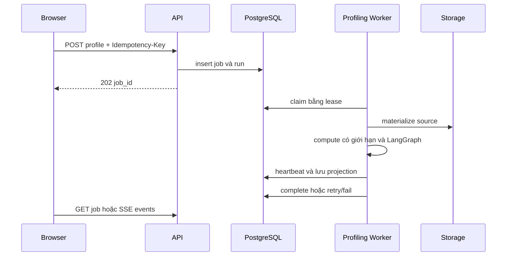

# Profiling Job bất đồng bộ

## Hợp đồng

`POST /api/v1/profile`, `POST /api/v1/datasets/{dataset_id}/profile` và `POST /api/v1/datasets/profile` validate input, kiểm tra workspace ownership, tạo durable job và trả HTTP 202. Profile request đơn yêu cầu `Idempotency-Key`; batch nhận 1–20 dataset id duy nhất và áp dụng idempotency cho từng item. Response có `job_id`, `profiling_run_id`, `status`, `next_action`, `duplicate` và error object an toàn.

Job status là `queued | running | succeeded | failed`. Profile-domain status là `created`, `running`, `pending_review`, `resuming`, `completed`, `failed`; hai field này không thay thế cho nhau.

## Trạng thái và quyền sở hữu

Queue được biểu diễn trong `profile_runs` bằng các field về availability, claim token, worker id, heartbeat, lease, attempt count, error code/message và payload. API tạo row; worker claim và heartbeat; repository complete hoặc fail. Profile result, proposal, test và narrative được lưu trong PostgreSQL.

## Ngữ nghĩa của worker

[`backend/src/workers/profiling_worker.py`](../../backend/src/workers/profiling_worker.py) chạy polling loop. Worker recover stale job theo lease, claim số slot theo concurrency, heartbeat job đang chạy và graceful shutdown. Default là một slot, poll mỗi một giây, lease 300 giây, tối đa ba attempt và shutdown grace 30 giây. `--once` xử lý một job; `--health-port` mở health endpoint.

Lease recovery dẫn tới xử lý at-least-once, không phải exactly-once: worker mất lease có thể bị thay thế sau stale recovery. Idempotency bảo vệ việc tạo request, không biến external read hay model call thành exactly-once. `ProfileError` có thể retry sẽ được đưa lại vào queue tới khi đạt attempt limit; lỗi không retry được hoặc vượt limit chuyển thành `failed` với code/message an toàn.

## Tiến trình SSE

`GET /api/v1/profiling-jobs/{job_id}/events` là SSE projection từ state đã lưu. Event name hiện có `queued`, `profiling`, `resuming`, `review_required`, `ready` và `failed`. Stream gửi event id xác định, keep-alive định kỳ và state gần nhất khi reconnect; không mang raw row hoặc credential. `ready` và `failed` là terminal. Database record, không phải browser stream, là nguồn sự thật.

## Vị trí source code và kiểm chứng

- Queue method: [`backend/src/services/repository.py`](../../backend/src/services/repository.py) (`create_profile_job`, `claim_profile_job`, `heartbeat_profile_job`, `complete_profile_job`, `fail_profile_job`, stale recovery).
- API model và limit: [`backend/src/models/schemas.py`](../../backend/src/models/schemas.py).
- Test worker/API: tìm trong `tests/` với `profiling_worker`, `profiling-jobs`, `idempotency` và `events`.
- Vận hành: [configuration](../operations/configuration.md) và [quan sát/phục hồi lỗi](../operations/observability-and-failure-recovery.md).
