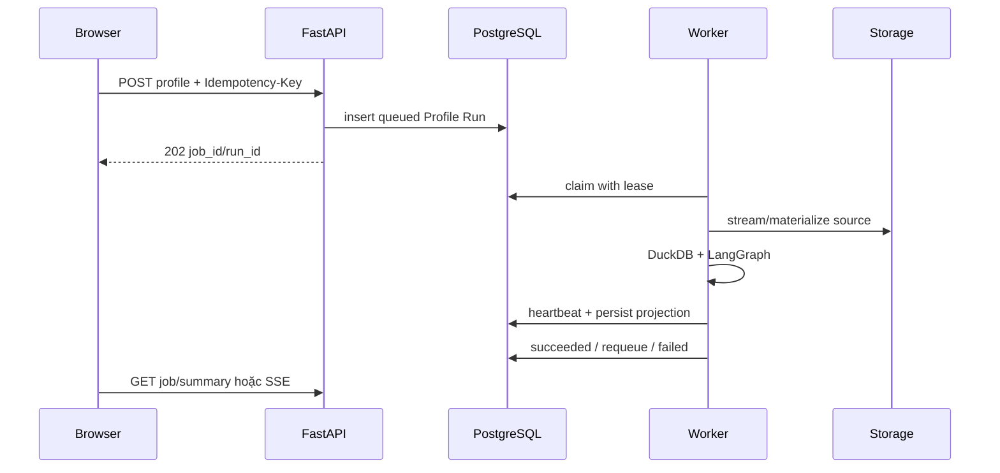

# Profiling Job bất đồng bộ

## Submission contract

Ba endpoint tạo job:

- `POST /api/v1/profile`;
- `POST /api/v1/datasets/{dataset_id}/profile`;
- `POST /api/v1/datasets/profile` cho batch 1–20 dataset ID duy nhất.

Request đơn yêu cầu `Idempotency-Key` dài 8–255 ký tự. API hash request; dùng lại key với cùng payload trả job cũ và đánh dấu duplicate, dùng lại với payload khác trả 409 `idempotency_conflict`. Production chỉ nhận `dataset_id` hoặc stable storage/datasource reference đã được tạo qua API.

API validate quyền/source, insert durable record rồi trả HTTP 202. Nó không chạy profiling trong request.

## Hai state machine

`profile_runs` chứa cả trạng thái job và trạng thái domain:

| Phạm vi | Trạng thái |
| --- | --- |
| Job | `queued`, `running`, `succeeded`, `failed` |
| Profile | `created`, `queued`, `running`, `pending_review`, `resuming`, `completed`, `failed` |

Job có thể `succeeded` khi graph đã dừng an toàn ở `pending_review`; review sau đó tạo resume payload và đưa chính run đó trở lại queue. Vì vậy client phải dùng `next_action`/profile status, không chỉ nhìn job status.

Queue fields gồm availability, attempt/max attempt, claim token, worker ID, start/finish/heartbeat/lease timestamp, error code/message, request hash, correlation ID và resume payload.

## Worker lifecycle

Worker dùng `FOR UPDATE SKIP LOCKED`-style claim trong repository, concurrency process-local có giới hạn và heartbeat theo lease. Default: concurrency 1, poll 1 giây, lease 300 giây, max 3 attempt, shutdown grace 30 giây. `--once` xử lý tối đa một job; `--health-port 8000` mở health server.

Lỗi `ProfileError` retryable được requeue đến max attempt. Lỗi không retryable hoặc vượt limit chuyển `failed` với safe error. Recovery chạy định kỳ cho lease stale và các legacy resume bị orphan. Graceful shutdown ngừng claim mới; task vượt grace để lease hết hạn và được process khác recover.

Ngữ nghĩa là **at-least-once**, không phải exactly-once. Idempotency bảo vệ submission và resume mutation, nhưng external download/model call có thể đã xảy ra trước khi worker mất lease.

## Review và resume

`PATCH /api/v1/profile/{run_id}/confirm` atomically áp dụng decision và, khi `resume=true`, lưu payload + chuyển run sang `resuming`/`queued`. HTTP request không trực tiếp gọi graph. Worker sau đó load checkpoint `profile:{run_id}`, resume bằng `Command`, persist kết quả và complete job mới.

Review hỗ trợ confirm/reject/edit; candidate key không hỗ trợ edit. `request_test` cần 1–20 test spec hợp lệ. Conflict đồng thời hoặc state không đúng trả 409.

## SSE projection

`GET /api/v1/profiling-jobs/{job_id}/events` đọc lightweight summary đã persist, không stream graph memory. Event:

- `queued`;
- `profiling`;
- `resuming`;
- `review_required`;
- `ready`;
- `failed`.

Event ID là hash deterministic của summary. Reconnect luôn nhận state mới nhất; stream chỉ emit khi payload đổi. `ready` và `failed` là terminal.

Khi state không đổi, polling backoff theo 1, 2, 3 rồi tối đa 5 giây; state đổi sẽ reset về nhịp nhanh. Keepalive comment chạy độc lập mỗi 10 giây và không gây thêm DB query. Generator kiểm tra client disconnect trước/sau wait để dừng đọc database sớm. Header tắt proxy buffering và cache transform.

## Vận hành và test

- Worker: [`backend/src/workers/profiling_worker.py`](../../backend/src/workers/profiling_worker.py).
- Service: [`backend/src/services/profile_service.py`](../../backend/src/services/profile_service.py).
- Queue/recovery: [`backend/src/services/repository.py`](../../backend/src/services/repository.py).
- API/SSE: [`backend/src/api/routes.py`](../../backend/src/api/routes.py).
- Test: `tests/test_services/test_profile_jobs.py`, `tests/test_api/test_profiling_events.py`.

Xem [configuration](../operations/configuration.md) và [failure recovery](../operations/observability-and-failure-recovery.md).
