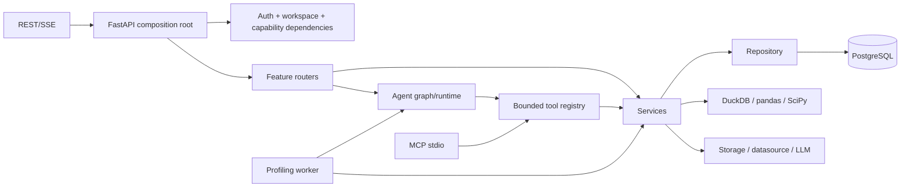
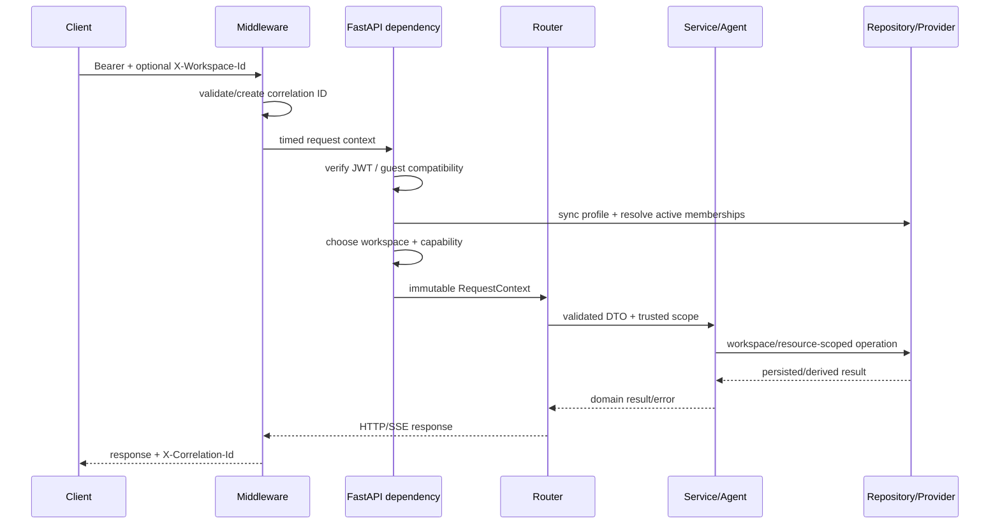

# Kiến trúc backend

> Đối chiếu với `src/backend/src/` ngày 2026-09-06. Trang này mô tả boundary và ownership; Pydantic/OpenAPI, migration và test vẫn quyết định contract chi tiết.

## Runtime process

Backend có ba entrypoint dùng chung domain code:

| Process | Entrypoint | Vai trò |
| --- | --- | --- |
| FastAPI | `src/backend/src/main.py` | REST, SSE, auth/workspace boundary, health và error mapping |
| Profiling Worker | `src/backend/src/workers/profiling_worker.py` | claim durable job, heartbeat/lease, chạy graph, retry/recovery |
| Local MCP | `src/backend/src/mcp_server.py` | expose tool/analysis bounded qua stdio cho client local |

API và worker triển khai độc lập nhưng phải chạy cùng image/revision. MCP không được mount vào FastAPI và không phải public service.

## Composition root và middleware

`src/backend/src/main.py`:

- tải typed settings một lần qua `get_settings()`;
- chạy startup validation và warm JWKS ở production theo fail-closed request semantics;
- mount chín router dưới `/api/v1`;
- thêm correlation ID và performance telemetry có cardinality giới hạn;
- chuẩn hóa validation 422, input 400, database 503 và safe 500;
- chỉ bật OpenAPI/Redoc ngoài production;
- bọc toàn app bằng CORS middleware để cả lỗi auth/provider vẫn có header CORS.

Health `/health` không nằm dưới API prefix. Root `/` chỉ trả metadata service, không serve frontend asset.

## Request lifecycle

`RequestContext` chứa actor và `WorkspaceContext`; workspace ID trong URL/body không thay thế context đã resolve. System Admin dùng `SystemContext` riêng và không trở thành workspace superuser khi gửi `X-Workspace-Id`.

## Router ownership

| Router | Prefix sau mount | Use case chính |
| --- | --- | --- |
| `api/routes.py` | `/api/v1` | ingestion/dataset/profile/test/drift, conversation, QA REST/SSE, status/audit |
| `api/analysis_routes.py` | `/api/v1/analysis-sessions` và `/api/v1/profile` | session/context/gate/execution, chart plan, Preview/Official |
| `api/authz_routes.py` | `/api/v1` | session/bootstrap, workspace, member/invitation, report/draft/dashboard |
| `api/connector_routes.py` | `/api/v1/connectors` | datasource connector lifecycle/probe |
| `api/google_drive_routes.py` | `/api/v1/google-drive` | OAuth, list, import và disconnect |
| `api/agent_routes.py` | `/api/v1` | đọc agent run/plan/evidence/trace |
| `api/skill_routes.py` | `/api/v1/agent-skills` | native skill catalog và inspect |
| `api/admin_routes.py` | `/api/v1/admin` | system user administration |

Router thực hiện transport concerns: parse header/body, dependency authorization, rate limit, idempotency lookup và chuyển domain error thành HTTP. Nghiệp vụ tái sử dụng nằm ở service/agent/repository.

## Service map

| Nhóm | Module tiêu biểu | Trách nhiệm |
| --- | --- | --- |
| Identity/security | `auth.py`, `permissions.py`, `security.py` | verify identity, capability, audit, rate limit, safe filename |
| Ingestion/storage | `ingestion.py`, `storage.py`, `google_drive.py`, `datasource.py`, `tabular_source.py` | canonical artifact, connector encryption/materialization, byte limit, cleanup |
| Profiling/statistics | `profile_service.py`, `compute.py`, `stats_tests.py`, `drift.py` | queue use case, deterministic aggregate, test và drift |
| Analysis | `analysis_engine.py`, `analysis_repository.py`, `chart_planner.py`, `quality_gate.py`, `forecasting.py` | QuerySpec, planner, Preview/Official, gate, forecast adapter |
| QA/evidence | `guardrails.py`, `retrieval.py`, `qa_validation.py`, `chat_answer.py` | routing support, hybrid retrieval, grounding, answer envelope |
| Chat P2 | `chat_cache.py`, `chat_suggestions.py`, `chat_verifier.py`, `ai_latency.py` | safe cache, suggestion, shadow verification, latency ledger |
| Report | `report_service.py`, `report_draft_repository.py` | lifecycle, optimistic draft, immutable snapshot/export source |
| Persistence | `repository.py`, `workspace_configuration_repository.py` | SQLAlchemy table inventory và scoped data access |

## Agent boundary

`agents/graph.py` xây hai graph:

- profiling graph: ingest → stats → proposal → HITL → optional deep test → summary/finalize;
- QA graph: guardrail/router → fast path/tool/retrieval → evidence validation → output.

Tool registry nhận schema bounded và server inject Profile Run/context; model không tự chọn workspace hay raw SQL. `agents/runtime/` sở hữu execution context, versioned record và sanitized trace. Native `SKILL.md` là playbook; enforcement nằm ở dependency, dispatcher, tool schema và repository predicate.

## Persistence và transaction

`services/repository.py` khai báo SQLAlchemy metadata và là facade chính cho identity, dataset, profile, agent/chat, report và audit. Các use case analysis/report draft/workspace configuration có repository chuyên biệt nhưng dùng cùng engine/table metadata.

Nguyên tắc:

- mọi tenant query lặp lại `workspace_id` predicate tại persistence boundary;
- mutation nhiều bước quan trọng chạy trong transaction;
- production schema do Alembic sở hữu;
- runtime `create_all`/compatibility migration chỉ là local/test legacy path;
- LangGraph checkpoint dùng PostgreSQL và nhóm bảng runtime-managed riêng;
- browser role không có direct table access.

Chi tiết bảng ở [kiến trúc dữ liệu](./data-and-storage.md).

## Bất đồng bộ và backpressure

Profiling HTTP chỉ validate rồi enqueue. Worker dùng claim tương đương `FOR UPDATE SKIP LOCKED`, lease, heartbeat, concurrency giới hạn và stale-job recovery. Delivery là at-least-once; idempotency key bảo vệ submission/mutation nhưng không biến network/provider call thành exactly-once.

FastAPI dùng threadpool/to-thread cho I/O hoặc compute đồng bộ ở các boundary cần thiết. SSE profiling đọc projection nhẹ từ PostgreSQL với adaptive backoff; chat SSE chạy graph có cancellation hợp tác. Không giữ full DataFrame lớn trong request hoặc checkpoint.

## Error, audit và observability

- `X-Correlation-Id` được validate hoặc sinh mới và trả lại client.
- Route template telemetry bỏ concrete resource ID để tránh cardinality/PII.
- Audit lưu event/action metadata đã chọn, không lưu bearer/raw row.
- Agent trace giới hạn depth/size, redact secret/path/prompt/raw payload.
- Database operational error trả 503 và `Retry-After: 3`.
- Lỗi không dự đoán trả safe 500 có request ID; chi tiết chỉ ở server log.

## Quy tắc mở rộng

Khi thêm use case backend:

1. định nghĩa bounded request/response schema;
2. chọn capability và request/system context đúng;
3. đặt nghiệp vụ tái sử dụng trong service;
4. giữ workspace/resource predicate ở repository;
5. thêm idempotency nếu client có thể retry mutation;
6. quyết định sync, durable job hay SSE projection;
7. thêm audit/telemetry không chứa dữ liệu nhạy cảm;
8. cập nhật migration, Data API inventory, frontend client và test nếu contract đổi.

Đọc tiếp [API và event contract](./api-and-events.md), [profiling bất đồng bộ](./async-profiling-jobs.md), [agent system](./agent-system.md) và [authentication](../security/authentication-and-authorization.md).
