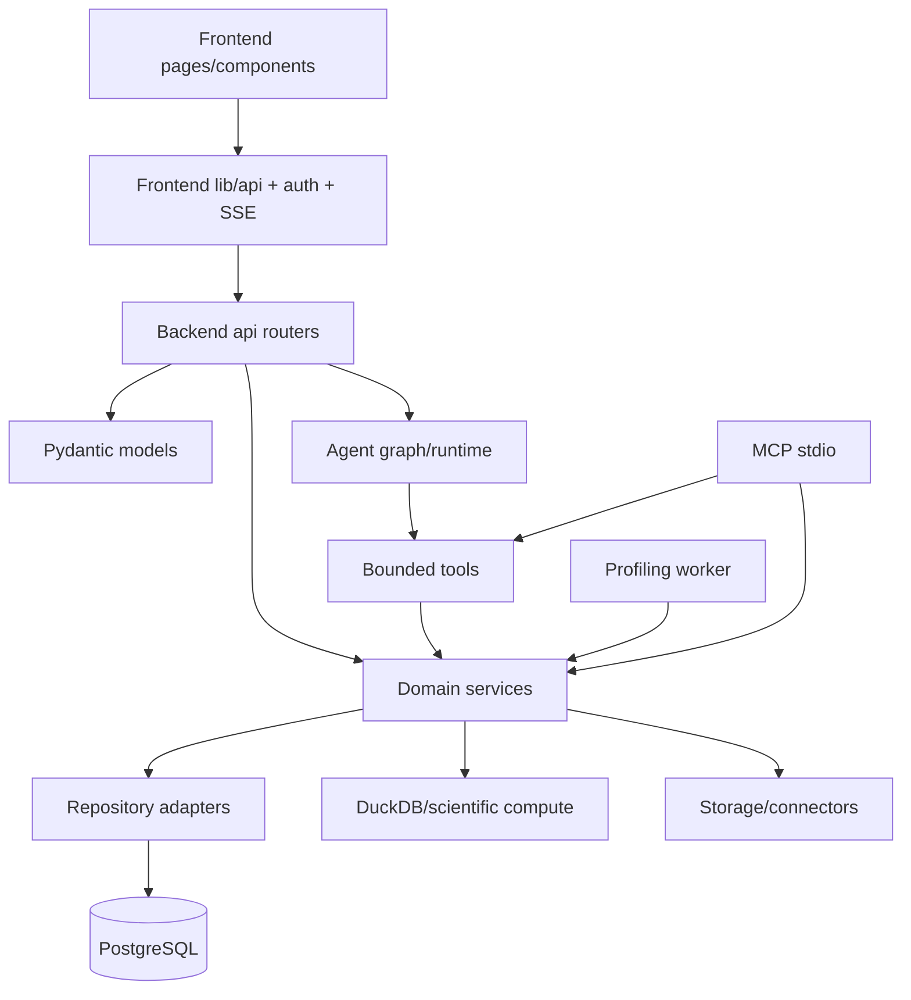

# Cấu trúc codebase

> Bản đồ module được đối chiếu với working tree ngày 2026-09-06. Repository đang dùng layout ứng dụng dưới `src/`; các entrypoint vận hành chưa chuyển hết được ghi tại [giới hạn hiện tại](./known-limitations.md).

## Cây thư mục

```text
P-170/
├── src/
│   ├── backend/
│   │   ├── src/
│   │   │   ├── api/          # FastAPI router và request dependency
│   │   │   ├── agents/       # LangGraph, node, tool, skill, runtime trace
│   │   │   ├── models/       # Pydantic request/response contract
│   │   │   ├── services/     # domain service, compute, storage, repository
│   │   │   ├── workers/      # durable profiling worker
│   │   │   ├── main.py       # FastAPI composition root
│   │   │   ├── config.py     # typed settings
│   │   │   └── mcp_server.py # MCP stdio composition root
│   │   └── migrations/       # Alembic revisions và env
│   └── frontend/
│       ├── src/
│       │   ├── app/          # Next.js App Router pages/route handlers
│       │   ├── components/   # UI và feature composition
│       │   ├── lib/          # API transport, auth, SSE, type/helper
│       │   └── middleware.ts  # route/session middleware
│       ├── public/            # static assets/font
│       ├── tests/             # Playwright E2E
│       └── package.json       # pnpm script/dependency contract
├── tests/                     # backend/integration/agent/API tests
├── tests/evaluations/         # evaluation harness và fixtures
├── tests/benchmark/           # release benchmark/grader harness
├── evaluations/               # kết quả evaluation đã sinh
├── scripts/                   # migration, security, storage, benchmark tools
├── docs/                      # tài liệu kỹ thuật này
├── config.yaml                # cấu hình không bí mật
├── .env.example               # danh mục biến môi trường
├── alembic.ini                # Alembic launcher
├── Dockerfile.*.azure         # image production
└── .github/workflows/         # CI/CD
```

Không đặt generated evaluation artifact vào source runtime. `evaluations/` là output để audit/review; logic chấm điểm nằm trong `tests/evaluations/` và `tests/benchmark/`.

## Dependency direction



Hướng phụ thuộc mong muốn là từ delivery layer vào domain/service rồi tới adapter. Router không sở hữu SQL hay connector credential; frontend không truy cập domain table; model không được cấp raw SQL/Python. `repository.py` hiện là persistence facade lớn dùng chung, còn các repository chuyên biệt bọc phần analysis, report draft và workspace configuration.

## Backend ownership

| Module | Trách nhiệm | Không nên chứa |
| --- | --- | --- |
| `src/backend/src/main.py` | compose app, middleware, CORS, exception, health | nghiệp vụ feature |
| `api/` | HTTP/SSE contract, dependency injection, status mapping | SQL trực tiếp hoặc secret handling rải rác |
| `models/` | schema request/response và bounded enum/limit | persistence side effect |
| `services/` | use case, compute, validation, provider adapter | UI state |
| `agents/` | graph orchestration, tool/skill registry, execution context, trace | bypass service permission/scope |
| `workers/` | claim lease và chạy workflow durable | định nghĩa contract HTTP |
| `migrations/` | schema production, index, RLS/grant | compatibility mutation lúc request |

`src/backend/src/main.py` là composition root HTTP; `src/backend/src/workers/profiling_worker.py` là composition root nền; `src/backend/src/mcp_server.py` là composition root local stdio. Ba entrypoint reuse service/repository nhưng có transport và lifecycle khác nhau.

## Frontend ownership

| Module | Trách nhiệm |
| --- | --- |
| `src/frontend/src/app/` | route, page composition, loading/error boundary, server route PDF |
| `src/frontend/src/components/` | reusable UI và feature panel |
| `src/frontend/src/components/auth-provider.tsx` | session, workspace bootstrap/switch, guest lifecycle, gắn auth transport |
| `src/frontend/src/lib/api.ts` | một transport REST/SSE có refresh-once, auth/workspace header và typed DTO |
| `src/frontend/src/lib/auth/` | Supabase client, permission/route UX guard, guest token state |
| `src/frontend/src/lib/chat-core.ts` | reducer/state machine cho `chat_stream.v1` |
| `src/frontend/src/lib/profile-state.ts` | diễn giải job/profile state và next action |
| `src/frontend/src/middleware.ts` | refresh session/redirect ở edge; không phải authorization boundary |

TanStack Query sở hữu server state và cache ngắn hạn. React component state sở hữu form, selection và UI transient. Supabase SDK phía browser chỉ sở hữu authentication/session và direct-upload path được cấu hình; domain mutation vẫn đi qua FastAPI.

## Source of truth theo loại thay đổi

| Thay đổi | File phải kiểm tra cùng nhau |
| --- | --- |
| Endpoint mới | router, Pydantic model, `src/frontend/src/lib/api.ts`, API test/OpenAPI type |
| Capability mới | `services/permissions.py`, `api/dependencies.py`, route, cross-workspace/permission test |
| Bảng/cột mới | `services/repository.py`, Alembic revision, `database_access_policy.py`, migration/security test |
| Profiling metric mới | compute/tool schema, persistence projection, response model, review/report/QA consumer |
| Agent tool/skill mới | tool schema/registry, execution scope, evidence validator, skill catalog và tests |
| Chart kind mới | analysis schema, planner, engine, frontend renderer, report serialization và tests |
| Config mới | `config.yaml`, `.env.example`, typed `config.py`, Docker/CI setting và operations docs |
| Layout/build mới | Makefile, Alembic, Docker build context, workflow path filters, test/script bootstrap và docs |

## Quy ước import và đường dẫn

Backend tiếp tục import package dưới namespace `src.*`; vì vậy runtime phải thêm `src/backend` vào Python module search path hoặc dùng working directory/app-dir tương ứng. Frontend dùng alias `@/*` trỏ vào `src/frontend/src/*`.

Đường dẫn tài liệu luôn tính từ repository root và phản ánh layout mới:

- backend application: `src/backend/src/...`;
- backend migrations: `src/backend/migrations/...`;
- frontend application: `src/frontend/src/...`.

Các lệnh/manifests vẫn dùng layout cũ không được coi là contract hợp lệ. Danh sách đầy đủ nằm ở [giới hạn và sai lệch hiện tại](./known-limitations.md).

## Kiểm tra ảnh hưởng trước khi merge

Một logical change có thể đi xuyên frontend, backend, migration và test. Trước khi merge:

1. xác định module sở hữu contract;
2. đi theo dependency direction tới mọi consumer;
3. cập nhật schema/migration/client type trong cùng thay đổi;
4. chạy test gần nhất rồi test integration phù hợp;
5. kiểm tra docs source link, Mermaid và known limitation;
6. commit theo chức năng hoàn chỉnh, không chia theo thư mục frontend/backend.

Đọc tiếp [kiến trúc backend](./backend.md), [kiến trúc frontend](./frontend.md) và [kiến trúc dữ liệu](./data-and-storage.md).
