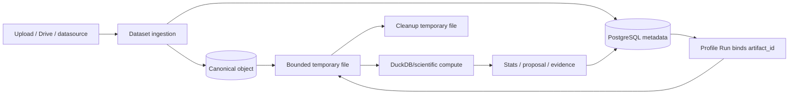
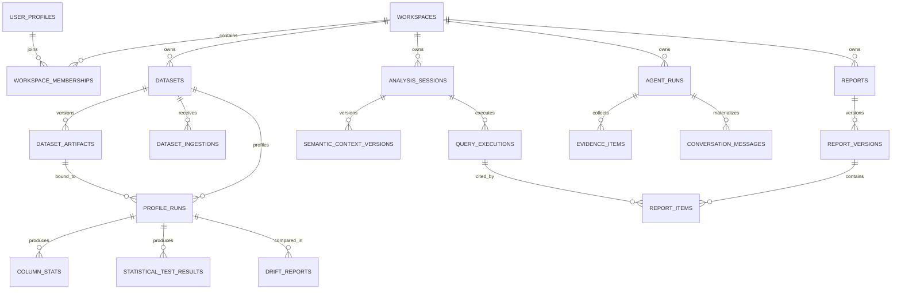

# Kiến trúc dữ liệu và lưu trữ

> Đối chiếu với SQLAlchemy metadata, Alembic head `20260901_0026` và storage/ingestion service ngày 2026-09-06.

## Nguyên tắc ownership

VDaAgent tách ba lớp dữ liệu:

1. **PostgreSQL:** identity projection, workspace, metadata, durable workflow, derived evidence, report, audit, retrieval và checkpoint.
2. **Object storage:** bytes gốc/canonical của dataset; Supabase Storage ở production, local adapter ở development/test.
3. **Ephemeral compute files:** file tạm được materialize từ storage/Drive/datasource để DuckDB xử lý rồi cleanup.

Google Drive, MySQL, MongoDB và DuckDB connector là nguồn ingest, không trở thành database metadata chính. Browser không được dùng Supabase Data API để truy cập domain table.



## Miền dữ liệu PostgreSQL

| Miền | Bảng chính | Ownership/lifecycle |
| --- | --- | --- |
| Identity | `user_profiles` | projection authoritative cho role/status ứng dụng |
| Workspace | `workspaces`, `workspace_memberships`, `workspace_invitations`, context/theme versions | tenant root, membership và cấu hình versioned |
| Ingestion | `datasets`, `dataset_artifacts`, `dataset_ingestions` | logical dataset, immutable object metadata và ingest attempt |
| Connector | `datasource_connections`, `connector_idempotency`, `google_drive_connections`, `google_drive_oauth_states` | encrypted config/token và lifecycle connection |
| Profiling | `profile_runs`, `column_stats`, proposal tables, `statistical_test_results`, `drift_reports` | durable job + profile state và derived aggregate |
| Analysis | `analysis_sessions`, `analysis_sources`, `semantic_context_versions`, `quality_gate_runs`, `quality_issues`, `query_executions` | bounded query context, gate và Preview/Official result |
| Agent | `agent_runs`, plans/steps/attempts, model/tool invocations, evidence, verification, approval, trace | execution/provenance ledger |
| Chat | `conversations`, `conversation_messages`, `conversation_feedback`, `evaluation_candidates`, `qa_answer_cache` | durable thread, immutable answer projection, feedback/cache |
| Retrieval/audit | `retrieval_documents`, `audit_events` | scoped retrieval corpus và action ledger |
| Report | `reports`, `report_versions`, `report_sections`, `report_items`, `report_visualizations`, `report_reviews` | mutable draft, immutable snapshot và lifecycle |
| Runtime | `checkpoints`, `checkpoint_blobs`, `checkpoint_writes`, `checkpoint_migrations` | LangGraph-managed serialized state |

## Quan hệ cấp cao



Sơ đồ chỉ thể hiện quan hệ nghiệp vụ quan trọng, không thay thế foreign key/constraint trong metadata và migration.

## Dataset, ingestion và artifact

`datasets` là identity logic mà UI và workspace dùng. Mỗi lần upload/import tạo `dataset_ingestions`; khi bytes đã upload, verify và finalize, hệ thống tạo hoặc hoàn tất `dataset_artifacts` immutable.

Stable source reference:

- `supabase://<bucket>/<object>` cho canonical production object;
- `local-object://...` hoặc local path chỉ cho adapter development/test;
- `gdrive://<workspace>/<file>/<name>` cho reference Drive legacy/import;
- `datasource://<connection_id>` cho connector materialization.

Object key canonical chứa workspace, dataset và artifact identity. Filename được sanitize; content SHA-256, size, media/source format và provider metadata cho phép verify/reconcile.

Profile Run bind `artifact_id` tại lúc enqueue. Retry hoặc resume phải đọc đúng artifact đó, không tự nhảy sang artifact mới nhất của dataset. Đây là điều kiện để profile/evidence có thể tái lập.

## Materialization và compute

`materialize_source` chọn adapter theo scheme, stream xuống file tạm với byte limit, verify metadata phù hợp và cleanup trong context manager. CSV/TSV legacy encoding có thể được chuyển tạm sang UTF-8. Temporary path không được persist vào evidence/trace; executed query phải dùng stable source reference.

DuckDB đọc file-backed source, inspect schema, project số cột có giới hạn và tính aggregate trực tiếp. Pipeline chính không nạp full dataset vào pandas. Statistical test chỉ materialize projection cột được yêu cầu; forecast adapter chỉ chạy dependency/algorithm khả dụng.

## Derived evidence và provenance

Derived data giữ chain tối thiểu:

```text
workspace_id
  → dataset_id
  → artifact_id + content hash
  → profile_run_id + scan/sample metadata
  → tool/query execution + result hash + limitation
  → answer/report item citation
  → report snapshot hash
```

Sample result phải giữ `is_approximate`, strategy, sample size/seed và limitation. Official execution phải giữ canonical QuerySpec/query, context version, quality-gate reference, result hash và duration. QA validator kiểm tra workspace/run/artifact binding trước khi gắn `verified`.

## State machine dữ liệu

### Ingestion/artifact

```text
ingestion: creating → pending|importing → finalized
                  └───────────────────→ failed|expired
artifact:  pending → ready → deleted
              └──→ failed
dataset:   uploading|importing|validating → ready
                                 └───────→ failed|deleted
```

### Profiling

```text
job:     queued → running → succeeded
                    ├────→ queued (retry)
                    └────→ failed

profile: created → queued → running → pending_review
                                      └→ resuming → completed
                                                   └→ failed
```

Job `succeeded` có thể tương ứng profile `pending_review`; consumer phải đọc cả domain status và `next_action`.

### Report

```text
report: draft → in_review → published → archived
version: draft → snapshot → in_review → approved|changes_requested|rejected → published
```

Behavior submit/review hiện chưa nhất quán hoàn toàn với state model; xem [giới hạn hiện tại](./known-limitations.md).

## Workspace isolation và Data API

Mọi domain table hiện được phân loại backend-only trong `src/backend/src/services/database_access_policy.py`:

- internal backend-only;
- tenant-scoped backend-only;
- auth-system backend-only;
- runtime-managed backend-only;
- migration/legacy table được quarantine.

`USER_OWNED_DIRECT_ACCESS_TABLES` và `PUBLIC_READ_ONLY_TABLES` hiện rỗng. Migration `20260831_0022` bật RLS nhưng không cấp policy cho `anon`/`authenticated`, revoke table/sequence/function privilege và siết default privilege. FastAPI kết nối bằng server credential và lặp lại workspace predicate tại repository.

## Schema ownership và migration

- Alembic là nguồn sự thật production; head hiện tại `20260901_0026`.
- SQLAlchemy metadata phục vụ query và parity check.
- `database_access_policy.py` phải bao phủ mọi table mới.
- LangGraph checkpoint table là runtime-managed nhưng vẫn backend-only.
- Không dùng runtime `create_all` như deployment strategy; compatibility bootstrap chỉ dành cho local/test/legacy.
- Rollback app dùng image SHA; rollback schema cần migration/restore plan riêng.

## Backup, retention và reconciliation

Backup phải bao gồm PostgreSQL và canonical object cùng thời điểm hoặc có manifest/hash để reconcile. `scripts/reconcile_storage.py` là kiểm tra read-only; không tự xóa orphan. Cleanup cần xét artifact binding, ingestion idempotency, object age, audit và retention của Profile Run/evidence/report.

Conversation có soft-delete và primitive purge, nhưng scheduler retention production chưa được nối. Report snapshot/evidence đã tham chiếu không được xóa theo cleanup dataset tùy tiện.

Đọc tiếp [connector và storage](../features/connectors-and-storage.md), [database migration](../operations/database-migrations.md) và [workspace isolation](../security/workspace-isolation-and-privacy.md).
