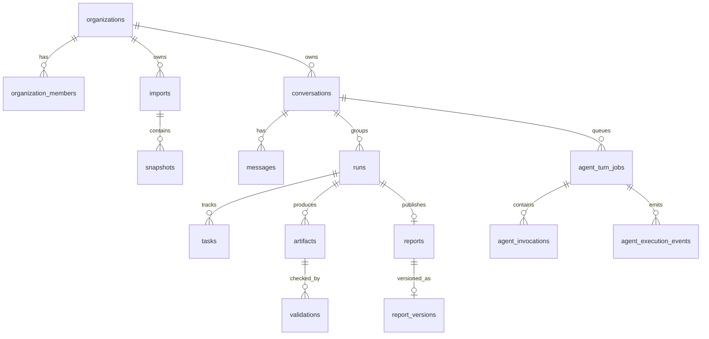

# Data model

PostgreSQL/Supabase là nguồn trạng thái. Các bảng chính nằm trong `src/backend/supabase/migrations`; nhiều record có cột `payload JSONB` được kiểm bằng contract tại application boundary.

Đây là sơ đồ quan hệ nghiệp vụ, không đồng nghĩa mọi đường nối đều là foreign key. Ví dụ `runs.request.conversation_id` nằm trong payload JSONB; liên hệ conversation/run được kiểm ở repository khi tạo run. Các khóa ngoại vật lý và policy là nguồn chính xác trong `src/backend/supabase/schemas`.

`org_id` đi cùng khóa và truy vấn quan trọng. `run_snapshots` đóng băng nguồn dữ liệu của run. `artifact_inputs`, `artifact_snapshots`, `artifact_sources` giữ lineage; `validations` ghi kiểm tra artifact. `events`/`runtime_activity_events` phục vụ tiến độ run; `agent_execution_events` phục vụ turn job. `agent_memory` có scope/layer riêng. `definitions` và `occurrences` nối lịch với run; `report_exports` lưu metadata của file trong Storage.

`report_versions` liên kết các report đã publish theo `lineage_id` và `parent_report_id`. Draft và review revision trong một run là artifact khác với version của report đã publish. Các bảng `markets`, `projects`, `zones`, `units` và warehouse giao dịch/giá/đặt chỗ phục vụ bộ dữ liệu mock, nhưng đường phân tích MVP hiện lấy `snapshots` làm nguồn chính.

Xem [datasets](../platform/datasets.md), [artifacts](../platform/artifacts.md), [report workflow](../workflows/report-generation.md).
