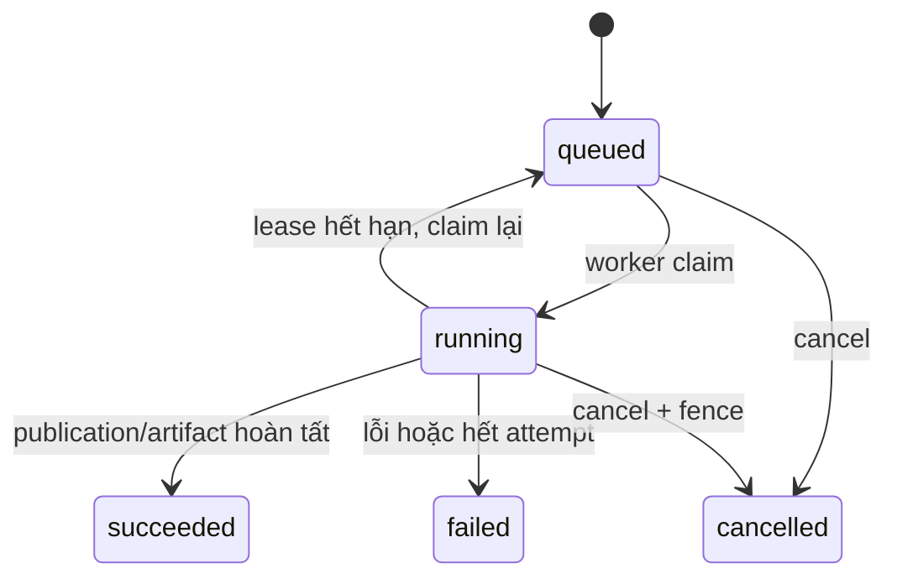

# Execution model

**Request** là HTTP call; **turn** là lượt hội thoại; **run** là công việc phân tích có trạng thái độc lập; **task** là checkpoint stage; **invocation** là một lần agent được gọi và có thể có parent. Chat đọc ngắn có thể kết thúc mà không tạo run.

| Đơn vị | Ai tạo / trạng thái lưu ở đâu | Khi nào kết thúc |
| --- | --- | --- |
| HTTP request | Browser gọi Next.js API; chỉ tồn tại trong kết nối | Khi API trả response hoặc stream đóng |
| Conversation turn | API ghi user/assistant message; đủ điều kiện thì có `agent_turn_job` riêng | Assistant message hoàn tất/thất bại/hủy; có thể chờ run |
| Analysis run | `buildRun` tạo row `runs`, `run_snapshots`, message và idempotency key | Artifact specialist hoặc report publication, lỗi, hủy |
| Task / invocation | Task trong `tasks` là stage checkpoint; invocation/event ghi runtime agent | Stage/agent kết thúc, có thể lồng parent-child |

`create-run.ts` ghi run `agent-v1`, tập snapshot đã chọn và message liên quan trong transaction có idempotency key; task/checkpoint được lưu khi worker thực thi stage. `run-loop.ts` luân phiên claim run và durable turn job. Claim dùng `FOR UPDATE SKIP LOCKED`, lease 30 giây, heartbeat mỗi 10 giây và fencing token; write stage kiểm tra lại lease. Run có tối đa 3 attempt. Worker bị ngắt/mất lease khiến owner mới tiếp tục từ checkpoint/artifact hợp lệ; `legacy-v1` chỉ để drain run cũ.

Chat Agent Runtime mặc định giới hạn 3 plan steps, 3 capability calls, một run mới và một mutating call mỗi turn. Provider attempt mặc định timeout 12 giây, turn tối đa 45 giây; Team Runtime có deadline riêng 10 phút và tool timeout theo từng definition. Các giới hạn này không thay thế lease: tool có thể bị abort khi worker mất quyền sở hữu, còn repository fence mới quyết định write có hợp lệ.

Durable turn job có queue/lease/event riêng và có thể tạo run. Worker xử lý một phase hữu hạn mỗi claim; trạng thái `waiting` không giữ worker/provider call. Nếu durable flag tắt, request chat có thể xử lý trong API và SSE POST cũ có thể bật. Với durable stream, GET event đọc database bằng cursor; disconnect chỉ đóng subscription, không hủy job/run. UI còn polling để khôi phục sau refresh. Cancel có endpoint riêng và trạng thái terminal được ghi trong repository.

Lỗi workflow sau khi đã claim thường ghi run `failed` terminal; tự động claim lại áp dụng cho owner mất lease trước khi hoàn tất, không phải nút retry một run đã failed. Turn không durable bị ngắt có script operator để reconcile khi chắc chắn HTTP owner đã dừng. Xem [failure recovery](../workflows/failure-recovery.md) cho từng trường hợp.

Code mapping: `src/backend/packages/db/src/transactions/create-run.ts`, `src/backend/packages/db/src/workflow/lease-repository.ts`, `src/backend/packages/db/src/repositories/agent-execution-repository.ts`, `src/backend/worker/src/run-loop.ts`, `src/frontend/src/server/durable-event-stream.ts`. Xem [failure recovery](../workflows/failure-recovery.md).
