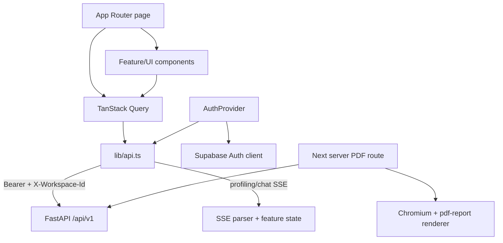
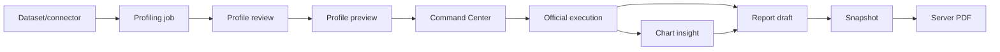

# Kiến trúc frontend

> Đối chiếu với `src/frontend/` ngày 2026-09-06. Frontend là Next.js 15 App Router, React 19 và TypeScript strict.

## Vai trò và ranh giới

Frontend chịu trách nhiệm session UX, workspace selection, điều hướng, server-state cache, render profile/chart/chat/report và PDF route phía server. FastAPI mới là authorization và domain boundary; middleware/component guard chỉ cải thiện UX.

Browser có thể dùng Supabase SDK cho authentication/session và direct object upload khi feature flag cho phép. Browser không đọc hoặc ghi trực tiếp các bảng domain PostgreSQL qua Supabase Data API.



## Provider tree và application shell

`src/frontend/src/app/layout.tsx` đặt toàn bộ route trong:

```text
QueryClientProvider
  └── ToastProvider
      └── DialogProvider
          └── AuthProvider
              └── AppShell
                  └── Page
```

- `QueryClientProvider`: stale time mặc định 15 giây, query retry một lần, mutation không tự retry.
- `AuthProvider`: đồng bộ Supabase/guest token, bootstrap workspace, đăng xuất, đổi workspace và cài transport cho API client.
- `AppShell`: navigation, route visibility và layout công khai/nội bộ.
- theme được khởi tạo trước hydration từ local storage/system preference để tránh flash.

## Route map

| Nhóm | Route chính | Mục đích |
| --- | --- | --- |
| Public | `/`, `/about`, `/guide`, `/docs`, `/contact`, `/privacy`, `/terms` | giới thiệu và tài liệu sản phẩm |
| Auth/account | `/login`, `/signup`, `/forgot-password`, `/auth/callback`, `/account/*` | Supabase auth và account recovery |
| Workspace | `/dashboard`, `/workspaces`, `/workspaces/manage`, `/settings`, `/activity` | bootstrap, switch, member/config/audit UX |
| Data | `/datasets`, `/datasets/new`, `/datasets/[datasetId]/runs`, `/connectors` | ingestion, connector và profiling submission |
| Profile | `/profiles/[runId]/review`, `/profiles/[runId]/preview` | HITL và profile summary |
| Analysis | `/charts`, `/compare` | Command Center và drift |
| Chat | `/chat` và draggable widget | conversation, streaming answer và feedback |
| Report | `/reports`, `/reports/[reportId]` | draft/snapshot/export |
| System | `/admin`, `/health` | system user management và health route |

Phần lớn trang nội bộ là client component vì phụ thuộc browser token, workspace context và TanStack Query. Route `/api/reports/profile/[runId]` là server route để lấy export source đã authorize và render PDF.

## Auth và workspace bootstrap

`src/frontend/src/middleware.ts` refresh/kiểm tra Supabase claim cho route không công khai. Nó không quyết định capability và cố ý cho các app route cốt lõi đi qua để browser có thể thiết lập guest session hoặc Supabase session.

`AuthProvider` là state machine session phía client:

1. lấy guest token khi người dùng chủ động vào trial, nếu không ưu tiên Supabase session;
2. refresh token sắp hết hạn;
3. gọi `/workspace-bootstrap` với bearer và workspace đã lưu;
4. retry một lần sau refresh khi 401;
5. bỏ workspace ID stale và retry khi 404;
6. provision personal workspace idempotent cho Supabase user chưa có app profile/workspace;
7. publish `me`, permission và workspace ID cho component;
8. khi đổi workspace, xóa query cache/history scope để không trộn tenant data.

Backend vẫn kiểm tra active profile, membership, workspace status và capability ở mọi request. Giá trị workspace lưu trong browser chỉ là preference, không phải quyền.

## API transport

`src/frontend/src/lib/api.ts` là client boundary dùng chung:

- chuẩn hóa `NEXT_PUBLIC_API_URL` và local fallback;
- inject `Authorization: Bearer ...` và `X-Workspace-Id` từ AuthProvider;
- refresh token rồi retry đúng một lần khi 401;
- parse FastAPI error thành `ApiError` ổn định;
- sinh/nhận `Idempotency-Key` cho ingestion, profile, preview, pin và mutation retryable;
- dùng fetch streaming cho profiling SSE và chat SSE;
- dùng XHR/TUS/direct-upload path khi cần progress hoặc upload lớn.

DTO TypeScript trong `lib/api.ts`, `lib/types.ts`, `lib/analysis-types.ts` và generated `lib/schema.d.ts` phải được cập nhật cùng backend schema. Generated OpenAPI không được xem là đúng nếu chưa regenerate từ backend cùng commit.

## Server state và local state

| Loại state | Owner | Ví dụ |
| --- | --- | --- |
| Identity/workspace | `AuthProvider` | token transport, `me`, workspace ID, permission |
| Server resource | TanStack Query | dataset, run, connector, report, configuration |
| Stream state | reducer/helper feature | chat stage, partial text, terminal envelope, profiling state |
| Form/selection | component | review decision, chart selection, report reorder |
| Durable chat | backend conversation tables | conversation/message/feedback |
| Preference | local storage | theme, selected workspace, scoped chat convenience |

Query key phải chứa resource scope cần thiết, đặc biệt workspace/Profile Run. Khi auth hoặc workspace đổi, cache liên quan phải được clear/invalidate trước khi render tenant mới.

## Hai stream SSE

### Profiling

`streamProfileEvents` đọc `GET /profiling-jobs/{job_id}/events`, parse event/id/data và cập nhật query state. Nếu stream không khả dụng, client có polling fallback nhưng phải giữ cùng job/idempotency key, không submit job mới.

### Chat

`streamQuestion` đọc `POST /qa/stream`. `chat-core.ts` diễn giải `chat_stream.v1` stage và tích lũy progress/answer. Terminal answer là envelope V2 có evidence/provenance; partial text không được lưu như câu trả lời verified. Cancellation là hợp tác qua abort signal và server disconnect handling.

## Profile, chart và report flow



`profile-state.ts` tách job status khỏi profile status và sinh next action. Command Center chỉ cho pin/insight từ Official execution. Report edit dùng optimistic version/idempotency để tránh ghi đè; export lấy payload đã lọc từ backend rồi render bằng `pdf-report.ts` và Chromium.

## Security header và secret boundary

`next.config.ts` thiết lập CSP, frame deny, nosniff, referrer và permissions policy. Chỉ `NEXT_PUBLIC_*` được đóng gói vào browser. Database URL, Supabase secret/service key, connector encryption key, Google Drive secret và LLM key không được đi qua Next public env hoặc client bundle.

PDF route forward bearer/workspace context tới backend và dùng timeout; nó không tự đọc database/storage. Nội dung Markdown được render qua component kiểm soát, không trao quyền thực thi HTML/script tùy ý.

## Kiểm thử

- Vitest + Testing Library kiểm tra component, reducer/helper và optimistic state.
- Playwright kiểm tra login, 401 recovery, workspace role, profile next step, compare, chart pin và report detail.
- `typecheck`, ESLint và production build là quality gate riêng.
- Mọi flow nhạy cảm cần test cả UX và backend permission; test ẩn nút không thay thế authorization test.

Đọc tiếp [API và event contract](./api-and-events.md), [authentication](../security/authentication-and-authorization.md) và [Command Center](../features/command-center.md).
