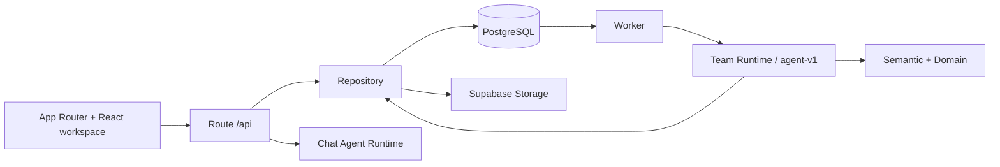

# Các lớp kiến trúc

**Frontend** là Next.js App Router. Các URL chat, runs, reports, imports, automations đều gắn vào `Workspace`; React hooks giữ trạng thái hiển thị, tải dữ liệu và kết nối SSE/polling.

**API** là một catch-all route trong chính ứng dụng Next.js, không có HTTP backend riêng. Router xác thực Supabase, parse contract Zod và gọi repository hoặc Agent Runtime.

**Worker** là process Node độc lập. Nó tick scheduler, claim `agent_turn_jobs` và `runs` từ database, rồi chạy chat phase hoặc workflow phân tích. **Shared packages** chứa contract, tính toán deterministic, agent stages, validation, persistence và config.

**Data layer** dùng Supabase PostgreSQL làm hàng đợi và nguồn trạng thái; Supabase Storage giữ file CSV nguồn/export. Provider Gemini/OpenAI phục vụ planning, diễn giải và fallback; xAI là adapter tùy cấu hình. Xem [backend](backend.md), [frontend](frontend.md), [integrations](integrations.md).
