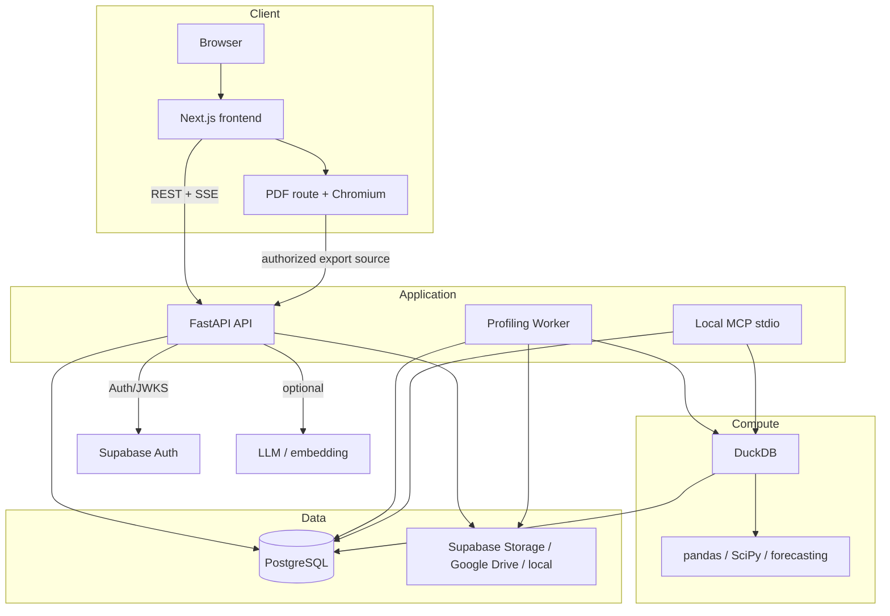

# Tổng quan hệ thống

> Đã đối chiếu với topology, API mount và data flow hiện tại ngày 2026-09-03.

## Mục tiêu và nguyên tắc

VDaAgent hỗ trợ Analyst đi từ một nguồn dữ liệu dạng bảng đến profile, phân tích, câu trả lời và report có thể kiểm chứng. Implementation hiện tại giữ năm nguyên tắc:

1. **Evidence-first:** số liệu phải đến từ compute/tool/retrieval/Official execution đã lưu, không đến từ suy đoán của model.
2. **Bounded execution:** số row/cột/filter/result, thời gian, tool call, context và output đều có trần.
3. **Workspace isolation:** identity, membership, capability và resource predicate được kiểm tra trước khi truy cập dữ liệu.
4. **Durable workflow:** profiling và resume là job PostgreSQL, không phụ thuộc vòng đời một HTTP request.
5. **Backend-only data plane:** browser không đọc/ghi trực tiếp bảng ứng dụng qua Supabase Data API.

## Các process và dependency



Production chạy frontend, API và worker thành ba App Service container. Local MCP là stdio integration riêng; nó không được mount thành public HTTP endpoint. PostgreSQL giữ metadata, durable job, derived evidence, report, audit, retrieval và checkpoint. Storage giữ raw object; compute materialize source trong thời gian thao tác rồi cleanup.

## Request boundary

Một workspace request đi qua chuỗi sau:

1. Đọc bearer token, ưu tiên verify JWT/JWKS local; chỉ dùng Supabase Auth API như fallback hẹp hoặc để xác minh email khi claim thiếu.
2. Đồng bộ `user_profiles` nhưng giữ role/status trong database là authoritative.
3. Resolve account + active memberships bằng query gộp, chọn `X-Workspace-Id` hoặc trả `workspace_required`.
4. Tính capability từ canonical role.
5. Router gọi service/repository với workspace ID đã xác thực.
6. Middleware trả `X-Correlation-Id`, ghi latency/query count an toàn và không log bearer/payload nhạy cảm.

System Admin đi qua system context độc lập và không thể dùng workspace header để trở thành Analyst. Frontend guard chỉ cải thiện UX; FastAPI dependency mới là security boundary.

## Data flow profiling

Upload stream theo chunk và tính content SHA-256. Metadata dataset giữ stable `source_ref`:

- `supabase://bucket/object`;
- `gdrive://workspace/file/filename`;
- `datasource://connection_id`;
- local path chỉ cho development/test.

Worker materialize source với byte limit. CSV/TSV legacy encoding được chuyển tạm sang UTF-8. DuckDB inspect schema, project tối đa số cột cấu hình, tạo sample table khi cần và tính aggregate trực tiếp. Main profiling path không materialize full dataset vào pandas; statistical test chỉ reload các cột được yêu cầu. Temporary path không được lưu vào evidence; executed query được thay bằng stable source reference.

## Data flow analysis và QA

Analysis session giữ semantic context có version. Preview dùng bounded sample và có expiry; Official yêu cầu đúng context, quality gate và full-source bounded execution. Result lưu canonical query, hash, limitation và attribution.

QA router chọn guardrail, clarification, structured tool hoặc retrieval. Tool dispatcher inject `profile_run_id`; model không thể đổi scope. Validator cuối kiểm tra tool/source cùng workspace/run, status thành công, đúng artifact, citation hợp lệ và mọi số trong answer có trong evidence. Nếu kiểm tra thất bại, response dùng abstention ổn định thay vì trả claim chưa chứng minh.

## Mô hình dữ liệu cấp cao

```text
user_profiles ──< workspace_memberships >── workspaces
workspaces ──< datasets ──< dataset_artifacts / dataset_ingestions
datasets ──< profile_runs (mỗi run có thể bind artifact_id bất biến)
profile_runs ──< column_stats / proposals / tests / drift_reports
workspaces ──< analysis_sessions ──< semantic_context_versions
analysis_sessions ──< quality_gate_runs / quality_issues / query_executions
workspaces ──< reports ──< report_versions ──< report_items / charts / reviews
workspaces ──< agent_runs ──< plans / steps / invocations / evidence / trace
workspaces ──< datasource_connections / google_drive_connections
workspaces ──< retrieval_documents / audit_events
```

LangGraph checkpoint tables do runtime package tạo nhưng vẫn được phân loại backend-only. Danh sách bảng migration-managed và runtime-managed nằm trong [database access policy](../../backend/src/services/database_access_policy.py).

## Health, docs và lỗi

- Backend: `GET /health`; OpenAPI `/docs` và Redoc `/redoc` chỉ có ngoài production.
- Frontend: `GET /health`.
- Worker: `GET /health` khi chạy với `--health-port`.
- Diagnostic có authorization: `/api/v1/status`, `/api/v1/audit`.

Validation trả 422; input/compute `ValueError` trả 400; state conflict thường là 409; auth là 401/403; scoped not-found thường là 404; database operational error là 503 với `Retry-After: 3`; lỗi không dự đoán là safe 500 có request ID.

## Source sở hữu

| Phạm vi | Source |
| --- | --- |
| App/request/error | [`backend/src/main.py`](../../backend/src/main.py) |
| API/Pydantic | [`backend/src/api/`](../../backend/src/api/), [`backend/src/models/`](../../backend/src/models/) |
| Compute/storage | [`backend/src/services/compute.py`](../../backend/src/services/compute.py), [`storage.py`](../../backend/src/services/storage.py) |
| Agent/QA | [`backend/src/agents/`](../../backend/src/agents/), [`qa_validation.py`](../../backend/src/services/qa_validation.py) |
| Database | [`backend/src/services/repository.py`](../../backend/src/services/repository.py), [migrations](../../backend/migrations/) |
| Frontend | [`frontend/src/app/`](../../frontend/src/app/), [`frontend/src/components/`](../../frontend/src/components/) |

Đọc tiếp [async profiling](./async-profiling-jobs.md), [bounded execution](./bounded-execution.md), [authentication](../security/authentication-and-authorization.md) và [privacy](../security/workspace-isolation-and-privacy.md).
