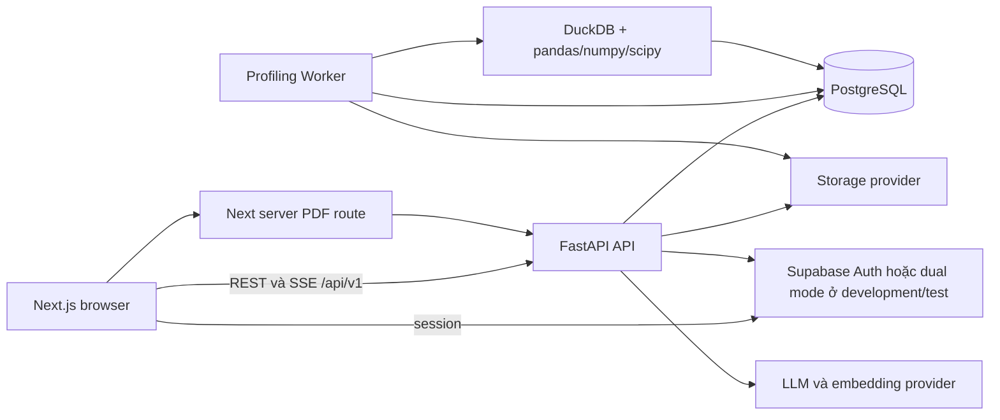

# Tổng quan hệ thống

## Phạm vi và các bất biến kiến trúc

P-170 là ứng dụng profiling và phân tích dữ liệu nhiều workspace. Implementation hiện tại dựa trên bốn nguyên tắc:

1. **Evidence-first:** factual answer và report insight trỏ về profile đã lưu, Official analysis execution hoặc retrieval source; note thủ công trong Report Draft không được coi là quantitative evidence.
2. **Execution có giới hạn:** source read, query shape, row, result size, model context và tool call đều có limit rõ ràng.
3. **Workspace isolation:** membership và capability được kiểm tra trước business query; repository nhận workspace scope đã xác thực.
4. **Durable work:** profiling là job trong PostgreSQL, không phải toàn bộ công việc thực hiện trong HTTP request.

## Cấu trúc runtime



Production chạy ba container: frontend Next standalone ở port 8080, FastAPI API ở port 8000 và Profiling Worker riêng. Workflow hiện tại triển khai trên Azure App Service và Azure Container Registry. PostgreSQL/Supabase lưu metadata, job, report, audit, retrieval document và LangGraph checkpoint; raw object nằm ở storage provider đã cấu hình.

## Luồng yêu cầu

Browser gửi access token và, khi cần, `X-Workspace-Id`. FastAPI authenticate bearer, đồng bộ/kiểm tra account active, resolve membership, tính capability rồi gọi router/service. Repository đọc/ghi theo workspace scope. `X-Correlation-Id` được validate hoặc tạo mới để nối log và trace. Production ẩn OpenAPI bằng `docs_url=None`, `redoc_url=None`.

API được mount dưới `/api/v1`; liveness probe của backend là `/health` ở root. Frontend có `/health` riêng. Endpoint chẩn đoán là `/api/v1/status` và `/api/v1/audit`.

## Vị trí source code quan trọng

| Mối quan tâm | Implementation sở hữu |
| --- | --- |
| App, middleware, error | [`backend/src/main.py`](../../backend/src/main.py) |
| Dataset/profile/QA/drift/export route | [`backend/src/api/routes.py`](../../backend/src/api/routes.py) |
| Analysis session và execution | [`backend/src/api/analysis_routes.py`](../../backend/src/api/analysis_routes.py) |
| Workspace/report authorization | [`backend/src/api/authz_routes.py`](../../backend/src/api/authz_routes.py) |
| Connector và Google Drive route | [`backend/src/api/connector_routes.py`](../../backend/src/api/connector_routes.py), [`google_drive_routes.py`](../../backend/src/api/google_drive_routes.py) |
| Auth và workspace dependency | [`backend/src/services/auth.py`](../../backend/src/services/auth.py), [`backend/src/api/dependencies.py`](../../backend/src/api/dependencies.py) |
| Persistence và schema | [`backend/src/services/repository.py`](../../backend/src/services/repository.py), [`backend/migrations/`](../../backend/migrations/) |
| Frontend route và UX | [`frontend/src/app/`](../../frontend/src/app/), [`frontend/src/components/`](../../frontend/src/components/) |

## Tóm tắt mô hình dữ liệu

PostgreSQL là system of record cho metadata và evidence dẫn xuất. Quan hệ chính:

```text
user_profiles ──< workspace_memberships >── workspaces
workspaces ──< datasets ──< profile_runs ──< column_stats / proposals / tests
workspaces ──< analysis_sessions ──< semantic_context_versions
analysis_sessions ──< quality_gate_runs / quality_issues / query_executions
workspaces ──< reports ──< report_versions ──< report_items / visualizations / reviews
workspaces ──< agent_runs ──< plans / steps / invocations / evidence / trace_events
workspaces ──< retrieval_documents / audit_events / datasource_connections
```

`datasets` lưu metadata source và content hash; raw bytes do provider sở hữu. `profile_runs` lưu sampling provenance, job lifecycle, statistic dẫn xuất, proposal, narrative và answer reference. `analysis_sessions` cùng context version tách approved semantic context khỏi execution. Report tham chiếu profile run và analysis execution; snapshot lưu content bất biến cùng hash. Hình dạng table đầy đủ và thứ tự migration nằm trong [`backend/src/services/repository.py`](../../backend/src/services/repository.py) và [`backend/migrations/`](../../backend/migrations/).

## Hợp đồng khi lỗi

Validation failure trả HTTP 422. Database operational failure trả HTTP 503 với request identifier an toàn và `Retry-After: 3`. Value/business boundary error thường được global handler chuyển thành HTTP 400; router cụ thể có thể dùng 409/404/403 cho conflict và authorization. Lỗi không dự đoán trả HTTP 500 an toàn kèm request id; secret, raw row và local path không được trả về.

## Tài liệu liên quan

[Authentication và authorization](../security/authentication-and-authorization.md), [workspace isolation](../security/workspace-isolation-and-privacy.md), [Profiling Job bất đồng bộ](./async-profiling-jobs.md) và [configuration](../operations/configuration.md).
