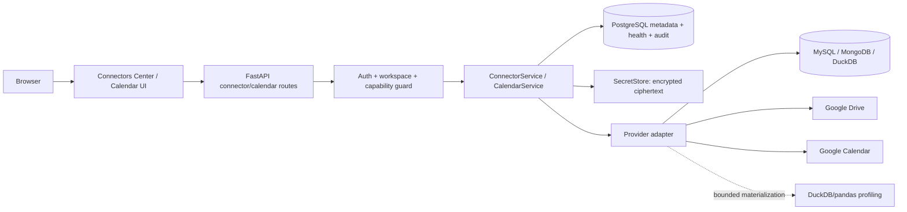
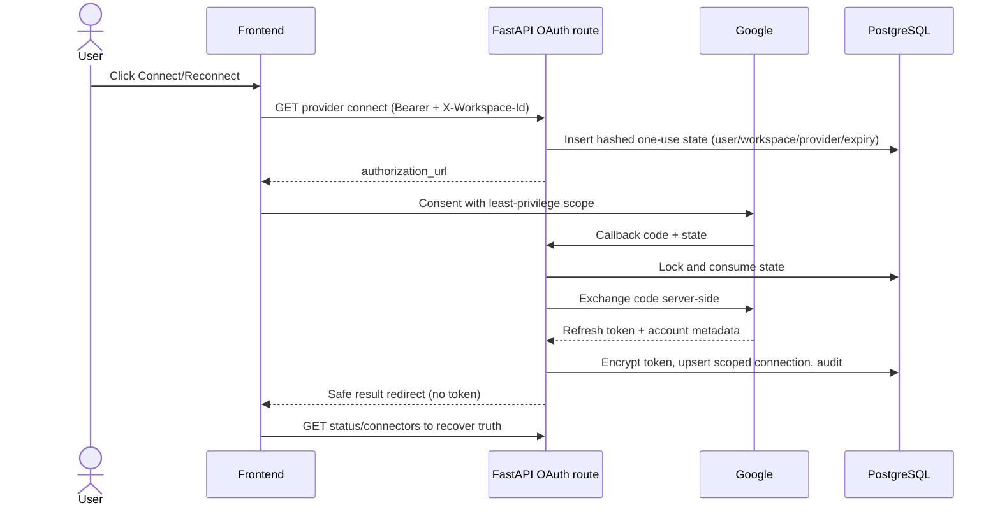
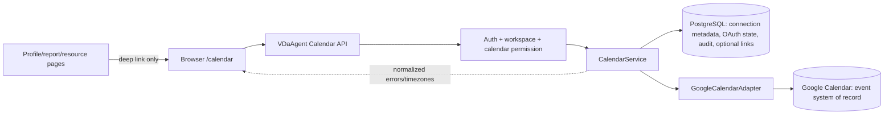

# VDaAgent Connectors & Calendar Architecture Plan

## 1. Executive Summary

VDaAgent already has the important primitives for this work: workspace-scoped
authorization, encrypted datasource metadata, Google Drive storage, a Google
Calendar adapter, a PostgreSQL repository and a React Query API client. The gap
is product shape and lifecycle consistency, not a need to replace the stack.

The recommended implementation is a hybrid connector architecture. A small
provider registry supplies stable definitions and UI metadata; a normalized
connector service owns lifecycle, authorization, health and audit; provider
adapters retain provider-specific validation and API behavior. Existing
`datasource_connections`, `google_drive_connections` and
`google_calendar_connections` are migrated behind that service in stages rather
than replaced in one breaking release.

For datasource connectors, a saved reusable connection becomes distinct from a
dataset created from that connection. The existing `/datasets/datasource/*`
endpoints remain compatibility endpoints while `/connectors/*` is introduced
for the Integration Center. The profiling pipeline continues to materialize a
bounded temporary file and then uses DuckDB/pandas.

For Calendar, choose Option A for V1: Google Calendar remains the external
system of record, but all browser access goes through a first-class VDaAgent
Calendar service/API. Ownership remains `(workspace, user)`, so “system
capability” means an application capability, not one shared Google account.
The V1 UI provides month, week and agenda views plus create/edit/delete,
timezone-correct values, connection health and optional links to VDaAgent
resources. Calendar is removed from `backend/src/mcp_server.py` and the
calendar assistant skill; unrelated profile/chart MCP tools remain.

This plan is implementation-only guidance. It does not change production code.

## 2. Current State Audit

### 2.1 Existing Connector Architecture

- `frontend/src/app/connectors/page.tsx` renders three hard-coded cards
  (MySQL, MongoDB, DuckDB) and toggles one form in place.
- `frontend/src/components/datasource-connector.tsx` owns provider fields,
  `POST /datasets/datasource/test`, `POST /datasets/datasource`, and immediately
  starts a sample profile. It labels the saved object as a dataset, not a
  reusable connection.
- `frontend/src/app/datasets/new/page.tsx` embeds the same component for the
  datasource tab and separately handles Google Drive OAuth for file upload.
- `frontend/src/lib/api.ts` exposes provider-specific datasource functions and
  Google Drive/Calendar functions; there is no connector query model or
  lifecycle state model.
- `backend/src/services/datasource.py` validates MySQL/MongoDB/DuckDB input,
  encrypts the normalized config with Fernet, probes the source and
  materializes to a temporary CSV/JSONL/Parquet file. The allow-list and
  1,000,000-row ceiling are valuable invariants and must remain.
- `backend/src/services/google_drive.py` owns Drive OAuth, Drive storage and a
  workspace-wide connection. `backend/src/api/google_drive_routes.py` exposes
  status/connect/callback/disconnect.
- `backend/src/services/google_calendar.py` owns Google Calendar OAuth and
  live event calls. `backend/src/api/calendar_routes.py` exposes status,
  connect/callback, list, create and delete.

The current implementation is provider-specific at the API/repository layer,
but there is already a natural domain seam: each provider has a config
validator, encrypted secret, connection row and adapter. Normalize lifecycle
contracts without forcing all provider payloads into one provider implementation.

### 2.2 Existing Datasource Flow

`POST /api/v1/datasets/datasource/test` validates the request, runs `probe` in a
thread and returns available tables/collections. `POST /api/v1/datasets/datasource`
validates and probes again, encrypts the config, inserts a row into
`datasource_connections`, creates a `datasets` row whose `source_ref` is
`datasource://<connection_id>`, audits `api_datasource_connected`, and returns a
dataset ID. Thus the connection is currently one-to-one with the dataset from
the user's perspective even though the table can technically be reused.

`backend/src/services/storage.py` resolves a datasource reference and calls
`materialize_connection`; `backend/src/services/profile_service.py` validates
the reference before profiling. `DELETE /datasets/{id}` currently deletes the
datasource row as part of dataset deletion. This coupling must be broken for
reusable connections: deleting a dataset must not delete a connection still
referenced by another dataset.

### 2.3 Existing Google Drive Integration

Drive is both a storage provider and a connector-like integration. Its row is
unique by `workspace_id`, stores `folder_id`, encrypted refresh token and the
user who connected it. `GoogleDriveStorage._service` verifies the configured
folder and can create a private workspace folder if the configured folder is
not accessible. Upload/download/delete use temporary local materialization.

The callback consumes a one-use, expiring state row, but state rows do not
record provider, return route, client nonce or PKCE verifier. The frontend
receives only status metadata and uses a popup `postMessage` event. Preserve
Drive's storage behavior while moving status and lifecycle presentation into
the connector center.

### 2.4 Existing Calendar Integration

`google_calendar_connections` has a composite primary key `(workspace_id,
user_id)` and stores `calendar_id` plus an encrypted refresh token. This is
explicitly per-user/per-workspace, not a globally shared workspace account.
`GoogleCalendarClient` reconstructs Google credentials for each call and relies
on the client library to refresh access tokens; refreshed credentials are not
persisted. The configured default calendar is `primary`.

`calendar_routes.py` validates aware `start`/`end`, attendee email shape and
window ordering. Events are fetched live from Google for a default seven-day
window, capped at 100. Only create and delete exist; update, calendar selection,
month/week range semantics, recurrence and resource links do not.

### 2.5 Existing Calendar MCP Coupling

`backend/src/mcp_server.py` imports `GoogleCalendarClient`, `GoogleCalendarError`,
`CALENDAR_READ` and `CALENDAR_WRITE`, implements `_calendar_scope`, and
registers `list_calendar_events`, `create_calendar_event` and
`delete_calendar_event` MCP tools. These tools call the same provider service
but expose Calendar through trusted-local stdio.

`backend/src/agents/skills/registry.py` registers `calendar-assistant`, maps
calendar words to it and lists the three MCP tool names. Tests in
`tests/test_calendar.py` and `tests/test_agents/test_skills.py` assert this
skill selection. `docs/google-calendar-mcp.md`, `README.md`, `docs/summary.md`,
`ARCHITECTURE.md` and `.env.example` document the MCP path.

No other MCP chart/profile tool needs Calendar. Remove only the Calendar
imports/functions/skill registration and related documentation/tests; keep
`backend/src/mcp_server.py` for bounded Profile/Chart capabilities.

### 2.6 Existing UI/UX

The connector page has no connected/available distinction, no status refresh,
no detail view, no saved connection list, no edit/disconnect action and no
Google Drive/Calendar cards. Error handling is a single inline form error.

The Calendar page (`frontend/src/app/calendar/page.tsx`) is a single form plus
an upcoming table. It loads status and events with local component state,
defaults to “now through seven days”, uses a popup message, and supports only
connect, refresh, create and cancel. It has no month/week/agenda navigation,
edit dialog, event detail, date-range query key, skeleton grid or resource
deep-links.

The app shell (`frontend/src/components/app-shell.tsx`) places Connectors under
Data and Calendar under Work. Route access is permission-based in
`frontend/src/lib/auth/route-access.ts`; the navigation descriptions still say
“MySQL, MongoDB hoặc DuckDB” and “Google Calendar của bạn”.

### 2.7 Current Database Model

Relevant SQLAlchemy Core tables are declared in
`backend/src/services/repository.py`:

| Table | Current shape | Consequence |
| --- | --- | --- |
| `datasource_connections` | `id`, `workspace_id`, creator, name, kind, `config_encrypted`, created time | No health, update, soft-delete or reusable-dataset count |
| `google_drive_connections` | Workspace PK, folder, encrypted refresh token, connector user, timestamps | One workspace Drive grant; provider-specific secret field |
| `google_drive_oauth_states` | id, workspace, user, expiry, used time | One-use/expiry exists, provider is implicit |
| `google_calendar_connections` | `(workspace_id,user_id)` PK, calendar ID, encrypted refresh token, timestamps | Correct current ownership, no health/account label |
| `google_calendar_oauth_states` | id, workspace, user, expiry, used time | One-use/expiry exists, no return intent/provider/PKCE |
| `datasets` | source type/ref, workspace, hash/version and collection metadata | Datasource ref is encoded in `source_ref`; dataset deletion currently cascades logically to the connection |

There are no local Calendar event tables. `audit_events` is the durable audit
system, with `get_audit()`/`DatabaseAudit` used by routes. Alembic revisions
`20260812_0003_google_drive_storage.py`, `20260825_0016_google_calendar.py` and
`20260825_0017_external_datasources.py` created the provider tables.

### 2.8 Current Permissions/Security Model

`backend/src/api/dependencies.py` resolves Bearer identity, active workspace
membership, locked status and system-role overlay before `require_permission`
checks. `CALENDAR_READ`, `CALENDAR_WRITE`, `DATASET_UPLOAD`, `DATASET_READ` and
`WORKSPACE_STORAGE_CONNECT` are already defined in
`backend/src/services/permissions.py` and mirrored in
`frontend/src/lib/auth/permissions.ts`.

Repository getters generally filter by workspace. The datasource materializer
uses `get_datasource_connection_any` only after the dataset itself has been
resolved in the workspace, which is safe only while source references cannot be
reassigned. Credentials are Fernet-encrypted server-side; response schemas do
not include ciphertext. Logs use normalized errors in most paths, but some
provider exceptions are still converted with truncated text in OAuth callback
HTML.

`AuthProvider.switchWorkspace` cancels all queries and calls `queryClient.clear()`
before bootstrapping the next workspace. New connector/calendar query keys must
include workspace ID and use this same invalidation boundary.

### 2.9 Technical Debt / Inconsistencies

1. Connection and dataset creation are one operation in the UI/API, preventing
   reuse and making disconnect semantics unsafe.
2. Drive, Calendar and datasource encryption/state logic is duplicated and uses
   three key names and three repository APIs.
3. Health is mostly derived from “row exists”; there are no normalized error
   codes, last success/test timestamps or attention states.
4. OAuth state is provider-specific and does not bind a safe return intent or
   PKCE verifier.
5. Calendar documentation and skill registry intentionally expose MCP, which
   conflicts with the requested target architecture.
6. Calendar event timestamps are converted in the browser with
   `new Date(datetime-local).toISOString()` and only a seven-day list is shown;
   this is insufficient for a calendar UI.
7. API route telemetry templates do not yet include connector/calendar routes;
   adding low-cardinality templates is required for observability.
8. `frontend/openapi.json` and `frontend/src/lib/schema.d.ts` contain generated
   provider-specific contracts and will need regeneration after the stable API
   contract is introduced.

## 3. Goals

- Make `/connectors` a coherent, workspace-aware Integration Center for data,
  storage and productivity integrations.
- Support reusable saved datasource connections without breaking existing
  dataset/profile flows.
- Give all providers consistent lifecycle, health, error and audit contracts
  while retaining provider-specific adapters.
- Make `/calendar` a professional application capability with reliable CRUD,
  views, timezone behavior and connection recovery.
- Remove Calendar from MCP entirely while preserving unrelated MCP tools.
- Preserve workspace isolation, encrypted secrets, backend-authoritative
  authorization and evidence-first profiling invariants.

## 4. Non-Goals

- Replacing Next.js, FastAPI, PostgreSQL, Supabase Auth or DuckDB/pandas.
- A generic arbitrary-code connector SDK or fake UI cards for unsupported
  providers.
- Local Calendar persistence plus two-way sync in V1.
- Exchange/Outlook, multi-provider calendar federation, webhooks, availability
  search, team scheduling or a background sync engine.
- Arbitrary SQL, joins, raw-row exploration or changing the profiling pipeline.
- Removing profile/chart MCP capabilities.

## 5. Architectural Decisions

### 5.1 Connector Abstraction Decision

**Decision:** Use a hybrid registry + normalized service + provider adapters.

**Reason:** There are three genuinely different categories and two distinct
secret/ownership patterns, but every provider still needs the same lifecycle
(read status, test, connect, reconnect, disconnect, audit). A registry provides
predictable UI metadata and capability discovery; adapters keep validation and
SDK behavior local.

**Alternatives considered:** One fully generic provider class/table; retaining
all provider-specific UI/routes; a large plugin SDK.

**Why rejected:** A single class would leak provider conditionals into every
layer; current screens are already duplicated; a plugin SDK is premature and
would obscure security review.

**Migration impact:** Add normalized response/service contracts first, keep old
tables and endpoints as compatibility adapters, then migrate provider rows one
at a time. New providers must implement a registry entry, adapter, secret
contract, health mapping and tests.

### 5.2 Connection Ownership

**Decision:** Store an explicit `owner_scope` per connection. Datasource and
Drive connections are workspace-owned; Calendar Google grants are
workspace+user-owned. `created_by_user_id` remains audit metadata and is not
used as the sole access check.

**Reason:** This matches current behavior: Drive storage serves a workspace,
while Calendar tokens are personal grants. It avoids silently sharing one
person's calendar with every member.

**Alternatives considered:** All integrations user-owned; one shared workspace
Calendar account; one generic owner model without provider constraints.

**Why rejected:** User-owned Drive would break workspace storage; a shared
Calendar account is unsafe and not how the current schema behaves.

**Migration impact:** Preserve the Calendar composite key and map it to the
normalized ownership fields. Connector list/detail queries must derive the
current actor's visible rows from scope, never from an ID alone.

### 5.3 Secret Ownership

**Decision:** Secrets are backend-only encrypted payloads in PostgreSQL (or a
future server-side vault behind the same service), never frontend state after
submission. Response models contain `has_secret`, display metadata and health,
not ciphertext.

**Reason:** It preserves the existing Fernet boundary and works in local,
Azure and Supabase deployments without adding a new mandatory service.

**Alternatives considered:** Browser-encrypted secrets, provider tokens in
Supabase client storage, a new external vault in V1.

**Why rejected:** Browser storage expands the attack surface; client Supabase
access must not see server credentials; an external vault adds deployment and
rotation complexity without current product value.

**Migration impact:** Add key version metadata and a shared secret service;
support old `DATASOURCE_ENCRYPTION_KEY`, `GOOGLE_DRIVE_TOKEN_ENCRYPTION_KEY`
and `GOOGLE_CALENDAR_TOKEN_ENCRYPTION_KEY` during migration, then optionally
converge on `CONNECTOR_SECRET_ENCRYPTION_KEY` after all rows are re-encrypted.

### 5.4 Calendar System of Record

**Decision:** Option A for V1: Google Calendar is the system of record for
events; VDaAgent is the system of record for connection metadata, audit records
and optional resource links.

**Reason:** Current events already live in Google, so this is the smallest
reliable change that makes Calendar a real app capability. It avoids conflict
resolution, sync cursors and accidental dual authority.

**Alternatives considered:** Option B (VDaAgent-owned events, optional sync) and
Option C (hybrid local plus Google events).

**Why rejected:** Both require a complete sync/conflict model and change the
meaning of existing Google event IDs. They can be revisited after usage proves
the need.

**Migration impact:** No `calendar_events` table in V1. Add normalized
`calendar_connections` metadata and `calendar_event_links` only if resource
linking is released. Existing Google events remain untouched.

### 5.5 Calendar Provider Strategy

**Decision:** Put Google-specific OAuth/API code behind a VDaAgent Calendar
service and adapter. Expose normalized `/calendar/*` contracts; retain current
paths as compatible aliases where practical.

**Reason:** Browser, reports and future providers should not know Google SDK
shapes. The service can handle token refresh locking, error normalization,
timezone conversion and audit in one place.

**Migration impact:** `calendar_routes.py` becomes thin; most logic moves from
`GoogleCalendarClient` into a provider adapter invoked by a service. The
external Google callback can remain at `/api/v1/calendar/callback` during the
compatibility window.

### 5.6 Calendar MCP Removal Strategy

**Decision:** Remove the three Calendar MCP tool registrations, imports and
skill entry. Calendar UI/API never imports or starts `mcp_server.py`.

**Reason:** This directly satisfies the product decision and removes a second
authorization/runtime path. Profile/chart MCP remains unchanged.

**Migration impact:** Existing local MCP clients lose Calendar tools after the
documented deprecation window. Return a clear “Calendar is available in the
VDaAgent app” message in release notes; do not leave no-op tools that imply
support. Remove the calendar skill-selection test and replace it with a
non-MCP routing/redirect test if conversational UX is retained.

## 6. Target Connector Architecture

The provider registry is metadata-only and contains `provider_id`, category,
display name, supported operations, ownership scope, credential type, required
permissions and UI form key. It must list only implemented providers:

| Category | V1 providers | Ownership | Operations |
| --- | --- | --- | --- |
| Data source | MySQL, MongoDB, DuckDB | workspace | test, save, edit, test, use as dataset, disconnect |
| Storage | Google Drive | workspace | connect/reconnect, health, disconnect |
| Productivity | Google Calendar | workspace+user | connect/reconnect, health, disconnect, open Calendar |

The normalized service resolves `(user, workspace, capability)` first, loads a
provider adapter, performs the operation, maps errors to domain codes and writes
an audit event. The adapter owns provider SDK calls and secret materialization.



The service must never return adapter exceptions directly. The API returns a
stable shape: provider, category, connection ID, safe display metadata, state,
health timestamps, normalized error code and allowed actions.

## 7. Connector Data Model

Introduce a normalized metadata table only after the compatibility service is
working. A proposed `connector_connections` table (name may be adjusted to
match repository conventions) contains:

| Field | Rule |
| --- | --- |
| `id` | 32-byte random ID; never authorization by itself |
| `workspace_id` | FK, indexed, mandatory |
| `provider` / `category` | allow-listed registry values |
| `owner_scope` / `owner_user_id` | `workspace` or `workspace_user`; Calendar requires user |
| `name` | user label, 255 chars, normalized |
| `display_metadata` | JSON without secrets (host/database may be redacted) |
| `secret_ciphertext` / `secret_key_version` | nullable for non-secret definitions, server-only |
| `status` | `connected`, `attention_required`, `expired`, `invalid`, `disconnected` |
| `last_tested_at`, `last_success_at`, `last_error_at` | UTC timestamps |
| `last_error_code` | enum/domain code, never raw exception |
| `created_by_user_id`, `created_at`, `updated_at`, `deleted_at` | audit/soft delete |
| `version` | optimistic update/compare-and-set integer |

Use a unique constraint on `(workspace_id, provider, owner_user_id)` only for
providers that allow one grant (Drive workspace row, Calendar workspace+user).
Datasource names are unique per workspace only if product chooses that UX;
otherwise allow duplicates and require explicit IDs.

Keep provider-specific tables during migration. A compatibility view/service can
read them until backfill completes. Do not put raw datasource config or OAuth
tokens in `display_metadata`.

For reusable datasets, add `datasource_connection_id` to `datasets` (nullable)
with an FK and index, backfill it from `source_ref`, then continue writing the
legacy `source_ref` for one release. After all readers use the FK, retain
`source_ref` for provenance or deprecate it only in a later migration.

If resource links ship in Calendar V1, add `calendar_event_links` with
`workspace_id`, `calendar_connection_id`, `external_event_id`, `resource_type`,
`resource_id`, timestamps and a unique constraint on connection + external ID +
resource. Prefer explicit link tables over a polymorphic event row; verify the
resource exists in the same workspace before insertion.

## 8. Connector API Contracts

Add normalized endpoints while preserving current endpoints:

```text
GET    /api/v1/connectors
GET    /api/v1/connectors/{connection_id}
POST   /api/v1/connectors/{provider}/test
POST   /api/v1/connectors/{provider}
PATCH  /api/v1/connectors/{connection_id}
POST   /api/v1/connectors/{connection_id}/test
DELETE /api/v1/connectors/{connection_id}
```

`GET /connectors` returns only safe metadata and provider definitions visible to
the current workspace. `POST` accepts an idempotency key, validates provider
config and returns a connection, not a dataset. `DELETE` is soft-delete or
returns `409 connection_in_use` for a datasource referenced by datasets; it
must not silently destroy a reusable source.

Retain:

- `POST /datasets/datasource/test` as a wrapper around the adapter test service.
- `POST /datasets/datasource` as a compatibility operation that saves a
  connection and creates one dataset exactly as today.
- `/google-drive/status`, `/google-drive/connect`, callback and disconnect as
  wrappers until all clients use `/connectors/google-drive/*`.
- `/calendar/status`, `/calendar/connect`, callback, events and disconnect as
  stable application endpoints; normalize their internals rather than forcing
  an aesthetic rename.

Response contracts must exclude ciphertext, passwords, access/refresh tokens,
full DSNs, Mongo URIs with credentials and local filesystem paths. Return
`safe_target` such as hostname/database or collection only after redaction.

## 9. Connector Lifecycle

Credential datasource flow:

1. Select provider and enter configuration.
2. Client performs only shape validation; backend performs authoritative
   normalization and allow-list checks.
3. `POST .../test` probes with bounded timeout and no persistence.
4. On success, `POST ...` encrypts normalized config, writes metadata and audit.
5. The connection becomes selectable in “Create dataset from connection”.
6. `POST /connectors/{id}/test` updates health fields using compare-and-set.
7. Edit creates a new secret ciphertext only after successful test, preserving
   the prior version until the transaction commits.
8. Disconnect soft-deletes or blocks while datasets reference it; existing
   Profile Runs continue using their immutable source/version semantics.

OAuth flow:

1. Backend creates a one-use state bound to user, workspace, provider, return
   route and expiry; the browser receives only the authorization URL.
2. Provider consent occurs in a popup or same-tab fallback.
3. Callback validates state atomically, exchanges the code server-side, stores
   encrypted refresh token and safe account label, then redirects to an allow-
   listed frontend result route.
4. The result route is recoverable by refresh: it calls `GET /connectors` or
   provider status rather than relying on a `postMessage` to establish truth.
5. Reconnect upserts the same scoped connection after a successful exchange.
6. Disconnect revokes provider access when safe, deletes ciphertext and marks
   metadata disconnected; revocation failure is reported as attention rather
   than leaking provider text.

## 10. OAuth Architecture

Create one internal OAuth state service used by Drive and Calendar. The state
record should contain a hash of the random state, provider, workspace ID, user
ID, requested scopes/version, safe `return_path`, expiry, used timestamp,
optional PKCE verifier encrypted or server-side, and a nonce. Consume with a
row lock and `used_at IS NULL AND expires_at > now()`.



Handle explicitly: popup closed (leave state pending and show retry), denial
(`oauth_denied`), callback replay (`oauth_state_replayed`), invalid/expired
state, provider error, exchange failure, already-connected upsert,
workspace mismatch (state lookup fails without disclosure), missing refresh
token (`oauth_refresh_token_missing`), reconnect and browser refresh. Never use
ephemeral frontend state as the source of success.

Drive scope remains `https://www.googleapis.com/auth/drive.file`; Calendar
scope remains `https://www.googleapis.com/auth/calendar.events`. Do not request
both in one consent screen. Redirect URIs remain exact local/production backend
URLs and are validated against server configuration.

## 11. Credential & Token Security

- Resolve authenticated user, workspace membership and capability before every
  status, test, save, reconnect, event or disconnect operation.
- Use Fernet ciphertext with `secret_key_version`; support a primary and one
  previous key during rotation. Re-encrypt on successful read/write, then retire
  the old key only after a migration report confirms zero old rows.
- Production startup must fail for missing required encryption keys when the
  corresponding provider/storage is enabled. Development may use the existing
  deterministic local fallback only for datasource tests.
- A decrypt failure maps to `SECRET_DECRYPT_FAILED`, marks the connection
  `attention_required`, emits a correlation ID and asks the user to reconnect.
  Do not include ciphertext or exception text in the response.
- Access tokens are short-lived process memory only; refresh tokens are
  encrypted at rest. If the Google library refreshes an access token, persist
  only the new encrypted refresh token if it changes.
- Use a per-connection database lock/advisory lock or compare-and-set around
  refresh so multiple requests do not overwrite each other or create a refresh
  storm. Retry the provider call once after a successful refresh.
- Redact passwords, tokens, authorization codes, DSNs, query parameters,
  MongoDB URIs, event descriptions and attendee lists from logs/metrics/audit.
- `GET /connectors` and all status responses must use explicit Pydantic output
  models that cannot serialize secret fields accidentally.

## 12. `/connectors` UI/UX

### 12.1 Information Architecture

Use one page with a stable overview and detail route/sheet:

```text
/connectors
  Overview summary (Connected / Needs attention / Available)
  Connected tab
  Available tab
  Filters: All / Data / Storage / Productivity
/connectors/{connectionId}
  Safe detail, test, edit/reconnect, use as dataset, disconnect
```

Do not hide Calendar/Drive from the center merely because they have OAuth;
show their connection status and link to their product surface.

### 12.2 Connector Cards

Cards show provider icon/name, category, one-line purpose, state badge, safe
identity/target, last verified/success time, and one primary action. Data cards
show redacted host/database; Drive shows connected account label and folder
status; Calendar shows connected account label and “Open Calendar”. Never show
passwords, token scopes in raw form or full connection strings.

### 12.3 Connection Wizard

Use a reusable dialog/sheet with steps `Configure → Test → Save → Ready` for
datasources and `Explain access → Authorize → Confirm` for OAuth. Keep form
state local to the dialog, but keep lifecycle truth in React Query. On close,
preserve no secret in localStorage or URL.

### 12.4 Detail View

Detail panels include connection name, provider/category, ownership scope,
safe target, state, health timestamps, last normalized error and actions. A
datasource detail includes “Use as dataset”; a Drive detail includes storage
role; Calendar detail includes account label, selected calendar ID only if safe,
and “Open Calendar”.

### 12.5 Status/Error States

Use a small meaningful vocabulary:

- `not_connected` (definition only);
- `connecting` / `testing` / `disconnecting` (transient UI state, not durable);
- `connected` (credential exists);
- `healthy` (derived from recent successful test/use, not a permanent claim);
- `attention_required` (normalized error requiring action);
- `expired` (OAuth grant/access cannot be used);
- `disconnected` (soft-deleted/no grant).

Map errors to actionable messages: bad credentials, timeout, DNS, access denied,
database missing, provider unavailable/rate limited, expired grant and secret
decrypt failure. Offer Test, Reconnect or Edit as appropriate.

### 12.6 Responsive Design

Desktop uses a three-column card grid and side detail panel; tablet uses two
columns; mobile uses one column and a full-screen wizard. Preserve a visible
workspace label and never reuse previous-workspace card data after a switch.

### 12.7 Accessibility

Use semantic headings, labeled controls, keyboard-accessible cards (buttons or
links, not clickable divs), focus trap/restore for dialogs, Escape to close,
screen-reader state text and color-independent badges. Announce async test/save
results with `aria-live`.

### 12.8 Light/Dark Theme

Reuse tokens in `frontend/src/app/globals.css` and components in
`frontend/src/components/ui.tsx`. Do not hard-code provider colors as the only
state signal. Verify contrast for badges, muted health text, errors, disabled
actions and focus rings in both themes.

## 13. Datasource Integration

Implement a saved-connection flow without changing source materialization:

1. `/connectors` saves a datasource only (`connector_connections` or the
   existing datasource row through the service).
2. `/datasets/new` adds “Use saved connection” and a provider/object selector.
3. Backend creates a dataset referencing `datasource_connection_id` plus the
   legacy `datasource://` ref during the compatibility window.
4. Profiling resolves the authorized dataset and then the connection in the
   same workspace; materialization still calls `materialize_connection` and
   removes the temporary file in `finally`.
5. Dataset deletion removes the dataset and profile metadata but only decrements
   reference usage; it never deletes the saved connection automatically.
6. Connection deletion returns `409 connection_in_use` with a safe count and
   links to affected datasets, or offers an explicit “disconnect and preserve
   existing datasets” policy if the adapter can no longer be used.

Compatibility endpoint behavior stays intact: one-shot legacy POST saves a
connection and creates a dataset, then starts profiling only in the existing
frontend flow. Add a separate “Save connection” action rather than forcing all
users through the new flow at once.

## 14. Target Calendar Architecture



CalendarService owns list/create/update/delete contracts, provider selection,
token refresh lock, timezone normalization, idempotency and audit. The adapter
owns Google API calls. No component imports `backend/src/mcp_server.py` and no
Calendar tool is registered there.

Calendar remains per-user/per-workspace. A workspace member sees their own
connected Google calendar; another member cannot see it merely because they
share the workspace. A future explicit shared calendar would require a new
workspace-owned grant and permission, not an overlay on the personal row.

## 15. Calendar Data Model

V1 uses provider-centric persistence:

- `calendar_connections` (or normalized connector row) stores workspace ID,
  user ID, provider, selected calendar ID, safe account label, encrypted grant
  reference/key version, health fields and timestamps.
- `calendar_oauth_states` is replaced/augmented by the shared OAuth state table.
- `calendar_event_links` is optional and stores only VDaAgent resource links;
  event title/times remain in Google and are fetched live.

There is intentionally no local `calendar_events` authority in V1. If links are
enabled, resource types are an allow-list (`dataset`, `profile_run`, `report`,
`compare`) and each referenced resource is checked against `workspace_id`.

Events use normalized API fields: opaque external ID, status, title, description,
location, aware start/end, IANA timezone, all-day date values, attendees as
safe email/display metadata, provider and optional `html_link`. Keep external
IDs opaque and never use them as cross-workspace authorization.

Recurrence is deliberately out of V1. Reject recurrence fields with a stable
validation error; design a future series/instance model before accepting RRULE.

## 16. Calendar API Contracts

Keep the existing `/api/v1/calendar/*` paths and extend them safely:

```text
GET    /calendar/status
GET    /calendar/connect
GET    /calendar/callback                 (backend callback, not browser JSON)
GET    /calendar/events?start=&end=&timezone=&limit=
GET    /calendar/events/{event_id}
POST   /calendar/events                   (Idempotency-Key required)
PATCH  /calendar/events/{event_id}         (Idempotency-Key/version required)
DELETE /calendar/events/{event_id}         (Idempotency-Key safe to repeat)
DELETE /calendar/connection
```

`start`/`end` are RFC3339 aware instants; `timezone` is an IANA identifier used
for presentation and all-day interpretation. Validate maximum range (for
example 62 days), maximum results and `end > start`. Create/update responses
return a normalized event plus provider/version metadata; never return tokens.

Use `409` for stale version/provider conflict, `422` for invalid ranges,
`401/403` for auth/capability, `503` for provider unavailable and `502` only
for a normalized upstream failure that is safe to retry.

## 17. Calendar UI/UX

### 17.1 Calendar Shell

Refactor `frontend/src/app/calendar/page.tsx` into a shell using query-driven
range/view state, a toolbar, connection banner, event dialog and view
components. Toolbar renders immediately; events load as an overlay/skeleton.

### 17.2 Month View

Render a six-row grid with localized weekday headings, outside-month days,
all-day/event chips, “more events” disclosure and keyboard/date focus. Query the
visible month plus adjacent days, not only seven days from now.

### 17.3 Week View

Show seven day columns, timezone-aware hour grid, all-day strip and event blocks.
V1 may use a compact CSS grid rather than a new calendar dependency. Clicking a
slot opens a prefilled create dialog.

### 17.4 Agenda View

Provide the default mobile view and a desktop alternative: grouped dates,
event details, status, location and linked resource. Support “Today” and a
bounded next/previous range.

### 17.5 Event Create/Edit

Use one dialog for create/edit with title, start/end, timezone, all-day toggle,
description, location and attendee list. Disable submit while pending; do not
optimistically display an event until API/provider confirmation. For edit,
preserve the provider event ID and use an idempotency key.

### 17.6 Event Detail

Show safe event fields, provider link, attendees/status and actions. Destructive
delete requires an accessible confirmation dialog and explains that the event
is removed from Google Calendar.

### 17.7 VDaAgent Resource Linking

V1 can add an optional “Related to” selector for an existing profile run/report
after the base CRUD is stable. The link API validates resource workspace and
stores only the link. Deep links use existing routes such as `/profiles/{runId}`
and `/reports/{reportId}`; no event schema mutation is required.

### 17.8 Empty/Error/Loading States

Show a connection banner when not connected, a configured-but-disabled message
when OAuth settings are absent, skeleton grid/agenda rows during fetch, and
actionable reconnect/edit messages for normalized errors. Preserve toolbar and
date navigation when the event request fails.

### 17.9 Responsive Behavior

Desktop supports month/week/agenda; tablet defaults to compact month; mobile
defaults to agenda with a date picker. Connectors and event dialogs collapse to
full-screen sheets on narrow widths. Touch targets are at least the existing UI
standard and keyboard navigation remains available.

## 18. Timezone Strategy

- Store instants as timezone-aware UTC at the API/service boundary and use
  `TIMESTAMP WITH TIME ZONE` for any metadata timestamps.
- Preserve all-day events as date-only values plus the calendar timezone; do not
  convert midnight UTC into a different displayed date.
- Accept only IANA timezone identifiers (`zoneinfo.ZoneInfo`); reject arbitrary
  abbreviations such as `CST`.
- Backend is responsible for validating/normalizing RFC3339, converting to UTC
  for comparisons, and sending provider `timeZone` fields.
- API returns UTC instants plus `time_zone`/`all_day`; frontend formats with the
  selected user/browser timezone and allows the workspace default from settings.
- Google adapter maps Google date/dateTime objects without dropping date-only
  semantics. DST transitions are tested for spring-forward/fall-back and
  midnight boundaries.
- Default timezone is `GOOGLE_CALENDAR_TIMEZONE` for migration, then the
  workspace/user preference; browser timezone is a display default, never an
  authorization or storage authority.

## 19. Calendar Provider Integration

Refactor `backend/src/services/google_calendar.py` into a provider adapter with
small methods: `authorize`, `exchange_code`, `get_account`, `list_events`,
`get_event`, `create_event`, `update_event`, `delete_event`, `refresh`. The
CalendarService maps Google exceptions to domain codes:

| Google condition | Domain code | State/UI |
| --- | --- | --- |
| `invalid_grant`/revoked | `AUTH_REVOKED` | expired, Reconnect |
| 401 after refresh | `AUTH_EXPIRED` | expired, Reconnect |
| 403 scope/access | `ACCESS_DENIED` | attention, explain permission |
| 404 calendar/event | `RESOURCE_NOT_FOUND` | attention or remove stale link |
| timeout/DNS | `TIMEOUT`/`DNS_FAILURE` | preserve data, Retry |
| 429 | `PROVIDER_RATE_LIMITED` | Retry-After/backoff |
| 5xx | `PROVIDER_UNAVAILABLE` | retryable banner |

Do not share Drive and Calendar OAuth scopes or client IDs unless Google Cloud
configuration explicitly supports separate clients. Shared code belongs in the
OAuth state/secret service, not in a combined consent request.

## 20. Calendar MCP Decoupling

Phase the removal safely:

1. Add HTTP Calendar service tests and ensure `/calendar` works without an MCP
   process.
2. Remove Calendar imports, `_calendar_scope`, and the three `@mcp.tool`
   functions from `backend/src/mcp_server.py`.
3. Remove `calendar-assistant` from `backend/src/agents/skills/registry.py` and
   change calendar-word selection to a safe “open Calendar” response or remove
   the special branch entirely; it must not invoke a tool.
4. Replace `tests/test_calendar.py` skill assertion with route/service contract
   tests; update `tests/test_agents/test_skills.py` expected set.
5. Update `docs/google-calendar-mcp.md` to a deprecation/migration note, then
   remove it when release documentation is updated. Correct README,
   ARCHITECTURE, summary and `.env.example` statements that say UI and MCP
   share Calendar API.
6. Verify `rg -n "calendar|GoogleCalendar" backend/src/mcp_server.py` returns no
   Calendar registration/import while profile/chart tool names remain intact.

Backward compatibility: existing MCP clients will no longer see Calendar tools
after the announced release. No database or Google event migration is needed.

## 21. Permissions & Workspace Isolation

Every endpoint follows the existing dependency chain and adds provider-specific
capability checks:

- `connectors.read` (or existing `DATASET_READ` during compatibility) for list/detail/status;
- `connectors.manage` mapped initially to `DATASET_UPLOAD` for datasource save/test;
- `WORKSPACE_STORAGE_CONNECT` for Drive;
- `CALENDAR_READ` for Calendar status/list;
- `CALENDAR_WRITE` for OAuth, create/update/delete/disconnect.

Add new permission constants only if existing capabilities cannot express the
action; update both backend and frontend permission contracts and tests.

Always query by workspace plus scoped owner. A connector ID from another
workspace returns the repository's non-disclosing 404 (or documented 403),
never a row, health state or secret. Calendar checks both workspace membership
and `owner_user_id == context.user_id` unless an explicit shared-calendar
permission is introduced.

On workspace switch, cancel connector/calendar queries, clear all query cache,
then bootstrap the new workspace before rendering connection/event data. Do not
derive authorization from a client-supplied provider or event ID.

## 22. Audit & Observability

Audit writes/security events, not every list read:

```text
connector.created / connector.updated / connector.tested / connector.disconnected
oauth.started / oauth.connected / oauth.reconnected / oauth.denied / oauth.failed
calendar.event.created / calendar.event.updated / calendar.event.deleted
calendar.connection.disconnected
```

Each event contains actor, workspace, resource type/ID, provider, normalized
outcome/error code and timestamp. It excludes secrets, raw config, event text,
attendee addresses and provider payloads.

Add low-cardinality metrics/logs: `connector_test_duration`,
`connector_test_success`, `oauth_callback_success/failure`,
`provider_request_duration`, `provider_error_code`,
`calendar_event_create/update/delete_success`. Dimensions are provider,
operation, outcome and deployment—not user email, workspace ID, event text or
query contents. Extend `backend/src/main.py` route templates for
`/connectors/*` and `/calendar/*` so telemetry never logs concrete IDs.

## 23. Error Taxonomy

Use a shared domain enum and localized frontend map:

`INVALID_CONFIGURATION`, `INVALID_ARGUMENT`, `AUTH_DENIED`, `AUTH_EXPIRED`,
`AUTH_REVOKED`, `SECRET_DECRYPT_FAILED`, `NETWORK_UNREACHABLE`, `DNS_FAILURE`,
`TIMEOUT`, `ACCESS_DENIED`, `DATABASE_NOT_FOUND`, `RESOURCE_NOT_FOUND`,
`PROVIDER_RATE_LIMITED`, `PROVIDER_UNAVAILABLE`, `CONNECTION_IN_USE`,
`OAUTH_STATE_INVALID`, `OAUTH_STATE_EXPIRED`, `OAUTH_STATE_REPLAYED`,
`IDEMPOTENCY_CONFLICT`, `VERSION_CONFLICT`.

Provider adapters raise typed internal errors; services map them to these codes;
routes map codes to safe status/detail; frontend maps them to an actionable
message and recovery action. Never expose `str(exc)` when it may contain a DSN,
email, event payload or token. Keep correlation IDs in response headers.

## 24. Idempotency & Concurrency

- Require `Idempotency-Key` on connector save, OAuth start where repeated
  clicks could create states, and Calendar create/update/delete mutations.
- Add a unique `(workspace_id, idempotency_key, operation)` record or reuse an
  existing idempotency repository pattern; replay returns the original safe
  response.
- Use unique scoped constraints/upserts for Drive and Calendar grants.
- Consume OAuth state with `SELECT ... FOR UPDATE`; a second callback returns a
  replay code without exchanging the code.
- Use row/advisory locks or compare-and-set on token refresh and connection
  update `version` to prevent refresh storms/lost edits.
- Delete twice is a successful idempotent result if the first delete committed;
  delete while provider call is pending shows a server-confirmed pending state.
- React Query mutations use pending UI and invalidate/refetch after confirmation;
  no optimistic provider event is shown as durable.

## 25. Database Migration Strategy

Migrations are additive and ordered:

1. Add normalized connector metadata/secret key-version fields and shared OAuth
   state table; add indexes and nullable dataset connection FK.
2. Add health/error/version columns to existing provider rows or create a view
   adapter; deploy code that reads both old and new fields.
3. Backfill datasource rows and `datasets.datasource_connection_id` from valid
   `datasource://` refs; report orphaned refs before enforcing FK.
4. Backfill Drive/Calendar metadata from provider rows without decrypting into
   migration logs; set ownership and provider values.
5. Add unique scoped constraints and soft-delete/index support after duplicate
   audit; do not hard-delete old rows.
6. Switch writes to the normalized service, retain compatibility reads/routes.
7. After one release and a clean usage report, stop writing old fields. Remove
   obsolete columns/tables only in a later migration with a tested rollback.

Indexes: `(workspace_id, provider, deleted_at)`, owner lookup for Calendar,
`last_error_code`, `datasets.datasource_connection_id`, OAuth expiry/used state.
Foreign keys should cascade metadata cleanup only where safe; token deletion is
explicit and audited. Rollback must leave old tables readable by the previous
application version.

## 26. Existing Data Migration

- MySQL/MongoDB/DuckDB: preserve `datasource_connections.config_encrypted` and
  IDs; backfill FK references; no reconnect. If decryption fails, mark
  attention and require edit/reconnect without deleting datasets.
- Google Drive: preserve workspace row, folder and encrypted token; map
  `connected_by_user_id` to owner metadata. Validate folder lazily on the next
  test/use, as current code already does.
- Google Calendar: preserve `(workspace_id,user_id)`, calendar ID and token;
  map to `workspace_user` ownership. Existing Google events remain in Google;
  no event import is needed.
- Existing external calendar events created by the app continue to be
  addressable by provider ID. Update support must first verify ownership by the
  connected calendar, not by ID alone.
- Users do not have to reconnect unless decrypt/key migration fails or Google
  revokes the grant. Reconnect is offered as a recovery action.

## 27. Frontend Refactor Plan

Keep route entry points but split responsibilities:

- `frontend/src/app/connectors/page.tsx`: route shell and selected detail state;
  replace hard-coded cards with registry/query results.
- `frontend/src/components/datasource-connector.tsx`: retain as a compatibility
  form or extract provider form fields; stop auto-starting profiling when used
  from the Connector Center.
- `frontend/src/app/datasets/new/page.tsx`: add saved-connection selector and
  keep file upload/Drive flow intact.
- `frontend/src/app/calendar/page.tsx`: shell only; move view/dialog/toolbar
  presentation into new components under the existing
  `frontend/src/components/` tree.
- `frontend/src/lib/api.ts`: add typed connector/calendar list/detail/mutation
  functions, idempotency headers, range/timezone params and safe error codes.
- `frontend/src/lib/types.ts` and `frontend/src/lib/analysis-types.ts` only
  receive normalized DTOs where appropriate; regenerate
  `frontend/src/lib/schema.d.ts`/`openapi.json` from FastAPI after contracts
  stabilize.
- `frontend/src/components/app-shell.tsx`: update descriptions and keep
  permissions; optionally place Calendar under a clearer Work/Planning group.
- `frontend/src/components/auth-provider.tsx`: preserve the existing clear-on-
  switch behavior and add explicit cancellation for new query families if
  needed.

Prefer components such as `ConnectorCard`, `ConnectorStatusBadge`,
`ConnectionWizard`, `ConnectorDetail`, `CalendarToolbar`, `CalendarMonthView`,
`CalendarWeekView`, `CalendarAgendaView`, `CalendarEventDialog` and
`CalendarConnectionBanner`, but keep provider forms small and composable.

## 28. Backend Refactor Plan

- `backend/src/api/calendar_routes.py`: thin HTTP validation, dependency and
  response mapping; delegate OAuth/events to CalendarService.
- `backend/src/api/google_drive_routes.py`: preserve aliases while delegating
  status/OAuth/disconnect to ConnectorService.
- `backend/src/api/routes.py`: keep datasource compatibility routes; add
  connector routes in a dedicated module under `backend/src/api/` and use shared
  request/response schemas.
- `backend/src/services/datasource.py`: retain normalization/probe/materialize;
  expose an adapter interface and normalized error codes.
- `backend/src/services/google_drive.py`: retain Drive storage adapter; extract
  shared OAuth/secret handling and health mapping.
- `backend/src/services/google_calendar.py`: implement Calendar adapter with
  get/update support, timezone/all-day mapping and refresh lock hooks.
- Add a connector/calendar service module under `backend/src/services/` that
  resolves ownership, invokes adapters, writes health/audit and enforces
  idempotency.
- `backend/src/services/repository.py`: add normalized CRUD/list methods,
  workspace-filtered queries, reference counting, OAuth state consume and
  compare-and-set updates; keep old methods until compatibility removal.
- `backend/src/models/schemas.py`: add strict safe DTOs, provider config unions,
  event update/range models and normalized error response.
- `backend/src/services/permissions.py` and frontend permission constants:
  introduce new connector permissions only if needed; otherwise map to existing
  capabilities and document the choice.
- `backend/src/main.py`: register the new connector router, preserve aliases,
  extend telemetry templates and keep Calendar out of MCP startup/runtime.

## 29. Repository File Impact Matrix

| Area/path | Current responsibility | Required change | Risk |
| --- | --- | --- | --- |
| `frontend/src/app/connectors/page.tsx` | Hard-coded datasource cards/form toggle | Integration Center overview, filters, cards, detail/wizard entry | Medium: preserve direct links and permission redirects |
| `frontend/src/components/datasource-connector.tsx` | One-shot test/save/dataset/profile form | Reusable provider form or compatibility wrapper; remove implicit profiling in center | High: `/datasets/new` regression |
| `frontend/src/app/datasets/new/page.tsx` | File upload, Drive OAuth, datasource tab | Saved connection selection; retain upload/Drive behavior | High: profiling and Drive storage |
| `frontend/src/app/calendar/page.tsx` | Google upcoming list/create/cancel | Query-driven month/week/agenda shell and CRUD dialogs | Medium/high: timezone and OAuth recovery |
| `frontend/src/components/app-shell.tsx` | Navigation/icons/permissions | Updated descriptions and optional connector grouping | Low |
| `frontend/src/lib/api.ts` | Fetch/auth/workspace transport and provider calls | Typed normalized APIs, idempotency, range/update calls | High: shared auth retry behavior |
| `frontend/src/lib/types.ts`, `schema.d.ts`, `openapi.json` | DTOs/generated API types | Safe DTOs and regeneration | Medium |
| `frontend/src/components/auth-provider.tsx` | Bootstrap/switch/cache clear | Cancel/invalidate connector/calendar queries on switch | Medium |
| `backend/src/api/routes.py` | Dataset/profile and legacy datasource endpoints | Compatibility wrapper to saved connection service | High |
| `backend/src/api/calendar_routes.py` | Google OAuth and event HTTP logic | Thin Calendar API, update/range/idempotency | High |
| `backend/src/api/google_drive_routes.py` | Drive OAuth/status/disconnect | Alias to normalized connector lifecycle | Medium |
| `backend/src/services/datasource.py` | Validate/probe/encrypt/materialize | Keep compute adapter; normalize errors and secret service calls | High |
| `backend/src/services/google_drive.py` | Drive OAuth/storage | Shared OAuth/secret/health adapter boundary | High: storage uploads |
| `backend/src/services/google_calendar.py` | Google credentials/live events | Adapter with refresh locking, update, timezone and error mapping | High |
| `backend/src/services/repository.py` | All SQL tables/methods | New normalized methods, FK/reference checks, CAS/health | High: migration compatibility |
| `backend/src/models/schemas.py` | Pydantic request/response contracts | Safe connector/calendar DTOs | Medium |
| `backend/src/services/permissions.py` | Capability sets | Connector permissions or documented reuse | Medium |
| `backend/src/main.py` | Router registration/telemetry | New router and connector/calendar route templates | Medium |
| `backend/src/mcp_server.py` | Profile/chart plus Calendar MCP tools | Remove only Calendar imports/functions/tools | High for MCP clients; low for HTTP |
| `backend/src/agents/skills/registry.py` | Native skill registry/selection | Remove Calendar MCP skill or replace with app redirect intent | Medium |
| `backend/migrations/versions/20260825_0016_google_calendar.py` | Existing Calendar schema | Keep immutable; add later additive revisions | Low |
| `backend/migrations/versions/20260825_0017_external_datasources.py` | Existing datasource schema | Keep immutable; add FK/normalized migrations | Low |
| `.env.example`, `config.yaml` | Runtime examples/defaults | Document shared state/key settings and remove MCP wording | Medium |
| `docs/google-calendar-mcp.md` | MCP setup guide | Deprecation/removal note, then archive/remove | Medium |
| `README.md`, `ARCHITECTURE.md`, `docs/summary.md` | Product/runtime architecture | Reflect app Calendar and Connector Center | Medium |
| `tests/test_calendar.py`, `tests/test_services/test_datasource.py` | Small validation/service tests | Expand contracts/security/timezone/idempotency | Medium |
| `tests/test_agents/test_skills.py` | Skill registry expectations | Remove Calendar tool expectations | Low |
| `frontend/tests/*.spec.ts` | E2E smoke/workspace flows | Add connector/calendar mocked provider flows | Medium |
| `.github/workflows/azure-container-deploy.yml` | Azure build/settings | Add/validate new server-only settings and callback URLs | High: production configuration |

New files should be added only within these existing `backend/src/api`,
`backend/src/services`, `frontend/src/components` and `frontend/src/lib`
directories, with names agreed during implementation and reflected in the
migration/PR checklist.

## 30. Testing Strategy

Backend unit tests:

- provider config validation, read-only SQL/Mongo filter and 1M-row ceiling;
- encryption/decryption, key version/rotation, missing/corrupt key;
- normalized error mapping and redaction;
- OAuth state binding, expiry, replay and provider separation;
- token refresh lock/CAS and missing refresh token;
- aware timezone conversion, DST, all-day and date-only behavior;
- Calendar event validation, update/delete idempotency and recurrence rejection.

API integration tests:

- workspace A cannot list/get/test/update/delete workspace B connection;
- Calendar user A cannot access user B's connection/events in the same workspace;
- missing permission, locked user, invalid ID and connection-in-use behavior;
- legacy datasource endpoint still creates dataset/profile-compatible refs;
- saved connection creates multiple datasets and dataset deletion preserves it;
- OAuth callback denial/replay/expired state/provider failure;
- Calendar list range, create/update/delete, stale version and idempotency.

Frontend tests:

- connector filters/cards/status/error/wizard/detail/reconnect/disconnect;
- no secret fields rendered or retained after route change;
- calendar month/week/agenda navigation, dialog validation, loading/error,
  timezone display, delete confirmation and resource links;
- workspace switch clears old connector/events; dark/light and keyboard flows.

E2E with mocked providers:

```text
Connect MySQL → test → save → select saved connection → create dataset → profile
Open Calendar → mocked OAuth → create → appears in month/agenda → edit → delete
Switch workspace → previous connector/events never flash in the new workspace
Run without MCP process → Calendar CRUD still succeeds
```

## 31. Regression Matrix

| Flow | Regression check |
| --- | --- |
| `/login`, Supabase refresh | Bearer retry and workspace bootstrap unchanged |
| Workspace switching | Query cancellation/cache clear prevents stale cards/events |
| `/datasets`, `/datasets/new` | File upload, Drive status/OAuth and saved datasource work |
| Profile Run/worker | Datasource refs materialize and worker/checkpoint behavior unchanged |
| `/profiles/*`, `/charts`, `/chat`, `/compare`, `/reports` | No changed evidence/permission contract |
| Report export | Google Drive/storage references still resolve safely |
| `/admin`, `/activity`, `/settings`, `/account` | Navigation and system/workspace role separation intact |
| MCP profile/chart | Tool registry and bounded evidence tests remain green |
| Calendar | HTTP API works with no MCP process and per-user scope |

## 32. Failure Matrix

| Failure | Backend behavior | UI behavior | Recovery |
| --- | --- | --- | --- |
| Provider unavailable | normalized `PROVIDER_UNAVAILABLE`, preserve prior health | banner with Retry | retry/backoff |
| Token expired | attempt locked refresh once; then `AUTH_EXPIRED` | Reconnect CTA | OAuth reconnect |
| Refresh revoked | mark `expired`, delete access memory, keep audit | “Google permission revoked” | reconnect |
| OAuth replay | atomic consume returns `OAUTH_STATE_REPLAYED` | safe failure page; status remains unchanged | start new flow |
| OAuth expired/invalid state | no exchange, no write | actionable “flow expired” | retry |
| Workspace changed | old request is denied/non-disclosing | discard result after switch | refetch new workspace |
| Connector deleted/in use | soft delete or `409 CONNECTION_IN_USE` | show affected dataset count | detach/migrate then disconnect |
| DB auth failed | `INVALID_CONFIGURATION`/`ACCESS_DENIED`, no DSN | edit credentials message | update/test |
| Network timeout/DNS | normalized code and duration metric | Retry with preserved form | retry |
| Calendar event conflict | `VERSION_CONFLICT`/provider 409 | refresh event and explain conflict | reload/edit |
| Rate limit | 429 mapping and Retry-After | wait/retry message | automatic/manual retry |
| Secret decrypt failure | mark attention, no plaintext log | reconnect required | rotate/reconnect |

## 33. Deployment / Environment Configuration

Server-only settings: Google client IDs/secrets, redirect URIs, token/connector
encryption keys, datasource key, provider timeouts, default timezone and
database URLs. Frontend-safe build-time settings remain `NEXT_PUBLIC_SITE_URL`,
`NEXT_PUBLIC_API_URL`, Supabase URL/publishable key and UI feature flags.

Reuse existing names during migration. Add an optional
`CONNECTOR_SECRET_ENCRYPTION_KEY` only when the shared secret service is ready;
do not remove old keys until re-encryption is complete. Add explicit production
Calendar settings to `.github/workflows/azure-container-deploy.yml` only as
server App Service settings; never pass them as Docker frontend build args.

Validate exact local/prod callbacks:

```text
http://localhost:8000/api/v1/calendar/callback
https://<api-domain>/api/v1/calendar/callback
http://localhost:8000/api/v1/google-drive/callback
https://<api-domain>/api/v1/google-drive/callback
```

Run migration before restarting API/worker. Frontend public values require a
new build; OAuth secret/key changes require API restart. Azure health checks
must include API and worker; Calendar availability is a provider health metric,
not a process liveness condition.

## 34. Local Development

Keep local frontend `http://localhost:3000` and backend
`http://127.0.0.1:8000`/`localhost:8000` fallback behavior already implemented
in `frontend/src/lib/api.ts`. Configure Google Web OAuth redirects exactly,
including scheme/host/path. Use a staging/test Google account and a test
calendar; never use production credentials in `.env`.

Local validation sequence:

1. Run PostgreSQL migration and API.
2. Run frontend and sign in as an Analyst.
3. Test a DuckDB fixture first (no remote credentials), then mocked Google OAuth.
4. Open Calendar with no MCP process running.
5. Inspect network responses to confirm no ciphertext/tokens and inspect logs
   for absence of DSNs/event content.

## 35. Implementation Phases

### Phase 0 — Repository audit and architecture reconciliation

Objective: freeze the observed contracts and agree on provider ownership.

Modules/docs: this plan, current routes/services/repository/migrations/tests.
Tests: baseline backend/frontend suites and `rg` MCP inventory. Acceptance:
no implementation change and an approved migration checklist.

### Phase 1 — Connector domain foundation (P0)

Add registry metadata, safe DTOs, domain error enum, secret-service wrapper,
health fields and repository methods. Add additive migration and dual-read
compatibility. Tests cover workspace filters, redaction and encryption.

### Phase 2 — Connector API/service normalization (P0)

Implement ConnectorService and `/connectors` routes; wrap legacy datasource and
Drive endpoints; add idempotency, soft-delete/reference checks and audit. Keep
provider adapters unchanged for compute/storage until contract tests pass.

### Phase 3 — Connector Center UI (P1)

Replace hard-coded page with overview/connected/available/detail/wizard UI,
React Query keys and actionable states. Add Vitest/E2E mocked connector flows.

### Phase 4 — Datasource reusable-connection integration (P0/P1)

Add dataset FK/backfill, saved-connection selector and reference-safe deletion.
Verify `materialize_connection`, Profile Run creation and worker behavior on
legacy and new datasets.

### Phase 5 — Calendar domain/service redesign (P0)

Add CalendarService, shared OAuth state/secret handling, normalized health and
error mapping, update endpoint, range contract, idempotency and refresh lock.
Keep Google as SoR and preserve old routes.

### Phase 6 — Calendar UI/UX redesign (P1)

Build shell, toolbar, month/week/agenda views, CRUD dialog, detail, connection
banner, loading/error/responsive/accessibility behavior. Add timezone/DST tests.

### Phase 7 — Google Calendar adapter migration (P0)

Move provider calls behind adapter, backfill metadata without reconnect, test
existing grants, add reconnect and revoke handling. Roll out behind a Calendar
UI feature flag if needed; keep HTTP path stable.

### Phase 8 — Calendar MCP decoupling/removal (P0)

Remove Calendar tools/imports and calendar skill registration; update tests/docs;
verify profile/chart MCP remains functional and Calendar works without stdio.

### Phase 9 — Observability/security hardening (P0)

Add route templates, metrics, audit event coverage, secret redaction review,
key-rotation runbook, rate limits and production startup validation.

### Phase 10 — Regression/E2E (P0)

Run full backend/frontend CI, mocked OAuth, workspace isolation, saved datasource
profiling, Drive storage, report export and no-MCP Calendar scenarios.

### Phase 11 — Documentation/deployment (P1)

Update README, ARCHITECTURE, summary, env/deploy docs and Calendar guide only
after code/API behavior is stable. Deploy migration, API/worker, then frontend;
smoke test health, OAuth and one CRUD event.

## 36. Priority Matrix

| Priority | Work |
| --- | --- |
| P0 | workspace/owner checks, encrypted secrets/key handling, OAuth state/replay, saved datasource reference safety, Calendar HTTP service, MCP removal, timezone correctness, idempotency, regression tests |
| P1 | Connector Center UX, month/week/agenda, edit/detail/reconnect, health/error presentation, resource links, audit/metrics polish, deployment docs |
| P2 | Calendar resource-link enhancements, cached read model, provider capability badges, richer connection diagnostics |
| P3 | Internal calendar SoR, two-way sync/webhooks, recurrence editing, Outlook/Exchange, availability assistant, shared team scheduling |

## 37. V1 Scope

Connector Center:

- normalized overview/connected/available cards and filters;
- MySQL, MongoDB, DuckDB saved connections with test/edit/disconnect/use as
  dataset;
- Google Drive status/connect/reconnect/disconnect while preserving storage;
- Google Calendar connection status/reconnect/open Calendar;
- safe metadata, actionable errors, workspace isolation and audit.

Calendar:

- Google-backed VDaAgent Calendar API without MCP;
- month, week and agenda views (agenda default on mobile);
- create, edit, delete, detail, today/previous/next and bounded range;
- UTC/IANA timezone and all-day correctness;
- per-workspace+user connection ownership;
- optional single resource link only after core CRUD is stable.

## 38. Deferred Scope

Defer local event persistence, two-way sync, webhooks/background sync, conflict
resolution across providers, recurrence/series editing, Outlook/Exchange,
shared workspace calendars, availability search, attendee scheduling assistant,
and arbitrary connector plugins. These require separate product decisions and
should not expand P0/P1.

## 39. Acceptance Criteria

Connector security:

- no password, token, ciphertext or credential-bearing DSN appears in any
  frontend response, URL, log, metric or audit metadata;
- every mutation checks authenticated user + workspace + capability;
- cross-workspace IDs return non-disclosing 404/403 and cannot test/materialize;
- encrypted credentials fail closed without the configured server key.

Connector UX/lifecycle:

- all implemented providers expose consistent cards, states, actions and
  actionable normalized errors;
- test/save/reconnect/disconnect work without page-reload hacks;
- saved datasource connections can back multiple datasets;
- disconnect cannot destroy a connection still referenced by a dataset;
- workspace switch cannot flash prior workspace connector data.

Calendar:

- Calendar CRUD works through FastAPI with no MCP process or Calendar MCP import;
- month/week/agenda range queries and responsive states work;
- timezone round-trip is correct across UTC offsets, DST and all-day dates;
- expired/revoked grants produce reconnect UX, not generic 500;
- repeated create/update/delete retries are idempotent where promised;
- per-user/per-workspace isolation is enforced for status and events.

Regression/release:

- datasource profiling, worker, Drive storage, charts, reports, auth and
  workspace switching pass existing and new tests;
- CI quality gates pass; Alembic upgrade is reversible through the compatibility
  window; Azure API/worker/frontend health checks pass.

## 40. Risks & Mitigations

| Risk | Mitigation |
| --- | --- |
| Generic abstraction becomes over-engineered | Keep registry metadata small; adapters own provider logic; require a real provider before adding a capability |
| Dataset deletion breaks reusable connections | Nullable FK/backfill, reference count, `409 connection_in_use`, dual-read release |
| OAuth callback replay or popup loss | DB-locked one-use state and status refetch; safe result route |
| Token refresh storms | per-connection lock/CAS and one retry |
| Key rotation strands credentials | key version, dual-key window, migration report and reconnect fallback |
| Google API outage blocks Calendar | normalized errors, retry UI, provider remains external SoR, no destructive local cache assumptions |
| Timezone/DST regressions | aware datetimes, IANA validation, date-only preservation and boundary tests |
| Workspace cache leakage | workspace query keys, cancel/clear on switch and stale-result guards |
| Removing Calendar MCP surprises users | announce deprecation, update guide, preserve profile/chart MCP and provide `/calendar` path |
| Azure config drift | server-only settings checklist, startup validation and post-deploy OAuth smoke test |

## 41. Final Recommended Architecture

VDaAgent should ship a small, explicit Integration Center rather than a fake
universal connector platform. A registry describes MySQL, MongoDB, DuckDB,
Google Drive and Google Calendar; provider adapters perform real work; one
backend service owns authorization, lifecycle, secrets, health, idempotency and
audit. Datasource connections are reusable tenant-owned sources, while datasets
reference them and continue through the existing bounded materialization and
profiling pipeline.

Calendar should be a normal VDaAgent capability backed by a CalendarService and
Google adapter. Google remains the event system of record in V1; PostgreSQL
stores scoped grant metadata, health, OAuth state, audit and optional resource
links. The browser talks only to FastAPI, events are normalized with explicit
UTC/IANA rules, and per-user/per-workspace ownership is preserved. Calendar
must not be imported, registered or exposed by `backend/src/mcp_server.py`;
that server remains limited to trusted-local bounded profile/chart tools.

Implement additively in the phases above, keep compatibility endpoints and
provider tables until the new contracts are proven, and update architecture
documentation only after the migration and no-MCP acceptance tests pass.
