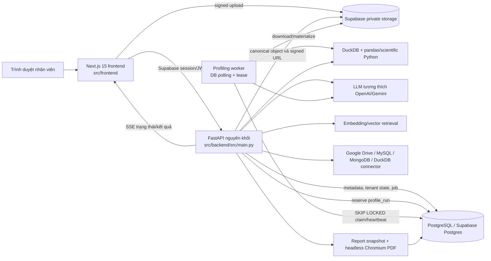

# Báo cáo kiểm toán toàn diện mức độ sẵn sàng sản xuất của VDaAgent

**Ngày kiểm toán gốc:** 2026-09-14
**Cập nhật toàn diện theo code hiện tại:** 2026-09-15
**Mục tiêu:** MVP nội bộ doanh nghiệp, xử lý dữ liệu thật của công ty
**Phạm vi:** Mã nguồn, migration, cấu hình, CI/CD, image triển khai, kiểm thử, tài liệu và các bước xác minh có thể thực hiện cục bộ. Bản cập nhật này đã rà lại toàn bộ kết luận sau P0-01 và implementation P0-04; không coi test chỉ tồn tại trong repo là bằng chứng đã chạy, và không coi kiểm tra tĩnh là bằng chứng runtime PostgreSQL/staging.

# 1. Tóm tắt điều hành

## Kết luận: **CHƯA SẴN SÀNG (NOT READY)**

**Điểm sẵn sàng: 52 / 100**

| Khía cạnh | Điểm | Đánh giá |
| --- | ---: | --- |
| Mức độ hoàn thiện sản phẩm | 6 / 9 | Đã có tải lên, profiling, phân tích, so sánh, báo cáo, lưu trạng thái và UI owner/analyst. Luồng mời thành viên, visibility/governance báo cáo, xóa dữ liệu và một số đường phục hồi vẫn chưa hoàn chỉnh. |
| Kiến trúc | 4 / 8 | Mô hình một API cùng một worker riêng phù hợp với MVP. Tuy nhiên, các module quá lớn, API cũ chạy song song và việc thay đổi schema lúc runtime khiến hệ thống khó suy luận. |
| Bảo mật | 7 / 14 | JWT, tenant scoping và mô hình owner/analyst đã được cải thiện đáng kể. Connector DuckDB truy cập file máy chủ, egress connector không hạn chế, published-report visibility sai, thiếu xác minh direct upload và dependency frontend có lỗ hổng vẫn là blocker phát hành. |
| Độ tin cậy | 5 / 11 | Thiết kế job trong cơ sở dữ liệu với lease/retry khá tốt, nhưng mất lease không dừng công việc đang chạy và thao tác xóa không thể phục hồi xuyên biên DB/storage. |
| Tính đúng đắn dữ liệu | 6 / 10 | Artifact chuẩn hóa, hash, version, constraint và phân tích xác định là các nền tảng tốt. Khóa tenant cho phép `NULL`, schema bị khai báo trùng và evidence bị tách khỏi nguồn làm suy yếu bảo đảm. |
| Độ tin cậy AI | 6 / 11 | Tính toán xác định và bản ghi evidence là điểm mạnh đáng kể. Câu trả lời định tính vẫn có thể được gắn `verified` chỉ sau khi kiểm tra phạm vi citation, còn verifier độc lập chưa thể thực thi chặn. |
| Hiệu năng | 4 / 7 | Mặc định sampling và concurrency của worker hợp lý. Full scan, materialize lặp lại, export DuckDB không giới hạn và polling theo từng client chưa được giới hạn an toàn. |
| Kiểm thử | 5 / 8 | Độ bao phủ unit/API/frontend khá rộng và đã bổ sung matrix/API/concurrency/migration test cho owner. Tuy nhiên backend test chưa chạy được do thiếu PostgreSQL test riêng/dependency, không có kiểm thử full-stack thật và E2E vẫn còn hai ca lỗi. |
| Quan sát hệ thống | 2 / 7 | Đã có correlation ID, audit record và các trường job hữu ích. Health check còn nông; chưa có metric, cảnh báo, structured log thực sự và theo dõi exception. |
| UX | 3 / 6 | Trạng thái tác vụ dài và cách trình bày evidence được làm kỹ. Luồng mời thành viên là ngõ cụt, trạng thái báo cáo gây hiểu nhầm, giới hạn hỗ trợ không rõ và phạm vi giao diện quá lớn cho v1. |
| Triển khai | 2 / 5 | Contract `src/backend`/`src/frontend` đã đồng bộ ở Make, Alembic, Docker, CI và bootstrap, được bảo vệ bằng layout guard. Chưa có bằng chứng build/chạy image, migration smoke PostgreSQL hay deploy từ checkout sạch. |
| Khả năng bảo trì | 2 / 4 | Tài liệu phong phú và nhiều boundary được đặt tên tốt, nhưng module nguyên khối, artifact sinh ra được commit vào Git và schema trùng lặp vẫn làm tăng mạnh rủi ro thay đổi. |

Sản phẩm chưa nên nhận dữ liệu thật của nhân viên. Nguyên nhân không phải toàn bộ ứng dụng cần viết lại. Kiến trúc cốt lõi—Next.js, một FastAPI API, PostgreSQL, object storage riêng tư và worker polling cơ sở dữ liệu—là kiến trúc MVP hợp lý, đơn giản có chủ đích. Repo cũng đã có nhiều nền tảng hướng production mà prototype thường thiếu: xác minh JWT bất đối xứng, truy vấn repository theo workspace, artifact bất biến, hash idempotency, job lease, phục hồi job stale, evidence object, summary nhận biết PII và audit event.

Các điểm mạnh đó hiện bị giới hạn bởi một nhóm blocker cụ thể:

- P0-04 đã khôi phục `owner`/`analyst`, tách System Admin khỏi workspace role, khóa thao tác nhạy cảm cho Owner và bảo vệ “effective Owner” cuối cùng bằng transaction + lock order toàn cục. Đây không còn là lỗi authorization đã biết ở mức source; phần migration/concurrency vẫn chưa có bằng chứng chạy trên PostgreSQL thật.
- Connector DuckDB nhận đường dẫn filesystem của máy chủ và query `SELECT`/`WITH` chỉ được phân loại bằng regex. Table function của DuckDB có thể biến cơ chế này thành kênh đọc file cục bộ của máy chủ. Đích MySQL và MongoDB cũng không có kiểm soát outbound network.
- Report submit đã chuyển sang `in_review` và Analyst không còn publish được. Tuy nhiên các route có tên/quyền “published” vẫn đọc với `published_only=False`, Owner có thể publish thẳng từ `draft`/`in_review`, và UI vẫn hiển thị `in_review` là “Đã xuất bản”.
- Metadata dataset được commit là đã xóa trước khi object trong storage được xóa. Nếu storage lỗi, hệ thống tạo object dữ liệu mật bị bỏ rơi mà không còn bản ghi DB để đối soát.
- Worker mất lease vẫn tiếp tục thực thi. Bước complete cuối được fence bằng token nhưng các lần ghi trung gian không được bảo vệ, cho phép worker giữ lease cũ và worker nhận lease mới chạy chồng lấn.
- Luồng AI định tính cốt lõi coi “có một citation hợp lệ trong phạm vi” là `verified`; điều đó không chứng minh từng claim có nguồn hỗ trợ.
- Chưa có quy trình backup/restore đã kiểm chứng, retention scheduler chạy production hoặc lớp alert/readiness.
- Dependency frontend đã cài đặt báo cáo advisory critical/high, trong khi bằng chứng release hiện đang đỏ: backend test không khởi động, E2E lỗi hai ca và scorecard của repo là `NOT_APPROVED`.

> **Cập nhật 2026-09-15 — P0-01:** contract path đã được sửa ở cấu hình tĩnh: `PROJECT_ROOT` fail-fast về repository root, Alembic/Docker/Makefile/CI/bootstrap dùng `src/backend` và `src/frontend`, và `scripts/check_repository_layout.py` phát hiện tái phát legacy path. Đây không còn là blocker độc lập, nhưng vẫn cần bằng chứng image + PostgreSQL + CI từ checkout sạch trước khi coi release path đã được chứng minh end-to-end.
>
> **Cập nhật 2026-09-15 — P0-04:** implementation owner/analyst đã có đầy đủ ở permission matrix, provisioning, migration `20260915_0027`, membership/profile/account invariant, API/OpenAPI/UI và test source. Static checks cùng E2E role pass; vì `P170_TEST_DATABASE_URL` chưa được cấu hình, migration và concurrency test PostgreSQL chưa được chạy thực tế. Trạng thái đúng là **implemented, pending PostgreSQL release evidence**, không phải “đã đóng hoàn toàn” và cũng không còn là Critical source finding.

**Ưu tiên triển khai tiếp theo:** P0-05/B-03 — vô hiệu hóa database connector không an toàn trong pilot. `docs/implementation_plan.md` đã mô tả hướng fail-closed, nhưng code hiện vẫn expose MySQL/MongoDB/DuckDB qua service, hai họ route, request schema/OpenAPI và UI MongoDB; plan chưa được triển khai.

Với chương trình P0/P1 tập trung, ứng dụng có thể trở thành pilot nội bộ có kiểm soát mà không cần microservice, Kubernetes, Kafka hay thiết kế lại toàn bộ. Phạm vi v1 nên hẹp hơn: workspace có xác thực với vai trò owner/analyst, upload CSV/TSV/Parquet/JSON, profiling ưu tiên sampling, chart xác định và Q&A bị giới hạn, snapshot evidence, báo cáo từ draft đến approved, cùng tối đa một connector import an toàn.

## Các bước xác minh đã thực hiện

| Hạng mục | Kết quả | Bằng chứng/giới hạn |
| --- | --- | --- |
| Layout guard repository | **PASS** | `python scripts/check_repository_layout.py` xác minh root marker, entry point, contract Docker/CI và từ chối các executable legacy path đã biết. |
| Biên dịch cú pháp Python | **PASS** | `python -m compileall -q src\backend scripts tests`. |
| Lint Python | **PASS** | `uvx ruff check`; `pyproject.toml` đã include `src/backend/**/*.py`. |
| Make target dry-run | **BỊ CHẶN** | Máy Windows kiểm toán không có chương trình `make`; path/quoting được kiểm tra tĩnh bởi layout guard, nhưng các target cmd.exe chưa được dry-run ở đây. |
| Root-resolution regression | **PASS** | 4/4 case trong `tests/test_configuration_paths.py` pass khi chạy độc lập với `PYTHONPATH=src/backend`; bao phủ repo root, `src/backend`, image layout `/app` và layout không hoàn chỉnh. |
| P0-04 source/static review | **PASS CÓ ĐIỀU KIỆN** | Source inspection xác nhận owner/analyst least privilege, effective-owner invariant, lock ba pha, guest policy, report submit `in_review`, OpenAPI/UI và fail-closed role. Hai Playwright role case pass. Backend matrix/API/concurrency/migration test có trong repo nhưng chưa được chạy trong lần xác minh này. |
| Backend test | **BỊ CHẶN** | `python -m pytest -q` dừng fail-closed vì chưa đặt `P170_TEST_DATABASE_URL`; môi trường cũng chưa có package `langgraph`. `tests/conftest.py` đã dùng đúng `src/backend`; đây không còn là lỗi path. |
| Phát hiện Alembic | **PASS** | `uvx --from alembic alembic -c alembic.ini heads` trả `20260915_0027 (head)`; repo có 28 migration. |
| Import/khởi động backend và live health | **BỊ CHẶN** | `PYTHONPATH=src/backend python -c "import src.main"` vẫn cần dependency production `langgraph`; chưa có database/`.env` cô lập nên không chạy API/worker health. Docker path đã được sửa nhưng chưa có image để kiểm tra runtime. |
| Cài frontend | **PASS** | `pnpm install --frozen-lockfile` trong `src/frontend` (558 package). |
| Typecheck frontend | **PASS** | `pnpm typecheck`. |
| Lint frontend | **PASS** | `pnpm lint`. |
| Unit/component test frontend | **PASS** | 23 file pass, 1 file skip; 84 test pass, 1 test skip. |
| Production build frontend | **PASS** | `pnpm build`; 30 route, shared first-load JS khoảng 102 kB. Còn cảnh báo Next.js về ESLint plugin configuration. |
| E2E frontend | **FAIL** | Full Playwright chạy lại: 18/20 pass. Hai role E2E mới đều pass, gồm Analyst không truy cập quản lý thành viên. Hai lỗi còn ở `tests/charts-pin-optimistic.spec.ts`: không tìm thấy `.chart-pin-button` khi điều hướng trực tiếp `/charts`; `src/frontend/src/middleware.ts::appPaths` vẫn bỏ sót `/charts`. |
| Audit dependency production frontend | **FAIL** | `pnpm audit --prod --json` chạy lại: 2 advisory critical trên Next 15.5.22 và 1 advisory high trên Sharp 0.35.3 gián tiếp. |
| Audit dependency production Python | **PASS CÓ GIỚI HẠN** | `uvx pip-audit -r requirements.azure.txt --progress-spinner off` không tìm thấy lỗ hổng đã biết, nhưng các range được resolve mới thay vì audit từ lock; `torch==2.7.1+cpu` cũng không thể audit từ PyPI. |
| Build container | **CHƯA CHẠY** | Docker daemon cục bộ không hoạt động. Kiểm tra tĩnh xác nhận backend copy `src/backend` vào `/app/src/backend`, frontend dùng context `src/frontend`, nhưng build/run image chưa được chứng minh. |
| Release gate của repo | **CHƯA ĐƯỢC PHÊ DUYỆT** | `evaluations/scores/release_gate_results.json` ghi `all_gates_pass=false`, `release_approval=NOT_APPROVED`, `status=DRAFT_NOT_APPROVED`; còn thiếu metric calibration cho forecasting/planner. |

# 2. Kiến trúc hiện tại



## Các thành phần runtime

- **Frontend:** ứng dụng Next.js App Router trong `src/frontend`, gồm Supabase browser/server auth client, state phía client kiểu TanStack Query, API wrapper trong `src/frontend/src/lib/api.ts`, route middleware, Playwright E2E dùng mock, trang public/legal và các trải nghiệm dataset/profile/chart/chat/report/admin đã xác thực.
- **Backend:** một tiến trình FastAPI trong `src/backend/src/main.py`, mount các router có version `/api/v1`. Route đã được tách một phần theo domain, nhưng `src/backend/src/api/routes.py` (3.212 dòng) và `analysis_routes.py` vẫn là các module orchestration lớn.
- **Lưu trữ metadata:** SQLAlchemy Core metadata và repository method trong `src/backend/src/services/repository.py` (7.520 dòng), chạy trên PostgreSQL. Alembic có 28 migration trong `src/backend/migrations`.
- **Object storage:** object dataset chuẩn hóa được lưu riêng tư trong Supabase Storage ở production. Metadata lưu bucket/key, kích thước, content type, source version và—trừ direct upload từ trình duyệt—SHA-256.
- **Profiling:** API tạo job `profile_runs` bền vững. Worker riêng polling PostgreSQL, claim bằng `FOR UPDATE SKIP LOCKED`, heartbeat lease, chạy pipeline LangGraph/profiling, lưu stage/kết quả và mở một TCP health endpoint nhỏ.
- **Phân tích/AI:** các đường DuckDB/statistics/tool xác định tính câu trả lời định lượng và chart; LangGraph/LLM đảm nhiệm routing, tổng hợp retrieval, tinh chỉnh semantic type và giải thích. Agent run, trace, evidence, hash prompt/model/tool và report snapshot được lưu.
- **Báo cáo:** báo cáo chứa item/snapshot được lưu và có endpoint lifecycle/export. Tạo PDF bằng headless Chromium với giới hạn concurrency theo process.
- **Ý định triển khai:** image backend/frontend bất biến trong Azure Container Registry, ba Azure App Service (frontend, API, worker), chạy Alembic trước khi restart ứng dụng, đăng nhập Azure bằng OIDC và tag image theo SHA commit. Contract đường dẫn tĩnh của topology này đã được đồng bộ; việc build/chạy/deploy thực tế vẫn cần được chứng minh.

## Các boundary quan trọng

- Supabase xác thực người dùng; API xác minh JWT và là boundary phân quyền/data plane.
- Browser role bị migration `20260831_0022_data_api_boundary.py` từ chối truy cập trực tiếp bảng SQL; backend dùng service credential để truy cập dữ liệu.
- Workspace ID cùng membership của người dùng đã xác thực là boundary tenant. Phần lớn truy vấn repository có predicate workspace phù hợp.
- PostgreSQL vừa là system of record vừa là hàng đợi job MVP. Đây là lựa chọn phù hợp ở quy mô hiện tại.
- Object storage và database là hai hệ giao dịch riêng. Luồng xóa hiện tại chưa bắc cầu qua boundary này một cách an toàn.

# 3. Những phần đã làm tốt

Các phần dưới đây nên được giữ lại và gia cố, không nên viết lại.

1. **Xác minh authentication tốt hơn đáng kể so với một bản demo.** `src/backend/src/services/auth.py` xác minh JWT Supabase bất đối xứng ES256/RS256 bằng JWKS/key cục bộ, kiểm tra issuer/audience/expiry, yêu cầu email được xác nhận ở production, giới hạn thời gian gọi từ xa và kiểm tra trạng thái tài khoản active. Hệ thống không tin identity do frontend tự gửi.

2. **Tenant scoping phía backend được áp dụng rộng.** `RequestContext`, `require_permission` và repository API thường mang `workspace_id`; lookup dataset, job, report, chart, conversation và connector đều dùng giá trị này. Không phát hiện IDOR cross-workspace trực tiếp trong các object route đã kiểm tra. Lỗi phân quyền chính là quyền lực bên trong workspace, không phải thiếu tenant boundary.

3. **Data boundary production hợp lý về mặt thiết kế.** `src/backend/migrations/versions/20260831_0022_data_api_boundary.py` bật RLS, thu hồi quyền table/sequence/default của `PUBLIC`, `anon`, `authenticated` và coi API là data plane. `scripts/assert_database_security.py` là kiểm tra invariant hữu ích sau khi sửa đường dẫn import và môi trường chạy.

4. **Canonical ingestion có semantics tốt về integrity và idempotency.** `DatasetIngestionService.reserve` hash input ổn định; object key theo tenant/dataset/artifact và bất biến; migration `20260906_0026_canonical_ingestion_state_machine.py` thêm foreign key, status constraint, uniqueness và partial unique index cho current ready artifact. Proxy upload tính SHA-256 và xác minh kích thước trong storage trước khi finalize.

5. **Hàng đợi profiling đủ bền vững cho MVP.** `Repository.claim_next_profile_job`, heartbeat, complete, fail và recovery dùng row lock, claim token, lease, attempt count, `available_at`, backoff, checkpoint và idempotency key. API restart không làm mất job. V1 chưa cần broker riêng.

6. **UX cho tác vụ dài có nhận biết trạng thái.** Profiling và agent dùng trạng thái được lưu cùng SSE có keepalive/polling fallback. UI phân biệt queued/running/retrying/failed/review/completed và có khả năng dựng lại trạng thái sau refresh tốt hơn hệ thống task thuần in-memory.

7. **Tính toán xác định là đường xử lý hạng nhất.** `src/backend/src/services/compute.py`, query DuckDB, statistical tool, chart validation và `src/backend/src/services/qa_validation.py` giữ nhiều phép tính số học bên ngoài LLM. Câu trả lời xác định được kiểm tra value, unit, scope, approximation và source run trước khi gửi.

8. **Evidence không chỉ là badge trên UI.** Schema lưu evidence item, agent run/trace, source/run ID, execution context/query, result snapshot, hash, timing, thông tin model/tool và report snapshot. Nhãn Official/Preview cùng affordance review là nền tảng sản phẩm tốt.

9. **Đã có hành vi AI/log nhận biết PII.** Profiling không thu top value cho PII đã phát hiện, API mặc định mask PII, nội dung untrusted được cô lập trong prompt, có input/output guardrail và câu hỏi người dùng được hash trong audit log trừ khi cấu hình khác. LangSmith integration được thiết kế thiên về metadata.

10. **Cấu hình cố gắng fail closed.** `src/backend/src/config.py` từ chối local storage, thiếu Supabase credential, cho phép email chưa xác nhận, thiếu datasource encryption và các mode agent/planner chưa hoàn thiện trong production. Feature chưa xong không tự hoạt động chỉ vì table của nó tồn tại.

11. **Proxy upload dùng streaming.** API ghi chunk có giới hạn ra đĩa tạm thay vì đọc toàn bộ request 500 MB vào RAM, áp giới hạn cho authenticated/guest và xóa file tạm.

12. **Tài liệu và bằng chứng release thẳng thắn hơn thông thường.** Tài liệu kiến trúc/vận hành nêu known limitation; scorecard dạng máy đọc được lưu kết quả thay vì trình bày mọi run như đã được phê duyệt. Cần giữ đặc tính này trong quy trình release.

13. **Chất lượng tĩnh của frontend hiện tốt.** Typecheck, lint, unit/component test và production build đều pass. Ứng dụng có loading/error/empty state, kiểm thử responsive, label form có ngữ nghĩa, dialog và cách trình bày evidence hữu ích.

14. **Cơ chế release dự kiến có nhiều quyết định đúng.** Tag image theo commit SHA, backend runtime non-root, migration trước deploy, health verification, OIDC login và worker plan always-on riêng đều phù hợp. Cần sửa chúng khớp repo, không cần thay Azure App Service.

15. **P0-04 đã thiết lập least privilege thực sự ở mức source.** Workspace role chỉ còn `owner`/`analyst`; System Admin không được thừa hưởng quyền workspace; unknown/legacy role fail closed. Creator/self-signup/bootstrap đầu tiên nhận Owner, guest luôn là Analyst, và việc đổi membership/profile/account dùng effective-owner invariant với lock order toàn cục workspace → membership → profile. Frontend dựa trên effective permission và Analyst E2E không vào được quản lý thành viên.

# 4. Những phần không cần thiết / thiết kế quá mức

| Thành phần | Vì sao không cần thiết | Tác động | Khuyến nghị |
| --------- | --------------------- | ------ | -------------- |
| Catalog khoảng 28 thuật toán forecasting | Bộ dependency Azure cố ý bỏ nhiều framework nặng trong khi sản phẩm/UI quảng bá catalog lớn; metric calibration phát hành còn thiếu. MVP profiling nội bộ không cần một “model zoo”. | Image/runtime nặng, availability khó hiểu, tăng ma trận test và claim thiếu tin cậy. | **SIMPLIFY:** hoãn forecasting hoặc chỉ giữ naive, seasonal-naive và tối đa một phương pháp cổ điển sau khi calibration. |
| Các bề mặt planner, agent-job, long-term-memory, MCP/skill runtime đang bị tắt | Cấu hình đã đúng khi chặn các capability chưa hoàn thiện, nhưng schema/runtime/code và khái niệm UX vẫn tạo thêm gánh nặng trước khi Q&A cốt lõi đáng tin. | Tăng scope và cognitive load mà chưa mang lại giá trị người dùng. | **KEEP DISABLED / POSTPONE:** chỉ giữ interface tối thiểu cần cho trace hiện tại; ngừng mở rộng đến khi pilot pass. |
| API cũ `/datasets/datasource*` song song với lifecycle API `/connectors*` | Cả hai mô hình hóa MySQL/MongoDB/DuckDB chồng lấn, frontend dùng cả hai thế hệ. | Trùng validation, auth, error và migration behavior. | **MERGE:** chọn `/connectors*` là API duy nhất rồi migrate/xóa call cũ trước MVP. |
| Runtime `metadata.create_all` cùng nhiều helper `_migrate_*` trong `repository.py` | Đã có Alembic. Một đường schema evolution imperative thứ hai che lỗi migration và khiến schema dev/test khác production. | Schema drift và test pass giả. | **REMOVE AFTER TEST HARNESS FIX:** dùng Alembic làm schema authority duy nhất, có bootstrap riêng cho test DB tạm. |
| `repository.py`, `api/routes.py` và frontend `lib/api.ts` nguyên khối | Các file này sở hữu nhiều domain không liên quan và dài hàng nghìn dòng; review và thay đổi an toàn trở nên khó khăn. | Rủi ro regression cao, ownership/navigation chậm. | **REFACTOR INCREMENTALLY:** tách theo dataset/job, workspace/authz, agent/evidence và report mà không đổi topology. |
| 1.849 evaluation artifact được track trong `evaluations/` (~35,5 MiB) | Phần lớn là output từng run, không phải baseline tuyển chọn hay fixture có thể thực thi. | Repo phình, diff/search nhiễu, score nguồn chuẩn không rõ. | **REMOVE/MOVE:** giữ schema, harness, golden case đại diện và release scorecard hiện tại; lưu full run dưới dạng CI artifact/object storage. |
| Dataframe cache process-local không dùng trong `profiling_nodes.py` | `_dataframes`, `cache_dataframe`, `get_dataframe` không có call nạp; chỉ có global clear được gọi. | Code gây hiểu nhầm và tiềm ẩn rủi ro memory cross-tenant nếu sau này dùng lại tùy tiện. | **REMOVE NOW** thay vì xây cache trước khi có nhu cầu đo được. |
| Standalone chat, floating copilot, chart insight và nhiều điểm vào phân tích | Chúng chồng lấn cùng một trải nghiệm câu hỏi kinh doanh/evidence. | Người dùng không biết câu trả lời nào chính thức; nhiều state path cần test. | **SIMPLIFY UX:** lấy context dataset/profile cùng một analysis workspace làm luồng chính; chart insight chỉ là action theo ngữ cảnh. |
| UI dataset mới gần như chỉ hỗ trợ/ghi nhãn saved connector là MongoDB trong khi backend hỗ trợ ba loại | Đây không phải phạm vi hẹp sạch sẽ cũng không phải trải nghiệm đa connector hoàn chỉnh. | UI chết/dở dang và phạm vi hỗ trợ mơ hồ. | **NARROW:** ẩn external DB connector trong pilot, trừ khi một provider được sandbox và hỗ trợ end-to-end đầy đủ. |

# 5. Những năng lực còn thiếu

| Năng lực còn thiếu | Vì sao quan trọng | MVP bắt buộc? | Ưu tiên |
| ------------------ | -------------- | ------------- | -------- |
| Bằng chứng PostgreSQL cho migration/concurrency owner invariant | P0-04 đã có ở source, nhưng chưa chứng minh migration backfill và row-lock behavior trên PostgreSQL thật. | Có trước release | P0 evidence |
| Egress policy cho connector và sandbox/xóa DuckDB | Network target do người dùng kiểm soát và query file máy chủ có thể lộ hạ tầng/dữ liệu. | Có nếu ship connector | P0 |
| Xóa dataset có khả năng phục hồi/outbox và đối soát orphan | Lỗi storage có thể để object mật tồn tại vĩnh viễn nhưng không được theo dõi. | Có | P0 |
| Hủy/fencing khi mất lease cho mọi mutation của worker | Hai worker có thể tác động cùng một run sau lease recovery. | Có | P0 |
| Đường build, migration, CI, test và image có thể tái lập | Kỹ sư khác không thể release an toàn cây mã hiện tại. | Có | P0 |
| Dependency graph Python production được lock | Resolve theo range khiến release không tái lập và kết quả vulnerability không có tính quyết định. | Có | P1 |
| Phục hồi database/object đã kiểm thử với RPO/RTO rõ ràng | Không thể nhận dữ liệu công ty nếu không biết có thể phục hồi hay không. | Có | P0 |
| Retention scheduler thật và xác minh xóa | Chỉ có helper function không đồng nghĩa policy được thực thi. | Có | P1 |
| Xác minh theo từng claim cho câu trả lời AI định tính | `verified` hiện chỉ nghĩa là citation tồn tại, không phải mọi claim đều có bằng chứng. | Có với sản phẩm evidence-first | P0 |
| Gửi invitation và UI nhận token | UI báo thành công nhưng token bị bỏ đi, người dùng không thể join qua sản phẩm. | Có nếu ship shared workspace | P1 |
| Liveness/readiness tách biệt, metric, alert và exception monitoring | Operator không phát hiện DB chết, queue kẹt, worker mất, failure tăng hoặc storage cạn. | Có | P1 |
| Smoke test full-stack thật | Browser test dùng mock route không chứng minh Auth → Storage → DB → worker → result → UI. | Có | P1 |
| Xác minh content direct upload và trạng thái quarantine | Object hỏng/giả MIME đúng size/extension trở thành profileable trước khi parse. | Có nếu ship direct upload | P1 |
| Quota theo workspace và rate/cost enforcement dùng chung | Limit theo process bị bypass giữa replica và không chặn chi phí LLM/storage/compute. | Có | P1 |
| Giới hạn file/row/column/full-scan hiển thị cho người dùng | Nếu không, người dùng chỉ biết giới hạn qua lỗi và có thể khởi chạy full scan không an toàn. | Có | P1 |
| Thông báo provider/data-use và policy cấp enterprise | Tên cột, thống kê, top value không gắn PII, câu hỏi và evidence có thể được gửi tới LLM ngoài. | Có | P1 |
| Hủy profiling job và deadline task | User/operator không thể dừng job treo hoặc vô tình quá tốn kém. | Có | P1 |
| Pagination cursor/limit cho danh sách dataset/report/workspace tăng dần | List không giới hạn sẽ chậm và lớn theo thời gian. | Chưa cần cho pilot rất nhỏ | P2 |

# 6. Những phần sai hoặc mong manh

| Vấn đề | Vị trí | Kịch bản lỗi | Mức độ | Cách sửa khuyến nghị |
| ------- | -------- | ---------------- | -------- | --------------- |
| P0-01 path contract đã được sửa nhưng chưa có bằng chứng runtime end-to-end | `config.py`, Alembic, Makefile, Dockerfile, workflow, bootstrap script/test, `check_repository_layout.py` | Legacy path đã bị loại và guard pass, nhưng Docker image, API/worker health, migration trên PostgreSQL rỗng và workflow thực tế chưa chạy trong môi trường này. | **MEDIUM** | Giữ guard; chạy build/run hai image và migration/security/full-backend suite trên PostgreSQL disposable từ checkout sạch, rồi lưu artifact CI/staging. |
| Push production bỏ qua quality job | Điều kiện `backend-quality/frontend-quality` trong workflow Azure | Push trực tiếp vào `main` có thể deploy mà workflow này không chạy test; an toàn phụ thuộc branch protection bên ngoài repo. | **HIGH** | Deploy phải phụ thuộc quality job pass trên mọi release event; tài liệu hóa và xác minh branch protection. Xóa hoặc kiểm soát chặt `skip_quality`. |
| P0-04 đã sửa authorization nhưng chưa có runtime evidence PostgreSQL | `permissions.py`, owner helpers trong `repository.py`, migration `20260915_0027`, backend tests | Static/source review và E2E role pass không chứng minh `FOR UPDATE`, deadlock avoidance, backfill guest/archived hay last-owner conflict trên PostgreSQL thật. | **HIGH cho release evidence; không còn Critical source bug đã biết** | Chạy migration từ schema trước `0027`, matrix/API test và hai concurrency test trên PostgreSQL disposable; lưu log/artifact CI. |
| Token invitation bị bỏ đi, không có UI accept | `src/backend/src/api/authz_routes.py::invite_member`; repository `create_invitation`; frontend không dùng `/invitations/accept` | UI nói đã gửi lời mời nhưng email/link không tới invitee và accept endpoint không thể dùng thực tế. | **HIGH** | Chỉ đưa token cho dịch vụ gửi tin cậy, gửi link ngắn hạn, thêm UI accept, resend/revoke/audit và không log token. |
| Report lifecycle mới chỉ sửa một phần | `repository.py::{submit_report,review_report,publish_report}`; report routes/UI | Submit đã vào `in_review` và chỉ Owner có quyền review/publish, nhưng publish chấp nhận cả `draft`/`in_review`, không bắt buộc approved hoặc separation-of-duties; UI vẫn gọi `in_review` là đã xuất bản. | **HIGH** | Chỉ publish version `approved`, quyết định policy self-review, sửa status copy/UI và test transition âm/dương. |
| Reader “published report” truy vấn bản chưa publish | `authz_routes.py::list_published_reports`, `get_published_report`, `get_published_report_export_source` truyền `published_only=False` | Member có quyền published-read/export nhận được draft/in-review. | **HIGH** | Query theo status; tách quyền đọc draft của author với quyền đọc published của workspace; thêm negative authz test. |
| DuckDB path/query không phải boundary read-only an toàn | `services/datasource.py::_duckdb_config`, `_read_only_query`, `_materialize_duckdb` | Member chọn file `.duckdb` trên server rồi dùng file-reading table function để đọc file khác; regex chỉ chặn một số keyword. | **CRITICAL** | Xóa server-path DuckDB khỏi MVP. Nếu giữ, chỉ nhận tenant artifact đã upload, jail path, tắt external access/extension, dùng query model có cấu trúc và chạy trong sandbox filesystem/network. |
| Đích connector không có host/egress policy | `datasource.py::_mysql_engine`, `_mongo_config`, `probe`; connector route | Owner có thể probe private/link-local/loopback service hoặc kết nối database ngoài không được phê duyệt từ network API. Least privilege giảm số actor nhưng không đóng network boundary. | **HIGH** | Disable connector theo P0-05; nếu đưa lại, resolve/validate host, chặn private/link-local/metadata trừ allowlist và dùng network egress control. |
| Xóa dataset commit metadata trước object | `repository.py::delete_dataset`; `api/routes.py::delete_dataset` | Storage delete lỗi sau khi row đã mất; response có `deleted_file=false` nhưng không còn durable record để retry/discover. | **HIGH** | Dùng trạng thái `deleting` + transactional outbox/tombstone; xóa object idempotent; chỉ finalize metadata sau success; chạy reconciliation định kỳ. |
| Mất lease không hủy job | `workers/profiling_worker.py::_heartbeat`, `_execute_claimed`; service/repository mutation | Worker A mất lease, worker B recover, nhưng A vẫn tiếp tục graph và ghi trung gian. Chỉ `complete/fail` cuối được fence bằng claim token. | **HIGH** | Truyền ownership/cancellation token qua graph, bắt buộc claim token hiện tại cho mọi mutation/checkpoint và dừng ngay khi heartbeat thất bại. |
| Finalize direct upload không xác minh byte/hash | `services/ingestion.py::finalize_signed_upload`; `api/routes.py::{create_upload_session,finalize_upload_session}` | Client upload content hỏng/giả đúng kích thước; dataset thành ready với `content_sha256=None`, chỉ lỗi sau khi profiling. | **HIGH** | Stream-inspect magic/parser schema, tính SHA-256 phía server, quarantine đến khi validation pass và xóa object lỗi. |
| Full-scan có thể materialize dataframe 500 MB, 200 cột | `services/compute.py::load_dataset`; mặc định upload/security | User chọn full scan và làm worker hết RAM hoặc container restart/retry liên tục. | **HIGH** | Bắt buộc sample với input lớn, ước lượng memory, thêm cap row/byte/time, resource limit container và hiển thị giới hạn trên UI. |
| Export DuckDB connector không giới hạn | `datasource.py::_materialize_duckdb` | `COPY (query)` lấp đĩa tạm hoặc chạy vô hạn; khác MySQL/Mongo, không có row cap. | **HIGH** | Áp `LIMIT` có cấu trúc, quota output byte, statement timeout/cancel, temp-disk quota—hoặc không ship connector. |
| Câu trả lời định tính có thể bị gắn `verified` sai | `agents/nodes/qa_nodes.py::qa_vector_node` | Answer chứa một `[S1]` hợp lệ cùng claim/number không được hỗ trợ; kiểm tra citation pass và `evidence_status` thành `verified`. | **HIGH** | Parse claim, bind từng claim quan trọng/số với evidence, verify số bằng code, hạ unsupported narrative xuống `interpretation`/`insufficient_evidence` và phản ánh đúng trên UI. |
| Verifier độc lập chưa thể enforce | `config.py` từ chối `agent_verifier_mode == "enforce"`; API chỉ lưu kết quả shadow | Verifier reject nhưng user vẫn nhận answer vì mode mặc định `shadow` không chặn. | **HIGH** | Ship verifier xác định có thể enforce với regression gate, hoặc bỏ chữ “verified” khỏi path chưa được bảo vệ. |
| LLM client chính thiếu overall/read timeout rõ ràng | `services/llm.py::get_llm` | Socket provider bị treo vượt budget logic 25 giây; invoke đồng bộ block đến timeout mặc định của client/provider. | **MEDIUM** | Cấu hình connect/read/overall timeout và retry budget ở client, dùng async có cancellation và căn với request/job budget. |
| Hàm retention không có caller production | `repository.py::purge_expired_deleted_conversations`, `purge_expired_guest_workspaces`; tài liệu vận hành | Record được hứa sẽ expire vẫn tồn tại vô hạn nếu operator không tự chạy code. | **HIGH** | Thêm scheduled command/job có dry-run, audit, batch giới hạn, cleanup storage, metric và test. |
| Tenant key vẫn nullable trên core table cũ | Khai báo/migration `datasets.workspace_id`, `profile_runs.workspace_id` trong `repository.py` | Insert cũ hoặc sai tạo row không tenant, không truy cập được và vi phạm ownership invariant. | **MEDIUM** | Backfill/quarantine row null, xác minh không orphan rồi đặt `NOT NULL`; thêm composite tenant FK khi hữu ích. |
| Runtime schema helper có thể lệch Alembic | Metadata và `_migrate_*` trong `services/repository.py`; 28 migration Alembic | Test/local start pass vì Python tự sửa schema trong khi production Alembic thiếu thay đổi đó, hoặc ngược lại. | **HIGH** | Chỉ tạo/test schema qua Alembic; thêm kiểm tra schema-head và invariant model-vs-migration. |
| Correlation ID có thể khác giữa body và header | `main.py::_request_correlation_id`, timing middleware, exception handler | Incoming ID thiếu/sai tạo một UUID ở middleware và UUID khác trong exception body, làm khó điều tra. | **MEDIUM** | Tạo một lần, lưu `request.state.correlation_id`, tái sử dụng cho handler/log/header. |
| Text của `ValueError` tổng quát được trả về client | Exception handling trong `main.py` | `ValueError` bất ngờ có thể lộ path, parser detail hoặc provider message nội bộ. | **MEDIUM** | Map domain validation exception tường minh; lỗi không biết trả response ổn định cùng request ID. |
| Rate limiter process-local, không giới hạn cardinality principal | `services/security.py::RateLimiter`; dùng không đồng đều ở route | User bypass quota qua replica; nhiều actor ID làm dictionary lớn; upload session/connector probe/LLM cost path chưa được limit nhất quán. | **HIGH** | Dùng shared store hoặc DB token bucket theo user/workspace/action có TTL, quota, `Retry-After`; thêm budget storage/LLM/job. |
| Health endpoint báo process sống thay vì dependency sẵn sàng | `main.py::health`; `profiling_worker.py::_serve_health`; frontend `/health` | API/worker trả 200 khi DB/storage lỗi hoặc worker loop lâu không claim/heartbeat. | **HIGH** | Tách liveness/readiness; kiểm tra DB có timeout, storage config/access, migration head, queue loop recency và last successful claim/heartbeat. |
| Route classification bỏ `/charts` và các app surface khác | `src/frontend/src/middleware.ts::appPaths` | E2E direct-navigation dùng mock bị redirect login; refresh/auth behavior khác theo trang. | **MEDIUM** | Định nghĩa ownership public/authenticated route một lần, gồm mọi app route và test logged-in/logged-out/expired/direct refresh. |
| Trường `extra` trong log bị formatter mặc định bỏ qua | Logging config `main.py` so với các call `logger.*(..., extra={...})` | Operator chỉ thấy event name, không thấy workspace/job/latency dự kiến dùng cho dashboard. | **MEDIUM** | Emit JSON log bằng formatter serialize approved extras và redact secret/PII; xác minh output production mẫu. |

# 7. Kiểm toán bảo mật

## Đã khắc phục ở mức source, còn gate PostgreSQL

### SEC-R1 — Workspace owner/analyst và last-effective-owner

- **Hành vi đã triển khai:** `WorkspaceRole` chỉ chấp nhận `owner`/`analyst`; unknown workspace role không nhận permission; System Admin chỉ có system permission. Analyst giữ luồng cộng tác phân tích nhưng không có delete, membership/settings/lifecycle/connector, audit/debug hay report review/publish/archive. Owner kế thừa luồng Analyst và nhận các capability nhạy cảm.
- **Provisioning/migration:** creator, self-signup đầu tiên và legacy bootstrap nhận Owner; provisioning workspace đã có giữ role lưu trong DB; guest luôn là Analyst. Migration `20260915_0027` backfill active/archived non-guest theo creator rồi fallback deterministic, ép guest/invitation về Analyst, và fail nếu active workspace không thể có effective Owner.
- **Invariant mutation:** update membership, lock profile, đổi System Admin role và xóa account đều kiểm tra effective Owner. Lock được lấy trong một transaction theo ba pha toàn cục: mọi workspace theo ID → mọi membership theo `(workspace_id,user_id)` → mọi profile theo user ID; không có external call trong lock helper.
- **Bằng chứng hiện có:** permission/API/concurrency/migration test đã được thêm; Ruff, compileall, Alembic head, frontend lint/typecheck/build/Vitest và hai role E2E pass. MCP cũng fail closed với workspace role không hợp lệ.
- **Giới hạn:** backend suite, migration `0027` và concurrency test chưa chạy trên PostgreSQL thật vì thiếu `P170_TEST_DATABASE_URL`; do đó finding Critical cũ đã được gỡ ở mức code nhưng release gate tương ứng vẫn mở. Test đa-workspace hiện chỉ đồng bộ thời điểm bắt đầu và dùng workspace UUID ngẫu nhiên, nên khả năng tái hiện lock order cũ không hoàn toàn deterministic; cần fixture ID/thứ tự và interleaving có kiểm soát hoặc stress repeat trước khi dùng làm regression gate.

## CRITICAL

### SEC-C2 — Connector DuckDB vượt qua data boundary dự kiến

- **Kịch bản tấn công/lỗi:** một Owner chọn database DuckDB trên server và gửi query có cú pháp `SELECT`/`WITH` dùng file-reading function của DuckDB để lấy file cục bộ hoặc secret. Query lớn cũng có thể làm đầy local disk. Owner-only authorization không biến arbitrary filesystem/query execution thành boundary an toàn.
- **Khu vực ảnh hưởng:** `src/backend/src/services/datasource.py::{_duckdb_config,_read_only_query,_materialize_duckdb,probe}` và cả hai họ connector route.
- **Hành vi hiện tại:** `_duckdb_config` nhận bất kỳ server file hiện hữu; `duckdb.connect(..., read_only=True)` chỉ bảo vệ database file khỏi ghi, không phải filesystem sandbox. `_read_only_query` là regex keyword, không phải parser/allowlist. Output được copy ra Parquet tạm mà không có giới hạn row/byte.
- **Hành vi mong đợi:** input của tenant không bao giờ được chọn arbitrary server path hoặc chạy embedded SQL engine đa năng với quyền filesystem/network xung quanh.
- **Khắc phục:** **xóa server-path DuckDB connector khỏi MVP.** Nếu đưa lại sau này, chỉ mount artifact do tenant upload trong sandbox riêng, tắt external access/extension loading, cho user chọn table/column/filter/limit thay vì SQL, kiểm tra path containment sau resolve, cap output/time và chạy không có application secret hay network access.

### SEC-C3 — Dependency graph frontend production có advisory critical

- **Kịch bản tấn công/lỗi:** đường optimizer/runtime có lỗ hổng được gọi bằng request hoặc asset được chế tạo. `pnpm audit` báo RCE không xác thực của Next.js, gồm Image Optimization với AVIF, trên `next@15.5.22` đã lock. Advisory Windows-host không áp dụng cho Linux dự kiến, nhưng ứng dụng dùng `next/image` ở app shell, account/workspace, public navigation và chat nên không thể bỏ qua attack surface image optimizer; không tìm thấy nguồn/cấu hình AVIF tường minh. Sharp 0.35.3 cũng có advisory libheif mức high.
- **Khu vực ảnh hưởng:** `src/frontend/package.json` và `pnpm-lock.yaml`.
- **Hành vi hiện tại:** range `^15.2.0` resolve thành 15.5.22; audit báo Next được vá từ 15.5.24 và Sharp từ 0.35.4.
- **Hành vi mong đợi:** artifact production không ship dependency critical đã biết; dependency check phải là release gate.
- **Khắc phục:** update trong nhánh Next 15 được hỗ trợ lên bản vá giải quyết cả chain Sharp, tạo lại frozen lock, chạy typecheck/lint/unit/E2E/build, xác minh exposure/config image optimization và thêm `pnpm audit --prod` vào CI với cơ chế exception được review rõ ràng.

## HIGH

### SEC-H1 — Egress connector không hạn chế, network probing và có thể truyền plaintext

- **Kịch bản:** Owner trỏ MySQL/MongoDB vào loopback, private RFC1918, link-local/cloud metadata hoặc host Internet chưa duyệt; `probe` kết nối và liệt kê schema/collection. Kết nối MySQL hoặc URI `mongodb://` được chấp nhận cũng có thể truyền credential/data mà repo không bắt buộc TLS.
- **Khu vực ảnh hưởng:** `datasource.py::_mysql_config`, `_mongo_config`, `_mysql_engine`, `probe`; connector API route.
- **Hành vi hiện tại:** kiểm tra scheme/port/cấu trúc cơ bản nhưng không resolve đích theo deny/allow policy. Có connect timeout nhưng network reachability là ambient. `_mysql_engine` chỉ đặt connect timeout, MongoDB cho phép cả `mongodb://` và `mongodb+srv://`; không bắt buộc TLS/certificate đã xác minh.
- **Hành vi mong đợi:** chỉ chấp nhận đích được owner duyệt và đi qua egress kiểm soát; mặc định chặn metadata/link-local/loopback kể cả sau DNS resolution/rebinding. Credential/data từ xa phải dùng TLS đã xác minh.
- **Khắc phục:** tắt DB connector ở pilot đầu hoặc thêm hostname allowlist, xác minh IP lúc kết nối, Azure outbound firewall/private endpoint, bắt buộc TLS với certificate/hostname validation, credential nguồn least-privilege, audit alert và owner-only create/test.

### SEC-H2 — Direct upload được tin cậy trước khi xác minh content

- **Kịch bản:** user đã xác thực reserve object `.parquet`/`.csv`/`.json` với MIME/size hợp lệ, upload byte khác hoặc hỏng rồi finalize. Native/data parser sau đó xử lý content độc hại/hỏng trong worker có quyền DB/storage/provider, hoặc worker lỗi lặp lại.
- **Khu vực ảnh hưởng:** `api/routes.py::{create_upload_session,finalize_upload_session}`, `services/ingestion.py::finalize_signed_upload`.
- **Hành vi hiện tại:** finalize kiểm tra object tồn tại/kích thước, ghi MIME/etag và truyền `content_sha256=None`; không stream-hash, kiểm tra magic, parse sample có giới hạn, enforce JSON shape hay quarantine.
- **Hành vi mong đợi:** artifact chưa được `ready` đến khi validation phía server xác minh format cho phép, schema/số cột bị giới hạn và hash. Object lỗi bị xóa/quarantine với thông báo an toàn. Parser dùng library đã vá, least privilege, hard limit memory/disk/time và không có network/connector capability không cần thiết.
- **Khắc phục:** thêm trạng thái `validating`, validation nền/streaming, SHA-256, kiểm tra content/extension, parser/decompression limit, rate limit và cleanup/reconciliation session bỏ dở. Cùng bộ phận security quyết định malware scan có bắt buộc với file dữ liệu lưu trữ hay không; malware scan không thay thế parser isolation/validation.

### SEC-H3 — Xóa dữ liệu không phải thao tác privacy có thể xác minh

- **Kịch bản:** Supabase Storage lỗi khi xóa dataset. Mọi metadata/link đã commit mất, object vẫn còn và không còn durable record chứa đủ inventory để retry.
- **Khu vực ảnh hưởng:** `repository.py::delete_dataset`, `api/routes.py::delete_dataset`, storage adapter.
- **Hành vi hiện tại:** API log warning và trả `deleted_file=false`; retention helper cũng chưa được schedule.
- **Hành vi mong đợi:** delete intent và mọi object key được giữ bền vững đến khi physical delete idempotent thành công; operator chứng minh/retry được.
- **Khắc phục:** deletion state/outbox, worker retry có backoff/dead-letter visibility, đối soát object inventory, operator endpoint/runbook và audit record cho requested/completed/failed.

### SEC-H4 — Rate và cost control không phải shared security boundary

- **Kịch bản:** member phân tán request qua nhiều API replica hoặc liên tục tạo upload session, connector probe, profiling/analysis và LLM call đắt tiền. Process memory cũng tăng theo limiter key duy nhất.
- **Khu vực ảnh hưởng:** `services/security.py::RateLimiter` và các route không gọi nhất quán.
- **Hành vi hiện tại:** dictionary sliding-minute theo process limit một số endpoint. Nó không workspace-aware, shared, cost-weighted hay áp dụng đồng đều.
- **Hành vi mong đợi:** quota tồn tại qua horizontal scaling và phủ các boundary abuse/cost.
- **Khắc phục:** Redis hoặc PostgreSQL token bucket có TTL; key theo user/workspace/action; budget riêng cho upload byte, active job, connector probe, report export và LLM token/request; trả `429` + `Retry-After`; alert khi từ chối kéo dài.

### SEC-H5 — Chia sẻ dữ liệu với AI ngoài thiếu product/policy boundary phù hợp

- **Kịch bản:** nhân viên upload dữ liệu kinh doanh mật. Tên cột không PII, statistic, correlation và tối đa năm top value của cột uncertain/non-PII được gửi tới LLM; câu hỏi/evidence cũng được gửi. Nội dung privacy không nêu rõ việc truyền này hoặc cung cấp policy/opt-out theo workspace.
- **Khu vực ảnh hưởng:** `agents/nodes/profiling_nodes.py::{_refine_semantic_types,_profile_digest}`, Q&A model invocation, trang privacy và setting.
- **Hành vi hiện tại:** PII được mask và prompt được giới hạn—đây là điểm tốt—nhưng “không bị phát hiện là PII” không đồng nghĩa “được phép gửi cho external processor”.
- **Hành vi mong đợi:** doanh nghiệp biết provider, region, field, retention/training term và mục đích; owner có thể tắt AI hoặc chia sẻ value. Contract/config phải dùng chế độ no-training/data-retention đã được duyệt.
- **Khắc phục:** công bố data-flow chính xác, thêm policy AI/value-sharing theo workspace, mặc định semantic refinement chỉ aggregate với pilot nhạy cảm, tài liệu hóa provider region/retention và yêu cầu enterprise approval trước khi bật external LLM.

## MEDIUM

### SEC-M1 — CSP cho phép inline script

- **Kịch bản:** lỗi rendering hoặc dependency injection trong tương lai có tác động lớn hơn vì `script-src` chứa `'unsafe-inline'`.
- **Khu vực ảnh hưởng:** security header/CSP frontend.
- **Hành vi hiện tại:** React Markdown không bật raw HTML và các chỗ `dangerouslySetInnerHTML` quan sát được chỉ dùng style tĩnh, nên exposure tức thời thấp hơn; CSP vẫn yếu hơn vẻ bề ngoài.
- **Hành vi mong đợi:** script theo nonce/hash, không cho inline execution rộng.
- **Khắc phục:** thêm nonce/hash tương thích Next, bỏ `'unsafe-inline'` sau khi đo các script cần thiết và rollout report-only trước.

### SEC-M2 — Validation error không biết trước có thể lộ chi tiết nội bộ

- **Kịch bản:** `ValueError` bất ngờ từ parser/provider/database chứa local path hoặc implementation detail và được trả nguyên qua `str(exc)`.
- **Khu vực ảnh hưởng:** exception mapping tổng quát và theo route trong `src/backend/src/main.py`.
- **Hành vi hiện tại:** exception tổng quát được đổi thành 500 + request ID an toàn, nhưng mọi `ValueError` lại được coi là message an toàn cho user.
- **Hành vi mong đợi:** chỉ domain exception có tên rõ mới được lộ message đã review.
- **Khắc phục:** thay catch-all `ValueError` bằng domain error, trả safe code; log detail đã redact theo correlation ID.

### SEC-M3 — Retention được mô tả nhưng không thực thi

- **Kịch bản:** conversation đã xóa, guest workspace, direct-upload object bỏ dở và audit/trace tồn tại lâu hơn công bố.
- **Khu vực ảnh hưởng:** repository purge helper, storage object và scheduler vận hành.
- **Hành vi hiện tại:** purge function tồn tại nhưng không tìm thấy production scheduler/caller.
- **Hành vi mong đợi:** retention tự chạy, đo được và bao phủ DB lẫn storage.
- **Khắc phục:** một cleanup command idempotent theo batch có giới hạn, loại trừ legal hold nếu cần, audit output, failure alert và reconciliation định kỳ.

### SEC-M4 — Quyền xem draft report rộng hơn semantics của route

- **Kịch bản:** role chỉ nên đọc/export published report lại truy cập draft vì handler truyền `published_only=False`.
- **Khu vực ảnh hưởng:** `authz_routes.py::{list_published_reports,get_published_report,get_published_report_export_source}`.
- **Hành vi hiện tại:** tên route/permission hứa published scope nhưng query gồm draft chưa rejected.
- **Hành vi mong đợi:** quyền draft author/editor và published reader tách riêng, lọc status phía server.
- **Khắc phục:** enforce status trong repository query/test; làm cùng đợt sửa role/report lifecycle.

## LOW

### SEC-L1 — Request identifier có thể bị tách đôi trong error handling

- **Kịch bản:** correlation ID đầu vào sai tạo ID khác nhau trong JSON và response header, làm chậm điều tra.
- **Khu vực ảnh hưởng:** `main.py::_request_correlation_id`, middleware, exception handler.
- **Hành vi hiện tại:** gọi hàm nhiều lần có thể sinh nhiều UUID.
- **Hành vi mong đợi/khắc phục:** tạo một lần lúc request vào, lưu request state, dùng lại mọi nơi và test toàn bộ ASGI middleware path.

### SEC-L2 — Runtime status lộ chi tiết provider/config không cần thiết

- **Kịch bản:** analyst biết provider/model đang bật và cấu hình còn thiếu qua diagnostics, tăng reconnaissance hoặc gây nhầm lẫn support.
- **Khu vực ảnh hưởng:** response `/status` backend và diagnostics frontend.
- **Hành vi hiện tại:** member đã xác thực nhận nhiều chi tiết vận hành hơn cần thiết để dùng sản phẩm.
- **Hành vi mong đợi/khắc phục:** user thường chỉ nhận capability availability và support request ID; provider/config detail đặt sau permission owner/operator.

## Điểm bảo mật tích cực và lưu ý phạm vi

- Không tìm thấy secret thật rõ ràng trong scan cấu hình được Git track; `.env.example` chỉ có placeholder và `.env` bị ignore. Điều này không thay thế secret-scanning gate trong repo/CI hoặc việc rotate secret đã deploy.
- Supabase canonical storage là private và server truy cập bằng signed/backend operation. Credential datasource/Drive được mã hóa Fernet, production từ chối start khi thiếu datasource key.
- CORS dùng origin cấu hình rõ. Vì API authentication dùng bearer token thay vì cookie ứng dụng tự gửi, CSRF cổ điển có exposure thấp; phải đánh giá lại nếu thêm API thay đổi trạng thái dùng cookie.
- URL production trong workflow Azure và API Supabase dùng HTTPS, nên transport browser/API/storage được thiết kế cho TLS. Việc enforce redirect/HSTS/minimum TLS ở platform chưa được chứng minh bằng IaC trong repo và cần nằm trong checklist triển khai. Không tìm thấy shell execution từ request, Python `eval`, unsafe pickle load hay `shell=True` trong source ứng dụng.
- Không tìm thấy đường export CSV/XLS cho user, nên spreadsheet formula injection hiện chưa là boundary export. CSV từ connector là file trung gian nội bộ được parse như dữ liệu. Nếu thêm raw tabular export, cần vô hiệu hóa ô bắt đầu bằng `=`, `+`, `-`, `@`, tab và CR theo contract spreadsheet đã chọn, test round-trip và không âm thầm sửa canonical data.
- Tenant predicate, JWT verification và owner/analyst permission boundary đủ tốt để giữ lại. Audit không tìm thấy bypass object ID cross-workspace đơn giản trong route đã kiểm tra. Rủi ro còn lại nằm ở runtime evidence PostgreSQL, report visibility/state, connector capability và các lifecycle boundary khác—không còn ở việc mọi Analyst mặc định có quyền phá hủy.

# 8. Kiểm toán dữ liệu & cơ sở dữ liệu

## Schema và ownership

Schema bao phủ sản phẩm thật thay vì chỉ là cache mỏng: workspace và membership; invitation; dataset, canonical artifact và ingestion reservation; profile run, column statistic, proposal và statistical test; analysis context/source; chart; conversation/message; agent run/trace/evidence; report/item/snapshot/review; connector; Drive token; audit event; cùng trạng thái job/checkpoint.

Phần lớn truy vấn ứng dụng kết hợp đúng object ID với `workspace_id`. Membership check suy ra active workspace từ identity đã xác thực, còn migration `20260831_0022_data_api_boundary.py` từ chối browser role truy cập trực tiếp. Đây là thiết kế shared-schema multi-tenant có thể bảo vệ được cho MVP nội bộ; chưa cần database riêng cho từng tenant.

Lỗi trung tâm không phải thiếu workspace column trên toàn sản phẩm mà là invariant chưa hoàn chỉnh ở các core row cũ. `datasets.workspace_id` và `profile_runs.workspace_id` vẫn nullable trong SQLAlchemy/lịch sử migration. Row không có tenant không thể được sở hữu hoặc expose an toàn và làm phức tạp cleanup. Trước pilot cần:

1. Kiểm kê row null/missing-parent trong bản sao giống production.
2. Backfill từ owner có căn cứ khi không mơ hồ; quarantine hoặc xóa qua migration được phê duyệt nếu không xác định được.
3. Thêm `NOT NULL` cùng composite tenant foreign key/unique key phù hợp.
4. Assert invariant này trong migration smoke test.

Workspace membership dùng composite key và có index hữu ích. Migration `20260915_0027` đã thêm constraint role `owner|analyst`, backfill Owner cho workspace active/archived không phải guest và ép guest/invitation về Analyst. Invariant “luôn còn ít nhất một effective Owner” được enforce ở application transaction dưới row lock, bao gồm cả thay đổi membership lẫn profile/account. Đây là pattern hợp lý cho invariant liên quan nhiều bảng, nhưng chỉ được coi là chứng minh khi migration/concurrency test chạy trên PostgreSQL thật.

## Constraint và index

Migration canonical ingestion là một điểm mạnh:

- Artifact và ingestion row theo tenant và có foreign key.
- Object key, ingestion key và idempotency key có uniqueness.
- Partial unique index bảo vệ chỉ một current ready artifact.
- Có status/shape check cùng các lookup index hữu ích.
- Source metadata bất biến và hash hỗ trợ retry/audit.

Migration `20260831_0021_schema_parity_constraints.py` cũng thêm foreign key/index quan trọng và sửa nhiều ownership gap lịch sử. Tuy nhiên, không phải mọi domain string state đều có constraint ở DB. Profile domain status, job status/stage, report state và một số AI/runtime state phải dùng enum/check constraint chung hoặc duy nhất một transition function. Hiện literal Python rải trong repository rất lớn có thể tạo state mới hoặc bất hợp lệ qua maintenance script.

Không chứng minh được N+1 query cụ thể nào nghiêm trọng trong critical path đã kiểm tra. Rủi ro tăng trưởng trước mắt là list dataset/report/workspace không pagination và materialization lặp lại, không phải lazy loading kiểu ORM vì code chủ yếu dùng SQLAlchemy Core.

## Hành vi ingestion và parser file

- Bề mặt upload hỗ trợ CSV, TSV, Parquet và JSON; không hỗ trợ XLS/XLSX. `safe_filename`/suffix check cùng object key theo tenant giảm rủi ro path traversal.
- `src/backend/src/services/tabular_source.py` đọc sample encoding giới hạn 256 KiB, nhận UTF-8 BOM và UTF-16 BOM, ưu tiên UTF-8, có fallback Vietnamese Windows-1258 và Western encoding, rồi transcode streaming qua file tạm. Test bao phủ UTF-16 kiểu Excel và CSV Windows tiếng Việt. Đây là xử lý ingestion thực tế tốt.
- DuckDB đảm nhiệm suy luận delimiter/header/type/JSON và đọc Parquet. Parser failure được đổi thành message an toàn yêu cầu kiểm tra delimiter, header, encoding. Sampling mặc định 10.000 row, được đánh dấu approximate kèm thông tin sai số; phân tích giới hạn 200 cột đầu/cột được chọn và lưu danh sách cột bị cắt.
- Chưa có preflight contract rõ cho tolerance malformed row, header trùng/rỗng, schema cực rộng trước finalize, JSON nested/không đồng hình, date/decimal phụ thuộc locale hoặc custom null token. DuckDB inference có thể xử lý một phần nhưng behavior ngầm phụ thuộc version không phải support contract enterprise. Cần kết quả validation giới hạn gồm encoding/delimiter/shape đã phát hiện, quy tắc đổi tên/từ chối duplicate header, warning, ước lượng row/column, inferred type và dòng/sample lỗi có thể hành động khi an toàn.
- Direct signed upload bỏ qua parser preflight trước khi thành ready; proxy ingestion có local file và hash nhưng cũng chưa công bố durable validation report. Mọi source type phải dùng chung một validator có thẩm quyền trước khi profileable.
- Empty file bị từ chối và việc truncate 200 cột được lưu, nhưng UI chưa giải thích rõ truncation hoặc hệ quả sampling/sai số.

## Migration và schema drift

- Có 28 Alembic migration, trong đó parity/security migration và owner-role migration rất hữu ích. Một số downgrade cố ý no-op hoặc irreversible. Roll-forward-only có thể chấp nhận nếu có backup/restore trước migration đã test và thứ tự expand → backfill → validate → contract.
- P0-01 đã chuyển `alembic.ini` sang `src/backend/migrations` và `prepend_sys_path=src/backend`; migration env dùng repository root. `alembic heads` hiện trả `20260915_0027 (head)`.
- `src/backend/src/services/repository.py` khai báo khoảng 55 table và chứa nhiều `_migrate_*` helper runtime song song với Alembic. Điều này tạo hai schema authority và cho local/test tự sửa lỗi schema mà production migration không có.
- `scripts/assert_database_security.py`, `tests/conftest.py` và các bootstrap/evaluation liên quan đã dùng `ROOT / "src" / "backend"`; layout guard quét các executable path cũ đã biết để ngăn regression.

Công việc còn bắt buộc: dựng PostgreSQL disposable; chạy `alembic upgrade head` từ DB rỗng và ít nhất một snapshot release trước, đặc biệt xác minh `0027` với workspace active/archived/guest/orphan; chạy security assertion; so sánh constraint/index; rồi xóa runtime migration helper theo từng domain nhỏ. Không tạo baseline mới làm mất lịch sử upgrade trước khi test dữ liệu hiện hữu.

Supabase đã chuyển mặc định self-hosted mới từ PostgreSQL 15 sang 17 trong năm 2026 và thay đổi việc tự động expose bảng mới qua Data/GraphQL API. Vì vậy release phải pin/ghi nhận major version, test migration trên version đích, và xác minh `GRANT`/RLS tường minh thay vì dựa vào mặc định platform. Kiến trúc FastAPI làm data plane cùng migration thu hồi quyền browser hiện tại phù hợp hướng least-privilege; thay đổi Supabase này là compatibility/operations gate, không phải bằng chứng về một bypass mới trong source. Xem [Supabase changelog](https://supabase.com/changelog?types=breaking-change).

## Xóa và vòng đời dữ liệu

`Repository.delete_dataset` thực hiện chuỗi dependency thủ công rất lớn. Hàm này xóa conversation pointer, proposal, analysis source, statistic, drift, profile run; tách report/report item/evidence đã lưu bằng cách đặt `profile_run_id=NULL`; sau đó xóa metadata dataset/artifact. API mới tiếp tục xóa object storage.

Thiết kế đó có ba hệ quả:

1. **Physical orphan:** storage lỗi sau DB commit để lại object không được theo dõi—đây là MVP blocker với dữ liệu mật.
2. **Provenance bị tách:** report/evidence được giữ có thể sống lâu hơn source nhưng mất live run link. Giữ immutable evidence có thể đúng, song UI/schema cần tombstone chứa source dataset/run ID, hash, thời điểm xóa và trạng thái “source deleted” thay vì chỉ đặt link thành null.
3. **Manual cascade phức tạp:** thêm child table mới có thể làm delete fail hoặc sót dữ liệu nếu quên sửa method lớn này. DB cascade nên xử lý child tạm thuộc hoàn toàn; tombstone tường minh xử lý audit record cố ý sống lâu hơn source.

Pattern tối thiểu an toàn là `active → deleting → deleted`: tạo delete operation/outbox bền vững với mọi object key; chặn job mới; cancel/chờ job đang chạy; xóa storage idempotent; finalize metadata/tombstone; alert/retry lỗi; đối soát định kỳ bucket inventory với artifact/outbox.

## Backup và recovery

Không có cấu hình hạ tầng do repo quản lý chứng minh Supabase PITR/backup, storage versioning/export hoặc restore drill đang hoạt động. Tài liệu mô tả việc operator nên làm không phải bằng chứng nó chạy được. Trước dữ liệu thật cần:

- Xác định RPO/RTO MVP đã thống nhất, không tự tạo lời hứa trong product copy.
- Bật và xác minh database backup/PITR phù hợp với Supabase plan.
- Quyết định canonical dataset object được backup, phục hồi từ nguồn hay cố ý loại trừ và công bố rõ.
- Ghi schema version và object inventory với mỗi recovery point.
- Restore vào môi trường cô lập, chạy integrity/security assertion và ghi thời gian đo được.
- Diễn tập rollback migration lỗi qua restore/roll-forward.

Disaster recovery active-active đa vùng có thể chờ. Một quy trình restore đơn vùng thật và đã test thì không thể chờ.

# 9. Kiểm toán độ tin cậy AI

## Mô hình độ tin cậy

VDaAgent phần lớn tuân thủ nguyên tắc đúng: **LLM dùng cho suy luận/giải thích; code xác định dùng cho tính toán/xác minh.** Fast path định lượng và chart operation gọi DuckDB/statistics tool có giới hạn rồi chạy `validate_answer_evidence`. Profile statistic, missingness, distribution, correlation, test và drift được tính bằng code. Hash prompt/model/tool invocation cùng evidence snapshot giúp nhiều output tái lập được.

Ứng dụng cũng hỗ trợ người dùng phân biệt loại output bằng nhãn Official/Preview, evidence panel, review state và cách hiển thị “agent insight—needs review”. Đây là nền tảng sản phẩm có giá trị.

Nguyên tắc bị phá ở đường retrieval/định tính tổng quát. Cuối `src/backend/src/agents/nodes/qa_nodes.py::qa_vector_node`, validation trích `[S<n>]`, từ chối ID ngoài phạm vi và yêu cầu ít nhất một citation khi LLM dùng profile hit. Khi điều kiện đó pass, toàn bộ answer có thể được gắn `evidence_status="verified"`. Cơ chế này không chứng minh:

- Mọi claim quan trọng đều được nối với source.
- Mọi số/unit đồng ý với source.
- Source thực sự hỗ trợ claim thay vì chỉ nhắc tới cùng chủ đề.
- Interpretation được tách trực quan khỏi computed fact.
- Source mâu thuẫn đã được xử lý.

Đây là blocker về niềm tin cốt lõi. Một citation hợp lệ không được “hợp thức hóa” cả câu trả lời hallucinated.

## Evidence contract tối thiểu cho MVP

Mọi câu phân tích gửi cho người dùng cần được phân loại thành:

- **Computed fact:** operation ID xác định, dataset/artifact/run version, cột được chọn, filter, aggregation/query, kết quả chính xác, unit, timestamp và tool version/hash.
- **Source-backed statement:** một hoặc nhiều evidence item ID, supporting span/structured field và binding claim-to-source.
- **Interpretation:** ghi nhãn rõ, liên kết với fact nền và không bao giờ hiển thị như verified fact.
- **Insufficient evidence:** abstention an toàn, nói rõ thiếu input hoặc phép tính nào.

Với numeric claim, tiếp tục deterministic validation và reject/hạ cấp mismatch. Với qualitative synthesis, yêu cầu model emit claim có cấu trúc với citation ID, validate schema/range và dùng deterministic entailment rule cho structured evidence hoặc verifier độc lập đã được đánh giá. Đến khi verifier có thể enforce, hiển thị `sources_attached` thay vì `verified` cho answer định tính.

Evidence record hiện đã lưu phần lớn provenance cần thiết: source dataset/profile run, artifact/source version/hash, execution context/query/tool, result, timestamp, model/prompt/tool hash, agent trace và report snapshot. Xóa dataset phải giữ source tombstone tường minh thay vì chỉ detach bằng null.

## Prompt injection và dữ liệu không tin cậy

Guardrail layer normalize Unicode/control/bidirectional character, kiểm tra pattern prompt/secret/raw-PII extraction đã biết, delimit untrusted content, truncate context và redact output. Đây là defense-in-depth tốt, không phải chứng minh an toàn tuyệt đối.

Tên cột, cell value, imported metadata, retrieved document và conversation lưu trữ đều là instruction không tin cậy từ góc nhìn model. Regex trên câu hỏi user không vô hiệu hóa cell như “ignore the system prompt”. MVP cần:

- Serialize data/evidence có cấu trúc tách khỏi instruction, giữ nhãn rõ “data, never instructions”.
- Không gửi raw value trừ khi operation cần và policy cho phép.
- Coi tool call là capability request được kiểm tra qua allowlisted registry và tenant context.
- Cấm secret/network/filesystem tool trong agent graph.
- Test malicious column name, Unicode/bidi, tool-like JSON trong cell, citation injection và evidence quá dài.
- Không dùng model output để tạo SQL hoặc path không giới hạn.

Các flag planner/memory/job hiện bị disable là fail-closed boundary hợp lý và phải tiếp tục tắt.

## Lỗi model, output sai cấu trúc và time budget

- Structured path thường validate model output rồi fallback/abstain; đây là điểm tốt.
- Main `get_llm` cho Gemini/OpenAI-compatible không đặt overall/read timeout rõ, trong khi profile-summary OpenAI client riêng có `timeout=90`, `max_retries=2`. Provider call đồng bộ có thể vượt logical Q&A budget.
- Retrieval executor gọi `future.result(timeout=...)` rồi shutdown pool với `wait=False`; call/thread thực sự treo vẫn có thể tiếp tục và tích lũy sau timeout lặp lại.
- Provider rate limit/transient failure thường tạo fallback copy an toàn, nhưng text an toàn không đồng nghĩa công việc retryable/bền vững. Analysis request đắt cần retry có jitter, cancellation và trạng thái “temporarily unavailable” rõ.
- Context được giới hạn theo character, giảm blowup nhưng không phải token limit của provider. Cần đếm/truncate token theo model được chọn, dành trước budget output/tool.

Đặt connect/read/total timeout thấp hơn outer request/job deadline, dùng call hỗ trợ cancellation, cap attempt và tổng thời gian, ghi provider error class mà không chứa content/secret và chỉ cho user retry khi idempotent.

## Kiểm soát chi phí

Cost driver chính có thể là profile-summary/semantic refinement, Q&A tổng quát lặp lại, embedding/retrieval, report narrative, forecasting và phân tích lặp trên cùng artifact. Storage và headless PDF là phụ ở quy mô pilot.

Cache/idempotency hiện giảm một phần công việc trùng; deterministic fast path tránh LLM call. Còn thiếu budget dùng chung theo workspace, token metering, cap concurrent AI request, số model call tối đa cho mỗi user action và metric usage/failure. MVP nên:

- Cap active profiling và agent run theo workspace.
- Chỉ cho phép số model call đúng với thiết kế mỗi action.
- Cache theo tenant + immutable artifact hash + normalized question/operation + model/prompt version.
- Revalidate deterministic evidence khi cache hit.
- Đặt trần request/token hằng ngày theo workspace và alert trước hard refusal.
- Tiếp tục tắt forecasting/planner/memory.

## Bằng chứng evaluation

`evaluations/scores/release_scorecard.json` ghi kết quả tốt cho các đường local synthetic về evidence/privacy/numeric đã chọn. Cùng run đó có p95 16.201 ms và nói rõ không phải production SLO. Quan trọng hơn, `evaluations/scores/release_gate_results.json` ghi `all_gates_pass=false`, `release_approval=NOT_APPROVED`, `status=DRAFT_NOT_APPROVED`, thiếu bằng chứng calibration/planner. Artifact này hữu ích cho regression nhưng không bao phủ deployment thật có auth, storage, DB, worker và không đủ để phê duyệt release.

# 10. Kiểm toán độ tin cậy bất đồng bộ / worker

## Sơ đồ vòng đời

```mermaid
sequenceDiagram
    participant UI as Next.js UI
    participant API as FastAPI API
    participant DB as PostgreSQL
    participant W as Profiling worker
    participant S as Object storage
    participant AI as Compute/LLM graph

    UI->>API: POST profile request + idempotency key
    API->>DB: Xác minh tenant/artifact; reserve profile_run/job
    DB-->>API: queued job (retry an toàn trả cùng row)
    API-->>UI: job/run ID
    W->>DB: claim bằng SKIP LOCKED + claim token + lease
    loop khi còn ownership
        W->>DB: heartbeat/gia hạn lease
        W->>S: download canonical artifact
        W->>AI: sample/compute/refine/generate
        W->>DB: lưu stage/checkpoint/proposal/result
    end
    W->>DB: complete/fail bằng claim token
    UI->>API: SSE/poll durable status
    API->>DB: đọc run/result theo workspace
    API-->>UI: progress, review request, result hoặc retryable failure
```

## Những phần đã đáng tin cậy

- Job state nằm trong PostgreSQL, không nằm trong memory API.
- Idempotency key và request hash phân biệt retry trùng an toàn với tái sử dụng key có payload xung đột.
- Version profile của dataset được cấp dưới lock/uniqueness, không đoán từ UI.
- `FOR UPDATE SKIP LOCKED` hỗ trợ nhiều worker mà không double-claim một row available.
- Claim token fence bước `complete_profile_job` và `fail_profile_job` cuối.
- Đã có heartbeat, lease expiry, attempt count, retryable error, `available_at`/backoff, stale recovery, checkpoint và graceful stop.
- SSE chỉ là projection của durable state; reconnect/polling phục hồi được sau API/UI restart.

## Phát hiện về race và recovery

| Kịch bản | Kết quả hiện tại | Rủi ro | Thay đổi bắt buộc |
| --- | --- | --- | --- |
| API restart sau enqueue | Job còn trong DB; UI có thể phục hồi bằng ID/state. | Thấp | Giữ thiết kế và test trong full-stack restart. |
| User retry enqueue giống hệt | Unique idempotency key/request hash nên trả/tái sử dụng job; payload khác bị từ chối. | Thấp | Thêm concurrency test với hai request đồng thời giống nhau. |
| Worker restart trước lease expiry | Job chờ stale recovery; checkpoint có thể cho resume. | Độ trễ chấp nhận được | Alert lease age/queue age và test kill process ở từng stage. |
| DB disconnect lúc claim/recovery | `OperationalError` được log, loop retry thay vì exit. | Trung bình | Readiness phải fail; dùng backoff/jitter và metric, không chỉ log. |
| DB disconnect lúc execution/heartbeat | Heartbeat có thể dừng; work coroutine vẫn tiếp tục. | **Cao** | Heartbeat failure/lost lease phải phát tín hiệu cancel; mutation cần active token. |
| Hai worker sau lease recovery | Worker mới sở hữu finalization nhưng worker cũ vẫn có thể ghi graph/repository trung gian. | **Blocker correctness cao** | Fence mọi checkpoint/result/proposal write bằng run + claim token/attempt; cooperative cancellation ở node boundary. |
| Job ném `ProfileError` retryable đã biết | Repository có thể requeue đến max attempt. | Tốt | Bảo đảm error taxonomy bao phủ DB/storage/provider transient failure. |
| Job ném exception bất ngờ | Được đánh dấu `worker_error`, non-retryable. | An toàn nhưng có thể strand lỗi transient chưa phân loại | Chỉ lỗi rõ là deterministic mới terminal mặc định; cho operator retry có giới hạn. |
| Task treo vô hạn | Heartbeat tiếp tục renew mãi; không có user cancellation hoặc total execution deadline. | **Cao** | Enforce deadline theo stage/toàn job, cancellation state và operator kill/retry workflow. |
| Không có worker hoặc worker kẹt | Queue tồn tại; worker TCP health còn nông và API health vẫn 200. | **Cao** | Alert queue-age/claim-recency và readiness/synthetic profiling nhận biết dependency. |
| Upload cùng file hai lần | Idempotency key khác tạo hai dataset dù content hash giống nhau. | Chi phí/product | Cảnh báo/reuse duplicate theo hash trong cùng workspace, không lộ cross-tenant. |
| HITL review không bao giờ được trả lời | Pending state bền vững tồn tại vô hạn. | Trung bình | Thêm expiry/reminder/cancel policy và UI; không auto-approve ngoài typed allowlist low-risk. |

`config.yaml` hiện cho phép HITL auto-confirm theo confidence threshold và low-risk semantic type. Confidence không phải security/governance control. Auto-confirm chỉ nên áp dụng typed allowlist gồm thay đổi metadata có thể đảo ngược và phải hiển thị trong audit trail; không bao giờ auto-approve data deletion, connector, report publication hoặc thay đổi evidence.

## Stuck state và cancellation

Các trường durable job biểu diễn được queued/processing/review/completed/failed, nhưng chưa có cancellation path hoàn chỉnh. Cần thêm `cancel_requested_at`, `cancelled_at`, actor/reason và terminal status `cancelled`. Worker kiểm tra cancellation/ownership trước và sau mỗi node đắt tiền, đồng thời trước mọi write. Cleanup file tạm phải chạy khi cancel, timeout và mất lease.

Dùng một reconciliation command để phát hiện:

- Job queued lâu hơn queue SLO.
- Job processing có lease hết hạn.
- Job vẫn heartbeat nhưng stage không tiến triển quá bound riêng của stage.
- Review state quá hạn policy.
- Terminal job thiếu result/artifact dự kiến.
- Checkpoint/temp object orphan.

Thiết kế này vẫn có thể dùng PostgreSQL. Không cần queue service mới.

# 11. Kiểm toán hiệu năng

Chỉ các bottleneck đã đo hoặc được code chứng minh mới được phân loại.

| Phát hiện | Bằng chứng | Phân loại | Khuyến nghị |
| --- | --- | --- | --- |
| Full-scan dataframe có thể vượt memory container | Upload cho phép 500 MB; `compute.load_dataset` có thể nạp đến 200 cột vào pandas ở full scan. Memory sau giải nén thường lớn hơn file nhiều lần. | **MVP BLOCKER** | Bắt buộc sampling trên ngưỡng đo được; estimate memory; cap row/column/byte/deadline; chạy near-limit load test trên App Service plan đích. |
| Output DuckDB connector không giới hạn | `_materialize_duckdb` chạy `COPY (query)` ra Parquet tạm mà không có guard một triệu row như MySQL/MongoDB. | **MVP BLOCKER nếu ship connector** | Xóa trong pilot hoặc enforce row/output/time/temp quota. |
| Analysis materialize canonical data lặp lại | Official chart/Q&A download/materialize immutable source và tạo DuckDB state cho mỗi operation. | **QUAN TRỌNG** | Chỉ cache theo tenant + immutable artifact hash trong temp space worker có LRU/TTL và cleanup an toàn; trước hết đo tỷ lệ thời gian download/parse. |
| SSE polling tăng theo số tab mở | Mỗi client query durable status định kỳ; đã có adaptive polling/keepalive. | **QUAN TRỌNG khi concurrency tăng** | Giữ cho MVP, cap connection, thêm jitter/backoff/metric; chưa thêm message broker nếu số đo chưa yêu cầu. |
| List thường không pagination | API dataset/report/workspace trả toàn bộ collection; một số audit/conversation/admin path đã có limit. | **QUAN TRỌNG** | Thêm cursor/limit mặc định, stable sort và maximum trước khi tenant có hàng trăm/nghìn record. |
| PDF export khởi chạy Chromium | Mỗi export chịu startup headless browser đắt; concurrency chỉ process-local. | **QUAN TRỌNG** | Thêm timeout, queue/concurrency limit ở deployment scope, reuse nếu an toàn và metric duration/failure. |
| AI latency local đã dễ nhận thấy | Scorecard synthetic lưu mean khoảng 12,57 giây, p95 16,201 giây trên 125 request. | **QUAN TRỌNG** | Giữ progress/streaming; đặt user SLO sau staging load; trace retrieval/tool/model stage; không thêm verifier call nếu chưa cần/đánh giá. |
| Bundle frontend không nhỏ | Production build có shared first-load JS khoảng 102 kB, một số public page khoảng 250 kB. | **POST-MVP trừ khi thiết bị yếu thất bại** | Theo dõi bundle budget và lazy-load chart/admin nặng; không cần rewrite. |
| Rate limit in-memory thay đổi theo replica | Quota process-local nhân lên theo số replica và không quản cost. | **QUAN TRỌNG/bảo mật** | Shared token/quota store và active-job limit. |
| Evaluation run được track làm repo phình | 1.849 file, khoảng 35,5 MiB, chủ yếu là output. | **QUAN TRỌNG cho tốc độ kỹ thuật** | Giữ baseline tuyển chọn; đưa run artifact sang CI/object storage có retention. |

Mặc định worker concurrency bằng một là bảo thủ và hợp lý cho workload pandas/DuckDB. Không tăng trước khi test trên plan đích đo peak RSS, temp disk, DB pool usage và run latency. Tương tự, PostgreSQL polling đủ cho MVP nếu metric queue-age/query-load vẫn trong giới hạn.

# 12. Kiểm toán UX / sản phẩm

## Các hành trình được dựng lại

### Từ dataset đến report

Login → Supabase session → bootstrap/chọn workspace → proxy/signed upload, Drive hoặc saved connector → canonical dataset/artifact → enqueue profiling → worker stage bền vững → HITL semantic review tùy trường hợp → completed profile → preview/Command Center/chart/Q&A → evidence → report item/snapshot → review/publish/export.

Đoạn giữa của flow này khá hoàn chỉnh và chịu được refresh. Upload/profile idempotency cùng durable job status giảm duplicate vô ý. Các điểm gãy quan trọng là: direct upload chưa validation trước ready, full-scan thiếu an toàn tài nguyên, không cancel job stale/treo, phạm vi connector sai, published-report visibility/UI lifecycle chưa đúng và storage deletion chưa bền vững.

### So sánh dataset

Chọn hai completed profile run → comparison/drift service → persisted result/evidence → hiển thị trực quan → tùy chọn đưa vào report.

Feature hoàn chỉnh về cấu trúc nhưng UI/API cho so sánh dataset khác nhau mà thiếu comparability contract mạnh. Nếu cross-dataset comparison là chủ đích, cần hiển thị source name/version, schema overlap, tương thích unit/type, unmatched column và cảnh báo rõ “không cùng lineage”. Nếu v1 chỉ nhằm version drift, bắt buộc cùng dataset lineage và version có thứ tự.

### Câu hỏi AI

Chọn context dataset/profile → gửi agent run idempotent → deterministic fast path hoặc retrieval/tool execution có giới hạn → validation/evidence → kết quả SSE → tùy chọn pin chart/report.

Fast path định lượng là phần mạch lạc nhất. Answer định tính tổng quát cần status theo claim. User thường thấy source và khác biệt Official/Preview, nhưng từ `verified` đang hứa nhiều hơn backend đã chứng minh.

## Trạng thái hỏng hoặc gây hiểu nhầm

- **Invitation báo thành công giả:** `invite_member` bỏ `_token`; không có delivery service hoặc frontend acceptance route dùng nó, nhưng UI nói đã gửi lời mời.
- **Report lifecycle mới chỉ sửa một phần:** submit hiện vào `in_review`; Analyst không còn review/publish/archive. Tuy nhiên published-read/export handler vẫn fetch `published_only=False`, Owner có thể publish trực tiếp từ `draft`/`in_review`, và trang report/dashboard vẫn hiển thị `in_review` là “Đã xuất bản”.
- **Route/auth không nhất quán:** `/charts` thiếu trong middleware `appPaths`; hai E2E optimistic chart-pin rơi về login. `/connectors`, `/settings`, `/activity`, `/account` cũng được phân loại khác. Cookie Supabase hợp lệ thật có thể pass, nhưng direct navigation/session expiry chưa được quản và test nhất quán.
- **Connector mismatch:** backend quảng bá MySQL, MongoDB, DuckDB trong khi UI saved-source của trang dataset mới gần như lọc/ghi nhãn quanh MongoDB Atlas. Đây là feature dở dang, không phải generic connector flow đáng tin.
- **Giới hạn bị ẩn:** màn upload không nêu rõ giới hạn 500 MB, bound 200 cột, format CSV/TSV/Parquet/JSON, JSON shape/encoding hoặc khi nào bắt buộc sampling. XLS/XLSX không được hỗ trợ và không nên quảng bá trong MVP.
- **Governance không nhất quán:** promote Preview có thể auto-approve context draft trong khi Official flow khác hàm ý review. Mọi transition thành “Official” cần chung một policy và audit event.
- **Workspace mơ hồ:** session bootstrap có thể chọn workspace đầu tiên khi thiếu `X-Workspace-Id`, trong khi operation multi-workspace khác đòi context rõ. Khi user có nhiều workspace, UI/API phải persist và gửi lựa chọn tường minh.
- **Xóa source sau khi lưu output:** report/evidence sống tiếp nhưng run link bị null; UI cần trạng thái “source deleted; snapshot retained”.
- **Ngôn ngữ/thuật ngữ:** nhãn/status tiếng Việt và tiếng Anh trộn lẫn, một concept phân tích có nhiều tên. Chọn một ngôn ngữ pilot và vocabulary nhỏ: Dataset, Profile, Analysis, Evidence, Report.
- **Quá nhiều điểm vào:** standalone chat, floating copilot, chart insight, compare, forecast catalog, preview/official promotion và admin/runtime surface làm user phi kỹ thuật choáng. Cần tập trung dataset → profile → hỏi/tạo chart → kiểm evidence → report.

## Phản hồi khi lỗi

Đã có loading spinner, durable progress, retry copy và backend message an toàn ở nhiều nơi. Cần tăng tính hành động bằng cách map stable error code thành: điều gì xảy ra, dữ liệu có an toàn không, retry có an toàn không và user/operator nên làm gì. Chỉ hiển thị một request/job ID, không lộ provider/SQL/path detail.

Với upload/job, hiển thị queue position/age nếu biết, lần progress cuối, nút cancel, điều kiện retry và trạng thái retained/deleted chính xác. “Processing” vô hạn là không đủ khi công việc thật có thể treo.

## Đánh giá thiết kế API

API nhất quán prefix `/api/v1`, dùng Pydantic request/response model ở nhiều route, enforce authentication/authorization phía backend, trả status `404`/`409`/`413`/`422`/`429`/`503` hợp lý ở ingestion path quan trọng và nhận idempotency key cho create operation giá trị cao. Workspace scoping và PII masking của response quan trọng hơn tính REST hoàn hảo.

Trước MVP cần sửa các contract inconsistency ảnh hưởng correctness:

- Loại API cũ `/datasets/datasource*`, chỉ giữ một lifecycle `/connectors*`.
- Đồng bộ tên route, permission, status filter và transition của report với behavior thật.
- Chuẩn hóa lỗi thành `{code, message, request_id, retryable, field_errors?}` thay vì FastAPI `detail` lúc là string, object hoặc validation list.
- Thêm cursor/limit có bound, stable sorting và maximum cho list tăng trưởng.
- Tài liệu hóa mutation cần idempotency và enforce cùng key/hash phía server; header frontend gửi nhưng route bỏ qua không phải protection.
- Thêm endpoint cancellation/retry với state-transition precondition thay vì update chung chung.
- User thường chỉ nhận capability availability, không nhận provider/config diagnostic nội bộ.
- Publish OpenAPI schema từ chính release và verify declaration/client frontend đã check-in khớp schema.

Không cần thay API bằng GraphQL hay tách service cho MVP. Route nhất quán theo domain, stable error code, list có bound và semantics chính xác là đủ.

## Accessibility và responsive

Code có semantic label, dialog role, alert, loading/disabled state và E2E hướng mobile. Chưa chạy accessibility audit đầy đủ nên ứng dụng không nên tuyên bố compliance. Trước pilot, thêm keyboard/focus test cho upload, review dialog, chart control, report creation; chạy axe scan cho critical route; xác minh contrast ở cả theme và error/status message bằng screen reader.

Một nhân viên không chuyên kỹ thuật có dùng mà không cần developer trợ giúp không? **Hiện chưa đáng tin cậy.** User pilot được hướng dẫn có thể hoàn thành happy path, nhưng invitation, giới hạn, report governance, chọn connector và failure recovery vẫn cần kiến thức nội bộ.

# 13. Kiểm toán độ bao phủ kiểm thử

## Độ bao phủ hiện có

- Tìm kiếm repo thấy khoảng 413 hàm Python `test_*` bao phủ auth/JWT, authorization, workspace scoping, ingestion/storage, database security, job/recovery/idempotency, compute/profiling, agent/evidence validation, chart, report, compare và API error. P0-04 bổ sung permission, API denial, last-owner, multi-workspace lock và migration case.
- Frontend Vitest có khoảng 80 case khai báo; suite thực chạy pass 84, skip 1 trên 23 file pass và 1 file skip.
- Playwright có 20 case cho các mocked UI flow quan trọng, responsive state, loading/error, upload, profile, chart và workspace role. Full run hiện 18 case pass; cả hai role case pass, hai chart-pin case fail do direct `/charts` không được middleware phân loại là app route.
- Machine-readable evaluation kiểm tra một số case numeric/evidence/privacy/guardrail và lưu release-gate state.

Đây là source-level coverage rộng, nhưng chưa phải release coverage đáng tin: path import/root-resolution đã được sửa và có regression test, nhưng command backend chính vẫn không collect được trong môi trường này nếu thiếu DB test/dependency `langgraph`; phần lớn browser test vẫn intercept API route thay vì chạy hệ thống thật.

## Độ bao phủ quan trọng còn thiếu

1. Smoke test thật Auth → API → PostgreSQL → Storage → worker → result → frontend.
2. Chạy permission/API/last-owner/concurrency/migration suite P0-04 trên PostgreSQL; bổ sung cross-workspace ID cho mọi object nhạy cảm và negative visibility draft/published report còn thiếu.
3. Test mất lease với hai worker, chứng minh worker cũ không ghi sau recovery.
4. Dataset delete khi storage timeout/500, retry, process restart và bucket reconciliation.
5. Connector security: loopback/private/link-local/DNS rebinding; DuckDB file function; query/output timeout và quota.
6. Direct upload MIME/extension mismatch, Parquet/JSON/CSV hỏng, sai size, session bỏ dở, hash và cleanup.
7. Load memory/temp disk với full scan file gần giới hạn row/column trên target container.
8. AI claim-level: citation hợp lệ + claim sai, sai số/unit, prompt/citation injection trong column/cell, evidence mâu thuẫn, structured output sai, provider timeout/rate limit.
9. Invitation delivery, expiry, replay, revoke, user cũ/mới và acceptance frontend.
10. Retention scheduler qua DB/storage và legal-hold/policy exclusion nếu có.
11. Backup restore và forward migration từ snapshot schema/data đại diện release trước.
12. Liveness/readiness test khi DB/storage lỗi, không có worker, queue stale và provider outage.
13. Report lifecycle thật và access control cho người không phải author.
14. Keyboard/focus/axe test accessibility trên critical route.

## Kiểm thử phải viết trước MVP

Viết theo thứ tự dependency:

- **Release bootstrap test:** từ checkout sạch, start PostgreSQL disposable, chạy Alembic đúng đến head, chạy `assert_database_security.py`, import/start API và worker bằng production image command.
- **Authorization contract suite:** giữ matrix/API test P0-04 hiện có, chạy bắt buộc trên PostgreSQL và mở rộng cho unauthenticated, suspended, analyst, owner, other workspace, nonexistent ID cùng report visibility trên mọi read/mutation/export.
- **Storage lifecycle integration:** dùng bucket test thật hoặc adapter tương thích emulator để chạy signed/proxy upload, validation, profile download, delete lỗi, outbox retry và reconciliation.
- **Worker ownership test:** hai worker instance, lease ngắn, ép heartbeat loss, barrier theo stage và assert chỉ current claim token thay đổi result/checkpoint.
- **Critical full-stack Playwright smoke:** test Supabase project/local stack cô lập, signed-in user, upload fixture nhỏ, chờ worker, xem evidence, tạo/approve report, refresh ở mỗi long-running state và xóa dataset.
- **AI trust regression:** property/golden test số học xác định và adversarial claim-citation định tính; release fail nếu unsupported output được gắn verified.
- **Resource/error test:** input hỏng/lớn/rộng, model timeout, storage/DB transient error, retry/cancel và queue alert threshold.

Các test hiện có nhưng bảo vệ hạn chế gồm E2E mock route đối với tính đúng backend/storage/worker và synthetic latency local nếu dùng như production SLO. Giữ chúng để feedback nhanh nhưng không xem là bằng chứng release.

Trước pilot, CI phải enforce lint/type/test backend/frontend, migration/security smoke, production build, production dependency scan, E2E chọn lọc và AI gate tuyển chọn. Coverage phần trăm ít quan trọng hơn test ở failure boundary này; threshold vừa phải có thể ngăn độ bao phủ tụt nhưng không nên là mục tiêu chính.

# 14. Kiểm toán quan sát hệ thống & vận hành

## Điều gì xảy ra khi production hỏng

- **API exception:** lỗi đã biết thường thành HTTP message an toàn; lỗi không biết trả 500 chung và request ID. Có correlation logging nhưng ID header/body có thể khác; structured `extra` field không được formatter mặc định emit.
- **Database outage:** worker claim/recovery bắt `OperationalError` và retry. API health vẫn có thể 200 vì không chứng minh DB readiness.
- **Storage outage:** ingestion thường phân biệt retryable status. Dataset deletion chỉ log và trả partial failure sau khi đã mất metadata, không có durable retry.
- **Worker outage/stall:** job ở queued/leased; SSE hiển thị state nhưng không có alert fleet/queue-age. Worker `/health` chủ yếu chứng minh health socket nhận kết nối, không chứng minh DB loop khỏe.
- **LLM outage/rate limit:** một số path fallback hoặc hiển thị unavailable an toàn; chưa có dashboard tập trung về error-rate/token/latency hay alert operator.
- **Report/PDF failure:** có user-safe error/log tương đối giới hạn nhưng chưa có exception aggregation hoặc alert duration/failure.
- **Stuck job:** timestamp/heartbeat bền vững cho phép chẩn đoán bằng SQL, nhưng operator cần kiến thức repo và query thủ công.

## Signal hữu ích hiện có

- Request/correlation ID và request-duration logging.
- Trường profile job phong phú: đầu vào queue time, attempt, lease/heartbeat, stage, error code, worker ID.
- Audit event cho upload/delete/job/connector/membership/report/agent.
- Agent trace và per-stage latency helper.
- Endpoint probe sau deploy.
- Redaction error an toàn ở một số dependency path.

Logging format mặc định chỉ render message và field chuẩn; call như `logger.info("upload_session_created", extra={...})` không đưa extras ra output. Vì vậy đây chưa phải structured logging nhất quán.

## Operations stack tối thiểu khả dụng

Dùng chính platform đã chọn, không dựng observability cluster riêng.

1. **JSON log vào Azure Monitor/Application Insights** hoặc OpenTelemetry cùng đích: timestamp, level, service/version/environment, request ID, workspace/user ID hoặc hash theo policy, route, status, duration, job/run ID, stage, provider, safe error code. Dùng allowlist/redaction; tuyệt đối không log dataset value, prompt, connection string, token hay raw SQL.
2. **Exception monitoring:** Application Insights Exceptions hoặc Sentry, group theo release/service/error code và nối bằng request/job ID. Alert lỗi server mới hoặc tăng cao.
3. **Metric:** request rate/error/p50/p95; DB pool wait/error; storage latency/error; queue depth/oldest age; active job; stage duration; retry/failure/cancel/lease loss; worker last loop/claim/heartbeat; LLM call/token/latency/error/cache hit; temp disk/peak memory; upload byte; PDF duration/failure.
4. **Liveness/readiness:** liveness chỉ chứng minh process loop; readiness chạy bounded DB query, xác minh migration head/config, worker loop recency và tùy chọn safe storage metadata operation. Không biến LLM availability thành hard readiness nếu deterministic/read-only feature vẫn dùng được.
5. **Alert:** API/worker không ready; oldest queued job quá giới hạn; expired lease; retry lặp; deletion outbox backlog; storage/DB error spike; 5xx/error-budget breach; disk/memory saturation; LLM quota/rate-limit spike; retention job bị bỏ lỡ.
6. **Synthetic smoke:** định kỳ chạy authenticated upload nhỏ → profile → evidence query → delete trong workspace riêng với fixture an toàn về content/cost và xác minh không orphan.
7. **Runbook:** DB/storage outage, stuck job, deletion backlog, failed migration, provider outage, key rotation, restore và privacy incident. Mỗi alert dẫn đến một runbook.

Với pilot, một dashboard nhỏ và khoảng 6–10 alert có hành động rõ là đủ. Distributed tracing mọi internal function có thể chờ; correlation request/job và dependency span là đủ.

Audit event là nền tảng tốt và P0-04 hiện đặt `WORKSPACE_AUDIT_READ` chỉ cho Owner. Cần xác minh API negative test trên PostgreSQL, xác định retention, audit cả export và không cho application user update/delete audit row qua data boundary. Tamper-evident archive ngoài hệ thống có thể chờ trừ khi policy yêu cầu.

# 15. Kiểm toán triển khai

## Kết luận về khả năng triển khai

**P0-01 đã khắc phục contract đường dẫn ở mức cấu hình tĩnh; P0-04 không thay đổi kết luận deploy end-to-end.** `python scripts/check_repository_layout.py`, `uvx ruff check`, `compileall`, `git diff --check` và `alembic heads` đều pass; head hiện là `20260915_0027`. Vì Docker daemon và PostgreSQL disposable không sẵn có, không có bằng chứng local cho build/chạy image, migration `0027`/security suite, API/worker health hay deployment staging.

Contract đã kiểm tra gồm:

- `Makefile` dùng `BACKEND_DIR=src\backend`, `FRONTEND_DIR=src\frontend` và `PYTHONPATH` tuyệt đối theo repository root.
- `alembic.ini` resolve migration/sys.path dưới `src/backend`; config root fail-fast nhận diện đúng repository root cho local lẫn `/app` image layout.
- Backend image copy `src/backend` vào `/app/src/backend`, khai báo `PYTHONPATH=/app/src/backend` và start với `--app-dir /app/src/backend`; frontend build dùng context `src/frontend` cùng `.dockerignore` phù hợp.
- Workflow detect thay đổi `src/backend/`/`src/frontend/`, đổi lint, working directory, artifact và worker `PYTHONPATH`; guard chạy trong backend-quality và build-and-deploy job.
- Bootstrap script/test, OpenAPI/schema và tài liệu vận hành đã được đổi sang convention mới; layout guard phát hiện entry point thiếu hoặc executable legacy path.

Các chứng cứ còn thiếu không phải lỗi path đã biết: build hai image, run non-root đúng command, API/worker health với config cô lập, migrate PostgreSQL rỗng/prior-version, security assertion và một workflow CI/staging từ checkout sạch.

## Gating CI/CD

Workflow cố ý skip quality job backend/frontend khi `push` và deploy push vào `main`; PR/manual run mới dùng gate. Điều này chỉ an toàn nếu branch protection bên ngoài bảo đảm chính commit đó đã pass required check và không ai direct push. Bảo đảm đó không được version hóa hay xác minh trong repo. Deploy job phải phụ thuộc trực tiếp quality/security/migration job cho release SHA. Emergency bypass chỉ nên là protected environment approval có audit, không phải boolean thường.

Pipeline có các ý định đúng cần giữ:

- OIDC để login Azure.
- Image bất biến tag theo SHA.
- Chạy Alembic trước application deployment.
- Deploy riêng API/worker/frontend.
- Worker always-on trên plan riêng.
- Restart và probe cả ba endpoint.

Cần cải thiện credential bằng managed identity/ACR pull integration thay vì `ACR_PULL_PASSWORD` dài hạn khi Azure App Service hỗ trợ.

## Dependency/manual step ẩn

- GitHub runner self-hosted có Docker, đủ storage/permission.
- Resource group, ACR, ba App Service, plan, networking, Supabase project/bucket/database, repository secret/variable và DNS/CORS đã tạo trước.
- `AZURE_PROFILING_WORKER_APP` đặt thủ công và nhiều tên resource/app hardcode.
- Giả định branch protection bên ngoài.
- Cấu hình PostgreSQL test riêng.
- Supabase storage policy/bucket và xác minh RLS/grant production.
- LLM/provider key và phê duyệt xử lý dữ liệu.
- Backup/PITR/monitoring cấu hình ngoài repo.

Không tìm thấy IaC để tái tạo các resource này. Terraform/Bicep đầy đủ chưa bắt buộc cho pilot đầu, nhưng cần module Bicep/Terraform tối thiểu hoặc provisioning script idempotent được check-in để loại kiến thức thủ công riêng của người tạo. Tối thiểu nó phải định nghĩa App Service/plan, ACR identity/pull, health setting, worker always-on, environment reference, logging và alert; Supabase có thể provision riêng với checklist project/bucket/security rõ.

## Tách biệt cấu hình và môi trường

`Settings.app_env` hỗ trợ `development`, `test`, `production`; không có staging mode riêng. Điều này chấp nhận được nếu staging dùng `APP_ENV=production` để mọi fail-closed production check đều chạy, còn deployment label/project name riêng phân biệt telemetry/resource. Không tạo staging mode dễ dãi.

Production validation đã đúng khi từ chối guest access, local canonical storage, thiếu Supabase URL/backend key, thiếu database/datasource encryption config, email chưa confirm và flag planner/verifier/job/memory chưa hoàn thiện. Workflow Azure đặt rõ `APP_ENV=production`, production CORS, Supabase storage và guest-off. Cần giữ các check này.

Điểm yếu hiện tại mang tính vận hành, không cần configuration framework mới:

- Root discovery/Alembic env đã thống nhất về repository root và fail-fast nếu layout không hợp lệ; còn thiếu xác minh startup từ image thật với managed production settings.
- `config.yaml` có value hướng development và `.env.example` trộn hướng dẫn production với localhost CORS; không được copy/paste làm production process.
- `NEXT_PUBLIC_*` của frontend được bake khi build image và phải đúng môi trường trước promotion; chỉ promote cùng digest giữa environment có public config tương thích hoặc dùng runtime config rõ.
- Không có validation check-in chứng minh staging/production dùng database, bucket, OAuth redirect, telemetry project và provider credential riêng.
- Debug/guest/raw-export/auto-confirm/provider flag cần startup summary đã redact cùng release assertion, không lộ value cho user thường.

Dùng typed setting làm authority, inject secret qua managed application setting/secret reference, validate environment manifest đã redact trong CI/staging và test startup từ repo root lẫn trong image.

## Image và dependency

`Dockerfile.backend.azure` dùng builder và runtime non-root; source copy/startup path hiện đã đúng theo contract mới. `requirements.azure.txt` vẫn dùng open version range thay vì lock/hash. Audit dependency resolve mới pass hôm nay không chứng minh image deploy ngày mai. Cần tạo lock/constraints đã test theo Python version/platform và audit SBOM/image đã build.

Azure subset bỏ một số forecasting library nặng trong khi catalog sản phẩm vẫn expose khoảng 28 thuật toán. Availability check có thể tránh crash trực tiếp nhưng deployment không đáp ứng claim “hỗ trợ đủ 28”. Nên thu hẹp lời hứa sản phẩm thay vì làm image khổng lồ.

Frozen lock frontend làm JavaScript build tái lập, nhưng lock hiện có advisory critical/high và phải được tạo lại sau targeted patch update.

## Bằng chứng release production bắt buộc

Từ checkout sạch và môi trường disposable, release candidate phải:

1. Detect thay đổi dưới `src/`.
2. Chỉ cài dependency đã lock.
3. Lint/typecheck/test cả hai ứng dụng.
4. Tạo PostgreSQL, migrate DB rỗng và snapshot version trước đến head, chạy DB security assertion.
5. Build cả hai image, inspect/chạy non-root, tạo vulnerability/SBOM result.
6. Start API/worker bằng đúng image command/config path.
7. Pass readiness và smoke có auth cho upload/profile/evidence/report/delete.
8. Deploy SHA bất biến lên staging, chạy smoke/load/failure test rồi promote chính digest đó bằng approval.
9. Chứng minh rollback/restore khi application hoặc migration lỗi.
10. Lưu release-gate result. `NOT_APPROVED` không bao giờ được deploy.

# 16. Nợ kỹ thuật cần xử lý

## Phân loại vệ sinh codebase

| Phân loại | Phát hiện | Hành động |
| --- | --- | --- |
| **KEEP** | Domain test, evaluation gate đã tuyển chọn, feature flag fail closed rõ ràng, primitive canonical ingestion/evidence/job và tài liệu kiến trúc/vận hành thẳng thắn. Không tìm thấy marker `TODO`, `FIXME`, `HACK` trong scan source/test/script ứng dụng. | Giữ lại khi sửa execution path; không viết lại boundary đang hoạt động tốt. |
| **REMOVE** | Dataframe cache chết, server-path DuckDB connector, nhãn sản phẩm sai và hàng loạt output evaluation lịch sử commit như source. | Xóa theo thay đổi nhỏ có test/baseline được giữ. |
| **MERGE** | Dataset datasource route cũ và connector lifecycle mới; assistant/analysis entry point chồng lấn; schema authority trùng lặp. | Chọn một public contract và một migration authority rồi deprecate/xóa đường song song. |
| **REWRITE** | Chỉ các contract vẫn không an toàn: state machine xóa xuyên hệ thống và ownership worker lease tại mutation boundary. | Viết lại các domain contract nhỏ này, không viết lại cả ứng dụng/topology. |
| **VERIFY/FINISH** | Owner/analyst đã implemented nhưng cần PostgreSQL evidence; report lifecycle đã tách quyền nhưng visibility/transition/UI chưa hoàn tất. | Chạy migration/concurrency suite thật cho P0-04 và hoàn thiện P0-11 bằng thay đổi tập trung. |
| **SIMPLIFY** | Forecast catalog, generic agent runtime đang tắt, độ rộng connector, report workflow và primary navigation. | Giảm về phạm vi v1 được định nghĩa bên dưới. |

Ba vị trí frontend production dùng `console.error` thô: `src/frontend/src/lib/pdf-report.ts`, report PDF route và report detail page. Trong đợt observability, thay bằng telemetry đã redact, có request/release context; browser console không được là nơi duy nhất lưu report failure và server log không nên serialize object exception tùy ý. Không tìm thấy shell execution theo request, Python `eval` không an toàn hay pickle deserialization.

## REMOVE NOW

- **Server-path DuckDB connector khỏi mọi production route/UI.** Quyền filesystem/query của nó không tương thích trust model hiện tại. Xóa an toàn và nhỏ hơn cố làm sandbox vội.
- **Dataframe cache không dùng** trong `src/backend/src/agents/nodes/profiling_nodes.py`: `_dataframes`, `cache_dataframe`, `get_dataframe` và các global clear call vô nghĩa. Đây là dead code, không nên vô tình trở thành tenant cache process-local.
- **Không tái đưa legacy path executable** `backend/`, `frontend/`; giữ source-root convention hiện tại và layout guard trong CI.
- **Cơ chế deploy bypass thông thường:** `skip_quality` không có protected emergency approval và push release không qua gate.
- **Evaluation run output chưa tuyển chọn.** Giữ harness, schema, golden fixture đại diện, scorecard approved/unapproved gần nhất; chuyển full run artifact ra ngoài.
- **Claim UI/sản phẩm sai:** “invitation sent” khi không delivery, `verified` khi chỉ kiểm tra range citation, `in_review` khi UI gọi là “Đã xuất bản” và lời hứa forecast/catalog không được dependency/evaluation hỗ trợ.
- **Legacy datasource route** sau khi frontend migrate sang canonical connector lifecycle. Không duy trì hai bề mặt credential/query.

## REFACTOR BEFORE MVP

- Chạy và đóng bằng chứng PostgreSQL cho owner/analyst/last-effective-owner; giữ permission matrix fail-closed hiện có.
- Dataset deletion thành lifecycle xuyên hệ thống bền vững, có retry/reconciliation object và provenance tombstone.
- Ownership profiling job để claim token/cancellation bảo vệ mọi intermediate mutation, không chỉ complete/fail.
- Qualitative evidence status thành computed/source-backed/interpretation/insufficient, có claim binding.
- Direct upload thành reserve → uploaded → validating → ready/failed; tính hash phía server và xác minh format trước profile eligibility.
- Report state transition/query để draft/in_review/approved/changes_requested/rejected/published/archived đúng như UI/API mô tả; chỉ published reader thấy published version.
- Hoàn tất bằng chứng image/database cho configuration/root resolution, Alembic và test bootstrap đã được đồng bộ ở mức tĩnh.
- Logging để emit field có cấu trúc đã redact; health thành liveness/readiness; thêm alert tối thiểu.
- Dependency production thành artifact đã lock/audit.
- Runtime schema mutation về Alembic-only sau khi clean DB harness ổn định.

## KEEP FOR POST-MVP

- Planner tự trị điều phối nhiều tool.
- Generic agent job bền vững và long-term personal/workspace memory.
- Marketplace MCP/skill tổng quát.
- Phần lớn forecast model catalog và tự động chọn model.
- Nhiều loại external database connector.
- Collaboration/workflow report nâng cao ngoài approval đơn giản.
- Active-active đa vùng, Kubernetes, Kafka, service decomposition và event sourcing.
- Distributed tracing phức tạp hơn request/job/dependency span.
- Semantic search tuning quy mô lớn và recommendation cá nhân hóa.
- Dashboard customization rộng và các assistant surface trùng nhau.

Các mục post-MVP có thể nằm sau hard fail-closed flag nếu không gây gánh nặng cho production schema/UX/operation. Không dành thời gian triển khai chúng trước khi pilot cốt lõi đáng tin.

# 17. Phạm vi tính năng MVP

## VDaAgent MVP v1 nên bao gồm

1. **Authentication và chọn workspace**
   - Supabase email authentication có verified email, logout và session refresh.
   - Active workspace tường minh trên mọi tenant request.
   - Chỉ hai role: `owner`, `analyst`.
   - Một invitation-link flow đáng tin nếu cần shared workspace; nếu không, v1 dùng single-user workspace và ẩn membership UI đến khi flow hoàn chỉnh.

2. **Canonical dataset ingestion an toàn**
   - CSV, TSV, Parquet và một JSON shape rõ ràng đã tài liệu hóa.
   - Proxy và/hoặc direct signed upload có server validation, SHA-256, tenant object key bất biến, idempotency, giới hạn hiển thị, cleanup upload bỏ dở và safe deletion lifecycle.
   - Google Drive import chỉ khi token/security/full-stack test pass. Ẩn MySQL/MongoDB/DuckDB trong pilot đầu trừ khi có nhu cầu cụ thể và một connector được harden.

3. **Profiling ưu tiên sampling**
   - Schema/type inference, missingness, uniqueness, descriptive statistic, PII flag/masking, correlation/test có giới hạn, quality issue và human review cho semantic change quan trọng.
   - DB-backed job bền vững, progress, retry, timeout, cancellation, lease fencing và recovery sau refresh.
   - Full scan chỉ dưới ngưỡng an toàn đã đo hoặc theo policy owner/operator.

4. **Analysis workspace tập trung**
   - Filter/aggregation/statistic xác định và chart có giới hạn.
   - Q&A ưu tiên deterministic tool, ghi nhãn interpretation, cite evidence theo claim và abstain khi support không đủ.
   - Một điểm vào analysis chính; chart insight là contextual action.

5. **Evidence và provenance**
   - Dataset/artifact/profile version và hash bất biến.
   - Operation/query/filter/column/result/tool/model/prompt version cùng timestamp.
   - Evidence panel user kinh doanh hiểu được.
   - Source-deleted tombstone rõ và không gắn `verified` sai.

6. **So sánh version dataset**
   - Schema/data-quality drift giữa các version có thể so sánh, với cảnh báo compatibility/unmatched-column rõ và evidence.
   - Nếu giữ cross-dataset comparison, ghi nhãn rõ và yêu cầu đủ field tương thích.

7. **Report đơn giản có governance**
   - Author tạo draft, submit, owner approve/reject, publish, export.
   - Snapshot/hash bất biến cho nội dung published và transition có audit.
   - Analyst submit chỉ chuyển sang `in_review`; chỉ Owner mới review/publish và publication phải xuất phát từ version đã approved.

8. **Nền tảng vận hành**
   - Staging/production deployment tái lập; migration/restore đã test; private storage; retention/deletion job; dependency scanning.
   - Structured log, exception collection, liveness/readiness, metric/alert thiết yếu cho queue/job/storage/LLM.
   - Audit history workspace chỉ owner/operator đọc.

## KHÔNG XÂY DỰNG TRƯỚC MVP (DO NOT BUILD BEFORE MVP)

- Kubernetes, microservice, Kafka, event sourcing hoặc job broker thứ hai.
- Planner tự trị sinh SQL/code hoặc thực thi tool không giới hạn.
- Long-term personal/workspace agent memory.
- Marketplace/MCP execution tổng quát.
- Catalog đủ 28 forecasting model, auto model selection, độ rộng NeuralProphet/CatBoost/LightGBM/XGBoost hoặc forecast claim chưa calibration.
- Nhiều loại database connector; đặc biệt không có server-path DuckDB.
- Collaborative report editing real-time, approval chain phức tạp hoặc enterprise content management.
- Custom role/permission builder fine-grained. Owner/analyst là đủ; chỉ thêm viewer khi có nhu cầu read-only thật.
- Custom BI dashboard builder, arbitrary SQL editor, visualization plugin system hoặc thêm assistant entry point.
- Active-active multi-region, database riêng từng tenant hoặc tách service sớm.
- Thiết kế lại hình ảnh chỉ để bóng bẩy mà không cải thiện correctness, clarity, accessibility hoặc recovery.

# 18. Các blocker của MVP

## Đã khắc phục sau kiểm toán gốc

| ID | Hạng mục | Trạng thái | Bằng chứng còn thiếu trước release |
| -- | ------- | -------- | --- |
| B-01 | Source path build/migration/CI/deploy không hợp lệ | **Đã khắc phục ở mức cấu hình tĩnh (P0-01)** | Build/run Docker, PostgreSQL migration/security smoke và workflow CI/staging từ checkout sạch. |
| B-02 | Authorization workspace collapse mọi user thành Analyst toàn quyền | **Đã khắc phục ở mức source (P0-04); chưa đóng release gate** | Chạy migration `0027`, API matrix, last-owner và multi-workspace concurrency test trên PostgreSQL disposable; lưu artifact CI. |

## Blocker còn mở

| ID | Blocker | Mức độ | Vì sao chặn MVP | Cách sửa |
| -- | ------- | -------- | ----------------- | --- |
| B-03 | DuckDB/local-file và outbound connector không giới hạn | **Critical/High** | Owner-only giảm số actor nhưng một request hợp lệ vẫn có thể vượt trust boundary server/network hoặc làm cạn tài nguyên. | Thực hiện P0-05 theo `docs/implementation_plan.md`: disable/xóa DB connector trong pilot, giữ cleanup legacy fail-closed. |
| B-04 | Dataset deletion có thể để object mật orphan | **High** | Storage outage bình thường làm delete không thể xác minh và để dữ liệu không còn metadata retry. | Durable deleting state/outbox, cleanup object idempotent, reconciliation, tombstone và failure test. |
| B-05 | Lost lease không fence intermediate write của worker | **High** | Hai worker có thể compute/write cùng job sau recovery, làm hỏng result/provenance. | Cooperative cancellation và predicate claim-token/attempt trên mọi job mutation/checkpoint. |
| B-06 | AI định tính có thể gắn verified cho claim không được hỗ trợ | **High** | Evidence-first là lời hứa cốt lõi; một citation hợp lệ có thể hợp thức hóa narrative/number hallucinated. | Binding/validation theo claim, nhãn/abstention bảo thủ; enforce hoặc bỏ claim verifier. |
| B-07 | Dependency frontend có advisory critical/high đã biết | **Critical/High** | Không chấp nhận ship production dependency critical đã biết dù exposure hiện tại có phần hạn chế. | Vá Next/Sharp bằng lock update đã test và gate production dependency audit. |
| B-08 | Không có backup/restore hay physical deletion/retention recovery được chứng minh | **High** | Dữ liệu doanh nghiệp thật có thể mất hoặc tồn tại trái policy mà không có cách ứng phó đã test. | Bật backup/PITR phù hợp, đặt RPO/RTO, restore-test, schedule retention và lưu bằng chứng. |
| B-09 | Ceiling ingestion/compute không an toàn | **High** | Direct object thành ready không byte validation/hash; full scan hoặc DuckDB query hợp lệ có thể làm hết RAM/disk. | Quarantine/validate direct upload, bắt safe sampling threshold, cap row/column/byte/time/temp và target-plan test. |
| B-10 | Release evidence đỏ, thiếu full-stack coverage thật | **High** | Alembic head `0027` và static checks pass, nhưng backend suite/migration-security smoke/image health vẫn chưa chạy; E2E lỗi 2/20 và gate repo `NOT_APPROVED`. Không test nào chứng minh critical path deploy. | Dựng harness PostgreSQL/storage, build image, thêm full-stack smoke thật và bắt mọi gate pass cho release SHA. |
| B-11 | Không có production readiness/alert có hành động | **High** | API/worker có thể báo healthy khi DB/queue hỏng; không ai được báo job kẹt hoặc deletion failure. | Readiness nhận biết dependency, structured telemetry, exception monitoring, queue/deletion/storage alert và runbook. |
| B-12 | Boundary publish report mới sửa một phần | **High** | Submit đã vào `in_review` và chỉ Owner review/publish, nhưng published reader vẫn thấy draft/in-review; Owner có thể publish trước approval và UI gọi `in_review` là đã xuất bản. | Bắt publish từ `approved`, quyết định separation-of-duties, dùng `published_only=True`, sửa UI/status copy và thêm transition/visibility test. |

# 19. Kế hoạch khắc phục theo ưu tiên

Độ phức tạp: **S** là thay đổi/test tập trung; **M** là thay đổi nhiều module; **L** là thay đổi cross-domain/data migration hoặc reliability đáng kể. Đây là ước lượng tương đối, không phải cam kết lịch.

## P0 — PHẢI SỬA TRƯỚC BẤT KỲ NGƯỜI DÙNG THẬT NÀO

| Công việc | File/module ảnh hưởng | Lợi ích kỳ vọng | Độ phức tạp | Dependency | Rủi ro regression |
| --- | --- | --- | :---: | --- | :---: |
| ✅ P0-01 Hoàn tất repository path và configuration root | `Makefile`, `alembic.ini`, Dockerfile/build context, Azure workflow, `tests/conftest.py`, script, `pyproject.toml`, `config.py`, migration `env.py`, docs | Static contract dùng `src/*`, root fail-fast, Alembic head/guard/root test pass và CI phát hiện thay đổi `src/*`. | M | Hoàn tất tĩnh; còn image/DB/CI run | Thấp ở static contract |
| P0-02 Bắt buộc release gate cho chính release SHA | Azure workflow, branch protection setting/docs, release scorecard step | Ngăn commit chưa test hoặc `NOT_APPROVED` deploy. | S/M | P0-01 hoàn tất; cần CI/branch protection | Thấp |
| P0-03 Vá và lock dependency frontend có lỗ hổng | Frontend manifest/lock, CI audit step | Loại advisory critical/high và biến audit thành release invariant. | S | CI release gate | Trung bình |
| 🟡 P0-04 Authorization owner/analyst tối thiểu — implemented, pending PostgreSQL gate | Permission, auth context/route, repository membership/profile/account transaction, schema, frontend, migration `0027`, audit, test | Source/static đã thiết lập least privilege, last-effective-owner và owner-only sensitive operation; còn migration/concurrency runtime evidence. | L | PostgreSQL test harness | Cao ở migration/concurrency |
| **NEXT — P0-05 Disable connector không an toàn trong pilot** | Connector/datasource/legacy route, frontend page/catalog, config, docs; plan tại `docs/implementation_plan.md` | Đóng ngay boundary filesystem/egress/query mà không cần sandbox vội. | S/M | Owner boundary đã có; không cần chờ đóng PostgreSQL gate để fail closed | Trung bình |
| P0-06 Thay dataset deletion bằng lifecycle bền vững | Migration dataset/artifact, repository/route, storage adapter, cleanup worker/command, audit/UI/test | Xóa dữ liệu mật có thể phục hồi, quan sát, chứng minh; giữ evidence tombstone. | L | Worker pattern; permission P0-04 | Cao |
| P0-07 Fence worker sau lease loss | Worker, profile service/graph context, mọi job-bound repository mutation/checkpoint, migration nếu lưu attempt/version, concurrency test | Ngăn worker giữ lease cũ và worker nhận lease mới đồng thời ghi result. | L | Test DB PostgreSQL harness | Cao |
| P0-08 Sửa AI evidence status | `qa_nodes.py`, `qa_validation.py`, schema/API/UI evidence label, verifier/evaluation case | Không trình bày unsupported narrative như verified, bảo vệ lời hứa sản phẩm. | M/L | Evaluation harness đã tuyển chọn | Trung bình |
| P0-09 Enforce an toàn tài nguyên ingestion/compute | Upload-session ingestion, format validator, compute loader, worker deadline/cancel check, UI limit, load test | Ngăn direct object hỏng và memory/temp-disk exhaustion dễ dàng. | L | Storage test env | Cao |
| P0-10 Thiết lập/chứng minh backup restore | Supabase/Azure config, operations docs/script, migration/security check, evidence record | Dữ liệu nhận vào có thể phục hồi, migration failure sống sót được. | M | PostgreSQL/operational evidence | Trung bình |
| 🟡 P0-11 Sửa hoặc bỏ shared report publication — đã sửa một phần | Submit/permission đã sửa; còn repository read/publish transition, UI status và test | Report có state trung thực, chỉ published content được đọc/export và approval thực sự có ý nghĩa. | M | Owner permission đã có | Cao |

## P1 — PHẢI SỬA CHO MVP

| Công việc | File/module ảnh hưởng | Lợi ích kỳ vọng | Độ phức tạp | Dependency | Rủi ro regression |
| --- | --- | --- | :---: | --- | :---: |
| P1-01 Làm backend/migration/security test self-contained | Test bootstrap, disposable PostgreSQL service/compose hoặc CI service, Alembic/security script, fixture | Mọi kỹ sư và CI verify data boundary từ checkout sạch. | M | P0-01 | Trung bình |
| P1-02 Thêm một full-stack critical-path smoke thật | Supabase/Postgres/storage cô lập, API/worker/frontend test config, Playwright fixture | Chứng minh Auth → upload → worker → evidence/report → delete, không chỉ mocked UI contract. | L | P0-04/06/07/09 | Trung bình |
| P1-03 Sửa route/session refresh và E2E đỏ | Frontend middleware route registry, auth state, chart-pin test | Xóa lỗi E2E 2/20 và làm direct navigation nhất quán. | S/M | P0-01 | Thấp |
| P1-04 Hoàn thiện invitation hoặc xóa multi-user UI | Invitation repository/route, email provider tin cậy, accept page/API client, expiry/replay test | Xóa dead end báo thành công giả. | M | P0-04 | Trung bình |
| P1-05 Thêm shared rate, concurrency và cost quota | Security limiter, upload/profile/agent/report/connector route, metric/config | Kiểm soát abuse và chi phí qua nhiều replica/workspace. | M | Metric field; DB hoặc shared store nhỏ | Trung bình |
| P1-06 Thêm job cancellation và timeout stage/toàn cục | Profile job schema/route/worker/graph/UI, LLM client, PDF generation | User/operator dừng task treo và giới hạn lease/cost. | M/L | P0-07 | Cao |
| P1-07 Schedule retention và orphan cleanup | Cleanup command/scheduler, repository purge, storage/outbox reconciliation, metric/runbook | Thực thi lifecycle thật thay vì helper thủ công. | M | P0-06 | Trung bình |
| P1-08 Ship observability/readiness tối thiểu | JSON logging, API/worker readiness, Azure Monitor/App Insights hoặc Sentry/OpenTelemetry, metric, alert, runbook | Phát hiện/chẩn đoán lỗi trước khi user báo. | M | ID/state ổn định từ P0 | Trung bình |
| P1-09 Đặt budget dependency LLM/retrieval/PDF rõ | LLM factory/invocation, retrieval executor, report exporter, config/test | Giới hạn công việc ngoài bị treo và đồng bộ retry với deadline. | M | P0-08, P1-06 | Trung bình |
| P1-10 Công bố privacy/data-use control chính xác | Privacy UI/docs, workspace setting/policy, profiling/Q&A payload builder, audit | Chuyển dữ liệu ra provider có chủ đích và được phê duyệt. | M | P0-04, P0-08 | Trung bình |
| P1-11 Lock/audit dependency Python production và image | Requirement/constraint hoặc lock, Docker build, SBOM/image scan, CI | Wheel production tái lập và bằng chứng vulnerability có ý nghĩa. | M | P0-01 | Trung bình |
| P1-12 Enforce invariant tenant/status ở DB | Alembic backfill/constraint cho tenant key/domain state; repository transition method | Ngăn tenantless row và illegal state drift. | M/L | P0-01; data inventory | Cao |
| P1-13 Làm rõ giới hạn hỗ trợ và đơn giản primary navigation | Upload/profile UI, docs, app navigation/assistant surface, error-code mapping | V1 dùng được không cần developer hướng dẫn và ngăn lựa chọn nguy hiểm. | M | Quyết định scope P0-05/09/11 | Trung bình |

## P2 — NÊN SỬA NGAY SAU MVP

| Công việc | File/module ảnh hưởng | Lợi ích kỳ vọng | Độ phức tạp | Dependency | Rủi ro regression |
| --- | --- | --- | :---: | --- | :---: |
| P2-01 Xóa runtime schema migration/create-all | `repository.py`, startup/test bootstrap, Alembic parity test | Một schema authority, ít khác biệt production/local hơn. | L | P1-01/12 | Cao |
| P2-02 Tách domain module quá lớn | `repository.py`, `api/routes.py`, `analysis_routes.py`, frontend `lib/api.ts`, admin page | Giảm chi phí review/ownership/regression mà không đổi kiến trúc. | L | MVP contract ổn định | Cao |
| P2-03 Xóa legacy datasource API | Legacy route/schema/API client/test/docs | Loại business/credential/query logic trùng. | M | P0-05 và quyết định connector sau này | Trung bình |
| P2-04 Pagination collection tăng trưởng | Dataset/report/workspace/connector API và UI query state | Giới hạn tải DB/API/browser khi adoption tăng. | M | API version contract ổn định | Trung bình |
| P2-05 Thêm immutable-artifact materialization cache dựa trên số đo | Analysis/compute/storage temp handling, metric | Giảm download/parse lặp mà không yếu tenant cleanup. | M | Timing metric production | Trung bình/Cao |
| P2-06 Tối ưu PDF worker lifecycle | Report exporter, shared quota/job metric | Giảm Chromium startup/resource spike. | M | P1-05/08 | Trung bình |
| P2-07 Siết CSP và accessibility gate | Frontend header/middleware/layout, critical Playwright route | Tăng browser defense và bảo đảm usability. | M | Frontend auth/route ổn định | Trung bình |
| P2-08 Tuyển chọn evaluation artifact và vệ sinh repo | `evaluations/`, CI artifact publish, retention docs | Repo nhỏ, release source of truth rõ. | S/M | Thống nhất canonical baseline | Thấp |
| P2-09 Thêm IaC tối thiểu | Azure App Service/plan/ACR identity/setting/monitoring, provisioning docs | Kỹ sư khác tái tạo environment được. | M | Deployment topology ổn định từ P0-01/P1-08 | Trung bình |

## P3 — SAU MVP

| Công việc | File/module ảnh hưởng | Lợi ích kỳ vọng | Độ phức tạp | Dependency | Rủi ro regression |
| --- | --- | --- | :---: | --- | :---: |
| P3-01 Đưa lại một external DB connector đã harden theo nhu cầu | Isolated connector worker, egress/network policy, secret, UI/test | Đáp ứng integration need đã xác minh mà không mở general execution boundary. | L | Security design và owner role | Cao |
| P3-02 Gói forecasting nhỏ đã calibration | Forecast service/catalog/UI/evaluation/dependency | Thêm forecasting đáng tin cho use case đã biết. | L | Dataset suitability rule và calibration gate | Cao |
| P3-03 Viewer role và approval phong phú hơn | Permission/migration/route/UI/audit | Hỗ trợ phân phối read-only rộng khi có nhu cầu thật. | M | Mô hình owner/analyst đã chứng minh | Trung bình |
| P3-04 Capability registry planner/tool đã đánh giá | Agent runtime/verifier/evaluation/sandbox | Phân tích linh hoạt hơn mà không unrestricted execution. | L | Verifier enforce được và threat model | Cao |
| P3-05 Long-term memory | Agent schema/privacy/retention/UI | Cá nhân hóa sau khi consent/lifecycle trưởng thành. | L | Privacy policy, delete/export control | Cao |
| P3-06 Resilience/scaling nâng cao | Deployment/data architecture dựa trên bottleneck đã đo | Giải quyết scale thật thay vì giả định. | L | Production metric/SLO pressure | Cao |

# 20. Thứ tự triển khai khuyến nghị

## Giai đoạn 1 — Khôi phục một repository contract có thể thực thi

1. ✅ Hoàn tất cấu hình tĩnh `src/backend`/`src/frontend`, project-root/config resolution, Alembic path, Make target, test import, Docker context, workflow path detection, tài liệu và layout guard.
2. Dựng PostgreSQL disposable cho local/CI; chứng minh migration DB rỗng và prior-version đến `0027`, owner concurrency invariant cùng database security assertion, rồi build/chạy hai image theo contract vừa sửa.
3. Bắt buộc quality/security/release-gate job cho đúng deploy SHA.
4. Vá Next/Sharp, lock/audit cả dependency graph frontend và Python production.

Việc này phải làm đầu tiên vì mọi sửa đổi sau cần migration/test/release harness đáng tin.

## Giai đoạn 2 — Đóng các blocker ở trust boundary

1. Thực hiện P0-05: disable route/service/UI DuckDB/MySQL/MongoDB trong pilot, gồm cả legacy route và `datasource://` materialization; chỉ giữ list redacted và cleanup legacy.
2. Chạy P0-04 migration/API/concurrency suite trên PostgreSQL và lưu release evidence; không mở rộng role model ngoài owner/analyst.
3. Hoàn tất P0-11: published-only read/export, approved-only publish, policy self-review và UI status trung thực.
4. Thêm AI/provider privacy control chính xác; giữ audit/debug access Owner-only và xác minh negative test.

## Giai đoạn 3 — Làm vòng đời dữ liệu an toàn

1. Thêm validation/hash/quarantine direct upload và cleanup session bỏ dở.
2. Enforce sampling/resource ceiling trước mọi large-file load.
3. Xây dataset deleting state/outbox/object reconciliation và evidence tombstone rõ.
4. Thêm/schedule retention dùng cùng cleanup/reconciliation infrastructure.
5. Bật backup và hoàn thành restore cô lập có số đo.

## Giai đoạn 4 — Gia cố correctness của worker và AI

1. Truyền claim ownership/cancellation qua profiling node và repository write.
2. Thêm deadline toàn job/stage/model/dependency và job cancellation.
3. Implement claim-level evidence output/validation cùng status UI bảo thủ.
4. Thêm adversarial AI, two-worker, restart, storage/DB failure test.

## Giai đoạn 5 — Hoàn thiện product flow hẹp

1. Quyết định phạm vi shared workspace: implement invitation delivery/acceptance hoặc xóa khỏi pilot.
2. Chuẩn hóa active workspace và authenticated route/direct-refresh; sửa cả hai E2E lỗi.
3. Hiển thị format/limit/sampling và error state có thể hành động.
4. Giảm navigation về dataset/profile/analysis/evidence/report và làm rõ comparison lineage.

## Giai đoạn 6 — Thêm vận hành đạt chuẩn release

1. JSON/redacted log, request/job ID ổn định, exception collection.
2. Liveness/readiness thật và metric cốt lõi về request/queue/job/storage/LLM/resource.
3. Alert thiết yếu cùng runbook liên kết.
4. Shared rate/concurrency/cost quota.

## Giai đoạn 7 — Chứng minh release trên staging

1. Build và scan immutable image qua workflow thật.
2. Chạy full-stack thật Auth → upload → profile → evidence → approved report → delete.
3. Chạy near-limit resource, worker-kill/lease, dependency-outage và migration/restore drill.
4. Xác nhận mọi machine-readable gate đều approved cho release SHA.

## Giai đoạn 8 — Pilot nội bộ có kiểm soát

Bắt đầu với nhóm user nhỏ có danh tính rõ, mỗi workspace có một owner và một backup owner, chỉ dùng dataset không thuộc nhóm regulated theo data classification đã thống nhất, quota file/concurrency bảo thủ và review vận hành hằng ngày. Chỉ mở rộng sau khi metric error, queue, resource, AI abstention/correction, deletion và support vẫn nằm trong threshold đã thống nhất.

# 21. Checklist pilot nội bộ doanh nghiệp

## Release và môi trường

- [x] Layout guard cục bộ, static CI path filter, Alembic head và root-resolution regression xác nhận contract `src/backend`/`src/frontend`.
- [ ] Checkout sạch pass các Make/documented command đã sửa, không phụ thuộc path riêng của developer.
- [ ] Workflow CI thực tế xác nhận mọi thay đổi dưới `src/backend`, `src/frontend` kích hoạt đúng job; runner có Python trước layout guard.
- [ ] Release SHA pass backend lint/test, frontend typecheck/lint/unit/E2E/build, migration/security smoke, dependency scan và AI gate tuyển chọn.
- [ ] `release_gate_results.json` hoặc bản kế nhiệm ghi **APPROVED**, không phải draft/not-approved.
- [ ] Image backend/frontend tag immutable theo SHA/digest, đã vulnerability scan và chạy non-root khi phù hợp.
- [ ] Staging nhận đúng image digest sẽ promote.
- [ ] Direct push/bypass không thể deploy âm thầm; emergency access được bảo vệ và audit.
- [ ] Environment/secret production nằm trong managed secret setting, không trong file/image; credential cũ/test đã rotate.
- [ ] CORS, URL frontend/backend, Supabase issuer/audience, email confirmation, storage provider và flag debug/guest/raw-export được xác minh từ cấu hình production đang chạy.

## Database, storage và lifecycle

- [ ] DB rỗng và DB representative prior-version migrate đến Alembic head thành công.
- [ ] Database security assertion chứng minh `anon`/`authenticated` không có direct CRUD và RLS/grant đúng kỳ vọng.
- [ ] `datasets.workspace_id`, `profile_runs.workspace_id` và invariant ownership/state mới non-null/validated, không còn legacy row chưa xử lý.
- [ ] Production DB backup/PITR đã bật và hoàn thành isolated restore trong RPO/RTO đã thống nhất.
- [ ] Canonical storage bucket private; signed URL hết hạn; service credential least privilege.
- [ ] Proxy/direct upload enforce format, size, column, row/sample, hash và validation/quarantine policy.
- [ ] Dataset delete đã test với storage success, timeout/failure, API restart, retry và inventory reconciliation.
- [ ] Retention/abandoned-upload/orphan cleanup được schedule, quan sát được và đã chạy thành công.
- [ ] Behavior evidence/report sau source deletion rõ ràng và có test.

## Authentication và authorization

- [x] Source contract chỉ có workspace `owner`/`analyst`; unknown role fail closed; System Admin tách khỏi workspace; sensitive operation là Owner-only; Analyst role E2E không vào quản lý thành viên.
- [ ] Test Supabase JWT signature, issuer, audience, expiry, confirmed email, refresh, logout và suspended-account pass.
- [ ] Positive/negative permission matrix owner/analyst chạy và pass trên PostgreSQL cho mọi sensitive read/mutation/export; test source đã có nhưng chưa có runtime result trong lần xác minh này.
- [ ] Cross-workspace ID test pass cho dataset, artifact, job, chart, conversation, evidence, report, connector và export.
- [ ] Last-owner/self-suspension hoặc deactivation safeguard pass dưới concurrent request.
- [ ] Connector route bị disable, hoặc connector duy nhất được duyệt đã pass egress/sandbox/security review và chỉ owner dùng.
- [ ] Invitation được test end-to-end: delivery, accept, expiry, replay, revoke; hoặc toàn bộ invitation/member UI được ẩn trong pilot single-user.
- [ ] Visibility và transition draft/in_review/approved/changes_requested/rejected/published được enforce phía server; hiện submit/permission đã đúng nhưng published filter và approved-only publish chưa đúng.

## Worker, AI và an toàn tài nguyên

- [ ] Test ép lost lease với hai worker chứng minh worker giữ lease cũ không ghi được checkpoint/result nào.
- [ ] Worker/API/container restart ở từng stage lớn phục hồi hoặc fail an toàn, không duplicate visible result.
- [ ] Job cancellation, whole-job timeout, stage/model timeout, max attempt, backoff và terminal recovery đã test.
- [ ] Queue age, lease loss, stage age, retry/failure, worker loop recency, memory và temp disk có metric/alert.
- [ ] Near-limit upload/profile test vừa memory/disk/time của App Service đích; full scan lớn hơn bị reject hoặc sample.
- [ ] Qualitative answer không nhận `verified` chỉ từ citation-range check; unsupported claim abstain/hạ cấp rõ.
- [ ] Regression suite numeric/unit/scope/provenance và prompt/citation injection pass.
- [ ] External LLM provider, region, retention/training term, field gửi đi và workspace policy đã được phê duyệt/công bố.
- [ ] Shared quota theo workspace/user bao phủ upload byte, active job, model call/token, connector probe và report/PDF.

## Vận hành và UX

- [ ] Readiness API/worker fail khi dependency DB/migration/loop bắt buộc không khỏe; liveness tách riêng.
- [ ] JSON log có một request/job ID nhất quán và approved field; sampled log/error không chứa secret, connection string, prompt, raw SQL hay dataset value.
- [ ] Exception monitoring, dashboard và alert hoạt động, đã test bằng safe failure injection.
- [ ] Có runbook DB/storage/provider outage, stuck job, deletion backlog, failed migration, restore, key rotation và privacy incident.
- [ ] Scheduled full-stack synthetic/Playwright smoke pass Auth → upload → profile → evidence → report → delete.
- [ ] Mọi Playwright test pass, gồm direct refresh/session expiry trên `/charts` và mọi application route.
- [ ] UI nói rõ format hỗ trợ cùng giới hạn size/row/column/sampling đã cấu hình.
- [ ] Một pilot user không chuyên kỹ thuật hoàn thành primary workflow mà không cần developer trợ giúp.
- [ ] Keyboard/focus và automated accessibility smoke pass trên login, upload, profiling review, analysis/evidence và report flow.
- [ ] Có on-call/operator cùng backup owner rõ cho giờ pilot, kèm incident/support channel và stop criteria.

# 22. Khuyến nghị Go / No-Go

## **NO-GO — KHÔNG TRIỂN KHAI**

VDaAgent chưa nên mở cho tài khoản nhân viên thật hoặc dataset doanh nghiệp thật ở trạng thái hiện tại. P0-01 path contract và P0-04 owner/analyst đã được khắc phục ở mức source; Alembic discovery hiện pass ở head `20260915_0027`, static checks và role E2E cũng pass. Tuy nhiên chưa có bằng chứng image/DB/CI end-to-end; backend test/migration/concurrency chưa chạy vì thiếu PostgreSQL test riêng và dependency; hai chart E2E vẫn fail; dependency graph có advisory critical/high; gate của repo là `NOT_APPROVED`; connector vẫn vượt trust boundary filesystem/network; report published-read/transition còn sai; dataset deletion có thể orphan object mật; bảo đảm ownership worker và verification AI yếu hơn nhãn sản phẩm.

Khuyến nghị có thể chuyển thành **CHO PHÉP PILOT NỘI BỘ CÓ KIỂM SOÁT (GO FOR CONTROLLED INTERNAL PILOT)** khi bằng chứng runtime còn lại của B-01/B-02 đã hoàn tất và mọi blocker đang mở B-03 đến B-12 đã được sửa/test, hoặc feature liên quan bị loại khỏi pilot, đồng thời mọi mục checklist áp dụng cho scope thu hẹp đã được đánh dấu hoàn tất. Cụ thể phải có:

- Clean deployment có gate và image bất biến của đúng source tree lên staging.
- Enforcement owner/analyst đã pass trên PostgreSQL và report state/visibility đúng.
- Không expose connector database/DuckDB không an toàn.
- Upload/deletion/retention behavior có khả năng phục hồi và reconciliation.
- Worker có fencing/cancellation, resource use bị giới hạn.
- Nhãn evidence AI theo claim và bảo thủ.
- Dependency đã vá/lock.
- Backup được restore thành công.
- Readiness nhận biết dependency, alert có hành động và một full-stack smoke thật pass.

Pilot có kiểm soát nên bắt đầu bằng cohort nhỏ có tên rõ, quota bảo thủ, một region và data classification đã được phê duyệt cho LLM provider cấu hình. Chỉ chuyển thành **SẴN SÀNG SẢN XUẤT MVP (GO FOR MVP PRODUCTION)** sau khi bằng chứng pilot cho thấy queue/run latency ổn định, memory/disk có giới hạn, không còn deletion backlog chưa xử lý, hành vi AI correction/abstention chấp nhận được, recovery drill thành công và incident volume đủ khả năng support.

Không cần migration sang microservice. Đường nhanh nhất nhưng đáng tin là giữ kiến trúc Next.js + FastAPI + PostgreSQL/Supabase Storage + worker riêng hiện tại, xóa độ rộng feature không an toàn/không cần thiết và hoàn thiện trust boundary mà thiết kế đã ngụ ý.
