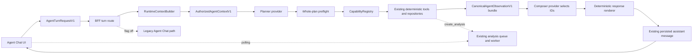

# VDaAgent Agent P0 Implementation Plan

## 1. Executive summary

VDaAgent already has most of the deterministic data plane needed for a safe P0 agent: tenant-scoped repositories, asynchronous analysis runs, validated public artifacts, report reconstruction, decision intelligence, chart provenance, claim/evidence schemas, Agent Chat persistence, and a legacy deterministic router. The current worktree also contains an early typed workspace context, capability registry, planner/runtime, provider adapters, grounded composer, optional Grok workspace, and optional SSE path.

That runtime is not yet P0-complete. Its largest gaps are authorization granularity for stale workspace references, closed capability/output validation, exact execution-budget enforcement, explicit `@Agent` parity, configured deadline use, and answer grounding. In particular, the current composer blocks unsupported numeric prose but can still accept an unsupported qualitative statement associated with an unrelated valid reference.

The chosen architecture is:

> Authorize one typed workspace snapshot on the server, validate one bounded plan before any execution, run at most three registered capabilities sequentially, convert deterministic results into canonical observations, and let the model select observation/action IDs only. The server reconstructs the final answer.

P0 requires no database migration, new endpoint, SSE dependency, Grok-dashboard dependency, or mandatory xAI integration. Gemini/OpenAI remain the normal provider path, xAI stays opt-in, and the legacy handler remains the feature-flag rollback.

## 2. Scope and success criteria

### 2.1 In scope

- Complete client and server workspace-context contracts.
- Tenant-, conversation-, scope-, date-, run-, artifact-, and child-reference authorization.
- A closed registry of nine deterministic capabilities.
- One bounded provider planner and one bounded provider composer per turn.
- Whole-plan preflight, sequential execution, precise budgets, deadlines, idempotency, and partial-result rules.
- Canonical observations and deterministic answer reconstruction.
- Compatibility with current Agent Chat, explicit agent targets, existing workspace actions, JSON polling, and the optional Grok layout.
- Metadata-only observability, focused tests, rollout, and rollback.

### 2.2 Out of scope

- Autonomous loops, DAG execution, parallel tools, output chaining, and unbounded retries.
- General SQL/code execution, external web search, or provider-defined tools.
- New analytics, report semantics, or duplicate data-access paths.
- Provider-authored factual prose.
- New database tables or persisted agent memory.
- Requiring SSE, the Grok dashboard, or xAI.
- Removing the legacy runtime during P0.

### 2.3 P0 success

A P0 turn either:

1. returns a server-reconstructed, fully grounded answer from authorized public artifacts;
2. queues exactly one existing asynchronous analysis run and returns its committed reference;
3. returns a typed unavailable/partial response; or
4. fails with a normalized non-disclosing error.

No provider can select an unregistered capability, expand scope, forge a reference or action, create more than one run, or introduce an unsupported analytical claim.

## 3. Current repository assessment

### 3.1 Implemented and reusable

- Legacy Agent Chat has deterministic routing for create analysis, get result, inspect signal, unsupported causal requests, and explicit analyst/comparison/chart/report targets.
- Organization membership, conversation persistence, turn idempotency, analysis queueing, worker lifecycle, cancellation, and polling already exist.
- Deterministic analysis/report/decision-intelligence/chart/evidence tooling and typed artifact schemas are mature.
- Claim binding, report validation, metric/evidence references, publication workflow, and public-artifact filtering provide a strong grounding boundary.
- The current worktree introduces `WorkspaceContextV1`, `RuntimeContextBuilder`, a registry, `AgentPlanV1`, `AgentRuntime`, runtime providers, a composer, and BFF/frontend wiring.
- The BFF selects the new runtime behind `GROK_RUNTIME_ENABLED`; the legacy handler remains intact.
- Runtime execution is already sequential and returns immediately after a run is queued.
- Existing message JSON can store reconstructed text, typed references, and workspace actions.

### 3.2 Partially implemented

- Workspace context includes run/report/artifact and dashboard selections, but organization, conversation, scope, and data-as-of still live partly outside it.
- The context builder reauthorizes known objects, but one stale descendant can currently invalidate more context than necessary.
- Eight capabilities are registered, but registration and output validation are not fully fail-closed.
- The plan is bounded to three steps, but all logical/provider attempt and mutation/new-run budgets are not uniformly enforced.
- A 45-second runtime deadline exists as a constant while configuration validation also accepts `AGENT_TURN_TIMEOUT_MS`; there is no single enforced source.
- The composer verifies reference membership and rejects numeric model prose, but arbitrary qualitative model prose remains possible.
- Runtime/provider telemetry exists, but it must be normalized and proven content-free.
- Optional SSE, Grok UI, and xAI work exists and must be separated from core acceptance.

### 3.3 Missing for P0

- Complete typed client snapshot and server-authorized context contract.
- Granular stale-reference resolution that preserves valid parents.
- Exact nine-capability inventory including explicit agent checkpoint parity.
- Duplicate registry detection and common output parsing.
- Full-plan preflight before side effects, duplicate-call rejection, create-analysis-only plan, and exact fallback/counter semantics.
- Canonical observation output from every capability.
- ID-only composition and deterministic answer rendering.
- Complete timeout, partial failure, cancellation/replay, cross-tenant, and compatibility tests.

### 3.4 No new persistence required

Existing conversations, messages, analysis runs, artifacts, and idempotency keys are sufficient. Plans, prompts, provider output, authorized projections, and observation bundles remain ephemeral.

### 3.5 Provider decision

Preserve the repository's established Gemini/OpenAI support and fallback ordering. Keep the existing xAI adapter available only through explicit configuration. Correct `.env.example` so xAI is not the required or effective default for P0.

### 3.6 Transport and UI decision

The P0 correctness path is the existing JSON turn endpoint plus run polling. Optional SSE may report status and the optional Grok layout may consume the same contracts, but neither is an acceptance dependency.

### 3.7 Duplicated and obsolete paths

- Do not create separate period, segment, peer, chart-story, or report-status analytics; adapt existing artifacts.
- Do not turn workspace actions into capabilities.
- Do not persist a second workspace/conversation state model.
- Do not keep the current free-prose composer as a fallback inside the new runtime.
- Do not delete the legacy deterministic router until post-P0 migration criteria are met.

## 4. Existing architecture to preserve

The P0 must preserve these repository invariants:

1. Agent Chat remains the primary entry point; the new runtime stays behind `GROK_RUNTIME_ENABLED` until the migration gate is accepted.
2. The BFF remains the tenant and conversation authority. The browser never authorizes an organization, run, report, artifact, chart, entity, or evidence reference.
3. Existing deterministic analytics, report reconstruction, decision-intelligence, chart-provenance, and public-artifact repository methods remain the data plane.
4. Analysis creation stays asynchronous. The request queues at most one run and returns; the worker, polling, and existing run lifecycle remain authoritative.
5. Validated public artifacts are the only artifact content exposed to the agent. Draft and review payloads are never provider context.
6. Existing claim, metric, evidence, report, and workspace-action contracts remain the base primitives; P0 adds a canonical observation envelope rather than a parallel evidence model.
7. The existing conversation/message persistence model remains authoritative. Runtime plans, prompts, provider responses, and internal observations are ephemeral.
8. The current writer/owner mutation policy remains unchanged. Registry role metadata cannot bypass the BFF's turn-level authorization.
9. JSON request/response and polling are sufficient for P0. SSE and the Grok dashboard may coexist behind their own flags but are not required by the runtime.
10. Gemini and OpenAI remain the supported planner/composer path. xAI is an optional adapter and must not become a P0 dependency or default.

## 5. Gap analysis

| Area | Current state | P0 gap | Required outcome |
|---|---|---|---|
| Legacy chat routing | Deterministic one-intent/one-tool flow, including explicit agent-target shortcuts | Cannot compose bounded multi-capability reads | Keep as rollback path; new runtime owns bounded planning |
| Workspace context | Active report/run/chart/entity/drilldown/evidence are partially modeled | Organization, conversation, scope, and data-as-of coherence are split across envelopes; one stale child can invalidate the whole context | One typed client snapshot, one server-authorized snapshot, granular stale-resolution results |
| Capability registry | Eight capabilities and centralized role/mode/budget metadata exist | No explicit-agent checkpoint capability; duplicate IDs can overwrite; output validation is not uniformly central | Exact nine-capability inventory, fail-fast registration, common input/output validation |
| Planner | One structured plan, maximum three steps | Limits are not fully enforced; duplicate capabilities and create-after-read are possible; no exact fallback-attempt contract | Validate the complete plan before execution; create-analysis must be the only step |
| Runtime | Sequential execution and queued-run return exist | Configured timeout is not used; planner/composer counters are not enforced; partial/unavailable behavior is ambiguous | Exact budgets, configured deadline, deterministic failure policy |
| Composer | Checks grounding references and blocks numeric model prose | Arbitrary qualitative prose can still be paired with unrelated references; capabilities do not emit canonical claim observations | Model selects canonical observation/action IDs only; server renders final prose |
| Explicit `@Agent` | Legacy deterministic checkpoints exist | Runtime flag changes behavior | Add deterministic `inspect_agent_checkpoint` capability with parity tests |
| Provider configuration | Gemini, OpenAI, and xAI adapters exist | Example environment makes xAI the effective default | Preserve Gemini/OpenAI ordering; leave xAI opt-in |
| Persistence | Existing message JSON and artifact references are sufficient | No gap requiring a migration | Add no database objects |
| UI integration | Agent Chat, optional Grok workspace, JSON polling, and optional SSE exist | Runtime must not require dashboard or SSE | Agent Chat works in both current layouts using the same request contract |
| Tests | Initial context, registry, runtime, and composer tests exist | Boundary, stale-child, budget, timeout, canonical-render, and compatibility coverage is incomplete | Add contract, unit, integration, frontend, and regression coverage listed below |

## 6. Target architecture



Trust changes at the BFF boundary. Client context is a navigation hint; `AuthorizedAgentContextV1` is the only context available to planning and capability execution. Provider output is a selection request, never an authorization decision or a source of analytical prose.

## 7. Typed workspace context

### 7.1 Client contract

Extend the existing workspace-context schema instead of creating a second request model:

```ts
type WorkspaceContextV1 = {
  version: 1;
  mode: agent_chat | report_dashboard;
  org_id: string;
  conversation_id: string | null;
  scope: AnalysisScopeV1;
  data_as_of: string;
  active_run_ref: RunRefV1 | null;
  active_report_ref: ReportRefV1 | null;
  active_artifact_ref: ArtifactRefV1 | null;
  dashboard_selection: {
    chart_ref: ChartRefV1 | null;
    priority_entity_ref: PriorityEntityRefV1 | null;
  } | null;
  drilldown: DrilldownRefV1 | null;
  evidence_ref: EvidenceRefV1 | null;
};
```

During compatibility, `AgentTurnRequestV1` keeps its existing top-level organization, scope, and date fields. When `workspace_context` is present, the BFF requires equality with those fields. The route remains authoritative for conversation identity. The frontend constructs both representations from the same reducer state so they cannot drift accidentally.

Do not add a generic dashboard ID. The repository currently has one report-dashboard context; chart selection and priority-entity selection are the concrete active visual/entity concepts.

### 7.2 Server-only authorized contract

```ts
type AuthorizedAgentContextV1 = {
  version: 1;
  org_id: string;
  actor: AuthorizedActorV1;
  conversation: AuthorizedConversationRefV1;
  scope: AnalysisScopeV1;
  data_as_of: string;
  mode: WorkspaceContextV1[mode];
  active_run: PublicRunContextV1 | null;
  active_report: PublicReportContextV1 | null;
  active_artifact: PublicArtifactContextV1 | null;
  active_chart: PublicChartContextV1 | null;
  active_priority_entity: PublicPriorityEntityContextV1 | null;
  drilldown: AuthorizedDrilldownContextV1 | null;
  evidence: PublicEvidenceContextV1 | null;
  available_workspace_actions: AvailableWorkspaceActionV1[];
  resolution_issues: ContextResolutionIssueV1[];
};
```

`ContextResolutionIssueV1` contains only `ref_kind`, normalized `code`, and `disposition: drop | replace | reject`. It must not expose existence across tenants.

### 7.3 Resolution and stale-reference policy

Apply these rules in this order:

1. Reject organization or route-conversation mismatch before any provider call.
2. Reject invalid scope/date syntax and any workspace/top-level coherence mismatch.
3. Resolve every reference through organization-scoped repository methods and publication rules.
4. If the root run is inaccessible, return `NO_AUTHORIZED_RESULT`; do not disclose whether it exists.
5. If an authorized run has a different scope or data-as-of, drop the run and every descendant. The existing fresh-analysis shortcut may be offered only to a writer/owner; viewers receive an unavailable result.
6. If a report is invalid, private, stale, or not a descendant of the accepted run, drop the report and its descendants while preserving a valid run.
7. If the report was omitted, the server may select the current validated public report for the accepted run.
8. Invalid chart, entity, drilldown, or evidence children are dropped individually. A valid parent remains usable.
9. If the user explicitly asks for a dropped child, the relevant capability returns a typed unavailable observation instead of silently substituting a different child.
10. Never merge facts or children from different runs, even when scope and date labels match.
11. Bound the provider-facing projection after authorization; raw artifact payloads and private workflow metadata do not enter prompts.

## 8. Capability registry

### 8.1 Exact P0 inventory

| Capability ID | Mutates | Minimum role | Modes | Input source | Deterministic output |
|---|---:|---|---|---|---|
| `create_analysis` | Yes | writer | agent chat, report dashboard | Authorized scope/date plus optional focus label | Queued run/status observation and run reference |
| `get_analysis_result` | No | viewer | both | Authorized run reference | Public run/report status and summary observations |
| `inspect_signal` | No | viewer | both | Authorized run plus signal key | Canonical metric/claim observations |
| `inspect_decision_intelligence` | No | viewer | both | Authorized validated report | Priority, risk, lever, action, and caveat observations |
| `inspect_visual` | No | viewer | report dashboard | Authorized chart reference | Chart title, measure, comparison, and provenance observations |
| `inspect_priority_entity` | No | viewer | report dashboard | Authorized entity reference | Entity-level priority and supporting observations |
| `inspect_evidence` | No | viewer | both | Authorized evidence reference | Exact public evidence observation |
| `get_report_context` | No | viewer | both | Authorized report reference | Bounded report-section observations |
| `inspect_agent_checkpoint` | No | viewer for public reads; writer for report status as currently enforced | both | Explicit client agent target plus authorized context | Legacy-equivalent analyst/comparison/chart/report checkpoint observations |

This inventory is closed for P0. Period comparison, segment, peer, visual story, chart lookup, and report context are represented by the existing public artifacts and inspection capabilities. Report creation and cancellation remain existing UI/API operations, not provider-callable capabilities.

### 8.2 Registry invariants

- Registering a duplicate capability ID throws during process initialization.
- The registry owns input parsing, role/mode checks, exact required-context checks, mutation classification, invocation budget checks, execution, and output parsing.
- Executors receive only `AuthorizedAgentContextV1` and parsed inputs. They cannot receive raw client references.
- Output schemas emit canonical observations and typed references; arbitrary text is not a capability result.
- `create_analysis` takes scope/date from authorized context. A planner-controlled `scope_ref` is removed. An optional `focus` is only a routing label and cannot change deterministic analytics.
- `inspect_agent_checkpoint` reuses the existing explicit-target helper and public artifact readers. It must not duplicate analytics or synthesize new findings.
- Existing workspace actions remain a separate allowlisted contract. They are not registered capabilities and are never invented by a provider.

## 9. Planner and runtime contract

### 9.1 Plan

Retain a deliberately small plan schema:

```ts
type AgentPlanV1 = {
  version: 1;
  intent: string;
  steps: Array<{
    step_id: string;
    capability_id: AgentCapabilityIdV1;
    input: unknown;
  }>;
  answer_mode: grounded | queued | unavailable;
  unsupported_reason: string | null;
};
```

P0 has no dependency graph, output chaining, speculative execution, or provider-defined parallelism. Steps execute in declared order. Independent reads remain sequential so authorization changes, deadlines, audit events, and partial-result semantics are unambiguous.

### 9.2 Exact budgets

- One logical planner stage, with at most two provider attempts: configured primary, then configured fallback.
- Maximum three planned steps and three capability calls.
- Maximum one invocation of any capability ID per turn.
- Maximum one mutating call and one newly created analysis run.
- A plan containing `create_analysis` must contain that step only.
- One logical composer stage, with at most two provider attempts: configured primary, then fallback.
- Maximum 12 recent conversation messages and five historical run summaries in provider context.
- Maximum 24 KiB serialized provider context/observation projection.
- Default per-provider-attempt timeout: 12 seconds.
- Default and hard maximum synchronous turn deadline: 45 seconds.
- The analysis job continues asynchronously outside that deadline after its transaction commits.

All limits are constants with configuration validation where operators may lower them. The runtime must use the validated configured deadline rather than a hard-coded duplicate.

### 9.3 Preflight and execution

Before the first capability executes, validate the full plan:

1. Parse the plan and normalize IDs.
2. Require unique step IDs and unique capability IDs.
3. Resolve every capability from the closed registry.
4. Parse every input.
5. Validate role, mode, and required authorized context.
6. Enforce all step, invocation, mutation, and new-run budgets.
7. Require `create_analysis` to be the sole step and `answer_mode: queued`.
8. Require grounded plans to contain only read capabilities.
9. Reject provider-supplied references that are not exact members of authorized context.
10. Record only capability IDs and normalized status metadata.

An invalid primary plan may use the configured fallback planner once. If the fallback is absent or invalid, execute no capability and return a normalized planning error.

Execution is sequential. Re-check the deadline and authorization-sensitive prerequisites before each call. Planner and composer counters are incremented by the runtime, not inferred from provider telemetry. Idempotent replay by `client_turn_id` returns the already committed turn/run and does not consume another new-run budget.

### 9.4 Runtime result policy

- Authorization denial or detected tenant/context change fails the turn and suppresses partial facts.
- An unavailable first step returns a typed unavailable answer.
- An unavailable later step returns validated earlier observations plus a limitation observation and `partial` status.
- A normalized technical failure on a later safe read may return validated earlier observations plus a generic limitation; raw error text is never included.
- A mutation failure fails the turn; no response implies that a run was created unless the committed run reference exists.
- A queued analysis is represented as a canonical pending/status observation, not invented progress prose.
- Cancellation follows the existing run API. A canceled client wait does not roll back a committed queued run.

## 10. Grounded answer composition

### 10.1 Canonical observation contract

Every capability returns observations that can be rendered without provider-authored facts:

```ts
type CanonicalAgentObservationV1 = {
  observation_id: string;
  kind: claim | metric | decision | status | limitation;
  availability: available | unavailable | pending | failed;
  canonical_text: string;
  display_value: string | null;
  support_level: SupportLevelV1 | null;
  grounding_refs: GroundingRefV1[];
};

type AvailableWorkspaceActionV1 = {
  action_id: string;
  action: WorkspaceActionV1;
};
```

Observation IDs are turn-local opaque IDs. Canonical text and display values are constructed from validated deterministic artifacts. Numeric formatting happens before provider composition using repository conventions. A null value stays null and is rendered as unavailable; it is never converted to zero or guessed.

### 10.2 Provider response contract

The composer may select and order supplied IDs, but it cannot write analytical prose:

```ts
type GroundedResponseSelectionV1 = {
  version: 1;
  status: complete | partial | queued | unavailable;
  title_key:
    | analysis_answer
    | analysis_queued
    | analysis_partial
    | analysis_unavailable;
  blocks: Array<{
    kind: summary | detail | limitation;
    observation_ids: string[];
  }>;
  workspace_action_ids: string[];
  queued_run_ref: RunRefV1 | null;
  error_code: AgentPublicErrorCodeV1 | null;
};
```

The server validates that every selected observation/action ID was supplied, every grounding reference is still authorized and belongs to the accepted run, status is coherent with observation availability, and queued run references match the committed result. It then reconstructs the existing message text, typed parts, references, and actions from canonical values.

The provider receives no facility for free-form findings, numbers, follow-up prompts, URLs, reference objects, or workspace actions. It may only choose IDs and ordering. Therefore an unsupported qualitative statement cannot be made valid by attaching an unrelated reference.

### 10.3 Deterministic fallback

If both composer attempts fail, time out, exceed bounds, or select invalid IDs, use a deterministic renderer:

1. Keep observations in capability/observation order.
2. Use the first available observation as the summary.
3. Put remaining available observations in details.
4. Append normalized limitation observations.
5. Include only precomputed actions compatible with final status.
6. Render queued/unavailable titles from fixed application strings.

This fallback must produce the same grounding guarantees as a successful composer and must not call another model.

## 11. Integration design

### 11.1 Backend turn flow

1. Authenticate the session and authorize organization membership.
2. Resolve the conversation from the route/body and enforce the existing turn-write policy.
3. Parse `AgentTurnRequestV1` and workspace/top-level coherence.
4. Return an existing idempotent turn for the same `client_turn_id` when present.
5. Build `AuthorizedAgentContextV1`.
6. If the runtime flag is off, call the unchanged legacy handler.
7. If the flag is on, project bounded context and call the planner.
8. Preflight the complete plan.
9. Execute capabilities sequentially through the registry.
10. Convert results to canonical observations.
11. Compose by ID and deterministically render the existing assistant message shape.
12. Persist the user/assistant messages and exact committed run/artifact references through current repository methods.
13. Return the current JSON response. Existing polling remains the queued-run completion path.

### 11.2 Frontend flow

- A single workspace-context builder reads organization, route conversation, scope, date, active report/run, dashboard selection, drilldown, and evidence state.
- Both the current Agent Chat layout and optional Grok workspace pass the same snapshot to the client API.
- Explicit agent target remains an explicit request field and is checked against `inspect_agent_checkpoint` input.
- Existing message components render reconstructed text and typed references/actions; no model response is rendered directly.
- Existing action allowlists and navigation reducers remain authoritative.
- SSE may enhance progress when enabled, but removing or disabling SSE must not change correctness.

## 12. Contract and type changes

| Path | Change |
|---|---|
| `src/backend/packages/contracts/src/index.ts` | Extend `WorkspaceContextV1`; add authorized-context projection types only if they belong in shared server packages; add canonical observation, response-selection, resolution-issue, and capability ID schemas |
| `src/backend/packages/contracts/src/export.ts` | Export the new public/runtime-safe contracts |
| `src/backend/packages/contracts/schema/*.json` | Add or update JSON schemas for request, workspace context, observations, plan, and response selection |
| `src/backend/packages/contracts/test/agent-workflow-contracts.test.ts` | Assert parsing, closed enums, bounds, null semantics, and compatibility |
| `src/backend/packages/db/src/types.ts` | Add repository return types only where existing public artifact/run readers need typed projections |
| `src/backend/packages/agents/src/runtime-context.ts` | Build the authoritative context and granular resolution issues |
| `src/backend/packages/agents/src/capability-registry.ts` | Register the exact inventory and central validation |
| `src/backend/packages/agents/src/planner.ts` | Enforce the final plan schema and bounded provider projection |
| `src/backend/packages/agents/src/runtime-limits.ts` | Define and validate exact limits and configured deadline |
| `src/backend/packages/agents/src/runtime.ts` | Implement preflight, counters, deadline, sequential execution, and failure policy |
| `src/backend/packages/agents/src/answer-composer.ts` | Replace free-prose validation with ID selection and deterministic rendering |
| `src/backend/packages/agents/src/runtime-provider.ts` | Expose bounded planner/composer attempts with normalized failures |
| `src/frontend/lib/workspace-context.ts` | Construct the complete client snapshot from current state |
| `src/frontend/lib/client-api.ts` | Send the snapshot without changing the public response path |

Names should follow existing repository naming during implementation; the contracts above define semantics, not permission to create duplicate near-equivalents.

## 13. API and event surface

No new endpoint is required. Extend the existing agent-turn request with the versioned workspace snapshot and preserve existing response compatibility. Continue to use current endpoints for run status, cancellation, artifacts, reports, and conversation history.

If existing SSE code remains, its events are optional presentation events. They must contain only identifiers and normalized status, must be tenant-authorized on reconnect, and must not become a source of analytical data. P0 acceptance is based on the JSON turn endpoint plus polling.

## 14. Persistence and migrations

No table, column, index, queue, or migration is required.

Persist:

- Existing user and assistant messages.
- Existing typed grounding references and workspace actions in message JSON.
- Existing analysis run and artifact records.
- Existing idempotency association for `client_turn_id`.

Do not persist:

- Plans or rejected plans.
- Provider prompts or raw provider output.
- Chain-of-thought or reasoning.
- Ephemeral authorized-context projections.
- Canonical observation bundles after the final message is reconstructed.
- Raw tool errors or private artifact payloads.

Repository additions should be limited to scoped public readers such as batch artifact lookup when required to revalidate references efficiently.

## 15. Authorization and security

- Treat every client field and every provider field as untrusted.
- Resolve organization and conversation from authenticated route context and existing membership checks.
- Use organization-scoped repository methods for all references.
- Apply exact-run lineage checks to reports, charts, entities, drilldowns, evidence, claims, and metrics.
- Expose only validated public artifacts; exclude draft/review/internal workflow payloads.
- Keep current owner/writer mutation policy. Viewer capability metadata supports read semantics only and does not grant permission to create a persisted chat turn where the current product forbids it.
- Normalize not-found and forbidden references to the same public error where disclosure would reveal cross-tenant existence.
- Reject arbitrary URLs, action payloads, capability names, schema keys, and provider-selected references.
- Bound counts and serialized bytes before every provider call.
- Do not log prompts, user text, canonical values, evidence content, secrets, or model reasoning.
- Reauthorize immediately before a mutation and before persisting final references.

## 16. Failure behavior

| Condition | Public behavior | Capability execution | Partial facts |
|---|---|---|---|
| Invalid request/coherence | Normalized validation error | None | No |
| Unauthorized org/conversation/root | `NO_AUTHORIZED_RESULT` or existing authorization response | None | No |
| Stale optional child | Parent context retained; child resolution issue recorded | Other valid reads may run | Yes, when requested answer remains supported |
| Planner primary invalid/timeout | Try configured fallback once | None before a valid plan | No |
| Planner fallback invalid/timeout | Normalized planning unavailable | None | No |
| Plan exceeds any budget | Normalized invalid plan | None | No |
| First read unavailable | Typed unavailable answer | Stop | No |
| Later read unavailable | Partial answer plus canonical limitation | Stop | Yes |
| Later read technical failure | Partial only for normalized safe-read failure | Stop | Yes |
| Any authorization change during execution | Normalized authorization failure | Stop | No |
| Mutation failure before commit | Normalized create failure | Stop | No |
| Mutation commits but response times out | Idempotent replay returns committed run | No duplicate mutation | Only committed status |
| Composer primary invalid/timeout | Try fallback once | Already completed capabilities are not repeated | Observations retained |
| Composer fallback invalid/timeout | Deterministic renderer | No additional capabilities | Yes |
| Turn deadline reached | Normalized timeout or deterministic safe partial result | Stop | Only already validated reads |
| Queued run later fails/cancels | Existing polling/status UI shows canonical run state | No implicit retry | No invented findings |

## 17. Observability

Reuse current runtime/provider telemetry and activity plumbing, adding metadata-only events:

- Turn: `client_turn_id`, organization-safe correlation ID, runtime flag variant, mode, final status, normalized error code, total duration, timeout flag.
- Context: build duration, accepted reference-kind counts, dropped/replaced/rejected counts, serialized provider-context bytes.
- Planner: provider family, duration, attempt number, fallback-used flag, validation status, selected capability IDs and count.
- Capability: capability ID, ordinal, duration, normalized outcome, mutation flag, and already-public run/artifact IDs where current policy permits.
- Composer: provider family, duration, attempt number, fallback-used flag, selected observation/action counts, deterministic-renderer flag.
- Idempotency: new or replayed turn/run, without message contents.

Never log prompts, conversation text, canonical text/value fields, evidence content, artifact payloads, provider raw responses, secrets, or reasoning. SSE is not a telemetry store.

## 18. Test strategy

### 18.1 Contract tests

- Complete and legacy-compatible `AgentTurnRequestV1` parsing.
- Closed capability, status, title, observation-kind, and resolution-code enums.
- Maximum plan steps, observation/action counts, string sizes, and serialized-byte guards.
- Null metric/display values remain null.
- Unknown keys, arbitrary URLs, arbitrary action payloads, and free-form composer text are rejected.

### 18.2 Runtime-context tests

- Organization, route conversation, scope, and data-as-of coherence.
- Cross-tenant run/report/artifact/chart/entity/evidence references do not disclose existence.
- Run scope/date mismatch drops the complete lineage.
- Stale report preserves an authorized run.
- Stale chart/entity/drilldown/evidence drops only that child.
- Omitted optional references remain null without error.
- Omitted report resolves only a validated public report for the accepted run.
- Private draft/review artifacts are excluded.
- Provider projection is count- and byte-bounded.

### 18.3 Registry and capability tests

- Exact nine-ID inventory and metadata.
- Duplicate registration fails startup.
- Common input and output schemas are always applied.
- Forged provider references are rejected before executor invocation.
- Role, mode, required-context, duplicate-call, mutation, and run budgets.
- `create_analysis` uses authorized scope/date and queues exactly one run.
- Every read returns canonical observations with exact grounding references.
- Null/unavailable data produces typed observations.
- `inspect_agent_checkpoint` matches legacy analyst/comparison/chart/report behavior.

### 18.4 Planner/runtime tests

- Planner is called once logically and no capability runs before full preflight.
- Primary/fallback attempt maximum is two.
- Three calls succeed; four fail with zero calls.
- Duplicate capability ID fails with zero calls.
- One mutation/new-run limit and create-analysis-only-plan rule.
- Declared order is preserved and no parallel calls occur.
- Configured provider timeout and 45-second turn deadline are actually used.
- First unavailable, later unavailable, later safe-read error, and authorization-change semantics.
- Queued, pending, failed, canceled, and idempotently replayed run behavior.
- Composer is called once logically; execution is not repeated on composer fallback.
- Raw provider/tool errors never reach persisted messages or responses.

### 18.5 Composer tests

- The provider can select only supplied observation/action IDs.
- Exact canonical values and claim/evidence references survive rendering.
- Cross-run, forged, duplicate, unavailable-as-complete, and mismatched queued-run selections fail.
- Unsupported qualitative prose is structurally impossible.
- Null values render unavailable and never as zero.
- Limitation observations are retained in partial answers.
- Deterministic fallback is grounded and stable.
- Persisted text and typed parts reconstruct the same answer.

### 18.6 Integration and frontend tests

- Runtime flag off preserves the legacy response.
- Runtime flag on supports legacy Agent Chat layout and optional Grok workspace.
- Both layouts send equivalent complete workspace snapshots.
- Explicit agent target behavior is preserved.
- Viewer/writer/owner authorization remains unchanged.
- JSON plus polling completes a queued run with SSE disabled.
- Stale child selection produces a safe unavailable/partial answer while the valid parent remains usable.
- Workspace actions remain allowlisted after round-trip and navigation.
- Refresh/reload renders persisted reconstructed messages without runtime-only state.

### 18.7 Regression suite

Run the repository's existing contract, database, tools/provider, semantic, chart, decision-intelligence, artifact, workflow/publication, BFF agent-chat, and frontend workspace/chat suites. Add targeted tests first; run broader package and repository checks only after each phase's focused tests pass.

## 19. Compatibility and migration

- Keep `GROK_RUNTIME_ENABLED` as the server-side migration gate. The disabled path calls legacy behavior without constructing a provider plan.
- Accept legacy requests without `workspace_context` during rollout; derive the minimal snapshot from existing top-level fields and route identity. Emit metadata-only adoption telemetry.
- When the snapshot is present, require exact coherence. Do not silently prefer one conflicting copy.
- Persist the existing assistant message shape so old clients and history reloads continue to render.
- Introduce capability/observation schemas additively, then switch the flagged runtime atomically to ID-only composition.
- Default planner/composer configuration to the repository's established Gemini/OpenAI order. Keep xAI behind explicit opt-in configuration and remove it from required example defaults.
- Roll out to development, then internal organizations, then a bounded percentage/allowlist. Compare normalized completion/error/timeout and grounding-fallback rates.
- Roll back by disabling the runtime flag. No data rollback or schema migration is required.
- Remove the compatibility derivation and legacy handler only after adoption telemetry shows no legacy callers and parity/regression gates pass.

## 20. Phased implementation plan

Each phase is independently reviewable and testable. Do not combine phases merely because they touch the same file; preserve the logical commit boundaries below.

### Phase 0 - Reconcile the current runtime worktree

**Goal:** Establish a reviewed baseline for the partially implemented P0 runtime without changing product behavior.

**Current implementation reused:** The uncommitted workspace-context, registry, planner, runtime, provider, composer, BFF, frontend, and test files already present in the repository.

**Gap:** The worktree mixes implemented P0 primitives with optional Grok/SSE/xAI work, and documentation currently overstates completion.

**Files to modify/add:** Review only all current diffs; update `docs/context.md` and `docs/implementation_plan.md` if their claims conflict with verified code. Add no production file.

**Contracts:** Inventory each new schema and map it to a current consumer. Mark duplicate or unused types before later phases.

**Backend:** Trace one legacy turn and one flagged-runtime turn from the BFF through persistence. Record which current helpers are authoritative.

**Frontend:** Trace context construction and message rendering in both layouts; identify optional Grok/SSE dependencies.

**Persistence:** Confirm current message/run/artifact persistence and idempotency are sufficient.

**Auth/security:** Confirm the route, organization membership, conversation write gate, and public artifact boundary before preserving any new path.

**Implementation steps:**

1. Capture `git status` and focused diffs; assign each changed file to core P0, optional feature, test, or documentation.
2. Compare exported schemas with all call sites and remove no concurrent/user work.
3. Trace provider defaults and flag behavior, explicitly identifying xAI and SSE as optional.
4. Write a short baseline checklist in the implementation PR description; make no behavioral cleanup.

**Tests:** No new tests. Run existing focused tests only if code must change during reconciliation.

**Acceptance criteria:** Every current diff has an owner and phase; no optional feature is a prerequisite; no undocumented schema or persistence dependency remains.

**Dependencies:** None.

**Rollback/defer:** Documentation/inventory changes are independently revertible. Defer optional Grok dashboard, SSE, and xAI work without blocking Phase 1.

### Phase 1 - Finalize shared contracts and limits

**Goal:** Make the closed P0 protocol parseable and bounded before runtime behavior changes.

**Current implementation reused:** Existing `AgentTurnRequestV1`, workspace context, plan, response, grounding, action, claim, metric, and reference schemas.

**Gap:** The workspace snapshot is incomplete; observation/composer contracts permit too much text; enums and size limits are not final.

**Files to modify/add:**

- `src/backend/packages/contracts/src/index.ts`
- `src/backend/packages/contracts/src/export.ts`
- Relevant files under `src/backend/packages/contracts/schema/`
- `src/backend/packages/contracts/test/agent-workflow-contracts.test.ts`
- `src/backend/packages/agents/src/runtime-limits.ts`
- `src/backend/packages/agents/src/runtime-limits.test.ts` if the current test file exists; otherwise add it

**Contracts:** Implement Sections 7, 8, 9, and 10 exactly: complete `WorkspaceContextV1`, closed nine-ID capability enum, `CanonicalAgentObservationV1`, `AvailableWorkspaceActionV1`, `GroundedResponseSelectionV1`, and resolution issues. Preserve legacy request parsing during rollout.

**Backend:** Export a single limit object used by planner, registry, runtime, context builder, and providers. Validate operator overrides and cap the turn deadline at 45 seconds.

**Frontend:** Consume the extended public workspace type without yet populating new fields outside tests.

**Persistence:** None.

**Auth/security:** Do not place server-authorized objects, roles, or private payload types in the client request schema. Apply strict objects and closed enums.

**Implementation steps:**

1. Add the complete workspace snapshot with version and bounded nullable selections.
2. Add canonical observation and action-ID schemas; remove free-form analytical fields from the composer output.
3. Close capability and public error/status enums.
4. Encode count, length, and byte-related structural limits where schema validation can enforce them.
5. Centralize runtime numeric limits and validated configuration.
6. Export generated/hand-maintained JSON schemas using current repository conventions.
7. Update contract fixtures and consumers to compile against additive fields.

**Tests:** Parsing success, legacy compatibility, unknown-key rejection, enum closure, count/string bounds, null preservation, and free-prose rejection.

**Acceptance criteria:** Contracts compile; fixtures round-trip; no composer schema accepts analytical prose, arbitrary refs/actions, or URLs; all runtime components import one limits source.

**Dependencies:** Phase 0.

**Rollback/defer:** Additive request fields can be reverted while legacy requests continue. Do not proceed to provider cutover until all consumers compile.

### Phase 2 - Build authoritative workspace context

**Goal:** Convert an untrusted navigation snapshot into one granular, bounded, server-authorized context.

**Current implementation reused:** Existing `RuntimeContextBuilder`, organization-scoped repository readers, artifact validation, report reconstruction, decision-intelligence projection, chart/evidence lookup, and frontend context reducer.

**Gap:** Scope/date/org/conversation are split; stale handling is all-or-nothing; child lineage and disclosure behavior need exact rules.

**Files to modify/add:**

- `src/backend/packages/agents/src/runtime-context.ts`
- `src/backend/packages/agents/src/runtime-context.test.ts`
- `src/backend/packages/db/src/types.ts`
- `src/backend/packages/db/src/repository.ts`
- Existing repository tests covering public artifact lookup
- `src/backend/apps/server/src/api/agent-chat.ts`
- `src/frontend/lib/workspace-context.ts`
- `src/frontend/lib/workspace-context.test.ts`
- `src/frontend/lib/client-api.ts`
- `src/frontend/components/agent-chat.tsx`
- `src/frontend/components/workspace.tsx`
- Optional Grok-workspace consumer only if it currently builds its own snapshot

**Contracts:** Produce `AuthorizedAgentContextV1` and granular `ContextResolutionIssueV1`; keep them server-only except for public normalized errors.

**Backend:** Make the route conversation authoritative; enforce request coherence; resolve root-to-child lineage; preserve valid parents when optional children are stale; bound the provider projection.

**Frontend:** Build both compatibility fields and `workspace_context` from one state selector. Include explicit nulls for absent optional selections and route conversation identity.

**Persistence:** Reuse current scoped readers. Add only a typed/batched public artifact reader if necessary; no schema migration.

**Auth/security:** Collapse inaccessible/not-found root references to one public result; never resolve by unscoped ID; exclude draft/review artifacts; never merge runs.

**Implementation steps:**

1. Parse and compare organization, conversation, scope, and data-as-of before repository reads.
2. Resolve the run, then report/artifact, then chart/entity/drilldown/evidence in lineage order.
3. Implement the stale policy from Section 7.3 with per-reference issues.
4. Derive a current validated public report only when omitted and unambiguous.
5. Project bounded labels, IDs, statuses, and public summaries for providers.
6. Update both frontend layouts to call the same context builder.
7. Keep the legacy minimal-context derivation when the snapshot is absent.

**Tests:** Cross-tenant non-disclosure; all coherence mismatches; stale root versus stale child; missing optionals; private artifacts; exact lineage; byte/count bounds; equivalent snapshots from both layouts.

**Acceptance criteria:** No provider sees raw client references or private artifacts; a stale child does not erase a valid parent; conflicts reject deterministically; old requests still work behind compatibility.

**Dependencies:** Phase 1.

**Rollback/defer:** The BFF can ignore the additive snapshot and use legacy derivation. Defer generic dashboard identity and persisted UI selection state.

### Phase 3 - Harden the capability registry

**Goal:** Make one closed registry the only execution gateway and preserve explicit-agent behavior.

**Current implementation reused:** The eight current capability definitions, existing tools/repository functions, role/mode metadata, deterministic explicit-target helper, and workspace-action allowlist.

**Gap:** Duplicate IDs overwrite silently; output parsing is inconsistent; explicit `@Agent` parity is missing; create input and required-context checks are too permissive.

**Files to modify/add:**

- `src/backend/packages/agents/src/capability-registry.ts`
- `src/backend/packages/agents/src/capability-registry.test.ts`
- `src/backend/packages/agents/src/tools.ts`
- `src/backend/packages/agents/src/tools.test.ts`
- `src/backend/packages/agents/src/index.ts`
- `src/backend/packages/db/src/repository.ts` and focused tests only if a public reader is missing

**Contracts:** Register exactly the nine capabilities in Section 8. Inputs and outputs are strict schemas; outputs contain canonical observations and typed public refs.

**Backend:** Fail startup on duplicate registration; centralize input/output parsing and role/mode/context/budget checks; add `inspect_agent_checkpoint` by adapting the legacy deterministic helper.

**Frontend:** No capability IDs are selected by the browser. Preserve the existing explicit agent target field and workspace actions.

**Persistence:** Reuse current run/artifact/message storage; no new records.

**Auth/security:** Executors accept authorized context only; reauthorize mutation; prevent planner-controlled scope/date; apply exact-ref membership to every input.

**Implementation steps:**

1. Replace map overwrite with an explicit duplicate-registration error.
2. Define registry metadata and schemas for the exact inventory.
3. Remove planner-owned scope/date references from `create_analysis`.
4. Wrap each existing tool in a deterministic observation adapter.
5. Add `inspect_agent_checkpoint` using current analyst/comparison/chart/report checkpoint logic.
6. Parse every executor result centrally before returning it.
7. Keep workspace action generation outside the registry and validate it against existing allowlists.

**Tests:** Exact inventory, duplicate initialization, forged input, central output rejection, roles/modes/context, canonical observations/nulls, one-run mutation, and explicit-target parity.

**Acceptance criteria:** No capability executes outside the registry in the flagged runtime; all outputs are canonical and validated; explicit targets match legacy outcomes; duplicate IDs cannot boot.

**Dependencies:** Phases 1-2.

**Rollback/defer:** Runtime flag off retains legacy dispatch. Remove only the new checkpoint adapter if parity fails; do not change the legacy helper. Defer additional capability IDs.

### Phase 4 - Enforce planner and runtime semantics

**Goal:** Guarantee bounded, preflighted, sequential execution with exact timeout and partial-result behavior.

**Current implementation reused:** Existing planner schema/parser, `AgentRuntime`, provider abstraction, queued analysis workflow, idempotent turn handling, and normalized runtime errors.

**Gap:** Counters and configured timeout are not consistently used; create-analysis can follow reads; duplicate calls and fallback attempts need exact enforcement; partial behavior is incomplete.

**Files to modify/add:**

- `src/backend/packages/agents/src/planner.ts`
- `src/backend/packages/agents/src/planner.test.ts` if absent
- `src/backend/packages/agents/src/runtime.ts`
- `src/backend/packages/agents/src/runtime.test.ts`
- `src/backend/packages/agents/src/runtime-provider.ts`
- `src/backend/packages/agents/src/runtime-provider.test.ts`
- `src/backend/packages/agents/src/runtime-limits.ts`
- `src/backend/packages/config/src/index.ts`
- `.env.example`
- `turbo.json` only if current environment passthrough requires correction

**Contracts:** Retain the simple no-dependency plan. Enforce the exact budgets and result policy in Section 9.

**Backend:** Perform whole-plan preflight before the first call; count logical stages and provider attempts explicitly; run steps sequentially; use the validated deadline; preserve committed-run idempotency.

**Frontend:** No runtime orchestration. Continue to display queued status and use existing polling/cancellation APIs.

**Persistence:** Persist only existing turn/run/message results. Never persist plans or provider payloads.

**Auth/security:** Re-check authorization-sensitive prerequisites before each call and before mutation/final persistence. Suppress partial facts on authorization changes.

**Implementation steps:**

1. Bound the provider projection and start one turn deadline.
2. Invoke the primary planner, then at most one configured fallback.
3. Preflight unique IDs, registry membership, inputs, refs, roles, modes, context, and all budgets.
4. Enforce `create_analysis` as the only step in a queued plan.
5. Execute accepted reads in declared order; do not add parallelism.
6. Stop according to unavailable, technical, authorization, mutation, and deadline rules.
7. Return a committed queued run immediately and rely on the existing worker/polling lifecycle.
8. Increment planner/composer/capability/new-run counters in runtime code.
9. Make `AGENT_TURN_TIMEOUT_MS` drive the deadline, capped at 45 seconds.
10. Restore Gemini/OpenAI as the example/default provider order; leave xAI explicit and optional.

**Tests:** Zero execution for invalid plans; exact attempt/call/run budgets; ordering/non-parallelism; configured timeout; each partial/failure branch; queued/canceled/failed/idempotent runs; fallback provider behavior.

**Acceptance criteria:** No invalid plan causes side effects; one turn cannot create two runs or call more than three capabilities; observed timeout equals configuration; retry/replay cannot duplicate a run.

**Dependencies:** Phases 1-3.

**Rollback/defer:** Disable the runtime flag to restore legacy routing. Provider fallback can be disabled independently. Defer DAGs, parallelism, loops, retries of capability side effects, and long-running synchronous turns.

### Phase 5 - Replace free prose with canonical composition

**Goal:** Make unsupported analytical prose structurally impossible while preserving useful grounded answers.

**Current implementation reused:** Existing claim/evidence validation, canonical metric/reference schemas, workspace-action validation, answer composer, and typed frontend message parts.

**Gap:** Current composer can attach unrelated references to arbitrary qualitative prose and does not receive deterministic canonical values from capabilities.

**Files to modify/add:**

- `src/backend/packages/agents/src/answer-composer.ts`
- `src/backend/packages/agents/src/answer-composer.test.ts`
- `src/backend/packages/agents/src/capability-registry.ts`
- `src/backend/packages/agents/src/runtime-provider.ts`
- `src/backend/packages/agents/src/runtime-provider.test.ts`
- Existing provider prompt/helper file only where composition instructions currently live
- Contract/schema files only for corrections discovered during implementation

**Contracts:** Use `CanonicalAgentObservationV1`, `AvailableWorkspaceActionV1`, and `GroundedResponseSelectionV1`. No free-form finding, value, ref, action, URL, or follow-up field remains.

**Backend:** Convert deterministic tool outputs to canonical observations; let the provider select IDs; validate all selections and lineage; render message text/parts on the server; fall back deterministically.

**Frontend:** Render the existing persisted message shape. Do not interpret provider JSON or construct analytical prose in the browser.

**Persistence:** Store the reconstructed existing message and exact refs/actions; discard plans, selection payloads, and observation bundles.

**Auth/security:** Revalidate selected refs/actions immediately before rendering/persisting. Reject cross-run or unavailable-as-complete selection. Never include raw errors.

**Implementation steps:**

1. Define deterministic observation builders for claim, metric, decision, status, and limitation.
2. Include formatted values and exact public grounding refs in each observation.
3. Generate a closed list of available action IDs using existing action builders.
4. Change the composer prompt/output to ID selection only.
5. Validate selection membership, uniqueness, status coherence, lineage, queued run, and size.
6. Reconstruct text and typed parts from canonical observations.
7. Implement the deterministic fallback order from Section 10.3.
8. Remove the obsolete numeric-prose heuristic after ID-only composition is enforced and tests prove no free text path remains.

**Tests:** Exact-value rendering, qualitative-prose impossibility, null/unavailable values, limitations, forged/cross-run IDs, action allowlist, queued status, both provider attempts failing, and stable deterministic fallback.

**Acceptance criteria:** Every displayed factual clause originates in a canonical observation; every observation has valid refs or an explicitly non-factual status/limitation kind; composer failure cannot degrade grounding.

**Dependencies:** Phases 1, 3, and 4.

**Rollback/defer:** Roll back the entire flagged runtime, not to free-form composition within it. Defer stylistic rewriting, citations generated by a model, and personalized follow-up suggestions.

### Phase 6 - Integrate BFF and both frontend layouts

**Goal:** Ship one compatible end-to-end turn flow that works without optional dashboard or streaming features.

**Current implementation reused:** Existing agent-chat endpoint, legacy/runtime selection, conversation persistence, client API, Agent Chat components, message thread, workspace reducers/actions, polling, and optional Grok workspace.

**Gap:** Complete context and reconstructed response need end-to-end wiring; both layouts and explicit targets need parity; SSE must be nonessential.

**Files to modify/add:**

- `src/backend/apps/server/src/api/agent-chat.ts`
- Existing BFF agent-chat integration tests
- `src/frontend/lib/client-api.ts`
- `src/frontend/lib/workspace-context.ts`
- `src/frontend/components/agent-chat.tsx`
- `src/frontend/components/agent-message-thread.tsx`
- `src/frontend/components/workspace.tsx`
- Grok workspace files only where necessary to consume the shared builder
- Focused frontend tests for chat, workspace context, actions, reload, and polling

**Contracts:** Send the versioned workspace snapshot and explicit target while preserving existing response/message compatibility.

**Backend:** Wire authorized context, runtime, canonical composer, persistence, and response through the existing endpoint. Preserve flag-off legacy behavior and normalized errors.

**Frontend:** Use one context builder, display canonical reconstructed messages, preserve actions/targets, and poll queued runs. No component consumes raw provider output.

**Persistence:** Verify refreshed conversation history reconstructs the same text, typed refs, and actions without ephemeral runtime state.

**Auth/security:** Preserve current can-write UI/BFF enforcement. Revalidate actions when applied and keep organization/conversation routing authoritative.

**Implementation steps:**

1. Connect the complete request parser and context builder in the existing turn route.
2. Keep the flag decision at one server seam with an unchanged legacy branch.
3. Persist and return reconstructed assistant messages using current repository transactions.
4. Update the shared client call and both layout callers.
5. Preserve explicit target and deterministic checkpoint behavior.
6. Exercise queued-run polling and cancellation with SSE disabled.
7. Treat SSE events, if enabled, as optional status decoration only.
8. Verify reload/history and workspace actions from persisted messages.

**Tests:** Flag on/off integration; both layouts; target parity; stale selections; viewer/writer/owner; polling without SSE; action allowlist; reload; idempotent duplicate submit.

**Acceptance criteria:** A user can ask a grounded read question or queue one analysis from either layout; answers reload identically; disabling SSE/Grok dashboard/xAI does not break the flow; legacy flag-off behavior remains intact.

**Dependencies:** Phases 2-5.

**Rollback/defer:** Disable `GROK_RUNTIME_ENABLED`. Independently disable optional Grok layout and SSE flags. Defer streaming token UI, proactive agent events, and dashboard redesign.

### Phase 7 - Regression, rollout, and documentation

**Goal:** Prove security, grounding, compatibility, and operability, then roll out reversibly.

**Current implementation reused:** Existing package tests, BFF/frontend suites, feature flags, telemetry/activity plumbing, deployment configuration, and operational documentation.

**Gap:** Cross-package regression evidence, rollout thresholds, telemetry privacy assertions, and final docs are incomplete.

**Files to modify/add:**

- Focused tests listed in Section 18 across existing packages
- `docs/context.md`
- `docs/implementation_plan.md`
- Existing runtime/operations documentation if present
- `.env.example`
- CI configuration only if a required existing test suite is not currently selected

**Contracts:** Freeze P0 version-1 schemas during rollout; document additive compatibility and removal criteria.

**Backend:** Add metadata-only telemetry and verify normalized failures, fallback, timeout, and idempotency under integration tests.

**Frontend:** Verify accessibility, loading/queued/unavailable/partial states, legacy layout, optional layout, reload, and action navigation.

**Persistence:** Confirm no migration exists and no provider/internal payload appears in stored messages or telemetry.

**Auth/security:** Run tenant-boundary, role, private-artifact, forged-ref/action, and log-redaction regression cases.

**Implementation steps:**

1. Run focused suites phase by phase, then broader package and repository regression suites.
2. Add telemetry assertions and inspect representative logs for prohibited content.
3. Document flags, provider ordering, timeout/budget defaults, fallback, and rollback.
4. Deploy to development with SSE and xAI disabled.
5. Enable for internal organizations; monitor completion, normalized errors, timeouts, planner/composer fallback, context drops, and deterministic-renderer rates.
6. Expand by allowlist/percentage only after thresholds are agreed and stable.
7. Remove legacy compatibility only in a later change after adoption and parity evidence.

**Tests:** All Section 18 tests plus existing lint/typecheck/build commands required by repository CI. Include a manual smoke test for grounded read, queued analysis, stale child, replay, cancellation, and flag rollback.

**Acceptance criteria:** All security/grounding gates pass; logs contain metadata only; rollout and rollback are documented and exercised; no optional feature is required; owners approve removal criteria rather than immediate legacy deletion.

**Dependencies:** Phases 0-6.

**Rollback/defer:** Disable the runtime flag with no database action. Defer compatibility removal, expanded capability inventory, persistence of UI selection, model-generated prose, SSE reliance, and xAI defaulting.

## 21. Definition of done

P0 is complete only when all of the following are true:

- The client sends one versioned workspace snapshot, and the server produces one authoritative, bounded context.
- Organization, conversation, scope, date, and every nested reference are reauthorized with exact lineage and non-disclosing errors.
- The registry contains exactly the nine reviewed capabilities; duplicate registration and invalid outputs fail closed.
- A complete plan is validated before execution, with one logical planner, at most three sequential calls, at most one capability invocation per ID, and at most one new run.
- `create_analysis` is the sole step of a queued plan and remains asynchronous/idempotent.
- Provider attempts and the 45-second maximum turn deadline are explicitly enforced.
- Capability results are canonical observations; the composer selects IDs only; final text/actions are reconstructed and revalidated by the server.
- Unsupported quantitative and qualitative claims are structurally impossible in the flagged runtime.
- Null, unavailable, partial, queued, failed, canceled, timeout, and authorization-change states have tested deterministic behavior.
- Legacy flag-off behavior, explicit agent targets, both UI layouts, JSON polling, refresh, and workspace actions pass compatibility tests.
- No database migration or new endpoint is required.
- Gemini/OpenAI work without xAI; JSON/polling works without SSE or the Grok dashboard.
- Telemetry contains metadata only and supports rollout/rollback decisions.
- Focused and regression tests pass, and the runtime flag rollback has been exercised.

## 22. Explicitly deferred beyond P0

- Planner DAGs, output chaining, parallel execution, loops, self-reflection, and autonomous retries.
- More than three capability calls or more than one created run per turn.
- General-purpose SQL, arbitrary code execution, external web search, or provider-defined tools.
- Additional capabilities for report creation, cancellation, generic dashboard lookup, or duplicate analytics.
- Provider-authored analytical prose, stylistic paraphrasing of facts, or invented follow-up prompts.
- Persisting plans, prompts, model output, reasoning, authorized context, or observation bundles.
- A new database schema, event store, vector store, or conversation-memory subsystem.
- SSE as a correctness dependency, token streaming, background proactive messages, or a redesigned dashboard.
- xAI as a required/default provider.
- Removal of the legacy handler or compatibility request fields.
- Generic multi-dashboard identity and persisted transient workspace selection.

## 23. Principal risks and mitigations

| Risk | Impact | Mitigation |
|---|---|---|
| Current uncommitted work is treated as finished | Security/grounding gaps reach rollout | Phase 0 ownership inventory and code-backed acceptance gates |
| Over-authorizing stale nested context | Cross-run or misleading answers | Root-to-child lineage resolution, granular drops, exact selected-ID validation |
| Composer still has a free-text escape hatch | Unsupported qualitative claims | ID-only schema and deterministic renderer |
| Planner causes side effects before full validation | Wasted or duplicate analyses | Whole-plan preflight and create-only mutation rule |
| Timeout leaves an ambiguous committed run | Duplicate replay | Existing transaction/idempotency key and committed run reference |
| Viewer registry metadata bypasses write policy | Unauthorized stored turns | Preserve BFF turn-write gate and test all roles |
| Optional xAI/SSE/Grok work expands P0 | Delayed or coupled release | Explicitly optional flags and acceptance with all three disabled |
| Logging leaks business evidence | Confidentiality incident | Metadata-only event schemas and log-content regression tests |
| A stale child erases useful parent context | Poor availability | Per-reference resolution issues and parent-preserving policy |
| Large artifacts overflow prompts | Cost/latency/failure | Authorized projections, count limits, and 24 KiB bound |
| Compatibility fields drift | Incorrect context | One frontend selector plus strict equality at the BFF |
| Capability adapters duplicate analytics | Divergent answers | Reuse existing deterministic repository/tool outputs; adapters only canonicalize |

## 24. Implementation guidance for the executing engineer

Start at the trust boundary, not at provider prompts. Freeze contracts and limits, make context authorization granular, close the registry, then enforce runtime budgets, and only then cut composition to ID selection. Keep each phase as one logical commit unless an independently shippable correction is discovered. Do not reformat unrelated files or fold optional Grok/SSE/xAI work into core P0.

When a current implementation conflicts with this plan, prefer existing validated domain logic and repository boundaries, but prefer this plan's authorization, grounding, budget, and rollback invariants over convenience. Document any required deviation with the exact test that proves equivalent safety.
