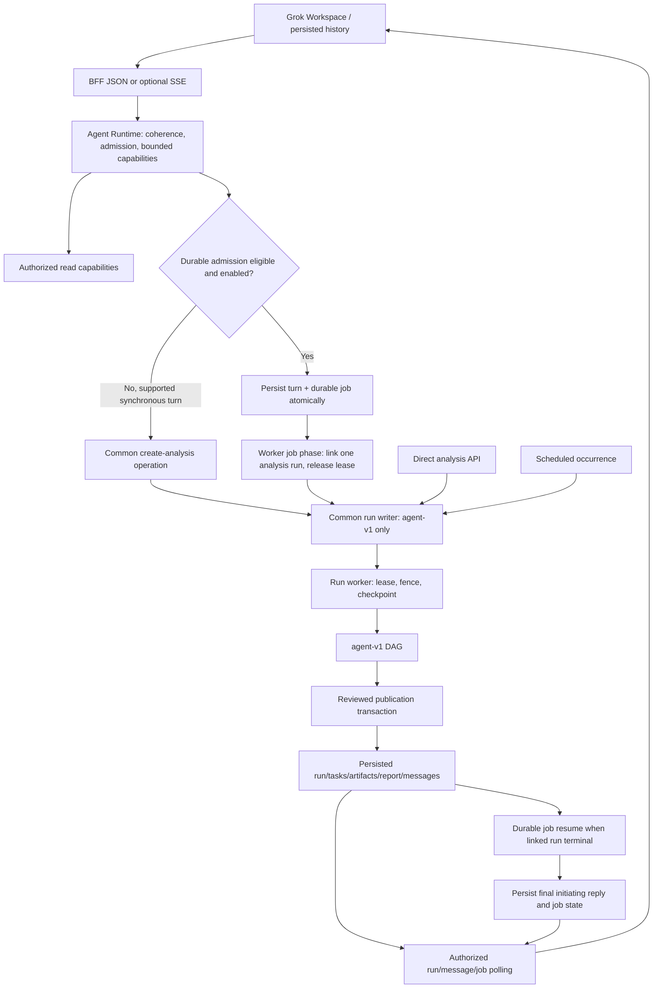
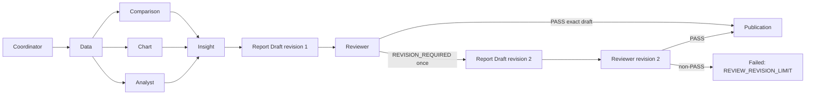

# Kế hoạch chuyển VDaAgent sang agent-v1

## 1. Executive summary

**Quyết định khuyến nghị: mọi AnalysisRun mới phải được tạo bằng `agent-v1` tại transaction ghi run; xóa `AGENT_WORKFLOW_ENABLED` khỏi cơ chế chọn workflow.** Agent Runtime trở thành chat-turn handler mặc định; Grok Workspace trở thành giao diện mặc định. Durable execution được đưa vào luồng admission của Runtime với phạm vi đã được hỗ trợ, sau khi kiểm tra schema và worker. SSE tiếp tục là transport tùy chọn, có JSON fallback giữ nguyên identity.

Giữ legacy data để đọc, không chuyển nhãn hoặc chạy lại artifact/checkpoint cũ bằng agent-v1. Chặn tạo legacy mới trước, xử lý dứt điểm backlog legacy trong một cửa sổ drain hữu hạn, rồi xóa legacy executor. Giữ compatibility reader, report format/export, lineage và lịch sử conversation. Chỉ loại code thực thi đã hết trách nhiệm, không xóa theo tên `legacy` một cách máy móc.

Plan này dành cho **owner triển khai `6-sol`**. Task phân tích hiện tại chỉ tạo `docs/plan.md`; không triển khai source/config/migration/test, không commit/push, không chạy test/build, không đọc hoặc sửa dữ liệu database. Audit dựa trên cây source ngày **2026-09-25**, branch `main`, HEAD `101f965e73d8e08729468f1d3f89e7b32d9adc3a`. Đã quét repository theo reference và đọc các đường thực thi, persistence, API, UI, test harness, schema và tài liệu liên quan. Đây là static audit, không phải chứng nhận môi trường đang chạy đã đủ migration hoặc worker.

Working tree có thay đổi ngoài task: `.gitignore` từ đầu; trong lúc audit xuất hiện thêm `src/frontend/src/server/api/problem-response.ts` và `src/frontend/src/server/api/router.ts` bổ sung logging, cùng untracked `.tmp-debug-turn.mjs` khi kiểm tra cuối. Giữ nguyên các thay đổi đó; 6-sol phải kiểm tra lại diff trước khi làm việc. `docs/plan.md` chưa tồn tại trước task này. Chỉ đọc allowlist 5 dòng feature flag từ `.env`: cả 5 hiện là `true`; không chép secret vào tài liệu. Local config này **không chứng minh** deployment khác đã bật, đủ schema hoặc đã ngừng tạo legacy.

## 2. Product decision

| Quyết định | Kết quả phải đạt |
| --- | --- |
| Workflow phân tích duy nhất cho run mới | Direct analysis, chat, signal analysis, durable job, scheduled tick và manual schedule trigger đều đi qua cùng transaction tạo `agent-v1`. |
| Không còn selector legacy | Không giữ `AGENT_WORKFLOW_ENABLED=false` như một đường rollback. Không nhận workflow version từ client hoặc LLM. |
| Chat-turn handler chính | Agent Runtime chịu trách nhiệm coherence, admission, bounded planning/capabilities và accepted/final response. Durable admission là execution strategy bên trong ranh giới này, không phải một bot khác đứng trước và bỏ qua Runtime. |
| Workflow agent-v1 | Giữ nguyên Coordinator → Data → fan-out Comparison/Chart/Analyst → fan-in Insight → Report Draft → Reviewer → Publication. |
| UI chính | Grok Workspace dùng persisted run/tasks/messages/artifacts/job data. Giữ các route, tenant scope, report export, imports và automations hiện có. |
| Historical data | Giữ `legacy-v1` và payload không có version như dữ liệu lịch sử; legacy run chỉ đọc sau drain. Không sửa hash, task graph hoặc publication provenance để giả lập agent-v1. |
| Compatibility chat | `chat/legacy` không đồng nghĩa `legacy-workflow`. Có thể giữ tạm sau flag Runtime để rollback chat có chủ đích; nó cũng phải tạo `agent-v1` qua repository chung. Không tự fallback sang nó khi Runtime lỗi. |
| Durable support | Giữ rule admission hẹp hiện có; không tuyên bố mọi chat turn hoặc mọi scheduled run có durable persona trace. AnalysisRun đã có lease/checkpoint riêng. |
| Phạm vi ngoài kế hoạch | Không đổi numeric semantics, mở rộng use case, tạo agent tự trị không giới hạn, thêm provider bắt buộc, tái thiết kế toàn bộ UI, PDF export hoặc xóa lịch sử/database. |

Tiêu chí “không có legacy mới” được tính theo **INSERT run mới**, không theo mọi response chứa run. Replay idempotency của request cũ có thể trả lại legacy run đã tồn tại; điều đó không được tạo thêm row, enqueue lại hoặc đổi workflow.

## 3. Current architecture audit

### 3.1. Bằng chứng và tác động

Các path dưới đây tính từ repository root; tên function là điểm tra cứu ổn định khi số dòng thay đổi.

| Khu vực | Sự thật từ source hiện tại | Tác động tới chuyển đổi |
| --- | --- | --- |
| Config | `src/backend/packages/config/src/index.ts`: cả 5 flag default `false`; `.env.example` cũng `false`. | `.env` local bật tất cả chưa loại selector hoặc default ở môi trường khác. |
| Web composition | `src/frontend/src/server/context.ts:repository` truyền `workflowVersion` từ `AGENT_WORKFLOW_ENABLED`. | Direct API và chat non-durable có thể tạo legacy. Repository được cache trên global state nên đổi env cần restart web. |
| Worker composition | `src/backend/worker/src/main.ts:main` truyền cùng selector. | Scheduler trong worker còn có thể tạo legacy độc lập với web. |
| Repository defaults | `db/src/repository.ts:createRepository/buildRun`, `transactions/create-run.ts:buildRun` đều có fallback `LEGACY_WORKFLOW_VERSION`. | Chỉ sửa 2 composition root là chưa đủ; test/helper hoặc caller khác vẫn tạo legacy. |
| Durable writer | `repository.ts:agentExecution` pin riêng `agent-v1`. `agent-execution-repository.ts:startAnalysis` kiểm tra version và liên kết run/job trong cùng transaction. | Đã có một đường agent-v1 bắt buộc, nhưng chưa áp dụng cho mọi writer. |
| Version persistence | `runs` trong `schemas/001_inventory.sql` không có column `workflow_version`; version ở `runs.payload`. `RunSchema` cho phép thiếu; `mapping/run.ts:normalizeRun` đọc thiếu thành legacy. | Không lập migration `ALTER COLUMN workflow_version SET DEFAULT` vì column đó không tồn tại. Phải tách write invariant khỏi historical normalization. |
| Dispatch | `worker/src/workflow-dispatcher.ts` dùng ternary: agent-v1 thì agent executor, mọi giá trị còn lại đi legacy. | Cần dispatch tường minh; không để version sai/thiếu bất thường trở thành silent executable fallback. |
| Lease/retry | `workflow/lease-repository.ts:claimNextRun` claim queued hoặc running hết lease, tối đa 3 attempts; không lọc version. `run-repository.ts:retryRun` requeue failed cùng run và không chặn legacy. | Xóa executor trước khi xử lý backlog sẽ làm run cũ bị claim rồi lỗi. Retry phải phân biệt lịch sử, resume agent run và replay transport. |
| Retry surface | Có method repository `retryRun`; không thấy route retry trong `server/api/routes/analyses-runs.ts`. | Không giả định UI/API hiện có nút resume run. Plan không tự mở endpoint retry mới chỉ để chuyển workflow. |
| Agent DAG | `analysis-v1/dag.ts` có 9 task; `stages/branches.ts:executeIndependentBranches` dùng `Promise.allSettled`. | Đây là fan-out/fan-in thật, không được thay bằng loop tuần tự theo persona. |
| Checkpoint/review | Keyed immutable artifacts, stage rehydration, ReportDraft revision 1/2; `workflow.ts` chỉ cho một correction, second non-PASS thành `REVIEW_REVISION_LIMIT`. Reviewer mặc định deterministic. | Không thêm revision thứ ba, không đổi reviewer thành LLM bắt buộc, không resume từ checkpoint khác run hoặc sai hash. |
| Publication | `transactions/publish-reviewed-draft.ts` giữ run fence, đọc lại exact draft/review graph và predecessor tasks, ghi report/task/run trong transaction. Generic `storeArtifact` chặn report trên agent-v1. | Không dùng `completeRun`/legacy publisher cho agent-v1. `reviewer` succeeded khác với verdict PASS; report task succeeded mới là draft. |
| Shared legacy paths | `analysis-v1/workflow.ts` và `stages/insight-report.ts` import `legacy-workflow/narrative/provider.ts`; BFF report export lấy `exportReport` từ agents root, nguồn ở `legacy-workflow/export-report.ts`. | Phải chuyển shared provider và exporter sang vị trí trung lập trước khi xóa thư mục executor. |
| Report compatibility | Publication agent-v1 vẫn tạo artifact kind `report` với public payload tương thích cũ. Reader decision có `legacy_report_brief` và `unavailable`. | Các khái niệm legacy-shaped report, calculation/comparison/insight artifacts và export CSV/JSON chưa phải dead code. |
| Runtime/durable routing | `server/api/streaming/agent-turn.ts` chọn Runtime hoặc `AgentChatOrchestrator`; trước đó eligible durable request đi `enqueueAgentTurn`, bỏ qua Runtime submit. | Bật Runtime hiện chưa khiến nó là admission handler cho mọi turn; phải hợp nhất orchestration boundary mà không tạo hai message pairs. |
| Non-durable request crash | `runtime.ts:submit` replay trả persisted accepted state ngay; `conversation-repository.ts:startTurn` tạo placeholder nhưng không có HTTP-turn lease/recovery queue. | Process chết sau startTurn trước run linkage/finalize có thể để reply in_progress. Durable job guarantee không áp dụng cho mọi request; cần recovery policy riêng, không re-plan tự động khi replay. |
| Durable schema check | Worker chỉ kiểm tra `to_regclass('public.agent_turn_jobs')`. Flag false vẫn drain durable queue nếu bảng có. | Giữ queue drain khi tắt admission; readiness phải kiểm tra cả invocations/events/columns/constraints, không chỉ một table. |
| Schema coupling hiện hữu | `checkpoint-repository.ts:setTask` gọi `syncAgentInvocationsFromRun` cho agent-v1 không kiểm tra table tồn tại; projection query trực tiếp `agent_turn_jobs`. | Agent-v1 có thể lỗi trên môi trường chỉ mới có migration 006/007 dù durable flag false. Baseline schema phải bao gồm 008 trước cutover. |
| Job completion | `finishRunAssistant` bỏ qua initiating reply có durable job; worker resume job mới hoàn tất reply. `resumeAnalysis` xác thực Data pack rồi thêm report_ref nếu có record hợp lệ. | Run terminal và report published có thể đến trước job/message terminal. Không được dừng mọi polling theo run.status. |
| Projection completion | Task transitions thông thường sync personas; publication ghi task trực tiếp trong transaction, không qua `setTask`; resume job có thể đánh dấu các persona còn active là completed. | Cần sync ở publication/terminal boundaries và xác minh stage thật, không đánh completed theo vòng đời job một cách mù quáng. |
| Cancellation | UI chỉ cancel job khi chưa có run, nhưng repository `cancelAgentTurnJob` hiện không chặn linked run. Run cancel không cập nhật ngay toàn bộ task/persona. | Có race giữa link và cancel; phải định nghĩa canonical cancel boundary và terminal projection. |
| Workspace | `workspace.tsx` ưu tiên Grok khi flag true; nếu false mới chọn `LegacyAnalysisWorkspace` theo version. Legacy component còn form tạo analysis và cancel. | Historical read-only hiện chưa được bảo đảm cho mọi composition. |
| Direct routes | `app/runs/[runId]/page.tsx` → Workspace; Grok truyền `externalRunId` cho controller. `run-view.ts` chặn write khi unresolved external run hoặc scheduled, chưa chặn legacy. | Giữ deep link, thêm historical guard; không redirect thành “run mới”, không đoán version khi loading. |
| Polling | `use-chat-run-polling.ts` refresh tasks/artifacts/messages khi active rồi dừng run polling lúc terminal; `use-agent-execution.ts` poll job riêng, chưa phát trigger tải lại message khi job terminal. | Có nguy cơ reply cuối không cập nhật sau khi run đã xong. Cần regression test điều khiển thứ tự response. |
| Message merge | `use-messages.ts` có active org/conversation guard; `mergeMessages` upsert theo ID nhưng chưa so `updated_at`. | Response cũ cùng conversation có thể đè trạng thái mới; org/conversation guards chưa giải quyết response đảo thứ tự hoặc chọn A→B→A. |
| Duplicate reads | Workspace vẫn mount `useAnalysisRun`; direct run Grok lại dùng `useWorkspaceRunResource/useChatRunPolling`. | Tách phần selected-run state khỏi poller cũ để tránh hai vòng polling trên cùng route. |
| Tests/CI | E2E mặc định legacy; agent suite skip nếu thiếu `E2E_AGENT_WORKFLOW=true`. CI chỉ chạy `pnpm test:e2e` mặc định. Mock Gemini trả legacy decision cho object input. | Cần đổi mặc định E2E, runtime provider mock và CI coverage, không chỉ sửa expected version. |
| Docs | `docs/context.md` và code ownership nói opt-in/default-off; các redesign docs ghi audit cũ. `ARCHITECTURE.md` rỗng. README/check-docs tham chiếu một số handoff docs không còn trong cây. | Không dùng docs cũ thay source. Ghi baseline docs debt, cập nhật hướng sản phẩm có kiểm soát; không tuyên bố check-docs đã pass. |

### 3.2. Phần giữ nguyên về nghiệp vụ và quyền

Semantic/domain modules tiếp tục tính số, kiểm chứng claim, lineage, scope và as-of; model chỉ chọn/combine dữ liệu được allowlist. `create-run.ts` pin `run_snapshots` và metric config tại enqueue. Conversation, run và artifacts dùng org boundary; viewer được đọc report/export nhưng không tạo/cancel run/turn. `workflow-status` yêu cầu write entitlement để đọc metadata draft/review; viewer không nên gọi endpoint này.

Historical message normalization nằm ở `db/src/mapping/conversation.ts`; schema 005/006/007 giữ `sender_agent=null`, content/parts cũ và initiating assistant row. Không xoá row này để dựng timeline mới. Stage messages và runtime SSE activity là hai nguồn khác nhau: SSE activity không phải persisted stage checkpoint.

## 4. Legacy-v1 dependency map

### 4.1. Toàn bộ nhóm writer cần khóa

| Entry point | Chuỗi gọi đã xác nhận | Điểm phải bảo đảm agent-v1 |
| --- | --- | --- |
| `POST /api/v1/analyses` | `analysisRoutes → repo.createRun → buildRun` | Transaction run writer, không dựa vào UI hoặc flag. |
| Chat JSON mới / follow-up | `conversationRoutes → agentTurnSubmitter → AgentRuntime` hoặc legacy chat → `chat/operations:createAnalysisTool → attachRunToTurn → buildRun` | Runtime default và repository writer; legacy chat rollback cũng dùng writer mới. |
| Runtime capability | `runtime/capabilities/create-analysis.ts → createAnalysisTool` | Giữ shared operation; `legacyToolContext` chỉ là adapter, không phải executor. |
| Signal `analyze_segment` | Deterministic policy/capability tạo analysis qua cùng operation | Không bỏ sót mutation từ signal vì nó không eligible durable. |
| SSE chat | `streamAgentTurn → AgentRuntime.submit` | Cùng write invariant, input safeguards, identity với JSON. |
| Durable inventory turn | `enqueueAgentTurn → worker dispatchAgentTurn → startAgentAnalysis → buildRun` | Đã pin agent-v1; bỏ cấu hình riêng trùng lặp sau khi common writer bắt buộc, giữ defensive assertion. |
| Scheduled automatic | Worker `tickWhenDue`/`--scheduler-once` → `ScheduleRepository.tick/occurrence → buildRun` | Mọi occurrence mới agent-v1, bất kể definition tạo thời nào. |
| Scheduled API/manual | `routes/scheduler.ts`, `routes/report-definitions.ts` → repository tick/triggerDefinition → occurrence | Không sửa run/occurrence cũ; không tạo occurrence trùng lịch. |
| Retry repository | `retryRun` update run đã tồn tại | Không chuyển version; chặn requeue legacy sau cutover, bảo toàn checkpoint agent-v1. |
| Idempotent replay | `buildRun` trả prior trước INSERT; turn replay có identity riêng | Trả lịch sử cũ là hợp lệ; không biến replay thành run agent-v1 mới. |

### 4.2. Các dependency phải phân loại trước khi xóa

```text
AGENT_WORKFLOW_ENABLED
  ├─ web context ──┐
  └─ worker main ─┴─ repository option/default ─ create-run ─ runs.payload
                                                         └─ run_snapshots/messages
runs.payload ─ normalizeRun ─ claimNextRun ─ dispatchWorkflow
                                      ├─ legacy-workflow/workflow + dag
                                      └─ analysis-v1/workflow + stage checkpoints

legacy-workflow/narrative/provider ─ analysis-v1 Insight + nhiều tests   [SHARED: chuyển path]
legacy-workflow/export-report ─ BFF report export + tests                [SHARED: chuyển path]
publish-legacy-report + Repository.completeRun ─ legacy executor        [DELETE sau drain]
mapping/run + RunSchema + task kinds ─ historical reads                [KEEP compatibility]
report/decision readers + export + evidence UI ─ cả hai workflow        [KEEP]
chat/legacy ─ explicit Runtime rollback                                [KEEP tạm, chỉ agent-v1 writes]
workflow-view-model legacy graph ─ historical presentation              [KEEP]
```

Các test còn gọi `executeLease` gồm `pipeline.test.ts`, `postgres-pipeline.test.ts`, `agents/src/tools.test.ts`, `chat.test.ts`, `data-agent.test.ts`, `runtime-context.test.ts`. Các test import trực tiếp narrative provider từ legacy path gồm `agent-workflow.test.ts`, `artifact-visibility.test.ts`, `runtime-context.test.ts`, `capability-registry.test.ts`, `provider.test.ts`; `draft-workflow.test.ts` dùng exporter qua agents barrel. 6-sol phải rà lại toàn bộ import trực tiếp và barrel trước deletion, không xóa test semantics/tenant/publication chỉ vì fixture từng chạy legacy.

Các reference `legacy` **được phép tồn tại** sau cutover: historical version enum/read normalization; task kinds Orchestrator/Calculation/Validation dùng để đọc; report/brief backward compatibility; fixtures migration/history; migration đã phát hành; explicit chat rollback; tài liệu lịch sử được đánh dấu. Các reference **không được tồn tại ở production executor** sau Phase 6: import/export `executeLease`, executable legacy DAG, `completeRun`, `publishLegacyReport`, workflow selector flag, new-run default/fallback legacy.

## 5. Target agent-v1 architecture

### 5.1. Bốn layer và authority



Runtime không thực thi toàn bộ analysis trong HTTP request. Worker durable job không thay analysis executor; start phase link run rồi chuyển `waiting` và nhường worker. Run worker thực thi DAG. Resume phase chỉ xác minh persisted outcome và hoàn tất đúng initiating message. SSE không là queue, không bảo đảm durability và không điều khiển publication.

### 5.2. Topology và gates bất biến



- Giữ `Promise.allSettled` cho ba nhánh độc lập; Insight đọc đủ validated branch checkpoints. Một branch thất bại không được bị coi là completed vì persona khác thành công.
- Giữ immutable artifact keys, deterministic IDs/hash/lineage và attempt/fencing checks. Reclaim lease và retry phải rehydrate, không ghi đè artifacts hoặc gọi lại provider nếu checkpoint hợp lệ đã có.
- Publication chỉ xảy ra qua `publishReviewedDraft`, có PASS đúng revision và predecessors thành công ở attempt hiện tại. UI chỉ hiển thị published report khi report record/artifact thật tồn tại.
- Giữ private draft/review artifacts khỏi public messages, workspace context, SSE, persona events và viewer. Task `reviewer:succeeded` không được render thành “PASS” nếu không có authorized verdict.
- Persisted persona mapping hiện có: Data=`data`; Compare=`comparison`; Insight=`analyst+insight`; Report=`chart+report+reviewer+publication`; root=`orchestrator` của job. Giữ mapping có nhãn rõ trong đợt này; đây là **projection** nhiều task, không phải 5 executor tuần tự. Coordinator và Publication vẫn xuất hiện đầy đủ trong task graph. Không tự gán `analysis_stage_id` của một task cho persona có nhiều task.

### 5.3. Runtime/durable integration phải làm thật

Đưa durable decision về entry của `AgentRuntime.submit` hoặc helper admission do Runtime sở hữu. Thứ tự bắt buộc: validate request/route coherence → resolve persisted replay/ownership → chọn execution strategy → tạo đúng một turn. Với eligible durable turn, `enqueueAgentTurn` tiếp tục sở hữu atomic startTurn callback tạo message pair/job/root/event; không gọi `startTurn` lần đầu bên ngoài rồi enqueue thành lần thứ hai. Non-durable turn giữ bounded planner và capability registry hiện tại.

Giữ admission `isApprovedDurableAnalysisTurn`: chỉ `slow_moving_inventory`, không target/signal/drilldown và không causal/SQL request; không mở rộng eligibility trong migration này. Non-eligible request về Runtime bounded path, không về legacy analysis. Runtime unavailable/provider failure phải ra safe error hoặc grounded deterministic response theo logic hiện hữu, không tự đổi handler/workflow.

Replay phải dựa vào persisted turn/job ownership, không quyết định lại từ flag đang bật: cùng key/body và `client_turn_id` trả cùng conversation/message/job/run. Hiện `enqueue` có thể trả `TURN_NOT_DURABLE` nếu key đã thuộc turn non-durable; cần resolve replay trước admission để flip flag không tạo duplicate hoặc biến request replay thành lỗi vô cớ. Không thay request hash/key scope cũ chỉ để thêm version.

Baseline deployment phải có toàn bộ schema 006/007/008 và migration mới của plan. `DURABLE_AGENT_EXECUTION_ENABLED=false` chỉ tắt **new job admission**, không tắt worker drain hoặc xóa API đọc job cũ. Strengthen readiness ở cả web/worker; thiếu schema trả lỗi cấu hình rõ ràng trước enqueue, không accepted 202 rồi để job treo.

### 5.4. Failure, retry và cancellation

| Tình huống | Hành vi đích |
| --- | --- |
| HTTP/SSE retry | Cùng identity chỉ replay persisted accepted result; không tạo run/job/placeholder mới. |
| Web crash khi non-durable turn chưa có run/job | Không hứa tự resume provider/planner. Sau maintenance xác nhận HTTP owner cũ đã dừng và quá timeout + grace đã định, scoped reconciliation re-read dưới lock: nếu không linked run/job và assistant vẫn in_progress, finalize failed với mã đề xuất `TURN_INTERRUPTED`; giữ messages/identity, user muốn thử lại thực sự thì new explicit turn. Không làm bằng timer browser hoặc khi owner còn có thể chạy. |
| Agent run worker crash | Reclaim expired lease theo giới hạn hiện có; fence cũ không ghi được; resume exact checkpoint. |
| Job worker crash | Reclaim job phase, atomic linkage ngăn tạo run thứ hai; waiting không chiếm worker. |
| Agent run failed không linked terminal job | Existing authorized repository retry có thể requeue cùng run/checkpoint; không mở thêm public route trong scope này. |
| Linked durable job đã failed/cancelled | Không revive job terminal ngầm hoặc retry run cùng ID rồi bỏ initiating reply ở trạng thái terminal. Khuyến nghị chặn repository retry với mã rõ và yêu cầu một turn mới; manual same-run recovery của job terminal là ngoài scope. |
| Cancel job trước linkage | Fenced job cancellation, final user/assistant status và events trong transaction; không sinh run. |
| Link xảy ra cùng lúc cancel job | Server re-read dưới lock; nếu đã linked, trả conflict có mã `AGENT_JOB_RUN_LINKED` (tên đề xuất), client refresh và dùng run cancel. Không đánh job cancelled trong khi run vẫn tiếp tục vô hình. |
| Cancel linked run | Run fence/terminal status là authority; job được wake và finalizes cancelled, pending/running task/persona projection thống nhất, không đổi completed artifacts. |
| Exhausted attempts/membership revoked | Hoàn tất run/job/message terminal qua shared helper, clear lease/owner; không để initiating assistant in_progress vĩnh viễn như nhánh claim hiện có có thể gây ra. |
| Durable off trong rollback | Job đã accepted vẫn được drain/read; turn mới dùng Runtime không durable và tạo agent-v1. |

## 6. Flag/config decisions

| Flag | Hiện tại | Quyết định khuyến nghị | Thời điểm / điều kiện | Không được gộp với |
| --- | --- | --- | --- | --- |
| `AGENT_WORKFLOW_ENABLED` | Config/example false; local true; chọn run default ở web/worker | **Delete** selector/schema/output/env example. Hard-code invariant agent-v1 ở common writer. Khi env cũ còn tồn tại, bỏ ảnh hưởng và log deprecation an toàn một lần; false không được tạo legacy. Sau cửa sổ nâng cấp có thể reject config cũ, không cần giữ boolean compatibility dài hạn. | Phase 1 source; rollout admission gate/DB guard trước nhận traffic mới. Drain executor chỉ đọc version cũ, không dùng flag này. | Runtime, UI, durable, SSE. |
| `GROK_RUNTIME_ENABLED` | false; local true | **Default true; giữ tạm rollout flag**. False chỉ chọn explicit old chat handler dùng agent-v1 writer. Không fallback tự động khi Runtime lỗi. | Phase 4 sau parity JSON/target/signal tests. Hết cửa sổ quan sát ở Phase 8 phải tạo mục retirement có owner/date; xóa flag/chat-legacy là bước riêng sau khi parity và recovery đạt, không điều kiện để xóa legacy analysis executor. | Workflow version, provider lựa chọn, durable admission. |
| `GROK_WORKSPACE_ENABLED` | false; local true | **Default true; giữ tạm rollout flag**. False dùng AgentChat compatibility composition với historical/read-only guards chung; không quay lại legacy write form. | Phase 5; retire sau hai deployment liên tiếp đạt gates và một kỳ scheduled report thành công, owner 6-sol ghi ngày cụ thể theo môi trường. | Workflow selection, Runtime, SSE. |
| `DURABLE_AGENT_EXECUTION_ENABLED` | false; local true; bounded admission | **Giữ capability độc lập; default true ở release đích sau readiness gates**. Trước khi schema/worker đồng bộ, explicit false trong môi trường staging chuyển tiếp. False tắt enqueue mới, vẫn drain/read. | Phase 4 hoàn thiện behavior; Phase 8 bật canary. 008 là baseline cho agent-v1 hiện tại kể cả flag false. Không “default true” trước readiness check. | AnalysisRun durability, Runtime planner, persona UI, SSE. |
| `GROK_SSE_ENABLED` | false; local true | **Giữ capability transport độc lập, default false** trong config/example. Có thể bật riêng sau JSON/polling ổn định. | SSE non-durable cần Runtime; eligible durable tiếp tục trả 404 trước mutation và fallback JSON. Không triển khai durable SSE mới trong scope. | Workflow, job durability hoặc workspace layout. |

Không chọn phương án chỉ đổi `AGENT_WORKFLOW_ENABLED` thành true: explicit false và repository fallback vẫn tạo legacy; mixed web/worker env vẫn khác nhau. Giai đoạn chuyển tiếp chỉ dành cho **thực thi backlog cũ** và rollout Runtime/UI, không kéo dài khả năng tạo legacy mới.

Các default true phải đi cùng deployment config thực tế: biến môi trường đã khai báo false sẽ override default mới. 6-sol cập nhật `.env.example` và runbook, không tự sửa `.env` chứa credentials của người khác. `.env` local có `AGENT_WORKFLOW_ENABLED=true` sẽ là biến obsolete; chỉ yêu cầu operator bỏ biến này khi triển khai. Không đưa flag hoặc secret server thành `NEXT_PUBLIC_*`.

Giữ Gemini/OpenAI narration dùng chung cho Insight và runtime provider config riêng `AGENT_LLM_*`. Grok Workspace không yêu cầu xAI; không đổi provider chỉ do tên UI.

## 7. Historical data compatibility strategy

### 7.1. Chọn giữ dữ liệu và minimal reader, không migrate execution identity

Không chuyển bất kỳ legacy run đã tạo nào thành agent-v1, kể cả run chưa có task. Version, snapshot membership, request hash, evidence graph, draft/review provenance và publication semantics phải còn truy được. “Phân tích lại bằng agent-v1” là **run mới với identity mới**, không phải retry legacy và không sửa `occurrence.run_id` cũ.

Giữ `WorkflowVersionSchema` gồm cả hai giá trị cho đọc; `RunSchema.workflow_version` tiếp tục optional ở historical wire/input normalization. Tạo riêng new-run invariant/schema literal agent-v1 hoặc constant cùng validation ở write boundary. `normalizeRun` giữ missing-version→legacy chỉ trong reader. Version ngoài enum phải lỗi rõ/được đưa vào inventory xử lý riêng, không normalize thành legacy hoặc agent. Không suy ra version từ use_case, flag hoặc số task.

### 7.2. Ma trận vòng đời dữ liệu cũ

| Dữ liệu tại cutover | Xử lý | Điều cấm |
| --- | --- | --- |
| Legacy succeeded | Read-only run/tasks/artifacts/events/report; GET report/export/brief nếu có vẫn hoạt động. | Không manufacture PASS/draft/reviewer hoặc thêm agent tasks. |
| Legacy failed/cancelled | Read-only, hiển thị lỗi/kết quả từng phần có thật; không retry bằng executor mới. | Không đổi status thành succeeded hoặc requeue qua method chung. |
| Legacy queued | Drain bằng executor cũ trong release chuyển tiếp, chỉ cho cohort đã tồn tại trước write cutover. Deadline hết thì retire có audit. | Không update version để ép chạy agent-v1. |
| Legacy running, lease còn hiệu lực | Cho owner hiện tại hoàn thành trong drain window; không hai worker ghi cùng run. | Không xóa executor/deploy final worker trước khi owner kết thúc hoặc bị fence. |
| Legacy running hết lease / worker restart | Trong drain window, compatibility dispatcher có thể reclaim cùng legacy executor/attempt cap. Sau deadline, retire; không dispatch sang agent-v1. | Không retry vô hạn; không fallback từ unknown version. |
| Payload thiếu workflow_version | Coi là historical legacy sau reader normalization và kiểm kê cùng nhóm ở trên. | Không backfill tất cả thành agent-v1. |
| Artifact/checkpoint/report cũ | Giữ IDs, keys, hashes, payload, validations, sources, snapshots, report_exports và storage objects. | Không drop artifact kinds/chuyển key/rewrite immutable content để thỏa schema mới. |
| Conversation/messages cũ | Giữ original references/parts/sender/status; terminalize placeholder còn treo chỉ khi retire/drain có provenance. Interactive conversation có thể nhận turn mới agent-v1 sau khi người dùng rời historical selection. | Không đóng băng cả conversation chỉ vì có một legacy run; không tự gắn persona mới cho message cũ. |
| Scheduled definition cũ | Không cần migrate version trong definition vì hiện không có selector đó. Occurrence mới dùng writer mới. Occurrence đã có replay nguyên run cũ. | Không sửa immutable occurrence hoặc thay report của kỳ cũ. |
| `/runs/:runId` hoặc `/reports/:reportId` cũ | Load authorized row, render historical banner và dữ liệu có thật; mở report/evidence/export hợp lệ. | Không auto-create run, redirect che mất lịch sử hoặc gọi private workflow status cho viewer. |

### 7.3. Inventory và drain protocol

1. Trước rollout, kiểm kê read-only theo org/version (kể cả missing/unknown)/status/lease/attempt, số job đang active, linked run, message in_progress, report/artifact counts và hash sample. Ghi timestamp cutover và danh sách run legacy active vào deployment record có quyền truy cập phù hợp, không vào source/public logs.
2. Dừng new admission ngắn ở API và scheduler (bao gồm tick trong mỗi worker loop); dừng/replace **mọi old web/worker writer**. Có thể dùng maintenance của deployment, không phát minh flag hiện chưa có. Triển khai baseline schema + release chuyển tiếp bắt buộc agent-v1 writer và còn explicit legacy drain executor. API/scheduler chỉ mở lại sau DB new-write guard và readiness pass.
3. Release chuyển tiếp dispatch explicit `agent-v1`/`legacy-v1`; legacy chỉ được xử lý cho backlog đã kiểm kê. Không cho user requeue failed legacy. `AGENT_WORKFLOW_ENABLED` đã mất quyền chọn writer tại mốc này.
4. Drain đến khi queued/running legacy bằng 0 và không còn valid legacy lease. Nếu run không thể hoàn tất trong deadline operator đặt ở Phase 0, terminalize có kiểm soát: lock run; xác minh legacy/cohort; tăng fencing token; clear worker/lease; set failed + mã đề xuất `LEGACY_WORKFLOW_RETIRED`; cập nhật pending/running tasks thành cancelled với reason; giữ successful checkpoints; append run event; finalize initiating assistant/user message còn active trong cùng transaction. Không dùng `failRun(lease)` nếu không có valid lease; cần administrative recovery helper riêng, có dry-run, scope org/run cụ thể và log kết quả. Không cấp endpoint public mới cho helper.
5. Worker final sau Phase 6 chỉ claim agent-v1. Legacy active bất ngờ phải bị phát hiện bằng startup/preflight/monitor và đưa qua retirement recovery; không chỉ lọc khỏi queue rồi bỏ treo. Unknown version cần inventory/error rõ trước claim; không lấy queue head rồi fail vĩnh viễn làm nghẽn run khác.
6. Chỉ xóa legacy executor sau khi có bằng chứng zero-backlog/zero-lease và historical regression pass. Giữ release chuyển tiếp làm artifact phục hồi **chỉ đọc/agent-v1 writes**; không rollback về binary còn legacy writer.

Nếu inventory thấy legacy run đã terminal nhưng initiating message vẫn active, xử lý reconciliation có scope riêng: giữ nguyên run terminal status và artifacts, chỉ cập nhật message/task lifecycle còn treo theo persisted outcome sau khi xác nhận không còn owner hợp lệ. Không rewrite message đã completed, không fabricate report/PASS và không đếm việc sửa placeholder là migrate workflow.

### 7.4. Database changes đề xuất

Giữ `workflow_version` trong `runs.payload` ở đợt này; không tạo thêm column song song rồi dual-write khi chưa cần. Thêm declarative schema file cho guard: INSERT run bắt buộc JSON `workflow_version` chính xác là `agent-v1`; UPDATE không được đổi effective workflow identity (missing và explicit legacy chỉ tương đương trong compatibility normalization). Guard cho phép cập nhật lifecycle legacy trong drain nhưng không cho đổi sang agent-v1. Điều kiện phải từ chối cả SQL NULL, JSON null và missing key, không dựa vào CHECK có thể pass khi expression NULL.

Khuyến nghị private trigger function `SECURITY INVOKER`, fixed search_path, revoke callable privileges không cần thiết, không mở authenticated INSERT. Không sửa historical migrations 001–008. Thêm migration mới sinh từ declarative desired state; không `db reset` môi trường có dữ liệu. Không thêm CHECK buộc mọi row lịch sử agent-v1 và không mass UPDATE payload. Test INSERT chặn legacy/missing/unknown, UPDATE lifecycle historical được phép nhưng đổi identity bị chặn, reader/export vẫn đọc nguyên dữ liệu.

Repository dùng declarative `schema_paths` và bật `[experimental.pgdelta]`; CLI local xác nhận `2.117.0`. Workflow sinh migration phải theo CLI help và [Supabase declarative schemas](https://supabase.com/docs/guides/local-development/declarative-database-schemas): sửa schema source rồi generate/review migration; không dùng SQL editor để thay desired source. Cần kiểm tra diff trên shadow DB vì schema hiện dùng các file ALTER nối tiếp. Giữ `private.assign_legacy_artifact_key` và trigger artifact-key compatibility trong đợt này: nó không tạo run legacy và không đáng đánh đổi tương thích writer/fixture chỉ để hết chữ legacy.

### 7.5. Historical presentation và rerun

Grok Workspace và AgentChat rollback dùng chung predicate read-only cho loaded historical run; unresolved direct route vẫn fail-closed. Banner “Lượt phân tích lịch sử · chỉ xem” không cấm viewer export published report. Scheduled run/conversation view cũng chỉ đọc; quyền quản lý definition/trigger trong Automations vẫn theo owner/analyst hiện có, không cấm mọi scheduled management API chỉ vì view read-only. Không render nine-stage agent graph khi task graph là legacy/partial; dùng stored dependencies và generic fallback.

Owner/analyst có thể chọn “Phân tích mới” để mở composer có scope/as-of/question gợi ý, clear selected historical run rồi submit identity mới. Nếu dùng conversation cũ, các message cũ giữ nguyên và turn mới nối thêm; schedule conversation vẫn chỉ đọc, muốn phân tích mới phải mở interactive conversation. Rerun mới sẽ pin snapshot theo dữ liệu hiện có ở thời điểm enqueue; do late imports, không hứa tái lập chính xác snapshot membership của run cũ. Exact historical replay chưa nằm trong scope.

Legacy artifacts không có packs mới phải vẫn đọc được qua AnalysisResult/report/evidence compatibility view; `validatedPreviews` hiện chỉ hỗ trợ agent packs nên không được coi timeline trống là “không có dữ liệu”. Không tính lại decision pack để lấp chỗ trống; dùng `legacy_report_brief` hoặc trạng thái unavailable đúng nghĩa.

## 8. File-by-file change matrix

Toàn bộ owner là `6-sol`. `P0`–`P8` tương ứng Phase 0–8 ở mục 9; thứ tự trong một phase đi theo dependencies, không theo thứ tự alphabet. `add` là **path đề xuất chưa có**, migration timestamp do CLI sinh; `keep` yêu cầu giữ behavior/reader và kiểm chứng, không nhất thiết tạo diff. `delete` chỉ có hiệu lực sau gates ghi trong bảng. Đây là kế hoạch thay đổi tương lai, không phải danh sách file đã sửa trong task audit.

### 8.1. Workflow, shared provider và worker

| Path | Action | Lý do/thay đổi | Dependency | Rủi ro chính | Owner | Thứ tự |
| --- | --- | --- | --- | --- | --- | --- |
| `src/backend/packages/agents/src/analysis-v1/workflow.ts` | modify | Đổi import provider chung, comment thành executor chính; giữ resume/review bounded. | Provider relocation | Mất revision recovery | 6-sol | P2, P6 |
| `src/backend/packages/agents/src/analysis-v1/dag.ts` | keep | Canonical nine-stage fan-out/fan-in. | Task contracts | Tuyến tính hóa nhánh | 6-sol | P1–P8 |
| `src/backend/packages/agents/src/analysis-v1/stages/coordinator-data.ts` | keep | Giữ coordinator/data checkpoints, pinned inputs và version assertion. | Writer invariant | Recompute input cũ | 6-sol | P2 |
| `src/backend/packages/agents/src/analysis-v1/stages/branches.ts` | modify | Giữ parallel execution; bỏ comment phase cũ nhắc chưa có draft/publication. | DAG/checkpoints | Nhầm thứ tự persona với DAG | 6-sol | P2 |
| `src/backend/packages/agents/src/analysis-v1/stages/insight-report.ts` | modify | Import narrative từ provider chung; giữ immutable drafts và compatible report payload. | New provider path | Thay output/hash ngoài ý muốn | 6-sol | P2 |
| `src/backend/packages/agents/src/analysis-v1/stages/reviewer.ts` | keep | Rehydrate revision, deterministic validation và one-correction gate. | Domain validators | PASS sai revision | 6-sol | P2–P8 |
| `src/backend/packages/agents/src/analysis-v1/stages/publication.ts` | keep | Public report builder và publication transaction authority. | Reviewed publication | Private lineage leak | 6-sol | P2–P8 |
| `src/backend/packages/agents/src/analysis-v1/checkpoint/stage-context.ts` | keep | Fenced transitions, stage message projection. | Lease/tasks | Stale writes | 6-sol | P2 |
| `src/backend/packages/agents/src/analysis-v1/checkpoint/artifact-store.ts` | keep | Keyed immutable artifacts và validations. | DB storage | Duplicate checkpoints | 6-sol | P2 |
| `src/backend/packages/agents/src/analysis-v1/agents/coordinator-agent.ts` | keep | Deterministic planning cho use case hiện có. | Use-case registry | Mở rộng scope vô ý | 6-sol | P2 |
| `src/backend/packages/agents/src/analysis-v1/agents/data-agent.ts` | keep | Canonical Data pack. | Semantic metrics | Sai số/lineage | 6-sol | P2 |
| `src/backend/packages/agents/src/analysis-v1/agents/comparison-agent.ts` | keep | Branch comparison semantics. | Data pack | Đổi cohort | 6-sol | P2 |
| `src/backend/packages/agents/src/analysis-v1/agents/chart-agent.ts` | keep | Validated chart pack. | Data/comparison evidence | Chart sai nguồn | 6-sol | P2 |
| `src/backend/packages/agents/src/analysis-v1/agents/analyst-agent.ts` | keep | Branch Analyst tách biệt Insight. | Data pack | Bỏ branch | 6-sol | P2 |
| `src/backend/packages/agents/src/analysis-v1/agents/insight-agent.ts` | keep | Evidence-bound narrative selection. | Shared narrative provider | Fabricated claims | 6-sol | P2 |
| `src/backend/packages/agents/src/analysis-v1/agents/report-agent.ts` | keep | Draft và bounded revision builder. | Insight/review | Rewriting historical report | 6-sol | P2 |
| `src/backend/packages/agents/src/analysis-v1/agents/reviewer-agent.ts` | keep | Deterministic reviewer, private checks. | Workflow validators | Bypass review | 6-sol | P2 |
| `src/backend/packages/agents/src/providers/narrative-provider.ts` | add | Chuyển nguyên shared provider, types, constants từ legacy path. | Import inventory | Provider/timeout drift | 6-sol | P2 trước deletion |
| `src/backend/packages/agents/src/reports/export-report.ts` | add | Chuyển exporter CSV/JSON dùng chung; giữ CSV formula escaping/BOM/hash checks. | BFF export/tests | Broken downloads | 6-sol | P2 trước deletion |
| `src/backend/packages/agents/src/legacy-workflow/narrative/provider.ts` | delete | Xóa path cũ sau chuyển provider và mọi import. | New provider + tests | Agent-v1 mất narrative | 6-sol | P6 |
| `src/backend/packages/agents/src/legacy-workflow/export-report.ts` | delete | Xóa path cũ sau chuyển exporter, không xóa chức năng export. | New exporter | Historical report export hỏng | 6-sol | P6 |
| `src/backend/packages/agents/src/legacy-workflow/workflow.ts` | delete | Ngừng executeLease sau drain. | Zero backlog/lease + fixture migration | Legacy active bị bỏ treo | 6-sol | P6 |
| `src/backend/packages/agents/src/legacy-workflow/dag.ts` | delete | Xóa executable legacy DAG; historical frontend graph vẫn giữ. | Executor removal | Mất reader nếu xóa nhầm graph UI | 6-sol | P6 |
| `src/backend/packages/agents/src/index.ts` | modify | Re-export shared provider/exporter ở path mới; xóa DAG/executeLease exports. | Caller migration | Barrel imports còn sót | 6-sol | P2, P6 |
| `src/backend/packages/agents/package.json` | modify | Bỏ legacy executor/export subpaths, khai báo path trung lập nếu consumer cần. | New module paths | Package resolution | 6-sol | P6 |
| `src/backend/worker/src/main.ts` | modify | Bỏ workflow flag; require schema readiness; giữ durable queue drain độc lập admission flag. | Repository readiness | Bật default khi schema thiếu | 6-sol | P1, P2, P4 |
| `src/backend/worker/src/workflow-dispatcher.ts` | modify | Transition explicit dispatch; final chỉ agent-v1 và lỗi version rõ. Giữ heartbeat/finally. | Drain protocol | Silent legacy fallback | 6-sol | P2 → P6 |
| `src/backend/worker/src/run-loop.ts` | modify | Giữ fairness job/run, thêm integration cần thiết cho retirement/readiness; không serialize branch DAG tại loop. | Claim policy | Starvation khi jobs waiting | 6-sol | P2, P4 |
| `src/backend/worker/src/agent-turn-dispatcher.ts` | modify | Public errors/recovery theo job strategy mới; start/wait/resume bounded. | Durable repository | Finalize hai lần | 6-sol | P4 |
| `src/backend/worker/src/scheduler.ts` | keep | Tick/one-shot tiếp tục dùng repository; writer mới tự pin agent-v1. | Common writer | Old worker vẫn tick legacy | 6-sol | P1, P8 |
| `src/backend/worker/src/lifecycle.ts` | keep | Shutdown sau iteration và resource cleanup. | Worker rollout | Valid lease chưa kết thúc khi delete | 6-sol | P8 |

### 8.2. Contracts, repository, schema và recovery

| Path | Action | Lý do/thay đổi | Dependency | Rủi ro chính | Owner | Thứ tự |
| --- | --- | --- | --- | --- | --- | --- |
| `src/backend/packages/config/src/index.ts` | modify | Xóa analysis flag; default Runtime/UI/durable theo gates, giữ SSE false; deprecated env không được tác động writer. | Product decisions | Explicit env false ngoài example | 6-sol | P1, P4, P5 |
| `src/backend/packages/contracts/src/common/primitives.ts` | modify | Thêm canonical new-run version constant nếu cần; giữ historical enum. | Writer/read separation | Thu hẹp enum phá history | 6-sol | P1 |
| `src/backend/packages/contracts/src/analysis/run.ts` | modify | Write-specific invariant/type; giữ optional historical version/task kinds; sửa misleading comment về use_case. | Historical fixtures | Schema parse mất compatibility | 6-sol | P1, P3 |
| `src/backend/packages/contracts/src/analysis/request.ts` | keep | Strict client request không có workflow selector. | Route validation | Client-injected version | 6-sol | P1 |
| `src/backend/packages/contracts/src/api/responses.ts` | keep | Run/Setup/status contracts giữ compatibility; publication là field riêng, không ép vào AgentKey. | Config/setup | UI nhầm verdict/status | 6-sol | P3–P5 |
| `src/backend/packages/contracts/src/runtime/execution.ts` | modify | Giữ bounded admission/persona mapping; chỉ bổ sung typed execution-policy metadata nếu cần cho replay. | Runtime/job integration | Mở rộng capability vô ý | 6-sol | P4 |
| `src/backend/packages/contracts/src/chat/message.ts` | keep | Accepted job ID, stable turn identity và historical message parts. | Admission/replay | Duplicate placeholders | 6-sol | P3–P4 |
| `src/backend/packages/contracts/src/index.ts` | modify | Export new-run invariant nếu thêm; không export executor vào browser. | Contract leaves | Circular imports | 6-sol | P1 |
| `src/backend/packages/contracts/schema/Run.json` | keep | Giữ read enum/optional version; regenerate chỉ khi source schema thay đổi. | contracts:export | Bỏ historical values | 6-sol | P7 |
| `src/backend/packages/contracts/schema/AgentWorkflowStatus.json` | keep | Giữ historical version và private metadata boundary. | Contract parity | Generated drift | 6-sol | P7 |
| `src/backend/packages/contracts/src/export.ts` | keep | Exporter sinh schemas; chỉ thêm schema mới nếu thực sự có wire type mới. | Contract changes | Hand-edit generated JSON | 6-sol | P7 |
| `src/backend/packages/db/src/repository.ts` | modify | Loại workflowVersion option/fallback cho write; readiness; delegate retirement/replay; cuối cùng bỏ completeRun. | Writer/tests/schema | Test override lọt production | 6-sol | P1 → P4 → P6 |
| `src/backend/packages/db/src/transactions/create-run.ts` | modify | Literal agent-v1 tại INSERT, bỏ WorkflowVersion injection; giữ auth/idempotency/snapshots. | New-run contract | Replay tạo run khác | 6-sol | P1 |
| `src/backend/packages/db/src/mapping/run.ts` | modify | Giữ missing→legacy chỉ cho read; không export default dùng cho creation. | Reader consumers | Chuyển legacy sang agent bằng normalize | 6-sol | P1, P3 |
| `src/backend/packages/db/src/repositories/run-repository.ts` | modify | Chặn retry legacy; linked-terminal-job retry policy; terminal task/message synchronization. | Retirement/job policy | Placeholder không terminal | 6-sol | P2–P4 |
| `src/backend/packages/db/src/workflow/lease-repository.ts` | modify | Final claim chỉ agent-v1; rõ handling expired/max-attempt/revoked; chuyển terminal qua helper. | Drain + readiness | Queue-head starvation | 6-sol | P2 → P6 |
| `src/backend/packages/db/src/workflow/fail-run.ts` | modify | Đồng bộ terminal projection/message, giữ fencing và safe error. | Shared terminal rules | Overwrite cancellation | 6-sol | P2, P4 |
| `src/backend/packages/db/src/workflow/checkpoint-repository.ts` | modify | Giữ public/private artifact gates; bỏ tên legacy completion shim bằng shared text; sync terminal/projection có schema contract. | 008 baseline | Private artifact leak/schema failure | 6-sol | P2, P4 |
| `src/backend/packages/db/src/workflow/agent-projection.ts` | modify | Sync từ canonical tasks ở đủ boundaries; giữ event monotonic/idempotent và job/run match. | Publication/cancel/fail | False persona completion | 6-sol | P4 |
| `src/backend/packages/db/src/transactions/publish-reviewed-draft.ts` | modify | Sync projection trong terminal transaction; chuẩn hóa completion text qua helper sẵn có, giữ exact draft/review gate. | Projection helper | Tăng lock scope/deadlock | 6-sol | P4 |
| `src/backend/packages/db/src/transactions/publish-legacy-report.ts` | delete | Xóa write path cũ, giữ report reader. | Drain + caller migration | Gate bypass còn export | 6-sol | P6 |
| `src/backend/packages/db/src/types.ts` | modify | Bỏ completeRun; readiness/replay/retirement contracts tối thiểu nếu dùng facade. | Facade/callers | Broad interface churn | 6-sol | P2, P4, P6 |
| `src/backend/packages/db/src/repositories/agent-execution-repository.ts` | modify | Persisted replay ownership, schema-safe enqueue, linked cancel guard, stronger completion task/publication checks. | Runtime strategy/008 | Duplicate run/job or orphan reply | 6-sol | P4 |
| `src/backend/packages/db/src/repositories/conversation-repository.ts` | modify | Reuse transactional startTurn cho admission/replay; terminalize retired placeholders; không rewrite history. | Turn identity | Flag flip biến replay thành new turn | 6-sol | P3–P4 |
| `src/backend/packages/db/src/mapping/conversation.ts` | keep | Historical message defaults/parts và sender null. | Compatibility fixtures | Không đọc được message cũ | 6-sol | P3 |
| `src/backend/packages/db/src/repositories/schedule-repository.ts` | keep | Dùng writer bắt buộc; occurrence replay và timezone/dedup nguyên vẹn. | Common writer | Duplicate kỳ báo cáo | 6-sol | P1–P3 |
| `src/backend/packages/db/src/repositories/artifact-repository.ts` | keep | Historical artifacts, private filtering, legacy_report_brief/unavailable. | Contracts/report shapes | Mất legacy evidence | 6-sol | P3 |
| `src/backend/packages/db/src/repositories/report-repository.ts` | keep | Public report/history và export read entitlement. | Shared exporter | Viewer export bị cấm nhầm | 6-sol | P3 |
| `src/backend/packages/db/src/workflow/schema-readiness.ts` | add | Kiểm tra schema capability đầy đủ 006/007/008 + guard; dùng chung web/worker. | Declarative baseline | Chỉ thấy một table rồi báo ready | 6-sol | P2 |
| `src/backend/packages/db/src/workflow/retire-legacy-run.ts` | add | Administrative fenced retirement, dry-run inputs và audit-safe results; không public route. | Legacy cohort/terminal helper | Terminalize nhầm agent run | 6-sol | P3 |
| `src/backend/scripts/retire-legacy-runs.ts` | add | Inventory/dry-run và apply theo scoped IDs/deadline; reuse repo recovery, không bulk blind UPDATE. | Recovery helper/runbook | Dùng sai DB/scope | 6-sol | P3 |
| `src/backend/packages/db/src/workflow/reconcile-stalled-turn.ts` | add | Scoped reconciliation orphan placeholders sau xác nhận owner dừng; lock/re-read run/job/message, không reexecute request. | Persisted identity/lifecycle | Finalize turn đang live | 6-sol | P3–P4 |
| `src/backend/scripts/reconcile-stalled-turns.ts` | add | Dry-run mặc định, explicit scoped apply trong maintenance, ghi IDs/reasons không prompt/secret. | Reconciliation helper/operator | Suy đoán owner đã chết | 6-sol | P4 |
| `src/backend/supabase/schemas/001_inventory.sql` | keep | Giữ runs.payload, immutable evidence tables và RLS. | Additive guard | Destructive rewrite | 6-sol | P2–P3 |
| `src/backend/supabase/schemas/006_agent_workflow_persistence.sql` | keep | Keyed artifact/schema/private lineage; giữ artifact key compatibility trigger. | Historical reads/drain | Bỏ immutable protection | 6-sol | P2–P3 |
| `src/backend/supabase/schemas/007_agent_stage_messages.sql` | keep | Initiating/stage message uniqueness. | Runtime/durable turn | Duplicate assistant message | 6-sol | P4 |
| `src/backend/supabase/schemas/008_durable_agent_execution.sql` | keep | Baseline 3 durable tables, FKs, RLS, immutable ordered events. Nếu invariant mới cần DDL thì diff additive riêng. | Readiness/job behavior | Flag enabled thiếu schema | 6-sol | P2, P4 |
| `src/backend/supabase/schemas/009_agent_v1_run_writes.sql` | add | INSERT agent-v1 guard + workflow identity immutable-on-update; private invoker function. | Writer deployment order | Reject old writer trong mixed rollout | 6-sol | P2 source, P8 apply |
| `src/backend/supabase/migrations/<generated>_agent_v1_run_writes.sql` | add | Migration do CLI sinh từ schema; review không sửa artifacts/history. | 009 + pg-delta help | Drift/destructive SQL | 6-sol | P2 source, P8 apply |
| `src/backend/supabase/migrations/20260919045733_inventory_mvp.sql` | keep | Historical migration đã phát hành. | Upgrade fixtures | Replay migration history lệch | 6-sol | P3 |
| `src/backend/supabase/migrations/20260920170143_agent_chat.sql` | keep | Historical conversation migration. | Old messages | Mất provenance | 6-sol | P3 |
| `src/backend/supabase/migrations/20260921101524_agent_workflow_persistence.sql` | keep | Existing upgrade/backfill giữ hashes. | 006 baseline | Rewriting deployed DDL | 6-sol | P3 |
| `src/backend/supabase/migrations/20260922130000_agent_stage_messages.sql` | keep | Existing stage-message upgrade. | 007 baseline | Broken message uniqueness | 6-sol | P3 |
| `src/backend/supabase/migrations/20260924120000_durable_agent_execution.sql` | keep | Existing durable upgrade; bắt buộc trước enable. | 008 baseline | Partial migration | 6-sol | P2, P4 |
| `src/backend/supabase/config.toml` | keep | Declarative schema glob/pg-delta đã có; không đổi stack cho migration này. | CLI discovery | Sai diff engine | 6-sol | P0, P2 |
| `src/backend/packages/domain/src/workflow-validation/publication.ts` | keep | Exact agent publication validation. | Reviewed transaction | Bypass PASS lineage | 6-sol | P2–P8 |
| `src/backend/packages/domain/src/workflow-validation/review.ts` | keep | Review integrity. | Revision fixtures | Sai draft binding | 6-sol | P2–P8 |
| `src/backend/packages/domain/src/workflow-validation/draft.ts` | keep | Draft integrity. | Artifact graph | Hash/lineage drift | 6-sol | P2–P8 |
| `src/backend/packages/domain/src/workflow-validation/artifact-graph.ts` | keep | Graph verification. | Artifact readers | Cross-run evidence | 6-sol | P2–P8 |

### 8.3. API và Agent Runtime

| Path | Action | Lý do/thay đổi | Dependency | Rủi ro chính | Owner | Thứ tự |
| --- | --- | --- | --- | --- | --- | --- |
| `src/frontend/src/server/context.ts` | modify | Bỏ workflow option; readiness khi tạo repo/cache; rollout restart rõ. | Repo invariant | Cached old config | 6-sol | P1, P2 |
| `src/frontend/src/server/api/streaming/agent-turn.ts` | modify | Runtime là primary submitter; durable policy bên Runtime; SSE reject eligibility trước mutation; explicit chat rollback. | Execution strategy/replay | Enqueue trước 404 fallback | 6-sol | P4 |
| `src/frontend/src/server/api/routes/analyses-runs.ts` | modify | Map historical cancel/read policies và new-write errors rõ; direct create giữ schema strict. | Repo guards | Route bypass/retry legacy | 6-sol | P2–P3 |
| `src/frontend/src/server/api/routes/conversations.ts` | modify | JSON/SSE parity, job snapshots/cancel conflict, replay trả persisted identity. | Runtime/job APIs | Duplicate/incorrect response ownership | 6-sol | P4 |
| `src/frontend/src/server/api/routes/auth.ts` | modify | Setup phản ánh Runtime/UI defaults thật; không suy ra workflow từ flags. | Config | Expose server secret | 6-sol | P4–P5 |
| `src/frontend/src/server/api/routes/report-definitions.ts` | keep | Manual trigger giữ authorization, dùng writer mới. | Schedule repository | New route quên pin | 6-sol | P2 |
| `src/frontend/src/server/api/routes/scheduler.ts` | keep | Scoped tick giữ permission. | Schedule repository | Cross-tenant tick | 6-sol | P2 |
| `src/frontend/src/server/api/routes/reports.ts` | keep | Historical/current report list/detail/export. | Shared exporter | Download route break | 6-sol | P3 |
| `src/frontend/src/server/api/queries/workflow-status.ts` | modify | Historical read branch explicit; eight agent statuses + publication riêng; không trả private fields. | Read normalization | Viewer verdict leak | 6-sol | P3 |
| `src/frontend/src/server/api/queries/report-export.ts` | modify | Import shared exporter; giữ grants/auth/content/hash. | Export relocation | CSV/JSON regression | 6-sol | P2 |
| `src/frontend/src/server/api/queries/workspace-summary.ts` | keep | Summary từ stored rows, không fabricate stage/persona. | Readers | Counts loại mất legacy | 6-sol | P3–P5 |
| `src/frontend/src/server/api/router.ts` | keep | Giữ logging thay đổi đồng thời, route safeguards. | Concurrent work | Overwrite diff người khác | 6-sol | P0–P8 |
| `src/frontend/src/server/api/problem-response.ts` | keep | Reuse safe RepositoryError mapping/logging; không log prompt/secret. | Concurrent work | Unrelated refactor | 6-sol | P0–P8 |
| `src/frontend/src/server/agent-turn-stream.ts` | keep | Safe ordered activity/final stream và abort contract. | Runtime accepted state | Treat stream as durability | 6-sol | P4 |
| `src/frontend/src/app/api/v1/[...path]/route.ts` | keep | Existing BFF route boundary. | Route tests | Endpoint shape đổi ngoài scope | 6-sol | P2–P4 |
| `src/backend/packages/agents/src/runtime/runtime.ts` | modify | Sở hữu execution strategy/admission trước atomic turn creation; preserve bounded planning/reads/composition. | Replay helper | startTurn hai lần | 6-sol | P4 |
| `src/backend/packages/agents/src/runtime/execution-strategy.ts` | add | Policy sync/durable và persisted replay resolution do Runtime sở hữu; không thực thi DAG. | Repository/admission schema | Tạo layer executor trùng | 6-sol | P4 |
| `src/backend/packages/agents/src/runtime/capabilities/create-analysis.ts` | modify | Assert queued reference từ common agent-v1 writer; không tự nhận workflow selection. | Chat operations | Bypass single mutation plan | 6-sol | P1, P4 |
| `src/backend/packages/agents/src/chat/operations.ts` | modify | Neutral shared run creation/follow-ups; bảo đảm historical reads và agent-v1 new writes. | Repo/schema | Xóa shared logic cùng legacy chat | 6-sol | P1–P4 |
| `src/backend/packages/agents/src/runtime/capabilities/projection.ts` | keep | Adapter `legacyToolContext` vẫn là shared contract adapter; tên không chứng minh legacy execution. | Operations | Refactor tên không cần thiết | 6-sol | P4 |
| `src/backend/packages/agents/src/runtime/capabilities/inspect-agent-checkpoint.ts` | keep | Bounded authorized status/artifact follow-up, unavailable nếu history thiếu pack. | Historical reader | Invent checkpoints | 6-sol | P3–P4 |
| `src/backend/packages/agents/src/runtime/context/builder.ts` | keep | Server-authorized scope/history; test mixed legacy/agent conversation. | Reader/auth | Private context leakage | 6-sol | P3–P4 |
| `src/backend/packages/agents/src/runtime/planning/planner.ts` | keep | Full-plan validation/budgets. | Runtime integration | Durable bypass authority | 6-sol | P4 |
| `src/backend/packages/agents/src/runtime/composition/answer-composer.ts` | keep | Grounded canonical observation IDs. | Capability output | Unsupported claims | 6-sol | P4 |
| `src/backend/packages/agents/src/runtime/providers/factory.ts` | modify | Verify Runtime-on default validation; giữ independent provider ordering/explicit disabled guard. | Config | xAI bị coi bắt buộc | 6-sol | P4 |
| `src/backend/packages/agents/src/chat/legacy/orchestrator.ts` | keep | Temporary explicit chat rollback, chỉ agent-v1 writes. | Runtime flag retirement | Confuse chat với analysis legacy | 6-sol | P4–P8 |
| `src/backend/packages/agents/src/chat/legacy/context-builder.ts` | keep | Dependency của explicit rollback handler. | Chat parity | Premature deletion | 6-sol | P4–P8 |
| `src/backend/packages/agents/src/chat/legacy/provider.ts` | keep | Provider cho rollback chat; shared narration đã chuyển riêng. | Chat flag | Xóa sai provider | 6-sol | P4–P8 |
| `src/backend/packages/agents/src/chat/legacy/tools.ts` | keep | Compatibility module dùng khi còn rollback. | Import inventory | Dangling import | 6-sol | P6–P8 |

### 8.4. Workspace, chat, polling và historical UI

| Path | Action | Lý do/thay đổi | Dependency | Rủi ro chính | Owner | Thứ tự |
| --- | --- | --- | --- | --- | --- | --- |
| `src/frontend/src/features/workspace/workspace.tsx` | modify | Grok mặc định; bỏ legacy write composition, bỏ duplicate run poller và state chỉ phục vụ form cũ. | Shared history/controller | Route/report selection regressions | 6-sol | P5 |
| `src/frontend/src/features/workspace/routing/workspace-route.ts` | modify | Direct old/new run cùng route, fail-closed loading; preserve org/navigation. | Unified selected resource | Route tự chọn run khác | 6-sol | P5 |
| `src/frontend/src/features/workspace/context.ts` | keep | Revision/scope/action authority; không gán workflow bằng UI mode. | Controller | Stale workspace actions | 6-sol | P5 |
| `src/frontend/src/features/workspace/dashboard/workspace-dashboard.tsx` | keep | Dashboard/history links cho cả legacy và agent. | Readers | Hiding valid history | 6-sol | P5 |
| `src/frontend/src/features/analysis/components/legacy-analysis-workspace.tsx` | delete | Bỏ full form/cancel composition cũ sau có historical view chung. | History renderer/export | Mất legacy result panel | 6-sol | P5 → P6 |
| `src/frontend/src/features/analysis/hooks/use-legacy-analysis-actions.ts` | delete | Không còn legacy form owner; direct API vẫn hỗ trợ agent-v1. | Composition removal | Unused hook sót imports | 6-sol | P6 |
| `src/frontend/src/features/analysis/hooks/use-analysis-run.ts` | delete | Sau chuyển toàn bộ consumer sang common run resource/state; tránh poll hai lần. | Workspace/report hooks audit | Xóa state còn dùng report | 6-sol | P5 → P6 |
| `src/frontend/src/features/analysis/hooks/use-workspace-run-resource.ts` | modify | Sole selected org/run read boundary; historical state và final retry state. | Common polling | Cross-run bundle race | 6-sol | P5 |
| `src/frontend/src/features/analysis/components/historical-run-output.tsx` | add | Read-only legacy result/evidence adapter reuse AnalysisResult/report view, không form tạo legacy. | Existing renderers | Recompute data hoặc mất packs cũ | 6-sol | P3 source, P5 wire |
| `src/frontend/src/features/analysis/components/analysis-result.tsx` | keep | Existing legacy/public analytical rendering. | Historical adapter | Bỏ report/brief fallback | 6-sol | P3–P5 |
| `src/frontend/src/features/analysis/components/inline-run-output.tsx` | keep | Agent-only validated stage previews. | Task/artifact guards | Stage data chưa validated | 6-sol | P5 |
| `src/frontend/src/features/analysis/models/artifact-preview.ts` | keep | Explicit preview-kind allowlist; historical adapter xử lý riêng. | UI branch | Fake empty legacy result | 6-sol | P5 |
| `src/frontend/src/features/agent-chat/run-view.ts` | modify | Common read-only predicate gồm historical và unresolved/scheduled; bỏ old composition selector khi hết caller. | Run metadata | Composer flash trước load | 6-sol | P3–P5 |
| `src/frontend/src/features/agent-chat/hooks/use-agent-chat-controller.ts` | modify | Job terminal trigger message refresh; recovery selection đúng run/job; linked cancel conflict; historical guard. | New polling contracts | Run succeeds, message treo | 6-sol | P5 |
| `src/frontend/src/features/agent-chat/hooks/use-chat-run-polling.ts` | modify | Tách run terminal khỏi final message/job hydration; identity/generation guards; bounded final reads; 401/403 stop. | Common controller | Poll forever hoặc dừng sớm | 6-sol | P5 |
| `src/frontend/src/features/agent-chat/hooks/use-messages.ts` | modify | Request generation và latest-content merge, giữ pagination cursor/exhaustion. | Timeline merge | Late response đè state mới | 6-sol | P5 |
| `src/frontend/src/features/agent-chat/hooks/use-selected-messages.ts` | modify | Đồng bộ activation/generation với message loader; tránh hai initial loads cạnh tranh. | useMessages | A→B→A stale result | 6-sol | P5 |
| `src/frontend/src/features/agent-chat/hooks/use-agent-execution.ts` | modify | Same-conversation new job polling; terminal transition signal, auth stop, bounded errors và event cursor nếu mở full trace. | Job snapshot API | Poll nhầm latest job/run | 6-sol | P5 |
| `src/frontend/src/features/agent-chat/hooks/use-agent-turn.ts` | modify | Preserve identity retry/fallback; guard historical selection; accepted job hydration và navigation. | Runtime accepted contract | Re-submit tạo duplicate | 6-sol | P5 |
| `src/frontend/src/features/agent-chat/timeline-model.ts` | modify | Không để older updated_at overwrite newer message; giữ stable position/ID và tie ordering xác định. | Message API cursor | Mất loaded earlier history | 6-sol | P5 |
| `src/frontend/src/features/agent-chat/api/conversations.ts` | modify | Job cursor/cancel conflict/read wrappers nếu controller cần; giữ typed auth-bound response. | BFF routes | Duplicate API logic | 6-sol | P5 |
| `src/frontend/src/features/agent-chat/api/turn-delivery.ts` | keep | Chỉ fallback 404/406 trước acceptance, cùng identity/body. | SSE policy | Retry network POST tạo mutation trùng | 6-sol | P4–P5 |
| `src/frontend/src/features/agent-chat/agent-chat.tsx` | modify | Explicit UI rollback composition dùng cùng read-only/history controller. | Shared controller | Old UI quay về legacy form | 6-sol | P5 |
| `src/frontend/src/features/agent-chat/composer.tsx` | modify | Read-only reason chung, new-analysis action có chủ đích; không chỉ scheduled wording. | Historical guard | Viewer/legacy mutation | 6-sol | P5 |
| `src/frontend/src/features/agent-chat/message-thread.tsx` | keep | Render stored references/sender, historical parts vẫn mở được. | Normalizer | Fake generated messages | 6-sol | P5 |
| `src/frontend/src/features/agent-chat/workflow-view-model.ts` | modify | Giữ legacy/generic graph; phân biệt unknown loading với loaded historical normalization. | Run contract | Render agent topology sai | 6-sol | P5 |
| `src/frontend/src/features/agent-chat/workflow-graph.tsx` | keep | Graph dựa persisted dependencies, fan-out và join. | View model | Flatten graph | 6-sol | P5 |
| `src/frontend/src/features/agent-chat/run-progress.tsx` | modify | Historical labels, cancel guard và persisted terminal states. | Common read-only state | Show cancel on retired run | 6-sol | P5 |
| `src/frontend/src/features/agent-chat/workflow-checkpoint-status.tsx` | keep | Writer-only revision/verdict/publication metadata. | workflow-status | Private leak | 6-sol | P5 |
| `src/frontend/src/features/agent-chat/agent-execution-inspector.tsx` | modify | Job/run match, projection labels, recent trace limit rõ; không giả full audit trail. | Job events/state | Display unrelated job | 6-sol | P5 |
| `src/frontend/src/features/grok-workspace/components/grok-workspace.tsx` | modify | Default composition, historical renderer, direct-route/controller parity; giữ native drawers. | Workspace/controller | Narrow layout/navigation | 6-sol | P5 |
| `src/frontend/src/features/grok-workspace/components/workspace-conversation.tsx` | modify | Separate run/job/message terminal; historical result adapter và composer guard. | Historical/controller | Missing final reply/result | 6-sol | P5 |
| `src/frontend/src/features/grok-workspace/components/workspace-header.tsx` | modify | Loaded version/status thật; historical banner/cancel reason; unknown loading không legacy giả. | Run/job metadata | Wrong action boundary | 6-sol | P5 |
| `src/frontend/src/features/grok-workspace/components/workspace-rail.tsx` | keep | Stage list từ actual tasks; legacy/generic labels. | View model | Fabricated progress | 6-sol | P5 |
| `src/frontend/src/features/grok-workspace/components/workspace-inspector.tsx` | modify | Historical public evidence và đúng matching job; giữ viewer private metadata guard. | Readers/projection | Wrong-run trace | 6-sol | P5 |
| `src/frontend/src/features/grok-workspace/components/grok-workspace.module.css` | modify | Chỉ style banner/read-only và narrow regression cần thiết. | Existing tokens/drawers | Horizontal overflow | 6-sol | P5 |
| `src/frontend/src/features/evidence/components/context-tab.tsx` | modify | Historical version rõ khi loaded; không chọn workflow theo fallback UI. | Normalized run | Mislabel loading | 6-sol | P5 |
| `src/frontend/src/features/evidence/components/run-tab.tsx` | keep | Read original events/tasks/attempt/error. | Run reader | Bỏ diagnostics lịch sử | 6-sol | P5 |
| `src/frontend/src/features/reports/hooks/use-workspace-report.ts` | modify | Tách khỏi legacy run hook state khi cần; giữ report route/detail/export. | Common run resource | Dangling setters | 6-sol | P5 |
| `src/frontend/src/features/reports/components/workspace-report-detail.tsx` | keep | Current/historical report display và export. | Shared payload/exporter | Mất report cũ | 6-sol | P3–P5 |
| `src/frontend/src/features/reports/components/report-artifact-row.tsx` | keep | Chỉ row report có record thật. | Publication/read hydration | Show draft như published | 6-sol | P5 |
| `src/frontend/src/features/reports/dashboard/report-dashboard-model.ts` | keep | Report/decision compatibility projection. | Public artifacts | Unsupported legacy fallback removal | 6-sol | P5 |
| `src/frontend/src/features/runs/components/history-panel.tsx` | modify | Historical badge/open route, không reexecute/retry legacy. | Run list/detail | Hide valid history | 6-sol | P5 |
| `src/frontend/src/features/schedules/components/schedules-panel.tsx` | keep | Authorized schedule creation/trigger; server pins workflow. | Schedule writer | UI flag đổi occurrence | 6-sol | P5 |
| `src/frontend/src/components/shell/routes.ts` | keep | URLs `/runs/:runId`, chat, reports, automations giữ nguyên. | Workspace routing | Broken bookmarks | 6-sol | P5 |
| `src/frontend/src/app/runs/[runId]/page.tsx` | keep | Deep-link entry giữ nguyên. | Unified Workspace | Auto-creating replacement | 6-sol | P5 |
| `src/frontend/src/app/chat/[conversationId]/page.tsx` | keep | Persisted conversation entry giữ nguyên. | Controller | Mất mixed conversation | 6-sol | P5 |
| `src/frontend/src/app/reports/[reportId]/page.tsx` | keep | Published historical report entry. | Report reader | Broken exports | 6-sol | P5 |

### 8.5. Tests, fixtures, docs và config

| Path | Action | Lý do/thay đổi | Dependency | Rủi ro chính | Owner | Thứ tự |
| --- | --- | --- | --- | --- | --- | --- |
| `src/backend/tests/helpers/postgres.ts` | modify | Default repo agent-v1; upgrade fixture helper tạo legacy trước new guard, không production workflow override. | Migration order | Tests né write invariant | 6-sol | P1–P3 |
| `src/backend/tests/fixtures/historical-legacy.ts` | add | Persisted legacy/missing-version run + graph/messages/report fixtures độc lập executor. | Hash-valid fixtures | Test vẫn cần deleted executor | 6-sol | P3 |
| `src/backend/packages/db/src/repository.test.ts` | modify | All creation entries agent-only; idempotent old replay; retry/claim historical gates; bỏ completeRun fixtures. | Writer/recovery | Chỉ test web default | 6-sol | P1–P3, P6 |
| `src/backend/packages/db/src/postgres-schema.test.ts` | modify | Upgrade populated history, new INSERT guard/identity update guard, hashes/RLS preserved. | 009 migration | Empty DB only test | 6-sol | P2–P3 |
| `src/backend/packages/db/src/agent-execution.test.ts` | modify | Replay flag changes, schema readiness, linked cancel, retry terminal job, projection terminal. | Job integration | Run/job split-brain | 6-sol | P4 |
| `src/backend/packages/db/src/repositories/report-repository.test.ts` | modify | Legacy/agent report reads/export entitlement sau exporter relocation. | Historical fixtures | Viewer export regression | 6-sol | P3 |
| `src/backend/packages/db/src/workflow/retire-legacy-run.test.ts` | add | Dry-run no writes; scoped fenced retirement; stale worker denied; valid artifacts preserved. | Retirement helper | Bulk destructive recovery | 6-sol | P3 |
| `src/backend/packages/db/src/workflow/reconcile-stalled-turn.test.ts` | add | No-op với live/terminal/linked turn; repair orphan đúng identity; race link/finalize thắng theo lock. | Reconciliation helper | Replaying ambiguous mutation | 6-sol | P4 |
| `src/backend/worker/src/run-loop.test.ts` | modify | Default agent dispatch, unknown rejected, transition legacy drain then final exclusion, fairness/shutdown. | Worker phases | Delete dispatcher coverage | 6-sol | P2, P6 |
| `src/backend/worker/src/agent-turn-integration.test.ts` | modify | Real job→run→reviewed report→reply, crash/restart/cancel; remove legacy default assertion. | Runtime/durable | Mock-only success | 6-sol | P4 |
| `src/backend/packages/agents/src/workflow.test.ts` | modify | Default-agent helper assumptions và Coordinator/Data resume. | New fixture defaults | Checkpoint regression | 6-sol | P1–P2 |
| `src/backend/packages/agents/src/branch-workflow.test.ts` | modify | Parallel start/join barriers và one-branch failure/recovery. | DAG invariant | Sequential implementation still passes | 6-sol | P2 |
| `src/backend/packages/agents/src/draft-workflow.test.ts` | modify | New imports/defaults; preserve immutable drafts/narrative recovery. | Provider relocation | Hash drift | 6-sol | P2 |
| `src/backend/packages/agents/src/reviewer-agent.test.ts` | keep | PASS/revision validation, add case only nếu behavior đổi. | Gate preservation | Lost review protection | 6-sol | P2–P8 |
| `src/backend/packages/agents/src/agent-workflow.test.ts` | modify | New provider imports; keep publication/second-review/restart/privacy tests. | New defaults | Legacy completion shortcut | 6-sol | P2–P4 |
| `src/backend/packages/agents/src/artifact-visibility.test.ts` | modify | Provider import, mixed history + private checkpoints. | Historical fixture | Viewer leakage | 6-sol | P3 |
| `src/backend/packages/agents/src/data-agent.test.ts` | modify | Replace executeLease-based comparisons với fixed historical evidence hoặc agent assertions. | Fixture relocation | Delete useful numeric oracle | 6-sol | P3, P6 |
| `src/backend/packages/agents/src/tools.test.ts` | modify | Fixtures execute agent workflow; historical reads qua fixture. | Shared operations | Legacy test generator survives | 6-sol | P3, P6 |
| `src/backend/packages/agents/src/chat.test.ts` | modify | Explicit chat rollback uses agent-v1; không xoá chat parity suite cùng analysis executor. | Common writer | Rollback chat untested | 6-sol | P4, P6 |
| `src/backend/packages/agents/src/provider.test.ts` | modify | Narrative import trung lập; giữ compatibility decision provider tests. | Provider relocation | Mock changes conceal behavior | 6-sol | P2, P6 |
| `src/backend/packages/agents/src/runtime-context.test.ts` | modify | Move provider imports/executeLease fixtures; mixed old/new authorized conversation. | Historical fixture | Private/mismatched run refs | 6-sol | P3–P4 |
| `src/backend/packages/agents/src/capability-registry.test.ts` | modify | New provider path; create-analysis always agent-v1, allowlist/privacy unchanged. | Registry/operations | Extra mutation allowed | 6-sol | P1, P4 |
| `src/backend/packages/agents/src/runtime.test.ts` | modify | Primary JSON/runtime durable strategy và replay ownership; non-eligible bounded path. | Runtime entry | Duplicate turn start | 6-sol | P4 |
| `src/backend/packages/agents/src/runtime-provider.test.ts` | modify | Runtime default true, provider fallback/config validation. | Config | Require xAI accidentally | 6-sol | P4 |
| `src/backend/tests/unit/pipeline.test.ts` | modify | Main pipeline dùng agent-v1; history read test dùng fixtures; giữ lineage/scheduler/export checks. | Executor removal | Xóa old coverage thay vì migrate | 6-sol | P3, P6 |
| `src/backend/tests/unit/postgres-pipeline.test.ts` | modify | Agent pipeline/lease revocation, không completeRun legacy. | New publication | Gate/revocation regression | 6-sol | P2, P6 |
| `src/backend/tests/unit/semantic.test.ts` | modify | Chỉ config assertions thay defaults/removed flag; numeric oracle giữ nguyên. | Config changes | Unrelated semantic edits | 6-sol | P1, P4–P5 |
| `src/backend/tests/unit/agent-workflow-contracts.test.ts` | modify | Phân biệt historical compatibility và literal new writes. | Read/write schemas | Enum thu hẹp quá mức | 6-sol | P1–P3 |
| `src/backend/packages/contracts/src/schema-compatibility.test.ts` | modify | Assert optional historical version và export parity. | contracts:export | JSON schema drift | 6-sol | P7 |
| `src/frontend/src/server/api.test.ts` | modify | Direct/chat/schedule writer, runtime/durable/SSE matrix và auth/history errors. | Routes/new defaults | Only mocked version test | 6-sol | P2–P4 |
| `src/frontend/src/server/agent-turn-stream.test.ts` | keep | Safe events/abort/final accepted regression; thêm only nếu transport contract đổi. | SSE parity | Replay duplicate stream mutation | 6-sol | P4 |
| `src/frontend/src/features/agent-chat/agent-chat.test.tsx` | modify | Agent-first/historical read-only, direct routes, default Grok/shared controller. | UI guards | Composer trên legacy/viewer | 6-sol | P5 |
| `src/frontend/src/features/agent-chat/workflow-view-model.test.ts` | modify | Actual agent split/join, partial/legacy/unknown graphs. | View model | Fabricated nine nodes | 6-sol | P5 |
| `src/frontend/src/features/agent-chat/timeline-model.test.ts` | modify | updated_at monotonic merge, same-time ordering, earlier pagination. | Merge changes | Stale overwrite | 6-sol | P5 |
| `src/frontend/src/features/agent-chat/hooks/use-chat-run-polling.test.tsx` | add | Deferred-response tests: terminal run trước job, final artifacts/report retry, stale org/run response. | Hook harness | Timing flaky tests | 6-sol | P5 |
| `src/frontend/src/features/agent-chat/hooks/use-messages.test.tsx` | add | Conversation/org/generation races, append+refresh, cursor exhaustion. | Hook harness | Only snapshot tests | 6-sol | P5 |
| `src/frontend/src/features/agent-chat/hooks/use-agent-execution.test.tsx` | add | Job replacement cùng conversation, terminal refresh, 401/403 stop. | Hook harness | Poll old job | 6-sol | P5 |
| `src/frontend/src/features/agent-chat/api/turn-delivery.test.ts` | modify | Durable 404→JSON identity, 406 fallback; network errors không tự submit lần hai. | Delivery policy | Double mutation | 6-sol | P4–P5 |
| `src/frontend/src/lib/sse.test.tsx` | keep | Stream parser/event ordering regressions. | Transport unchanged | False stream completion | 6-sol | P5 |
| `src/frontend/src/features/analysis/models/artifact-preview.test.ts` | keep | Validated matching-stage-only previews. | Historical adapter | Leak private/unvalidated output | 6-sol | P5 |
| `src/frontend/src/features/analysis/components/analysis-result.test.tsx` | modify | Legacy without decision brief + old chart/report fallback. | Historical fixtures | Empty historical view | 6-sol | P5 |
| `src/backend/tests/vitest.config.ts` | modify | Chỉ thêm DOM harness/project nếu hook lifecycle tests cần; giữ fileParallelism=false cho PGlite. | Test dependencies | Fake lease timeouts | 6-sol | P5–P7 |
| `package.json` | modify | Thêm test-only DOM dependency/script nếu cần; giữ pnpm/Node pin và logical scripts. | Hook harness/CI | Runtime dependency churn | 6-sol | P5–P7 |
| `pnpm-lock.yaml` | modify | Chỉ cập nhật nếu thêm test dependency được chọn, không blanket upgrade. | package.json | Unrelated lock churn | 6-sol | P7 |
| `src/backend/tests/e2e/mvp.spec.ts` | modify | Agent-v1 trở thành default suite, historical seeded read, roles/schedule/direct/mobile/runtime/durable. | Harness/provider mock | Core tests vẫn skip | 6-sol | P7 |
| `src/backend/tests/fixtures/gemini-e2e-adapter.mjs` | modify | Mock bounded runtime planner/composer đúng schema; giữ narration mock, chặn accidental real provider calls trong test. | Runtime default | Stub chỉ hiểu legacy action | 6-sol | P7 |
| `src/backend/scripts/e2e-server.mjs` | modify | Bỏ legacy default/E2E_AGENT_WORKFLOW; explicit Runtime/UI/D/S variants độc lập host env; dedicated test stack. | New defaults/fixtures | Harness reset nhầm local data | 6-sol | P7 |
| `src/backend/tests/playwright.config.ts` | modify | Projects narrow/desktop hoặc test.use viewport; deterministic feature variants. | E2E fixture | Nhiều workers reset cùng DB | 6-sol | P7 |
| `src/backend/supabase/tests/tenant_rls.test.sql` | modify | New guard/private function access, public/private artifact/job reads giữ đúng role. | Migration | BFF tests bỏ sót direct RLS | 6-sol | P7 |
| `.github/workflows/ci.yml` | modify | Agent-v1 mặc định; explicit durable on/off, SSE JSON fallback và historical upgrade coverage. | Harness | “Green” vì skip core suite | 6-sol | P7 |
| `.env.example` | modify | Bỏ AGENT_WORKFLOW_ENABLED, default Runtime/UI/D true sau gate, SSE false; mô tả 4 layer/readiness. | Flag decisions | Chỉ sửa example không sửa parser | 6-sol | P7 |
| `.env` | keep | Local operator-owned secret config; không tự sửa. Chỉ thông báo obsolete variable. | Deployment runbook | Secret leakage/overwrite | 6-sol | P0–P8 |
| `README.md` | modify | Hướng agent-v1-first, setup/schema/worker và links tới docs thực có. | New architecture | Docs still claims opt-in | 6-sol | P7 |
| `docs/context.md` | modify | Rewrite current architecture/defaults/data lifecycle từ final implementation. | All phases | Stale diagrams/capability claims | 6-sol | P7 |
| `docs/PRODUCT.md` | modify | Tách historical visual-only scope khỏi quyết định product mới; agent-v1 main path. | Product decision | Old scope conflicts | 6-sol | P7 |
| `docs/architecture/code-ownership.md` | modify | Main Runtime/executor/shared provider/export ownership và history reader. | Relocated/deleted paths | Broken links | 6-sol | P7 |
| `docs/specs/multi-agent-workspace-redesign-spec.md` | modify | Đánh dấu audit lịch sử/superseded defaults và trỏ plan mới, không xóa design rationale. | Source truth | Đọc old bug như current fact | 6-sol | P7 |
| `docs/plans/multi-agent-workspace-redesign-plan.md` | modify | Đánh dấu rollout assumptions cũ được thay thế; giữ provenance. | New flag policy | UI flag mistaken workflow migration | 6-sol | P7 |
| `docs/agent-v1-rollout.md` | add | Runbook inventory, schema, drain/retire, flags, readiness, recovery evidence. | P0 deployment facts | Rollback về legacy writer | 6-sol | P3, P8 |
| `docs/plan.md` | modify | 6-sol ghi execution status/evidence/deviations, giữ final acceptance checklist. | Implemented changes | Ghi pass khi chưa kiểm chứng | 6-sol | P0–P8 |
| `ARCHITECTURE.md` | keep | Hiện rỗng; không mở thêm refactor tài liệu ngoài cần thiết. | docs/context.md | Duplicated architecture truth | 6-sol | P7 |
| `docs/DESIGN.md` | keep | Tokens/accessibility/44px/native dialogs còn áp dụng. | Narrow UI tests | Unrelated visual redesign | 6-sol | P5–P8 |
| `src/backend/scripts/check-docs.ts` | modify | Sửa required handoff set/link policy theo docs thực được duy trì, ghi baseline missing docs trước. | Documentation ownership | Xóa checks chỉ để pass | 6-sol | P7 |
| `src/backend/scripts/check-architecture.ts` | modify | Thêm guard chống executor imports/legacy new-write selectors; giữ package/browser boundaries. | Cleanup allowlist | Cấm nhầm historical readers | 6-sol | P7 |

Các module semantic, imports/auth/storage, warehouse scripts, styles ngoài phạm vi và các migration khác không có workflow selection giữ nguyên. Matrix không cho phép xóa symbol shared bằng tìm/replace toàn cục hoặc tạo production escape hatch để seed legacy tests.

## 9. Phased implementation plan for 6-sol

Phases là dependency triển khai source; không có nghĩa deploy riêng từng phase chưa đủ compatibility. Có hai release: **A** chặn legacy writes, agent-v1-first + compatibility drain; **B** xóa executor sau drain. Runbook/verification ở Phase 8 áp dụng trước và sau **mỗi** release. Tests được sửa/chạy cùng behavior từng phase; Phase 7 là hoàn thiện coverage/docs/config/CI, không trì hoãn tất cả tests đến cuối. Việc triển khai không tự commit/push nếu chưa có chỉ thị riêng.

### Phase 0: Baseline và inventory

- **Mục tiêu:** Chốt source/data/deployment baseline, nhận diện concurrent work và release gates.
- **Files/components:** Git tree; README/docs; `.env.example` và allowlist flags; test harness/CI; schema/migrations; mọi writer/reader trong mục 4 và matrix.
- **Thay đổi chính:** Ghi inventory artifact trong runbook tương lai: deployed web/worker versions, scheduler owner, migration completeness, counts old active/missing/unknown versions, TTL/attempt, oldest job, provider config availability (không secret). Lưu legacy fixtures có hash/lineage hợp lệ trước xóa executor. Kiểm tra references với `git grep`/`rg`, kể cả root exports/subpath exports. Đọc local Next guide theo `src/frontend/AGENTS.md` trước bất kỳ code frontend nào.
- **Dependency:** Không; phải đọc working-tree diff trước sửa source. Không giả định trạng thái DB từ `.env`.
- **Acceptance:** Mọi new-run entry có owner/write boundary; missing/unknown versions và legacy active được đếm; xác định maintenance/drain deadline, operator và rollback artifact A. Baseline failures tách khỏi regression mới.
- **Test/verification:** Chạy baseline scoped/full tests khi 6-sol bắt đầu implementation; kiểm tra config parser, worker/DB tests, E2E variant hiện tại. Ghi rõ E2E reset local DB nên chỉ dùng disposable stack. Task viết plan này chưa chạy các lệnh đó.
- **Rủi ro/rollback:** Unknown deployment topology hoặc schema drift → dừng activation, tiếp tục đọc lịch sử; không reset hoặc seed lên DB dùng thật. Concurrent diffs phải được preserve, không checkout/reset.

### Phase 1: Chuyển default/new-run selection sang agent-v1

- **Mục tiêu:** One source of truth cho version của mọi run mới.
- **Files/components:** Config, primitives/run contracts, repository facade, create-run transaction, web context, worker main, helpers/repository/config tests, Runtime create capability.
- **Thay đổi chính:** Xóa selector `AGENT_WORKFLOW_ENABLED` và workflowVersion runtime option; transaction INSERT literal agent-v1. Giữ existing run replay và historical normalization. Direct API không nhận selector mới. Test helper mặc định agent-v1; legacy fixture tạo ở schema tiền-cutover, không dùng production override.
- **Dependency:** P0 inventory; deployment bị giữ đến khi P2 schema/readiness và P3 history/drain sẵn sàng.
- **Acceptance:** Direct create, attachRunToTurn, chat compatibility, Runtime, durable, schedule trigger/tick đều INSERT agent-v1 dù obsolete flag absent/false/true. Một key legacy cũ chỉ trả prior row; một key mới luôn agent-v1.
- **Test/verification:** Repository writer matrix, request injection rejection, configuration assertions, schedule idempotency; static search fallback ở creation boundaries.
- **Rủi ro/rollback:** Old worker vẫn tạo scheduled legacy nếu chưa replace. Trước release A có thể giữ traffic cũ trong maintenance; sau cutover chỉ revert sang artifact vẫn agent-v1-only hoặc ngừng admission, không bật legacy flag lại.

### Phase 2: Cập nhật worker/repository/API

- **Mục tiêu:** Agent-v1 là executor chính, không có silent dispatch; DB chặn legacy INSERT và readiness phản ánh schema thực.
- **Files/components:** Worker dispatcher/main/run-loop; run/lease/fail repositories; schema-readiness; schemas 009/new generated migration; shared narrative/export paths; API context/analysis routes; repository/worker/schema tests.
- **Thay đổi chính:** Tách provider/exporter ra khỏi legacy folder; giữ public exports cần dùng. Transition dispatcher explicit hai version để drain, unknown fail rõ. Readiness đủ artifact keys/stage messages/3 durable tables và constraints cần dùng. New-write guard INSERT agent-v1, UPDATE identity immutable, không sửa history. Terminal max-attempt/revoked phải finalize messages/projected active tasks bằng helper phù hợp quyền/fence. Lỗi schema/action được map safe BFF error.
- **Dependency:** P1 writer invariant; P0 dữ liệu/DDL baseline. Migration source trước apply; apply chỉ trong gate A sau replace/quiesce old writers.
- **Acceptance:** Web/worker refuse activation nếu thiếu schema cần thiết; agent run dispatch đúng; provider/exporter không mất behavior; direct malformed/unknown version không đi legacy; old historical lifecycle vẫn drain được dưới DB guard.
- **Test/verification:** Dispatcher tests cho heartbeat/catch/finally, unknown version, expired lease; schema tests trên database đã có legacy rows; export/narrative tests. Xác nhận three branch promises còn song song và review/publication gates unchanged.
- **Rủi ro/rollback:** DDL guard có thể reject old binary; maintenance và deploy order giải quyết, không bỏ guard để old writer tiếp tục. Giữ additive schema khi rollback code. Không tăng scope public DB grants.

### Phase 3: Data compatibility và historical runs

- **Mục tiêu:** Bảo toàn history và có đường giải quyết mọi legacy active run trước executor removal.
- **Files/components:** run/message mappers/readers, recovery helper/script, historical fixtures/UI adapter, run-view predicate, schema upgrade tests, rollout runbook.
- **Thay đổi chính:** Giữ read compatibility/version enum/task/artifact shapes; chặn legacy retry. Implement dry-run/scoped retire với fencing, task/event/message transaction. Reader không manufacture draft/PASS/persona. Chuẩn bị read-only historical surface và direct route fixtures. Schedule occurrences cũ replay nguyên identity; kỳ mới agent-v1.
- **Dependency:** P1/P2; legacy sample hợp lệ từ P0. No production deletion cho tới drain gate.
- **Acceptance:** Legacy succeeded/failed/cancelled/missing-version đọc và export như trước; valid artifact hashes/counts/refs không thay đổi. Retirement tăng fence, clear lease, terminalize pending state, vẫn giữ history. Worker cũ không ghi sau retirement. Không có retry legacy sau cutover.
- **Test/verification:** Upgrade populated DB và compare row/hash manifests; historical mixed conversation; old report không decision brief; `/runs/:id`, `/reports/:id`, viewer/export; scoped dry-run no mutation; reclaim/retire races.
- **Rủi ro/rollback:** Cắt run đang làm việc quá sớm → ưu tiên drain, deadline operator rõ. Retirement là audited terminal change, không rollback bằng requeue old ID; cần chạy lại thì new agent-v1 run có identity riêng. Không có artifact/report deletion để “sửa” state.

### Phase 4: Agent Runtime/durable execution

- **Mục tiêu:** Runtime main admission, durable bounded jobs được hỗ trợ xuyên web/schema/worker và phục hồi đúng.
- **Files/components:** runtime submit/execution-strategy; streaming submitter/routes; config/provider factory; conversation/job repositories; projection; publication/failure/cancellation helpers; runtime/job/worker integration tests.
- **Thay đổi chính:** Resolve persisted ownership trước flag-dependent admission; một transaction tạo pair/job. Giữ non-eligible Runtime path; shared create operation tạo agent-v1. Runtime default true; durable default true chỉ với readiness. Stream eligibility rejection trước side effect; 404/406 fallback JSON cùng identity. Strengthen publication/job completion validation; sync persona từ actual tasks. Định nghĩa lock order thống nhất cho run/job/message để tránh deadlock. Linked-job cancel conflict; terminal job không revive qua run retry. Scoped orphan-turn reconciliation trong maintenance giải quyết non-durable HTTP owner chết; không tự re-plan ambiguous request.
- **Dependency:** P1–P3, schema 006–008/readiness, shared provider path. Không bỏ worker drain khi flag false.
- **Acceptance:** JSON primary, eligible job, noneligible targets/signal, flag flip replay đều đúng identity và permissions. Client rời trang không làm job mất; run worker/job worker restart vẫn hoàn tất một report và một initiating reply. Root/persona projection không thay DAG; viewer không thấy private review refs.
- **Test/verification:** Runtime provider/context/planner/capability/composer regressions; durable transaction/lease/replay/RLS tests; full job→analysis→report→final reply integration; disable admission while active queue drains; cancel/link/publication races; thiếu từng schema component thì fail readiness trước enqueue.
- **Rủi ro/rollback:** Có thể tăng tải queue/provider do default bật; canary D=false rồi D=true trên schema hoàn chỉnh. Tắt D chỉ ngừng new jobs; existing jobs vẫn drain. Runtime flag false là explicit chat rollback với writer agent-v1, không dynamic fallback khi provider lỗi.

### Phase 5: Frontend agent-v1-first

- **Mục tiêu:** Grok default, progress đúng persisted state, history đầy đủ và không trộn vòng đời run/job/message.
- **Files/components:** Workspace/routes/Grok components; common controller/resource; use-chat-run-polling/use-agent-execution/use-messages/use-selected-messages; timeline merge; historical view; report hook; targeted CSS; tests.
- **Thay đổi chính:** Single selected-run resource, bỏ duplicate legacy polling/form. Read-only historical/unresolved/scheduled/viewer guards ở cả Grok và rollback AgentChat. Chỉ latest response đúng org/conversation/run/generation được apply. Job terminal phát refresh đúng initiating message và conversations dù run polling đã dừng; tiếp tục cho tới persisted final status được thấy hoặc explicit read error/manual retry. Giữ earlier pages/cursor, không updated_at regression. Report/decision final read retry bounded riêng, không giả run failure khi network lỗi. Gating private workflow-status giữ nguyên.
- **Dependency:** P3 reader/historical fixtures, P4 accepted/replay/job lifecycle contract. Đọc Next local guides trước sửa code.
- **Acceptance:** Deep-link old/new/scheduled run, reload durable job, same-conversation second job, back/forward và A→B→A không stale data. Run succeeded có thể đi cùng job waiting/running với nhãn trung thực. Legacy artifact/report không bị mất vì preview pack allowlist. No synthetic graph/messages/persona. 401/403 xóa sensitive stale state và dừng automatic auth retry.
- **Test/verification:** Lifecycle hook tests với deferred promises/fake timers hoặc real browser harness phù hợp, E2E direct routes/roles/mixed conversation/mobile; graph edges/fan-in, report availability gating, export và focus/scroll preservation.
- **Rủi ro/rollback:** Shared hook bug ảnh hưởng cả hai composition; UI flag off không đủ rollback shared code. Giữ release A artifact có cùng backend agent-v1 và safe historical controller; rollback focused frontend build, không đổi data/workflow.

### Phase 6: Xóa legacy executor và dead code

- **Mục tiêu:** Không còn production code có thể execute/publish legacy run; compatibility reader còn đầy đủ.
- **Files/components:** legacy-workflow folder, agents exports/package.json, legacy publish transaction/completeRun contract, worker dispatcher/final claim, legacy UI form/hooks, executeLease-based tests.
- **Thay đổi chính:** Xóa đúng danh sách delete ở matrix sau chuyển shared modules/fixtures. Worker final chỉ agent-v1, legacy active unexpected vào recovery path cảnh báo. Giữ read normalizers/enum/task labels/legacy report compatibility/migrations. Giữ explicit `chat/legacy` rollback khi Runtime rollout flag còn tồn tại; đó không phải legacy analysis executor.
- **Dependency:** P2 relocation, P3 historical/retirement, P4/P5 compatibility tests; **gate A đã drain zero queued/running legacy và zero valid lease**. Có thể chuẩn bị patch trước, không ship final deletion trước gate.
- **Acceptance:** Không còn executable `executeLease`, old DAG, `completeRun`, `publishLegacyReport` import/export/call; no test phải chạy legacy executor để dựng history. Reader/export/direct route vẫn pass. No new legacy INSERT trước/sau deletion.
- **Test/verification:** Static import/caller audit, pipeline/runtime-context/tools fixtures migrated; all agent workflow/publication/historical regression và worker startup/claim tests.
- **Rủi ro/rollback:** Missing dependency phát hiện trước delete bằng import audit/typecheck. Nếu cần recovery backlog ngoài inventory, giữ final admission guard, dùng release A drain artifact có phạm vi kiểm soát; không phục hồi binary tiền-cutover còn legacy writer.

### Phase 7: Tests/docs/config

- **Mục tiêu:** Default tests và tài liệu phản ánh sản phẩm mới, không “green by skip”.
- **Files/components:** E2E harness/mocks/specs/CI; RLS/tests/helpers/schema exports; `.env.example`; README/context/PRODUCT/code ownership/redesign docs; check-docs/architecture.
- **Thay đổi chính:** Default E2E agent-v1 với Runtime/UI; thêm explicit durable/SSE variants và historical fixture read suite. Bỏ `E2E_AGENT_WORKFLOW` opt-in gate. Provider mock nhận runtime plan/composer schema, không truy cập provider thật. Hook tests có DOM lifecycle harness nếu cần, test deps pin version. Contract export chỉ theo source. Cập nhật links và required maintained docs; ghi docs debt đã tồn tại, không xóa kiểm tra để che lỗi. Redesign docs đánh dấu assumptions cũ đã superseded.
- **Dependency:** Tests đi cùng P1–P6; phase này consolidate trước release A và chạy lại sau deletion cho release B.
- **Acceptance:** `pnpm test:e2e` mặc định thực sự chạy core agent-v1 tests; CI on/off D/S coverage có assertions identity/publication/history. `.env.example` và parser thống nhất. Docs phân biệt layer/capability/recovery và không trỏ deleted executor/provider path.
- **Test/verification:** Commands mục 10; schema compatibility; docs/security/architecture checks; build/typecheck/lint. Ghi expected pre-existing failure nếu chưa được xử lý, không báo pass toàn bộ khi check còn lỗi.
- **Rủi ro/rollback:** Harness hiện có `db reset --local`; dùng dedicated disposable stack và không chạy song song variants chung DB. Config rollback không được trả legacy workflow. Test-only dependency không nâng runtime packages ngoài scope.

### Phase 8: Verification và rollout

- **Mục tiêu:** Chứng minh invariants bằng dữ liệu/test/deployment observation và hoàn tất release B.
- **Files/components:** Runbook, release manifests, docs/plan evidence, schema/web/worker/config + all critical paths.
- **Thay đổi chính:** Gate A: readiness + code parity + new-write guard + maintenance deploy → mở canary agent-v1 → drain legacy. Sau zero-backlog cho phép P6; gate B: remove executor → chạy lịch sử và recovery smoke → mở rộng traffic. Operator ghi observation window, counts và explicit retirement date cho Runtime/UI rollout flags.
- **Dependency:** Release A cần P1–P5 và P7 coverage tương ứng; release B cần P6 và P7 final. Mục 11 mô tả thứ tự deploy, không dùng phase label để bỏ drain gate.
- **Acceptance:** Final checklist mục 13 có evidence; zero new legacy INSERT, zero unresolved active legacy; scheduled occurrence mới agent-v1; job/message không orphan; no lost artifacts/reports/history; rollback rehearsed giữ invariant.
- **Test/verification:** Full offline/unit/integration + dedicated Supabase RLS/upgrade + browser variants. Canary real authorized create/read/export/schedule; worker restart/cancel được thử trên test tenant và observed event/fence outcomes.
- **Rủi ro/rollback:** Vi phạm write invariant/private gate → dừng admission, giữ reads; rollback only to post-cutover-compatible release. Failure publication giữ draft/review/evidence để recovery, không tạo report trực tiếp. Khi chưa có evidence cho một gate thì ghi blocked gate và không ship deletion/default enable tương ứng.

## 10. Test and verification plan

**Chỉ là kế hoạch lệnh và assertions cho 6-sol; chưa chạy tests trong task viết tài liệu này.** Dùng deterministic test providers cho suites, không dựa vào output LLM ngẫu nhiên. Baseline PGlite suites giữ `fileParallelism: false`; lease/retry/parallelism tests cần điều khiển barrier/clock thay vì sleep tùy ý.

### 10.1. Behavior matrix bắt buộc

| ID | Scenario | Assert cụ thể | Suite/điểm triển khai |
| --- | --- | --- | --- |
| V01 | Mọi new-run entry | INSERT payload agent-v1 cho direct API, repository direct, chat Runtime/compatibility, signal analysis, durable start, schedule tick/manual. Test obsolete flag absent/false/true và option injection bị loại. | repository/API/semantic config/schedule integration |
| V02 | Không endpoint tạo legacy | Strict body từ chối `workflow_version`/`workflowVersion`; direct DB INSERT thiếu/null/legacy/unknown fail; process env false không bypass. | API + postgres-schema + architecture audit |
| V03 | Old idempotency replay | Legacy row trước migration replay cùng key/body trả cùng ID/count; body khác 409; new key tạo agent-v1; không attach report/checkpoint của run cũ cho run mới. | repository/history fixture |
| V04 | Worker dispatch | Agent invokes đúng executor; transition legacy chỉ backlog; final không import legacy; unknown không default; heartbeat cleared trên success/error; stale lease denied. | run-loop + repository lease |
| V05 | Full DAG | Nine task kinds và exact edges; cả Comparison/Chart/Analyst được started trước release barrier; Insight không start khi một branch chưa checkpoint valid. | branch-workflow/workflow/agent-workflow |
| V06 | Branch failure | Một branch failure không erase outputs nhánh đã thành công; retry đọc artifacts keyed, không duplicate; fan-in không bị kích hoạt sớm. | branch-workflow |
| V07 | Checkpoint recovery | Crash sau persist artifact trước validation/task update; crash sau Data, branch, draft1/review1, draft2/review2; immutable hashes giữ nguyên và provider không lặp khi checkpoint đủ. | pipeline/workflow/draft/agent-workflow |
| V08 | Review/publication | Draft chưa PASS không có public report; reviewer task succeeded với REVISION_REQUIRED chưa publish; second non-PASS terminal; mismatch revision/hash/tenant/key/predecessor attempt denied; exactly one report record. | reviewer/agent-workflow/domain publication |
| V09 | Durable transaction | Một message pair/job/root/event; retry/reclaimed worker không tạo run thứ hai; linkage atomic; waiting release lease; scheduler/run queue không starvation. | agent-execution + worker integration |
| V10 | Persona execution trace | Stage→persona status đúng mapping; no chart/reviewer/publication omitted khỏi Report aggregation; final publication sync trong transaction; monotonic event sequence, no duplicate transitions; no private refs. | projection DB tests + inspector UI |
| V11 | Flag flip replay | D false→true, true→false, R true→false và SSE retry giữ ownership/IDs, accepted job không bị mất; conflict body vẫn denied. | Runtime/BFF/job transaction tests |
| V12 | Runtime JSON primary | Setup/parser absent flags chọn Runtime/UI defaults; supported non-durable reads/targets/signals giữ budgets/allowlists/grounding; no automatic legacy handler fallback khi provider invalid. | runtime/context/planner/registry/API |
| V13 | SSE non-durable | R=true/S=true phát safe ordered events/final persisted accepted state; 406 thiếu Accept; disconnect không tạo second run; protected POST origin/body limit. | stream/api/sse tests |
| V14 | SSE durable/fallback | Eligible D=true trả 404 trước enqueue trên stream; JSON fallback cùng identity tạo một job; 404/406 khác path giữ behavior; 500/network ambiguous không auto-repeat mutation, user retry same identity. | turn-delivery + API integration |
| V15 | Run terminal trước job | Run succeeded/report có thật nhưng assistant còn in_progress; job completion/failure sau đó trigger refresh đúng message, kể cả không đổi tasks nữa. | polling/controller deferred-response + E2E |
| V16 | Message history/paging | 30-item pages, loaded earlier history còn nguyên khi refresh; stable ID upsert; older updated_at không rollback completed; simultaneous earlier+refresh; A→B→A/org switch bỏ late response. | use-messages/timeline/controller |
| V17 | Same conversation new job | acceptedJobId thay đổi rearm poller, không render previous latest job trên selected run khác; reload hydrate từ persisted job rồi message/run; terminal job riêng với read errors. | use-agent-execution + durable E2E |
| V18 | Historical read compatibility | Explicit legacy/missing-version, partial tasks, no sender_agent, report không brief/decision pack, CSV/JSON export, private download grant, chart/evidence/history links còn hoạt động. | legacy fixtures/report/schema/UI |
| V19 | Active legacy drain/retire | Queued/running/expired attempts; allow finite drain, no new legacy inserts; retire dry-run no write; apply scoped fence+message+task/event; old worker reject; final startup detects leftover backlog. | recovery/lease/worker/upgrade |
| V20 | Schedules | Definition trước cutover sinh occurrence mới agent-v1; duplicate tick/trigger cùng kỳ trả old occurrence; timezone/DST/as-of unchanged; scheduled conversation/direct route chỉ đọc. | pipeline/repository/E2E |
| V21 | Viewer/read-only | GET run/public artifacts/job/report và export allowed đúng org; POST analysis/turn/job cancel/run cancel/schedule denied; không fetch private workflow-status hoặc reveal draft/review IDs qua message/events/lineage. | API + PGlite RLS + pgTAP + browser |
| V22 | Direct route/reload | `/runs/:id?org_id=...` với new/legacy/scheduled/unknown/not-found/wrong-org; loading guard; back/forward; run ngoài first conversation page; URL không auto-create hoặc jump latest. | routes/controller/E2E |
| V23 | Mobile/narrow | 390px, 768px, 1024px, 1280px/desktop; no viewport overflow; drawers Escape/focus restore; composer/history/report reachable, graph branches không bị thành linear status giả. | Playwright viewport/keyboard |
| V24 | Failure/cancel/restart | Cancel trước linkage, link/cancel race, cancel running branches, cancel vs publication commit, membership revoked, max attempts, process kill/reclaim; no stale write or orphan in_progress reply. | worker/repo/job + test tenant smoke |
| V25 | Read transport failure | Retain last good view as stale khi transient; final report/decision retry hữu hạn + manual refresh; 401/403 clear private state/stop; no infinite 404 loop cho nonexistent run/job. | polling/controller |
| V26 | Schema readiness/rollback | Thiếu 006 key/007 index/008 table-column/FK/new guard fail trước admission; D false với complete schema vẫn drains existing jobs; Runtime/UI off không đổi writer. | startup/repository/flag matrix |
| V27 | Artifact/history preservation | Pre/post counts, exact IDs/keys/hashes/report refs/storage paths bằng nhau ngoài authorized new rows/terminal metadata; RLS grants không nới. | populated upgrade + manifest compare |
| V28 | Non-durable HTTP process crash | Sau startTurn trước linkage/finalize, replay không reexecute; dry-run recovery không ghi; maintenance repair chỉ unlinked in_progress turn khi old owner đã dừng; linked run/job hoặc completed message không bị overwrite. | Runtime + reconciliation tests |

### 10.2. Flag combinations cần cover

`A` không còn là runtime flag. `R/W/D/S` độc lập trong phần trách nhiệm của chúng; test tối thiểu các cấu hình sau thay vì chỉ “all true”:

| R | W | D | S | Kỳ vọng |
| --- | --- | --- | --- | --- |
| true | true | true | false | Release đích mặc định: eligible JSON durable, noneligible Runtime, mọi new run agent-v1. |
| true | true | false | false | Runtime JSON + run queue/checkpoint, không job mới, existing jobs vẫn drain. |
| true | true | false | true | Runtime SSE non-durable, polling nguồn persisted state. |
| true | true | true | true | Eligible durable stream→404→same-identity JSON; noneligible SSE vẫn hợp lệ. |
| true | false | true | false | AgentChat rollback composition vẫn read history và show đúng run/job. |
| false | true | false | false | Explicit compatibility chat rollback, Grok UI, new run vẫn agent-v1. |
| false | false | true | true | Durable admission vẫn dùng shared validated strategy; noneligible compatibility JSON, SSE unavailable; không legacy analysis. |

Để giữ D độc lập khi R=false, compatibility submitter phải reuse **cùng** execution-strategy/admission helper và atomic enqueue/replay contract, rồi mới gọi legacy chat cho phần non-durable. Khi R=true helper do Runtime entry gọi; không dựng thêm pipeline “durable bot” riêng ở BFF. Lỗi provider Runtime không kích hoạt R=false tự động. Trường hợp schema thiếu không được “fallback để chạy tạm”; readiness báo unavailable và chưa nhận job.

### 10.3. Lệnh đề xuất từ repository root

Các scripts dưới đây đã đối chiếu `package.json`, Vitest/Playwright config. Nhóm lệnh baseline/full chỉ chạy trong implementation task khi phù hợp; không chạy validation như một phần `commit + push` nếu sau này user chỉ yêu cầu commit/push.

```powershell
# Inventory tĩnh; legacy ở reader/fixture/docs được allowlist, không yêu cầu zero text matches.
git status --short
git diff
git grep -n -E 'legacy-v1|legacy-workflow|AGENT_WORKFLOW_ENABLED|workflow_version|workflowVersion'
rg -n 'executeLease|publishLegacyReport|completeRun|legacyWorkflow' src
rg -n 'createRun|attachRunToTurn|buildRun|triggerDefinition|enqueueAgentTurn' src

# Focused writer/schema/worker regression.
pnpm exec vitest run --config src/backend/tests/vitest.config.ts src/backend/packages/db/src/repository.test.ts src/backend/packages/db/src/postgres-schema.test.ts src/backend/worker/src/run-loop.test.ts

# Agent DAG, review/publication và durable integration.
pnpm exec vitest run --config src/backend/tests/vitest.config.ts src/backend/packages/agents/src/workflow.test.ts src/backend/packages/agents/src/branch-workflow.test.ts src/backend/packages/agents/src/draft-workflow.test.ts src/backend/packages/agents/src/reviewer-agent.test.ts src/backend/packages/agents/src/agent-workflow.test.ts src/backend/packages/db/src/agent-execution.test.ts src/backend/worker/src/agent-turn-integration.test.ts

# Runtime/transport/frontend suites theo tên hoặc directory filters.
pnpm exec vitest run --config src/backend/tests/vitest.config.ts src/backend/packages/agents/src/runtime.test.ts src/backend/packages/agents/src/runtime-context.test.ts src/backend/packages/agents/src/capability-registry.test.ts src/frontend/src/server/api.test.ts src/frontend/src/server/agent-turn-stream.test.ts
pnpm exec vitest run --config src/backend/tests/vitest.config.ts src/frontend/src/features/agent-chat src/frontend/src/features/analysis src/frontend/src/features/reports

# Full repository checks sau thay đổi; không format/write cả repo.
pnpm typecheck
pnpm lint
pnpm test
pnpm check:security
pnpm check:docs
pnpm --filter @vda/web check:design-tokens
pnpm build
pnpm format:check
```

`pnpm contracts:export` là bước sinh artifact ở implementation nếu executable schemas thay đổi; review diff rồi chạy schema compatibility tests. Không hand-edit generated JSON chỉ để hết từ legacy.

```powershell
# Chỉ discovery/generation, chưa apply vào DB dùng thật.
pnpm exec supabase --version
pnpm exec supabase --workdir src/backend db schema declarative sync --help
pnpm exec supabase --workdir src/backend db schema declarative sync -f agent_v1_run_writes --no-apply
```

Migration phải được kiểm thử hai đường: fresh disposable database đầy đủ schemas và populated pre-cutover database chứa historical fixtures. Sau review, discover `migration up --help` theo CLI đang dùng rồi apply trên test copy; không sửa migration đã phát hành. `pnpm db:start`, `pnpm test:db` dùng local Supabase; chỉ `pnpm db:reset` khi test stack được xác định là disposable. Không đưa reset vào runbook rollout thật.

Harness E2E **hiện tại** tự gọi `supabase db reset --local`. Trước khi chạy cần stack riêng/backups phù hợp; không trỏ vào local workspace data của người dùng. Baseline hiện có có thể chạy agent suite bằng `E2E_AGENT_WORKFLOW=true`, nhưng biến này phải biến mất sau P7. Lệnh sau là **giao diện harness đề xuất P7**, các `E2E_GROK_*` chưa có ở source hiện tại:

```powershell
# Harness sau P7 phải map explicit các test vars, không vô tình inherit flags/keys host.
$env:E2E_GROK_RUNTIME = 'true'
$env:E2E_GROK_WORKSPACE = 'true'
$env:E2E_DURABLE_AGENT_EXECUTION = 'true'
$env:E2E_GROK_SSE = 'false'
pnpm test:e2e

$env:E2E_DURABLE_AGENT_EXECUTION = 'false'
$env:E2E_GROK_SSE = 'true'
pnpm test:e2e

$env:E2E_DURABLE_AGENT_EXECUTION = 'true'
pnpm test:e2e

# Cleanup chỉ test env variables trong process; không sửa .env.
Remove-Item Env:E2E_GROK_RUNTIME, Env:E2E_GROK_WORKSPACE, Env:E2E_DURABLE_AGENT_EXECUTION, Env:E2E_GROK_SSE -ErrorAction SilentlyContinue
```

CI thêm variants R/W rollback trong matrix; mỗi variant có isolated job/test DB. `pnpm test:e2e` không test vars phải chạy defaults đích, không skip core tests. Có thể dùng `test.use({viewport})` trong dedicated tests thay vì 4 full suites reset chung database. Không công bố E2E “passed” nếu suite chỉ skip do flag mismatch.

### 10.4. Read-only inventory queries đề xuất

SQL dưới đây dùng `payload` đúng với schema hiện tại, để operator chạy ở Phase 0/8; task audit không thực thi SQL. Unknown raw version phải giữ thành nhóm riêng.

```sql
SELECT org_id,
       COALESCE(payload->>'workflow_version', '<missing>') AS stored_version,
       status, count(*) AS run_count,
       min(created_at) AS oldest_created_at,
       count(*) FILTER (WHERE worker_id IS NOT NULL AND lease_until > now()) AS live_leases
FROM public.runs
GROUP BY org_id, COALESCE(payload->>'workflow_version', '<missing>'), status;

SELECT org_id, status, count(*) AS job_count, min(created_at) AS oldest_created_at
FROM public.agent_turn_jobs
GROUP BY org_id, status;
```

Chỉ chạy job query sau readiness xác nhận bảng có. Inventory script phải thêm counts/messages/report/hash manifests và kiểm tra relational `status` với payload.status để phát hiện drift. Cutover check tính INSERT time theo DB record `created_at` kết hợp guard/log/cohort, không dùng riêng user-supplied payload.created_at làm security gate. DB guard ngăn legacy INSERT bất kể timestamp.

## 11. Rollout/rollback plan

### 11.1. Release A: khóa new writes và drain tương thích

1. Chọn operator và môi trường, chốt recovery window/drain deadline theo baseline queue duration; snapshot/backup theo quy trình môi trường. Ghi web/worker versions, maintenance/scheduler controls thực có. Không tuyên bố remote deployment đã tồn tại chỉ từ source.
2. Validate release A trên disposable upgrade copy với legacy data fixtures. A gồm mandatory writer, explicit compatibility dispatcher, history reader, Runtime/durable safeguards và UI guards; không bật defaults trước schema/support.
3. Đặt maintenance cho mutation admission, giữ reads nếu hạ tầng hỗ trợ. Dừng scheduler/manual trigger mới và old web writers; worker loop cũng tick scheduler nên phải dừng/replace old worker, không chỉ tắt cron ngoài ứng dụng. Chờ current iteration hoặc quản lý expired lease qua drain protocol.
4. Apply các migration baseline còn thiếu theo đúng thứ tự 006/007/008 và new write guard; kiểm tra không destructive diff. Guard cho phép existing legacy UPDATE để drain. Deploy/restart web và toàn bộ worker bản A trong maintenance; old config cache biến mất.
5. Readiness xác nhận schema/function/grants/worker; canary `POST analyses`, Runtime non-durable và supported durable job. Mọi row mới agent-v1, report cần Reviewer PASS. Mở D=false tạm nếu cần kiểm chứng non-durable trước; các run vẫn bền vững qua run queue. Sau job gates pass bật D=true cho canary, rồi mặc định đích.
6. Mở admission/scheduler lại bằng A, monitor new-version counts. Drain legacy đã tồn tại; hết deadline terminalize scoped cohort theo helper, lưu kết quả. Không dùng thay version hoặc drop data để đạt zero-backlog.
7. Verify historical direct routes/report exports/mixed messages, valid hash manifest giữ nguyên; xác nhận zero legacy queued/running + zero live legacy lease + zero legacy INSERT sau cutover. Gate này mới cho phép release B.

### 11.2. Release B: loại executor và xác nhận product default

Deploy bản không còn legacy executor/publisher/exports; startup/final claim chỉ agent-v1. Giữ recovery runbook và historical reader. Canary desktop/narrow và viewer, JSON/SSE fallback, job restart, one scheduled cycle. Theo dõi đến khi hai deployment liên tiếp đạt gates và một kỳ lịch báo cáo đã thành công; ghi ngày retirement dự kiến của Runtime/UI rollout flags. SSE có thể tiếp tục false; đây không phải rollout thiếu agent-v1.

Không buộc mọi run có `agent_turn_job_id`: direct API/scheduled/noneligible Runtime runs hợp lệ chỉ có run/tasks/messages. UI phải hiển thị trace “không có durable job” khi đúng thực tế, không coi đó là failure hoặc synthesize persona invocations.

### 11.3. Metrics và stop conditions

| Metric/gate | Kỳ vọng / hành động |
| --- | --- |
| New legacy/missing-version INSERT | Bằng 0 sau guard/cutover. Một trường hợp → dừng admissions, tìm old writer; không thêm fallback. |
| Legacy active/live leases | Giảm về 0 trong drain window; không ship B khi còn. |
| Schema readiness | Web/worker đều ready trên cùng baseline; missing object → không enqueue mới. |
| Queued/waiting age, attempts, terminal errors | Không orphan job/run; so baseline và ngưỡng operator đặt tại P0. Không tự invent SLA số giây từ source. |
| Publication correctness | Không report trước PASS, exactly one record/run; private draft/review refs không vào public payloads. Một violation → dừng publication/admission và điều tra. |
| Message convergence | Job terminal thì initiating message terminal tương ứng; UI refresh thấy final reply; không treo vô hạn sau run terminal. |
| History integrity | Counts/IDs/hashes/report/storage references cũ không mất; chỉ lifecycle metadata được retire có log. |
| Polling/API health | Transient reads thành stale+retry bounded; auth failures stop; direct route/roles và report download vẫn hoạt động. |
| Flag state | Server parser/example/deploy manifest thống nhất; Runtime/UI default true, D enable có readiness, S optional. |

### 11.4. Rollback theo layer

- **Workflow/new writes:** Không rollback về legacy. Có thể tạm ngừng mutation admission và scheduler, giữ read-only/history, hoặc về release A còn agent-v1 writer. DB INSERT/version guard giữ nguyên. Rollback binary tiền-cutover bị guard chặn không được coi là service recovery thành công.
- **UI:** `GROK_WORKSPACE_ENABLED=false` trong window dùng AgentChat compatibility đã có historical guard. Nếu lỗi ở shared controller, rollback frontend artifact tương thích BFF/data; UI flag không hoàn tác shared hook bug.
- **Runtime:** `GROK_RUNTIME_ENABLED=false` chỉ explicit compatibility chat handler, vẫn common writer agent-v1. Preserve replay ownership và durable admission strategy; cùng idempotency key không re-plan. Runtime errors không tự bật rollback.
- **Durable:** `DURABLE_AGENT_EXECUTION_ENABLED=false` ngừng nhận job mới; giữ schema, GET job APIs và worker drain. Job đã accepted không được bỏ mặc. Nếu job lỗi do data inconsistency, dùng audited recovery/fail path và giữ evidence, không sửa immutable events.
- **SSE:** Tắt S; JSON và persisted polling giữ nguyên. Không tự repeat ambiguous failed POST bằng identity mới.
- **Schema:** Giữ additive schema/history; chỉ forward-fix reviewed migration. Không down/drop durable tables, version guard, keyed artifact columns hoặc immutable protections để chạy old code.
- **Interrupted legacy drain:** Nếu còn backlog ngoài dự kiến, dùng bản A tương thích để drain trong maintenance với scoped inventory hoặc retire; không create legacy mới và không chuyển old ID sang agent-v1. New analysis phục hồi là explicit new ID.

## 12. Risks and open questions

### 12.1. Rủi ro đã thấy từ source

| Rủi ro | Mức độ / xử lý |
| --- | --- |
| New default agent-v1 trên DB thiếu 008 | Cao: `setTask` query projection table hiện vô điều kiện. Require complete schema/readiness trước writer activation; flag D=false không chữa schema thiếu. |
| Runtime bị durable pre-routing bỏ qua | Cao: tích hợp admission helper vào Runtime primary entry, cùng auth/coherence/replay; không chỉ bật flag. |
| Final message không cập nhật dù report đã có | Cao: controller cần job-terminal-driven refresh; test run→job→message response order riêng. |
| Job cancel race làm run mồ côi | Cao: server linked-run conflict + canonical run cancel, không chỉ UI disable button. |
| Retry run linked terminal job | Cao: job state machine terminal, finishRunAssistant vẫn nhường job; chặn same-run retry trong trường hợp này hoặc phải thiết kế recovery riêng. Recommendation đợt này là new turn/new run. |
| Non-durable HTTP orphan | Cao: durable admission hẹp không bao phủ mọi chat; same-key replay không có execution owner để resume. Maintenance reconciliation phải xác minh owner đã dừng, chỉ terminalize placeholder chưa linked, không tự chạy lại provider/mutation. |
| Persona completed không khớp publication | Cao: projection ở terminal transaction và explicit all-required-stages validation; report existence quyết định published UI. |
| Broad `legacy` deletion | Cao: shared narration/export/report format/mappers còn dùng. Relocate trước delete; fixture history không dựa executor. |
| Mixed deployments/scheduler | Cao: old worker tick tạo legacy dù web đã mới. Quiesce/replace mọi writer và DB guard trước mở traffic. |
| Test false confidence | Cao: E2E core agent suite hiện opt-in; mock không hiểu Runtime plan/composition, default flags inherit host. Explicit variants và no skipped-core gate. |
| Message merge và duplicate polling | Trung bình: cùng conversation response đảo thứ tự; Workspace/Grok hai poller. Generation+updated_at guards, single run resource. |
| Documentation baseline | Trung bình: required docs thiếu, ARCHITECTURE rỗng, redesign audit đã cũ. Ghi baseline, update maintained references, không giả định docs check pass. |
| New DB guard không tương thích old fixture inserts | Trung bình: seed pre-cutover schema rồi migrate; không thêm production allowLegacyWrites switch để test dễ hơn. |
| Lock order giữa task/projection/job/run | Cao khi thêm sync: giữ transactions ngắn, không provider/network call khi lock; test concurrent worker/cancel/publish và thống nhất acquisition order. |

### 12.2. Open questions cần operator/6-sol xác minh

1. **Có bao nhiêu legacy active/missing-version/unknown-version ở môi trường cần chuyển?** Task này không truy vấn DB. Recommendation: mặc định giữ reader và chuẩn bị drain/retire ngay cả khi local không có backlog; chỉ bỏ drain execution khi inventory chứng minh zero.
2. **Schema nào đã apply ở từng môi trường, có manual drift/partial durable migration không?** `.env` all true không trả lời được. Recommendation: inspect migration ledger + required object readiness, test populated upgrade; chưa ready thì chưa enable admission/defaults.
3. **Hạ tầng deploy có maintenance switch và bao nhiêu web/worker/scheduler instances?** Source chưa có rollout orchestration cho môi trường thật. Recommendation: chọn maintenance window có operator, stop admission/tick và replace all writers; không tự suy đoán zero-downtime deployment an toàn.
4. **Drain deadline/SLO và thời gian quan sát cụ thể là gì?** Source không chứa workload/SLA. Recommendation: operator đặt theo queue age/p95 run duration và lịch report; gate executor deletion luôn là zero active + zero live lease, không dựa riêng elapsed time.
5. **Có consumer ngoài repo dùng `@vda/agents/legacy-workflow/*`, `completeRun` hoặc old API schema không?** Workspace packages private nhưng không chứng minh không có script ngoài. Recommendation: inventory deploy jobs/scripts trước xóa exports; giữ read wire compatibility, không giữ executor writable vô thời hạn.
6. **Có cần same-run retry cho durable job đã terminal ở sản phẩm không?** Hiện chưa có public retry route và job transitions terminal. Recommendation: chặn để tránh orphan reply, dùng new explicit turn; nếu bắt buộc cần thiết kế protocol recovery riêng có attempt/message semantics và test trước mở API.
7. **Người dùng có cần exact historical snapshot rerun không?** New run hiện pin theo dữ liệu lúc enqueue, late imports có thể đổi membership. Recommendation: chỉ promise new analysis cùng requested scope/as-of; exact replay không nằm trong đợt chuyển đổi.
8. **Ngày xóa Runtime/UI rollout flags là khi nào?** Chưa có deployment calendar. Recommendation: giữ default true trong đợt này, ghi retirement owner/date ở rollout record sau hai deploy và một scheduled cycle đạt gates. Durable/SSE giữ lâu dài vì capability độc lập. Đừng xóa chat rollback modules trước ngày đó.
9. **Hook test harness nào phù hợp repo?** Vitest hiện gom `.test.tsx` nhưng chưa cấu hình DOM; nhiều UI tests dùng static render. Recommendation: chọn một DOM lifecycle harness tối thiểu với test-only dependency pin version hoặc real Playwright integration; không thêm “tests” chỉ mirror reducer mà bỏ asynchronous effects cần kiểm chứng.

Không câu hỏi nào ở trên cho phép tạo legacy mới, relabel lịch sử hoặc bypass publication gate. Nếu chưa đủ dữ kiện triển khai, safe default là giữ đọc và chưa activate gate phụ thuộc; 6-sol phải ghi rõ phần nào chưa verified.

## 13. Final acceptance checklist

- [ ] Mọi INSERT AnalysisRun mới có `workflow_version = agent-v1` trong payload, qua common writer và DB guard; direct/chat/signal/durable/scheduled/manual trigger đều có test.
- [ ] `AGENT_WORKFLOW_ENABLED` không còn chọn workflow; absent/false/true obsolete env không thể tạo legacy.
- [ ] Không endpoint, repository option, worker scheduler hoặc hidden fallback nào tạo run legacy mới; client/LLM không được chọn version.
- [ ] Idempotent replay run/turn cũ trả đúng stored identity, không tạo thêm row hoặc tự requeue/relabel legacy.
- [ ] Agent-v1 là analysis workflow duy nhất của sản phẩm chính và final worker; unknown version không fallback sang executor khác.
- [ ] Coordinator, Data, Comparison/Chart/Analyst chạy fan-out/fan-in đúng persisted dependencies; Insight, Report Draft, Reviewer, Publication được giữ đầy đủ.
- [ ] Checkpoint/hash/lineage/fencing/resume được giữ; bounded revision 1/2; second non-PASS terminal; chỉ exact PASS gate mới tạo published report.
- [ ] New-run write boundary và historical read normalization tách biệt; legacy/missing-version data vẫn đọc được, không mass backfill agent-v1.
- [ ] Legacy active cohort đã drain hoặc retire có audit; zero queued/running legacy và zero valid lease trước xóa executor; worker restart/retry không resurrect legacy.
- [ ] `executeLease`, executable legacy DAG, `completeRun`, `publishLegacyReport` và legacy executor subpath exports đã bỏ khỏi final runtime sau gates; shared provider/exporter đã chuyển an toàn.
- [ ] Artifact/report/checkpoint/source/snapshot/history hợp lệ không mất ID/hash/refs/storage path; historical report CSV/JSON export vẫn dùng được.
- [ ] Conversation/message cũ giữ provenance; mixed legacy/agent conversation đọc đúng; reanalysis là explicit new ID, không thay old occurrence/report.
- [ ] `/runs/:runId` và `/reports/:reportId` lịch sử vẫn truy cập đúng tenant/read-only; unknown/loading không tự tạo hoặc chọn workflow mới.
- [ ] Agent Runtime là primary chat handler và tách với agent-v1 analysis executor; durable admission reuse cùng validated strategy/replay authority, không duplicate turn creation.
- [ ] Durable default enable chỉ sau đủ schema/web/worker support; readiness kiểm tra đầy đủ, không chỉ một table; D=false vẫn drain accepted jobs.
- [ ] Persisted job/persona/event trace đúng canonical tasks và selected run; không tạo synthetic invocations cho direct/scheduled/non-durable run.
- [ ] Run/job/message/report terminal states được phân biệt; job terminal làm final message được hydrate dù run polling đã dừng; không orphan in_progress reply.
- [ ] Retry, cancellation/link/publication races, membership revocation, max attempts và worker restart đều có test; stale owner không ghi được.
- [ ] Non-durable HTTP crash có recovery policy riêng: không falsely claim durability, không tự reexecute replay; scoped orphan reconciliation giữ identity/history và không overwrite linked/live/completed turn.
- [ ] JSON primary và SSE optional/fallback giữ cùng identity; durable stream rejection trước side effect; network ambiguity không tạo duplicate mutation.
- [ ] Grok Workspace là default UI; progress thật từ persisted run/tasks; legacy/generic graph đọc đúng, không flatten agent-v1 branches.
- [ ] Viewer/scheduled/historical/unresolved direct view không có mutation controls; backend chặn viewer writes, legacy lifecycle mutations và gửi turn vào scheduled conversation; quyền Automations hợp lệ được giữ. Public trace không leak private draft/review IDs/verdict/prose.
- [ ] Message paging/refresh/updated_at/generation guards không làm mất lịch sử hoặc apply dữ liệu org/run/conversation cũ; không duplicate pollers.
- [ ] Mobile/narrow layout, drawer keyboard/focus, direct route reload và back/forward được kiểm chứng; report/evidence vẫn truy cập được.
- [ ] Tests mặc định/CI thực sự chạy agent-v1, Runtime, durable on/off, SSE fallback và historical upgrade; không green chỉ vì skip; lệnh và kết quả được ghi có evidence.
- [ ] Docs/config/example phản ánh đúng defaults và 4 layer; không còn silent legacy write/execution fallback; compatibility exceptions có lý do rõ.
- [ ] Rollout A/B và rollback/recovery đã mô tả, diễn tập trên test copy; không rollback legacy writes, không reset/drop history; pending operator facts và flag retirement date được ghi rõ.
- [ ] Working-tree changes ngoài phạm vi được giữ nguyên; chỉ commit/push khi user yêu cầu riêng, theo logical functionality và quy tắc repository.

## Implementation status — 2026-09-25

Release A source work is in progress. The common run writer now pins `agent-v1`;
the obsolete selector no longer controls web/worker writes; a PostgreSQL trigger
rejects new non-agent rows and preserves the effective version on UPDATE.
Runtime owns supported durable admission, the UI defaults to Grok Workspace,
and historical run selections are read-only. Repository, Runtime, API, guard,
retirement, and one full durable worker flow have focused passing tests.
Runtime and the rollback chat handler now call one validated durable admission
helper, including the same replay behavior across flag changes.
Scoped non-durable turn reconciliation now has dry-run, owner-stop, and
link/status guards with PGlite tests.
Startup readiness checks durable columns, identity indexes, event immutability,
and RLS. The worker inventories unknown active workflow versions and skips them
at claim, with a populated-upgrade PGlite test.

The Supabase CLI could not generate a declarative shadow diff because Docker
was unavailable. The migration was created by the CLI and filled with the
reviewed declarative SQL, then verified using PGlite. Legacy-executor calls in
the default unit fixtures have been migrated to agent-v1 stage or publication
paths; the entire CI suite still needs a clean run. The
live schema, legacy backlog, worker inventory, canaries, and drain are not
verified. Release B executor deletion therefore remains gated. See
[agent-v1-rollout.md](agent-v1-rollout.md) for the deployment sequence.

Verification on this workspace: targeted Runtime/API (49 tests), Chat (8),
Tools (9), Runtime Context (6), Data Agent (2), PostgreSQL pipeline (1),
repository/readiness, migration guard, reconciliation, retirement, and worker
flow passed. `pnpm typecheck`, `pnpm lint`, `pnpm check:security`, and
`pnpm check:docs` passed. A serial `pnpm test` attempt was interrupted after
about 20 minutes without a final Vitest result; it cannot be reported as a
passing suite. Playwright tests were listed, not executed, because Docker was
unavailable for the Supabase test stack.
