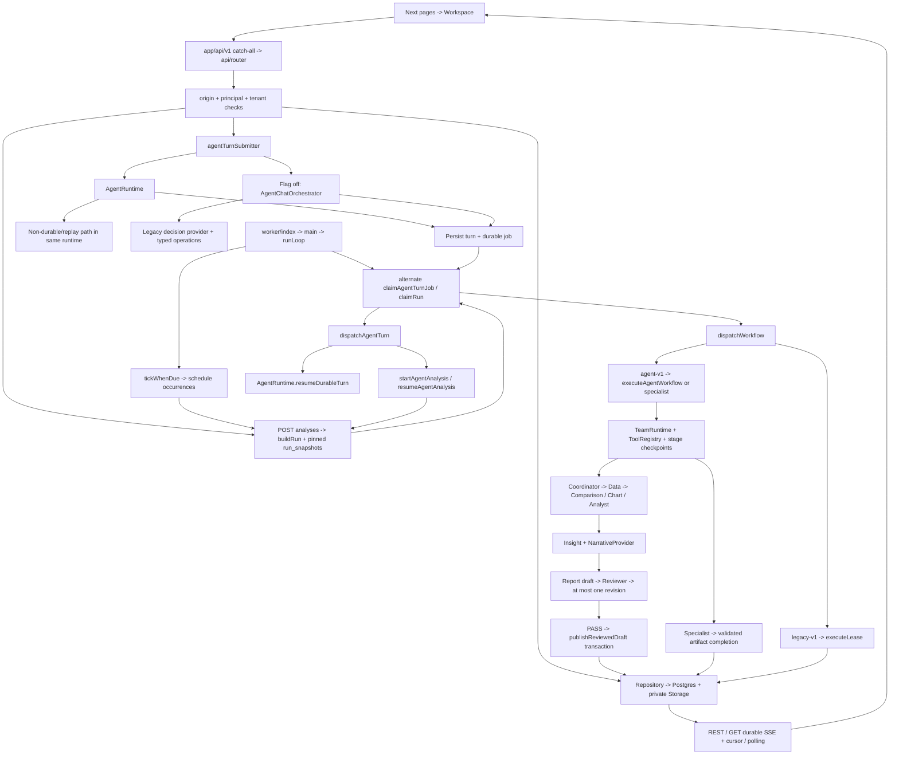

# Codebase Cleanup & Canonical Repository Architecture Plan

## Trạng thái triển khai (2026-09-29)

Phần bên dưới là kết quả triển khai từ working tree hiện tại. §1–§39 ghi lại khảo sát, quyết định và work breakdown gốc, bao gồm các sơ đồ “current” và điều kiện B1/B2 tại thời điểm lập kế hoạch; chúng không mô tả trạng thái source hiện nay. §40 và bảng này là trạng thái nghiệm thu hiện tại. B1/B2 đã được thay thế bởi production gates P1/P2 trong [runbook](workflows/cutover-readiness.md); chúng không chặn code hoặc sản phẩm local.

**Repository implementation: COMPLETE. Local product architecture: COMPLETE. Canonical API migration: COMPLETE. Legacy executable migration: COMPLETE. Local product readiness: PASS. Production rollout: NOT YET PERFORMED. Production deployment gates P1/P2: DEFERRED UNTIL DEPLOYMENT.**

| Hạng mục | Trạng thái | Bằng chứng / phần còn lại |
|---|---|---|
| Flatten source, 9 manifests, root scripts/tests, 33 schema, docs architecture | DONE | Source canonical ở `src/{backend,contracts,frontend}`; 82 test cũ bị xóa khỏi working tree; root test và script thay thế. |
| Chat/UI canonical và route `/api/*` | DONE | Next catch-all, client/SSE/download URL, setup flag, UI và test đã chuyển; không còn production source `/api/v1`. Kiểm kê external consumer là Gate P2 khi deploy. |
| Legacy analysis executor `legacy-v1` | DONE trong codebase/local | Audit read-only local và project ứng dụng đã biết tại 2026-09-29 00:35 UTC: `active_runs=[]`, `legacy_linked_jobs=[]`, `legacy_live_leases=[]`. Executor, dispatch/claim và publish riêng đã bỏ; historical readers, schema và migration được giữ. Kiểm kê production worker là Gate P1 khi deploy. |
| Incident E2E run `16425c57-efa7-47ab-8c07-5072596471fb` | DONE, read-only | Project `cqtjbhxkivbxrgvogvnb`: `failed`, không worker/lease/job; 5 tasks terminal, không có task active. Không sửa dữ liệu. |
| Formatting | DONE cho nội dung mới/sửa; baseline còn nợ | `pnpm format:changed` pass; 123 file fail `pnpm format:check` toàn repo đều là nội dung byte-identical với HEAD, không mass-format. |
| Full validation | DONE, trừ baseline format toàn repo | Frozen install, lint, typecheck, build, 81/81 Vitest files (466/466 tests), pgTAP 21/21, normal E2E 4/4 (1 skip ở mode thường) và durable E2E 1/1 (4 skip theo mode) pass; 33 schema giữ hash. E2E chỉ dùng Supabase local. |
| Deployment rollout | DEFERRED UNTIL DEPLOYMENT | Chưa triển khai production. Gate P1 kiểm kê/drain worker cũ; Gate P2 kiểm kê frontend, external consumer và access log trước rollout. Xem [runbook](workflows/cutover-readiness.md). |

Lệnh Gate P1 read-only: `node --env-file=<verified-env-file> scripts/maintenance/audit-readiness.mjs --expect-project=<verified-project-ref>`. Trước production rollout, chạy cho **mọi** project ứng dụng được triển khai, kiểm tra `active_runs` không còn version `legacy-v1` hoặc missing version, `legacy_linked_jobs` rỗng, không lease/retry còn sống và xác nhận worker cũ đã drain. Không dùng tên file `.env` để suy ra production/staging. Gate P2: kiểm tra client ngoài repo, active deployment/asset cũ, healthcheck/callback, access log `/api/v1` và thời điểm hết hạn download link trước rollout.

| Consumer đã tìm thấy | Phạm vi | Route cũ → mới | Migrated trong repo |
|---|---|---|---|
| Next catch-all và router | Internal | `/api/v1/[...path]` → `/api/[...path]` | Yes |
| Frontend fetch client và polling hooks | Internal | `/api/v1/*` → `/api/*` | Yes |
| SSE client | Internal | `/api/v1/*/stream`, `/events` → `/api/*` | Yes |
| Report download URL được server trả về | Internal/browser | `/api/v1/reports/*/download` → `/api/reports/*/download` | Yes |
| E2E runner, test, docs/README | Internal | `/api/v1/*` → `/api/*` | Yes |
| External client/deployment config | Chưa có evidence | Không tìm thấy trong tracked config | Operator phải xác nhận trước rollout |

## 1. Executive Summary

Baseline audit: nhánh `main`, commit `cd33ae65`, ngày 2026-09-28; working tree sạch trước khi tạo plan. Phạm vi turn này chỉ thay đổi `docs/plan.md`, không thay production code, tests hoặc cấu hình.

**Quyết định chính:** giữ Next.js làm web/BFF và một process worker Node; giữ các package boundary đang được web/worker sử dụng, nhưng bỏ tầng `backend/packages` và tám tầng `src` lặp. Canonical analysis là implementation trong `analysis-v1`, ghép cùng chart builder hiện nằm trong `analysis`. Canonical chat là `AgentRuntime`; `TeamRuntime` là bộ thực thi specialist bên trong analysis, không phải một thế hệ chat runtime khác. Tests được viết lại ở root `tests`; utility code tập trung ở root `scripts`.

Không thể coi `legacy-workflow` là dead code: worker vẫn dispatch `legacy-v1`; analysis hiện tại dùng narrative provider của nó; HTTP export dùng serializer của nó. Phải tách hai dependency còn hoạt động, hoàn thành việc drain run cũ, rồi mới xóa executor cũ. Tương tự, chat/UI fallback vẫn reachable qua feature flags; việc bỏ chúng cần parity checks và kiểm kê cấu hình triển khai.

Kết quả dự kiến: một đường thực thi canonical cho mỗi trách nhiệm, URL `/api/*`, 9 manifest có vai trò rõ ràng, một lockfile pnpm, không còn test hoặc utility trong production source. Không đổi số liệu nghiệp vụ, quyền truy cập, phạm vi snapshot, report/artifact hash hay định danh persisted để làm đẹp tên.

**Phạm vi bằng chứng:** đã inventory 605 tracked files, 10 manifests, 82 test files, 33 JSON Schema artifacts và 46 tài liệu dưới `docs`; đọc entrypoints, dispatch, registries, imports/exports, source của các nhánh liên quan, test behaviors, scripts/config và tài liệu. Có kiểm tra graph import bằng TypeScript AST, sau đó đối chiếu framework entrypoints, exports, flags, string registries và callers. Graph file qua barrel là over-approximation, không phải bằng chứng một export thực sự được gọi. Không truy vấn database triển khai, không đọc secret trong `.env`, không giả định mọi flag deployed giống `.env.example`. Không tuyên bố baseline tests/build đang pass.

Ba điều kiện chặn **một số bước triển khai**, không chặn việc hoàn thành plan:

- **B1 — Legacy drain:** chưa biết còn bao nhiêu run `legacy-v1` queued/running, lease sống, hoặc turn cũ chưa terminal trong từng môi trường. Không xóa executor trước khi hoàn tất drain/retirement có chủ đích.
- **B2 — Consumers/cutover:** không có deployment manifest/consumer registry trong repo chứng minh mọi client `/api/v1`, JSON Schema export và feature flag đều được kiểm soát. Cần xác nhận consumer ngoài repo trước khi rollout; không tự giữ hai API prefix vô thời hạn.
- **B3 — Test services:** pgTAP/browser cần local Supabase, storage/auth, worker và server đã cấu hình; mock-data checks cần dataset ngoài source. Thiếu fixture/service phải ghi rõ, không đánh dấu pass hoặc bỏ test âm thầm.

## 2. Current Repository Architecture

```text
package.json / pnpm-workspace.yaml / pnpm-lock.yaml / turbo.json
src/
  frontend/                         @vda/web, Next.js
    next-with-env.mjs                production/dev launcher
    scripts/check-design-tokens.mjs
    src/
      app/api/v1/[...path]/route.ts  HTTP entrypoint
      app/{workspace,chat,runs,reports,data/imports,automations}/...
      proxy.ts                      Supabase cookie refresh
      server/{context.ts,api/,durable-event-stream.ts,agent-turn-stream.ts}
      features/                     UI, hooks, API consumers + colocated tests
      components/ lib/ styles/
  backend/
    package.json                    @vda/backend-tooling, CLI/test dependencies
    worker/                         @vda/worker
      src/{index,main,run-loop,workflow-dispatcher,agent-turn-dispatcher,scheduler}.ts
      src/{check-llm,provider-check}.ts + tests
    packages/
      agents/src/{analysis,analysis-v1,legacy-workflow,chat,runtime,providers}/
      contracts/src/ + schema/       Zod + 33 generated JSON schemas
      config/src/                   server configuration
      db/src/                       Postgres repository, transactions, storage
      domain/src/                   validation, CSV, schedule, evidence/report rules
      semantic/src/                 deterministic metrics, comparisons, charts inputs
    scripts/mock-data/              warehouse utilities + a colocated test
    tests/{unit,e2e,fixtures,helpers}/ + configs
    supabase/{schemas,migrations,tests,seed.sql,config.toml}
docs/                               product + architecture + API + workflows
```

Không có backend HTTP server riêng, external queue service, Dockerfile, compose file, GitHub Actions, Vercel/Railway/Azure deployment config được tracked. `src/frontend/src/server/api/routes` đã chia theo trách nhiệm; version folder thực tế ở Next app route, không phải `backend/api/v1`. Root `tests/` và `scripts/` hiện có directory local nhưng không có tracked source. Generated directories như `.next`, `.turbo`, `node_modules`, `.venv`, browser/test output không phải source architecture.

Dependency direction hiện tại: web → contracts/config/db/agents; worker → config/db/agents; agents → contracts/config/db/domain/semantic; db → contracts/domain; domain → contracts/semantic; semantic → contracts. Contracts chỉ cần Zod và được client UI dùng; không được kéo database/provider credentials vào bundle browser.

## 3. Current Production Execution Flow

Graph dưới đây là **graph được source đăng ký**, bao gồm nhánh conditional; không khẳng định traffic triển khai đang đi qua mọi nhánh.


```mermaid
flowchart TD
  UI[Next pages -> Workspace] --> HTTP[app/api/v1 catch-all -> api/router]
  HTTP --> AUTH[origin + principal + tenant checks]
  AUTH --> REPO[Repository -> Postgres + private Storage]
  AUTH --> SUBMIT[agentTurnSubmitter]
  SUBMIT --> CHAT[AgentRuntime]
  SUBMIT --> FALLBACK[Flag off: AgentChatOrchestrator]
  CHAT --> JOB[Persist turn + durable job]
  CHAT --> SYNC[Non-durable/replay path in same runtime]
  FALLBACK --> JOB
  FALLBACK --> OLDCHAT[Legacy decision provider + typed operations]
  AUTH --> RUN[POST analyses -> buildRun + pinned run_snapshots]
  WK[worker/index -> main -> runLoop] --> SCHEDULE[tickWhenDue -> schedule occurrences]
  SCHEDULE --> RUN
  WK --> CLAIM[alternate claimAgentTurnJob / claimRun]
  JOB --> CLAIM
  RUN --> CLAIM
  CLAIM --> TURN[dispatchAgentTurn]
  TURN --> START[startAgentAnalysis / resumeAgentAnalysis]
  TURN --> RESUME[AgentRuntime.resumeDurableTurn]
  START --> RUN
  CLAIM --> DISPATCH[dispatchWorkflow]
  DISPATCH --> TEAM[agent-v1 -> executeAgentWorkflow or specialist]
  DISPATCH --> OLD[legacy-v1 -> executeLease]
  TEAM --> TOOLS[TeamRuntime + ToolRegistry + stage checkpoints]
  TOOLS --> DATA[Coordinator -> Data -> Comparison / Chart / Analyst]
  DATA --> INSIGHT[Insight + NarrativeProvider]
  INSIGHT --> REVIEW[Report draft -> Reviewer -> at most one revision]
  REVIEW --> PUBLISH[PASS -> publishReviewedDraft transaction]
  TOOLS --> SPECIALIST[Specialist -> validated artifact completion]
  PUBLISH --> REPO
  SPECIALIST --> REPO
  OLD --> REPO
  REPO --> READ[REST / GET durable SSE + cursor / polling]
  READ --> UI
```

Evidence và các ràng buộc phải giữ:

1. `src/frontend/src/app/api/v1/[...path]/route.ts` → `server/api.ts` → `server/api/router.ts`. Router chạy `checkOrigin`, auth route, `principal`, repository, session, rồi các route groups. `proxy.ts` là framework entrypoint dùng Supabase cookies; không phải dead file vì thiếu importer.
2. `server/context.ts`: `principal()` dùng `getUser()`, hoặc signed development role cookie khi được cấu hình; repository global promise dùng Postgres và private Storage. Config cấm development bypass ở production. Auth/tenant checks phải giữ khi di chuyển imports.
3. `server/api/streaming/agent-turn.ts:17` chọn `AgentRuntime` nếu `GROK_RUNTIME_ENABLED`; nếu tắt, vẫn thử durable admission rồi mới fallback orchestrator. `runtime/admission.ts` xử lý `TURN_NOT_DURABLE` để replay turn cũ, không tạo turn thứ hai.
4. `runtime/runtime.ts:415` (`submit`) và `:464` (`resumeDurableTurn`) dùng cùng capability loop. Context resolver/builder kiểm conversation, scope, date, attached references; planner được preflight cả plan trước mutation; composer chỉ chọn observation/action đã được kiểm chứng. `runtime/context/budget.ts` giữ nguyên section JSON theo priority, không cắt JSON tùy tiện.
5. `db/src/transactions/create-run.ts:40` (`buildRun`) chốt request, metric setting và `run_snapshots` trong transaction; gán `workflow_version: 'agent-v1'` cho cả interactive/scheduled. Không suy ra snapshot theo thời điểm worker xử lý.
6. `worker/src/index.ts` → `main.ts` → `run-loop.ts`; loop tick schedule mỗi khoảng 60 giây, luân phiên turn/run để tránh starvation. Heartbeat dispatcher mỗi 10 giây; run lease mặc định 30 giây, tối đa 3 claim attempts. Job `waiting` nhả worker; terminal run làm job đủ điều kiện queued để tổng kết. Lỗi workflow được terminalize, không đồng nghĩa tự retry mọi lỗi provider.
7. `analysis-v1/team-workflow.ts:30` đăng ký 8 agent definitions và 9 internal tools. Full run: coordinator/data → parallel comparison/chart/analyst → insight gọi data evidence → report → reviewer → một revision tối đa → publication. Specialist `data|comparison|chart|analyst|insight` kết thúc bằng artifact, không tự publish report.
8. `publish-reviewed-draft.ts:28` kiểm lại persisted task/draft/review/artifact graph dưới fence và chỉ publish PASS đúng revision. `finish-agent-artifact-run.ts` là completion riêng hợp lệ, không duplicate publication.
9. `durable-event-stream.ts` và GET events chỉ đọc persisted event sequences; disconnect không cancel worker. POST conversation stream là request-bound mode có điều kiện, bị từ chối khi durable execution bật. UI `deliverAgentTurn` chỉ fallback sang JSON khi 404/406, không retry một stream đã có khả năng nhận turn.
10. Report export: `server/api/queries/report-export.ts` → `exportReport` → authorized upload + export ledger; signed download URL hết hạn khoảng 5 phút và tải lại kiểm quyền. Không bỏ CSV formula escaping hoặc hash verification khi tách serializer.

Registry thật: 9 chat capabilities (`create_analysis`, `get_analysis_result`, `inspect_signal`, `inspect_decision_intelligence`, `inspect_visual`, `inspect_priority_entity`, `inspect_evidence`, `get_report_context`, `inspect_agent_checkpoint`); 9 team tools trong `team-workflow.ts`. So sánh report được gọi qua logic context/capability hiện có, không suy luận dead chỉ vì không có capability ID `compare_reports`. Không có production `new McpGateway`, server registration hay config loader MCP; chỉ export và tests.

## 4. Current Repository Problems

| Area | Current State | Problem | Evidence | Target |
|---|---|---|---|---|
| Analysis | chart builder trong `analysis`, workflow trong `analysis-v1` | Tên gợi hai engine nhưng trách nhiệm bổ sung nhau | team/stages và legacy executor cùng import chart builder | Một `agents/analysis` |
| Legacy workflow | Worker drain + provider/export đang dùng | Không thể delete theo tên | dispatcher:2-3; team-workflow:13; report-export:2 | Extract active helpers, drain, delete executor |
| Chat | Hai orchestrator được chọn bằng flag | Giữ generation cũ trong production | agent-turn submitter | AgentRuntime sau parity/cutover |
| Source tree | 8 package/app có nested `src` | Tối đa 7 directory segments trước filename | Inventory paths | Không nested `src`, tối đa dự kiến 5 |
| Tooling package | Backend root chỉ chứa CLI dependencies | Boundary tooling không phải app | backend/package.json | Tooling tại root manifest |
| Tests | 82 files đều dưới `src` | Colocation và legacy tests kéo implementation cũ | §18 | Viết mới root `/tests` |
| Utilities | 17 utility/support files ở 5 khu vực | Production barrel export seed, check runner trong worker | §21 | Root `/scripts` |
| Dead UI | Old workspace/panel/hooks không có runtime importer | Nhiều đường đọc/hiển thị không còn mount | AST graph + Workspace/Inspector imports | Xóa các island xác nhận ở §9 |
| API | Prefix và physical `v1` | Prefix generation không có API khác | catch-all + clients | `/api` và `app/api/[...path]` |
| API method adapter | Router/client có PUT context nhưng Next route chỉ export GET/POST/PATCH/DELETE | Context update không reachable qua HTTP adapter hiện tại | route.ts:8; runtime-workspace.ts:36; runtime.ts:14 | Expose PUT có chủ đích khi migrate adapter; test qua Next HTTP |
| Provider naming | Narrative provider trong legacy folder | Ownership sai, không phải provider obsolete | current Insight stages | `agents/providers/narrative.ts` |
| Storage naming | `storage.ts` và `storage/storage.ts` | Một adapter, một resolver nhưng tên không phân biệt | repository imports | `storage/supabase.ts`, `storage/resolve.ts` |
| Docs | Một verification diary + nhắc CLI repair không tồn tại | Tài liệu lẫn lịch sử và hướng dẫn hiện hành | failure-recovery/execution-model/verification doc | Current runbook, Git giữ lịch sử |
| Generated schemas | 33 checked-in schemas | Dễ bị xóa nhầm là bản duplicate | export.ts + schema-compatibility test | Giữ generated contract artifacts, exporter ở scripts |

## 5. Canonical Architecture Decision

- **Analysis:** toàn bộ production stages/agents của `analysis-v1` + `analysis/chart-builder.ts` → `src/backend/agents/analysis`. Không rewrite thuật toán hoặc gom thành giant file.
- **Chat:** `AgentRuntime` giữ planner, capabilities, composition, context. Xóa `chat/legacy` sau khi chứng minh parity các hành vi ở §8. `chat/operations.ts` còn helpers được capability gọi, không xóa wholesale.
- **Team:** giữ `TeamRuntime`, `AgentMessageBus`, `ToolRegistry`; chúng thực thi specialist bên trong analysis và ghi activity. Giữ giới hạn delegation/timeout, không hợp nhất vào chat loop.
- **Workflow:** một engine cho run mới; historical reader vẫn hiểu `legacy-v1`. Executor legacy chỉ bị xóa sau B1. Không relabel old run thành `agent-v1` vì DAG, task IDs và artifacts khác nhau.
- **Transport:** giữ JSON submission, durable GET SSE/polling; mode non-durable trong chính AgentRuntime và POST stream vẫn có nghĩa operational. Không biến cleanup thành redesign admission. `DURABLE_AGENT_EXECUTION_ENABLED` tiếp tục là switch admission; worker phải drain existing jobs dù switch tắt. Đổi tên `GROK_SSE_ENABLED` thành `AGENT_SSE_ENABLED` khi cutover config; không đổi request-bound SSE thành durable replay bằng tên.
- **UI:** contextual workspace hiện tại là canonical view; rename `features/grok-workspace` → `features/agent-workspace`. Sau parity, bỏ nhánh flag UI cũ; giữ shared `features/agent-chat` hooks/model/components đang được canonical view dùng.
- **API:** tiếp tục Next BFF, route code tại `src/frontend/server/api`; thin framework entrypoint tại `src/frontend/app/api/[...path]/route.ts`. Không tạo backend HTTP service hoặc package API mới.
- **Packages:** bỏ tên directory `packages`, giữ các private workspace package có imports/exports thực. Shared contracts → `src/contracts`; backend modules ở `src/backend/{agents,config,database,domain,semantic}`; worker giữ package riêng. Giữ tên package `@vda/db` dù folder đổi thành `database`, tránh rename API package không cần thiết.
- **Persistence:** schema strings/IDs/event names/hashes giữ nguyên. Compatibility cho dữ liệu lịch sử là reader/projection trong canonical modules, không phải executor cũ được lưu để archive.

## 6. `analysis` vs `analysis-v1`

| Path | Purpose | Callers/runtime usage | Decision |
|---|---|---|---|
| `src/backend/packages/agents/src/analysis/chart-builder.ts` | Dựng visual evidence, metric bindings, validation/fingerprint | `analysis-v1/agents/chart-agent.ts`, legacy workflow, package exports, tests | Active, giữ trong target `analysis/chart-builder.ts` |
| `src/backend/packages/agents/src/analysis-v1/workflow.ts` | Full-run terminal executor, review/publication | worker `workflow-dispatcher.ts`, package subpath export | Canonical → `agents/analysis/workflow.ts` |
| `analysis-v1/team-workflow.ts` | Definition/tool registrations, full/specialist invocation flow | workflow.ts + specialist exports | Canonical, giữ |
| `analysis-v1/agents/*.ts` (8 files) | Deterministic packs và evidence-bound narrative/review adapters | stages + team | Move → `analysis/specialists/{coordinator,data,comparison,chart,analyst,insight,report,reviewer}.ts` |
| `analysis-v1/stages/*`, `checkpoint/*`, `dag.ts`, `options.ts` | Persisted stages, graph, lease/checkpoint recovery | current team workflow | Move giữ phân tầng; chỉ xóa test-only aggregate helpers được chỉ rõ |

Migration: (1) move active workflow vào existing canonical analysis sau khi loại test khỏi phép move; (2) giữ chart builder ở cùng folder; (3) sửa relative imports các specialist/stages/checkpoint; (4) đổi agent package subpaths `./analysis-v1/workflow`, `./analysis-v1/dag` → `./analysis/workflow`, `./analysis/dag`; (5) update worker dispatcher + barrel; (6) giữ `ANALYSIS_AGENT_DEFINITIONS` và string tool IDs; (7) update tests mới, exporter/scripts/config/docs; (8) search source/package exports để không còn `analysis-v1`; (9) xóa directory cũ sau xác minh move đầy đủ. Không xóa chart implementation để lấy chỗ cho rename.

`executeIndependentBranches`, `executeAgentThroughBranches`, `executeAgentThroughDraft` là aggregate orchestration cũ; current TeamRuntime gọi các stage riêng. Bỏ wrappers này cùng exports sau khi tests mới kiểm parallel/recovery qua current team workflow. Giữ individual stage functions, loaders, shared types cần bởi team.

## 7. `legacy-workflow` Analysis

**Có production usage.** `worker/src/workflow-dispatcher.ts:63` dispatch theo persisted workflow version; `executeLease` dùng DAG cũ, repository `completeRun`, `publishLegacyReport`. New run creation luôn `agent-v1`, nhưng không chứng minh old active count bằng 0.

| Thành phần | Phân loại | Phải làm trước khi xóa folder |
|---|---|---|
| `narrative/provider.ts` | A — Active, dùng ở current Insight và llm check | Move → `src/backend/agents/providers/narrative.ts`; update `analysis/options.ts`, `analysis/team-workflow.ts`, `analysis/stages/insight-report.ts`, agent exports, provider checks/new tests. Sửa `../../providers/gemini-response` thành relative path mới. Giữ Gemini/OpenAI/fallback error semantics |
| `export-report.ts` | A — Active serializer, không phụ thuộc orchestration | Move → `src/backend/domain/reports/export.ts`; update BFF import sang `@vda/domain/reports/export`; thêm dependency domain trực tiếp cho web; giữ hash check, CSV escaping và media types |
| `workflow.ts` | B — Transitional executor cho persisted runs | Drain old runs bằng release hiện tại. Kiểm kê cả missing workflow_version được normalize về legacy; không chỉ tìm literal `legacy-v1` |
| `dag.ts` | B — Executor topology | Xóa cùng workflow sau B1; lịch sử UI dùng task dependencies/schema, không cần executor DAG |
| package/barrel subpaths | B — Compatibility exports | Xóa old workflow/export subpaths sau khi mọi in-repo consumer đã chuyển và B2 được giải quyết |

**B1 protocol cho Sol/operator:** kiểm kê theo org: nonterminal runs, version missing/legacy/unknown, lease owner/expiry, tasks và linked messages/jobs; cho worker hiện tại hoàn tất run được phép; lặp inventory tới khi không còn active legacy. Nếu một run không thể hoàn tất, retirement là quyết định dữ liệu có audit riêng; helper hiện có có preview/cutover/live-lease guards, không được tự bulk-cancel để đạt zero. Stop/drain worker cũ trước rollout worker mới. Giữ terminal historical run/report đọc được; không delete rows hoặc sửa content hashes.

Sau B1, thay claim allowlist để chỉ claim executable `agent-v1`, đồng thời startup/audit báo active unsupported historical versions thay vì để chúng im lặng bị bỏ đói. Xóa legacy dispatcher injection/branch; xóa `Repository.completeRun` trong interface/facade và `transactions/publish-legacy-report.ts`, chỉ khi search xác nhận caller production còn lại duy nhất là executor đã bỏ. Canonical publish là `publishReviewedDraft`; specialist completion vẫn riêng.

Validation: new workflow full/specialist integration; historical report read/export; unknown-version queue behavior; no pending legacy inventory; worker restart, stale fence, cancellation; SQL upgrade + new-write guard. Nếu B1 chưa được giải quyết thì **BLOCKER — không xóa executor, không tuyên bố đạt final architecture**; không rename legacy executor thành tên khác để che việc giữ hai engine.

## 8. Duplicate / Versioned Implementation Audit

| Current A | Current B | Active | Keep | Delete | Migration |
|---|---|---|---|---|---|
| `analysis/chart-builder.ts` | `analysis-v1/*` | Cả hai, không duplicate engine | Ghép thành analysis | Old directory names | §6 |
| `legacy-workflow/workflow.ts` | `analysis-v1/workflow.ts` | Legacy drain + current new writes | Current workflow | Legacy executor sau B1 | Extract provider/export, drain |
| `chat/legacy/{orchestrator,context-builder,provider}.ts` | `runtime/*` | Flag chọn cả hai | AgentRuntime | Legacy chat sau B2 + parity | Chuyển submitter; bỏ runtime-selection flag |
| `AgentChat` top-level view | `GrokWorkspace` | UI flag chọn cả hai | Rename GrokWorkspace → AgentWorkspace | Old view shell sau parity | Không xóa shared controller/thread/composer |
| old aggregate stage helpers | `team-workflow.ts` | Helpers còn tests; team production | Team + individual stages | 3 aggregate helpers | Recreate tests qua team |
| `semantic/calculate.ts` | `semantic/analyze.ts` | calculate chỉ tests + exports; analyze production | analyze với scope explicit | calculate wrapper/subpath/export | New semantic tests gọi analyze |
| `chat/legacy/tools.ts` | `chat/operations.ts` | tools.ts chỉ re-export, không caller | operations | One-line wrapper | Không cần behavior migration |
| legacy typed result/signal tools | capability result/signal modules | Legacy branch + current runtime | Current capability implementations | Old implementations sau chat cutover | Giữ createAnalysisTool/getAgentTargetFollowUp đang dùng |
| `runtime/providers/*` | narrative provider | Hai protocol khác nhau, đều active | Cả hai đúng ownership | Không merge provider contracts | Shared Gemini response parser giữ chung |
| `runtime/capabilities/*` | `runtime/team/tools.ts` | Chat authorization vs team stage tool execution | Cả hai | Không merge registry | Giữ ID/roles/limits riêng |
| `decision/brief`, decision intelligence | projection compatibility | Cùng được current/historical readers dùng | Canonical pack + brief projection | Không xóa brief shape | Không đổi immutable report artifacts |
| `DecisionBriefSchema` (V1 wire format) | `DecisionBriefV2Schema` | V1 trong report/brief; V2 trong workflow-packs | Cả hai format validators | Chỉ unused aliases/union ở §9 | Không rename hai schemas thành một identifier |
| `supabase/schemas` | `supabase/migrations` | Desired state + applied history | Cả hai | Không xóa migration vì trùng DDL | §28 |

Chat cutover phải chứng minh: cùng idempotency key không tạo thêm turn/run; scope/date đổi có analysis mới; explicit signal inspection không tạo run; causal request thể hiện giới hạn; authorized zone selection vẫn có đường sử dụng; checkpoint/agent target follow-up giữ quyền; report creation/versioning, selected prior-period report, multi-report comparison vẫn đúng. Current `getAnalysisResult` trả status observations trong khi old tool còn trả richer result: kiểm tra composition/UI đã hiển thị kết quả/bằng chứng tương đương; nếu thiếu, bổ sung vào current capability/composer, không copy orchestrator cũ. Đây là parity gate cụ thể, không giả định hai implementations tương đương.

Giữ `DURABLE_AGENT_EXECUTION_ENABLED` vì quyết định admission và replay có behavior thật. Bỏ `GROK_RUNTIME_ENABLED`/`GROK_WORKSPACE_ENABLED` sau cutover, update SetupSchema/response/UI. Rename `GROK_SSE_ENABLED` và setup field tương ứng thành tên agent. Không đổi persisted mode string `grok` trong cùng bước: request/context có thể được lưu và dùng trong idempotency; source name agent-workspace không yêu cầu data rewrite.

## 9. Dead Code Audit

Phân loại: **A** active production; **B** transitional cần gate; **C** confirmed unreachable; **D** duplicate/superseded logic; **E** test-only; **F** utility; **G** experimental chưa được đăng ký; **H** generated. Không có blanket rule xóa tên `legacy`, `old`, `V1`.

| Candidate (path tương đối với root cũ) | Evidence / references | Classification / action |
|---|---|---|
| `src/backend/packages/agents/src/chat/legacy/tools.ts` | Chỉ `export * from '../operations'`; không importer, package subpath, registry hay dynamic loader | C, delete; operations giữ |
| `agents/src/runtime/team/mcp-gateway.ts` | Chỉ index export, `team-runtime.test.ts`, `runtime/team/mcp-gateway.test.ts`; team workflow chỉ tạo ToolRegistry và TeamRuntime | G/E, delete implementation + exports/types MCP riêng; không recreate MCP-only tests; giữ ToolRegistry internal/agent behavior |
| `agents/src/runtime/context/team-context.ts#buildTeamContext` | Wrapper tạo builder mỗi call, không caller; team-workflow dùng `createTeamContextBuilder` trực tiếp | C, delete wrapper; giữ builder/cache/TeamContextInput |
| `agents/src/analysis-v1/dag.ts#AGENT_DATA_DAG` | Chỉ declaration và index export; production stages dùng full DAG | C, remove constant/export |
| `agents/src/analysis-v1/stages/branches.ts#executeIndependentBranches,#executeAgentThroughBranches`; `stages/insight-report.ts#executeAgentThroughDraft` | Chỉ tests, barrel và wrappers gọi nhau; team dùng individual stages | E/D, delete aggregate functions/imports/types chỉ của chúng |
| `src/backend/packages/semantic/src/calculate.ts` | `analyze` adapter suy org/project từ row đầu; chỉ semantic tests + package exports dùng | E/D, delete; tests mới dùng scope/org explicit |
| `agents/src/chat/operations.ts#cancelAnalysisTool,#modelToolNames` | Chỉ barrel/test references, không model registry/HTTP caller; cancel API gọi repository trực tiếp | E/C, delete exports và functions/constants sau inventory test; giữ cancel API behavior |
| `frontend/src/features/analysis/components/legacy-analysis-workspace.tsx` + `hooks/use-legacy-analysis-actions.ts` | Không Next page/Workspace mount; hook chỉ component này gọi | C, delete cả hai; không delete `useAnalysisRun` dùng bởi Workspace |
| `frontend/src/features/agent-chat/task-label.ts` | Không importer; current workflow view-model/status formatters tự có mapping | C, delete |
| `frontend/src/features/evidence/components/context-evidence-panel.tsx`, `hooks/use-evidence-run.ts`, `api/run-evidence.ts` | Panel chỉ test import; hook/API chỉ theo panel; current `workspace-inspector.tsx` dùng controller | C/E, delete island; migrate panel behavior tests tới current inspector |
| `frontend/src/features/grok-workspace/components/grok-dashboard-surface.tsx`, `hooks/use-grok-dashboard-data.ts` | Component không mounted, hook chỉ component đó gọi | C, delete; keep ReportDashboard được current views gọi |
| `frontend/src/features/grok-workspace/hooks/use-grok-evidence.ts` | Không importer/registry/loader | C, delete |
| `frontend/src/components/capability-rail.tsx#CapabilityRail` | Không component caller; `capabilityLabel` được ContextTab dùng | C for component only; giữ label/mode data dùng bởi label, bỏ unused icon/UI imports |
| `agents/src/index.ts` re-exports domain utilities | Ownership đã là domain; nhiều tests import xuyên agents | D facade exports, migrate callers trực tiếp tới domain rồi bỏ forwarding exports; không xóa domain implementation |
| `contracts/src/decision/brief.ts#DecisionBriefV1Schema,#DecisionBriefV1,#AnyDecisionBriefSchema,#AnyDecisionBrief` | V1 symbols là aliases của DecisionBriefSchema/type; Any union chỉ dùng hai aliases/schema và được barrel export, không API/runtime/parser caller | C/D export surface: remove unused union + V1 aliases/barrel entries; giữ DecisionBriefSchema và DecisionBriefV2Schema vì hai wire formats đều active |
| `contracts/src/chat/message.ts#DecisionReferenceSchema,#DecisionReference,#DrillDownReferenceSchema,#DrillDownReference` | Aliases của DecisionRef/DrillDownRef, chỉ index re-export, không consumer | D, remove aliases/exports; giữ original reference schemas/types và wire shapes |
| `config/src/index.ts#obsoleteWorkflowFlagLogged` + AGENT_WORKFLOW_ENABLED warning | Flag chỉ log một lần, không chọn workflow; buildRun luôn agent-v1 | B/C config residue: sau B2 loại biến deployed cũ và warning, không đổi workflow selection; giữ LLM_MODE rejection và APP_MODE validation vì vẫn bảo vệ cấu hình |
| `db/src/seed.ts`, `db/src/generate-seed.ts` | Test/local seed data; index export làm production graph kéo test support | F/E, move scripts/seed; remove db barrel export; new test fixtures độc lập |
| `db/src/workflow/{reconcile-stalled-turn,retire-legacy-run,repair-terminal-legacy-run}.ts` | Chỉ tests gọi; không API/worker registration. Có semantics operator thật, docs nhắc wrapper CLI nhưng wrapper không tồn tại | F/B, move scripts/maintenance; không tự execute hoặc delete theo tên |

Trong bảng này `agents/src/...`, `db/src/...`, `contracts/src/...`, `config/src/...` là viết tắt của source dưới `src/backend/packages/<package>/src/...`; `frontend/src/...` là `src/frontend/src/...`.

**Không xóa nhầm:** `context-evidence-panel.module.css` còn 5 consumer tab/primitives; giữ và rename `evidence-tabs.module.css`. `context-tab`, `evidence-tab`, `files-tab`, `run-tab`, `tab-primitives` được current inspector dùng. `styles/legacy-components.css` được globals.css import; rename thành `components.css`, chỉ bỏ selector sau usage audit, không delete whole stylesheet. `metricRefs`, `evidenceKey`, `InputParser`, `ContextSection`, `LEGACY_WORKFLOW_VERSION` có local usages dù không consumer ngoài file: chỉ bỏ `export` nếu không thuộc public surface, không xóa logic/types. `GeminiResponseSchema` cũng được parser cùng file dùng. Framework `page`, `layout`, `proxy`, route methods và `dynamic` là implicit entrypoints.

Unused exports cần thu hẹp nhưng không coi barrel import là invocation: localize các symbol chỉ dùng nội bộ file (`InputParser`, `ContextSection`, `TeamContextInput`, provider projection limits, `RepositoryOptions`, `BuildRunDependencies`, `AgentIdentity`, dashboard-only types) sau khi kiểm public package exports. Không blanket-delete interfaces hoặc `export` đang được package API/test mới dùng. Không có bằng chứng đủ mạnh để drop table/provider xAI/RLS schema nào.

## 10. Current Package / Workspace Analysis

Canonical hiện tại: Node `>=24`, `pnpm@11.0.8`, root `pnpm-workspace.yaml`, một `pnpm-lock.yaml`. Workspaces: `src/frontend`, `src/backend`, `src/backend/worker`, `src/backend/packages/*`.

| Manifest | Role / boundary | Build/publish reality |
|---|---|---|
| `package.json` | Task orchestration, lint/test/compiler tools | Private root, Turbo tasks |
| `src/frontend/package.json` | `@vda/web`, Next, React, Supabase SSR | Next build/start; transpiles 6 workspace packages |
| `src/backend/package.json` | `@vda/backend-tooling`, Supabase/Playwright/PGlite/mock import tools | Không production app, không library exports |
| `src/backend/worker/package.json` | `@vda/worker`, standalone Node process | start/dev dùng tsx; build là `tsc --noEmit` |
| `src/backend/packages/agents/package.json` | `@vda/agents`, source/subpath exports, runtime dependencies | Private, typecheck, không emitted dist/publish |
| `src/backend/packages/config/package.json` | `@vda/config`, server env contract | Private, source export/typecheck |
| `src/backend/packages/contracts/package.json` | `@vda/contracts`, shared Zod contracts | Private, explicit source subpaths/typecheck |
| `src/backend/packages/db/package.json` | `@vda/db`, repository/storage | Private; build là typecheck, PGlite dev dependency |
| `src/backend/packages/domain/package.json` | `@vda/domain`, validation + use-case rules | Private; build là typecheck |
| `src/backend/packages/semantic/package.json` | `@vda/semantic`, deterministic metrics | Private, source exports/typecheck |

Các library không có độc lập publish/build artifact, nhưng boundary resolution là thật: `workspace:*`, manifest dependencies, Next `transpilePackages`, Node/tsx worker và test imports dựa vào chúng. Vì vậy không thay mọi package bằng relative imports xuyên repo. Không có npm/yarn/bun lockfile cạnh tranh.

## 11. `packages/` Decision

**Bỏ directory `src/backend/packages/`, giữ package boundaries.** Tầng này chỉ nhóm tất cả thư viện backend, không có manifest/build/deployment riêng. `src/backend/agents` có thể vẫn là private workspace package và exports từ `./index.ts`. Flatten không yêu cầu bỏ encapsulation.

Contracts chuyển riêng `src/contracts` vì cả browser và server dùng; config/domain/semantic/database/agents vẫn ở backend. Bỏ manifest tooling `src/backend/package.json` sau chuyển commands/dependencies về root. Giữ 9 manifests cuối cùng; không thêm package chỉ để có folder API/tests/scripts.

## 12. Directory Flattening Plan

| Current Path | Target Path | Reason | Required Updates |
|---|---|---|---|
| `src/backend/packages/agents/src/*` | `src/backend/agents/*` | Bỏ 2 tầng | exports, tsconfig, relative tests/scripts, worker subpaths, docs |
| `src/backend/packages/agents/{package.json,tsconfig.json}` | `src/backend/agents/{package.json,tsconfig.json}` | Giữ boundary | exports không `./src`, extends `../../../tsconfig.base.json`, include production `**/*.ts`, exclude generated/deps |
| `src/backend/packages/config/src/*` | `src/backend/config/*` | Server config | manifest/tsconfig/workspace |
| `src/backend/packages/db/src/*` | `src/backend/database/*` | Trách nhiệm database | Giữ tên `@vda/db`; tách utility/test trước move |
| `src/backend/packages/domain/src/*` | `src/backend/domain/*` | Domain boundary | exports/subpaths, web dependency cho report export |
| `src/backend/packages/semantic/src/*` | `src/backend/semantic/*` | Numeric boundary | exports/subpaths, bỏ calculate wrapper |
| `src/backend/packages/contracts/src/*` | `src/contracts/*` | Shared client/server contracts | exports, extends `../../tsconfig.base.json`, schema output paths |
| `src/backend/packages/contracts/schema/*` | `src/contracts/schema/*` | Generated contract artifacts | exporter/new parity test, keep bytes trừ intentional schema changes |
| `src/backend/worker/src/*` | `src/backend/worker/*` | Worker package không cần inner src | scripts `index.ts`, imports, exclude checks/tests |
| `src/frontend/src/*` | `src/frontend/*` | Next hỗ trợ app tại project root | `@/*` → `./*`, proxy ngang app, CSS imports, test alias, design-token script |
| `src/frontend/src/app/api/v1/[...path]/route.ts` | `src/frontend/app/api/[...path]/route.ts` | Bỏ API generation | Fix relative router import; giữ runtime/method exports/dynamic |
| `src/backend/tests/*`, mọi test source | `tests/*` mới | Rebuild coverage | Không bulk-move tests; §18–20 |
| Scattered utilities | `scripts/*` | Tách tooling | §21–22 |

Không di chuyển `supabase` ở lượt refactor này: CLI project root `src/backend` vẫn hợp lệ khi không có package.json. Giữ schemas/migrations/seed paths để giảm rủi ro operational; root commands dùng explicit `--workdir src/backend`. Không di chuyển `.env`; env loader phải tiếp tục đọc root `.env`.

## 13. File Naming Cleanup

| Current | Target | Notes |
|---|---|---|
| `agents/.../analysis-v1/agents/*-agent.ts` | `agents/analysis/specialists/*.ts` | 8 agent files liệt kê ở §6; giữ tên public functions nếu rõ nghĩa |
| `agents/.../runtime/runtime.ts` | `agents/runtime/agent-runtime.ts` | Tránh runtime/runtime; `AgentRuntime` đã canonical |
| `agents/.../runtime/team/runtime.ts` | `agents/runtime/team/executor.ts` | `TeamRuntime` giữ tên, không merge với chat |
| `agents/.../legacy-workflow/narrative/provider.ts` | `agents/providers/narrative.ts` | Đúng responsibility; không cần thêm layer transport mới |
| `agents/.../legacy-workflow/export-report.ts` | `domain/reports/export.ts` | Export serialization không phải orchestration |
| `database/storage.ts`, `database/storage/storage.ts` sau flatten | `database/storage/supabase.ts`, `database/storage/resolve.ts` | Adapter và resolver đều active; sửa 2 nhóm imports |
| `features/grok-workspace` / `grok-workspace.tsx` / `.module.css` | `features/agent-workspace` / `agent-workspace.tsx` / `.module.css` | Source/module/component `GrokWorkspace` → `AgentWorkspace`; giữ behavior |
| `styles/legacy-components.css` | `styles/components.css` | Active stylesheet, không coi legacy name là dead |
| `context-evidence-panel.module.css` | `evidence-tabs.module.css` | Shared tabs còn active, bỏ panel-specific dead selectors có evidence |
| `runtime/capabilities/projection.ts#legacyToolContext` | `operationContext` | Active adapter cho operations, không legacy engine |
| `buildLegacyInsightPayload` | `buildInsightArtifactPayload` | Active persisted artifact projection |
| `report-agent.ts#legacyCompatibleReport` | `buildReportPayload` | Active projection; giữ payload shape |
| `docs/agents/agents/*` | `docs/agents/roles/*` | 8 role docs; update relative links |

Type/symbol `V1` cleanup chỉ code-only: trong `agents/runtime/context/types.ts` và `contracts/runtime/{activity,capabilities,context,plan}.ts`, đổi identifier kết thúc `V1Schema` → `Schema`, `V1` → bỏ suffix, kèm mọi import/re-export/type reference. Không text-replace string literal, JSON key, artifact payload hoặc stored mode. Ví dụ `AuthorizedAgentContextV1` → `AuthorizedAgentContext`, `AgentPlanV1Schema` → `AgentPlanSchema`. Static symbol audit không thấy collision trong nhóm này; vẫn recheck khi HEAD thay đổi. JSON schema filenames mang wire-version giữ nguyên, exporter map tên cũ tới symbol mới.

**Exception đã xác minh:** `contracts/decision/brief.ts` đã có `DecisionBriefSchema`/`DecisionBrief`, cùng `DecisionBriefV2Schema` được workflow-packs import. Đây là hai format thực, không rename V1 alias đè lên canonical declaration hoặc xóa V2. Remove unused `AnyDecisionBriefSchema`/type và explicit V1 alias exports; giữ V1 validator dưới tên DecisionBriefSchema, V2 validator dưới tên hiện tại. Giữ `projectDecisionBriefV1Compatibility` vì current report-agent dùng nó để project V2 pack về persisted report/brief shape. Đây là compatibility dữ liệu cần thiết, không obsolete workflow.

Không rút mọi filename thành `index.ts`; giữ `chart-builder.ts`, `artifact-store.ts`, `stage-context.ts`, repository facade, semantic/domain grouping. Không gom files 500–700 dòng thành giant runtime mới trong task này.

## 14. API Migration

Prefix mapping thống nhất: mọi route dưới đây đổi `/api/v1` → `/api`, giữ payload, tenant/idempotency headers, status codes và auth/origin checks. Bảng inventory mô tả router contracts; ngoại lệ adapter hiện tại được ghi rõ bên dưới. Không thêm endpoint nghiệp vụ hoặc sửa route matching ngoài phạm vi này.

| Current Route | Target Route | Consumers | Migration |
|---|---|---|---|
| `GET /api/v1/setup`, `GET /api/v1/session` | `/api/setup`, `/api/session` | auth/bootstrap | Prefix; setup flag fields cutover riêng |
| `POST /api/v1/auth/login`, `/auth/logout`, `/auth/development-role` | `/api/auth/login`, `/api/auth/logout`, `/api/auth/development-role` | auth/session client | Preserve cookie/production guard |
| `GET /api/v1/catalog`, `/workspace-summary` | `/api/catalog`, `/api/workspace-summary` | workspace clients | Preserve org query |
| `GET /api/v1/agent-definitions` | `/api/agent-definitions` | runtime API, agent rail/mentions | No private instructions |
| `POST /api/v1/analyses` | `/api/analyses` | run-data client, tests | Idempotency + 202 |
| `GET /api/v1/runs`, `/runs/:id` | `/api/runs`, `/api/runs/:id` | history/analysis/run polling | Preserve scope |
| `GET /api/v1/runs/:id/artifacts` | `/api/runs/:id/artifacts` | analysis/evidence/report dashboard | Preserve public/private filtering |
| `GET /api/v1/runs/:id/workflow-status` | `/api/runs/:id/workflow-status` | checkpoint UI | No draft payload leak |
| `GET /api/v1/runs/:id/brief`, `/decision-intelligence` | `/api/runs/:id/brief`, `/decision-intelligence` | result/dashboard | Preserve historical/unavailable responses |
| `GET /api/v1/runs/:id/runtime`, `/events` | `/api/runs/:id/runtime`, `/events` | use-run-runtime | Cursor/Last-Event-ID and GET SSE |
| `POST /api/v1/runs/:id/cancel` | `/api/runs/:id/cancel` | cancellation client | Explicit cancel only |
| `GET /api/v1/messages` | `/api/messages` | run/conversation reads | Keep legacy-shaped read endpoint, still called |
| `GET/POST /api/v1/conversations` | `/api/conversations` | conversation API | Paging/turn identity |
| `GET /api/v1/conversations/:id` | `/api/conversations/:id` | selected conversation loader | Same record contract |
| `GET/POST /api/v1/conversations/:id/messages` | `/api/conversations/:id/messages` | messages/turn submission | Query/body org coherence |
| `GET /api/v1/conversations/:id/messages/:messageId` | `/api/conversations/:id/messages/:messageId` | polling loaded historical messages | Preserve pagination position |
| `POST /api/v1/conversations/stream` | `/api/conversations/stream` | sendTurnStream | Conditional request-bound mode |
| `POST /api/v1/conversations/:id/messages/stream` | `/api/conversations/:id/messages/stream` | sendTurnStream | Preserve 404/406 fallback and no duplicate retry |
| `GET /api/v1/conversations/:id/agent-turn-job` | `/api/conversations/:id/agent-turn-job` | job hydration | Nullable latest snapshot |
| `GET/PUT /api/v1/conversations/:id/context` (PUT chỉ có trong router, chưa export qua Next) | `GET/PUT /api/conversations/:id/context` | thread context controls | Preserve authorized refs; expose missing PUT adapter method |
| `GET /api/v1/conversations/:id/memory` | `/api/conversations/:id/memory` | thread workspace | Preserve bounded tenant scope |
| `GET /api/v1/agent-turn-jobs/:id`, `/events` | `/api/agent-turn-jobs/:id`, `/events` | use-agent-execution | Durable snapshot/replay, safe projection |
| `POST /api/v1/agent-turn-jobs/:id/cancel` | `/api/agent-turn-jobs/:id/cancel` | chat cancel | Fencing/cascade |
| `GET/POST /api/v1/imports` | `/api/imports` | imports UI/thread datasets | CSV bytes, source name, tenant |
| `GET /api/v1/reports`, `/reports/:id` | `/api/reports`, `/api/reports/:id` | report library/detail | Published records only |
| `POST /api/v1/reports/:id/exports` | `/api/reports/:id/exports` | export button | Update generated URL too |
| `GET /api/v1/reports/:id/download?token=...` | `/api/reports/:id/download?token=...` | returned link/browser | Grant and authorization unchanged |
| `GET/POST /api/v1/report-definitions` | `/api/report-definitions` | schedules client | Existing schemas |
| `PATCH/DELETE /api/v1/report-definitions/:id` | `/api/report-definitions/:id` | schedules client | Role/version rules |
| `POST /api/v1/report-definitions/:id/trigger` | `/api/report-definitions/:id/trigger` | manual schedule trigger | Same pinned occurrence/run |
| `POST /api/v1/scheduler/tick` | `/api/scheduler/tick` | schedules client/operational caller | Keep authorization |

Direct production literals cần sửa: `src/frontend/src/lib/http/api-client.ts:18`; `lib/sse.ts:119`; `features/agent-chat/hooks/use-agent-execution.ts:35`; `hooks/use-run-runtime.ts:45`; `server/api/queries/report-export.ts:34`. Feature API modules gọi shared `api()` và phải được regression test dù không chứa literal prefix. `proxy.ts` matcher đã `/api/:path*`, không cần thêm version alias.

**Baseline defect cần xử lý cùng adapter migration:** `app/api/v1/[...path]/route.ts:8` chỉ export GET/POST/PATCH/DELETE. `server/api/routes/runtime-workspace.ts:36` xử lý PUT context và `features/agent-chat/api/runtime.ts:14` gửi PUT, được `use-thread-workspace` và controller gọi; Next adapter hiện chưa expose method đó. Target phải thêm `handle as PUT` có chủ đích, giữ nguyên router authorization/schema. Đây là sửa wiring hiện có, không phải method đã hoạt động cần giữ. Recreate test qua Next HTTP thật: update context, GET lại sau reload, reject unauthorized/cross-tenant writes; test gọi trực tiếp router không phát hiện lỗi adapter này.

Literal references còn trong các test cũ: worker `agent-wire-integration`, server `api`, `runtime-workspace`, lib `sse`, frontend API tests `run-data`, `imports`, `report-definitions`, E2E `mvp.spec`; tests mới dùng `/api`. Docs: README, ARCHITECTURE, `docs/api/{overview,endpoints,authentication}`, `docs/architecture/{overview,backend,system-flow}`, `docs/platform/automations`, verification diary.

Không thấy `/api/v1` trong tracked env template, worker callback, Docker/CI/healthcheck/OpenAPI config; không có các deployment files đó. Không được sửa provider `/v1` (xAI/OpenAI) hoặc Supabase `/storage/v1`/`auth/v1`: đó là external protocol.

**B2:** repo chứng minh các in-repo consumers ở trên, không chứng minh không có cron/bookmark/client bên ngoài. Trước rollout xác nhận access/deployment inventory. Nếu có consumer không kiểm soát, ghi `BLOCKER / DECISION REQUIRED` và phối hợp cutover; không tự thêm permanent redirect hoặc giữ song song hai routers. Rolling deployment cũng cần phối hợp web/assets/worker; old browser tabs phải reload, existing 5-minute download grants nên hết hạn trước cutover hoặc re-export. Không đổi token payload để chứa prefix.

## 15. Physical API Folder Cleanup

```text
CURRENT                                      TARGET
src/frontend/src/app/api/v1/[...path]/        src/frontend/app/api/[...path]/
  route.ts                                     route.ts
src/frontend/src/server/api/                 src/frontend/server/api/
  router.ts                                    router.ts
  routes/ middleware/ queries/ streaming/       routes/ middleware/ queries/ streaming/
src/frontend/src/server/context.ts           src/frontend/server/context.ts
```

Giữ exports GET/POST/PATCH/DELETE và Node runtime/dynamic configuration từ route hiện có; thêm PUT để sửa adapter gap đã xác minh ở §14. Bỏ forwarding `server/api.ts` sau đổi thin route import trực tiếp `server/api/router`; tests mới kiểm cả canonical router và framework HTTP adapter. Không tạo router name `v1`, không tạo `src/backend/api` chỉ để mô phỏng server không tồn tại. API server code ở Next project là boundary framework có ý nghĩa.

## 16. Node Modules / Dependency Strategy

Local inspection thấy root `node_modules/.pnpm` và các package links/junctions (ví dụ web `next`, worker `@vda/agents`, agents `openai`). Đây là một pnpm installation graph; root install tạo dependency resolution theo từng workspace. Nested directories không chứng minh có local install độc lập hoặc duplicate source.

Canonical install location: repository root. Command sau refactor: `pnpm install --frozen-lockfile`. Khi Sol đã đổi manifests/workspace paths, chạy **một lần** `pnpm install` ở root để regenerate root lockfile, review importers/dependency versions, rồi dùng frozen install cho verification. Giữ pnpm/Node versions; không upgrade dependencies ngoài scope.

Không đặt mục tiêu zero `node_modules` dưới mọi workspace nếu vẫn dùng pnpm isolated linker. Mục tiêu là zero tracked dependencies, zero nested lockfiles/independent install workflows. Không thay linker sang hoisted chỉ để cây folder trông phẳng. Không tự xóa toàn bộ node_modules; nếu cần rebuild local generated dirs, chỉ dùng package-manager workflow hoặc explicit verified workspace paths. `.gitignore` `node_modules/` áp dụng nested directories; giữ `.pnpm-store/`, `.next/`, `.turbo/`, test output ignores.

## 17. Package Manifest / Lockfile Cleanup

| Current | Decision / target |
|---|---|
| Root `package.json` | Keep; nhận tooling devDependencies/commands, test/script dependencies trực tiếp và explicit test aliases |
| `src/frontend/package.json` | Keep; sources ở package root; thêm `@vda/domain` vì export serializer chuyển ownership; check command trỏ root script |
| `src/backend/package.json` | Delete sau root có Supabase/Playwright/PGlite/mock tools và explicit CLI workdir |
| `src/backend/worker/package.json` | Keep; index.ts thay src/index.ts; llm check command chuyển root; giữ env path `../../../.env` |
| `src/backend/packages/agents/package.json` | Move `src/backend/agents/package.json`; exports canonical analysis subpaths, no legacy paths |
| `src/backend/packages/config/package.json` | Move `src/backend/config/package.json` |
| `src/backend/packages/contracts/package.json` | Move `src/contracts/package.json`; exports bỏ `/src`; schema artifacts vẫn packaged explicitly nếu cần |
| `src/backend/packages/db/package.json` | Move `src/backend/database/package.json`, name vẫn `@vda/db`; bỏ PGlite dev dep sau test support chuyển root |
| `src/backend/packages/domain/package.json` | Move `src/backend/domain/package.json`; thêm `./reports/export` export |
| `src/backend/packages/semantic/package.json` | Move `src/backend/semantic/package.json`; remove `./calculate` sau caller migration |
| `pnpm-lock.yaml` | Keep duy nhất; regenerate importer paths, không xóa để làm sạch history |
| `pnpm-workspace.yaml` | Keep; explicit 8 workspace paths: frontend, contracts, backend/{worker,agents,config,database,domain,semantic}; giữ allowBuilds |
| `turbo.json` | Keep; package names giữ nên task dependencies vẫn có nghĩa; update moved output/config paths và env pass-through |

Root test/script code trực tiếp dùng `@vda/*`, React/react-dom, OpenAI, Zod và test tools: khai báo dependency tương ứng ở root devDependencies với đúng version/workspace range đã có. Không dựa vào accidental transitive hoisting. Copy tooling versions từ backend manifest, không cài latest. Không di chuyển runtime library dependencies ra khỏi package sở hữu chỉ vì root tests cũng cần chúng.


## 18. Existing Test Inventory

82 test files: 80 Vitest files, 1 Playwright spec, 1 pgTAP SQL file. All currently live under src. Extensions: 66 .ts (including Playwright), 15 .tsx, 1 .sql. Fixtures/helpers/configs are not counted as test files. Each row is a deletion-and-behavior-recreation mapping, not a file move. Additional regression obligations are specified in sections 20 and 36.

| Existing Test | Behavior Covered | Current/Legacy | Recreate? / New target |
|---|---|---|---|
| `src/backend/packages/agents/src/activity.test.ts` | emits strictly bounded public activity in monotonic order | Current | Yes -> `tests/unit/agents/activity.test.ts` |
| `src/backend/packages/agents/src/agent-workflow.test.ts` | terminalizes asynchronous publication failures before returning to the worker; publishes exactly one legacy-compatible report after an exact PASS review | Current | Yes -> `tests/integration/agents/publication.test.ts` |
| `src/backend/packages/agents/src/answer-composer.test.ts` | rehydrates exact observation references and renders only bounded message parts; fails closed for forged IDs, forged/cross-run grounding, and free prose | Current | Yes -> `tests/unit/agents/grounding.test.ts` |
| `src/backend/packages/agents/src/artifact-visibility.test.ts` | keeps workflow-private artifacts out of public, validated artifact reads | Current | Yes -> `tests/integration/database/artifact-visibility.test.ts` |
| `src/backend/packages/agents/src/branch-workflow.test.ts` | starts all three branches before any is allowed to continue, and preserves chart equality; preserves successful peer branches and resumes the failed chart branch from persisted inputs | Current behavior, old aggregate test setup | Yes -> `tests/integration/agents/branch-recovery.test.ts` |
| `src/backend/packages/agents/src/capability-registry.test.ts` | dispatches only declared, server-authorized reads and projects canonical references; fails process initialization on duplicate or incomplete registrations | Current | Yes -> `tests/unit/agents/capabilities.test.ts` |
| `src/backend/packages/agents/src/chat.test.ts` | starts one bounded, deterministic analysis through the typed tool; uses a canonical signal reference to inspect a pronoun follow-up without a new run | Mixed: legacy chat + authorization behavior | Yes -> `tests/integration/agents/turn-parity.test.ts` |
| `src/backend/packages/agents/src/compare-reports.test.ts` | computes exact decimal deltas including zero baselines without inventing percentages; binds both measurements to metric evidence and rejects incompatible currencies | Current | Yes -> `tests/unit/agents/report-comparison.test.ts` |
| `src/backend/packages/agents/src/coordinator.test.ts` | selects the registered use case without metrics, SQL, or date substitution; uses the same registered data decision for scheduled input | Current | Yes -> `tests/unit/agents/specialists.test.ts` |
| `src/backend/packages/agents/src/data-agent.test.ts` | is an exact deterministic projection of immutable Data artifacts; rejects a pack whose copied numeric value differs from canonical calculation evidence | Current | Yes -> `tests/unit/agents/specialists.test.ts` |
| `src/backend/packages/agents/src/draft-workflow.test.ts` | persists the Insight join and revision-one draft without creating a final report; rehydrates Coordinator through Draft checkpoints without repeating stage writes | Current behavior, old aggregate test setup | Yes -> `tests/integration/agents/drafts.test.ts` |
| `src/backend/packages/agents/src/insight-provider-regression.test.ts` | identifies rejected credentials from both real HTTP adapters without retaining secrets; preserves mixed failures and still uses a healthy fallback after rejected primary credentials | Current | Yes -> `tests/unit/providers/narrative.test.ts` |
| `src/backend/packages/agents/src/planner.test.ts` | rejects duplicate capability IDs before registry preflight can authorize a step; rejects a mixed create-analysis plan before registry preflight or execution | Current | Yes -> `tests/unit/agents/planning.test.ts` |
| `src/backend/packages/agents/src/provider.test.ts` | ignores a Gemini thought part before the structured Insight output; does not reach a failing fallback when Gemini thought precedes valid Insight JSON | Current | Yes -> `tests/unit/providers/narrative.test.ts` |
| `src/backend/packages/agents/src/reviewer-agent.test.ts` | returns a deterministic PASS only for the exact validated revision-one draft; returns a structured blocking correction only for a known evidence-bound claim | Current behavior, old aggregate test setup | Yes -> `tests/unit/agents/reviewer.test.ts` |
| `src/backend/packages/agents/src/runtime-context.test.ts` | rejects a conflicting workspace conversation before context resolution; rehydrates an authorized report, chart, priority, drilldown, and exact evidence path without provider payloads | Current | Yes -> `tests/integration/agents/context.test.ts` |
| `src/backend/packages/agents/src/runtime-limits.test.ts` | uses the P0 defaults and accepts a smaller validated turn deadline; rejects timeout overrides outside the server-owned bounds | Current | Yes -> `tests/unit/agents/limits.test.ts` |
| `src/backend/packages/agents/src/runtime-provider.test.ts` | uses a stateless strict xAI Responses request and locally validates the plan; fails closed for malformed structured xAI output without exposing a body or key | Current | Yes -> `tests/unit/providers/runtime.test.ts` |
| `src/backend/packages/agents/src/runtime.test.ts` | queues specialist follow-ups durably without executing providers in the browser request; resumes an existing generic turn and finalizes under its worker lease without duplicating messages | Current | Yes -> `tests/integration/agents/turns.test.ts` |
| `src/backend/packages/agents/src/runtime/context/budget.test.ts` | preserves explicit task/context before older memory and never splits structured values; accounts for multilingual content and keeps retrieved data below instructions | Current | Yes -> `tests/unit/agents/context-budget.test.ts` |
| `src/backend/packages/agents/src/runtime/context/builder-boundaries.test.ts` | does not allow a stale browser report to bypass scope freshness; allows explicitly attached reports from different periods without choosing a primary | Current | Yes -> `tests/integration/agents/context-boundaries.test.ts` |
| `src/backend/packages/agents/src/runtime/context/resolver.test.ts` | message references override the thread and preserve multiple reports separately; resolves the artifact being replied to before the thread default | Current | Yes -> `tests/integration/agents/context-resolution.test.ts` |
| `src/backend/packages/agents/src/runtime/team/mcp-gateway.test.ts` | registers tools in each run registry while reusing the gateway session; invalidates a failed transport and reconnects for the next call | Experimental/test-only | No: experimental gateway removed |
| `src/backend/packages/agents/src/team-runtime.test.ts` | persists nested agent-as-tool requests and results with correct hierarchy and context per invocation; keeps concurrent branch invocation and tool identities separate | Mixed: active team/tools + experimental MCP | Yes, except MCP cases -> `tests/unit/agents/team.test.ts` |
| `src/backend/packages/agents/src/tools.test.ts` | classifies @Agent text as only bounded artifact/status retrieval; rejects malformed model inputs before repository execution | Mixed: legacy chat + authorization behavior | Yes -> `tests/unit/agents/operations.test.ts` |
| `src/backend/packages/agents/src/workflow.test.ts` | writes one exact canonical pack from the fenced, pinned snapshot read; rehydrates a complete Coordinator/Data checkpoint without another stage write or snapshot read | Current | Yes -> `tests/integration/agents/checkpoints.test.ts` |
| `src/backend/packages/contracts/src/reports/intent.test.ts` | preserves explicit intent over inferred language | Current | Yes -> `tests/unit/contracts/report-intent.test.ts` |
| `src/backend/packages/contracts/src/schema-compatibility.test.ts` | matches every checked-in schema byte for byte | Current | Yes -> `tests/unit/contracts/schema-export.test.ts` |
| `src/backend/packages/db/src/agent-execution.test.ts` | terminalizes a linked job, messages and pending personas when run membership is revoked; atomically links one agent-v1 run and releases the worker without duplicate chat placeholders | Current | Yes -> `tests/integration/database/durable-jobs.test.ts` |
| `src/backend/packages/db/src/postgres-schema.test.ts` | guards new run versions while preserving historical lifecycle updates; applies canonical DDL and enforces real Postgres tenant reads and least privilege | Current/historical safety, not old executor | Yes -> `tests/integration/database/schema-upgrade.test.ts` |
| `src/backend/packages/db/src/repositories/report-repository.test.ts` | authorizes before upload and writes the ledger in a second transaction | Current | Yes -> `tests/integration/database/report-export.test.ts` |
| `src/backend/packages/db/src/repository.test.ts` | closes a non-durable turn and preserves successful tasks after run retries are exhausted; refuses startup before the agent schema and new-write guard are present | Current | Yes -> `tests/integration/database/repository.test.ts` |
| `src/backend/packages/db/src/workflow/lease-repository.test.ts` | inventories an unknown historical version without blocking a valid queued run | Current | Yes -> `tests/workers/claiming.test.ts` |
| `src/backend/packages/db/src/workflow/reconcile-stalled-turn.test.ts` | previews, requires owner stop, and terminalizes only an unlinked old placeholder; refuses a recent turn and a turn linked to a run | Current/historical safety, not old executor | Yes -> `tests/integration/maintenance/stalled-turns.test.ts` |
| `src/backend/packages/db/src/workflow/retire-legacy-run.test.ts` | previews without writes, fences an expired run, and preserves historical identity | Current/historical safety, not old executor | Yes -> `tests/integration/maintenance/historical-recovery.test.ts` |
| `src/backend/packages/db/src/workspace-runtime.test.ts` | completes a durable Data artifact without publishing a report and rejects unvalidated or stale completion; loads durable specialist requests and atomically finalizes references under the job fence | Current | Yes -> `tests/integration/database/workspace.test.ts` |
| `src/backend/scripts/mock-data/lib/source-reader.test.ts` | requires exact curated CSV headers and mock organization identity; retries transient failures but rejects permanent failures immediately | Current | Yes -> `tests/unit/scripts/mock-import.test.ts` |
| `src/backend/supabase/tests/tenant_rls.test.sql` | Real pgTAP tenant reads/writes, role isolation and access policies | Current security | Yes -> `tests/database/tenant-rls.test.sql` |
| `src/backend/tests/e2e/mvp.spec.ts` | CSV import, idempotency, report lineage/private export, schedule, tenant roles, persisted agents, reload and viewer UI | Current | Yes -> `tests/e2e/workspace.spec.ts` |
| `src/backend/tests/unit/agent-workflow-contracts.test.ts` | defaults legacy analysis, run, and Agent Chat requests to slow_moving_inventory; parses every major workflow boundary and rejects unexpected fields | Current | Yes -> `tests/unit/contracts/workflow.test.ts` |
| `src/backend/tests/unit/chart-builder.test.ts` | builds stable chart families, ordering, metric bindings, and fingerprints; abstains for insufficient history and excessive composition cardinality | Current | Yes -> `tests/unit/agents/charts.test.ts` |
| `src/backend/tests/unit/pipeline.test.ts` | recovers validation after a crash between query-result persistence and validation; keeps metrics null when the selected date has no snapshot | Legacy executor setup; current integrity behavior | Yes -> `tests/integration/agents/truth-chain.test.ts` |
| `src/backend/tests/unit/postgres-pipeline.test.ts` | executes the production PostgreSQL repository, RLS reads, pipeline and export ledger in embedded Postgres | Legacy executor setup; current integrity behavior | Yes -> `tests/integration/database/pipeline-wire.test.ts` |
| `src/backend/tests/unit/semantic.test.ts` | Null vs zero; latest snapshots/scope; exact decimals/cohorts/deltas/currency/aging; timezone/DST schedules; strict schemas/config | Current numeric behavior; obsolete default-off flag expectation | Yes -> `tests/unit/semantic/inventory.test.ts` |
| `src/backend/worker/src/agent-turn-integration.test.ts` | survives client departure and persists a grounded reply from one canonical agent-v1 run; does not finalize a successful run when its Data pack validation is missing | Current | Yes -> `tests/workers/durable-turns.test.ts` |
| `src/backend/worker/src/agent-wire-integration.test.ts` | terminalizes a real constraint failure and logs only allowlisted diagnostics | Current | Yes -> `tests/workers/postgres-wire.test.ts` |
| `src/backend/worker/src/error-diagnostics.test.ts` | retains safe diagnostics for rejected provider credentials through a tool failure; finds SQLSTATE and postgres.js constraint names through wrapped causes | Current | Yes -> `tests/unit/worker/diagnostics.test.ts` |
| `src/backend/worker/src/provider-check.test.ts` | checks both providers even when the primary is healthy; distinguishes unsupported Gemini credentials from an invalid OpenAI key without leaking bodies | Current | Yes -> `tests/unit/scripts/provider-check.test.ts` |
| `src/backend/worker/src/run-loop.test.ts` | claims the durable turn independently when the flag is enabled; gives the newly created AnalysisRun a turn even while agent jobs remain queued | Current | Yes -> `tests/workers/scheduling-dispatch.test.ts` |
| `src/frontend/src/components/shell/routes.test.ts` | keeps a detail route tenant-scoped when an organization is supplied; maps a run detail to the analysis surface while retaining the Runs navigation section | Current | Yes -> `tests/frontend/navigation.test.tsx` |
| `src/frontend/src/components/visualization/chart-renderer.test.tsx` | ChartRenderer; renders an explicit unavailable state instead of a zero chart | Current | Yes -> `tests/frontend/charts.test.tsx` |
| `src/frontend/src/features/agent-chat/agent-chat.test.tsx` | explains rejected AI credentials in the saved assistant error; shows a historical published report even without agent packs or a decision brief | Old shell; behavior reused by canonical UI | Yes -> `tests/frontend/messages.test.tsx` |
| `src/frontend/src/features/agent-chat/agent-workspace-model.test.ts` | roots message context in the selected report while preserving the independent inspector snapshot; routes registry mentions to the existing recipient contract | Current | Yes -> `tests/frontend/agent-model.test.tsx` |
| `src/frontend/src/features/agent-chat/api/turn-delivery.test.ts` | does not retry a stream failure that may represent an accepted turn | Current | Yes -> `tests/frontend/turn-delivery.test.tsx` |
| `src/frontend/src/features/agent-chat/hooks/polling.test.tsx` | keeps older conversation pages and the exhausted cursor during a newest-page refresh; refreshes an assistant outside the newest page without losing loaded history or cursor | Current | Yes -> `tests/frontend/history-polling.test.tsx` |
| `src/frontend/src/features/agent-chat/hooks/run-polling.test.tsx` | retries transient artifact, report and message reads with one timer, then stops | Current | Yes -> `tests/frontend/result-polling.test.tsx` |
| `src/frontend/src/features/agent-chat/hooks/use-agent-turn.test.tsx` | submits the exact suggested text and recipient once across a rapid double click | Current | Yes -> `tests/frontend/turn-submission.test.tsx` |
| `src/frontend/src/features/agent-chat/hooks/use-run-runtime.test.tsx` | accepts newer terminal job metadata even when a reconnect page has no events; consumes real SSE frames, updates run status, and stops on terminal without another read | Current | Yes -> `tests/frontend/runtime-subscription.test.tsx` |
| `src/frontend/src/features/agent-chat/timeline-model.test.ts` | upserts a changed stage message in its persisted position; prepends older history without duplicating a polled message | Current | Yes -> `tests/frontend/timeline.test.tsx` |
| `src/frontend/src/features/agent-chat/workflow-view-model.test.ts` | retains independent parallel states and pinned agent-v1 topology; falls back to returned dependencies if version and edges disagree | Current | Yes -> `tests/frontend/workflow-status.test.tsx` |
| `src/frontend/src/features/analysis/api/run-data.test.ts` | preserves the analysis body, tenant scope, and idempotency header; keeps the distinct cancellation response parsing for Workspace and Agent Chat | Current | Yes -> `tests/frontend/api/analysis.test.ts` |
| `src/frontend/src/features/analysis/components/analysis-result.test.tsx` | renders a loading state before the slim briefing is available; renders the completed brief before loading detailed artifacts | Current | Yes -> `tests/frontend/analysis-results.test.tsx` |
| `src/frontend/src/features/analysis/models/artifact-preview.test.ts` | shows only matching, validated output from a succeeded task | Current | Yes -> `tests/frontend/artifact-visibility.test.tsx` |
| `src/frontend/src/features/evidence/components/context-evidence-panel.test.tsx` | renders the four authorized context tabs and the empty run state | Old shell; behavior reused by canonical UI | Yes -> `tests/frontend/inspector.test.tsx` |
| `src/frontend/src/features/evidence/evidence-path.test.ts` | keeps zero and null distinct; does not execute arbitrary paths or invent absent values | Current | Yes -> `tests/frontend/evidence-paths.test.tsx` |
| `src/frontend/src/features/evidence/query-usage.test.ts` | counts Data results when Insight/report artifacts do not exist; counts unique queries, not rows, results, evidence references or runtime calls | Current | Yes -> `tests/frontend/query-usage.test.tsx` |
| `src/frontend/src/features/grok-workspace/api/action-hydration.test.ts` | rejects an evidence action whose artifact is absent from the authorized run bundle; rejects a report reference whose authorized report belongs to another run | Current | Yes -> `tests/frontend/actions.test.tsx` |
| `src/frontend/src/features/grok-workspace/components/agent-workspace-interactions.test.tsx` | keeps two distinct questions for every registered agent and sends the selected text from an empty thread; replies to artifact-bearing messages and lets the composer clear that context | Current | Yes -> `tests/frontend/workspace-interactions.test.tsx` |
| `src/frontend/src/features/grok-workspace/components/execution-progress-hydration.test.tsx` | hydrates server markup for an active execution without a mismatch | Current | Yes -> `tests/frontend/hydration.test.tsx` |
| `src/frontend/src/features/grok-workspace/components/execution-progress.test.tsx` | acknowledges queued work before a run or any tasks exist; keeps the job agent icon and label beside progress before a run is loaded | Current | Yes -> `tests/frontend/progress.test.tsx` |
| `src/frontend/src/features/grok-workspace/components/grok-workspace.test.tsx` | renders the contextual workspace for an empty conversation | Current | Yes -> `tests/frontend/workspace.test.tsx` |
| `src/frontend/src/features/grok-workspace/components/workspace-inspector-query.test.tsx` | renders persisted query counts and keeps unknown metadata distinct from zero | Current | Yes -> `tests/frontend/inspector-query.test.tsx` |
| `src/frontend/src/features/imports/api/imports.test.ts` | keeps the source name, CSV bytes, and organization in the BFF body | Current | Yes -> `tests/frontend/api/imports.test.ts` |
| `src/frontend/src/features/reports/api/reports.test.ts` | accepts a report whose record and artifact match the requested organization | Current | Yes -> `tests/frontend/api/reports.test.ts` |
| `src/frontend/src/features/reports/dashboard/report-dashboard.test.tsx` | renders a dashboard overview from decision intelligence and validated charts; resolves a priority selection to the matching canonical unit detail | Current | Yes -> `tests/frontend/report-dashboard.test.tsx` |
| `src/frontend/src/features/schedules/api/report-definitions.test.ts` | preserves create, update, and tenant-scoped delete wire shapes; preserves scheduler tick and manual trigger response contracts | Current | Yes -> `tests/frontend/api/schedules.test.ts` |
| `src/frontend/src/features/workspace/context.test.ts` | clears stale selections when a different active run is selected; rejects a delayed workspace action after the active run changes | Current | Yes -> `tests/frontend/context-state.test.tsx` |
| `src/frontend/src/lib/sse.test.tsx` | cancels an open response body when a frame callback rejects it; accepts a bounded durable snapshot larger than a chat activity frame | Current | Yes -> `tests/frontend/sse-client.test.tsx` |
| `src/frontend/src/server/agent-turn-stream.test.ts` | emits ordered safe activity followed by the persisted terminal state; never puts a raw submission failure in the stream | Current | Yes -> `tests/api/request-stream.test.ts` |
| `src/frontend/src/server/api.test.ts` | enqueues durable JSON turns and keeps request-bound SSE disabled behind the flag; serves a bounded durable job snapshot and explicit cancel | Current | Yes -> `tests/api/routes.test.ts` |
| `src/frontend/src/server/durable-event-stream.test.ts` | sends heartbeats while queued without inventing progress, then expires for reconnect; replays ordered unique events, drains terminal pages, and reconnects from the cursor | Current | Yes -> `tests/api/durable-stream.test.ts` |
| `src/frontend/src/server/runtime-workspace.test.ts` | exposes definitions without server instructions and roundtrips no-report thread context; streams persisted run snapshots and terminal state without starting another run | Current | Yes -> `tests/api/runtime-workspace.test.ts` |

Test-only support to redesign: src/backend/tests/fixtures/{inventory.ts,gemini-e2e-adapter.mjs} and helpers/{postgres.ts,postgres-wire.ts}. Put new fixtures/helpers under root tests; remove test-data exports from the production database package.

## 19. Old Test Deletion Plan

**ALL EXISTING TEST FILES → DELETE:** toàn bộ 82 path trong §18, bao gồm SQL và Playwright. Không move nguyên suite cũ; không để test file trong production package sau refactor.

Trình tự theo yêu cầu: inventory behavior → lưu regression obligations → xóa files cũ theo exact manifest → hoàn thành canonical source migration → thiết kế chi tiết và viết mới root suite → chạy đầy đủ trước khi chấp nhận. Delete/recreate thuộc cùng workstream hoàn chỉnh để không bàn giao một trạng thái mất coverage; không triển khai release ở khoảng giữa. Xóa tests không phải bằng chứng behavior được bảo toàn. Không move suite cũ hoặc tạo compatibility barrels để giữ nó chạy.

Không recreate yêu cầu chỉ nhằm giữ MCP chưa được đăng ký, old orchestrator classes/aggregate workflow wrappers, hoặc default-off runtime flags trái với config hiện tại. Recreate semantic, authorization, grounding, recovery và historical-data safety qua current interfaces. `pipeline.test.ts`/`postgres-pipeline.test.ts` dùng legacy executor: truth-chain coverage chuyển sang reviewed canonical workflow.

Tạo `tests/{vitest.config.ts,playwright.config.ts,tsconfig.json}` theo topology mới; không giữ fixtures/helpers dưới backend. SQL test dùng explicit root path trong CLI, không copy vào `supabase/tests` mỗi lần chạy. Production tsconfigs không include root tests/scripts.

## 20. New `/tests` Architecture

```text
tests/
  vitest.config.ts / playwright.config.ts / tsconfig.json
  unit/
    agents/       context budget, planning, limits, capabilities, grounding, team,
                  specialists, reviewer, operations, charts, report comparison
    providers/    runtime + narrative adapters, fallback, safe errors
    contracts/    strict schemas, intent, generated schema parity
    semantic/     exact numeric/comparison behavior
    domain/       evidence/publication, CSV, schedule/timezone rules
    worker/       safe diagnostics
    scripts/      provider check, mock-source boundaries
  integration/
    agents/       turns, context, checkpoints, branches, drafts, publication
    database/     repository/wire, jobs, workspace, schema upgrades, exports
    maintenance/  preview/lease/cutoff guards of operator utilities
  api/            route contracts, auth/tenant, durable/request-bound streams
  workers/        fairness, scheduling, claims, restart/cancel/fences
  frontend/       canonical workspace, interactions, APIs, polling, reports/evidence
  database/       tenant-rls.test.sql (pgTAP against local Supabase)
  e2e/            workspace.spec.ts
  fixtures/       inventory, historical records, bounded fake provider
  helpers/        isolated PGlite + postgres.js wire, auth/storage doubles
```

Exact destinations của existing behaviors ở §18; bổ sung `tests/unit/domain/{publication,imports,scheduling}.test.ts`, `tests/api/authorization.test.ts`, `tests/workers/recovery.test.ts`, `tests/integration/database/historical-reports.test.ts` cho invariants dễ mất trong cleanup. Không cần test file cho mỗi source file.

Coverage contracts:

- **Numeric:** null khác zero; latest per unit trước status counting; exact as-of/period cutoff; denominator missing/zero; absolute delta vẫn có khi relative percent unavailable; percentage points khác percent; Decimal tiền tệ; currency mismatch; exact peer cohort/min size; age missingness/buckets; ordering/reconciliation; không bịa causal claims.
- **Analysis:** interactive/scheduled inputs tương đương ra cùng numbers; immutable snapshots/config qua import/retry; branches giữ successful peers khi một branch fail; resume checkpoints; no duplicate artifacts/publication; PASS đúng revision, tối đa một revision; provider failure không thành PASS; historical report không brief vẫn đọc được.
- **Runtime:** full-plan preflight trước mutation; một mutation/run mỗi turn; bounded calls/context/parts; multilingual budget không cắt JSON; task priority hơn retrieved memory; refs đúng run/tenant/date/thread; chỉ explicit selected reports cho multi-run grounding; new report vs version lineage; draft/review không vào conversation context.
- **Persistence:** actual postgres.js wire test cho JSONB/transactions/SQLSTATE; RLS owner/analyst/viewer; private storage; new-run guard; upgrades giữ old hashes; membership revocation giữa execution/write; cancelled/stale owner không ghi.
- **Durability:** accepted turn sống sau disconnect; no duplicate message pair; waiting nhả worker; fairness job/run; attempt exhaustion; heartbeat + DB fence; cascade cancellation; old non-durable replay không enqueue lại; monotonic SSE cursor/empty reconnect terminal metadata; delayed poll không regress terminal state.
- **UI:** AgentWorkspace load/SSR hydration; keyboard mentions/recipient; double-click once; context precedence/reply/attachments; scope change clears stale state; evidence paths; unavailable charts; viewer/scheduled/historical read-only; progress có nguồn; chỉ published reports là official.
- **API:** tất cả method/path §14; origin/auth/query-body tenant mismatch; schemas/size limits; idempotency conflict; private checkpoint permissions; download expiry/user/report checks; GET SSE accept/cursor; POST stream gate và no-duplicate fallback.

Vitest root là repo root; include `tests/**/*.test.{ts,tsx}`, exclude E2E/SQL. Giữ `fileParallelism: false` như baseline vì PGlite suites có lease timers; không tăng concurrency trong cleanup. UI tests dùng happy-dom; backend dùng node. Alias `@/` → `src/frontend`; workspace packages resolve qua manifests, bỏ duplicated alias map khi không cần. Test tsconfig có JSX, Node/Vitest types và root fixtures/helpers.

PGlite không thay thế Supabase Auth/Storage/pgTAP. Browser tests phải thực sự đi qua UI và durable reload. Provider tests dùng deterministic fixtures/no-outbound-host guards. `llm:check` là live utility riêng, không mặc định gửi request trả phí trong unit tests.

## 21. Script Inventory

**17 utility/support source files**: 7 executable utility entrypoints + 10 support/maintenance modules, ở 5 khu vực: backend/scripts, contracts/src, db/src, worker/src, frontend/scripts. Không cộng production Next launcher, Makefile/task manifests, test fixture server hay database SQL/config assets vào con số này.

| Current Script | Purpose | Active? | Production/Utility | Target |
|---|---|---|---|---|
| `src/backend/scripts/mock-data/import-mock-data.ts` | Streaming warehouse import, explicit `--import` | Root command | Utility entry | `scripts/mock-data/import.ts` |
| `src/backend/scripts/mock-data/validate-source.ts` | Validate curated dataset/manifest | Root command | Utility entry | `scripts/mock-data/validate-source.ts` |
| `src/backend/scripts/mock-data/validate-import.ts` | Validate imported warehouse | Root command | Utility entry | `scripts/mock-data/validate-import.ts` |
| `src/backend/scripts/mock-data/lib/environment.ts` | Root/dataset/env resolution | Import utility | Utility support | `scripts/mock-data/lib/environment.ts` |
| `src/backend/scripts/mock-data/lib/postgres-writer.ts` | Batches/idempotent mock writes | Import utility | Utility support | `scripts/mock-data/lib/postgres-writer.ts` |
| `src/backend/scripts/mock-data/lib/retry.ts` | Bounded transient retries | Import utility | Utility support | `scripts/mock-data/lib/retry.ts` |
| `src/backend/scripts/mock-data/lib/source-contract.ts` | CSV contracts | Import/validation | Utility support | `scripts/mock-data/lib/source-contract.ts` |
| `src/backend/scripts/mock-data/lib/source-reader.ts` | CSV/checksum/source reading | Import utility | Utility support | `scripts/mock-data/lib/source-reader.ts` |
| `src/backend/packages/contracts/src/export.ts` | Export 33 JSON schemas | Root command | Utility entry | `scripts/export-contracts.ts` |
| `src/backend/packages/db/src/generate-seed.ts` | Generate local seed SQL | Explicit runnable generator, not manifest-wired | Utility entry | `scripts/seed/generate.ts`, add `db:seed:generate` |
| `src/backend/packages/db/src/seed.ts` | Synthetic local accounts/rows | Generator/tests via db barrel | Utility support | `scripts/seed/data.ts`; remove db export |
| `src/backend/packages/db/src/workflow/reconcile-stalled-turn.ts` | Scoped repair non-durable placeholder | Tests + documented operational need | Maintenance library, not CLI | `scripts/maintenance/reconcile-stalled-turn.ts` |
| `src/backend/packages/db/src/workflow/retire-legacy-run.ts` | Preview/retire selected old run | Test-only caller | Maintenance library | `scripts/maintenance/retire-legacy-run.ts` |
| `src/backend/packages/db/src/workflow/repair-terminal-legacy-run.ts` | Repair terminal historical projections | Test-only caller | Maintenance library | `scripts/maintenance/repair-terminal-legacy-run.ts` |
| `src/backend/worker/src/check-llm.ts` | Check both narrative providers safely | Root/worker llm:check | Utility entry | `scripts/check-llm.ts` |
| `src/backend/worker/src/provider-check.ts` | Synthetic diagnostic input/results | check-llm + tests | Utility support | `scripts/lib/provider-check.ts` |
| `src/frontend/scripts/check-design-tokens.mjs` | Scan component/module color literals | Web manifest command | Utility entry | `scripts/check-design-tokens.mjs` |
| `src/frontend/next-with-env.mjs` | Load env + Next dev/build/start | Web lifecycle | **Production launcher** | Keep location |
| `src/backend/tests/fixtures/gemini-e2e-adapter.mjs` | Fake provider HTTP server | E2E support | Test-only executable | Recreate `tests/fixtures/gemini-adapter.mjs` |
| `src/backend/supabase/seed.sql` | Local seed consumed by CLI | config seed path | Database asset | Keep |
| `Makefile`, package scripts | Command aliases | README workflow | Config/task dispatcher | Keep/update |

Không thấy tracked deployment helper, benchmark hoặc cleanup CLI khác. `reconcile-stalled-turns.ts` (số nhiều) mà docs nhắc **không tồn tại**; không invent command đó. Maintenance functions giữ dạng importable modules, không thêm public API/auto-apply behavior chỉ để di chuyển file.

## 22. New `/scripts` Architecture

```text
scripts/
  tsconfig.json
  export-contracts.ts
  check-llm.ts
  check-design-tokens.mjs
  test-db.mjs
  lib/provider-check.ts
  seed/{generate.ts,data.ts}
  maintenance/{reconcile-stalled-turn.ts,retire-legacy-run.ts,repair-terminal-legacy-run.ts}
  mock-data/
    import.ts / validate-source.ts / validate-import.ts
    lib/{environment.ts,postgres-writer.ts,retry.ts,source-contract.ts,source-reader.ts}
```

Required path adaptations:

- `scripts/mock-data/lib/environment.ts`: repo root từ directory chứa file đi `../../..`; entrypoint ở `scripts/mock-data` đi `../..`. Dùng canonical helper trong validate-source/validate-import, bỏ copy `environmentValue` ở validate-import. Giữ `WAREHOUSE_DB_URL` riêng, không fallback `SUPABASE_DB_URL`; external dataset `vda_vinhomes_mock/`, UUID/checksum/MOCK_ONLY guards giữ nguyên.
- `scripts/export-contracts.ts`: imports từ contracts public exports/subpaths; output `src/contracts/schema`; root từ `import.meta.url`, không cwd tùy ý. Giữ 33 named output entries, wire-version filenames và deterministic generation.
- `scripts/seed/generate.ts`: import `./data`; output vẫn `src/backend/supabase/seed.sql`; không tự chạy khi production start. Test fixture mới không kéo `TEST_USERS` từ db production barrel.
- `scripts/check-llm.ts`: root command `node --env-file-if-exists=.env --import tsx scripts/check-llm.ts`; support `./lib/provider-check`; vẫn kiểm cả providers, redact credentials/body; không biến thành healthcheck runtime.
- Design-token checker source root là `src/frontend`; scan components/features/app. Web command `node ../../scripts/check-design-tokens.mjs`; script tự resolve repo root, không scan dependencies/build output.
- Maintenance imports explicit internal DB files ở `src/backend/database`; giữ preview mặc định, cutoff/live-lease/owner-stop guards. Không mở public mutation endpoint/package export. Chỉ delete recovery utility khi có bằng chứng không còn dữ liệu cần repair và task cho phép.
- Old mock README → `docs/data/mock-data-import.md`; `scripts/tsconfig.json` extends `../tsconfig.base.json`, include `**/*.ts`, Node types, exclude dependencies. Dùng ESNext/Bundler như root tooling check hiện hành để resolve workspace TS sources; giữ `.js` specifiers của mock-data và chạy bằng tsx như hiện tại. Bỏ standalone mock-only tsconfig sau khi root script typecheck bao phủ đầy đủ; không đổi runtime module format.

## 23. Scripts to Delete

Không có bằng chứng một executable utility trong 7 entrypoints đã obsolete; giữ functionality và move. Generator chưa có manifest command không tự thành dead code.

| Delete | Evidence | Prerequisite / validation |
|---|---|---|
| Old `src/backend/scripts/mock-data` source/config/readme paths | Active utility đổi ownership | Move 8 source files/docs/commands; rewrite source-reader test; parser/source checks |
| Old contracts exporter path | Root script consumer | New exporter đủ 33 schemas; deterministic comparison |
| Old db seed/generator paths + barrel exports | Test/local support | New generator + fixtures; review generated seed, không apply |
| Old worker check-llm/provider-check paths | Main/index không import | New root diagnostic command + fake-provider tests |
| Old frontend scripts directory | Chỉ token checker | New checker giữ scan semantics |
| `validate-import.ts#environmentValue` + duplicate root constants | Có shared lib/environment | Import helper, verify env priority/quoted values/path |

Không delete production Next launcher, worker entrypoints hoặc scheduler như utility cleanup.

## 24. Production Entrypoints That Must NOT Move to `/scripts`

- Worker `index`, `main`, `run-loop`, `lifecycle`, `scheduler`, `workflow-dispatcher`, `agent-turn-dispatcher`, `error-diagnostics` → `src/backend/worker/*`.
- `scheduler.ts` được continuous loop và `--scheduler-once` dùng; one-shot flag không biến nó thành utility-only code.
- `src/frontend/next-with-env.mjs`, Next app page/layout/error/loading/route files, `proxy.ts`, server context/router/streams.
- Agent runtime/stages và database claim/fence/terminalization functions: giữ production ownership dù trông giống script.
- Supabase schemas/migrations/seed configuration là lifecycle assets. SQL tests là ngoại lệ phải recreate tại root tests.

## 25. Files/Folders to Delete

Consolidated removal ledger. Validation: **S** lint/typecheck/build/reference search; **T** new behavior suites; **D** DB upgrade/historical/persistence; **U** current browser flows. “Old location” chỉ xóa sau verified move. `A` bên dưới là `src/backend/packages/agents/src`, `DB` là `src/backend/packages/db/src`, `F` là `src/frontend/src`.

| Path | Why Safe to Delete | Evidence | Required Migration First |
|---|---|---|---|
| `A/chat/legacy/tools.ts` | Redundant forwarding, no caller | §9 import/exports audit | None; S |
| `A/runtime/team/mcp-gateway.ts` | Unregistered experimental code | Barrel + tests only, no loader/config | Remove MCP exports/types/tests/docs claims; retain internal ToolRegistry; S/T |
| `src/backend/packages/semantic/src/calculate.ts` | Wrapper only tests use | Current Data calls analyze | New explicit-scope numeric tests, remove subpath/export; S/T |
| `A/legacy-workflow/` | Obsolete after extraction/drain | Current caller ledger §7 | Provider/export moves + B1 + dispatcher/claim changes; S/T/D/U |
| `DB/transactions/publish-legacy-report.ts` | Only legacy completion writes it | completeRun facade → old workflow | B1; remove method/interface; keep historical reads; S/T/D |
| `A/chat/legacy/` remaining 3 files | Superseded generation, still flag-reachable today | Submitter selection | Runtime parity + B2 flag cutover; safe contract cleanup; S/T/U |
| Aggregate stage helpers, AGENT_DATA_DAG, buildTeamContext, unused cancel tool/name list | Test-only/unused per §9 | Exact symbols/callers §9 | New tests use current team/runtime; no whole-stage deletion; S/T |
| Dead UI islands §9 | No current route/view mounts | Framework-root graph + direct references | Keep shared tabs/CSS; current inspector/report checks; S/T/U |
| `F/features/agent-chat/agent-chat.tsx` | Old shell after UI cutover | Workspace conditional branch | B2 + parity; preserve shared controller/thread/composer; S/T/U |
| `F/server/api.ts` | One forwarding export | Catch-all importer | Direct router import; S/T |
| All 82 test paths §18 | Explicit rebuild request | Complete inventory | Root coverage before acceptance; T/D/U |
| Old `src/backend/tests`, `src/backend/supabase/tests` | No tests remain in src | Test policy | New configs/helpers/fixtures/SQL/E2E; S/T/D/U |
| `src/backend/package.json` | Tooling-only consolidation | No runtime exports | Root deps/CLI commands, workspace lock update; S |
| `src/backend/packages/`, unnecessary nested src dirs | Empty after migrations | §12 mapping | All imports/exports/config/commands updated; S/T/D/U |
| Scattered utility old locations | Functionality moved intact | §21–23 | Cwd/env/fixtures/import verification; S/T |
| `docs/workflows/agent-execution-verification.md` | Historical incident diary, not canonical spec | Prior credentials/JSONB incident and validation records | Extract reusable recipe to `docs/workflows/verification.md`, update links; Git keeps history |

No deletion for `.env`, datasets, root lockfile, migrations, public JSON Schema artifacts or database rows. No glob removal `*legacy*`/`*v1*`.

## 26. Files/Folders to Rename or Move

Apply package/source mappings §12 with exclusions §18/21/25, then naming §13. Không move tests vào production target rồi bỏ quên.

| Current | Target | Reason | Required Reference Updates |
|---|---|---|---|
| 6 libraries dưới backend/packages | backend/{agents,config,database,domain,semantic} + src/contracts | Shallow, giữ package boundary | workspace/manifests/exports/tsconfigs/tests/scripts/docs |
| agents analysis-v1 + chart builder | backend/agents/analysis | One canonical module | Worker subpaths, stages/checkpoints/registry/index |
| Legacy narrative provider | backend/agents/providers/narrative.ts | Active provider | Analysis options/team/insight stage, barrel, diagnostic |
| Legacy report exporter | backend/domain/reports/export.ts | Serialization ownership | Domain export, web direct dependency, BFF query |
| worker/src | worker root | Process boundary giữ nguyên | start/dev/once/scheduler, TS include |
| frontend/src | frontend root | One app source layer | @ alias, Next proxy, imports/styles/checker |
| API catch-all v1 | API catch-all no v1 | URL/source coherence | Route import + consumers §14 |
| features/grok-workspace | features/agent-workspace | Provider-neutral UI | Workspace import, CSS/module/component names, tests/docs |
| Utility/maintenance paths | Root scripts §21 | Production source purity | Commands/cwd/env/imports |
| Mock-data README | docs/data/mock-data-import.md | Docs ownership | Index/mapping links |
| docs/agents/agents/*.md | docs/agents/roles/*.md | Remove repeated context | All role links |

Không rename package names trừ xóa backend-tooling; không relabel persisted IDs. Giữ versioned JSON filenames khi chúng mô tả wire format thực sự.

## 27. Config Updates Required

| Config | Concrete updates |
|---|---|
| Root package.json | Paths §34, tooling/direct test deps, lint src/tests/scripts, typecheck root test/script configs |
| pnpm-workspace.yaml | Explicit 8 package paths §17, bỏ backend tooling/packages glob; giữ allowBuilds |
| pnpm-lock.yaml | Regenerate importers bằng pinned pnpm, không unrelated upgrade |
| Library tsconfigs | Correct extends, include production **/*.ts, exclude deps/generated; no exporter/tests |
| Worker manifest/tsconfig | root index.ts; utility command ở root; env path unchanged |
| Frontend tsconfig | `@/*: ["./*"]`, Next-generated types/app/features/server/proxy; tests outside app |
| next.config.ts | Giữ transpilePackages names, postgres serverExternalPackages, .next-e2e isolation |
| eslint.config.mjs | Next rootDir vẫn src/frontend; TS coverage root tests/scripts; generated ignores |
| turbo.json | Giữ package task names; thêm missing `DURABLE_AGENT_EXECUTION_ENABLED` pass-through; rename SSE flag, remove selection flags at cutover; account for env-dependent build cache |
| .env.example | Canonical flags/descriptions; không sửa secrets trong actual env |
| Test configs | Root paths/aliases/cwd, include filters, Playwright output/report locations |
| Supabase config.toml | Giữ project/schema/migration/seed settings; explicit CLI workdir + root SQL test path |
| .gitignore/.prettierignore | Giữ all nested dependency/secret/generated ignores; không ignore src/tests/scripts |
| Makefile | Root shortcuts/paths; no independent installs |
| next-with-env.mjs | Giữ location nên root env `../../.env` vẫn đúng |
| Deployment/CI | Không có tracked files; B2 inventory host cwd/start/build/env references before release |

Browser imports chỉ shared contracts/browser utilities; server/BFF mới dùng agents/db/domain/config. Seed/provider/fs/Postgres không được lọt browser bundle qua barrel sau flatten. Thu hẹp forwarding exports; kiểm import boundary bằng existing lint/static tooling, không thêm dependency cho việc đơn giản này.

## 28. Database / Persistence Risks

| Identifier/data | Persisted usage / evidence | Decision |
|---|---|---|
| agent-v1, legacy-v1, missing workflow_version | Run payload, normalizeRun, claim, schema 009 trigger | **Keep values.** Source rename không relabel old DAG/run |
| orchestrator vs coordinator, agent IDs | Job root invocation vs team definition/sender/task IDs | Keep IDs/mapping; không đồng nhất hai vai trò bằng rename |
| team:main/team:data/revision step keys, task stableId | Activity/idempotency/checkpoint identity | Keep strings, không tạo duplicate events |
| data.analyze/insight.compose/other tools | Allowed tools + persisted runtime events | Keep registered names; move source only |
| artifact kind/schema version/key/revision/hash | Immutable JSON + relational artifact metadata | Keep compatibility projections mà current engine vẫn tạo |
| use-case-v1/current contract, slow-moving-inventory-v2, policy/rule/semantic versions | Pinned coordinator decisions, report provenance | Real format/behavior versions; keep values |
| agent-plan-v1/capability-result-v1/activity/stream versions | Provider/contracts/event wire shapes | TS symbol rename only; keep literals/schema output names |
| mode grok/agent_chat/report_dashboard | Context/request persistence and hashes | Rename source only; preserve recognized mode values |
| legacy_report_brief, absent brief/pack | Historical query/dashboard fallback | Keep reader behavior, không sửa historical report payload |
| job/run/task/report statuses | Claims/indexes/triggers/UI terminalization | Keep enums/semantics |
| report identity/previous version/draft revision | versionPublishedReport + publication transaction | Keep separate meanings, no overwrite finalized versions |
| org/user/run/artifact IDs, source refs/export hash | Authorization/evidence/private storage | No data deletion or hash rewrite |
| stored/external URLs | Dynamic export grants; external uses unknown | B2 inventory, no global payload replace |

Có 10 declarative SQL files và 10 migrations. Chúng là desired state và applied history, không phải archive code cần xóa. `config.toml` đặt schema_paths và bật pg-delta. Physical source/API prefix migration **không cần schema migration**. Giữ immutability/new-run guard/RLS/identity indexes/private storage policies; không xóa `assign_legacy_artifact_key` chỉ vì tên.

Nếu cutover thực sự cần schema/data changes: dừng dependent step, đọc database-authoring guidance, edit declarative desired state, generate/review migration mới bằng pinned CLI, kiểm cả fresh DB và upgrade với historical records. Không rewrite applied migrations hoặc discard reports. [Supabase declarative schema docs](https://supabase.com/docs/guides/local-development/declarative-database-schemas) phân biệt schema state và migration history; kiểm CLI help/version trước commands. Cleanup này không upgrade Postgres/Supabase hoặc apply remote migration.

## 29. Frontend Migration

1. Flatten frontend/src vào package root; [Next project structure](https://nextjs.org/docs/app/getting-started/project-structure) hỗ trợ root app. Proxy cạnh app, giữ cookies/cache/matcher. Routes UI vẫn `/`, `/workspace`, `/chat`, `/chat/:conversationId`, `/runs`, `/runs/:runId`, `/reports`, `/reports/:reportId`, `/data/imports`, `/automations`.
2. Update shared HTTP/SSE prefixes + 2 direct event hooks + generated download URL. Feature API modules giữ org/body/idempotency shape; không substring-replace third-party API versions.
3. Delete dead islands §9; giữ shared evidence tabs/styles, result/dashboard, controller và history/run polling. AgentChat shell chỉ bỏ sau AgentWorkspace parity; không delete cả features/agent-chat.
4. Rename contextual view/module, make it canonical analysis surface; remove selection flags/Setup fields cùng bootstrap consumers. Giữ shell key user/org, org query routing và revoked data clearing.
5. Giữ agent registry/keyboard mentions/explicit target/suggestions/client_turn_id; recipient và mode strings là contract, không filename.
6. Giữ read-only historical/scheduled/viewer states; no-report specialist output, attachments/replies/context precedence; delayed-response guards khi đổi org/thread/run.
7. `deliverAgentTurn` chỉ fallback JSON sau 404/406; ambiguous stream failure không đổi identity và gửi thêm turn. Durable GET replay độc lập request-bound POST stream.

Package name @vda/contracts không đổi; không đổi browser imports thành deep relative backend internals. Old deployment browser assets cần cutover/reload thay vì permanent API alias.

## 30. Worker / Runtime Migration

1. Giữ @vda/worker, flatten entrypoints và commands. Từ worker cwd, startup là `node --env-file-if-exists=../../../.env --import tsx index.ts`. Build hiện chỉ typecheck; không invent `dist/index.js` deployment.
2. Dispatcher import @vda/agents/analysis/workflow; giữ specialist selection, tools/agent IDs, timeout, concurrency, checkpoint ordering.
3. Giữ turn job và analysis run là hai unit types; schema detection/startup guards; worker drain queue dù admission flag off. Không bỏ guard vì “một architecture”.
4. B1 trước legacy deletion; claim supported current runs và report active unsupported versions rõ ràng. Không retry legacy bằng cách relabel; durable retry restrictions giữ nguyên.
5. Heartbeat/fence trên writes/publication; cooperative abort + DB fence; client disconnect không thành worker cancellation signal.
6. Giữ run activity ledger và turn-job execution event ledger: UI dùng cả hai, không consolidate tables/streams trong structural cleanup.
7. Giữ generic resumeDurableTurn, approved analysis path, artifact specialist completion, waiting/resume finalization, safe errors và membership-revoked terminalization.
8. Update external cwd/start paths sau B2; drain/lifecycle shutdown trước restart. Không thêm watch restart làm cạn attempts.

## 31. Documentation Cleanup

| Documents | Action |
|---|---|
| README.md, ARCHITECTURE.md | New tree/commands/API, package rationale, truthful runtime map |
| docs/README.md | New roles/data/verification links |
| docs/architecture/{overview,backend,frontend,system-flow,execution-model,integrations,security,data-model}.md | New paths; no second HTTP server; historical reader/drain semantics; remove nonexistent CLI claims |
| docs/agents/{overview,agent-runtime,orchestration,context-memory,evidence-validation,tools,skills}.md | Chat/team distinction, current registries, remove MCP implementation claims after removal; no invented skill loader |
| docs/agents/agents/*.md (8 files) | Move roles/, correct specialist mappings/links |
| docs/api/{overview,endpoints,authentication,errors,streaming}.md | Full /api routes, flags/Setup, durable GET vs request-bound POST |
| docs/platform/{artifacts,automations,datasets,permissions,reports,workspace}.md | Current paths, evidence/historical/report/version/schedule behavior |
| docs/product/{overview,core-concepts,use-cases,user-flows}.md | Relevant refs only; preserve product flows, no internal manual steps |
| docs/workflows/{overview,analysis-workflow,dataset-processing,failure-recovery,report-generation}.md | Canonical map; accurate recovery/maintenance-library status |
| docs/workflows/agent-execution-verification.md | Reusable recipe → verification.md; delete diary, no inherited pass/fail claims |
| docs/data/mock-data-supabase-mapping.md + mock README | Preserve mapping; root utility commands/external dataset/warehouse boundary |
| AGENTS.md | Preserve product/team instructions |
| docs/plan.md | Record actual phase/gate results during implementation; before-path inventory intentionally remains |

Setup failure text in auth.ts points to nonexistent `docs/LOCAL_CONFIGURATION.md`; replace with existing README/local configuration documentation during touched config work. Search markdown links and inline code paths after moves. Không carry historical provider incidents/results into canonical documentation.

## 32. Implementation Phases

Mỗi phase có entry/exit gate và scope rõ ràng. Sol không commit/push tự động; chỉ khi user yêu cầu. Nếu được yêu cầu commit + push thì chia logical functionality và tuân thủ workflow không tự chạy validation của repository. Các checks dưới đây thuộc implementation/acceptance, không phải điều kiện tự thêm vào một lượt commit + push.

| Phase | Work | Exit gate |
|---|---|---|
| 1 — Baseline, inventory và delete old tests | Inspect status/diffs; xác nhận HEAD có drift so với audit; freeze behavior inventory; ghi B1/B2 facts; sau inventory xóa đúng 82 old test files, giữ behavior ledger | Existing work preserved; old tests deleted theo manifest; obligations/blockers có owner/evidence; chưa được release trạng thái thiếu suite mới |
| 2 — Extract active legacy dependencies | Narrative → agents/providers; exporter → domain/reports; migrate imports/exports/diagnostic/BFF | Current workflow/export không còn phụ thuộc legacy helpers; output equivalent |
| 3 — Normalize packages/source | Move production sources theo §12; contracts shared; preserve private workspace identities; manifest/tsconfig/Next/Turbo paths cùng change | Root install resolves all workspace packages; web/worker imports typecheck |
| 4 — Canonical analysis và dead islands | Merge analysis dirs; rename specialists/runtime files; remove confirmed unreachable wrappers/UI/MCP; preserve shared CSS/tabs | One current analysis module; registry/tool IDs unchanged; no invented missing consumers |
| 5 — Migrate chat/UI consumers | Runtime parity tests obligations; canonical AgentWorkspace; remove old selection flags and chat shell/orchestrator after B2 | Existing scenarios run through AgentRuntime/current view; no fallback generation required |
| 6 — Retire legacy executor | Complete B1 using prior release; update dispatcher/claim diagnostics; remove executor/completeRun/legacy publish | Zero active legacy, historical read/export works, old workers stopped/drained |
| 7 — Flatten API | Change route folder, five production literal sites, clients/stream/download/Setup config contracts; expose missing PUT context method; coordinate B2 rollout | /api route matrix works qua Next adapter; /api/v1 absent, no dual router |
| 8 — Centralize utilities | Move 17 utility/support files; scripts tsconfig, root commands, environment helper dedup; remove production seed exports | No utility in production graph; operational guards preserved |
| 9 — Design và build root suite | Sau canonical source, thiết kế cases/fixtures từ behavior ledger; new helpers/configs; write tests mới, không restore suite cũ | §18 mapping all accounted for, current behavior coverage under tests only; all 82 original paths remain deleted |
| 10 — Dependency/docs cleanup | Remove tooling manifest; direct root dev deps; final lockfile importers; update 46 docs/README/architecture; remove diary | 9 manifests, 1 lockfile, accurate commands/tree/links |
| 11 — Full validation và handoff | §34–36 install/static/build/unit/integration/API/worker/UI/DB/E2E; review remaining diffs; record unresolved environmental gates | §40 satisfied with actual evidence, not just empty searches |

Phases 3 và 8 cần preliminary manifest updates để new paths resolve; phase 10 là consolidation cuối, không trì hoãn broken imports tới cuối. Old tests được xóa sau inventory ở phase 1; Git và §18 giữ evidence để thiết kế lại, không dùng test pass count bằng zero làm gate. Các exit gate về behavior chỉ được đóng khi suite mới và regression checks đã xác minh; chưa có coverage mới thì chỉ ghi nhận static/manual evidence tạm thời. Thực hiện phase 9 ngay sau source canonicalization trong cùng workstream, không bàn giao/deploy trạng thái thiếu tests. Không tạo compatibility barrels chỉ để giữ old tests chạy.

B1 chưa resolved thì tiếp tục các phase độc lập, nhưng giữ deletion phase blocked và không gọi target hoàn thành. Rollback source release bằng prior artifact/commit nếu cần, không destructive Git reset, không revert unrelated work và không rollback DB bằng cách sửa historical IDs.

## 33. Detailed Sol Implementation Checklist

### Evidence và safety gates

- [ ] Re-read AGENTS.md, inspect `git status --short`, staged/unstaged diffs và current HEAD; bảo toàn concurrent changes.
- [ ] Reconcile new files/tests với §18 nếu repo đã đổi; không dùng inventory cũ để xóa new tests của người khác.
- [ ] Freeze behavior ledger rồi xóa đúng 82 old test paths trước canonical source migration; không move/reuse nguyên suite cũ; giữ obligations để viết mới ở phase 9.
- [ ] Record B1 counts/lease/task/message/job observations cho từng environment; missing workflow_version được tính legacy; không in credentials/raw user content.
- [ ] Record B2 external consumers/deployment flags/cwd, release coordination và schema export consumers; không giả định “không thấy trong repo = không tồn tại”.

### Canonical code và packages

- [ ] Move `legacy-workflow/narrative/provider.ts` → `src/backend/agents/providers/narrative.ts`; update options/team/insight stage/index/check-llm và Gemini helper relative import.
- [ ] Move `legacy-workflow/export-report.ts` → `src/backend/domain/reports/export.ts`; add domain export/web dependency, update `server/api/queries/report-export.ts` import.
- [ ] Move all six library production sources/manifests theo §12; keep package identities; change export targets `./src/...` → `./...`.
- [ ] Merge `analysis-v1` vào `analysis` cùng existing chart builder; rename eight `*-agent.ts` files sang specialists; update every stage import.
- [ ] Change agent subpath exports và worker imports sang `@vda/agents/analysis/workflow`/`analysis/dag`; no old re-export alias.
- [ ] Rename runtime files, storage adapter/resolver, active helper names theo §13; do not change stored payloads/keys.
- [ ] Remove three aggregate execution helpers, AGENT_DATA_DAG, unused buildTeamContext wrapper, old tools forwarding file, MCP gateway và unused cancel/name exports theo §9.
- [ ] Remove calculate wrapper/subpath; new tests invoke analyze with explicit org/scope.
- [ ] Narrow agent/domain forwarding barrel after consumer migration; keep public types/functions actually needed.
- [ ] Apply code-only V1 symbol rename in the five files specified §13; preserve schema values/export filenames. Remove unused brief aliases/Any union and chat reference aliases separately; keep both real DecisionBrief formats and compatibility projection.
- [ ] After B2 config inventory, remove ignored AGENT_WORKFLOW_ENABLED warning/obsoleteWorkflowFlagLogged; preserve active validation guards and durable admission flag.

### Chat/UI/API

- [ ] Cover parity matrix §8 in canonical runtime; port missing behavior into existing capability/composer if needed; do not duplicate old orchestrator.
- [ ] Select AgentRuntime unconditionally after B2; delete chat/legacy remaining files/exports; then remove legacy-only decision schemas/helpers where references are gone.
- [ ] Keep `createAnalysisTool`, `getAgentTargetFollowUp`, target parsing/causal policy still used by current runtime; rename legacyToolContext only.
- [ ] Flatten frontend source + @ alias/proxy/Next includes; keep production launcher env resolution.
- [ ] Delete exact dead UI islands; preserve shared evidence CSS/tabs and active result/dashboard.
- [ ] Rename GrokWorkspace/module to AgentWorkspace; remove old AgentChat top-level branch after parity; preserve shared feature hooks/models/components.
- [ ] Remove runtime/workspace selection flags and Setup fields together; rename SSE flag/field; keep durable admission switch and persisted mode strings.
- [ ] Move catch-all `app/api/v1/[...path]/route.ts` → `app/api/[...path]/route.ts`; direct router import; keep current GET/POST/PATCH/DELETE/runtime exports và thêm missing PUT theo §14; verify qua Next HTTP.
- [ ] Replace five production /api/v1 literal sites §14; recreate API/stream/download tests on /api; update docs/external consumers at B2.

### Worker/persistence

- [ ] Flatten worker source/commands; keep index/main/scheduler/dispatch/lifecycle in src, not scripts.
- [ ] Preserve loop fairness, heartbeat, attempts, job waiting/resume, lease fencing and cancellation; keep unknown-version diagnostic.
- [ ] After B1 only: remove legacy dispatcher branch/import/injection, tighten executable claims with explicit unsupported-active diagnostics.
- [ ] After B1 only: delete legacy workflow/DAG, completeRun interface/facade and publish-legacy-report transaction; retain historical normalizeRun/report readers/guards.
- [ ] Do not modify migration history, hashes, snapshot references, IDs, report lineage or persisted enum values.

### Tests/scripts/config/docs

- [ ] Move all §21 utilities/support to exact root scripts targets; remove db seed export, consolidate mock env helper, update root-relative paths.
- [ ] Recreate fixtures/helpers/configs under tests; maintain real postgres.js wire coverage and no-outbound provider guards.
- [ ] Verify all 82 old test files đã xóa ở phase 1; recreate behaviors tại destinations §18 sau canonical source, including pgTAP và current UI browser flows.
- [ ] Add root SQL test runner described §34 for absolute-path portability; do not copy tests into source.
- [ ] Remove backend-tooling manifest; move tooling dependencies to root; add directly imported test/script packages with current versions.
- [ ] Update workspace/lockfile/Turbo/tsconfigs/ESLint/Makefile/ignore/env template/checker/exporter as §27.
- [ ] Regenerate schemas from canonical symbols; require unchanged output except reviewed intentional Setup schema delta if exported in future. Current exporter has 33 entries; do not accidentally drop one.
- [ ] Update all documentation groups §31, replace historical diary with current verification guide, resolve nonexistent repair/config doc references.
- [ ] Search old paths, source tests/utilities and accidental dependency includes; inspect final diff; run §34–36 and record actual outputs/limitations.

## 34. Validation Strategy

Các command sau là **target interface Sol phải wire**, không phải kết quả đã chạy trong turn lập kế hoạch. Preserve existing versions; baseline failures phải ghi riêng với remediation, không coi removal test là cách sửa failure.

| Command from repository root | Required implementation / purpose |
|---|---|
| `pnpm install --frozen-lockfile` | Canonical install after one reviewed lock regeneration |
| `pnpm dev` | Turbo starts web + worker as today |
| `pnpm dev:web` | Filter @vda/web dev |
| `pnpm dev:worker` | Filter @vda/worker dev, stable non-watch process |
| `pnpm lint` | `eslint src tests scripts --max-warnings 0` with correct frontend/generated scopes |
| `pnpm typecheck` | `turbo run typecheck && tsc -p tests/tsconfig.json && tsc -p scripts/tsconfig.json` |
| `pnpm format:check` | Existing Prettier check with generated ignores; no unrelated format rewrite |
| `pnpm test` | `vitest run --config tests/vitest.config.ts` |
| `pnpm test:unit` | Same config, `tests/unit` |
| `pnpm test:integration` | Same config, `tests/integration` |
| `pnpm test:api` | Same config, `tests/api` |
| `pnpm test:workers` | Same config, `tests/workers` |
| `pnpm test:frontend` | Same config, `tests/frontend` |
| `pnpm test:e2e` | `playwright test --config tests/playwright.config.ts` |
| `pnpm test:db` | Root runner passes absolute tests/database and src/backend workdir to pinned Supabase CLI, local only |
| `pnpm build:backend` | `pnpm --filter @vda/worker build` (TypeScript source startup, no dist emitter currently) |
| `pnpm build:web` | `pnpm --filter @vda/web build` |
| `pnpm build` | Existing Turbo production build, web + backend typechecks |
| `pnpm db:start` | `supabase start --workdir src/backend` with root CLI dependency |
| `pnpm db:reset` | `supabase db reset --local --workdir src/backend`, only disposable local DB intentionally selected |
| `pnpm scheduler:tick` | Filter worker scheduler command, runtime code remains under src |
| `pnpm contracts:export` | `tsx scripts/export-contracts.ts` |
| `pnpm db:seed:generate` | `tsx scripts/seed/generate.ts`; generates local seed, never auto-applies |
| `pnpm llm:check` | Root env-loaded diagnostic command §22; optional live check, not unit requirement |
| `pnpm check:design-tokens` | `node scripts/check-design-tokens.mjs` |
| `pnpm mock-data:validate-source` | `tsx scripts/mock-data/validate-source.ts` |
| `pnpm mock-data:import` | `tsx scripts/mock-data/import.ts --import`, explicit operator action only |
| `pnpm mock-data:validate-import` | `tsx scripts/mock-data/validate-import.ts` |

SQL test portability: current pinned `supabase test db --help` confirms explicit file/directory paths, `--local` and `--workdir`. Add root runner `scripts/test-db.mjs` as the **one necessary new utility wrapper**: compute absolute repo/tests/database and repo/src/backend paths from import.meta.url; invoke pinned local Supabase executable with separate arguments, forward exit code, no credentials in command output, no reset/migration side effects. This avoids ambiguity over CLI working-directory resolution on Windows. Target utility source count is therefore 18 including this runner; all under scripts.

Validation order:

1. Install and static checks; assert no production source imports tests/scripts, no source test files; inspect package exports/browser import boundaries.
2. Unit suites: exact numeric oracle, schemas, planners/grounding, provider failures, limits and team authorization.
3. Database/agent/API integration suites on isolated PGlite plus postgres.js wire fixture; preserve transactions, JSONB, same-run evidence and historic artifact hashes.
4. Worker suites: enqueue → claim → waiting/run → resume/finalize, restart/membership revoke/cancel/stale fence/fairness/max attempts. Use deterministic provider adapters, no live calls.
5. Frontend suites: current components only, delayed responses/reconnect/pagination, unavailable/unknown not zero, viewer restrictions and evidence actions.
6. Local Supabase pgTAP: recreate tenant tests, validate auth/storage grants/private buckets and fresh/upgrade schema behavior. DB reset only disposable local target; no linked project mutations.
7. Build web/backend and production smoke: start Next built artifact with existing launcher and worker with tsx source. Verify cookie refresh, API response, accepted job execution and private export. Build success alone does not verify worker startup after moves.
8. Browser E2E against `127.0.0.1:3100` with `.next-e2e`, configured local auth/storage/worker and fake provider fixture. Current Playwright config has no webServer fixture: explicitly start dependencies or add deterministic setup under scripts/tests; do not assume test:e2e launches them. Require durable flags enabled for durable scenarios and separately exercise supported non-durable mode.
9. Run search checks §35, review docs links, then manual regression matrix §36. Record exact commands/results and B1/B2 evidence; blocked services are not passing checks.

Không chạy live LLM check, warehouse import, production DB query/mutation hoặc reset để validate structural plan. In-repo code audit cannot certify external deployment state. During this planning turn only reads/inventory/CLI help and document checks are performed, no lint/typecheck/tests/build.

## 35. Search-Based Validation

PowerShell-compatible commands, chạy sau implementation. `rg` exit 1 nghĩa là không match, không phải tool failure. Review results, không blindly replace/delete.

```powershell
# Old production module/path/API references: expected zero outside this before/after plan.
rg -n 'analysis-v1|legacy-workflow|/api/v1|src/backend/packages|packages/agents/src|src/frontend/src|worker/src' src scripts tests README.md ARCHITECTURE.md docs -g '!plan.md'

# Source test files: expected zero.
rg --files src -g '*.test.*' -g '*.spec.*'

# Nested source layers: expected zero in tracked production files.
git ls-files src | Select-String '/src/'

# Old dead/superseded symbols: expected zero after gates and new tests.
rg -n 'AgentChatOrchestrator|ConversationContextBuilder|McpGateway|executeAgentThroughDraft|executeAgentThroughBranches|executeIndependentBranches|AGENT_DATA_DAG|GROK_RUNTIME_ENABLED|GROK_WORKSPACE_ENABLED' src scripts tests

# Old utility paths/commands, package exports and app aliases.
rg -n 'src/backend/tests|src/backend/scripts|contracts/src/export|db/src/generate-seed|backend-tooling|\./src/index\.ts' package.json pnpm-workspace.yaml pnpm-lock.yaml turbo.json src scripts tests docs -g '!plan.md'

# Dependency/source inventory; only intended manifests and one lockfile.
git ls-files '*package.json' '*package-lock.json' '*pnpm-lock.yaml' '*yarn.lock' '*bun.lock' '*bun.lockb'
git ls-files | Select-String '(^|/)node_modules/'

# Review identifiers; these searches intentionally have legitimate persisted matches.
rg -n 'legacy-v1|agent-v1|use-case-v1|slow-moving-inventory-v2|legacy_report_brief|grok' src scripts tests
```

Additional checks: no dev/check/seed/exporter execution code reachable from production entrypoints; explicit new `scripts/test-db.mjs` is utility; direct `process.argv` in worker is legitimate. Review dynamic imports/config strings/package exports after static graph; don't misclassify Next framework files or external provider URLs. No old module subpath export aliases. No old tests anywhere outside root tests; fixtures/generated data do not masquerade as production.

Allowed exceptions: this plan's before-path inventory; applied migration history; real persisted wire-format versions and historical data readers; third-party `/v1` APIs; pnpm generated workspace node_modules links. Exceptions must have a concrete purpose, not become an allowlist for retained obsolete implementations.

## 36. Critical User Flow Regression Matrix

| Flow | Steps | Expected Result |
|---|---|---|
| Login/session/tenant switch | Login, refresh, change org, logout | Cookies/session valid, only memberships shown, old org data cleared, no production bypass |
| CSV ingestion | Authorized CSV upload; duplicate/malformed import | Real scoped snapshots/source manifest, dedup, no partial invalid batch, viewer denied |
| New analysis | Choose project/zone/date, ask question, submit twice rapidly | One accepted turn/run, pinned input rows/config, persisted identities |
| General conversation | Ask current-result question or causal question | Bounded grounded answer/explicit limitation; no fabricated metric or unnecessary run |
| Specialist selection/mentions | Select or mention Data/Compare/Chart/Analyst/Insight | Correct recipient/registry; own validated artifact, no unwanted published report |
| Report request | Explicit report creation, then selected report revision/new separate report | Full review gate, immutable versions; separate identity when requested |
| Context precedence | Thread defaults + attached report/artifact + reply + scope change | Authorized explicit context wins, unrelated thread memory excluded, stale selections cleared |
| Context persistence through HTTP | Update context trong UI qua PUT, reload rồi GET; thử actor/tenant không hợp lệ | Next adapter exposes PUT, authorized context persists, foreign writes denied; direct-router-only test không đủ |
| Multi-report comparison | Attach two authorized reports, target comparison | Exact deltas/currencies/zero baseline; both references grounded, no accidental cross-run blend |
| Full analysis progress | Observe queued/data/parallel/insight/review/publication | Persisted progress/agent hierarchy; unknown query metadata not zero; draft not official |
| Refresh/disconnect | Close tab after accepted turn; reopen same conversation/run | Worker continues; same IDs/results, no duplicate job/run; SSE/poll restores state |
| Worker interruption | Stop worker mid-stage, lease expiry, restart | Checkpoint reuse, newer fence, no stale writes/duplicate artifacts/publication |
| Explicit cancel | Cancel queued/running run/job | Terminal cancellation cascades; later provider result cannot publish |
| Evidence traversal | Select claim/chart/priority then exact evidence/source | Conclusion → metric → authorized artifact/source, matching run/scope/hash; foreign/private refs denied |
| Reports/history | Open current and historical report with no decision pack/brief | Read-only compatible display, validated charts/details where available, no forced rerun |
| Private export | Export JSON/CSV, download with correct/wrong user/expired grant | Valid file/hash/escaping; token scoped and unauthorized downloads denied |
| Daily schedule | Create/update definition; due tick twice; manual trigger | Pinned definition/snapshots, duplicate occurrence avoided; same canonical analysis; run survives UI closure |
| Viewer/role revocation | Viewer attempts mutate; revoke running actor membership | Writes denied; in-flight work terminalizes safely; no cross-org/draft leakage |
| Provider failures | Invalid/malformed primary, healthy fallback; both fail | Safe code/redacted diagnostics, bounded attempts; no fake PASS or official report |
| Missing data | Choose date without snapshot or insufficient peers/history | Unavailable/null with limitation, not invented zero or percentage |
| Stream edge cases | Fragmented frames, replay/empty terminal snapshot, delayed poll, 404/406 POST stream | Correct cursor/dedup; terminal state stable; only safe JSON fallback with same identity |
| Navigation | Dashboard/chat/run/report/import/automation deep link with org_id | Correct selected surface, historic/scheduled controls stay read-only, no lost context |

Không thêm flow quản lý membership, install skill/MCP, arbitrary SQL/database exploration, PDF export hoặc report external delivery: repo không triển khai các flow này.

## 37. Risks

| Concrete risk | Mitigation / evidence needed |
|---|---|
| Delete narrative/export with legacy folder breaks current Insight/download | Extract before executor deletion, update 3 analysis consumers + BFF; byte/behavior checks |
| Active old run loses executable path | B1 zero-active inventory + drain; no relabel; explicit diagnostics and prior release available |
| Barrel import hides test-only exports or drags seed/provider into graph | Symbol-level callers + package exports; new tests import owning package; production import boundary check |
| Flatten tsconfig extends/exports breaks Node worker while Next still builds | Separate worker startup smoke from web build; root frozen install verifies manifests |
| Frontend root app/proxy not discovered or CSS paths break | Move together, framework root config, browser/SSR/cookie checks |
| API prefix misses direct SSE/download link | Five production sites explicitly listed + full endpoint and browser tests |
| External clients/old JS bundle retain /api/v1 | B2 coordinated deployment, reload assets/expire download grants; no indefinite dual routes |
| Flag removal silently changes named-zone/read-only/error behavior | Chat/UI parity matrix; migrate actual behavior in current modules before deletion |
| Persisted V1/version/mode replacement corrupts hashes/idempotency | AST code-only identifier rename, preserve wire literals and schemas/history |
| Old test deletion removes PostgreSQL/fencing/security coverage | 82-row replacement ledger, PGlite + wire + pgTAP + browser gates; no release between deletion and replacement |
| DB test path now outside Supabase default tests directory | Explicit absolute-path runner; no copied test files under src |
| Mock helper root climbs now point outside repo | One root resolver, external dataset contract, path assertions, never fallback DB URL |
| Generated schema rewrite inadvertently changes format | Deterministic output comparison, reviewed 33-entry mapping; symbols may change, wire output stable |
| Duplicate local constants mistaken as unused exports | Distinguish local usage and framework exports; localize visibility instead of deleting logic |
| Deployment commands/config absent from repo | Record external cwd/env/entrypoint mapping as B2, do not claim production rollout validated |

## 38. Final Target Repository Tree

This repository target tree is achieved for the local product. Production inventory and cutover checks are separate Gates P1/P2 before deployment; no executable legacy analysis engine is retained under another directory.

```text
repo/
  src/
    contracts/                         @vda/contracts
      package.json / tsconfig.json / index.ts
      agents/ analysis/ api/ artifacts/ auth/ chat/ common/ decision/ imports/
      reports/ runtime/
      schema/                          33 generated wire-schema artifacts
    frontend/                          @vda/web, UI + Next BFF
      package.json / tsconfig.json / next.config.ts / postcss.config.mjs
      next-with-env.mjs / next-env.d.ts / proxy.ts
      app/
        api/[...path]/route.ts
        workspace/ chat/ runs/ reports/ data/imports/ automations/
        page.tsx / layout.tsx / globals.css / error.tsx / loading.tsx
      server/
        context.ts
        api/{router.ts,routes/,middleware/,queries/,streaming/}
        agent-turn-stream.ts / durable-event-stream.ts
      features/
        workspace/                     shell/dashboard/routing
        agent-workspace/               canonical analysis view/inspector
        agent-chat/                    shared turn/controller/model/components
        analysis/ auth/ evidence/ imports/ reports/ runs/ schedules/
      components/ lib/ styles/
    backend/
      agents/                          @vda/agents
        package.json / tsconfig.json / index.ts / use-cases.ts
        analysis/
          workflow.ts / team-workflow.ts / dag.ts / options.ts / chart-builder.ts
          specialists/{coordinator,data,comparison,chart,analyst,insight,report,reviewer}.ts
          stages/{coordinator-data,branches,insight-report,reviewer,publication}.ts
          checkpoint/{artifact-store,stage-context}.ts
        chat/operations.ts
        runtime/
          agent-runtime.ts / activity.ts / admission.ts / limits.ts
          context/ capabilities/ planning/ composition/ providers/
          team/{executor.ts,definitions.ts,tools.ts}
        providers/{narrative.ts,gemini-response.ts}
      config/                          @vda/config; package + tsconfig + index.ts
      database/                        @vda/db
        package.json / tsconfig.json / index.ts / repository.ts / types.ts
        driver.ts / errors.ts / authorization/ internal/ mapping/ repositories/
        workflow/                      current fence/checkpoint/terminal/activity logic
        transactions/{create-run,publish-reviewed-draft,finish-agent-artifact-run}.ts
        storage/{supabase.ts,resolve.ts}
      domain/                          @vda/domain
        package.json / tsconfig.json / index.ts
        analysis/ artifacts/ decision-intelligence/ imports/ scheduling/
        reports/                       includes export.ts
        workflow-validation/
      semantic/                        @vda/semantic
        package.json / tsconfig.json / index.ts / analyze.ts / pack.ts
        breakdowns/ comparisons/ core/ decisions/ insights/ metrics/ quality/ selection/
      worker/                          @vda/worker
        package.json / tsconfig.json
        index.ts / main.ts / run-loop.ts / scheduler.ts / lifecycle.ts
        workflow-dispatcher.ts / agent-turn-dispatcher.ts / error-diagnostics.ts
      supabase/                        CLI database lifecycle assets
        config.toml / seed.sql / schemas/ / migrations/
  tests/                               full tree §20, all automated tests
  scripts/                             full tree §22 + test-db.mjs
  docs/                                roles/, current architecture/API/verification
  package.json / pnpm-lock.yaml / pnpm-workspace.yaml / turbo.json
  tsconfig.base.json / eslint.config.mjs / Makefile / .env.example / .gitignore
  README.md / ARCHITECTURE.md / AGENTS.md
```

Root documentation entrypoints/config files được giữ theo vai trò. `supabase` là database lifecycle directory, không nested JS package. Generated dependencies/build outputs không vẽ như source. Maintenance libraries còn tên legacy vì thao tác trên dữ liệu lịch sử thật; không phải retained execution generation.

## 39. Before vs After Complexity

Đếm directory depth là số directory segments trước filename, trên tracked production paths; không đếm node_modules/generated local trees. Target là dự kiến theo mapping, phải đo lại khi implementation hoàn tất.

| Metric | Before | Target | Explanation |
|---|---|---|---|
| Max source directory depth | 7 | 5 | Example API path bỏ inner src + v1; agent context bỏ packages + src |
| Agent context path | src/backend/packages/agents/src/runtime/context/budget.ts | src/backend/agents/runtime/context/budget.ts | 7 → 5 directories, same responsibility |
| Analysis named roots | 2 (analysis + analysis-v1) | 1 | Merge complementary active modules |
| Chat execution generations | 2 (runtime + flag-selected legacy orchestrator) | 1 | TeamRuntime remains complementary specialist executor |
| Analysis executors | 2 (current + historical drain) | 1 after B1 | Historical read compatibility retained |
| API version URL/folder layer | 1 each | 0 | One prefix and one physical route |
| Test files under src | 82 | 0 | All old deleted, behavior recreated under tests |
| Utility/support files in src | 17 | 0 | 17 moved to scripts; one root DB-test runner added |
| Utility source locations | 5 | 1 root scripts | Production launchers excluded from utility count |
| Package manifests | 10 | 9 | Remove tooling-only manifest; preserve real boundaries |
| Lockfiles | 1 | 1 | Already canonical, no invented consolidation |
| Unnecessary inner-src roots | 8 | 0 | 6 libraries + web + worker |
| Generated schema files | 33 | 33 | Artifact format continuity, not duplicate implementation |
| Workspace node_modules links | Present | Package-manager managed | Not measured as source complexity or required to disappear |

Không tối ưu line/file count bằng mọi giá; giữ modular runtime, stages, transactions, schemas và tests có ý nghĩa. No giant-file merge hoặc generic framework mới.

## 40. Final Acceptance Criteria

- [x] One canonical chat implementation and one canonical analysis implementation; TeamRuntime remains the specialist execution component with correct boundaries.
- [x] `analysis-v1` source/exports and obsolete aggregate execution paths removed; active chart/narrative/export behavior preserved.
- [x] Legacy executor removed after local and known development project audits found no active legacy run/job/lease; no history relabeled, old reports/artifacts still readable/exportable. Gate P1 covers any older production deployment before rollout.
- [x] Old chat/UI selection generation removed after parity checks; no compatibility wrapper keeping old code reachable.
- [x] `/api/*` is the sole repository/API prefix; no physical api/v1, in-repo consumers, SSE and generated links use `/api/*`. Gate P2 covers external consumers and served assets before production rollout.
- [x] Packages folder/inner src removed from source, 9 meaningful manifests and one pnpm lockfile; root frozen install/dev/check/build commands available. Local ignored junction/cache dưới `src/backend/packages` không thuộc source.
- [x] Confirmed dead code §9 removed; active providers/registries/shared evidence tabs/CSS/persisted compatibility retained correctly.
- [x] All 82 original test files deleted; 81 root Vitest files (466 tests), pgTAP 21/21, normal E2E 4/4 và durable E2E 1/1 pass.
- [x] No test or utility script in production source; scripts centralized, production launchers/worker/scheduler stay under src.
- [x] New imports/exports/aliases/root resolvers correct; browser bundle does not import backend secrets, DB or test fixture code.
- [x] Persisted identifiers, hashes, snapshot set/config, evidence paths, event cursor, report identity/version/revision and tenant rights preserved qua contract hashes và regression/API/E2E suites.
- [x] Database schemas/migration history and guards retained; không cần migration mới cho source/API cutover.
- [x] Lint, typecheck, `format:changed`, unit/integration/API/worker/frontend/DB tests, production build và critical E2E pass. Global `format:check` còn 123 file baseline byte-identical HEAD.
- [x] Refresh/reconnect/worker restart/cancel/membership revoke giữ durable ownership; tests về lease/fence, publication và local durable E2E pass; draft chưa review không thành báo cáo chính thức.
- [x] Documentation reflects current source architecture; historical incident diary removed after recipe extraction; no stale path links except this explicit before/after plan.
- [x] No unrelated edits, secret changes, auto-commits or push. Repository and local product implementation are complete; production rollout has not been performed. Gates P1 and P2 are deferred until deployment.

**Historical planning-turn note:** bản kế hoạch ban đầu chỉ thay đổi `docs/plan.md`; trạng thái triển khai hiện tại được ghi ở đầu tài liệu và trong checklist trên.
