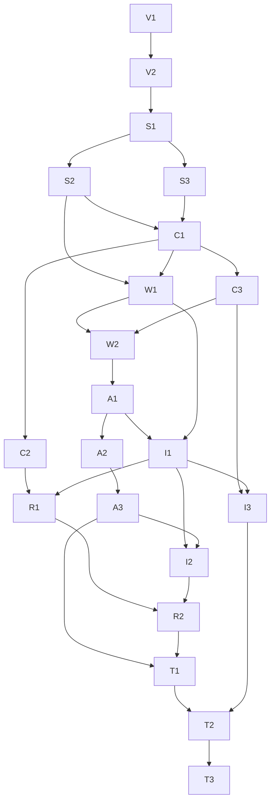

# Multi-agent workspace redesign implementation plan

Status: proposed; do not implement until the user explicitly approves the specification and plan. Audit date: 2026-09-25. This task created documentation only; application tests/builds were not run.

Design authority: [redesign specification](../specs/multi-agent-workspace-redesign-spec.md), [PRODUCT](../PRODUCT.md), [DESIGN](../DESIGN.md). Architectural context: [context](../context.md) and [code ownership](../architecture/code-ownership.md). `docs/context(4).md` was not present; the available context document was checked against current source. The current repository has no stronger surviving specs/plans convention, so the requested `docs/specs/` and `docs/plans/` paths are used.

## 1. Scope

Implement the approved conversation-centered Grok Workspace with a contextual AppShell presentation, persisted conversation/stage rail, one timeline with inline canonical outputs, one composer, and one evidence/context/execution inspector. Correct the frontend selection and refresh behavior necessary to make these regions agree. Reuse existing APIs, contracts, reducers, workflow data and renderers.

Keep default Agent Chat and legacy run presentation working as compatibility paths. Keep existing `/workspace`, `/chat`, `/chat/:conversationId`, `/runs`, `/runs/:runId`, `/reports`, `/reports/:reportId`, `/data/imports`, `/automations` routes and `org_id` navigation. No backend, database, schema, provider, semantic, auth, or report-content changes are included. No new dependencies are needed.

Optional P2 work is not a prerequisite for the foundational UX. Unsupported reference features—confidence gauges, fake totals/files/timestamps, generated PDF, manual reviewer controls, attachments, arbitrary run retry—must not enter the implementation backlog as cosmetic tasks.

## 2. Preconditions

1. Obtain explicit approval of these two documents before source implementation. This is required by the user's task, not an additional deployment/permission policy.
2. Inspect current branch, `git status`, relevant diffs, and current file owners again. At audit time the branch was `main` with extensive modifications/deletions/untracked feature directories. Preserve them; do not restore the old component paths or commit unrelated refactor work. No commits/pushes are authorized by this plan.
3. Reconfirm runtime facts from source where the context document is stale. The current tree contains routed surfaces, `DURABLE_AGENT_EXECUTION_ENABLED`, job/invocation endpoints, and schema work not consistently covered in context.md.
4. Read `src/frontend/AGENTS.md` and relevant installed Next guides in `src/frontend/node_modules/next/dist/docs/` before writing source. The repository warns that the installed Next release has changed conventions. This audit does not prescribe new Next APIs.
5. Verify `/setup` flags and a usable authorized test environment without exposing credentials. Example/config defaults for all five relevant flags are false. Do not turn on backend flags just to make a visual demo look multi-agent.
6. For real durable-path validation, the existing durable schema and compatible worker must already be available. Applying/mutating schema is outside this frontend plan. If unavailable, complete frontend work and contract-fixture tests, then record the live-integration limitation precisely; do not manufacture trace records.
7. Establish the current test baseline after approval. Existing E2E tests include English selectors and root-page assumptions inconsistent with current Vietnamese routed UI. `check-docs.ts` references three handoff files already deleted in this working tree, and several old document links are stale. Record baseline problems separately rather than silently restoring files or claiming a clean baseline.

No backend blocker was found for the proposed P0 design. Operational flag/schema availability and live-browser baseline remain unverified.

## 3. Architecture constraints

| Boundary | Required implementation behavior |
| --- | --- |
| Tenant/auth | Workspace remains keyed by user/org. Requests use existing same-origin `api/scoped` helpers. No direct database/storage clients or server packages in browser components |
| Run authority | Render persisted `workflow_version` and `RunTask.dependencies`; do not infer agent-v1 from Grok flag, persona names, or current run defaults |
| Models of execution | Distinguish legacy chat, Agent Runtime, analysis run DAG, durable job/persona projection, and presentation layout |
| Durable admission | Existing server controls eligibility; capture accepted job ID. Durable eligible turns pin agent-v1 through the repository even if ordinary AGENT_WORKFLOW_ENABLED is false |
| Public/private data | Keep report_draft/review_result out of conversational context. Owners/analysts can read compact workflow-status; viewers must not request it |
| Published output | `getRunDecision` and `getRunBrief` are publication-gated. Do not fabricate an available response from a raw pre-publication pack. Report controls require a real matching ReportRecord/report_ref |
| Numeric truth | Render canonical metric/delta/ChartSpec fields and abstention reasons. No new arithmetic, confidence score, semantic ranking, cohort widening, or zero-filling |
| Artifacts/evidence | Artifacts remain immutable. Validation is a separate matching record, not an invented artifact status. Preserve exact run/ID/path/hash/lineage |
| Turn identity | Failed delivery retries retain frozen input, client_turn_id and Idempotency-Key. New input requires a new identity; no replay across org/conversation |
| Selection | Retain identifier-only workspace reducer and expected_revision protection; stale asynchronous responses cannot replace a new selection |
| Access UX | Viewer and scheduled read-only views cannot send/cancel/signal-mutate. Published JSON/CSV exports remain a reader entitlement; do not disable exports merely because canWrite is false |
| Transport | Optional SSE is presentation, not run correctness. Preserve 404/406 JSON fallback and run polling; no blanket retries creating new turns |
| Styling | Existing Sakura tokens/fonts, scoped CSS and restrained mascot. Contextual AppShell variant only; no feature-wide rewrite of global styles |
| Dependencies/tests | Reuse React hooks, Zod, Recharts, Lucide, Vitest and Playwright already present. No state library, DAG library or test DOM dependency required |

## 4. Implementation phases

Each task below is a bounded unit another coding session can execute and review. “Files” includes proposed new owners; it is not a claim they exist. Paths under `src/frontend/src/` are abbreviated as `web/` only inside task descriptions. Canonical source/test paths appear in section 6. Acceptance criteria are required for the task; do not move implementation to a later phase just to pass a visual snapshot.

### Phase 0 — Verify baseline and lock data boundaries

#### V1 — Verify current routes, flags and supported state [P0]

- **Goal:** Record the actual starting behavior and remove reliance on stale context claims.
- **Files/components:** `web/features/workspace/workspace.tsx`, `web/features/workspace/routing/workspace-route.ts`, `web/components/shell/routes.ts`; read config, API routes, run/durable contracts and worker only.
- **Dependencies:** Explicit approval; preserve working-tree changes.
- **Implementation notes:** Inspect setup flags, direct conversation/run routes, role behavior, default vs Grok composition, and available job traces. Capture authorized empty/active/completed screenshots when environment permits. Trace controlled run recovery and current polling lifecycle. Do not change flag defaults or backend behavior.
- **Acceptance criteria:** Baseline identifies all five flags, actual pinned run version, route precedence, viewer export entitlement, private checkpoint restrictions and missing operational prerequisites. No conclusion relies on fabricated data or the screenshot's example metrics.
- **Risks:** Local data/providers/worker may be unavailable; distinguish verified source behavior from unverified live behavior and use existing contract fixtures for presentation tests.

#### V2 — Establish regression fixtures and baseline checks [P0]

- **Goal:** Make known valid/invalid states available to focused future tests.
- **Files/components:** Existing frontend tests, `src/backend/tests/e2e/mvp.spec.ts`, `src/backend/tests/vitest.config.ts`, `src/backend/tests/playwright.config.ts`; new colocated model fixtures only where necessary.
- **Dependencies:** V1.
- **Implementation notes:** Reuse current typed artifact/run/message fixtures. Include a valid split-branch run, legacy run, failed/cancelled run, role-private checkpoint, durable job with a different run, unavailable decision response and published report. Fixtures are test-only and never imported by runtime UI. Record pre-existing test/selector/doc failures without unrelated cleanup.
- **Acceptance criteria:** Every fixture conforms to its existing contract; baseline records available test commands and known blockers. No frontend numeric behavior is inferred from a fabricated mock percentage.
- **Risks:** A fixture that mirrors only happy-path implementation can conceal cross-run/privacy errors; include mismatched references, partial validations and delayed responses.

### Phase 1 — Establish one state owner and a bounded shell

#### S1 — Extract the chat controller with compatibility composition [P0]

- **Goal:** Make one conversation/turn/run selection accessible to rail, timeline and inspector without duplicating hooks.
- **Files/components:** `web/features/agent-chat/agent-chat.tsx`; proposed `hooks/use-agent-chat-controller.ts`; existing useConversations/useMessages/useSelectedMessages/useAgentTurn/useChatEvidence.
- **Dependencies:** V1, V2.
- **Implementation notes:** Move existing orchestration into the feature controller incrementally; preserve default AgentChat props/export as a compatibility composition. Return typed state/actions, not JSX or server dependencies. Keep retry/draft ownership distinct from selected analytics. Do not combine all async behavior into a giant provider or TSX file.
- **Acceptance criteria:** Both default AgentChat and new workspace can consume one controller instance; sending, selecting, opening evidence and scheduled/read-only behavior retain their existing contracts. No duplicated conversation/message requests from child panes.
- **Risks:** Effect dependency changes may reset input or refetch in loops; use focused state/interaction regressions before adding the new shell.

#### S2 — Centralize selected-run reads and refresh ownership [P0]

- **Goal:** Keep header, DAG, inline results and inspector on the same scoped run snapshot.
- **Files/components:** `web/features/agent-chat/hooks/use-chat-run-polling.ts`, `web/features/analysis/api/run-data.ts`, `web/features/analysis/api/workflow-status.ts`; proposed `web/features/analysis/hooks/use-workspace-run-resource.ts`; evidence/dashboard hooks as adapters/consumers.
- **Dependencies:** S1.
- **Implementation notes:** Own detail/checkpoint/artifact/decision/report availability under org/run/request-generation keys. Reuse the 1100ms visible/5000ms hidden run cadence. Refresh artifacts on stage transitions and terminal state rather than per-card polling. Preserve last good data on transient GET failures, use bounded retry/backoff, expose error/stale/refetch states, and stop unauthorized reads. Writers only request workflow-status. Retain historical result fallback and explicit publication gating.
- **Acceptance criteria:** All visible regions agree on run ID/status; late run-A responses cannot populate run B; a transient poll failure can recover without reselecting the run; artifact/decision availability after publication refreshes without a page reload. Idle/terminal views do not continuously fetch full bundles.
- **Risks:** Large artifact payloads and absent validation during a persistence race. Coalesce requests and distinguish metadata present from valid analytical preview ready.

#### S3 — Add a contextual AppShell and three-region workspace [P0]

- **Goal:** Implement the approved Option B layout with one dominant contextual navigation region.
- **Files/components:** `web/components/shell/app-shell.tsx`, `web/features/workspace/workspace.tsx`, `web/features/grok-workspace/components/grok-workspace.tsx`; proposed `grok-workspace.module.css` and `workspace-conversation.tsx`; minimal scoped integration in styles.
- **Dependencies:** S1; S2 for populated data (empty layout can be composed once S1 exists).
- **Implementation notes:** Add an explicit AppShell presentation variant for flagged analytical workspace only; keep its routes, org switch, auth, skip link and native mobile navigation. Use 86px global strip, ~232px contextual rail, flexible timeline and ~320px inspector at sufficient desktop width. Replace duplicate page/capability headings, retaining accessible provisional information. `100dvh` intrinsic rows and min-size constraints create independent rail/timeline/inspector scrolling. Do not simply hide global controls with no accessible replacement.
- **Acceptance criteria:** At 1440×900 the composer and context are reachable without whole-page transcript scrolling. Closing inspector returns its column to the timeline. Exactly one inspector/rail is mounted. Other routes and flag-off composition retain their layout.
- **Risks:** Legacy/global CSS overrides, lost org/account access, footer or banner consuming viewport. Scope styles to the variant and audit the full globals import cascade rather than rewriting shared CSS.

### Phase 2 — Conversation navigation, header and delivery lifecycle

#### C1 — Expose persisted conversation navigation and correct route/run linkage [P0]

- **Goal:** Make selected conversation and analytical context stable across click, reload and Back/Forward.
- **Files/components:** Existing ConversationList, controller, useConversations/useMessages/useSelectedMessages; `web/features/grok-workspace/components/workspace-rail.tsx` (new); workspace route selection/context reducer.
- **Dependencies:** S1, S2, S3.
- **Implementation notes:** Separate conversation presentation from the current hardcoded durable-persona block. Fetch selected metadata even when the conversation is outside page one. `/chat` opens unsent state; explicit conversation selection pushes its existing URL, accepted new conversation replaces the unsent URL. Recover matching run from authorized messages in controlled mode. Forward route-selected external-run identity/read-only intent through GrokWorkspace, so an unresolved direct run stays non-mutating before metadata arrives. Preserve explicit direct-run precedence; do not continually select the latest message run after a user clears context for scope change. Merge pagination by stable message ID with request guards.
- **Acceptance criteria:** New draft makes no API mutation until send; routed conversation outside initial page loads; A→B with delayed A response cannot mix transcripts; direct run remains selected; older-page merge preserves loaded messages and active run. Viewer sees browsing, no new-turn action.
- **Risks:** Router remounts can discard local drafts or duplicate loads. Key in-memory drafts by org/conversation and keep route/controller state updates idempotent.

#### C2 — Build conversation header and compact scope composer [P0]

- **Goal:** Establish clear current-run context while keeping the next request easy to send.
- **Files/components:** Proposed WorkspaceHeader; existing Composer, ScopeFields, useAgentTurn, run-view.ts; `web/features/workspace/context.ts` integration.
- **Dependencies:** C1, S3.
- **Implementation notes:** Header uses exact conversation title, selected-run state and pinned scope/date. Next-request scope disclosure sits at composer; requested/effective/catalog dates remain distinct. Use two-to-six-line textarea, existing 2000 limit, Ctrl/Cmd+Enter with IME guard, labeled send, existing supported target options in disclosure, prompt-prefill quick actions. Keep busy transport separate from run execution. Preserve draft on delivery errors; scheduled/unresolved external views fail closed.
- **Acceptance criteria:** Scope project resets zone; scope changes clear prior analytical descendants without altering saved messages/run. Quick action never auto-sends. Viewer/scheduled sends and cancellation remain impossible. Plain Enter creates newline, Vietnamese IME does not accidentally send, draft survives a failed request.
- **Risks:** Shrinking the composer could hide scope or change submission semantics. Test payload equality with `toWorkspaceContext` and retain exact target/identity boundaries.

#### C3 — Reconcile accepted durable jobs and retry identity [P0]

- **Goal:** Eliminate stale latest-job/run linkage after a new turn in an existing conversation.
- **Files/components:** useAgentTurn, useAgentExecution, controller, `web/features/agent-chat/api/conversations.ts`, turn-delivery.ts, turn-identity.ts.
- **Dependencies:** S1, S2, C1.
- **Implementation notes:** Capture the already-supported `agent_turn_job_id`. Restart/invalidate polling for that accepted job even if conversation ID is unchanged; use the existing job GET endpoint where an exact job ID is known. Propagate later run linkage through controlled workspace actions. Ignore older latest-job snapshots and traces for another run. Expose job transport errors instead of silently treating null as a confirmed absence. Separate “retry original delivery” from edited new input; clear retry ownership on navigation/org change.
- **Acceptance criteria:** Job accepted with null run later attaches the correct run; second job in same conversation refreshes; null/terminal prior response does not permanently stop discovery; no job-A state on run B. SSE 404/406 fallback and retry reuse the same turn identity without duplicate runs.
- **Risks:** Durable completion can lag publication; keep job status independent and never make job completion the only source of report existence.

### Phase 3 — Honest timeline and workflow visualization

#### W1 — Build the actual-stage rail and dependency graph [P0]

- **Goal:** Make real parallel processing and publication visible with one progress model.
- **Files/components:** WorkflowGraph, RunProgress, task-label.ts, workflow-checkpoint-status.tsx, agent-identity.ts; proposed `workflow-view-model.ts` and `agent-stage-list.tsx`.
- **Dependencies:** S2, S3, C1.
- **Implementation notes:** Use loaded run version/tasks/dependencies, not task presence heuristics or current flags. Keep Analyst/Insight separate and add neutral Publication representation without modifying AgentKey. Group parallel siblings, show connectors/text dependencies and per-node state labels; replace duplicate task track in workspace mode. Provide legacy/generic topology fallback. Only show real completed-task counts; no elapsed-time percentage/ETA.
- **Acceptance criteria:** Comparison/Chart/Analyst can independently run/succeed/fail. Revision-2 path is visible only from authorized checkpoint state. Cancelled is distinct; terminal run does not rewrite pending tasks. Legacy renders no invented reviewer/publication nodes. Graph works vertically at narrow width.
- **Risks:** Graph row order mistaken for causal order; all connections must be derived/validated against returned dependencies and labels remain readable.

#### W2 — Unify persisted messages and derived activity in run groups [P0]

- **Goal:** Connect conversation, stage outputs and live status without inventing dialogue.
- **Files/components:** MessageThread, ActivityTimeline, controller; proposed `timeline-model.ts`, `conversation-timeline.tsx`, `message-item.tsx`, `run-output-group.tsx` and scoped styles.
- **Dependencies:** C1, C3, W1.
- **Implementation notes:** Preserve message content/order and stable upsert IDs. Separate message, transient activity, workflow status and artifact entries in the frontend view model. Group by actual linked run; render content once rather than content + duplicate text part. Deduplicate previews and keep old refs as links. Poll/refresh active messages and preserve pagination anchors. Implement bottom-follow threshold/new-update control without forcing scroll during reading.
- **Acceptance criteria:** Persisted specialist content is labeled as saved stage update; derived status has no fake timestamp/speaker. Repeated poll/page loads create no duplicates; stage upsert updates in place; selecting a stage finds its output. Scrolling up prevents auto-jump; earlier messages retain anchor.
- **Risks:** Placeholder message updated at completion may appear earlier than newly added stage messages by created_at. Preserve its stable position and use an explicit run-result group, not timestamp rewriting.

### Phase 4 — Inline analytics and report lifecycle

#### A1 — Add validated Data and Comparison previews [P0]

- **Goal:** Present useful canonical numbers in the transcript before a final report is available.
- **Files/components:** Proposed `web/features/analysis/components/data-pack-summary.tsx`, `comparison-pack-summary.tsx`, `web/features/analysis/models/artifact-preview.ts`; existing AnalysisResult and `web/lib/chart-format.ts`.
- **Dependencies:** S2, W2.
- **Implementation notes:** Adapt DataAnalysisPack metrics/dataset.row_count and ComparisonPack fields directly. Promote previews only with matching validation and succeeded origin task. Show labeled quality metrics/limitations, real dates/currency, exact delta types and reasons. Extract reusable comparison/table display only where required; keep existing AnalysisResult exports and semantics.
- **Acceptance criteria:** Zero-baseline relative delta remains unavailable while absolute delta remains visible; null differs from zero; source file rows are not run rows; 0–100 rates are not rescaled. Every preview opens its exact artifact/evidence. Failed downstream run can retain explicitly partial validated outputs.
- **Risks:** Accidental numeric recomputation, incomplete validation or huge unit arrays. Use existing formatting, contract fields and on-demand table expansion.

#### A2 — Attach charts and findings to producing stages [P0]

- **Goal:** Show real charts and insight progress without waiting for GrokDashboardSurface's report gate.
- **Files/components:** ChartRenderer/ChartUnavailableView, AnalysisResult claim presentation; proposed AnalysisPackSummary, InsightPackSummary and InlineRunOutput adapters.
- **Dependencies:** A1, W2.
- **Implementation notes:** Reuse verified chart_pack/visual_evidence/analysis_pack/insight_pack. Deduplicate charts by run/chart identity and source; avoid duplicate SVG pattern IDs. Use actual purposes, limitation text, available/unavailable states and qualitative support labels. Pre-publication preview opens local loaded detail; published focus_visual/drilldown actions retain their existing gated hydration.
- **Acceptance criteria:** Charts appear when their actual validated branch output is ready, even while Insight or Report runs. Unsupported chart intent uses ChartUnavailableView. No chart values/axes/series/bindings or finding claims change. Screen-reader/keyboard access remains available.
- **Risks:** Tiny preview grid, full-chart button conflicting with Recharts interactions, SVG ID collision. Use minimum readable plot sizes and separate detail controls; mount one canonical chart instance where possible.

#### A3 — Integrate decision-ready results and published report row [P0]

- **Goal:** Make completion discoverable while preserving exact publication and fallback rules.
- **Files/components:** DecisionIntelligenceView, AnalysisResult, ReportDashboard/model, GrokDashboardSurface/loader; proposed ReportArtifactRow; report API/hook and WorkspaceReportDetail integration.
- **Dependencies:** S2, A2, W1.
- **Implementation notes:** Use `getRunDecision` available response for decision/priority actions; honor `legacy_report_brief`/unavailable and existing brief/artifact fallback. Move full dashboard to explicit opened detail rather than always before conversation. Show writer-only compact draft/review checkpoints; published row uses actual report record/detail, not raw draft or inferred filename. Wire open/JSON/CSV/print via existing report flow; report may be published while job is finishing.
- **Acceptance criteria:** No published/decision-ready surface before canonical availability; no private draft/review IDs/prose in public chat. Completed agent-v1, old legacy report and unavailable decision each render correctly. Viewers can open/export/print authorized reports. No duplicate full dashboard and inline result.
- **Risks:** Cross-run report matching and reliance on last conversation report_ref. Match every report to selected run/org; report detail failures remain local and do not label run failed.

### Phase 5 — Evidence and execution in one inspector

#### I1 — Consolidate Context/Evidence/Artifacts/Details [P0]

- **Goal:** Replace fragmented inspector placement with a single selected-run inspector.
- **Files/components:** ContextEvidencePanel, ContextTab/EvidenceTab/FilesTab/RunTab, AgentExecutionInspector; proposed ArtifactsTab/DetailsTab; GrokWorkspace composition.
- **Dependencies:** S2, S3, W1, A1.
- **Implementation notes:** Receive shared run resources instead of fetching per tab. Move source manifests under Evidence; add real public artifact index. Integrate optional matching durable trace under Details, labeling persona aggregates and recent-event limits. Reuse private compact checkpoint summary for writers only. Remove separate inspector mounts in workspace mode; default composition stays compatible.
- **Acceptance criteria:** Exactly four product tabs and one inspector; tab data agrees with header/timeline; empty/loading/unavailable/error are distinguishable. No report_draft/review_result in public artifact list or viewer checkpoints. A trace for another run is withheld. Artifact counts reflect visible records.
- **Risks:** Removal of a Files tab could hide source provenance; source metadata must remain directly reachable in Evidence and linked from the selected artifact.

#### I2 — Preserve exact evidence paths and native drill-in behavior [P0]

- **Goal:** Make every visible analytical claim traceable without stacked dialogs.
- **Files/components:** EvidenceDrawer, EvidenceTab, useGrokEvidence/useChatEvidence adapters, workspace context/action hydration; proposed shared evidence-detail.tsx.
- **Dependencies:** I1, A2, A3.
- **Implementation notes:** Reuse ID/hash/validation/input/source/snapshot/payload sections as content usable in pane or native dialog. Carry `evidence_path` through selection and show exact referenced value only when resolvable; missing path remains explicitly unavailable. Inline lineage navigation uses authorized same-run bundle. Add copy ID/path controls, full wrapping, Back within mobile sheet and focus restoration.
- **Acceptance criteria:** Opening a metric/claim/chart's evidence exposes exact run/artifact/path, matching checks and source lineage. Long hashes remain selectable. Mobile inspector never opens a second modal on top. Existing report/legacy EvidenceDrawer callers continue to work.
- **Risks:** Forged path resolution, stale artifact response, lost focus. Restrict resolution to typed data/path forms already supplied; never evaluate paths as code or fetch arbitrary URLs.

#### I3 — Add job-specific cancellation before run linkage [P1]

- **Goal:** Expose the already-existing durable job cancel capability where no run ID is available yet.
- **Files/components:** `web/features/agent-chat/api/conversations.ts`, useAgentExecution/controller, WorkspaceHeader; existing job route is read-only reference, not edited.
- **Dependencies:** C3, I1.
- **Implementation notes:** Add a typed frontend wrapper for POST `/agent-turn-jobs/:id/cancel` using org scoping and existing AgentTurnJobView schema. Show only for known active jobs in writable interactive views. Once a run is linked, prefer the single run-cancel action and refresh both models. No AbortController “cancel” pretending to stop server work.
- **Acceptance criteria:** Queued job with null run can be cancelled; viewer/scheduled controls absent; UI waits for persisted confirmation, preserves actual outcomes in publication/cancel races, and never creates a new turn.
- **Risks:** Job/run states may converge asynchronously; show pending cancellation and both actual statuses rather than forcing an optimistic state.

### Phase 6 — Responsive interaction and accessibility

#### R1 — Complete adaptive rail/inspector and short-viewport behavior [P0]

- **Goal:** Keep the main workspace usable at tablet/mobile widths and with the on-screen keyboard.
- **Files/components:** AppShell variant, GrokWorkspace module styles, rail/inspector native dialog wrappers, composer, workflow graph styles.
- **Dependencies:** S3, C2, W1, I1.
- **Implementation notes:** Follow 1280/1024/720 thresholds and available-content-width rule from spec. Collapse inspector before squeezing timeline; contextual rail becomes drawer. Use one native modal at a time. `minmax(0,1fr)` and safe-area padding prevent covered content; short-height fallback uses one main vertical scroll owner. Scope old 1200/960 media-rule conflicts to this mode only.
- **Acceptance criteria:** 1920,1440,1280,1024,768,390,320 widths, 600px-short height and keyboard-open state have no page-wide overflow or hidden composer. Tables scroll horizontally; graph preserves branch semantics; pane close restores focus and width.
- **Risks:** Browser dynamic viewport behavior and nested scroll containment. Verify in actual browser, not static markup alone.

#### R2 — Complete keyboard, announcements and chart access [P0]

- **Goal:** Make the new composition operable without a pointer and without color/motion cues.
- **Files/components:** Header/rail/timeline/inspector/composer, shared UI primitives and scoped motion/graph/chart integration only as necessary.
- **Dependencies:** R1, W2, I2.
- **Implementation notes:** One polite live status owner; native dialog focus containment/Escape; roving tab behavior; explicit stage/status names and dependency text; 44px touch controls; reduced-motion including chart animation and auto-scroll. Use exact text/table alternatives from existing chart data where needed. Do not add accessibility packages just for checks.
- **Acceptance criteria:** Full send→stage→evidence→report→return path works by keyboard; no lost focus on polling; Vietnamese input/long content/IDs wrap; high zoom stays usable; reduced motion preserves all state information.
- **Risks:** Nested interactive charts or multiple live regions generate confusing navigation/announcements. Prefer separate chart detail controls and test with a screen reader manually.

### Phase 7 — Regression validation and readiness

#### T1 — Verify models and component contracts [P0]

- **Goal:** Prevent regressions in identity, data truth, access and fallback behavior.
- **Files/components:** Existing and proposed colocated tests listed in sections 6 and 8.
- **Dependencies:** C3, W1, W2, A3, I1, R2; test individual tasks as delivered rather than waiting until this phase.
- **Implementation notes:** Use existing Vitest Node setup and renderToStaticMarkup conventions for pure/model/render tests. Test behavior and invariants, not CSS class strings except meaningful composition boundaries. Add pure adapter tests for mismatched run refs, branch status, timeline deduplication and null/zero deltas. Use browser tests for effects/focus/scroll; do not add jsdom/testing-library dependencies.
- **Acceptance criteria:** Focused suites cover canonical values/references, privacy, legacy fallback, concurrency and turn identity. Existing public exports/callers remain compatible. No backend contract/schema snapshot changes result from frontend work.
- **Risks:** Static markup cannot prove focus/effect behavior; explicitly carry those checks to T2.

#### T2 — Verify browser workflows, flag combinations and visual regressions [P0]

- **Goal:** Demonstrate the workspace works with actual navigation and async state changes.
- **Files/components:** `src/backend/tests/e2e/mvp.spec.ts`, proposed `multi-agent-workspace.spec.ts`, existing Playwright config; test harness flag wiring only if required.
- **Dependencies:** T1, I3 for the complete P0/P1 release, and a usable test environment for integration cases.
- **Implementation notes:** Update relevant stale selectors/root-entry assumptions without loosening assertions. Add deterministic browser route fixtures for edge states; keep separate real local-stack cases for tenant/role/publication integration. Explicitly exercise Grok layout independently of runtime/SSE/durable/workflow flags. Capture responsive states, report print and focus restoration. Keep existing legacy coverage.
- **Acceptance criteria:** Critical scenarios in section 8 pass for delivered functionality; screenshots and behavior checks show correct branch/inspector/composer layout. Local integration limitations and pre-existing failures are recorded, not represented as passes. No provider/production credential exposure.
- **Risks:** Harness currently exposes E2E_AGENT_WORKFLOW/E2E_DURABLE_AGENT_EXECUTION but no explicit Grok matrix override. Keep any new flag wiring in test harness only; do not change application flag defaults or provider logic.

#### T3 — Review scope and prepare presentation-only rollout [P0]

- **Goal:** Confirm implementation matches approved scope and can be rolled back through the existing presentation flag.
- **Files/components:** Final relevant diff, these documents if approved scope needs clarification, existing flags/config read-only.
- **Dependencies:** T2 and all required tasks in the delivered release.
- **Implementation notes:** Inspect source diff for unrelated edits/dependencies/backend changes. Compare all spec acceptance criteria and role/flag matrix. Document exact tested commit/tree and environmental limitations. Do not commit, push, deploy or enable flags without the applicable explicit instruction.
- **Acceptance criteria:** A reviewer can identify what changed, canonical invariants preserved, scoped test results, and how to turn off the presentation flag. No destructive cleanup or unrelated refactor has entered the change.
- **Risks:** Concurrent work may change owners/contracts during implementation. Re-read the relevant diff and adjust only this scope rather than overwriting new work.

### Phase 8 — Optional polish, separate from foundational work

#### O1 — Refine local mascot and transition presentation [P2]

- **Goal:** Add restrained Sakura Signal identity after functional UX is complete.
- **Files/components:** Existing MascotAvatar/AssistantPresence integration, workspace empty state, scoped motion styles; reuse current local assets.
- **Dependencies:** T1, R2; exclude from the critical path.
- **Implementation notes:** Small welcome/avatar treatment, no new image generation or hero behind analytical content. Use existing motion/tokens and decorative semantics.
- **Acceptance criteria:** Art remains secondary and within existing asset budgets; status still has text/icon; reduced-motion and loaded/failed states remain clear.
- **Risks:** Decorative expansion recreates whitespace or distracts from evidence. Keep out of active results and remove if it reduces useful reading area.

#### O2 — Add local navigation polish without new capabilities [P2]

- **Goal:** Improve retrieval within already-loaded content after the main workflow is reliable.
- **Files/components:** WorkspaceRail, ConversationList, local pane-state helper and tests if delivered.
- **Dependencies:** C1, W2, R2.
- **Implementation notes:** Optional title filter explicitly labeled “Trong hội thoại đã tải”; maintain load-more access. Optional in-memory rail/pane preference per org. No server search claim, global command palette, persisted notes, rename/delete or local-storage cache of analytic data.
- **Acceptance criteria:** Filter cannot imply full-history search; clearing it restores loaded rows; org switch resets data; no new API/dependency introduced.
- **Risks:** Users mistake local filtering for complete search. If copy cannot make the limit clear, omit the filter.

## 5. P0/P1/P2 priorities and release boundaries

| Priority | Task IDs | Delivery meaning |
| --- | --- | --- |
| P0 | V1,V2,S1,S2,S3,C1,C2,C3,W1,W2,A1,A2,A3,I1,I2,R1,R2,T1,T2,T3 | Required coherent workspace, actual stage visibility, canonical output, synchronized selection, exact evidence access, responsive access and regression evidence |
| P1 | I3 | Complete the professional cancellation experience for a durable turn before its run is linked |
| P2 | O1,O2 | Optional mascot/transition and explicitly local navigation conveniences; do not mix into state/architecture changes |

For the complete approved specification, deliver P0 and P1; P2 may be deferred. Exact evidence inspection and accessible drill-in are foundational P0 behavior. If an interim P0 milestone is reviewed before I3, label pre-run job cancellation as outstanding; do not claim the complete spec is done.

## 6. File-by-file impact

New paths are proposals. Do not recreate deleted old source paths. “Read-only” files are audit/compatibility references and must not become backend implementation work in this redesign.

| File or tightly related files | Planned impact | Tasks |
| --- | --- | --- |
| `src/frontend/src/features/workspace/workspace.tsx` | Route-gated AppShell variant, shared controller/resource integration, correct direct-run/read-only props | S3,C1,C2 |
| `src/frontend/src/features/workspace/routing/workspace-route.ts` | Preserve URL/org semantics and selection precedence; focused adjustment only if needed | C1 |
| `src/frontend/src/features/workspace/context.ts` + `context.test.ts` | Retain clear-for-scope and revision fencing; test new integration paths, no payload/value state | C1,C2,I2 |
| `src/frontend/src/components/shell/app-shell.tsx` | Contextual presentation variant with accessible compact global navigation; other variants unchanged | S3,R1 |
| `src/frontend/src/components/shell/routes.ts` + `routes.test.ts` | Reuse existing route builders; tests for navigation, no new route scheme | C1,T1 |
| `src/frontend/src/features/grok-workspace/components/grok-workspace.tsx` + test | Compose one rail/conversation/inspector; remove old dashboard-above-chat and duplicate inspector placement | S3,I1 |
| Proposed `.../grok-workspace/components/{workspace-rail,workspace-header,workspace-conversation}.tsx` and `grok-workspace.module.css` | Presentational regions and viewport rules | S3,C1,C2,R1 |
| `src/frontend/src/features/agent-chat/agent-chat.tsx` | Compatibility composition around extracted controller | S1 |
| Proposed `.../agent-chat/hooks/use-agent-chat-controller.ts` | Own existing chat orchestration without duplicate data owners | S1,C1,C3 |
| `.../agent-chat/hooks/{use-conversations,use-messages,use-selected-messages}.ts` | Selected metadata, guarded paged merge and refresh coordination | C1,W2 |
| `.../agent-chat/hooks/use-agent-turn.ts` | Capture job ID, preserve/reconcile retry and draft ownership | C2,C3 |
| `.../agent-chat/hooks/use-agent-execution.ts` | Exact accepted-job invalidation, errors, controlled run linkage | C3,I3 |
| `.../agent-chat/api/conversations.ts` | Reuse existing endpoints; frontend exact-job GET/cancel wrappers using current schemas if needed | C3,I3 |
| `.../agent-chat/api/turn-delivery.ts` + test, `src/frontend/src/lib/sse.ts` + test | Preserve transport/identity; change only if required by lifecycle integration | C3,T1 |
| `.../agent-chat/conversation-list.tsx` | Separate list from grouped persona UI; route/cursor/selected semantics | C1 |
| `.../agent-chat/composer.tsx`, `components/forms/scope-fields.tsx` | Compact presentation, labeled scope disclosure, IME/keyboard behavior; reuse existing fields | C2,R2 |
| `.../agent-chat/run-view.ts` | Preserve existing scheduled/unresolved fail-closed behavior | C2,T1 |
| `.../agent-chat/{workflow-graph,run-progress,workflow-checkpoint-status}.tsx`, graph CSS, task-label.ts | Actual DAG view and checkpoint integration; remove workspace-only duplication | W1 |
| Proposed `.../agent-chat/{workflow-view-model,timeline-model}.ts`, `agent-stage-list.tsx`, `conversation-timeline.tsx`, `message-item.tsx`, `run-output-group.tsx` | Pure presentation adapters and focused timeline rendering | W1,W2 |
| `.../agent-chat/message-thread.tsx`, module CSS, activity-timeline.tsx | Exact message rendering and safe transient strip | W2 |
| `.../agent-chat/agent-execution-inspector.tsx` | Extract/reuse trace content inside Details; no separate flagged inspector | I1 |
| `src/frontend/src/features/analysis/hooks/use-workspace-run-resource.ts` (new), existing chat run polling | Shared org/run resource and transition-driven refresh | S2 |
| `src/frontend/src/features/analysis/api/{run-data,workflow-status}.ts` | Reuse APIs and schemas; no endpoint redesign | S2,A3 |
| `.../analysis/components/analysis-result.tsx` + test | Extract only shared blocks; retain legacy brief/artifact fallback and ReportBody export | A1,A2,A3 |
| Proposed `.../analysis/models/artifact-preview.ts`, `components/{data-pack-summary,comparison-pack-summary,analysis-pack-summary,insight-pack-summary,inline-run-output}.tsx` | Typed previews of existing canonical artifacts | A1,A2 |
| `src/frontend/src/components/decision-intelligence.tsx` | Reuse or focused presentation extraction; preserve exact values/ranks/refs | A3 |
| `src/frontend/src/components/visualization/chart-renderer.tsx` + test | Reuse existing renderer; only necessary presentation/accessibility/instance-ID adjustments | A2,R2 |
| `src/frontend/src/features/reports/dashboard/{report-dashboard.tsx,report-dashboard-model.ts}` + test | Published detailed result and existing selection model reused | A3 |
| `.../grok-workspace/components/grok-dashboard-surface.tsx`, `hooks/use-grok-dashboard-data.ts` | Explicit published detail surface; consume shared keyed availability as needed | S2,A3 |
| `.../reports/components/workspace-report-detail.tsx`, `hooks/use-workspace-report.ts`, `api/reports.ts`; proposed `report-artifact-row.tsx` | Published row/open/export/print integration; preserve read entitlement | A3 |
| `.../evidence/components/context-evidence-panel.tsx`, module CSS and test; Context/Evidence/Files/Run tab files | Shared inspector, move source list, proper tab behavior | I1,R2 |
| Proposed `.../evidence/components/{artifacts-tab,details-tab,evidence-detail}.tsx` | Artifact catalog, combined details and reusable evidence body | I1,I2 |
| `.../evidence/components/evidence.tsx`, evidence selection/run hooks; Grok/chat evidence hooks | Reuse native drawer with shared resource and exact selection guards | S2,I2 |
| `.../grok-workspace/hooks/use-workspace-action.ts`, `api/action-hydration.ts` + test | Preserve authorization/revision checks and exact selection behavior | C1,I2 |
| `src/frontend/src/styles/{tokens,legacy-components,theme-overrides,motion}.css`, `app/globals.css` | Read cascade; minimal scoped integration only, no wholesale rewrite or new feature colors | S3,R1,R2 |
| `src/frontend/src/components/assistant/*`, `src/frontend/brand/mascot/README.md` | Existing local assets/state mapping reused; optional integration only | O1 |
| `src/backend/tests/e2e/mvp.spec.ts`, proposed `multi-agent-workspace.spec.ts`, test harness/config | Update relevant routes/selectors and add flag/behavior coverage; test-only changes | T2 |
| Backend agents/config/contracts/db/domain/semantic/worker/API routes and SQL | Read-only evidence; no application changes planned | V1,all invariant reviews |
| `package.json`, `pnpm-lock.yaml` | No dependency or script change expected | Final scope review |

The `...` prefix in table rows inherits the feature directory named in that row or preceding full path; implementers must resolve the current owner with `rg --files` before edits. Proposed new colocated test files use the same feature directory as their production module.

## 7. Dependencies between tasks



The graph shows ordering, not authorization to delegate or run independent agents. Work can be delivered incrementally in this sequence. Keep one logical functionality per eventual commit if the user later requests commits; related tests/style/types stay with the behavior, rather than splitting by file type. No commits are created automatically during implementation.

Foundation order matters: selection/resource ownership precedes inline previews; canonical published result handling precedes final inspector drilldowns; native modal/viewport behavior precedes browser regression sign-off. Do not use mock activity as an interim substitute for an incomplete state model.

## 8. Testing strategy

### 8.1 Existing tests to retain/update

| Existing suite | Required coverage/update |
| --- | --- |
| `features/agent-chat/agent-chat.test.tsx` | Preserve persisted sender identities, safe text/error rendering, checkpoint privacy, fixed activity labels, scheduled/unresolved read-only behavior; replace the primary five-persona expectation with actual stage rail while retaining separate durable trace tests |
| `features/grok-workspace/components/grok-workspace.test.tsx` | Replace the current assertion that Grok has no conversation rail with exactly one contextual rail, one inspector and one composer; avoid class-only evidence for behavior |
| `features/workspace/context.test.ts` | Scope/run descendant clearing, expected_revision, cross-run chart/priority/evidence selection, late response ignored |
| `features/grok-workspace/api/action-hydration.test.ts` | Exact run/report/chart/priority/drilldown membership and unavailable selection failures |
| `features/analysis/api/run-data.test.ts` | Scoped reads, existing run cancellation contract, no endpoint change |
| `features/agent-chat/api/turn-delivery.test.ts` and `lib/sse.test.tsx` | Same identity across 404/406 fallback/retry; fragmented frames; sequence rejection; no bogus success after missing terminal event |
| `features/analysis/components/analysis-result.test.tsx` | Brief loading, historical fallback, unavailable state and canonical signal action references retained |
| `components/visualization/chart-renderer.test.tsx` | Chart units/nulls/series semantics and accessible representation unchanged; instance-ID collision case if renderer changes |
| `features/reports/dashboard/report-dashboard.test.tsx` | Controlled chart/priority/drilldown selection and legacy-null behavior retained |
| `features/evidence/components/context-evidence-panel.test.tsx` | New tab grouping, source placement, empty states, privacy, tab semantics |
| `components/shell/routes.test.ts` | Existing route builders and org scoping unchanged |
| `src/backend/tests/e2e/mvp.spec.ts` | Preserve role/export/lineage/publication assertions; update only related stale selectors and route navigation |

New pure tests should target workflow/timeline/artifact adapters: real dependency branches, terminal tasks left pending, unknown/historical workflows, message upsert/page deduplication, run-bound artifact previews, validation absent/false/true, publication gating, mismatched durable job and report, and exact null/zero/percent/percentage-point display.

Existing component tests use `renderToStaticMarkup` and Vitest's Node environment. They cannot validate hook effects, modal focus or scrolling. Use Playwright for those instead of adding a browser-DOM test dependency.

### 8.2 Browser and integration scenarios

| Scenario | Required assertions |
| --- | --- |
| Empty workspace/new conversation | No fake run/trace/history; correct prerequisites; draft not persisted before send; read-only variant directs user to existing work |
| Active ordinary run | Queued→running tasks and persisted stage messages refresh; composer remains visible; evidence tab stays current |
| Parallel branches | One branch succeeds while another runs/fails; graph shows split/join and independent states; Chart can preview before Report |
| Completed agent-v1 | Decision response available, exact published report row, correct artifact/evidence links; no duplicate output/dashboard |
| Failed/cancelled run | Safe code/status, preserved validated partial results, pending downstream tasks not falsely succeeded; no fake retry-run control |
| Reviewer revision | Writer checkpoint revision 1/revision-required/2/PASS or second failure; no human approve/revise; viewer private fields absent |
| Report/export | Actual report ID/run match; JSON/CSV signed URL flow including viewer; print excludes workspace chrome and does not crop report |
| Evidence | Metric/claim/chart → artifact/path → input/source/hash; missing/denied path distinct from empty success; no cross-run leakage |
| Conversation navigation | Selected item outside page one, load earlier, A→B with delayed A response, direct `/chat/:id`, direct `/runs/:id`, Back/Forward and reload |
| Scope change | Project clears zone; old analytical selections cleared; next turn snapshot matches new scope; saved run scope unchanged |
| Durable queued job | Accepted null run/job ID later gains correct run; reloading trace; second job same conversation; older/mismatched latest job withheld |
| Durable cancel before run | Existing job endpoint used, no new turn, no optimistic terminal state, role gating |
| Retry/idempotency | Drop delivery response then retry original identity; one persisted turn/run; editing creates an explicit new request identity |
| Poll/network error | Temporary failed GET retains visibly stale state then recovers; no resend; unauthorized access clears protected state and stops retries |
| SSE fallback | 404/406 retries as JSON with same identity; polling works with absent stream; interrupted stream remains a recoverable delivery error |
| Responsive | 1920×1080,1440×900,1280×800,1024×768,768×1024,390×844,320×640 and a short viewport; pane open/closed and keyboard-open state |
| Text/data stress | Long Vietnamese conversation/report labels, multiline IME input, 64-char hash and long evidence path, many rows/messages; no viewport overflow |
| Accessibility | Keyboard-only navigation, tab arrows, focus restoration, dialog Escape, one modal, visible focus, non-color states, reduced motion, 200% zoom |
| Scroll stability | Reader scrolled up while a stage finishes; new-item control; load-earlier anchor; composer not obscuring last message |
| Unrelated routes | Workspace dashboard, reports, imports, automations and flag-off AgentChat retain navigation/layout and auth access |

Browser fixtures must be contract-valid and test-only; never replace live UI data with screenshot-like demo content. Integration cases should exercise the existing local test stack and deterministic worker paths. Live external-provider/SSE-proxy behavior is an environmental test, not something a UI snapshot proves.

### 8.3 Feature-flag matrix

`W=GROK_WORKSPACE_ENABLED`, `R=GROK_RUNTIME_ENABLED`, `S=GROK_SSE_ENABLED`, `A=AGENT_WORKFLOW_ENABLED`, `D=DURABLE_AGENT_EXECUTION_ENABLED`.

| Case | W | R | S | A | D | Expected behavior |
| --- | --- | --- | --- | --- | --- | --- |
| Baseline | 0 | 0 | 0 | 0 | 0 | Existing default chat + legacy run behavior preserved |
| Presentation-only | 1 | 0 | 0 | 0 | 0 | New workspace, legacy chat/run; no fake agent-v1 stages or runtime trace |
| Agent run without runtime | 1 | 0 | 0 | 1 | 0 | New workspace and real agent-v1 DAG, polling only |
| Runtime JSON | 1 | 1 | 0 | 0/1 | 0 | Grounded runtime turn, selected run's pinned workflow, no SSE dependency |
| Runtime stream | 1 | 1 | 1 | 0/1 | 0 | Safe activity/terminal SSE plus run polling; force 404/406 fallback in test |
| Orphan stream flag | 1 | 0 | 1 | 0 | 0 | Effective SSE disabled because runtime off; normal JSON works |
| Durable eligible | 1 | 0/1 | 0/1 | 0/1 | 1 | Existing eligible turn queues job and pins agent-v1; SSE path rejects/falls back; trace and canonical DAG distinct |
| Durable ineligible | 1 | 0/1 | 0/1 | 0/1 | 1 | Existing server admission falls through to legacy/runtime; no invented durable trace |
| Compatibility | 0 | 1 | 1 | 1 | 1 | Existing non-Grok surface still operates with new extracted state owners and current backend behavior |
| Pinned history | 0/1 | any | any | changed after run created | any | Old run renders its pinned version, unaffected by new default |

Use targeted combinations/pairwise coverage within the 0/1 alternatives plus the explicit durable/SSE and role critical cases; do not claim every Cartesian combination has been tested unless it has. Current backend harness recognizes `E2E_AGENT_WORKFLOW` and `E2E_DURABLE_AGENT_EXECUTION`. If matrix cases need controlled Grok flags, add explicit **test-only** harness configuration or use setup/endpoint fixtures in Playwright; do not change the production setup contract.

### 8.4 Future validation commands and evidence

After implementation approval, run focused tests as each behavior lands. Typical existing commands:

```powershell
pnpm exec vitest run --config src/backend/tests/vitest.config.ts src/frontend/src/features/agent-chat src/frontend/src/features/grok-workspace src/frontend/src/features/evidence src/frontend/src/features/analysis src/frontend/src/features/workspace/context.test.ts
pnpm --filter @vda/web typecheck
pnpm --filter @vda/web check:design-tokens
pnpm test:e2e
```

Include report/chart/route suites when their integration changes. For final scope-appropriate regression, use repository lint/typecheck/test/build/security/architecture checks required by the changed boundaries and record results. Do not auto-format the entire dirty repository. `pnpm check:docs` can report existing missing handoff files; verify new document links separately and keep baseline failures separate. Database tests are not required merely for a frontend layout change; existing local integration tests still verify role/lineage/publication behavior when run. No DB reset or migration operation is prescribed by this plan.

For flagged harness cases set the existing E2E variables in the test process, restore them after the run, and retain exact flags, role, viewport and result in the validation record. No screenshot alone proves tenant or publication correctness; keep assertions on matched IDs, permitted requests and absent private data.

These commands are a future test strategy, not executed validation for this planning task. If the user later requests only `commit + push`, follow the supplied Git workflow and do not proactively run validation unless explicitly requested.

## 9. Migration and rollout strategy

This is a frontend composition migration, not a data migration.

1. Preserve the current default AgentChat path while extracting reusable state/render pieces. Introduce the contextual layout only where existing `GROK_WORKSPACE_ENABLED` selects GrokWorkspace. Do not enable backend flags as a side effect.
2. Keep old public component exports and route behavior while consuming the extracted controller. Review every shared hook change for flag-off and scheduled/direct-run regressions.
3. Integrate real stage/artifact data, then retire duplicated rendering only within the new composition. Do not remove legacy result/brief fallback needed for historical reports.
4. Verify independently with legacy-v1, agent-v1, runtime JSON/SSE, durable jobs, and missing historical traces. Existing runs continue under pinned workflow versions.
5. After approved implementation and successful scoped validation, any actual environment flag rollout is a separate authorized operational step. Start with the existing presentation flag in a configured test environment. No production deployment is performed by this plan.
6. Presentation rollback uses `GROK_WORKSPACE_ENABLED=false`. Shared controller fixes must be backward compatible, since disabling the layout flag does not undo shared source changes. Never delete runs, messages, artifacts, review checkpoints or job records to roll back UI.
7. Durable flag rollback is independently owned by backend operations: current worker code drains existing durable jobs when schema exists even if new durable enqueues are disabled. The UI must continue to display existing job/run records honestly; do not tie historical visibility to current flags.

No branch switch, commit, push, database reset, schema application, report republish or provider reconfiguration is implied by these steps.

## 10. Risks and mitigations

| Risk / trigger | Mitigation / owner task |
| --- | --- |
| Existing refactor changes underneath planned paths | V1/S1 inspect current ownership and diffs; use focused edits and preserve compatibility exports |
| Two equally dominant nav systems | S3 contextual AppShell treatment; one subordinate rail with no duplicate brand/account/org controls |
| Conflating durable personas with workflow tasks | W1 actual DAG; I1 separate persisted trace; Report persona activity does not activate Report Draft task |
| Wrong conversation/run after async completion | C1/C3 and S2 org/run/job request generations; explicit route/manual selection priority and accepted-job capture |
| Duplicate or stale inline artifacts | S2 transition-driven hydration; W2 stable merge/dedupe; A1 same-run validation gates |
| Client bypasses publication gate to show impressive results | A3 uses canonical decision/report availability; partial stage previews clearly separate from published decision/report |
| Private reviewer data leaks into context | I1 role-gated checkpoint query and public artifact filtering; T1/T2 deny/absence tests |
| Viewer export accidentally disabled | A3 preserves existing read entitlement, independently of canWrite |
| Fake confidence/time/file features sneak into UI | Section 20 of spec is the data allowlist; A1/A3 omit unsupported fields and labels |
| Polling stalls or overfetches huge artifacts | S2 shared cadence/backoff/transition triggers; C3 same-conversation invalidation; inspect network request volume |
| Duplicate SVG IDs or altered chart meaning | A2 dedupe/instance namespaces only; renderer/data regression tests, no chart builder changes |
| Giant TSX/controller coupling | S1 focused controller; pure W1/W2/A1 adapters and presentational children; no feature-wide store |
| Mobile scroll trap/focus collision | R1 native drawers, intrinsic viewport rows and one modal; R2 real browser keyboard/scroll checks |
| CSS collateral regression | S3 route-scoped variant/module styles and R1 audit old media rules; T2 unrelated-route screenshots |
| Existing E2E or docs baseline already broken | V2 records baseline; T2 updates relevant stale selectors; do not silently restore user-deleted files |
| Operational worker/provider/schema unavailable | V1 distinguishes source support from live availability; test contract fixtures separately and report unverified integration |
| Optional polish delays core behavior | P2 tasks stay separate after functional sign-off; no new art/dependencies required |

## 11. Definition of Done

- The user-approved specification's acceptance criteria and state matrix are implemented for the delivered scope; P0/P1 completion and any deferred P2 are explicit.
- Exactly one coherent rail/timeline/composer/inspector composition operates behind the existing presentation flag. Global routes/org/auth access remain available, and unrelated pages are unchanged.
- Actual task DAG, independent job state, persisted messages and derived activity are distinguishable. No fake agents, metrics, confidence, timestamps, files or unsupported actions are shipped.
- Conversation/run/job linkage is correct after reload, navigation, scope change and a second same-conversation turn. Late responses are discarded; GET errors are recoverable without replaying turns.
- Canonical numbers, units, null/abstention, evidence paths, hashes, immutable artifacts, report content and publication rules are preserved. Decision-ready and published surfaces use their existing availability contracts.
- Viewers and scheduled views remain non-mutating while retaining authorized report export/print. Draft/review metadata stays restricted and private prose stays out of conversational context.
- Responsive, short-height, long-Vietnamese/ID, keyboard, focus, native dialog, reduced-motion and scroll-anchor scenarios have browser evidence, not only static markup tests.
- Focused regressions pass; final checks appropriate to touched boundaries are recorded with exact environment/flags. Pre-existing failures and unavailable live integration are disclosed separately; no unexecuted test is reported as passed.
- Final diff contains only approved frontend/test/document changes, no backend/contract/schema/semantic changes or new dependencies, and no unrelated user work is overwritten.
- Rollback is documented and requires no data modification. No commit, push, deploy or flag enablement occurs without its own applicable user instruction.

Planning deliverable completion is separate: these two documents end the current task. Source implementation remains pending explicit approval.
