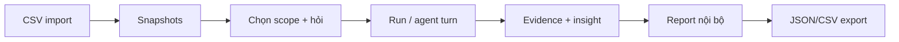

# Luồng người dùng

## Nhập dữ liệu → phân tích

**Implemented.** `owner`/`analyst` mở `/data/imports`, gửi CSV theo schema tồn kho, nhận manifest và snapshot. Từ `/chat` hoặc `/workspace`, họ chọn tổ chức, dự án/phân khu, ngày dữ liệu và gửi câu hỏi. API tạo message/job hoặc run; UI hiển thị trạng thái trong hội thoại, Runs và inspector. Người dùng xem artifact, evidence, decision brief, report và có thể xuất JSON/CSV.

## Xem và cập nhật báo cáo

**Implemented, có giới hạn.** `/reports` liệt kê report đã publish nội bộ. Người dùng có thể chọn report làm ngữ cảnh cho hội thoại; ý định tạo/cập nhật report được Agent Runtime chuyển thành run phân tích mới. Report mới có lineage/version trong database. Trong một run, Reviewer có tối đa một vòng yêu cầu sửa draft trước publication. Đây không phải trình soạn thảo report tự do.

## Lịch và quyền xem

**Implemented.** `/automations` quản lý report definition; trigger thủ công hoặc scheduler tạo run. `viewer` đọc workspace/report nhưng không nhập CSV, tạo analysis hay thay đổi lịch. Giao diện chặn tương ứng; API và repository vẫn là ranh giới phân quyền chính.

Lịch hàng ngày dùng timezone và ngày giờ do người dùng chọn. Scheduler tạo occurrence có khóa idempotency và run gắn với use case/skill tồn kho; job tiếp tục khi trình duyệt đóng. Trang lịch hiển thị skill và lần chạy gần nhất để người dùng kiểm tra kết quả. Telegram là một lối vào tùy chọn cho chat đã được ràng buộc với user/org/scope cụ thể; `/status` và `/latest` xem trạng thái/kết quả ngắn, `/report` yêu cầu báo cáo mới. Người dùng mở workspace để xem evidence và báo cáo đầy đủ.

Codebase: `src/frontend/features/workspace/workspace.tsx`, `src/frontend/features/agent-chat/hooks/use-agent-chat-controller.ts`, `src/frontend/features/imports/components/imports-panel.tsx`, `src/frontend/features/schedules/components/schedules-panel.tsx`. Xem [workflow phân tích](../workflows/analysis-workflow.md).
