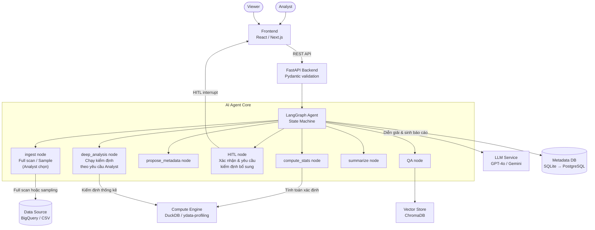
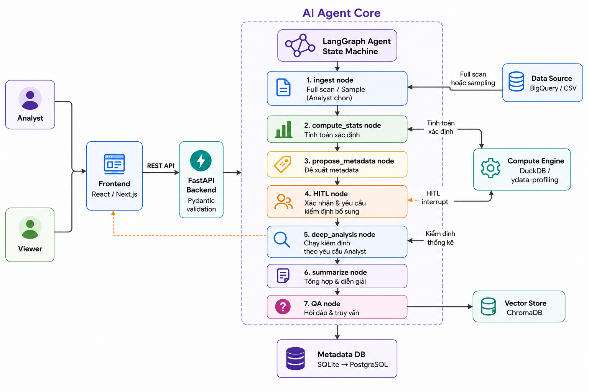
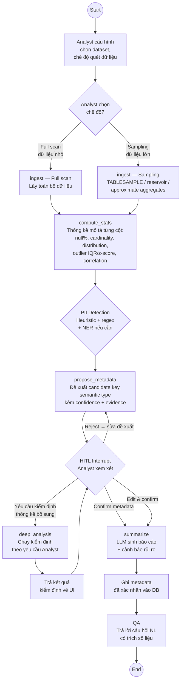
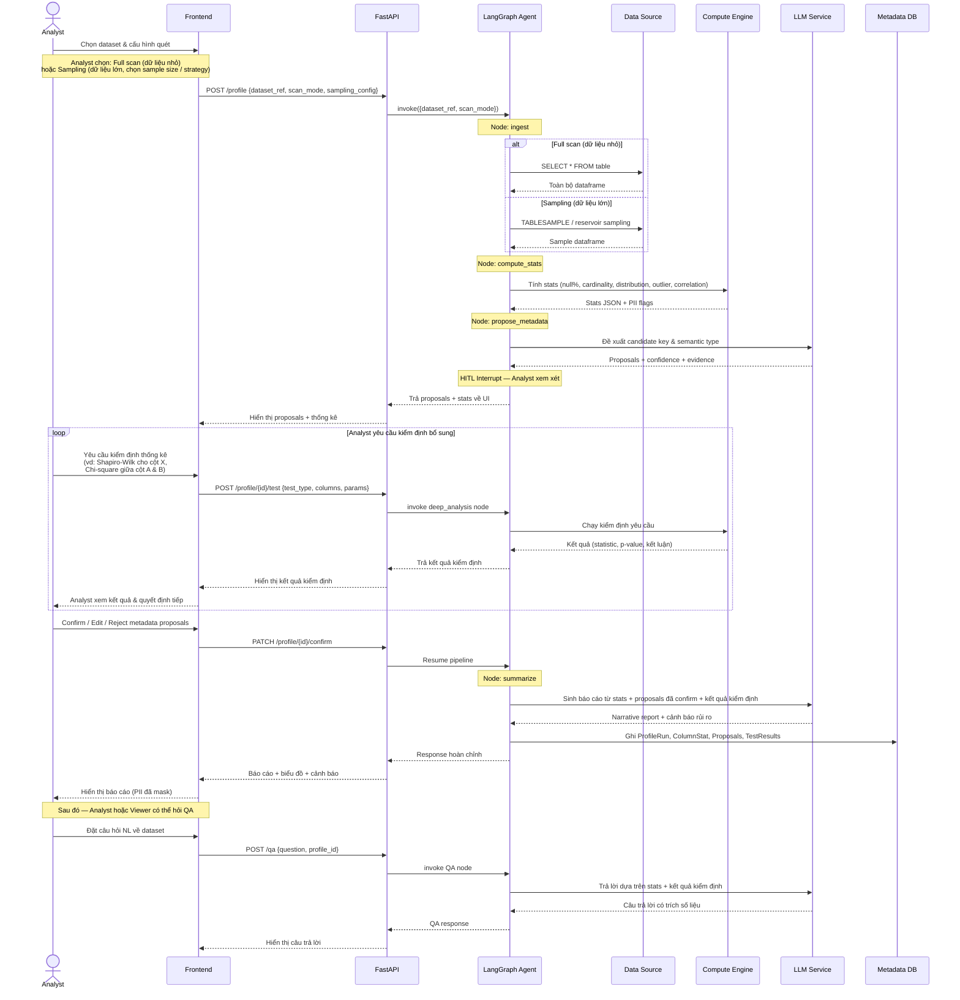
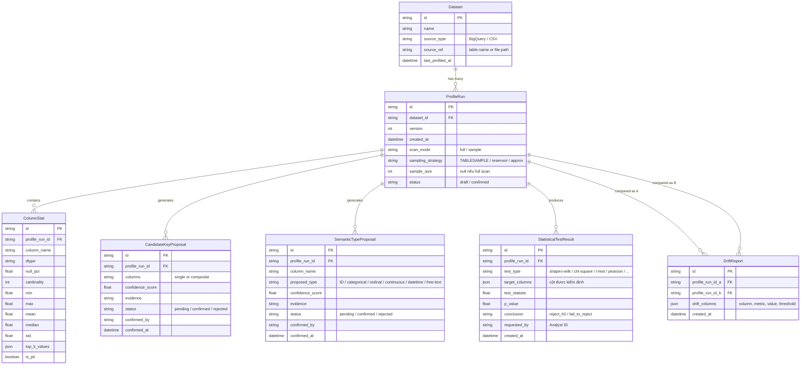
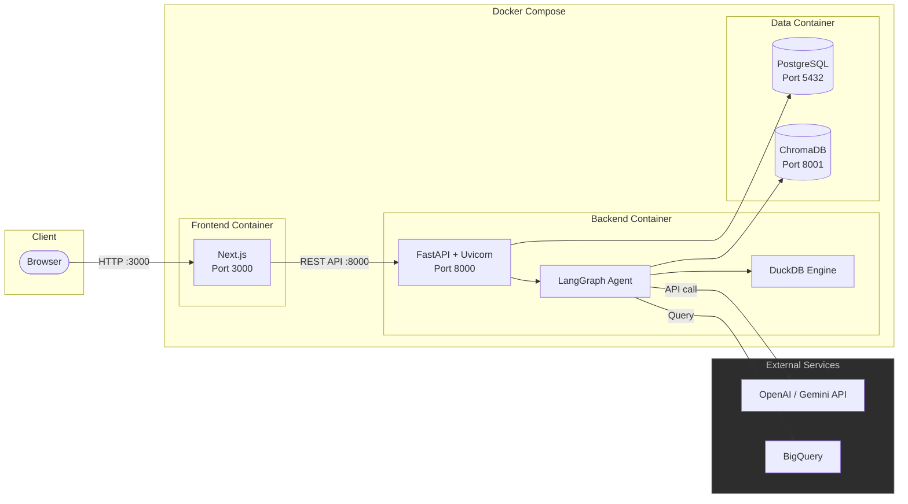

# Project Context: AI Agent Data Profiling & Tự sinh hồ sơ dữ liệu

> **Mã đề:** DATA-13 · **Khối:** Dữ liệu – Khối dữ liệu tập trung
> **Cập nhật lần cuối:** 28/07/2026 · **Trạng thái:** Draft — cần nhóm bổ sung mục "Câu hỏi mở"

## Tóm tắt
Xây dựng một AI Agent tự động profiling dataset: tính thống kê mô tả từng cột, phát hiện outlier/tương quan/candidate key, sinh báo cáo hồ sơ dữ liệu kèm nhận xét & cảnh báo rủi ro bằng ngôn ngữ tự nhiên, và trả lời câu hỏi (natural language) về dữ liệu. Hệ thống bắt buộc có con người xác nhận (HITL) trước khi ghi các suy luận quan trọng vào metadata, ẩn PII (Personally Identifiable Information) trong báo cáo, và sampling thông minh để tiết kiệm chi phí quét dữ liệu trên warehouse lớn.

## Mục lục
1. [Bối cảnh & bài toán](#1-bối-cảnh--bài-toán)
2. [Ràng buộc hệ thống](#2-ràng-buộc-hệ-thống)
3. [Vai trò người dùng](#3-vai-trò-người-dùng)
4. [Diagram](#4-diagram)
5. [Yêu cầu chức năng](#5-yêu-cầu-chức-năng)
6. [Thiết kế Agent (LangGraph)](#6-thiết-kế-agent-langgraph)
7. [Metadata schema (đề xuất)](#7-metadata-schema-đề-xuất)
8. [Đánh giá & tiêu chí thành công](#8-đánh-giá--tiêu-chí-thành-công)
9. [Rủi ro & thách thức](#9-rủi-ro--thách-thức)
10. [Câu hỏi mở](#10-câu-hỏi-mở)
11. [Glossary](#11-glossary)

---

## 1. Bối cảnh & bài toán

### 1.1 Thực trạng
Trước khi dùng một dataset mới, analyst phải tự chạy thống kê mô tả thủ công (SQL/pandas) để hiểu:
- Phân phối giá trị từng cột
- Tỉ lệ null
- Cardinality (số giá trị duy nhất)
- Đâu là cột có thể dùng làm primary key/foreign key

Cách làm thủ công này **tốn thời gian, không nhất quán giữa các analyst**, và **không scale** khi số lượng bảng trong warehouse tăng lên.

### 1.2 Mục tiêu
Xây dựng AI Agent tự động hoá toàn bộ quy trình trên:
1. Tính thống kê từng cột (dtype, null, phân phối, outlier, tương quan)
2. Đề xuất candidate key & kiểu dữ liệu ngữ nghĩa (semantic type)
3. Sinh báo cáo hồ sơ dữ liệu dễ đọc, kèm nhận xét & cảnh báo rủi ro chất lượng
4. Trả lời câu hỏi (natural language) về đặc điểm dữ liệu, có căn cứ trên số liệu đã tính (không hallucinate)

### 1.3 Giá trị mang lại
- Rút ngắn thời gian "làm quen" dataset mới từ hàng giờ xuống vài phút
- Chuẩn hoá quy trình profiling giữa các team
- Phát hiện sớm rủi ro chất lượng dữ liệu trước khi đưa vào pipeline/model production

--- 

## 2. Ràng buộc hệ thống

Đây là phần quyết định chất lượng thiết kế — bám sát khi build, không chỉ là "nice-to-have":

### 2.1 Human-in-the-loop (HITL)
Agent chỉ **đề xuất**, không tự ý ghi các suy luận mang tính quyết định nghiệp vụ (candidate key, semantic type, quan hệ khóa ngoại) vào metadata store.

- Mỗi đề xuất cần kèm **confidence score + evidence** (vd: `user_id`: unique 99.98%, non-null 100% → khả năng cao là PK) để Analyst ra quyết định nhanh
- Chỉ sau khi Analyst **confirm/edit/reject** thì hệ thống mới ghi vào metadata
- Về kỹ thuật: dùng cơ chế interrupt của LangGraph để dừng graph tại bước này, đợi input từ UI

### 2.2 Governance — bảo vệ PII
- Báo cáo **không hiển thị giá trị mẫu** của cột được nhận diện là PII (email, SĐT, CCCD, địa chỉ, tên riêng…)
- Cần bước PII detection riêng: kết hợp heuristic theo tên cột + regex theo pattern giá trị (và có thể thêm NER/LLM classification cho trường hợp mơ hồ)
- Cột bị gắn cờ PII vẫn hiển thị thống kê số lượng (null %, cardinality…) bình thường — chỉ **giá trị mẫu bị mask**

### 2.3 Độ chính xác thống kê & nhận định
- Mọi con số phải được **tính toán xác định (deterministic)** bằng compute engine (DuckDB/Supabase/ydata-profiling) — LLM **không tự tính hay đoán số**
- LLM chỉ đóng vai trò **diễn giải kết quả có sẵn** thành ngôn ngữ tự nhiên, hạn chế tối đa hallucination
- Mọi nhận định định tính (vd: "cột X khả năng là khóa chính", "phân phối lệch phải") phải trace ngược được về số liệu cụ thể

### 2.4 Hiệu năng & chi phí — sampling thông minh
- Với bảng lớn trên BigQuery: **không quét toàn bộ** để tính thống kê (BigQuery tính phí theo bytes scanned)
- Chiến lược đề xuất:
  - Dùng `TABLESAMPLE SYSTEM` hoặc reservoir sampling để lấy mẫu ngẫu nhiên
  - Cân nhắc approximate aggregate functions (`APPROX_COUNT_DISTINCT`, `APPROX_QUANTILES`, `APPROX_TOP_COUNT`) để ước lượng cardinality/phân phối mà không cần kéo hết dữ liệu về
  - Sampling nên **adaptive**: bắt đầu mẫu nhỏ, mở rộng nếu variance cao (vd: outlier detection không ổn định)
  - Nên expose trade-off "tốc độ/chi phí" vs "độ chính xác" cho user lựa chọn

---

## 3. Vai trò người dùng

| | Analyst | Viewer |
|---|---|---|
| Chọn dataset & chạy profiling | ✅ | ❌ |
| Xem báo cáo đã publish | ✅ | ✅ |
| Xác nhận HITL (candidate key, semantic type) | ✅ | ❌ |
| Đặt câu hỏi NL (QA) | ✅ | ✅ (read-only) |
| So sánh phiên bản / xem drift report *(nâng cao)* | ✅ | ✅ (xem, không tạo) |
| Xem giá trị PII gốc (chưa mask) | ❌ | ❌ |

*Có thể mở rộng "Admin" để quản lý user nếu cần, nhưng không bắt buộc trong MVP.*

---

## 4. Diagram

### 4.1 System Overview

<!--  -->

### 4.2 LangGraph Agent Flow

> **Ghi chú — Các kiểm định Analyst có thể yêu cầu tại bước HITL:**
>
> | Nhóm | Kiểm định | Mục đích |
> |---|---|---|
> | Phân phối | Shapiro-Wilk, Kolmogorov-Smirnov, Anderson-Darling | Kiểm tra cột numeric có tuân theo phân phối chuẩn không — ảnh hưởng cách chọn phương pháp phân tích tiếp theo |
> | So sánh nhóm | T-test, Mann-Whitney U, Kruskal-Wallis, ANOVA | So sánh phân phối giá trị giữa các nhóm (vd: cột revenue theo region) |
> | Tương quan | Pearson, Spearman, Cramér's V (categorical) | Đo mức độ liên hệ giữa các cặp cột — hỗ trợ phát hiện feature redundancy |
> | Độc lập | Chi-square test of independence | Kiểm tra 2 cột categorical có độc lập thống kê không |
> | Outlier nâng cao | Grubbs test, Dixon's Q test, DBSCAN | Xác nhận outlier nghi ngờ từ bước profiling ban đầu |
> | Stationarity | Augmented Dickey-Fuller (ADF) | Với cột time-series: kiểm tra tính dừng trước khi đưa vào mô hình |

### 4.3 Data Flow — Sequence Diagram

### 4.4 Metadata Schema — ER Diagram

### 4.5 Deployment Architecture

### 4.6 Component Details

| Component | Technology | Purpose |
|---|---|---|
| Frontend | React / Next.js | Giao diện cho Analyst: cấu hình profiling, xem báo cáo, HITL confirm, yêu cầu kiểm định, QA chat |
| Backend | FastAPI + Uvicorn | API server, xác thực request (Pydantic), điều phối agent |
| AI Agent | LangGraph | Orchestrate pipeline profiling qua state machine (7 nodes, bao gồm deep_analysis) |
| LLM | OpenAI GPT-4o / Gemini | Diễn giải stats → báo cáo NL, đề xuất metadata, trả lời QA |
| Compute Engine | DuckDB / ydata-profiling | Tính toán thống kê deterministic + chạy kiểm định theo yêu cầu Analyst |
| Metadata DB | SQLite (dev) → PostgreSQL (prod) | Lưu trữ Dataset, ProfileRun, ColumnStat, Proposals, StatisticalTestResult, DriftReport |
| Vector Store | ChromaDB | Lưu embedding lịch sử profiling cho QA retrieval (RAG) |
| Data Source | BigQuery / CSV upload | Nguồn dữ liệu đầu vào — hỗ trợ cả full scan và sampling |

---

## 5. Yêu cầu chức năng

### 5.1 Cơ bản (MVP)
- [ ] Web app deploy, phân quyền 2 role (Analyst / Viewer)
- [ ] Kết nối & chọn dataset (tối thiểu: upload CSV, kết nối BigQuery table)
- [ ] Pipeline agent profiling: sample → compute stats → summarize
- [ ] Báo cáo: thống kê từng cột + biểu đồ (distribution, missing value, correlation matrix)
- [ ] Nhận xét & cảnh báo rủi ro chất lượng dữ liệu bằng ngôn ngữ tự nhiên
- [ ] NL Q&A tự do về đặc điểm dataset
- [ ] Màn hình HITL xác nhận candidate key + semantic type trước khi ghi metadata
- [ ] Mask giá trị PII trong báo cáo

### 5.2 Nâng cao (Tạm thời bỏ qua, sau khi build xong MVP thì tính tiếp)
- [ ] **Multi-agent drift detection**: agent so sánh 2 phiên bản profile (PSI / KS-test cho numeric, Chi-square cho categorical) → báo cáo các cột thay đổi phân phối đáng kể
- [ ] **Eval suite**: đo precision/recall của candidate key detection & accuracy của semantic type inference trên bộ dữ liệu đã gán nhãn (ground truth)
- [ ] **Sampling tối ưu chi phí**: adaptive sampling, ước lượng bytes scanned trước khi chạy, cho phép user chọn ngân sách (budget)
- [ ] **Gợi ý bước làm sạch dữ liệu**: impute null, xử lý outlier, chuẩn hoá kiểu dữ liệu…

---

## 6. Thiết kế Agent (LangGraph)

| Node | Nhiệm vụ | Input → Output |
|---|---|---|
| `sample` | Kết nối nguồn, xác định kích thước bảng, chọn chiến lược sampling phù hợp | dataset reference → sample dataframe (DuckDB/pandas) |
| `compute_stats` | Chạy ydata-profiling / logic custom | sample dataframe → JSON: per-column stats, correlation, missing matrix, outlier (IQR/z-score), uniqueness ratio, PII flags |
| `propose_metadata` | Sinh đề xuất candidate key + semantic type kèm confidence/evidence | stats JSON → danh sách proposal |
| **HITL interrupt** | Dừng graph, chờ Analyst xác nhận qua UI | proposal → proposal đã confirm/edit |
| `summarize` | LLM sinh narrative report từ số liệu đã tính (không tự tính số) | stats JSON + proposal đã confirm → báo cáo NL + cảnh báo rủi ro |
| `QA` | Trả lời câu hỏi tự do, retrieve context liên quan (từ stats + Vector DB nếu có lịch sử) | câu hỏi NL → câu trả lời có trích số liệu cụ thể |

*(Lưu ý: pipeline 4 bước `sample → compute stats → summarize → QA`; ở đây bổ sung 2 bước `propose_metadata` và HITL interrupt ở giữa để đáp ứng ràng buộc HITL ở mục 2.1 — nhóm có thể gộp lại nếu muốn đơn giản hoá.)*

**Agent nâng cao — Drift Detection**: nhận 2 profile report (2 phiên bản), so khớp từng cột tương ứng bằng KS-test/PSI (numeric) hoặc Chi-square/so sánh tần suất (categorical), trả về danh sách cột "drift" vượt ngưỡng + diễn giải bằng LLM.

---

## 7. Metadata schema (đề xuất)

Thiết kế sơ bộ, phục vụ cả việc ghi nhận sau HITL confirm lẫn truy vấn lịch sử (cho drift detection):

- **Dataset**: id, tên, nguồn (BigQuery table / file), thời điểm profiling gần nhất
- **ProfileRun**: id, dataset_id, version/timestamp, sampling_strategy, sample_size, trạng thái (draft/confirmed)
- **ColumnStat**: profile_run_id, tên cột, dtype, null_pct, cardinality, min/max/mean/median/std, top_k_values, is_pii
- **CandidateKeyProposal**: profile_run_id, cột (hoặc tổ hợp cột), confidence_score, trạng thái (pending/confirmed/rejected), người xác nhận, thời điểm
- **SemanticTypeProposal**: tương tự CandidateKeyProposal, cho kiểu ngữ nghĩa (ID, categorical, ordinal, continuous, datetime, free-text…)
- **DriftReport**: profile_run_id_a, profile_run_id_b, danh sách cột drift + metric + threshold

---

## 8. Đánh giá & tiêu chí thành công

- **Chất lượng suy luận**: precision/recall của candidate key detection, accuracy của semantic type inference — đo trên dataset đã gán nhãn (có thể lấy từ Kaggle/UCI có sẵn schema, hoặc nhóm tự gán nhãn)
- **Chất lượng báo cáo**: nhận xét/cảnh báo đúng, có căn cứ số liệu, dễ hiểu với người không chuyên thống kê
- **Hiệu năng & chi phí**: thời gian chạy + bytes/chi phí quét trên BigQuery so với baseline "quét toàn bộ bảng"
- **Governance**: không để lọt giá trị PII nào ra báo cáo (test case cụ thể với dataset có PII biết trước)
- **UX của HITL**: luồng xác nhận nhanh, rõ ràng, không gây khó chịu cho Analyst

---

## 9. Rủi ro & thách thức

- **LLM hallucination** ở bước summarize/QA nếu không ràng buộc chặt input là số liệu đã tính sẵn → cần prompt engineering (Cần tham khảo thêm skill prompt engineering khác trên github) + validate lại số liệu trong câu trả lời so với ground truth
- **Sampling bias**: mẫu nhỏ có thể bỏ sót outlier hiếm hoặc đánh giá sai cardinality (đặc biệt cột high-cardinality) → nên kết hợp approximate functions của BigQuery thay vì chỉ random sample
- **PII detection không hoàn hảo**: heuristic + regex có thể miss PII "ẩn" trong free-text hoặc ID nội bộ nhạy cảm → nên cho user tự đánh dấu thêm cột PII như lớp bảo vệ bổ sung
- **Chi phí BigQuery**: cần theo dõi/giới hạn bytes scanned mỗi lần chạy, tránh quét nhầm bảng lớn
- **"Candidate key" mơ hồ về nghiệp vụ**: unique về thống kê không đồng nghĩa là khóa hợp lý về nghiệp vụ — đây chính là lý do bắt buộc có HITL, không nên cố tự động hoá hoàn toàn bước này

---

## 10. Một số vấn đề cần define

- [ ] Chọn LLM provider cụ thể (ảnh hưởng chi phí, tốc độ, khả năng structured output/function calling)
- [ ] Chọn Vector DB cụ thể
- [ ] Nguồn dữ liệu benchmark cho phần Eval (dataset đã gán nhãn candidate key/type)
- [ ] Ngưỡng cụ thể cho drift detection & cảnh báo rủi ro (bao nhiêu % null là "rủi ro cao"?)
- [ ] Phạm vi nguồn dữ liệu MVP: chỉ BigQuery hay cả upload CSV/Parquet?
- [ ] Nên xây dựng dự án phục vụ cho 1 domain chính hay nhiều domain chung.

---

## 11. Glossary

| Thuật ngữ | Giải thích |
|---|---|
| Data profiling | Phân tích dữ liệu để hiểu cấu trúc/nội dung/chất lượng — không phải transform hay làm sạch dữ liệu |
| Candidate key | Cột (hoặc tổ hợp cột) có khả năng là khóa chính (unique + non-null) |
| Cardinality | Số lượng giá trị duy nhất trong một cột |
| Drift | Sự thay đổi phân phối dữ liệu giữa 2 thời điểm/phiên bản |
| HITL | Human-in-the-loop — yêu cầu con người xác nhận trước khi hệ thống thực hiện hành động có tính quyết định |
| PII | Personally Identifiable Information — thông tin định danh cá nhân (email, SĐT, CCCD…) |
| PSI | Population Stability Index — chỉ số đo mức thay đổi phân phối giữa 2 tập dữ liệu, dùng trong drift detection |

---
