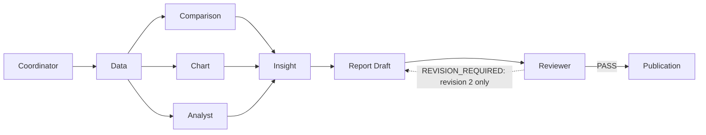

# Multi-agent workspace redesign specification

Status: proposed; implementation requires explicit approval. Audit date: 2026-09-25. Scope: the current working tree, including the in-progress feature-directory refactor and durable execution additions. This task changes documentation only.

Companion: [implementation plan](../plans/multi-agent-workspace-redesign-plan.md). Product authorities: [PRODUCT](../PRODUCT.md), [DESIGN](../DESIGN.md), and [technical context](../context.md). The requested `docs/context(4).md` is absent; `docs/context.md` is the available substitute. The [reference image](../ui-reference/multi-agent-workspace.png) was visually inspected. Current UI findings below come from source, CSS, contracts, and tests; no authenticated browser session, deployment flags, or runtime screenshots were verified in this audit.

## 1. Executive summary

VDaAgent already has most of the data and several of the presentation components required for this workspace. Persisted conversations, specialist stage messages, a branched workflow graph, safe runtime activity, durable invocation traces, canonical analytics, report rendering, evidence lineage, and private reviewer checkpoints exist. Their visibility, state ownership, and layout differ between the default Agent Chat and the optional Grok Workspace.

Build a conversation-centered workspace behind the existing `GROK_WORKSPACE_ENABLED` presentation flag. Use one contextual rail, one timeline with bounded inline results, one bottom composer, and one inspector. Retain AppShell, existing routes, organization selection, and auth; give global navigation a compact treatment only inside this workspace. Consolidate execution details and evidence into the inspector instead of stacking two inspectors.

The primary execution representation is the run's actual task DAG. A durable chat job and its five grouped personas are a separate trace, not a replacement DAG. Show verified stage outputs as outputs of typed stages, not invented dialogue between autonomous bots. Preserve `Data → Analysis → Evidence → Insight → Report`: canonical artifacts own every numeric fact.

## 2. Goals

- Make the selected conversation, selected run, pinned scope, execution state, and available evidence understandable without navigating a long document.
- Show parallel work honestly, including distinct Analyst and Insight stages and the Report Draft → Reviewer → Publication boundary.
- Make existing conversations discoverable inside Grok Workspace and keep conversation/run selection coherent after reload, route navigation, and a new accepted turn.
- Expose useful intermediate artifacts when authorized and validated; keep publication-dependent decision/report views behind their existing availability rules.
- Improve desktop use of space while keeping Vietnamese copy, readable charts, keyboard operation, and a usable narrow layout.
- Reuse existing feature APIs, hooks, reducer, renderers, tokens, and local mascot assets. No new dependency is necessary.

## 3. Non-goals

No backend redesign, autonomous agent framework, new execution logic, database/schema migration, semantic formula change, report schema change, auth/permission change, WebSocket infrastructure, public-page redesign, or pixel-perfect reference clone. No confidence scoring system, simulated activity, invented files/history, manual reviewer approval/revision controls, arbitrary failed-run retry, or generated PDF service. No change to flag defaults as part of the redesign.

## 4. Current-state findings

### 4.1 Audit evidence index

Paths refer to current feature owners, not the deleted pre-refactor `components/agent-chat` or `components/workspace.tsx` paths.

| ID | Inspected implementation | Relevance |
| --- | --- | --- |
| F1 | [workspace.tsx](../../src/frontend/src/features/workspace/workspace.tsx), [AppShell](../../src/frontend/src/components/shell/app-shell.tsx), [routes](../../src/frontend/src/components/shell/routes.ts), [route selection](../../src/frontend/src/features/workspace/routing/workspace-route.ts) | Auth/org boundary, route selection, global chrome, flagged surface selection |
| F2 | [GrokWorkspace](../../src/frontend/src/features/grok-workspace/components/grok-workspace.tsx), [GrokDashboardSurface](../../src/frontend/src/features/grok-workspace/components/grok-dashboard-surface.tsx), [dashboard loader](../../src/frontend/src/features/grok-workspace/hooks/use-grok-dashboard-data.ts) | Dashboard-before-chat composition, hidden conversation rail, contextual report loading |
| F3 | [AgentChat](../../src/frontend/src/features/agent-chat/agent-chat.tsx), [ConversationList](../../src/frontend/src/features/agent-chat/conversation-list.tsx), [Composer](../../src/frontend/src/features/agent-chat/composer.tsx), [MessageThread](../../src/frontend/src/features/agent-chat/message-thread.tsx) | Chat state, persona rail, persisted content, form-like composer |
| F4 | [RunProgress](../../src/frontend/src/features/agent-chat/run-progress.tsx), [WorkflowGraph](../../src/frontend/src/features/agent-chat/workflow-graph.tsx), [graph CSS](../../src/frontend/src/features/agent-chat/workflow-graph.module.css), [checkpoint status](../../src/frontend/src/features/agent-chat/workflow-checkpoint-status.tsx) | Existing DAG placement plus duplicated task track; private review summary |
| F5 | [chat run polling](../../src/frontend/src/features/agent-chat/hooks/use-chat-run-polling.ts), [execution polling](../../src/frontend/src/features/agent-chat/hooks/use-agent-execution.ts), [message loader](../../src/frontend/src/features/agent-chat/hooks/use-messages.ts), [selected-message loader](../../src/frontend/src/features/agent-chat/hooks/use-selected-messages.ts) | Refresh cadence, terminal behavior, cancellation guards and gaps |
| F6 | [workspace context](../../src/frontend/src/features/workspace/context.ts), [workspace action hook](../../src/frontend/src/features/grok-workspace/hooks/use-workspace-action.ts), [action hydration](../../src/frontend/src/features/grok-workspace/api/action-hydration.ts) | Identifier-only context, revision fencing, authorized action hydration |
| F7 | [context inspector](../../src/frontend/src/features/evidence/components/context-evidence-panel.tsx), [evidence components](../../src/frontend/src/features/evidence/components), [evidence loader](../../src/frontend/src/features/evidence/hooks/use-evidence-run.ts) | Context/Evidence/Files/Run tabs, source manifests, native evidence dialog, one-shot load |
| F8 | [AnalysisResult](../../src/frontend/src/features/analysis/components/analysis-result.tsx), [DecisionIntelligenceView](../../src/frontend/src/components/decision-intelligence.tsx), [ChartRenderer](../../src/frontend/src/components/visualization/chart-renderer.tsx) | Canonical result/brief fallback, tables, charts, nulls and evidence |
| F9 | [ReportDashboard](../../src/frontend/src/features/reports/dashboard/report-dashboard.tsx), [dashboard model](../../src/frontend/src/features/reports/dashboard/report-dashboard-model.ts), [report detail](../../src/frontend/src/features/reports/components/workspace-report-detail.tsx), [report hook](../../src/frontend/src/features/reports/hooks/use-workspace-report.ts) | Published content, controlled chart/priority selection, JSON/CSV and print |
| F10 | [tokens](../../src/frontend/src/styles/tokens.css), [globals](../../src/frontend/src/app/globals.css), [legacy component CSS](../../src/frontend/src/styles/legacy-components.css), [theme overrides](../../src/frontend/src/styles/theme-overrides.css) | Actual cascade, desktop width constraints, scrolling and breakpoints |
| B1 | [agent-v1 DAG](../../src/backend/packages/agents/src/analysis-v1/dag.ts), [branches](../../src/backend/packages/agents/src/analysis-v1/stages/branches.ts), [workflow](../../src/backend/packages/agents/src/analysis-v1/workflow.ts), [legacy executor](../../src/backend/packages/agents/src/legacy-workflow/workflow.ts) | Parallel branches, bounded revision and versioned execution |
| B2 | [run contracts](../../src/backend/packages/contracts/src/analysis/run.ts), [workflow packs](../../src/backend/packages/contracts/src/agents/workflow-packs.ts), [message contracts](../../src/backend/packages/contracts/src/chat/message.ts), [conversation contracts](../../src/backend/packages/contracts/src/chat/conversation.ts) | Available fields, persisted identities, status and lineage |
| B3 | [runtime activity](../../src/backend/packages/contracts/src/runtime/activity.ts), [durable execution contracts](../../src/backend/packages/contracts/src/runtime/execution.ts), [turn dispatch](../../src/frontend/src/server/api/streaming/agent-turn.ts), [conversation routes](../../src/frontend/src/server/api/routes/conversations.ts) | Three distinct activity/turn channels, flag precedence, durable GET/cancel endpoints |
| B4 | [workflow status query](../../src/frontend/src/server/api/queries/workflow-status.ts), [artifact repository](../../src/backend/packages/db/src/repositories/artifact-repository.ts), [checkpoint repository](../../src/backend/packages/db/src/workflow/checkpoint-repository.ts) | Private checkpoints, publication-gated decision responses, validated stage-message references |
| B5 | [report export query](../../src/frontend/src/server/api/queries/report-export.ts), [report repository](../../src/backend/packages/db/src/repositories/report-repository.ts), [publication transaction](../../src/backend/packages/db/src/transactions/publish-reviewed-draft.ts) | Read-entitled export, signed downloads, exact reviewer PASS gate |
| B6 | [config](../../src/backend/packages/config/src/index.ts), [.env.example](../../.env.example), [repository facade](../../src/backend/packages/db/src/repository.ts), [worker main](../../src/backend/worker/src/main.ts) | Flag defaults, durable run version override and existing-queue draining |

### 4.2 Execution models that must remain distinct

| Name | Actual responsibility | UI interpretation |
| --- | --- | --- |
| `legacy-v1` | Persisted run workflow: Orchestrator → Data → Calculation → Comparison → Chart → Insight → Validation → Report | Render its own task dependencies; do not manufacture agent-v1 Reviewer/Publication nodes |
| `agent-v1` | Coordinator → Data → parallel Comparison/Chart/Analyst → Insight → Report Draft → Reviewer → Publication | Nine typed stages; parallel topology and bounded draft revision must remain visible |
| Legacy Agent Chat | Default conversational router: one validated decision and at most one supported operation | A turn can create or inspect a run; its assistant response is not the entire workflow |
| Agent Runtime | `GROK_RUNTIME_ENABLED`; bounded capability planning and canonical ID-based response composition | Safe activity and grounded response, separate from the run executor; not autonomous bot conversation |
| Grok Workspace | `GROK_WORKSPACE_ENABLED`; optional frontend composition | Does not select provider, workflow version, or streaming by itself; visible brand remains VDaAgent |
| Durable agent execution | `DURABLE_AGENT_EXECUTION_ENABLED`; eligible inventory turns are queued as jobs with persisted invocations/events | Root plus Data/Compare/Insight/Report persona projection; eligible turns create pinned `agent-v1` runs independently of the ordinary run default |

All five flags (`AGENT_WORKFLOW_ENABLED`, `GROK_WORKSPACE_ENABLED`, `GROK_RUNTIME_ENABLED`, `GROK_SSE_ENABLED`, `DURABLE_AGENT_EXECUTION_ENABLED`) default false in the example/config. Actual local/deployed values are unverified. Durable admission is deliberately bounded; targeted/signal/drilldown and unsupported requests fall through to the configured legacy/runtime handler. Eligible durable requests reject SSE with 404, causing the existing JSON fallback. The setup response exposes the three Grok flags, not a durable flag; consume the accepted `agent_turn_job_id` and actual job data rather than inventing client-side eligibility.

The durable contract groups `insight = analyst + insight` and `report = chart + report + reviewer + publication`. A Report persona may therefore be active during the Chart branch. It must not make the Report Draft task look active. Keep Analyst and Insight separate in the primary stage rail; show the grouped persona trace only in execution details.

### 4.3 Supported findings and practical limits

1. The default AgentChat already uses a three-column grid, with conversations/personas and an execution inspector. GrokWorkspace disables its conversation list and surrounds it with another context inspector. Adding another generic sidebar would duplicate existing responsibilities. [F2, F3]
2. GrokDashboardSurface is above the conversation and depends on a published report even for selected chart/insight modes. It is not a general intermediate-result host. [F2]
3. AgentChat renders RunProgress, ActivityTimeline, checkpoints, messages, a separate completed AnalysisResult, and the composer as stacked sections. RunProgress renders both WorkflowGraph and a task track. A result's `data-agent-message-id` is association metadata, not actual inline placement. [F3, F4]
4. CSS uses a 264px global sidebar, 38px main side padding, a 1560px `max-width` plus a later 1680px width declaration, capped message widths, and large section spacing. The effective max-width still constrains the canvas. There is a 160px thread minimum and a padded empty state. These support a density/layout concern, not a measured claim about a particular screenshot's wasted pixels. [F10]
5. Composer repeats a title, explanation, scope/date/target fields, textarea, snapshot footer, and five suggestions. In legacy run detail, a full analysis form is also at the top. Form dominance is supported in those states; it is not evidence that analytics components are absent. [F3, F8]
6. WorkflowGraph already places three branches in a shared column, but infers the version from a coordinator task, uses a wide seven-column grid, and lacks explicit visible edge connectors and per-node state text. The second task track flattens the stages. [F4]
7. In controlled Grok mode, effects that recover a run from persisted messages or a durable job return early. Selecting/reopening a conversation can therefore leave the selected run unset until another explicit action. `initialConversationId` exists, but local conversation selection does not update the URL. GrokWorkspace also does not forward `externalRunId` to AgentChat, so its controlled active-run prop does not preserve the existing unresolved-external-run read-only guard by itself. [F1–F3]
8. `useAgentExecution` polls active jobs but stops on null/terminal data; a new turn in the same conversation does not itself restart that effect. Errors are swallowed into retry timers. A latest-job snapshot must never be attached to a different historical run. [F5]
9. Run polling refreshes messages at terminal states rather than continuously during an ordinary active run. `useEvidenceRun` and the dashboard loader fetch on selection changes, not run transitions. A failed run poll stops without rescheduling. These are concrete refresh gaps for a live workspace. [F2, F5, F7]
10. The general message loader lacks the obsolete-response protection present in `useSelectedMessages`; appending older pages and polling can overwrite each other without an explicit merge policy. [F5]
11. Context tabs and EvidenceDrawer already expose real sources, validation and lineage. The tab list is keyboard-aware but all tab buttons remain tabbable; compact Grok context uses a custom role-dialog/focus trap, while global mobile navigation and EvidenceDrawer use native dialogs. [F1, F7]
12. The reference's confidence bars, fixed seven-agent total, transaction/revenue claims, PDF filename/page count, edit notes, and human Approve/Revise buttons are unsupported as shown. Existing report exports are JSON/CSV and browser print. [B2–B5]

The context document is useful but partly stale: it contains an earlier statement that tabs are not URL pages, omits durable execution in several sections, and references handoff files now deleted in the working tree. Existing E2E selectors also include older English labels and root-page assumptions. This audit does not claim those tests pass or fail; Phase 0 records the baseline.

## 5. Reference-image analysis

The image has a dark left rail, a dense central transcript, and a right context column. The main header spans the conversation/context region. Specialized identities, grouped metrics, three chart previews, a report row, and a bottom composer provide strong scanning cues. The same screenshot simultaneously shows a running header and an apparently reviewed report; VDaAgent must resolve such states from actual persisted records.

Classification allows more than one label: concept suitability and implementation status are separate questions.

| Area | Observed idea | Classification | VDaAgent decision |
| --- | --- | --- | --- |
| A. Global layout | Left navigation, central work, right context | ADAPT TO VDAGENT; PARTIALLY EXISTS; REQUIRES FRONTEND WORK | One compact global navigation plus a subordinate workspace rail, not two full navigation columns |
| B. Agent rail | Distinct named specialists and responsibilities | ADAPT TO VDAGENT; PARTIALLY EXISTS | Real task kinds and identities; no online/autonomous-agent claims |
| C. Conversation navigation | New action, selected row, dated history | REUSE DIRECTLY AS UX CONCEPT; ALREADY EXISTS; REQUIRES FRONTEND WORK | Expose existing paged conversations in flagged workspace; no sample history |
| D. Main timeline | User request, response, results in one reading path | REUSE DIRECTLY AS UX CONCEPT; PARTIALLY EXISTS | Group actual messages and artifact outputs by run; label derived status explicitly |
| E. Identity hierarchy | Main coordinator then specialists | ADAPT TO VDAGENT; ALREADY EXISTS | Reuse `agent-identity.ts`; distinguish assistant from deterministic Coordinator and durable root |
| F. Workflow | Compact connected sequence | ADAPT TO VDAGENT; SHOULD NOT BE IMPLEMENTED as pictured | Preserve the true branch and review loop; no Compare → Insight → Chart sequence |
| G. Inline metrics | Compact labeled figures with context | REUSE DIRECTLY AS UX CONCEPT; PARTIALLY EXISTS | Canonical inventory/quality/period metrics with null reasons, currency and evidence |
| H. Inline charts | Preview grid under the producing stage | REUSE DIRECTLY AS UX CONCEPT; ALREADY EXISTS; REQUIRES FRONTEND WORK | Reuse ChartRenderer; readable plots rather than screenshot-sized decoration |
| I. Report artifact | Clear document row with open/export | ADAPT TO VDAGENT; PARTIALLY EXISTS | Published report record and JSON/CSV; PDF service REQUIRES BACKEND SUPPORT and is excluded |
| J. Context inspector | Persistent facts about the selected work | REUSE DIRECTLY AS UX CONCEPT; ALREADY EXISTS | Consolidate run and execution inspectors with evidence |
| K. Evidence | Source list and linked findings | ADAPT TO VDAGENT; ALREADY EXISTS | Real source_refs/input_refs/evidence paths/validation, not confidence percentages |
| L. Run state | Header state and contextual timing | ADAPT TO VDAGENT; PARTIALLY EXISTS | Independent turn and run status; real timestamps only; omit unsupported precise stage duration |
| M. Composer | Bottom input and supported shortcuts | REUSE DIRECTLY AS UX CONCEPT; PARTIALLY EXISTS | Compact persistent input; remove attachment and human approval/revision affordances |
| N. Density | Multiple levels of information visible together | ADAPT TO VDAGENT; REQUIRES FRONTEND WORK | Dividers and progressive disclosure; larger readable text than the tiny reference labels |
| O. Empty/active | Screenshot only demonstrates active content | REQUIRES FRONTEND WORK | Specify an honest no-run first-use state rather than seed fake activity |
| P. Scroll | Stable header/composer suggested by framing | ADAPT TO VDAGENT; REQUIRES FRONTEND WORK | Independent bounded regions; actual scroll behavior cannot be proven from a static image |
| Q. Responsive | Wide desktop composition only | REQUIRES FRONTEND WORK | Inspector/rail drawers and compact vertical DAG; image is not evidence of mobile behavior |

Search across all persisted history, file upload from chat, editable notes/settings, arbitrary confidence, and autonomous-agent administration have no matching product contract here. Omit them; do not add decorative enabled controls.

## 6. Current versus target gap analysis

| Area | Current VDaAgent | Reference idea | Gap | Recommended change | Existing data/component |
| --- | --- | --- | --- | --- | --- |
| Page composition | Dashboard above chat; multiple section headings | One focused workspace | Work and context split across stacked blocks | Single header/rail/timeline/inspector shell | F1–F3 |
| Whitespace | Main max-width/padding, capped message cards | Broad analytical canvas | Wide screen not allocated to a coherent work area | Route-scoped full width; bounded text width within wider result rows | F10 |
| Sidebar | Full global sidebar plus default inner rail | One dominant rail | Risk of competing navigation | Compact AppShell variant in flagged workspace | AppShell/routes |
| Conversations | Paged list exists, hidden in Grok | Persistent history | No in-place discovery in flagged layout | Reuse paged list in WorkspaceRail | ConversationList/useConversations |
| Agents/stages | Five durable personas, eight sender identities, task graph | Visible specialists | Different models look interchangeable | Primary actual-stage list; separate optional persona trace | B1–B3 |
| Workspace header | Route title and capability title | Conversation title/status | Repeated chrome, missing central run relationship | Conversation title, run selector, pinned context, status | Conversation/RunDetail |
| Scope selector | Full controls in composer | Compact dataset selector | Takes substantial vertical space | Scope summary with accessible edit disclosure | ScopeFields/catalog |
| Message timeline | Text/references; result outside thread | Embedded outputs | Weak association between request and result | Run groups with messages and typed output attachments | Message.parts/AnalysisResult |
| Run progress | Graph plus task track and checkpoints | Compact progress | Duplicate rendering; state labels/topology incomplete | One expandable DAG summary | RunProgress/WorkflowGraph |
| Inline metrics | Result/dashboard views | Dense metric row | No focused stage preview | Canonical MetricSummary with evidence links | data_analysis_pack/decision brief |
| Comparisons | Peer table and dashboard change summaries | Current/baseline/delta cards | Period data not clearly attached to branch | ComparisonSummary using existing delta fields | comparison_pack/calculation |
| Charts | Existing renderer; published dashboard gating | Charts inside transcript | Intermediate chart visibility and selection | Stage preview plus inspect/detail selection | chart_pack/visual_evidence/ChartRenderer |
| Insight | Claims and decision cards exist | Short evidence-backed list | Not integrated with stage event | Reuse claim rendering, show exact limitations | insight_pack/analysis_pack |
| Reports | Published dashboard/detail and exports | Document announcement | No compact consistent lifecycle row | Metadata checkpoint then real published artifact row | workflow-status/report_ref/reports |
| Reviewer | Compact owner/analyst checkpoint | Reviewer badge | Easily confused with human approval | Literal PASS/REVISION_REQUIRED; separate publication state | WorkflowCheckpointStatus |
| Evidence | Drawer and tab metadata | Persistent right context | Selection and freshness fragmented | One inspector with path selection and native detail expansion | EvidenceDrawer/context reducer |
| Artifacts | Reference buttons/raw lists | Current artifact | No dedicated coherent catalog | Authorized artifact index, selected item, exact provenance | ArtifactListSchema |
| Context inspector | Context/Evidence/Files/Run plus execution inspector | One contextual column | Duplication and independent fetches | Context/Evidence/Artifacts/Details sharing selected run | ContextEvidencePanel/AgentExecutionInspector |
| Composer | Large titled scope form | Slim persistent input | Oversized, despite sticky positioning | Scope disclosure, 2–6 line input, compact actions | Composer/useAgentTurn |
| Quick actions | Five supported prompts, signal actions | Action toolbar | Risk of copying unsupported actions | Prompt-prefill only; validated actions remain explicit | suggestions/WorkspaceActionV1 |
| Loading | Panel loading and message placeholders | Immediate state | Different loaders can show inconsistent selections | Stable shell, scoped loading, retain last good data on refresh | Existing hook statuses |
| Empty | Plain prompt plus full composer | Active reference only | Empty design undefined by reference | Compact navigator welcome, scope prerequisite, no fake stages | MascotAvatar/EmptyState |
| Running | Active run polling; messages refresh at terminal | Frequent stage updates | Artifacts/messages/inspector can lag | Shared run resource and transition-driven refresh | F5/F7 |
| Completed | Full result and report dashboard | Unified completed work | Results may duplicate or require manual hydration | One attached result summary, explicit detail/report access | F8/F9 |
| Failed | Error banner + persisted error parts | Clear recovery | Transport/run errors conflated | Separate stale transport state from failed execution | run.error_code/MessagePart.error |
| Viewer/read-only | Composer disabled; private checkpoints excluded | No role example | New controls could accidentally broaden writes | View existing results; no send/cancel; preserve read-entitled export | run-view.ts/B4/B5 |
| Responsive | Global dialog, 720px stack, 1200px context overlay | Wide screenshot only | Dense graph overflow and custom nested dialogs | Adaptive bounded shell, native drawers, one overlay at a time | F1/F4/F7/F10 |

## 7. Target information architecture

### Navigation decision: Option B

Use a specialized presentation of the existing AppShell inside flagged AI Assistant and its reused run-detail surface. Global routes remain available in a compact 86px indigo strip with accessible names and a labeled organization/account disclosure. The adjacent 224–248px warm-surface WorkspaceRail contains conversations and the selected run's stages. It has no second product logo, organization selector, account menu, or duplicate global links.

Option A with the unchanged 264px global sidebar plus a full nested rail spends too much of a 1280–1440px screen on navigation. Option B retains the application architecture and route semantics while establishing a clear hierarchy: global destinations are secondary; conversation navigation is the active work navigation. Other screens keep their current AppShell treatment. On narrow screens, existing global navigation remains a native modal; context navigation gets its own labeled trigger, with only one dialog open at once.

```text
AppShell (existing auth, org and routes; contextual presentation variant)
├─ Global navigation: compact in this surface
└─ Workspace: viewport-bounded
   ├─ Existing topbar + compact provisional notice
   └─ Workspace body
      ├─ WorkspaceRail: conversations + actual run stages
      ├─ Conversation panel
      │  ├─ WorkspaceHeader: conversation / selected run / pinned scope
      │  ├─ Workflow summary; expanded DAG is in timeline flow
      │  ├─ ActivityTimeline: messages, run groups, inline outputs
      │  └─ Composer: next-turn scope + input
      └─ WorkspaceInspector: Context / Evidence / Artifacts / Details
```

State ownership: organization/auth and route selection stay in Workspace; identifier-only analytical selection stays in `workspaceContextReducer`; chat controller owns conversation/messages/turn identity; a shared selected-run resource owns run/tasks/checkpoints/artifacts/decision/report hydration. Rail, header, timeline and inspector consume the same scoped resource. Pane open state, selected tab/stage, and draft text are local presentation state, not wire-context fields.

## 8. Desktop layout, header and viewport behavior

### 8.1 Geometry

Use multi-column layout at viewport width >=1280px **and** sufficient workspace content width. Target columns: global navigation 86px; contextual rail 232px; inspector 320px; timeline absorbs remaining width. With 16px outer padding and 12px region gaps, a 1440px viewport leaves roughly 740px for conversation. Allow rail 224–248px and inspector 304–352px, but do not shrink the timeline below 560px to keep side panes visible. The inspector collapses first. Use CSS grid/container sizing, not JavaScript screen-width arithmetic for every child.

At >=1600px, let analytics use the expanded central width. Prose stays approximately 65–80 characters per line; artifact/metric/chart rows can fill the timeline. A full result should not be trapped inside the old 720px chat bubble limit. Use 16px region padding, 12–16px item gaps, and dividers; avoid a card around a card around a chart.

### 8.2 WorkspaceHeader

Primary row: persisted conversation title (two-line maximum) and labeled run state. Fallback titles: “Hội thoại mới” for an unsent draft, “Chọn hội thoại” for an unselected viewer, or “Chi tiết lượt chạy” for direct run access. Do not generate a title locally from imagined output. Show selected-run switcher only when actual messages link multiple runs; only loaded/known runs are listed, with access to older messages for more history.

Secondary row: organization, project/zone names resolved from catalog where possible, requested `data_as_of`, effective snapshot date only when an actual artifact/brief provides it. Label requested and effective dates separately. `catalog.latest_snapshot_date` means latest catalog snapshot, not the selected run's pinned input. Workflow version is compact metadata; full IDs and technical details belong in Details.

Controls: contextual navigation toggle where collapsed, inspector toggle, run selection, and writer-only cancellation for an active run. Keep title and current state visible during scrolling. Scope editing affects the next request, never the selected run; expose it beside the composer with a compact header link to that control. Condense repeated page/capability headings into this header. Keep the provisional-assumption notice accessible in a compact disclosure; exact run semantic version comes from its data rather than a decorative global label.

### 8.3 Scroll contract

- The contextual AppShell variant occupies `100dvh` with a `100vh` fallback. Layout rows allocate the topbar and notice using intrinsic height; the workspace occupies the remaining `minmax(0, 1fr)` space. Do not subtract a guessed stack of pixel heights.
- Apply `min-height: 0` and `min-width: 0` throughout the grid/flex chain. Desktop body/main shell does not become a second vertical transcript scroller. This rule is scoped to the flagged workspace.
- Rail has one vertical scroll container containing stages and conversations; its title/new control may stick at its own top. Do not put the stage list and conversation list into separate nested vertical scroll boxes.
- Timeline alone scrolls the conversation. Header, compact progress summary and composer are non-scrolling sibling rows. Expanded graph and full inline content live in timeline flow, not a tall permanent header.
- Inspector has fixed tab controls and one independently scrolling tab body. Long tables may scroll horizontally inside a result; no second short vertical scroll area inside every message.
- Composer remains in the bottom layout row, visually sticky without overlaying the last message. Use bottom safe-area padding. Textarea can scroll after its six-line cap.
- Auto-follow only when the reader is within 80px of the bottom or has just submitted their own turn. Otherwise preserve position and show “Có cập nhật mới”; clicking it scrolls to the latest item. Loading earlier messages preserves the first visible message and its pixel offset.
- Deduplication/upsert must not move an old stage message to the bottom merely because `updated_at` changed. Changing conversation restores an in-memory scroll anchor or opens its latest content; loading a referenced run/stage scrolls to that explicit target.
- At short heights (<600px) or severe zoom, automatically compact progress and scope controls and collapse side panes. If the on-screen keyboard leaves insufficient timeline space, use a single document-scrolling mobile fallback with an in-flow composer; do not leave both document and transcript as active vertical scroll owners.
- Print is not the viewport workspace: use the existing published report view and print styles, expand report overflow, and hide navigation/composer/overlays.

## 9. Responsive layout

| Width | Navigation/rail | Main | Inspector |
| --- | --- | --- | --- |
| >=1280px with room | Compact global strip + 224–248px rail | Flexible timeline, fixed header/composer rows | 304–352px docked, initially open; closing reclaims its grid column |
| 1025–1279px | Compact global strip; 224px rail if timeline stays >=560px, otherwise drawer | Main remains primary; scope collapsed | Native dialog drawer, initially closed |
| 721–1024px | Reuse existing 86px global compact pattern; contextual rail drawer | Single work column, two-column metrics only if readable | Native dialog drawer; no simultaneous context/nav dialog |
| <=720px | Existing global modal; separate “Hội thoại và quy trình” trigger | Single conversation column; compact header; vertical DAG group | Full-height native sheet/dialog; artifact details replace its body |

At mobile widths, scope summary wraps and opens labeled fields. Composer starts at two lines; quick actions are in a disclosure, not a long horizontal chip carousel. Charts use one column. Metric rows use two columns only when labels/values fit; otherwise one. Tables keep their semantic headers inside a labeled horizontal scrolling region. IDs/hashes wrap with `overflow-wrap:anywhere`; full values remain selectable. Native dialogs close with Escape, restore focus, and contain 44px close targets. Breakpoints use existing 720/1024 conventions plus the explicit 1280 workspace threshold; audit the older 1200/960 rules so they cannot silently override this mode.

## 10. Agent/stage representation

The rail heading is “Các bước phân tích”, with a short explanation that these are specialized processing stages. It is not an agent marketplace or chat recipient list. Selecting a stage inspects it; it does not send a prompt, start an agent, or change `agent_target`.

| Stage key / label | Responsibility/output | Primary state source |
| --- | --- | --- |
| `coordinator` / Điều phối | Validated request and CoordinatorDecision | Matching RunTask |
| `data` / Dữ liệu | Pinned read, deterministic metrics, DataAnalysisPack | Matching RunTask |
| `comparison` / So sánh | ComparisonPack | Matching RunTask; sibling after Data |
| `chart` / Biểu đồ | ChartPack/visual_evidence | Matching RunTask; sibling after Data |
| `analyst` / Phân tích | AnalysisPack findings | Matching RunTask; sibling after Data |
| `insight` / Nhận định | InsightPack, deterministic decision pack production | Matching RunTask; joins all three branches |
| `report` / Bản nháp báo cáo | Immutable revision 1 or 2 | Matching RunTask; private checkpoint metadata when authorized |
| `reviewer` / Rà soát | PASS or REVISION_REQUIRED for the exact draft | Task for execution; workflow-status for verdict |
| `publication` / Phát hành | Fenced canonical report publication | Matching RunTask + published report linkage; not an AgentKey/avatar |

Reuse identity icons and Vietnamese labels from `components/agents/agent-identity.ts` for supported AgentKeys. Legacy Orchestrator/Calculation/Validation and Publication use neutral workflow icons and task labels. The generic assistant with no `sender_agent` remains “VDaAgent”; do not relabel it as a persisted Coordinator.

State rules:

- `pending`: “Đang chờ”; describe unmet dependencies when available. If all dependencies have succeeded, secondary text may say “Chờ xử lý”, still a derived explanation of pending, not a backend `ready` state.
- `running`: “Đang xử lý”; show all running branch nodes. Never force one current stage.
- `succeeded`: “Hoàn tất”; output availability/validation is a separate fact.
- `failed`: “Thất bại”; safe task error code plus next-step guidance.
- `cancelled`: “Đã hủy”; distinct stop icon, no spinner.
- No run/task data: “Chưa có lượt chạy” or “Chưa có dữ liệu bước”. An informational stage catalog may appear in first-use disclosure, but no live dots/checkmarks/progress percentage.
- A terminal run does not rewrite each remaining task as failed/cancelled. Preserve actual statuses and annotate pending downstream tasks as not completed because the run ended.
- Missing historical `workflow_version` follows the repository compatibility convention `legacy-v1` once run data is loaded. While loading, version is unknown; do not guess from flags or invent tasks. For unexpected future task kinds/dependencies, render a generic labeled list rather than a false fixed diagram.

Durable trace: Details may show job/invocation statuses `queued`, `running`, `waiting`, `completed`, `failed`, `cancelled`, preserving their vocabulary. “Waiting for analysis” is not a failed task. Only connect a trace when its job/run/message IDs match the selected context. An older run with no trace gets “Không có nhật ký thực thi cho lượt này”, not fabricated personas.

## 11. Conversation and activity timeline specification

### 11.1 Persisted navigation

Use `listConversations` and its cursor. Each row shows exact title, `kind` when scheduled, real `updated_at`, and labeled latest **message** state. `latest_status` is not the run's status; a completed stage message can coexist with a running run. Use distinct wording or omit that summary when it could mislead. Selected row uses `aria-current`, border/weight, and background rather than color alone.

`/chat/:conversationId?org_id=...` selects that conversation even if absent from the first page; retrieve its authorized metadata with `getConversation`. `/chat` is the unsent/new workspace entry in the proposed flagged design, without silently opening the first historical conversation. Selecting a persisted conversation pushes its existing route. First accepted turn replaces the unsent route with the returned conversation route. “Hội thoại mới” is a local draft reset until submit; it creates no empty backend record. Hide that action for viewers in favor of browsing persisted work.

Conversation change clears prior run descendants, selected stage/artifact, transient activity, retry ownership, and pending hydration. Preserve unsent drafts per conversation in memory, including a separate new-draft key; never carry a failed request identity into another conversation/org. Do not persist drafts or analytics in local storage as part of this scope. Route-selected runs retain precedence over the latest conversation run; browser Back/Forward must be respected.

### 11.2 Item taxonomy

| Item | Origin and rendering | Identity/time |
| --- | --- | --- |
| User message | `Message.role=user`; escaped exact `content` | “Bạn”; persisted `created_at` |
| Assistant message | Persisted assistant content and typed parts, rendered once; do not duplicate text part and content | Actual `sender_agent` or VDaAgent; persisted time |
| Specialist checkpoint message | Persisted stage message with completed status and validated public artifact references | Actual sender; subtitle “Cập nhật bước đã lưu”, not free-form agent banter |
| Live turn activity | Allowlisted AgentActivityEventV1 labels in a compact strip inside the relevant turn | “Hoạt động xử lý”; sequence only, no fabricated timestamp; ephemeral across reload |
| Run/stage status | Derived from current RunDetail/workflow-status | “Trạng thái quy trình”; no quotation bubble, first-person prose, or invented message ID |
| Artifact output | Typed, authorized artifact attached to its referring stage/message or clearly labeled run output group | Artifact kind, originating run/stage, real created_at and evidence action |
| Durable trace event | Persisted AgentExecutionEvent | Mainly Details; actual created_at and sequence, not model reasoning |
| Failure | Persisted message error/run/task error or distinct transport alert | Show which layer failed; generic safe fallback for unknown error codes |
| Published report | Persisted report_ref/ReportRecord, hydrated and matched to run | “Báo cáo đã phát hành”; never infer a public report from draft availability |

### 11.3 Grouping, ordering and density

Keep the server's chronological message order, merging pages by `message_id`; update existing items in place. Stage messages have stable IDs and can be upserted, so they are not an append-only revision audit. Group linked activity under run separators carrying pinned scope/date. A turn that retrieves an older run retains its actual conversation position and links to that run; never transplant another conversation's transcript.

Attach a public artifact preview to a matching `artifact_ref` or to a derived “Kết quả lượt chạy” section when no message carries it. Do not create a synthetic specialist message to host it. Deduplicate full previews by `(org_id, run_id, artifact_id)`; later references remain links. Deduplicate the same chart across ChartPack/visual_evidence by run/chart ID and its referenced source; never double-count it.

Initially expand the active run summary, newest useful stage output, and published-result summary; collapse older run details, large tables, raw payloads, and redundant checkpoints. Keep user messages and final assistant responses readable, with expand controls for long content. One result group may show up to four KPI cards, two meaningful chart previews, and three findings before “Xem tất cả”; this is display truncation with a real remaining count, not a recomputed analytic ranking. Use canonical priority/visual order where provided.

No chain-of-thought display, provider prompts, inferred “thinking” text, live token transcript, or client-generated conclusions. Existing persisted generated/report text remains exact even when surrounding interface copy is Vietnamese.

## 12. Workflow progress specification



This is the verified agent-v1 topology, not the ordering of conversation timestamps. `RunTask.dependencies` and the pinned version are the authority; do not import a server executor into browser code. The graph uses persisted task nodes; publication is supplied by tasks because workflow-status lists only eight agent stages and a separate `publication_status`.

Collapsed summary: run state, active stage labels (or “3 nhánh đang xử lý” only when three actually run), completed-task count over actual returned task count, and expand action. Task count is not a percent of time, ETA, or agent count. Expanded desktop DAG groups parallel siblings with visible split/join connectors and a text dependency alternative. Use icon + label for every state. Remove the duplicate linear task track in this mode.

The revision connector appears as an explanatory path, with active revision text only when the private checkpoint response supports it. One requested revision creates draft 2; a second non-PASS is terminal (`REVIEW_REVISION_LIMIT`). No frontend revision submission or third-draft option. `review.status=PASS` does not mean published until the publication task/report state confirms it.

On medium/mobile layouts, use vertical rows with a bracketed “Sau Dữ liệu: các nhánh độc lập” group containing Comparison, Chart, Analyst. Follow with a join label before Insight. Never linearize the branch into dependencies between siblings. Selecting any node opens Details for that actual task and scrolls to its associated output if present. Cancelled nodes use explicit stop state; unavailable status does not animate.

## 13. Inline analytics specification

### Common rules

All preview values come from parsed canonical payloads. Artifact list authorization alone is not a validation badge: require a matching valid validation record for promoted analytical previews and match org/run/task provenance. Show unvalidated metadata only in inspection with “Chưa có xác nhận”; do not promote its values into trusted KPIs. A valid output from a succeeded stage may remain inspectable after another stage fails, explicitly labeled as a partial run result. No implied successful report.

| Output | Target treatment | Reuse and data contract |
| --- | --- | --- |
| DataAnalysisPack | “Dữ liệu đã phân tích”: selected row count, a small KPI set, missingness/coverage and quality limitations; expandable details | New compact adapter over `dataset.row_count`, `metrics`, `quality_limitations`, `evidence_refs`; reuse existing formatting and UnitTable only on request |
| ComparisonPack | Period cards with current, baseline, absolute delta, relative delta or percentage-point delta; peer table in details | `period_comparisons`, `segment_comparisons`, `comparisons`; reuse comparison/formatting presentation extracted from AnalysisResult |
| KPI summary | Clear label/value/unit/currency, unavailable reason, evidence link | Prefer published decision_brief.kpi_cards; before publication use verified DataAnalysisPack Metric values; historical calculation fallback |
| Visual evidence / ChartPack | Readable chart previews with title, purpose, legend, limitations, evidence and open-detail action | Existing ChartRenderer/ChartUnavailableView; actual ChartSpec only |
| AnalysisPack | Up to three persisted findings with descriptive/interpretive type, support_level and limitations | New focused list of `findings`; qualitative support_level is not a confidence percentage |
| InsightPack | Exact summary/claims and evidence; explicit run-in-progress context before publication | Reuse claim presentation from AnalysisResult; never synthesize narrative from stage names |
| Decision intelligence | Published decision summary, watchouts, primary visuals and actions | Existing DecisionIntelligenceView and ReportDashboard model; only from `getRunDecision` status `available`; handle `legacy_report_brief` and `unavailable` separately |
| Priority entities | Canonical rank/tier/reasons and drilldown | `priority_entities`, `action_candidates`, `drilldowns`; no local re-ranking or autonomous sales action |
| Report draft / review | Compact revision/verdict/publication checkpoint row, writers only | `workflow-status`; no private draft/review prose or IDs in public chat/workspace context |
| Published report | Document row: exact title, actual created_at, linked run; open report, JSON, CSV, print | ReportRecord + ReportDetail; reuse WorkspaceReportDetail/ReportDashboard; no fake filename, pages, size, or PDF icon |

**Numeric formatting:** preserve null as “—” with its abstention reason; do not use zero defaults. Preserve money/currency metadata and existing decimal-safe display utilities. Rates are already on a 0–100 scale. A rate comparison can have a percentage-point delta different from relative percent change. If the baseline is zero, show a valid absolute delta while relative change remains unavailable with `ZERO_DENOMINATOR`; do not calculate a substitute. Use actual 7/30/90-day windows and selected snapshot dates, not invented Q2/Q3 comparisons or revenue/transaction totals.

**Chart behavior:** at least approximately 280px plot height for non-KPI previews; one column when two would make labels unreadable. Keep ChartSpec data, axes, series, rule version, bindings, and limitations unchanged. Reuse semantic series colors, patterns, line styles, legend and accessible chart layer. Use a separate “Mở chi tiết” control when a whole-chart button would interfere with chart keyboard interaction. Avoid rendering the identical chart twice in the same DOM, since current pattern IDs derive from chart_id; if duplication is unavoidable, a presentation-only instance namespace must prevent SVG ID collisions without changing chart IDs/data.

**Publication boundary:** `/runs/:id/decision-intelligence` returns `unavailable: RUN_NOT_SUCCEEDED` before publication; `/brief` also requires success and a report. Do not construct a fake available response from a raw decision pack to bypass those endpoints. Earlier data/comparison/chart/insight previews can use validated `/artifacts` outputs. The raw decision pack can remain listed as metadata; the decision-ready surface waits for its canonical response.

## 14. Context/evidence inspector

One inspector owns the selected run; it replaces both the separate AgentExecutionInspector placement and the separate Grok context surface. Reuse their useful content. Tabs have real product concepts and proper tab/tabpanel relationships:

| Tab | Content | Interaction and limits |
| --- | --- | --- |
| Bối cảnh / Context | Organization, pinned project/zone, requested date, effective snapshot if known, run ID, workflow version, run status; next-request scope labeled separately | Run links use existing routes. Unknown effective date remains unknown. No invented named dataset/version |
| Bằng chứng / Evidence | Selected evidence artifact/path, matching validation result/checks, input_refs graph links, snapshot_refs, source_refs and import manifests | Selecting lineage navigates only within authorized matching bundle; unresolved input says unavailable. Preserve full evidence path and raw payload in expansion |
| Hiện vật / Artifacts | Actual authorized public artifacts grouped by purpose: inputs/calculation, comparisons/analysis, charts, insights/decision, published report | Row shows kind, created_at, validation availability and origin; clicking selects artifact and opens Evidence. Counts count real visible records, not file count estimates |
| Chi tiết / Details | Full run ID/version/attempt/error/cancel_requested, task dependencies/status/attempt/error, recent run events, writer-only review checkpoint summary; optional matching durable job/persona trace | Reuse RunTab and execution details. Durable event history has bounded pages/snapshots; label recent/incomplete history, not a complete audit trail |

Move the current FilesTab's source manifest list under Evidence → “Nguồn dữ liệu”; source imports are not report artifacts. Source row_count is the original import size, not the selected run row count. Display source_name/import_id/schema/file_hash/created_at only when supplied. No raw source download action exists in this design.

Desktop inline evidence details and mobile dialog share the same content component. Retain EvidenceDrawer as a native detailed-inspection surface for existing routes; inside a mobile inspector, drill into its body instead of opening a dialog on top of another dialog. Back returns to the previous artifact/tab and selected lineage target. Reopening a collapsed inspector restores its tab and selected evidence for the same run.

Use `--font-code` for IDs, hashes, schema/version identifiers and evidence paths. Offer copy buttons for exact IDs/paths with an accessible completion status; visible shortening must have full selectable text in details, not tooltip-only access.

Privacy: continue filtering `report_draft` and `review_result` from public analytical context for every role. `/artifacts` can return them to owners/analysts, but this redesign only presents their compact workflow-status metadata, not their private prose as conversation grounding. Viewers do not request workflow-status or see draft/review IDs/verdict/revision details. A viewer may see public task execution state and a published report; do not infer and display an exact reviewer verdict from a successful task.

## 15. Composer

The composer is a compact region with a top scope summary, multiline textarea, send control, and optional supported quick actions. Remove the duplicate “Hỏi dữ liệu của bạn” card heading from active mode. A welcome instruction may remain in the first-use timeline.

- Label input “Câu hỏi phân tích”. Start at two lines, grow to six lines, then scroll internally; retain `maxLength=2000`. Plain Enter inserts a newline. Ctrl/Cmd+Enter submits when ready. Do not submit while an IME composition event is active.
- Keep the send button visible and labeled. Disabled until project/date/nonblank text exist and the user may write. Show “Đang gửi…” while transport is pending; clear the draft only after accepted response. Preserve it on failure.
- Scope disclosure reuses ScopeFields and date input; project change clears zone. Summary is always visible and says it applies to the next request. During in-flight transport, freeze the submitted scope. After acceptance, another supported turn can be composed; an active analysis is not identical to HTTP busy state, and this scope does not introduce a new run queue policy.
- Scope/date change dispatches existing `clear_for_scope_change`, clearing descendant analytical selections and invalidating pending hydration; persisted messages remain. Do not silently reselect the old run on every message refresh. A conscious run selection restores its context for inspection; next-request scope remains explicitly labeled.
- Optional target control retains only existing Auto/Analyst/Comparison/Chart/Report choices. Hide behind “Tùy chọn yêu cầu”; stage-rail selection must not set it. Capability mode is presentation/context, not evidence of an autonomous agent session.
- Quick actions reuse the five existing supported prompts. Clicking fills the draft and focuses the textarea; no request until send. Show up to three initially and the remainder in a disclosure. No attachment, Approve, Revise, arbitrary SQL, notes, or workflow editor.
- Viewer: replace input actions with a compact read-only explanation and keep the browsing layout. Scheduled conversation/direct run remains non-mutating even for owners/analysts. Unresolved external run must fail closed using `isReadOnlyRunView` semantics.
- Run cancellation is in the run header/status, not a generic “Stop generating” button. Durable turn cancellation before a run exists is a distinct optional integration with the existing job endpoint (see interactions); it must identify the job being cancelled.
- A failed delivery offers retry of the frozen original request and identity. An edited new request uses a new identity; selecting another conversation/org cancels retry UI ownership. Never call failed-run retry through the chat retry button.

## 16. Design system and Sakura Signal usage

Use [DESIGN](../DESIGN.md) and existing semantic tokens, not the dark/neon palette of the reference.

| Purpose | Existing tokens / rule |
| --- | --- |
| Global navigation | `--color-midnight`, `--color-midnight-raised`, `--color-on-accent*` |
| Analytical canvas / surfaces | `--color-paper`, `--color-surface`, `--color-surface-muted`; plain plotting/report backgrounds |
| Text and dividers | `--color-ink`, `--color-ink-soft`, `--color-muted`, `--color-border`, `--color-border-strong` |
| Primary action / selected conversation accent | `--color-accent`, hover/soft/border variants; coral is not reserved for errors |
| Active/completed processing | `--color-signal` and soft variant; existing `--color-success` may remain for validation success |
| Warning / failure / focus | `--color-warning*`, `--color-danger*`, `--color-focus`, `--shadow-focus`; always text/icon too |
| Charts | `--chart-series-1` through `--chart-series-6`, `--chart-grid`, `--chart-axis`; retain non-color differentiation |
| Typography | `--font-ui` (Be Vietnam Pro) for UI/data; `--font-story` (Bricolage Grotesque) for main display title; `--font-code` (IBM Plex Mono) for identifiers |
| Sizing | Existing `--space-*`, `--text-*`, three shared radii; new layout widths may be scoped layout variables, not hardcoded feature colors |
| Motion/elevation | Existing duration/easing tokens; short opacity/transform only; raised shadow for overlays, not every result row |

Target body/data text 14–15px equivalent using existing text tokens; metadata approximately 12px, with sufficient contrast. Do not copy 9px dependency labels from the current graph or image. H1 is compact, around 20–24px; stage/result labels use UI font at 14–16px. Tabular numerals align metrics. Strong hierarchy comes from weight, spacing, and dividers, not a different neon hue for every agent.

VDa Navigator is secondary: reuse the existing local avatar for first-use welcome, a small assistant presence, and an optional short transition. No mascot behind data tables, metrics, evidence, chart plotting areas, or report text. Active workspace needs at most a small assistant identity, not a hero illustration. Artwork is decorative (`alt=""`/hidden as appropriate), never the sole status indicator. Existing assets and provenance in [mascot README](../../src/frontend/brand/mascot/README.md) are sufficient; no ImageGen or new assets are required. Respect existing <250KB hero / <50KB small-asset guidance if later polishing.

## 17. Interaction specification

All API paths below use the existing same-origin `/api/v1` prefix, common `api/scoped` transport, and active organization. Read access is still server-authorized.

| Trigger | UI reaction | Existing API/data action | Resulting state |
| --- | --- | --- | --- |
| Select conversation | Clear prior descendants/activity; show loading in stable shell; update route | GET conversation metadata/messages; optional latest agent-turn-job | Correct title/messages; derive actual linked run without stale previous result |
| New conversation | Save current local draft; open unsent `/chat` state | None until submit | No fake history row or job |
| Select linked run | Keep transcript; switch active run, clear old artifact/drilldown | GET run; authorized checkpoints/artifacts as needed | Header/DAG/inspector all name same run |
| Select stage/DAG node | Mark stage selected; open Details; jump to associated output when present | No mutation; use loaded task/output refs, fetch artifacts if needed | Actual stage detail, no prompt submission |
| Open artifact | Select exact run/artifact; show metadata/loading | `rehydrateAction(open_evidence)` and GET run artifacts | Evidence tab on matched artifact or explicit unavailable state |
| Open evidence path | Preserve run/artifact/path, select corresponding evidence detail | Existing artifact hydration; resolve only supplied typed path | Exact provenance visible; unresolved path is labeled, not replaced |
| Select chart/priority/drilldown | Open contextual detail and keep run fixed | Existing validated WorkspaceActionV1 through useWorkspaceAction; `getRunDecision` where required | Matching selected canonical item; no inferred values |
| Change scope | Summary updates; previous analytical selections clear; transcript remains | Catalog already loaded; no analysis request | Next-turn scope changed; old run remains immutable |
| Send question | Freeze request/identity; show submitted/transport state | Existing sendTurn or SSE delivery | Accepted conversation/message IDs and nullable run/job linkage; then polling |
| Cancel active run | “Đang yêu cầu hủy”; keep current status until confirmed | POST `/runs/:id/cancel` | `cancel_requested` then actual terminal status; no optimistic completed/cancelled run |
| Cancel durable turn before run linkage | Show job-specific pending cancellation | Existing POST `/agent-turn-jobs/:jobId/cancel?org_id=...`; new frontend wrapper only if delivered | Poll actual job result; when run exists prefer a single clearly labeled run cancel control |
| View published report | Open existing report route/detail with linked run context | GET reports/detail via existing report APIs | Canonical report content; return to conversation via Back |
| Export/print report | Format-specific busy state and error recovery | POST exports `json`/`csv`, follow returned signed URL; print uses browser print | Download/print; no PDF filename or stored PDF claim; viewers retain export entitlement |
| Retry failed delivery | Explain original request is retried, disable duplicate clicks | Same `client_turn_id` and Idempotency-Key through deliverAgentTurn | Rehydrate one persisted turn; never duplicate a run |
| Refresh stale data | Keep last confirmed content, show “Đang cập nhật” | Retry GETs for current selection; no resend | Refreshed resource or persistent offline/stale notice |
| Collapse/reopen inspector | Reallocate grid width or close native dialog | None | Selection/tab retained for same run; focus restored |
| Load earlier messages | Prepend older persisted items with anchor preserved | GET messages with existing cursor | Deduplicated history; active run unchanged unless explicitly selected |

A pre-publication chart can open its already-loaded ChartSpec detail locally. Do not call the publication-gated `focus_visual` action and then invent a decision response when unavailable. Current capabilities and scope matching determine whether an assistant follow-up is supported.

## 18. State matrix

| State | Timeline/header/progress | Inspector | Composer/actions and source |
| --- | --- | --- | --- |
| 1. No conversation selected | Neutral welcome/selection; no active stage badges | Context shows org and no selected run | Writer can start; viewer browses history; no persisted objects yet |
| 2. New conversation | “Hội thoại mới”, supported prompts, compact mascot optional | Next-request scope explicitly labeled | Local draft only; first send creates conversation |
| 3. Entered, not sent | Draft visible, no activity or stage progress | No invented run | Send enabled only for valid scope/date/role/text |
| 4. Analysis queued | Persisted submitted/in_progress message; queued run or queued durable job labeled separately | Known run/job metadata only | Busy transport ends after acceptance; cancellation only for known authorized ID |
| 5. Analysis running | Run status and actual running tasks; new persisted messages/outputs hydrate | Shared live selected-run snapshot | Supported send behavior preserved; run cancel allowed for interactive writer |
| 6. Parallel branches | Split/join graph with independent Comparison/Chart/Analyst states | Selected branch task and outputs | One finished branch does not complete the group/run |
| 7. Insight available | Validated InsightPack/claims may preview; run can still be running | Evidence and current stage | Decision-ready response remains unavailable until publication |
| 8. Charts available | Render actual validated ChartSpec; show typed unavailable items when supplied | Chart provenance/bindings | Local preview does not require or fabricate a published report |
| 9. Report draft available | Writer-only compact checkpoint revision; no public report button | Public artifact list excludes draft; Details may show private checkpoint metadata | No download/approve/edit-draft action |
| 10. Reviewer running | Reviewer task running; draft existence alone is not approval | Authorized checkpoint summary | No human Approve action |
| 11. Reviewer requests revision | REVISION_REQUIRED for the reported draft; show bounded revision path | Writers see revision/verdict metadata; viewers only public task state | Backend performs correction/review; no manual Revise; second rejection surfaces failure |
| 12. Published report available | Real report row plus succeeded publication/run; linked durable job may still be finishing | Published artifact/evidence and actual separate job state | Open/JSON/CSV/print for authorized readers; never infer PDF |
| 13. Failed run | Failed run/task and safe error; keep verified partial outputs labeled | Task error, available evidence; no success badge | New supported analysis may be submitted; no arbitrary run retry endpoint |
| 14. Cancelled run | Actual cancelled status; succeeded earlier tasks remain succeeded | Existing artifacts retain provenance | No ongoing spinner; draft for a new question allowed if writable |
| 15. Unsupported question | Exact persisted bounded response; no fake work/progress | Retain only valid prior selection | Supported prompt choices; no invented artifacts |
| 16. Evidence unavailable | Local unavailable result, not zero or empty successful analysis | Differentiate no selection, missing artifact, no validation, denied/unavailable access | Retry safe GET when appropriate; no cross-org fallback |
| 17. Viewer/read-only | Persisted messages/results and public task states | No workflow-status request or private draft/review data | No send/signal turn/cancel; published export/print preserved; scheduled writer also read-only for turns |
| 18. Network/polling error | Last confirmed state with stale notice, not failed run | Last fetched data visibly stale; refresh control | Retry reads with bounded backoff; delivery retry retains identity |
| 19. SSE unavailable, polling works | Safe strip may be absent; persisted state remains functional | Run polling stays authoritative | Existing 404/406 fallback to JSON with same identity; transport disconnect handled as retry, not generic automatic new turn |

Distinguish an empty successful API response from a request error. No valid artifact does not mean a metric value of zero. When authorization is lost (401/403), stop repeated polling for that resource, clear inaccessible data, and use existing login/access behavior.

## 19. Component architecture

Proposed names below are planning names, not new API types or implemented files.

```text
Workspace (auth/org/routes/context reducer)
└─ AppShell [contextual presentation variant]
   └─ GrokWorkspace [composition only]
      ├─ useAgentChatController [extracted current AgentChat orchestration]
      ├─ useWorkspaceRunResource [one selected-run read owner]
      ├─ WorkspaceRail
      │  ├─ ConversationList [existing paged records, presentation split]
      │  └─ AgentStageList [actual RunTask nodes]
      ├─ WorkspaceConversation
      │  ├─ WorkspaceHeader
      │  ├─ WorkflowProgress [reuse/adapt RunProgress + WorkflowGraph]
      │  ├─ ConversationTimeline
      │  │  ├─ MessageThread / MessageItem [persisted content]
      │  │  ├─ ActivityTimeline [safe ephemeral turn activity]
      │  │  └─ InlineRunOutput
      │  │     ├─ Data/Comparison/Analysis/Insight summaries
      │  │     ├─ ChartRenderer / ChartUnavailableView
      │  │     ├─ DecisionIntelligenceView / AnalysisResult fallback
      │  │     └─ ReportArtifactRow / WorkflowCheckpointStatus
      │  └─ Composer + ScopeFields
      └─ WorkspaceInspector [evolved ContextEvidencePanel]
         ├─ ContextTab
         ├─ EvidenceTab + source metadata + reusable evidence detail
         ├─ ArtifactsTab
         └─ DetailsTab [RunTab + matching AgentExecutionInspector content]
```

Keep the default AgentChat entry as a compatibility composition consuming the extracted controller; do not move unrelated features into GrokWorkspace. Extract only reused result blocks, with stable existing exports for AnalysisResult/ReportBody and shared report routes. GrokDashboardSurface becomes an explicitly opened published-result detail surface; it no longer automatically sits above the transcript. Avoid mounting its full dashboard alongside a duplicate inline copy.

Add pure frontend adapters for task topology/state labels, timeline grouping, artifact preview selection, and exact run/report matching. Keep these outside TSX and independently testable. Do not implement semantic calculations or a second runtime registry in adapters. Use existing hooks/feature APIs; no new global state/query library.

### Resource lifecycle requirements

- Resource key includes org/run and request generation. Conversation/turn keys protect messages and durable snapshots. Discard late responses after selection or scope changes.
- Poll selected active run at the existing ~1100ms cadence, ~5000ms when hidden. Coalesce checkpoint reads and artifact/message refreshes around task/output transitions; never fetch full large artifact bundles from every panel at each tick.
- Only owners/analysts request workflow-status. Refresh messages while active and merge stable IDs/cursors instead of replacing loaded history. Refresh artifacts on relevant task completion and once at terminal state, with explicit retry if validation/availability arrives later.
- Poll active durable jobs at ~1000ms visible/~5000ms hidden. An accepted job ID invalidates/restarts polling even for the same conversation. Stop using an older latest-job snapshot while the accepted job differs. Capture the optional accepted job ID already in the contract.
- The conversation-latest endpoint returns up to the latest 100 events; the job endpoint supports `after` for bounded incremental pages. Do not promise complete old-turn job history: messages do not expose all historical job IDs and there is no list-all-jobs endpoint.
- Separate `idle/loading/ready/unavailable/error/stale` resource state from persisted workflow status. On transport failures retain last good state and retry reads with bounded delays (for example 2s, 5s, 10s capped), plus manual refresh. Terminal runs stop regular polling; an unresolved final report/decision read can still be retried.
- Existing `revision` and `expected_revision` checks remain mandatory for workspace action hydration; do not turn UI navigation hints into trusted server context.

## 20. Data-source mapping and backend gaps

All sources below exist in the inspected working tree. “Partial” means frontend wiring, availability/role constraints, or historical limits; it does not automatically request backend work.

| Target element | Existing source / exact fields | API/hook/artifact | Supported? |
| --- | --- | --- | --- |
| Organization/role | Session organizations, active org, role | `/session`, useSessionBootstrap | Yes; existing auth owner |
| Scope choices/latest catalog date | Catalog projects/zones/latest_snapshot_date | `/catalog`, useWorkspaceBootstrap, ScopeFields | Yes; not pinned run dates |
| Conversation title/history | Conversation title/kind/created_at/updated_at/latest_status/cursor | `/conversations`, `/conversations/:id`, useConversations | Yes; server-wide text search/rename/delete absent |
| Messages/stage identities | Message content/parts/sender_agent/run_id/client_turn_id/created_at | `/conversations/:id/messages`, MessageThread | Yes; no arbitrary agent transcript |
| Selected run/pinned request | AnalysisRun request.scope/data_as_of, workflow_version, status, cancel_requested | `/runs/:id`, getRunDetail/useChatRunPolling | Yes; controlled selection wiring partial |
| Actual stage state/dependencies | RunTask kind/status/dependencies/attempt/error_code | RunDetail.tasks | Yes; no started_at/ended_at on RunTask |
| Workflow progress | Actual tasks and dependency graph | RunProgress/WorkflowGraph | Yes; derived count, no ETA/time percentage |
| Durable persona activity | Job/invocations/events with IDs/status/timestamps | `/conversations/:id/agent-turn-job`, `/agent-turn-jobs/:id?after=...`, useAgentExecution | Partial; latest/current known jobs, bounded events, separate model |
| Safe live runtime activity | AgentActivityEventV1 sequence/type/label and allowed refs | SSE, ActivityTimeline, deliverAgentTurn | Yes when flags/path permit; no timestamps in schema, not persistent |
| Selected dataset row count | DataAnalysisPack.dataset.row_count | `data_analysis_pack` in `/runs/:id/artifacts` | Yes after actual artifact; not sum of source imports |
| Quality metrics | Metrics such as missing_price_rate, missing_area_rate, missing_inventory_age_rate, records_with_invalid_or_unusable_values, snapshot_coverage; quality_limitations | DataAnalysisPack/calculation metrics; published decision_brief.data_quality_summary | Yes for these exact metrics; no generic “96.8% valid”, duplicate count, or weighted quality confidence |
| Current inventory KPIs | Metric value/unit/currency/status/abstention_reason; published kpi_cards | DataAnalysisPack, calculation, decision response | Yes; never recompute on client |
| Period/segment comparisons | current_value/comparison_value/absolute_delta/relative_delta_pct/percentage_point_delta and individual reasons/dates | ComparisonPack or calculation period_comparisons/segment_comparisons | Yes; 7/30/90-day periods, not arbitrary quarter analytics |
| Peer comparison | comparisons/items with peer_count, median_price_per_sqm, price_gap_pct, abstention_reason | ComparisonPack / legacy comparison payload | Yes; do not widen cohort |
| Analyst findings | findings statement/type/support_level/evidence_refs/limitations | `analysis_pack` | Yes; support_level is qualitative |
| Inline insights | summary/claims/selected_finding_ids/evidence_refs | `insight_pack`, legacy `insight` | Yes; exact supported statements |
| Charts | charts/unavailable, ChartSpec data/series/bindings/rules_version | `chart_pack`, `visual_evidence`, ChartRenderer | Yes; some requested chart intents can be unavailable |
| Decision intelligence | status available / legacy_report_brief / unavailable; decision_intelligence | `/runs/:id/decision-intelligence`, getRunDecision | Yes after successful published run; not a streaming decision API |
| Priority entities/actions | decision_intelligence.priority_entities/action_candidates/drilldowns | DecisionIntelligenceView / ReportDashboard | Yes with canonical published response; actions are bounded inspection candidates |
| Effective snapshot date | effective_snapshot_date when provided | Decision response/brief; actual calculation metadata as applicable | Partial; do not equate to requested date or catalog maximum |
| Evidence validation/lineage | Artifact input_refs/snapshot_refs/source_refs/content_hash; ArtifactValidation.valid/checks | `/runs/:id/artifacts`, EvidenceDrawer | Yes; keep validation separate from artifact lifecycle |
| Source files | ImportManifest source_name/row_count/schema_version/file_hash/created_at | ArtifactList.sources, FilesTab | Yes metadata; no chat attachment/raw-file download contract |
| Draft/reviewer/publication | draft_revision; review.draft_revision/status; publication_status; stages | `/runs/:id/workflow-status`, WorkflowCheckpointStatus | Yes only owner/analyst; summary deliberately omits private IDs/prose/issues |
| Raw draft/review internals | ReportDraft/ReviewResult artifacts | `/artifacts` for owner/analyst only | Backend exists; excluded from public conversational UI and runtime grounding |
| Published report | ReportRecord/report_ref plus matching report artifact | `/reports`, `/reports/:id`, report hooks/detail | Yes; no draft masquerading as report |
| Export and print | ExportResponse.url/expires_at, report data | POST `/reports/:id/exports`, signed BFF download, window.print | Yes JSON/CSV/print including viewers as read entitlement; no generated PDF |
| Run/job cancellation | Authorized current ID | POST run cancel; POST agent-turn-job cancel | Run wired; job cancel requires frontend wrapper/UI, no backend change |
| Delivery retry | Frozen TurnInput + TurnRequestIdentity | useAgentTurn/deliverAgentTurn | Yes same turn only; no failed-run retry API |
| Capability/actions context | Parsed WorkspaceActionV1, identifier-only WorkspaceContextV1 | useWorkspaceAction/toWorkspaceContext | Yes with existing reauthorization and revision fencing |
| Agent count/confidence/ETA | No matching canonical product facts | None | No; omit. Actual task count is separately labeled as tasks |

### Backend gaps / unsupported target features

No backend change is required for the P0 design. The following do not belong in its acceptance criteria:

- Exact stage start/end/duration is absent from RunTask. RunEvent has timestamps and human-readable messages; do not parse message prose into reliable timing telemetry. Durable invocation timing may be shown only when both matching persisted lifecycle events are present; it describes that invocation, not each aggregated task.
- Complete job history for every prior turn is not discoverable from current conversation messages/list endpoints. Inspect the latest or known accepted job, and label bounded recent events; historical job enumeration would require a future API.
- Server-side conversation search/rename/delete, editable notes, attachments, raw-source download, user-issued draft corrections, publication approval UI, arbitrary retry-run API, and PDF/image exports are absent. Each would require a separately scoped capability/product change.
- No arbitrary numerical agent confidence/source reliability/insight relevance score or generic dataset validity percentage exists. New scoring would require a product and deterministic semantic contract; it is not justified by a reference image.
- The reference's transaction totals, revenue growth, named BDS quarterly dataset, seven online agents, document pages/size, and example filenames are not VDaAgent data. Synthetic inventory provenance and provisional metric limitations remain visible.

Operational precondition: the working tree already contains durable execution/schema work. If an environment lacks that schema or a running compatible worker, durable trace availability cannot be guaranteed; the redesign must still work with ordinary run tasks/messages and all optional execution flags off. Applying or changing that schema is outside this plan.

## 21. Accessibility

Maintain one main landmark, labeled navigation/complementary regions, a skip link, and a logical H1/H2/H3 hierarchy. Reading/tab order is global navigation → context navigation → header/timeline → composer → inspector; visual placement must not scramble it. Stage list and graph controls have names containing stage and state. Provide dependency text equivalent to connectors.

Use native buttons/links and native modal dialogs, Escape handling and focus restoration. A single selected tab has `tabIndex=0`; other tabs use -1 with Arrow/Home/End behavior and associated panel IDs. Dialogs and desktop panes must not coexist as duplicate focusable DOM copies. Only one modal interaction owns focus at a time.

Announce accepted turn, significant stage change, cancellation, failure, stale connection and publication through one small polite status region. Do not put the entire frequently polling graph/transcript into competing live regions. Reserve alert semantics for actionable errors. Preserve focus when new messages/artifacts arrive.

Touch/coarse-pointer targets are at least 44px. Labels remain visible or programmatically associated. Long Vietnamese content wraps without clipping actions; IDs and hashes are selectable; tables are horizontally scrollable without page-wide overflow. Chart legend/patterns and textual values/accessible data table allow interpretation without color. Never remove ChartSpec limitations to save space. Verify focus and state contrast in warm-paper and indigo surfaces. Respect reduced motion in CSS and chart animation; disabling smooth auto-scroll/entry animation must not remove status information.

## 22. Risks and mitigation

| Risk | Mitigation |
| --- | --- |
| Duplicate navigation | AppShell contextual compact mode; exactly one conversation rail; no duplicate global org/account controls |
| Timeline overload | One preview per artifact, bounded summaries, older run disclosure, tables/raw payload on demand |
| Misleading multi-agent presentation | Primary actual task DAG; separate grouped persona trace; neutral typed-stage wording; no online-agent count |
| Derived activity presented as speech | Explicit persisted-message vs status vs output item taxonomy; no synthetic content/timestamps |
| Unsupported screenshot features | Data matrix is the allowlist; omit confidence/PDF/approve/notes rather than mock them |
| Stale state and wrong run attachment | Shared org/run resource, accepted-job invalidation, revision/request guards, explicit selection precedence and polling retry |
| Giant components/coupling | Extract controller and pure presentation adapters; keep fetches out of rail/row renderers; compatibility compositions |
| Early decision/report exposure | Enforce canonical endpoint availability; private checkpoint summary separate from public analytical context |
| Provenance harder to inspect | Every preview keeps artifact/path action; source manifests, hashes, input refs and validation available in one inspector |
| Mobile overflow/nested scroll traps | Min-size constraints, vertical branch group, native drawers, one vertical scroll owner per region, short-height fallback |
| Visual/CSS regression | Route-scoped module styles/AppShell variant; inspect full import cascade; leave other pages' layout unchanged |
| Flag divergence | Test workspace flag independent of runtime/workflow/SSE/durable flags; consume run-pinned version, not current defaults |
| Publication vs durable completion race | Distinct job/run/report badges; a real published report may coexist with a finishing job; never infer report from job completion |
| Missing trace/history | Explicit unavailable/recent-history labels; run/tasks remain useful without durable records |
| Polling payload cost | Coalesced selected-run reads; transition-driven artifact hydration; one terminal refresh; no per-card API loops |
| Existing branch/refactor instability | Plan against current feature owners; re-audit status/diffs before implementation; no restoration of deleted files or unrelated fixes |

## 23. Acceptance criteria

1. Flagged workspace has one conversation rail, one central timeline, one composer, and one inspector; global navigation remains available and subordinate. At 1440×900 the composer, run summary and selected context are visible without scrolling the entire page.
2. Persisted conversation selection, first accepted turn, reload, Back/Forward and direct run URLs resolve to the correct org/conversation/run. Old hydration, retry requests or latest-job snapshots never replace the current selection.
3. Agent-v1 shows the verified split/join DAG with separate Analyst/Insight and explicit Publication; legacy-v1 keeps its own dependencies. A cancelled/pending/failed node has an honest distinct label.
4. Persisted message content and order are preserved; derived status and artifacts are not fabricated assistant messages. Repeated polling and pagination do not duplicate messages, outputs or charts.
5. Validated intermediate data/comparison/chart/insight artifacts can appear during a run. Decision-ready view and published-report actions only appear with matching canonical availability. Reviewer PASS and draft metadata remain role-restricted.
6. Every major target element maps to section 20. No invented metrics, confidence, timestamps, files, agent totals, PDF exports, human approval, or arbitrary retry controls are present.
7. Evidence opens exact same-run artifact/path context with validation, source manifests, input lineage, snapshot refs, semantic/schema metadata and hashes. Null/unavailable values remain distinct from zero.
8. A failed transport read is visibly stale, not a failed run. JSON/SSE fallback preserves turn identity and run polling remains functional. A new durable job in an existing conversation restarts the relevant read lifecycle.
9. Viewers and scheduled read-only views cannot send/cancel/mutate; viewers retain authorized report reading/export/print. Existing authentication, same-origin BFF, tenant checks and immutable publication rules are unchanged.
10. Desktop/tablet/mobile/short-height/200% zoom layouts remain operable, with no page-wide overflow, inaccessible nested dialogs, focus loss, or covered composer. Long Vietnamese content and IDs are tested.
11. Sakura Signal tokens/fonts and restrained mascot placement replace no business content. Charts retain values, units, limitations, readable legends and non-color differentiation.
12. Future implementation passes the scoped regression strategy in the companion plan, records pre-existing failures separately, and introduces no backend/contracts/schema changes. This specification itself does not approve implementation.
