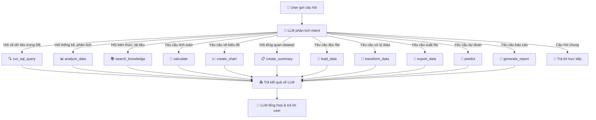
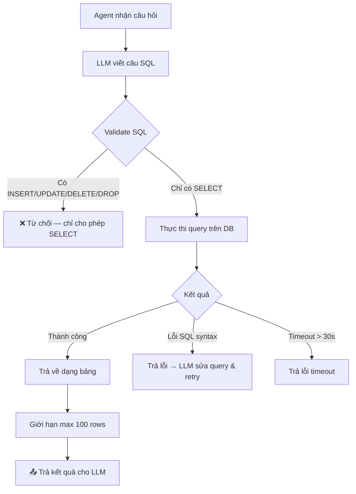
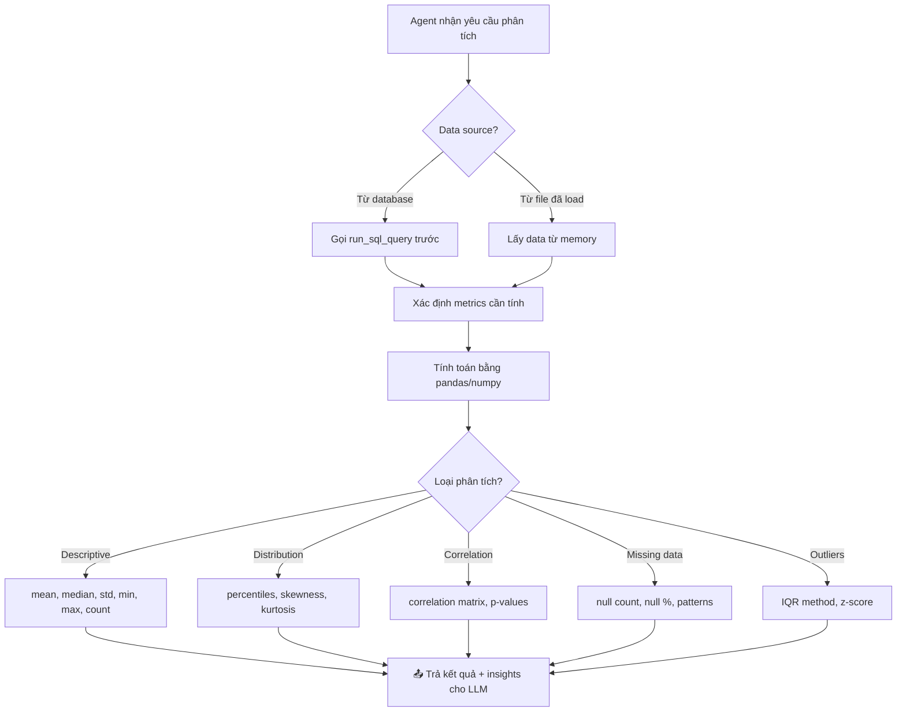
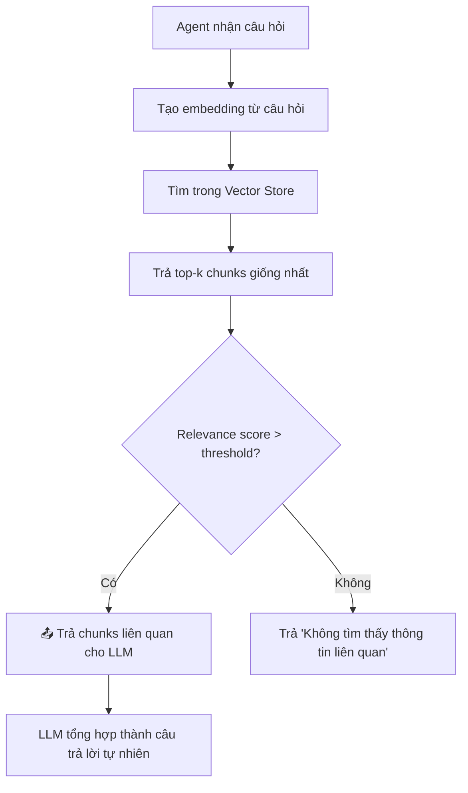
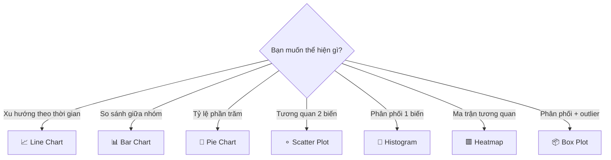
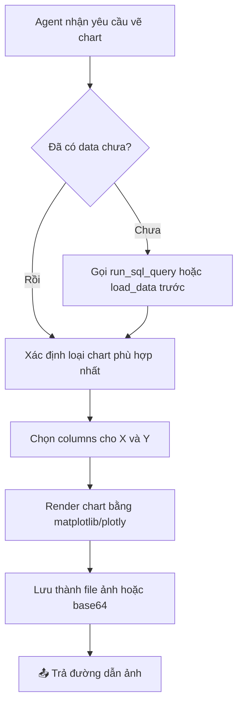
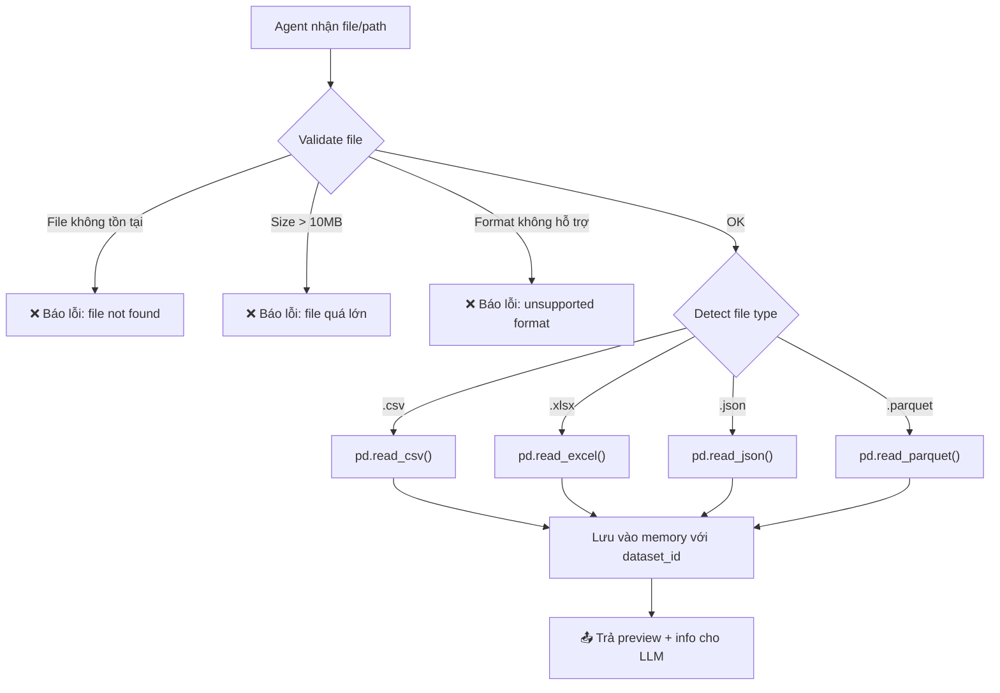
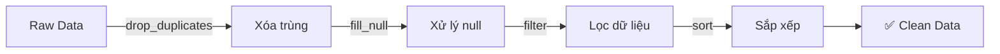
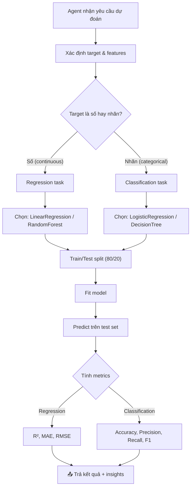
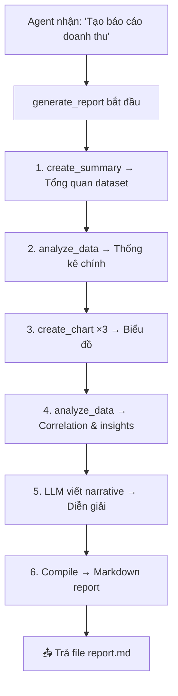

# 🛠️ Chi Tiết Các Tool Cho Data Analysis Agent

## Mục Lục

1. [Tổng Quan Luồng Routing](#1-tổng-quan-luồng-routing)
2. [Tool 1: run_sql_query](#tool-1-run_sql_query--truy-vấn-database)
3. [Tool 2: analyze_data](#tool-2-analyze_data--phân-tích-thống-kê)
4. [Tool 3: search_knowledge](#tool-3-search_knowledge--tìm-kiếm-kiến-thức)
5. [Tool 4: calculate](#tool-4-calculate--tính-toán)
6. [Tool 5: create_chart](#tool-5-create_chart--tạo-biểu-đồ)
7. [Tool 6: create_summary](#tool-6-create_summary--tóm-tắt-dataset)
8. [Tool 7: load_data](#tool-7-load_data--load-dữ-liệu)
9. [Tool 8: transform_data](#tool-8-transform_data--xử-lý-dữ-liệu)
10. [Tool 9: export_data](#tool-9-export_data--xuất-dữ-liệu)
11. [Tool 10: predict](#tool-10-predict--dự-đoán)
12. [Tool 11: generate_report](#tool-11-generate_report--tạo-báo-cáo)
13. [Bảng Mapping Câu Hỏi → Tool](#bảng-mapping-tổng-hợp)
14. [Chuỗi Tool Phối Hợp](#chuỗi-tool-phối-hợp-multi-tool-chains)

---

## 1. Tổng Quan Luồng Routing

Khi user gửi câu hỏi, LLM agent sẽ **phân tích ý định (intent)** và quyết định gọi tool nào. Dưới đây là sơ đồ routing tổng thể:



> **Lưu ý:** Agent có thể gọi **nhiều tool liên tiếp** trong 1 lượt. Ví dụ: user hỏi *"Vẽ biểu đồ doanh thu theo tháng"* → agent gọi `run_sql_query` trước để lấy data, rồi gọi `create_chart` để vẽ.

---

## Tool 1: `run_sql_query` — Truy Vấn Database

### Mục đích
Cho phép agent viết và thực thi câu SQL SELECT trên database để lấy dữ liệu thô.

### Khi nào agent gọi tool này?

Agent gọi `run_sql_query` khi user **hỏi về dữ liệu cụ thể đang nằm trong database** — bất kỳ câu hỏi nào cần truy xuất, đếm, lọc, sắp xếp, hoặc gom nhóm dữ liệu.

**Các tín hiệu nhận biết từ câu hỏi user:**
- Hỏi "bao nhiêu", "có mấy", "tổng cộng"
- Yêu cầu "liệt kê", "danh sách", "cho xem"
- Hỏi "ai", "cái nào", "sản phẩm nào"
- Có điều kiện lọc: "trong tháng 5", "ở Hà Nội", "trên 1 triệu"

**Ví dụ câu hỏi cụ thể:**

| Câu hỏi user | SQL agent sẽ viết | Tại sao gọi tool này |
|---------------|-------------------|---------------------|
| *"Doanh thu tháng 5 năm 2024 là bao nhiêu?"* | `SELECT SUM(revenue) FROM sales WHERE month = 5 AND year = 2024` | Cần aggregate dữ liệu từ bảng sales |
| *"Cho tôi danh sách 10 khách hàng mua nhiều nhất"* | `SELECT name, COUNT(*) as orders FROM customers JOIN orders... ORDER BY orders DESC LIMIT 10` | Cần JOIN + sắp xếp + giới hạn |
| *"Có bao nhiêu sản phẩm đang hết hàng?"* | `SELECT COUNT(*) FROM products WHERE stock = 0` | Cần đếm với điều kiện |
| *"Nhân viên nào có lương cao nhất phòng IT?"* | `SELECT name, salary FROM employees WHERE dept='IT' ORDER BY salary DESC LIMIT 1` | Cần lọc + sắp xếp |
| *"So sánh doanh thu Q1 và Q2"* | `SELECT quarter, SUM(revenue) FROM sales WHERE quarter IN (1,2) GROUP BY quarter` | Cần gom nhóm theo quý |
| *"Tìm các đơn hàng bị huỷ trong tuần qua"* | `SELECT * FROM orders WHERE status='cancelled' AND order_date >= date('now', '-7 days')` | Cần lọc theo trạng thái + thời gian |

### Luồng hoạt động chi tiết



### Input / Output

```
Input:
  - query: str          # Câu SQL (chỉ SELECT)

Output (success):
  - columns: ["id", "name", "revenue"]
  - rows: [[1, "Product A", 500000], [2, "Product B", 300000], ...]
  - row_count: 45
  - execution_time: "0.12s"

Output (error):
  - error: "Lỗi: Chỉ cho phép câu lệnh SELECT"
  - suggestion: "Vui lòng sử dụng SELECT để truy vấn dữ liệu"
```

### Các lỗi thường gặp & cách agent xử lý

| Lỗi | Nguyên nhân | Agent xử lý |
|-----|-------------|-------------|
| Table not found | Tên bảng sai | LLM thử lại với tên đúng (dựa vào schema) |
| Column not found | Tên cột sai | LLM thử lại với tên đúng |
| Syntax error | SQL viết sai | LLM sửa lại câu SQL |
| Timeout | Query quá nặng | LLM đơn giản hóa query (bỏ subquery, thêm LIMIT) |
| Không có kết quả | Điều kiện quá chặt | LLM nới lỏng điều kiện hoặc báo user |

### Dependencies
- `sqlite3` hoặc `sqlalchemy` — kết nối database
- Schema info — agent cần biết tên bảng + cột để viết SQL đúng

> **Quan trọng:** Agent cần được cung cấp **database schema** (tên bảng, tên cột, kiểu dữ liệu) trong system prompt hoặc qua một hàm `get_schema()` để viết SQL chính xác.

---

## Tool 2: `analyze_data` — Phân Tích Thống Kê

### Mục đích
Tính toán các chỉ số thống kê mô tả (descriptive statistics) trên một dataset.

### Khi nào agent gọi tool này?

Agent gọi `analyze_data` khi user **hỏi về đặc điểm thống kê, phân phối, hoặc mối tương quan** của dữ liệu — không chỉ lấy data thô mà cần **phân tích** nó.

**Các tín hiệu nhận biết từ câu hỏi user:**
- "trung bình", "trung vị", "median"
- "phân phối", "distribution"
- "tương quan", "correlation", "mối quan hệ"
- "độ lệch chuẩn", "std", "biến thiên"
- "outlier", "ngoại lệ", "bất thường"
- "xu hướng", "trend"
- "missing", "thiếu", "null"

**Ví dụ câu hỏi cụ thể:**

| Câu hỏi user | Metrics agent tính | Tại sao gọi tool này |
|---------------|-------------------|---------------------|
| *"Lương trung bình của nhân viên là bao nhiêu?"* | mean, median | Cần thống kê mô tả |
| *"Phân phối tuổi khách hàng như thế nào?"* | percentiles, skewness, kurtosis | Cần phân tích phân phối |
| *"Doanh thu có xu hướng tăng hay giảm?"* | trend analysis | Cần phân tích xu hướng |
| *"Có mối tương quan giữa chi tiêu quảng cáo và doanh thu không?"* | correlation, p-value | Cần tương quan |
| *"Có bao nhiêu % dữ liệu bị thiếu?"* | null count, null % | Cần kiểm tra data quality |
| *"Giá trị ngoại lệ (outlier) trong dataset?"* | IQR, z-score | Cần phát hiện outlier |
| *"Độ lệch chuẩn của giá sản phẩm?"* | std, variance | Cần đo mức độ phân tán |

### Phân biệt với `run_sql_query`

| | `run_sql_query` | `analyze_data` |
|--|----------------|----------------|
| **Mục đích** | Lấy dữ liệu thô | Phân tích dữ liệu |
| **Output** | Bảng (rows & columns) | Chỉ số thống kê + insight |
| **Khi nào** | "Cho tôi danh sách..." | "Trung bình/phân phối/tương quan..." |
| **Ví dụ** | "Liệt kê đơn hàng" | "Giá trị trung bình đơn hàng" |

### Luồng hoạt động chi tiết



### Input / Output

```
Input:
  - data_source: str         # Tên bảng hoặc dataset ID
  - columns: list[str]       # Cột cần phân tích (optional — mặc định tất cả)
  - metrics: list[str]       # Chỉ số cần tính

Metrics hỗ trợ:
  - "descriptive"    → mean, median, mode, std, min, max, count
  - "distribution"   → percentile (25, 50, 75), skewness, kurtosis
  - "correlation"    → correlation matrix giữa các cột số
  - "missing"        → null count, null percentage per column
  - "outliers"       → số outliers theo IQR method
  - "trend"          → tăng/giảm/ổn định (cần cột thời gian)

Output (success):
  - metrics:
      mean: 45000.5
      median: 42000.0
      std: 12500.3
      min: 15000
      max: 120000
      count: 1523
      null_count: 12
      null_percentage: 0.8%
  - insights:
      - "Phân phối lệch phải (skew = 1.2)"
      - "12 giá trị null (0.8%)"
      - "3 outliers phát hiện (IQR method)"
```

### Ví dụ thực tế — Chuỗi gọi tool

**User:** *"Phân tích lương nhân viên phòng kỹ thuật"*

**Agent gọi tuần tự:**
1. `run_sql_query("SELECT salary FROM employees WHERE department = 'Engineering'")` → lấy data
2. `analyze_data(data, columns=["salary"], metrics=["descriptive", "distribution", "outliers"])` → phân tích

**Agent trả lời:**
> *"Phân tích lương phòng Kỹ thuật (n=85):*
> - *Trung bình: 28.5 triệu, Trung vị: 26 triệu*
> - *Thấp nhất: 12 triệu, Cao nhất: 65 triệu*
> - *Có 3 outlier (lương > 55 triệu)*
> - *Phân phối lệch phải — đa số lương tập trung 20-35 triệu"*

### Dependencies
- `pandas` — DataFrame operations
- `numpy` — tính toán số
- `scipy.stats` — skewness, kurtosis, correlation p-values

---

## Tool 3: `search_knowledge` — Tìm Kiếm Kiến Thức

### Mục đích
Tìm kiếm thông tin từ tài liệu đã được index (RAG — Retrieval-Augmented Generation) bằng semantic search.

### Khi nào agent gọi tool này?

Agent gọi `search_knowledge` khi user **hỏi về kiến thức, quy trình, chính sách, tài liệu** — những thông tin **không nằm trong database dạng bảng** mà nằm trong **văn bản/tài liệu**.

**Các tín hiệu nhận biết từ câu hỏi user:**
- "chính sách", "quy trình", "quy định"
- "hướng dẫn", "cách làm", "làm sao"
- "giải thích", "là gì", "nghĩa là gì"
- "tài liệu", "SOP", "handbook"
- Câu hỏi mang tính kiến thức, không phải số liệu

**Ví dụ câu hỏi cụ thể:**

| Câu hỏi user | Tại sao gọi tool này | Không phải tool khác vì |
|---------------|---------------------|------------------------|
| *"Chính sách hoàn trả hàng như thế nào?"* | Tìm trong tài liệu chính sách | Không có bảng "chính sách" trong DB |
| *"Quy trình xử lý đơn hàng bị lỗi?"* | Tìm trong SOP/quy trình | Đây là quy trình, không phải dữ liệu |
| *"KPI đánh giá nhân viên gồm những gì?"* | Tìm trong tài liệu HR | Kiến thức, không phải query data |
| *"Giải thích chỉ số ROI là gì?"* | Tìm trong glossary | Giải thích khái niệm |
| *"Hướng dẫn sử dụng hệ thống báo cáo?"* | Tìm trong user manual | Hướng dẫn sử dụng |

### Phân biệt với `run_sql_query`

| | `run_sql_query` | `search_knowledge` |
|--|----------------|---------------------|
| **Nguồn dữ liệu** | Database (bảng, số liệu) | Tài liệu (văn bản, PDF, docs) |
| **Loại câu hỏi** | "Bao nhiêu? Danh sách? Ai?" | "Như thế nào? Giải thích? Quy trình?" |
| **Kỹ thuật** | SQL query | Semantic search (vector similarity) |
| **Ví dụ** | "Doanh thu tháng 5?" | "Chính sách bán hàng?" |

### Luồng hoạt động chi tiết



### Input / Output

```
Input:
  - query: str          # Câu hỏi / từ khóa tìm kiếm
  - top_k: int = 5      # Số kết quả trả về
  - filter: dict = {}   # Bộ lọc metadata (optional)
                         # VD: {"category": "policy", "year": 2024}

Output (success):
  - results:
    - [0]:
        content: "Chính sách hoàn trả: Khách hàng có thể hoàn trả..."
        source: "policy_handbook.pdf, trang 12"
        relevance_score: 0.92
    - [1]:
        content: "Thời hạn hoàn trả tối đa 30 ngày kể từ..."
        source: "policy_handbook.pdf, trang 13"
        relevance_score: 0.87
```

### Dependencies
- **Vector Store:** ChromaDB (đơn giản, phù hợp dev) hoặc FAISS (nhanh hơn)
- **Embedding model:** `text-embedding-3-small` (OpenAI) hoặc `sentence-transformers`
- **Document loader + chunking:** load PDF/DOCX/TXT → chia chunk → tạo embedding → lưu vector store

---

## Tool 4: `calculate` — Tính Toán

### Mục đích
Tính toán các biểu thức toán học. **Tool này đã có sẵn trong template.**

### Khi nào agent gọi tool này?

Agent gọi `calculate` khi user **yêu cầu tính toán số học thuần túy** — không liên quan đến data trong database hay dataset.

**Các tín hiệu nhận biết:**
- Có biểu thức toán: "15% × 200", "1500 + 2300"
- Hỏi "bao nhiêu phần trăm", "lãi suất", "chiết khấu"
- Công thức cụ thể: "margin = (revenue - cost) / revenue"

**Ví dụ câu hỏi cụ thể:**

| Câu hỏi user | Expression agent gửi | Tại sao gọi tool này |
|---------------|---------------------|---------------------|
| *"15% của 200 triệu là bao nhiêu?"* | `200000000 * 0.15` | Tính toán % đơn giản |
| *"Lãi suất kép 8%/năm, gốc 100tr, sau 5 năm?"* | `100000000 * (1.08 ** 5)` | Biểu thức lũy thừa |
| *"Tổng 1500 + 2300 + 4500?"* | `1500 + 2300 + 4500` | Phép cộng |
| *"Margin nếu revenue 500tr, cost 350tr?"* | `(500 - 350) / 500` | Công thức kinh doanh |

### Phân biệt với `analyze_data`

| | `calculate` | `analyze_data` |
|--|-------------|----------------|
| **Input** | 1 biểu thức toán học cụ thể | Dataset (nhiều dòng dữ liệu) |
| **Khi nào** | "Tính 15% × 200" | "Trung bình lương nhân viên" |
| **Bản chất** | Calculator | Statistical analysis trên tập dữ liệu |

### Input / Output

```
Input:
  - expression: str    # "200000000 * 0.15"

Output (success):
  - result: "30000000.0"

Output (error):
  - error: "Lỗi tính toán: division by zero"
```

---

## Tool 5: `create_chart` — Tạo Biểu Đồ

### Mục đích
Tạo biểu đồ trực quan từ dữ liệu để user dễ hiểu xu hướng, so sánh, phân phối.

### Khi nào agent gọi tool này?

Agent gọi `create_chart` khi:
1. User **yêu cầu trực tiếp**: "vẽ biểu đồ", "chart", "visualize"
2. Agent **tự nhận thấy** data sẽ dễ hiểu hơn nếu có biểu đồ (ví dụ: dữ liệu theo thời gian → nên vẽ line chart)

**Các tín hiệu nhận biết:**
- "vẽ", "biểu đồ", "chart", "graph"
- "trực quan", "visualize", "hình ảnh"
- "so sánh", "xu hướng" (agent tự quyết định vẽ)
- "pie chart", "bar chart", "scatter" (chỉ định loại)

**Ví dụ và bảng quyết định chọn loại chart:**

| Câu hỏi user | Loại chart agent chọn | Lý do chọn |
|---------------|----------------------|------------|
| *"Vẽ biểu đồ doanh thu 6 tháng đầu năm"* | **Line chart** | Dữ liệu theo thời gian → xu hướng |
| *"So sánh doanh thu giữa các chi nhánh"* | **Bar chart** | So sánh giữa các nhóm rời rạc |
| *"Tỷ lệ thị phần các sản phẩm?"* | **Pie chart** | Hiển thị tỷ lệ phần trăm (tổng = 100%) |
| *"Mối quan hệ giữa tuổi và thu nhập?"* | **Scatter plot** | Tương quan giữa 2 biến liên tục |
| *"Phân phối điểm số sinh viên?"* | **Histogram** | Phân phối 1 biến liên tục |
| *"Heatmap tương quan các biến?"* | **Heatmap** | Ma trận tương quan nhiều biến |
| *"Phân bố lương có outlier không?"* | **Box plot** | Phân phối + phát hiện outlier |

### Logic chọn chart type



### Luồng hoạt động chi tiết



### Input / Output

```
Input:
  - chart_type: str      # "bar" | "line" | "pie" | "scatter" | "histogram" | "heatmap" | "box"
  - data: str            # JSON data hoặc dataset ID
  - x_column: str        # Cột trục X
  - y_column: str        # Cột trục Y
  - title: str = ""      # Tiêu đề
  - color: str = ""      # Cột dùng để tô màu (optional)
  - group_by: str = ""   # Cột gom nhóm (optional)

Output:
  - image_path: "/output/charts/revenue_by_month.png"
  - image_base64: "data:image/png;base64,iVBOR..."
  - description: "Biểu đồ line thể hiện doanh thu 6 tháng, xu hướng tăng 15%"
```

### Dependencies
- `matplotlib` + `seaborn` — static charts (dễ implement)
- `plotly` — interactive charts (tốt hơn cho web UI)

---

## Tool 6: `create_summary` — Tóm Tắt Dataset

### Mục đích
Tạo bản tóm tắt tổng quan nhanh về một dataset — giúp user nắm "dataset này có gì" trước khi đi sâu.

### Khi nào agent gọi tool này?

Agent gọi `create_summary` khi user **muốn khám phá dataset lần đầu** — đây thường là bước đầu tiên.

**Các tín hiệu nhận biết:**
- "dataset này có gì", "mô tả cho tôi"
- "overview", "tổng quan", "summary"
- "có bao nhiêu dòng/cột"
- "preview", "xem thử", "data trông như nào"
- "dữ liệu có sạch không"

**Ví dụ câu hỏi cụ thể:**

| Câu hỏi user | Tại sao gọi tool này |
|---------------|---------------------|
| *"Dataset này có những gì?"* | Cần overview toàn bộ |
| *"Mô tả bảng customers cho tôi"* | Cần biết schema + sample data |
| *"Dữ liệu có sạch không? Có bị thiếu không?"* | Cần data quality check |
| *"Có bao nhiêu dòng, bao nhiêu cột?"* | Cần shape info |
| *"Cho tôi preview 5 dòng đầu"* | Cần head/sample |

### Phân biệt với `analyze_data`

| | `create_summary` | `analyze_data` |
|--|------------------|----------------|
| **Phạm vi** | Tổng quan toàn bộ dataset | Đi sâu vào cột/chỉ số cụ thể |
| **Output** | Shape, dtypes, nulls, sample | mean, std, correlation, outliers |
| **Khi nào** | "Dataset có gì?" (bước 1) | "Trung bình cột X?" (bước 2) |
| **Mục đích** | Khám phá ban đầu | Phân tích chuyên sâu |

### Input / Output

```
Input:
  - data_source: str       # Tên bảng hoặc file path

Output:
  - shape: "1,523 rows × 12 columns"
  - columns:
    - name: "id", dtype: "int64", nulls: 0, unique: 1523
    - name: "name", dtype: "object", nulls: 5, unique: 1450
    - name: "salary", dtype: "float64", nulls: 12, unique: 890
  - head: (5 dòng đầu tiên dạng bảng)
  - data_quality:
      total_nulls: 17
      duplicate_rows: 3
      memory_usage: "142.5 KB"
```

---

## Tool 7: `load_data` — Load Dữ Liệu

### Mục đích
Đọc dữ liệu từ file (CSV, Excel, JSON, Parquet) vào hệ thống để agent có thể phân tích.

### Khi nào agent gọi tool này?

Agent gọi `load_data` khi user **cung cấp file** hoặc **yêu cầu đọc file** từ hệ thống.

**Các tín hiệu nhận biết:**
- "load file", "đọc file", "mở file"
- "import", "upload"
- User gửi file qua API (upload endpoint)
- Đề cập tên file cụ thể: "file sales.csv", "báo cáo.xlsx"

**Ví dụ câu hỏi cụ thể:**

| Câu hỏi user | Tại sao gọi tool này |
|---------------|---------------------|
| *"Load file sales_2024.csv cho tôi"* | Yêu cầu đọc file trực tiếp |
| *"Phân tích file báo_cáo.xlsx"* | Cần load trước rồi mới phân tích |
| *(User upload file qua UI)* | Nhận file từ frontend → load vào memory |
| *"Đọc dữ liệu từ data/employees.json"* | Đọc JSON |

### Luồng hoạt động chi tiết



### Input / Output

```
Input:
  - file_path: str          # Đường dẫn file
  - file_type: str = "auto" # "csv" | "excel" | "json" | "parquet" | "auto"
  - encoding: str = "utf-8" # Encoding (cho CSV)
  - sheet_name: str = None  # Sheet name (cho Excel)

Output:
  - dataset_id: "ds_sales_2024"
  - shape: "5,230 rows × 8 columns"
  - columns: ["date", "product", "quantity", "revenue", ...]
  - dtypes: {"date": "datetime64", "product": "object", "revenue": "float64"}
  - preview: (5 dòng đầu tiên)
  - file_size: "2.3 MB"
```

### Dependencies
- `pandas` — đọc mọi format
- `openpyxl` — đọc Excel (.xlsx)

> **Bảo mật:** Validate file path — chỉ cho phép đọc từ thư mục `data/` hoặc `uploads/`. Giới hạn file size (ví dụ: max 10MB).

---

## Tool 8: `transform_data` — Xử Lý Dữ Liệu

### Mục đích
Làm sạch, lọc, chuyển đổi dữ liệu trước khi phân tích.

### Khi nào agent gọi tool này?

Agent gọi `transform_data` trong 2 trường hợp:
1. **User yêu cầu trực tiếp:** "lọc", "sắp xếp", "xóa trùng", "xử lý null"
2. **Agent tự phát hiện:** data có null/duplicates cần xử lý trước khi phân tích

**Các tín hiệu nhận biết:**
- "lọc", "filter", "chỉ lấy"
- "sắp xếp", "sort", "xếp theo"
- "gom nhóm", "group by", "nhóm theo"
- "xóa trùng", "remove duplicates"
- "xử lý null", "fill missing", "điền giá trị thiếu"
- "đổi tên cột", "rename"
- "kết hợp", "merge", "join"

**Ví dụ câu hỏi cụ thể:**

| Câu hỏi user | Operation agent chọn | Chi tiết |
|---------------|---------------------|----------|
| *"Lọc những đơn hàng > 1 triệu"* | `filter` | condition: amount > 1000000 |
| *"Sắp xếp theo doanh thu giảm dần"* | `sort` | column: revenue, ascending: false |
| *"Gom nhóm theo tháng và tính tổng"* | `group_by` | columns: month, agg: SUM |
| *"Xử lý null — điền bằng trung bình"* | `fill_null` | strategy: mean |
| *"Xóa các dòng trùng lặp"* | `drop_duplicates` | — |
| *"Đổi tên cột 'qty' thành 'quantity'"* | `rename` | mapping: {qty: quantity} |
| *"Kết hợp bảng orders với customers"* | `merge` | on: customer_id, how: left |
| *"Chỉ giữ cột name, age, salary"* | `select_columns` | columns: [name, age, salary] |

### Luồng: Agent tự chuỗi nhiều operations



### Input / Output

```
Input:
  - data_source: str               # Dataset ID hoặc tên bảng
  - operations: list[dict]         # Danh sách thao tác tuần tự

Ví dụ operations:
  [
    {"type": "drop_duplicates"},
    {"type": "fill_null", "column": "salary", "strategy": "mean"},
    {"type": "filter", "condition": "age > 18"},
    {"type": "sort", "column": "salary", "ascending": false},
    {"type": "group_by", "columns": ["department"], "agg": {"salary": "mean"}},
    {"type": "rename", "mapping": {"qty": "quantity"}},
    {"type": "select_columns", "columns": ["name", "department", "salary"]},
    {"type": "merge", "right_data": "ds_departments", "on": "dept_id", "how": "left"}
  ]

Output:
  - dataset_id: "ds_sales_2024_clean"
  - shape: "4,800 rows × 8 columns"
  - operations_log:
    - "Xóa 230 dòng trùng lặp"
    - "Điền 45 giá trị null bằng mean (28,500)"
    - "Lọc: giữ 4,800/5,030 dòng (age > 18)"
    - "Sắp xếp theo salary giảm dần"
```

---

## Tool 9: `export_data` — Xuất Dữ Liệu

### Mục đích
Xuất kết quả phân tích hoặc dữ liệu đã xử lý ra file để user download.

### Khi nào agent gọi tool này?

Agent gọi `export_data` khi user **muốn lưu/download kết quả**.

**Các tín hiệu nhận biết:**
- "xuất ra", "export", "save as"
- "download", "tải về"
- "gửi file", "lưu file"
- "chuyển sang CSV/Excel/JSON"

**Ví dụ câu hỏi cụ thể:**

| Câu hỏi user | Format agent chọn |
|---------------|-------------------|
| *"Xuất kết quả ra file CSV"* | CSV |
| *"Gửi tôi file Excel"* | Excel (.xlsx) |
| *"Export ra JSON"* | JSON |
| *"Tạo bảng Markdown cho báo cáo"* | Markdown table |
| *"Cho tôi download kết quả"* | CSV (mặc định) |

### Input / Output

```
Input:
  - data_source: str         # Dataset ID
  - format: str = "csv"      # "csv" | "excel" | "json" | "markdown"
  - file_name: str = "output"

Output:
  - file_path: "/output/exports/sales_analysis_2024.csv"
  - file_size: "1.2 MB"
  - download_url: "/api/download/sales_analysis_2024.csv"
```

---

## Tool 10: `predict` — Dự Đoán

### Mục đích
Huấn luyện model ML đơn giản trên dữ liệu và đưa ra dự đoán.

### Khi nào agent gọi tool này?

Agent gọi `predict` khi user **hỏi về tương lai, dự đoán, hoặc muốn xây dựng model**.

**Các tín hiệu nhận biết:**
- "dự đoán", "predict", "forecast"
- "tương lai", "sắp tới", "năm tới"
- "mô hình", "model", "train"
- "phân loại", "classify"
- "khả năng", "xác suất"

**Ví dụ câu hỏi cụ thể:**

| Câu hỏi user | Model agent chọn | Loại bài toán |
|---------------|------------------|---------------|
| *"Dự đoán doanh thu Q4?"* | Linear Regression | Regression — dự đoán giá trị liên tục |
| *"Khách hàng nào có khả năng rời bỏ?"* | Random Forest Classifier | Classification — phân loại churn/not churn |
| *"Giá nhà dựa trên diện tích?"* | Random Forest Regressor | Regression — nhiều features |
| *"Phân loại email spam?"* | Decision Tree | Classification đơn giản |
| *"Xu hướng doanh thu năm tới?"* | Linear Regression + trend | Time series prediction đơn giản |

### Luồng hoạt động chi tiết



### Input / Output

```
Input:
  - data_source: str          # Dataset ID
  - target_column: str        # Cột mục tiêu (Y)
  - feature_columns: list     # Cột features (X) — optional, auto-detect
  - model_type: str = "auto"  # "linear_regression" | "logistic_regression" |
                               # "decision_tree" | "random_forest" | "auto"
  - predict_data: dict = {}   # Dữ liệu mới cần dự đoán (optional)

Output:
  - model_type: "RandomForestRegressor"
  - metrics:
      r2_score: 0.87
      mae: 1250000
      rmse: 1580000
  - feature_importance:
      - "area": 0.45
      - "location": 0.30
      - "rooms": 0.15
  - prediction: 2500000000    # Nếu có predict_data
  - insight: "Model giải thích 87% biến thiên. Diện tích là yếu tố quan trọng nhất."
```

### Dependencies
- `scikit-learn` — ML models (LinearRegression, RandomForest, DecisionTree...)

> **Lưu ý:** Đây là tool **bonus** — tạo ấn tượng mạnh cho Demo Day nhưng không bắt buộc. Chỉ cần hỗ trợ 2-3 model đơn giản là đủ.

---

## Tool 11: `generate_report` — Tạo Báo Cáo

### Mục đích
Tự động tạo báo cáo phân tích tổng hợp — kết hợp text + bảng + biểu đồ thành 1 document.

### Khi nào agent gọi tool này?

Agent gọi `generate_report` khi user **yêu cầu báo cáo tổng hợp** — tool này thực chất là một **orchestrator** gọi nhiều tool khác rồi compile thành 1 báo cáo hoàn chỉnh.

**Các tín hiệu nhận biết:**
- "tạo báo cáo", "report", "báo cáo tổng hợp"
- "tóm tắt phân tích thành document"
- "báo cáo cho sếp", "executive summary"
- "tổng hợp tất cả kết quả"

**Ví dụ câu hỏi cụ thể:**

| Câu hỏi user | Loại report | Tool chain bên trong |
|---------------|-------------|---------------------|
| *"Tạo báo cáo phân tích doanh thu"* | Full report | summary → analyze → chart(×3) → compile |
| *"Tóm tắt kết quả phân tích"* | Summary | analyze → compile |
| *"Báo cáo cho sếp xem"* | Executive | analyze (key metrics only) → chart(×1) → compile |

### Luồng: Orchestrate các tool khác



### Output mẫu (Markdown report)

```markdown
# 📊 Báo Cáo Phân Tích Doanh Thu Q3/2024

## 1. Tổng Quan
- Dữ liệu: 15,230 giao dịch từ 01/07 - 30/09/2024
- Tổng doanh thu: 45.2 tỷ VNĐ (+12% so với Q2)

## 2. Phân Tích Chi Tiết
| Chỉ số | Giá trị |
|--------|---------|
| Trung bình / đơn | 2.97 triệu |
| Median | 1.85 triệu |
| Max | 150 triệu |

## 3. Biểu Đồ
[Embedded charts]

## 4. Insight & Đề Xuất
- Doanh thu tháng 9 tăng mạnh nhờ chiến dịch marketing
- Đề xuất tập trung vào sản phẩm nhóm A (chiếm 60% doanh thu)
```

---

## Bảng Mapping Tổng Hợp

Bảng tra nhanh: **User hỏi gì → Agent gọi tool gì**

| Từ khóa / Pattern trong câu hỏi | Tool được gọi | Ví dụ câu hỏi |
|----------------------------------|---------------|----------------|
| "bao nhiêu", "danh sách", "liệt kê", "tìm" | `run_sql_query` | "Có bao nhiêu đơn hàng tháng 5?" |
| "trung bình", "phân phối", "tương quan", "outlier" | `analyze_data` | "Trung bình giá sản phẩm?" |
| "chính sách", "quy trình", "giải thích", "hướng dẫn" | `search_knowledge` | "Chính sách hoàn trả?" |
| "tính", biểu thức toán, "% của" | `calculate` | "15% của 200 triệu?" |
| "vẽ", "biểu đồ", "chart", "visualize" | `create_chart` | "Vẽ chart doanh thu" |
| "tổng quan", "dataset có gì", "preview" | `create_summary` | "Mô tả bảng customers" |
| "load", "đọc file", "import", upload | `load_data` | "Load file sales.csv" |
| "lọc", "xóa trùng", "fill null", "sắp xếp" | `transform_data` | "Lọc đơn hàng > 1 triệu" |
| "xuất", "export", "download" | `export_data` | "Xuất ra Excel" |
| "dự đoán", "forecast", "predict" | `predict` | "Dự đoán doanh thu Q4" |
| "báo cáo", "report", "tổng hợp" | `generate_report` | "Tạo report phân tích" |
| Chào hỏi, hỏi chung | *(không gọi tool)* | "Chào bạn" |

---

## Chuỗi Tool Phối Hợp (Multi-tool Chains)

Trong thực tế, agent thường **gọi nhiều tool liên tiếp** để hoàn thành 1 yêu cầu phức tạp:

### Chain 1: Phân tích cơ bản
```
User: "Phân tích lương nhân viên phòng IT"

Bước 1: run_sql_query("SELECT salary FROM employees WHERE dept='IT'")
        → Lấy raw data từ database
Bước 2: analyze_data(data, metrics=["descriptive", "outliers"])
        → Tính mean, median, std, phát hiện outlier
Bước 3: LLM tổng hợp → Trả lời user
```

### Chain 2: Trực quan hóa
```
User: "Vẽ biểu đồ doanh thu theo tháng"

Bước 1: run_sql_query("SELECT month, SUM(revenue) FROM sales GROUP BY month")
        → Lấy data đã aggregate
Bước 2: create_chart(type="line", x="month", y="revenue")
        → Vẽ line chart
Bước 3: Trả ảnh biểu đồ cho user
```

### Chain 3: Làm sạch rồi phân tích
```
User: "Phân tích file sales.csv, bỏ qua dữ liệu thiếu"

Bước 1: load_data("sales.csv")
        → Load file vào memory, gán dataset_id
Bước 2: create_summary(dataset_id)
        → Xem tổng quan: 5230 rows, 45 nulls, 12 duplicates
Bước 3: transform_data(dataset_id, ops=[drop_duplicates, fill_null])
        → Làm sạch data
Bước 4: analyze_data(clean_dataset_id, metrics=["descriptive"])
        → Phân tích trên data sạch
Bước 5: LLM tổng hợp → Trả kết quả
```

### Chain 4: Phân tích toàn diện + Báo cáo
```
User: "Tạo báo cáo phân tích toàn diện bảng orders"

Bước 1: create_summary("orders")
        → Tổng quan dataset
Bước 2: analyze_data("orders", metrics=["descriptive"])
        → Thống kê mô tả
Bước 3: analyze_data("orders", metrics=["correlation"])
        → Ma trận tương quan
Bước 4: create_chart(type="bar", ...)
        → Biểu đồ doanh thu theo nhóm
Bước 5: create_chart(type="line", ...)
        → Biểu đồ xu hướng
Bước 6: create_chart(type="heatmap", ...)
        → Heatmap tương quan
Bước 7: generate_report(compile all above)
        → Compile thành Markdown report
Bước 8: Trả file report cho user
```

### Chain 5: Dự đoán với visualization
```
User: "Dự đoán doanh thu tháng tới dựa trên data hiện tại"

Bước 1: run_sql_query("SELECT month, revenue FROM sales ORDER BY month")
        → Lấy historical data
Bước 2: analyze_data(data, metrics=["trend"])
        → Phân tích xu hướng (tăng/giảm/ổn định)
Bước 3: predict(data, target="revenue", model="linear_regression")
        → Train model + predict tháng tới
Bước 4: create_chart(type="line", data=actual+predicted)
        → Vẽ actual vs predicted
Bước 5: LLM tổng hợp → Trả dự đoán + biểu đồ + insight
```

### Chain 6: Upload file → Full pipeline
```
User: Upload file employees.xlsx + "Phân tích toàn diện"

Bước 1: load_data("employees.xlsx")
        → Load Excel
Bước 2: create_summary(dataset_id)
        → "4,500 rows × 10 columns, 67 nulls, 23 duplicates"
Bước 3: transform_data(ops=[drop_duplicates, fill_null, filter])
        → Làm sạch
Bước 4: analyze_data(metrics=["descriptive", "correlation", "outliers"])
        → Phân tích toàn diện
Bước 5: create_chart(type="histogram", column="salary")
        → Phân phối lương
Bước 6: create_chart(type="bar", x="department", y="avg_salary")
        → Lương trung bình theo phòng ban
Bước 7: create_chart(type="scatter", x="experience", y="salary")
        → Tương quan kinh nghiệm - lương
Bước 8: generate_report(compile all)
        → Báo cáo hoàn chỉnh
```

> **Mẹo implement:** Trong LangGraph, sử dụng **ReAct pattern** — agent tự quyết định gọi tool nào dựa trên output của tool trước đó, thay vì hardcode chuỗi cố định. Điều này giúp agent linh hoạt hơn và xử lý được nhiều tình huống hơn.
