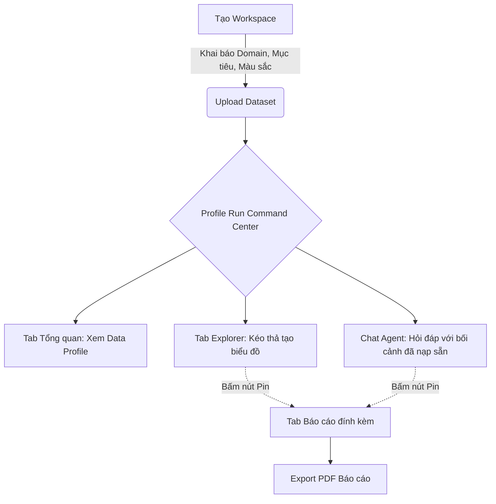

# Đề xuất Tối ưu hóa Trải nghiệm Người dùng (UX) & Luồng Phân tích VDaAgent

> [!NOTE]
> Tài liệu này phác thảo đề xuất cải tiến kiến trúc UX của VDaAgent theo hướng Product-Led Growth (PLG), nhằm giảm thiểu đường cong học tập (learning curve) và hợp nhất các tính năng phân tích vào một luồng duy nhất.

## 1. Bối cảnh & Vấn đề hiện tại
Hiện tại, VDaAgent đang phân mảnh luồng phân tích thành 3 module tách biệt:
1. **Profile Run:** Nơi sinh ra báo cáo dữ liệu ban đầu.
2. **Phân tích chuyên sâu (Analysis Session):** Nơi người dùng thực hiện aggregate có tính toán cứng (deterministic).
3. **Phiên phân tích (Notebook):** Nơi người dùng lưu trữ biểu đồ, câu trả lời của Agent thành dạng báo cáo.

Sự phân tách này tạo ra nhiều khái niệm (concepts) mà người dùng mới phải làm quen, khiến trải nghiệm bị gián đoạn khi phải chuyển đổi qua lại giữa các màn hình.

## 2. Đề xuất: "Một Trung Tâm Điều Khiển" (Command Center)
Giải pháp tối ưu là **loại bỏ hoàn toàn màn hình quản lý Notebook và Analysis Session riêng biệt**, gộp các tính năng cốt lõi của chúng thẳng vào trong màn hình **Profile Run**.

### A. Tích hợp Phân tích chuyên sâu (Analysis) vào Profile Run
Thêm một tab **Interactive Explorer (Khám phá động)** ngay bên trong giao diện Profile Run.
- Người dùng không cần tạo "Session" và duyệt (approve) context một cách nặng nề.
- Cho phép kéo thả trực tiếp Dimensions/Measures từ Profile.
- DuckDB engine vẫn chạy ngầm để trả ra con số aggregate chính xác tuyệt đối.
- Agent đứng song song bên cạnh (Chat panel) để có thể giải thích ngay lập tức biểu đồ vừa được vẽ ra.

### B. Tích hợp Phiên phân tích (Notebook) vào Profile Run
Loại bỏ mô hình quản lý Notebook rời rạc, thay bằng tính năng **Pin to Report (Ghim vào Báo cáo)**.
- Bên cạnh mỗi biểu đồ sinh ra từ Explorer, hoặc mỗi câu trả lời xuất sắc của Agent, có một nút `[Pin]`.
- Mọi nội dung được ghim sẽ tự động sắp xếp vào một tab **Báo cáo tổng hợp** đính kèm vĩnh viễn với Profile Run đó.
- Cung cấp tính năng Export PDF trực tiếp từ tab Báo cáo này.

## 3. Khởi tạo Workspace: Đưa Context & Theme lên tuyến đầu
Để Agent trở nên thông minh và cá nhân hóa ngay từ những giây đầu tiên, màn hình tạo Workspace (Tạo không gian làm việc) sẽ được bổ sung form cấu hình:

### A. Data Context (Ngữ cảnh Nghiệp vụ)
Định hình "bộ não" cho AI, được tiêm thẳng vào System Prompt của toàn bộ Workspace:
- **Lĩnh vực (Domain):** (VD: Y tế, E-commerce, Tài chính, Logistics). Giúp Agent hiểu thuật ngữ chuyên ngành (Jargon).
- **Mục tiêu cốt lõi (Primary Goal):** (VD: Tìm kiếm Insight, Dọn dẹp dữ liệu, Phát hiện gian lận). Giúp Agent biết nên tập trung phân tích sâu vào góc độ nào khi đọc Profile.
- **Đối tượng mục tiêu (Target Audience):** (VD: C-level Execs, Data Engineers, Marketing). Quyết định độ sâu của kỹ thuật và từ vựng khi Agent xuất báo cáo.

### B. Workspace Theme (Hình thức Báo cáo)
Định hình "bộ mặt" của các bản xuất ra:
- **Màu sắc thương hiệu (Brand Colors):** Biểu đồ sinh ra từ Explorer và trong PDF sẽ mang màu chủ đạo này.
- **Giọng điệu Agent (Tone of Voice):** Cấu hình cách AI giao tiếp (Ngắn gọn gạch đầu dòng, Chuyên môn học thuật, Cởi mở dễ hiểu).
- **Ngôn ngữ mặc định:** (VD: Tiếng Việt, Tiếng Anh).

## 4. Luồng Người Dùng Mới (New User Flow)

## 5. Ưu Điểm & Rủi Ro
> [!TIP]
> **Ưu điểm:**
> - **Zero Context Switching:** Người dùng chỉ ở duy nhất một màn hình từ lúc upload đến lúc ra báo cáo.
> - **Cá nhân hóa sâu sắc:** Agent "biết tuốt" về domain của user mà không cần user mớm lời mỗi lần chat.
> - **Time-to-value nhanh hơn:** Rút ngắn thời gian để user nhìn thấy giá trị thật của dữ liệu.

> [!WARNING]
> **Rủi ro kỹ thuật cần lưu ý:**
> - Màn hình Profile Run có thể trở nên quá "nặng" (Heavy UI) vì chứa nhiều tab và trạng thái (State) phức tạp. Cần thiết kế lazy-loading cho các tab.
> - Khi dữ liệu quá lớn, việc aggregate "live" (Interactive Explorer) mà không có bước Quality Gate phê duyệt trước như cũ có thể gây tốn tài nguyên. Giải pháp: Cần giới hạn Timeout ngặt nghèo hoặc limit lượng row cho preview.
