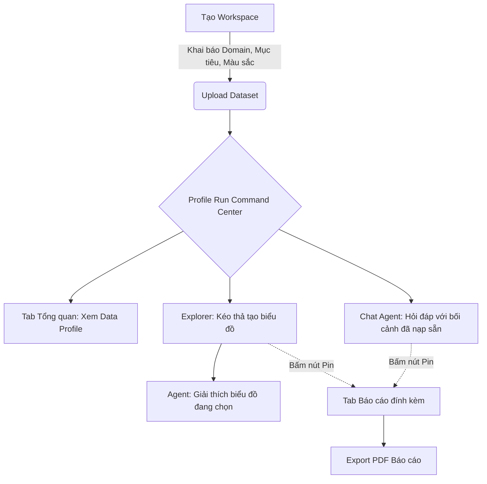

# Đề xuất Tối ưu hóa Trải nghiệm Người dùng (UX) & Luồng Phân tích VDaAgent

> [!NOTE]
> Tài liệu này phác thảo đề xuất cải tiến kiến trúc UX của VDaAgent theo hướng Product-Led Growth (PLG), nhằm giảm thiểu đường cong học tập (learning curve) và hợp nhất các tính năng phân tích vào một luồng duy nhất.

## 1. Bối cảnh & Vấn đề hiện tại
Hiện tại, VDaAgent đang phân mảnh luồng phân tích thành 3 module tách biệt:
1. **Profile Run:** Nơi sinh ra báo cáo dữ liệu ban đầu.
2. **Phân tích chuyên sâu (Analysis Session):** Nơi người dùng thực hiện aggregate có tính toán cứng (deterministic).
3. **Phiên phân tích (Notebook):** Nơi người dùng lưu trữ biểu đồ, câu trả lời của Agent thành dạng báo cáo.

Sự phân tách này tạo ra nhiều khái niệm (concepts) mà người dùng mới phải làm quen, khiến trải nghiệm bị gián đoạn khi phải chuyển đổi qua lại giữa các màn hình.

## 2. Đề xuất: "Một Trung Tâm Điều Khiển" (Command Center)
Giải pháp tối ưu là **loại bỏ hoàn toàn màn hình quản lý Notebook và Analysis Session riêng biệt**, gộp các tính năng cốt lõi của chúng thẳng vào trong màn hình **Profile Run**.

### A. Tích hợp Phân tích chuyên sâu (Analysis) vào Profile Run
Thêm một tab **Interactive Explorer (Khám phá động)** ngay bên trong giao diện Profile Run.
- Người dùng không cần tạo "Session" và duyệt (approve) context một cách nặng nề.
- Cho phép kéo thả trực tiếp Dimensions/Measures từ Profile.
- DuckDB engine vẫn chạy ngầm để trả ra con số aggregate chính xác tuyệt đối.
- Agent đứng song song bên cạnh (Chat panel) để có thể giải thích ngay lập tức biểu đồ vừa được vẽ ra.

### B. Tích hợp Phiên phân tích (Notebook) vào Profile Run
Loại bỏ mô hình quản lý Notebook rời rạc, thay bằng tính năng **Pin to Report (Ghim vào Báo cáo)**.
- Bên cạnh mỗi biểu đồ sinh ra từ Explorer, hoặc mỗi câu trả lời xuất sắc của Agent, có một nút `[Pin]`.
- Mọi nội dung được ghim sẽ tự động sắp xếp vào một tab **Báo cáo tổng hợp** đính kèm vĩnh viễn với Profile Run đó.
- Cung cấp tính năng Export PDF trực tiếp từ tab Báo cáo này.

## 3. Khởi tạo Workspace: Đưa Context & Theme lên tuyến đầu
Để Agent trở nên thông minh và cá nhân hóa ngay từ những giây đầu tiên, màn hình tạo Workspace (Tạo không gian làm việc) sẽ được bổ sung form cấu hình:

### A. Data Context (Ngữ cảnh Nghiệp vụ)
Định hình "bộ não" cho AI, được tiêm thẳng vào System Prompt của toàn bộ Workspace:
- **Lĩnh vực (Domain):** (VD: Y tế, E-commerce, Tài chính, Logistics). Giúp Agent hiểu thuật ngữ chuyên ngành (Jargon).
- **Mục tiêu cốt lõi (Primary Goal):** (VD: Tìm kiếm Insight, Dọn dẹp dữ liệu, Phát hiện gian lận). Giúp Agent biết nên tập trung phân tích sâu vào góc độ nào khi đọc Profile.
- **Đối tượng mục tiêu (Target Audience):** (VD: C-level Execs, Data Engineers, Marketing). Quyết định độ sâu của kỹ thuật và từ vựng khi Agent xuất báo cáo.

### B. Workspace Theme (Hình thức Báo cáo)
Định hình "bộ mặt" của các bản xuất ra:
- **Màu sắc thương hiệu (Brand Colors):** Biểu đồ sinh ra từ Explorer và trong PDF sẽ mang màu chủ đạo này.
- **Giọng điệu Agent (Tone of Voice):** Cấu hình cách AI giao tiếp (Ngắn gọn gạch đầu dòng, Chuyên môn học thuật, Cởi mở dễ hiểu).
- **Ngôn ngữ mặc định:** (VD: Tiếng Việt, Tiếng Anh).

## 4. Luồng Người Dùng Mới (New User Flow)

## 5. Ưu Điểm & Rủi Ro

### Đánh giá bổ sung và khuyến nghị triển khai

Đề xuất Một Trung Tâm Điều Khiển là hướng đi phù hợp ở cấp độ trải nghiệm. Tuy nhiên, cần phân biệt rõ giữa việc hợp nhất UI và việc xóa các domain boundary ở backend.

Analysis Session hiện đảm nhiệm semantic context, quality gate, execution và provenance. Notebook đảm nhiệm cells, sharing, lifecycle và export. Vì vậy, không nên xóa ngay các resource này. Cách an toàn hơn là ẩn chúng khỏi navigation, tạo session theo nhu cầu và dùng một lớp Report Draft hoặc adapter để hiển thị kết quả trong Profile Run.

Ngoài ra, việc không cần approve context chỉ nên áp dụng cho quick preview. Trước khi chạy official analysis, export hoặc publish, hệ thống vẫn phải kiểm tra context version, quality gate, quyền truy cập, PII policy và phiên bản profile. Nếu bỏ hoàn toàn các bước này, trải nghiệm có thể nhanh hơn nhưng độ tin cậy của báo cáo sẽ giảm.

#### Đánh giá theo tiêu chí sản phẩm

| Tiêu chí | Đánh giá | Nhận xét |
| --- | --- | --- |
| Giảm learning curve | Tốt | Người dùng làm việc trong Profile Run thay vì học ba module riêng |
| Time-to-value | Tốt | Explorer và Agent có thể bắt đầu ngay sau khi profile hoàn tất |
| Tính đúng của số liệu | Có điều kiện | Phải giữ deterministic compute và phân biệt preview với official result |
| Khả năng mở rộng | Có rủi ro | Một màn hình dễ quá tải nếu thiếu lazy-loading và state rõ ràng |
| Chuyển đổi từ kiến trúc cũ | Tốt | Có thể tái sử dụng API Analysis và Notebook hiện tại qua adapter |
| An toàn dữ liệu | Có điều kiện | Context, Agent và export phải chịu cùng workspace/PII policy |

#### Cấu trúc UX chi tiết

Profile Run Command Center nên có bốn tab chính. Tiêu đề Profile Run, phiên bản dataset và trạng thái xử lý cần luôn hiển thị.

**Tổng quan**

Hiển thị số dòng, số cột, thời điểm profile, phiên bản dataset, cảnh báo chất lượng và insight ban đầu. Mỗi cảnh báo cần có mức độ, lý do, bằng chứng và hành động tiếp theo; không chỉ hiển thị một danh sách lỗi.

CTA chính gồm Khám phá dữ liệu, Hỏi Agent, Xem vấn đề chất lượng và Xem lịch sử profile. Khi profile đang chạy, giao diện cần có progress theo giai đoạn. Khi profile thất bại, phải hiển thị nguyên nhân có thể hành động, nút retry và mã tham chiếu.

**Interactive Explorer**

Explorer nên là một query builder bounded, không phải SQL console tự do:

- Chia cột thành Dimensions, Measures, Time và Restricted/PII.
- Hỗ trợ kéo thả nhưng luôn có thao tác thay thế bằng select hoặc keyboard.
- Cho phép chọn aggregate, filter, sort và giới hạn số nhóm.
- Hiển thị câu tóm tắt query bằng ngôn ngữ tự nhiên để người dùng kiểm tra trước khi chạy.
- Hiển thị rõ trạng thái Preview, Approximate, Passed quality gate, Blocked hoặc Failed.
- Mỗi chart/table có các action Giải thích, Pin to Report, Duplicate và Edit query.

Khi người dùng chọn Giải thích, Agent phải nhận đúng query spec và result evidence của chart đang xem. Không nên gửi toàn bộ dataset hoặc toàn bộ lịch sử chat nếu không cần thiết.

**Hỏi Agent**

Chat cần cho người dùng biết Agent đang dựa trên profile run nào, context version nào và evidence nào. Câu trả lời nên có các action Pin to Report, Ask follow-up, Show evidence và Regenerate.

Câu trả lời không có evidence, vượt phạm vi dữ liệu hoặc bị giới hạn bởi quality gate phải được gắn nhãn rõ. Agent chỉ diễn giải kết quả deterministic; không được tự tính lại metric hoặc đưa raw row vào câu trả lời.

**Báo cáo**

Pin to Report nên tạo một report draft item có cấu trúc, không chỉ sao chép text hoặc HTML. Mỗi item nên lưu loại nội dung, profile run, context version, execution ID, query spec, result hash, tiêu đề, thứ tự, người ghim, thời điểm ghim, quality status, limitation và export policy.

Người dùng có thể đổi tiêu đề, sắp xếp, thêm ghi chú, bỏ ghim và xem preview trước khi export. Nếu dataset hoặc context đã thay đổi, report cần được đánh dấu stale thay vì âm thầm cập nhật.

#### Mô hình trạng thái và dữ liệu

UI hợp nhất không đồng nghĩa với một bảng dữ liệu duy nhất. Nên duy trì chuỗi resource:

    Workspace
      ├─ Workspace Context/Theme Version
      └─ Dataset
           └─ Profile Run
                ├─ Analysis Session
                │    ├─ Context Version
                │    ├─ Quality Gate
                │    └─ Analysis Execution
                └─ Report Draft
                     ├─ Report Item
                     └─ Report Snapshot

Analysis Session có thể được tạo lazy khi người dùng bắt đầu Explorer và không cần xuất hiện như một mục navigation. Notebook cũ có thể được đọc qua compatibility layer trong giai đoạn chuyển đổi.

Các invariant cần giữ:

- Execution phải tham chiếu đúng profile run, context version và result hash.
- Khi context hoặc profile thay đổi, kết quả cũ không bị ghi đè; report item được đánh dấu stale.
- Pin phải idempotent để retry hoặc double-click không tạo bản sao.
- Backend luôn kiểm tra workspace scope và capability; frontend chỉ là lớp hỗ trợ UX.
- Raw SQL, raw row và PII không phải public contract của Explorer, Agent hoặc export.

#### Quality gate, bảo mật và độ tin cậy

Quality gate nên được ẩn bằng progressive disclosure, không nên bị loại bỏ. Các trường hợp cần review hoặc cảnh báo gồm semantic type, candidate key hoặc PII proposal chưa được xử lý; dimension/measure bị hạn chế; grain, duplicate, null hoặc outlier làm giảm độ tin cậy; query có thể vượt giới hạn group, timeout hoặc bộ nhớ; và context version ở client đã stale.

Quick preview có thể chạy với giới hạn row, group và timeout, nhưng kết quả phải có badge Preview và limitation. Official execution và export cần dùng kết quả bounded đã qua các bước kiểm tra tương ứng.

Các mutation quan trọng cần được audit: tạo profile, chạy execution, ghim/bỏ ghim, export, share/publish và acknowledge quality issue. Agent trace không được lưu raw prompt, raw row, secret, chain-of-thought hoặc giá trị PII không cần thiết.

#### Luồng người dùng và trạng thái cần có

1. Người dùng tạo hoặc chọn Workspace, nhập Context và Theme ở mức tối thiểu.
2. Upload dataset và chờ Profile Run hoàn tất.
3. Xem Tổng quan; hệ thống nêu rõ cảnh báo và next action.
4. Mở Explorer để tạo preview bounded hoặc mở Hỏi Agent để hỏi theo profile.
5. Chọn Giải thích để Agent diễn giải chart đang xem.
6. Pin chart hoặc câu trả lời vào Report Draft.
7. Chỉnh sửa, sắp xếp report, xem snapshot và export PDF/JSON.

| Khu vực | Trạng thái cần thể hiện |
| --- | --- |
| Profile | queued, running, completed, failed, cancelled |
| Explorer | idle, editing, previewing, running, blocked, failed, ready |
| Agent | idle, streaming, completed, no evidence, rate limited, failed |
| Report | empty, draft, stale, exporting, exported, export failed |

Mỗi trạng thái phải có hành động tiếp theo. Ví dụ, Blocked phải chỉ ra rule nào block, dữ liệu nào liên quan và người dùng có thể sửa hoặc acknowledge ra sao.

#### Chiến lược triển khai

**Phase 0 — Chuẩn hóa contract**

- Chốt thuật ngữ Profile Run, Explorer, Report Draft và Report Snapshot.
- Xác định section contract cho profile, chart, Agent answer và export.
- Bổ sung provenance, stale detection và idempotency cho Pin.
- Chốt analytics event và acceptance criteria.

**Phase 1 — Shell hợp nhất**

- Thêm Command Center và các tab Tổng quan, Explorer, Hỏi Agent, Báo cáo.
- Explorer gọi Analysis API hiện có; session được tạo lazy.
- Q&A dùng Agent/evidence hiện có.
- Notebook cũ được đọc qua adapter nếu cần.

**Phase 2 — Preview và Pin to Report**

- Bổ sung bounded preview, timeout, cancellation và badge limitation.
- Thêm report draft item, reorder, edit title/note và unpin.
- Bổ sung autosave, loading/error/empty states và telemetry.

**Phase 3 — Context/Theme có version**

- Tách Data Context có cấu trúc khỏi Theme trình bày.
- Gắn context version vào Agent run, execution và report snapshot.
- Cho phép chỉnh sửa Workspace settings nhưng không thay đổi số liệu deterministic.

**Phase 4 — Export và chuyển đổi**

- Export từ report snapshot nhất quán.
- Chuyển navigation cũ sang deep-link hoặc legacy mode.
- Chỉ deprecate màn hình Notebook/Analysis độc lập sau khi có telemetry, migration và kế hoạch rollback.

#### Chỉ số và acceptance criteria cho MVP

North-star metric là tỷ lệ Profile Run mà người dùng hoàn thành ít nhất một insight có evidence và ghim hoặc export trong cùng workspace.

Nên theo dõi thêm median/p95 time-to-first-insight, tỷ lệ preview chuyển thành official execution, tỷ lệ chart/Agent answer được pin và export, tỷ lệ report stale, tỷ lệ retry/error/cancel, tỷ lệ câu trả lời Agent có evidence hợp lệ, p50/p95 bounded aggregate, timeout, rate limit, cancellation, cache hit và idempotency conflict.

MVP được xem là đạt khi người dùng có thể mở Explorer từ Profile Run, tạo bounded query không cần raw SQL, phân biệt Preview với official execution, không chạy official execution khi context stale hoặc quality gate bị block, giải thích chart bằng evidence đúng, pin và sắp xếp nội dung, export snapshot đã mask PII, và vẫn giữ được draft khi Agent hoặc export lỗi. Mọi thao tác kéo thả phải có đường đi thay thế bằng keyboard hoặc button.

#### Các quyết định cần chốt

1. Report trong MVP là report draft gắn với Profile Run hay dùng lifecycle draft/review/publish hiện có?
2. Preview có được pin hay bắt buộc official execution trước khi đưa vào report?
3. Khi có profile version mới, report tự refresh hay giữ snapshot cũ và đánh dấu stale?
4. Guest workspace có được export/share hay chỉ được xem thử?
5. Theme áp dụng ở cấp workspace, report hay từng visualization?
6. Notebook cũ sẽ hiển thị trong Report tab bằng adapter bao lâu trước khi deprecate?

### Tổng kết đánh giá

Đề xuất nên được thông qua ở cấp độ trải nghiệm. Điều kiện thành công là giữ nguyên các boundary đảm bảo độ tin cậy: deterministic compute, context version, quality gate, workspace authorization, PII policy và report provenance. UI mới nên che giấu sự phức tạp khi mọi thứ bình thường, nhưng phải mở ra đủ chi tiết khi có cảnh báo, lỗi, dữ liệu stale hoặc quyết định cần review.
## Ghi chú ban đầu về ưu điểm và rủi ro
> [!TIP]
> **Ưu điểm:**
> - **Zero Context Switching:** Người dùng chỉ ở duy nhất một màn hình từ lúc upload đến lúc ra báo cáo.
> - **Cá nhân hóa sâu sắc:** Agent "biết tuốt" về domain của user mà không cần user mớm lời mỗi lần chat.
> - **Time-to-value nhanh hơn:** Rút ngắn thời gian để user nhìn thấy giá trị thật của dữ liệu.

> [!WARNING]
> **Rủi ro kỹ thuật cần lưu ý:**
> - Màn hình Profile Run có thể trở nên quá "nặng" (Heavy UI) vì chứa nhiều tab và trạng thái (State) phức tạp. Cần thiết kế lazy-loading cho các tab.
> - Khi dữ liệu quá lớn, việc aggregate "live" (Interactive Explorer) mà không có bước Quality Gate phê duyệt trước như cũ có thể gây tốn tài nguyên. Giải pháp: Cần giới hạn Timeout ngặt nghèo hoặc limit lượng row cho preview.
