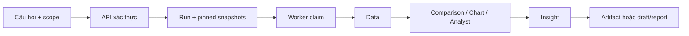

# Từ câu hỏi tới kết quả phân tích

**Status: Implemented.** Người dùng chọn organization, project/zone và `data_as_of`; request có idempotency key. Hội thoại có thể được trả lời bằng capability đọc đã cấp quyền, hoặc tạo run. `POST /analyses` luôn tạo run phân tích.

1. `buildRun` kiểm membership, scope và idempotency; nếu chưa có conversation thì tạo một conversation. Nó ghi `agent-v1` run và `run_snapshots` trong transaction. Snapshot được chọn là bản mới nhất của từng unit ở hoặc trước ngày yêu cầu; import sau đó không đổi input của run.
2. Worker claim run bằng lease. Full run dùng Coordinator → Data → ba branch song song → Insight → Report → Reviewer → Publication. Specialist target (`data`, `comparison`, `chart`, `analyst`, `insight`) chỉ chạy đủ stage để tạo artifact đích.
3. Data và semantic tính số liệu; artifact mang hash, source/snapshot refs và validation. Insight chỉ diễn giải claim đã gắn evidence. UI xem tiến độ bằng run detail, runtime snapshot và event stream.
4. Full run chỉ thành công khi report được publish nội bộ. Specialist run kết thúc bằng artifact; chat job chờ run xong rồi hoàn tất assistant message.

Giới hạn: schema tồn kho `csv-v1` và semantic `mvp-inventory-v0.1`; đây là các giả định MVP, không phải mô hình phân tích tùy ý. Lỗi kiểm scope/validation dừng trước publication.

Code: `src/backend/database/transactions/create-run.ts`, `src/backend/worker/workflow-dispatcher.ts`, `src/backend/agents/analysis/team-workflow.ts`. Xem [orchestration](../agents/orchestration.md), [report generation](report-generation.md).
