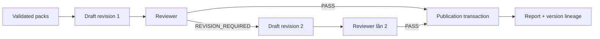

# Tạo, review và lưu báo cáo

**Status: Implemented, publication nội bộ.** Report là kết quả của full `agent-v1` run; specialist run không tạo report. `reports` không phải bản draft: draft và review là artifact nội bộ, còn publication transaction mới tạo report record để UI đọc.

Report Agent dựng draft từ Data, Comparison, Chart, Analyst và Insight. Reviewer nạp lại persisted artifact graph, kiểm hash, scope, số liệu, claim, chart và lineage. Một yêu cầu sửa cho phép đúng một draft revision; lần review thứ hai vẫn chưa đạt thì run thất bại `REVIEW_REVISION_LIMIT`. Provider failure không tạo `PASS` giả.

`publishReviewedDraft` khóa run, kiểm lease/fencing, predecessor task thành công, validation của mọi artifact, draft/review `PASS` và nguồn import, rồi ghi final report artifact và report record trong cùng transaction. `report_versions` gán lineage/version: một yêu cầu update có report context hợp lệ tạo report mới liên kết report trước; report cũ không bị sửa. UI cho phép xem và export JSON/CSV, không có trình soạn thảo draft hoặc phát hành ra kênh ngoài.

Code: `src/backend/packages/agents/src/analysis-v1/stages/reviewer.ts`, `src/backend/packages/agents/src/analysis-v1/stages/publication.ts`, `src/backend/packages/db/src/transactions/publish-reviewed-draft.ts`, `src/backend/packages/db/src/repositories/workspace-repository.ts`. Xem [reports](../platform/reports.md) và [evidence validation](../agents/evidence-validation.md).
